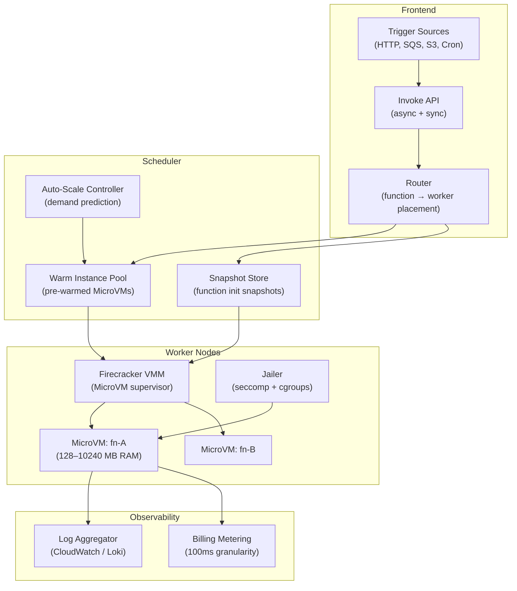
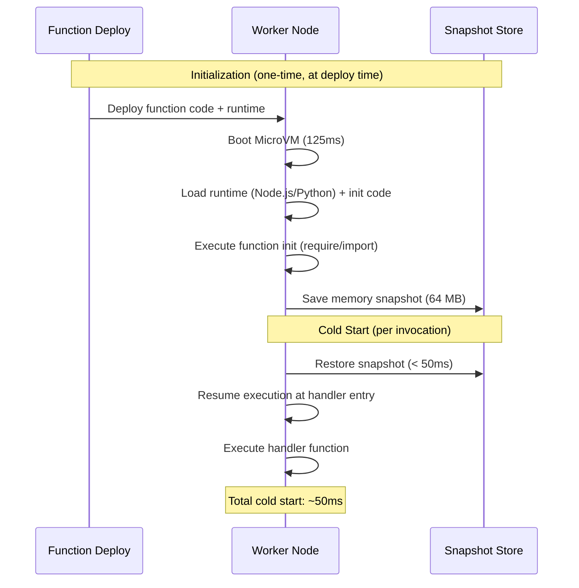
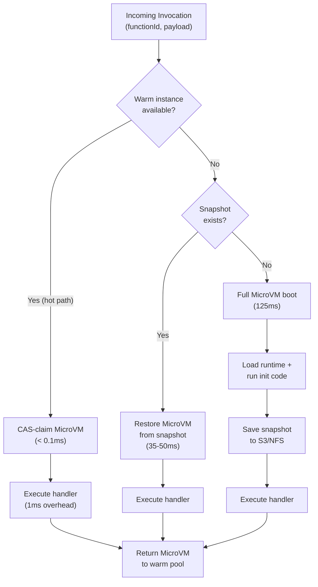
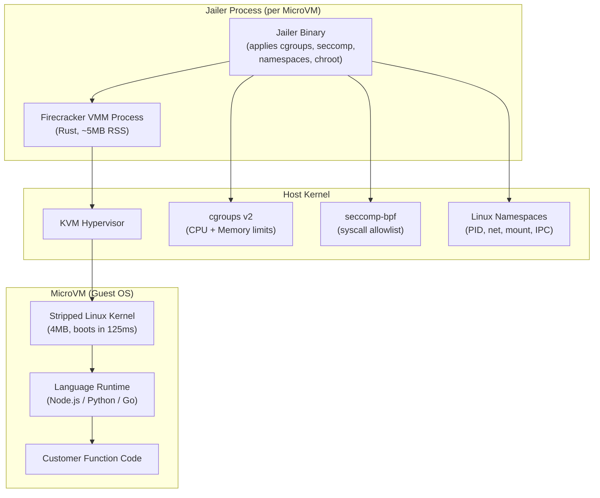

# Design a Serverless Execution Framework — 50ms Cold Start, Scale to Zero

**Difficulty**: 🔴 Advanced
**Reading Time**: 30 minutes
**Interview Frequency**: High — asked at cloud providers, platform engineering, and infrastructure-focused companies

---

## Problem Statement

You are asked to design a serverless execution framework that:

- **Works at**: 10 functions with predictable traffic — always-warm containers have no cold start.
- **Breaks at**: 10,000 functions with bursty, unpredictable traffic — keeping all 10,000 always-warm wastes $2M/month; true scale-to-zero creates 5–10 second cold starts (Docker container startup); per-tenant isolation requires new sandbox for every cold start; billing accuracy at 100ms granularity needs sub-ms timekeeping.

Target: **< 50ms cold start**, **scale to zero** (0 idle cost), **per-invocation billing at 100ms granularity**, **strong isolation** (multi-tenant, untrusted code), **1M function invocations/second** globally.

---

## Requirements

### Functional Requirements

| Requirement | Description |
|-------------|-------------|
| Code Execution | Run arbitrary code (Node.js, Python, Go, Java) |
| Scale to Zero | No idle capacity billing when function inactive |
| Event Triggers | HTTP, queue messages, cron, S3 events |
| Concurrency | Horizontal scaling to handle burst traffic |
| Isolation | Each invocation in isolated sandbox (multi-tenant) |
| Execution Logs | Capture stdout/stderr per invocation |

### Non-Functional Requirements

| Requirement | Target |
|-------------|--------|
| Cold Start Latency | < 50 ms (MicroVM snapshot/restore) |
| Warm Invocation Latency | < 1 ms framework overhead |
| Scale-Out Speed | 1,000 new instances/second burst |
| Billing Granularity | 100 ms increments, 1 ms precision |
| Memory Range | 128 MB to 10 GB per function |
| Maximum Execution Time | 15 minutes per invocation |

---

## Capacity Estimates

- **1M invocations/second** × 500ms avg duration = **500,000 concurrent function instances**
- **MicroVM boot time**: Firecracker boots in ~125ms cold; with snapshot/restore → **< 50ms**
- **Memory per MicroVM**: 128 MB minimum, typical Node.js = 256 MB → 256K concurrent functions on 64 TB cluster RAM
- **Storage for snapshots**: 1 snapshot per function version (~64 MB) × 10,000 functions × 10 versions = **6.4 TB snapshot storage**
- **Function package cache**: Average function zip = 10 MB × 10,000 functions = **100 GB** (fits in RAM on worker fleet)

---

## High-Level Architecture



---

## Level 1 — Surface: Cold Start vs. Always-Warm Trade-off

| Approach | Cold Start | Idle Cost | Use Case |
|----------|-----------|-----------|----------|
| **Container (Docker)** | 1–5 seconds | Low (scale to 0) | Dev/test, infrequent functions |
| **Always-warm pool** | < 1 ms | High ($2M/month for 10K fns) | Latency-critical, high-traffic |
| **MicroVM snapshot/restore** | 50–150 ms | Low (snapshot stored, not running) | **Production serverless** |
| **Process-based (V8 isolate)** | < 5 ms | Very low | Same-language isolation (Cloudflare Workers) |

**AWS Lambda uses Firecracker MicroVM**: boots in 125ms from scratch, < 50ms from snapshot. Google Cloud Run uses containers. Cloudflare Workers use V8 isolates (< 5ms, same-language only).

---

## Level 2 — Deep Dive: MicroVM and Snapshot/Restore

### Why Not Docker Containers for Serverless?

Docker containers share the host kernel — container startup = pulling layers + namespace setup = 1–5 seconds. Multi-tenant security is harder (shared kernel = larger attack surface).

**Firecracker MicroVM**:
- Full hardware virtualization (KVM-based)
- Each function runs in isolated kernel (< 5 MB memory footprint for VMM)
- Boot time: ~125 ms from zero to running
- Security: virtualized hardware boundary, not just namespace isolation

### Snapshot/Restore for 50ms Cold Start



The key insight: **function initialization code** (importing libraries, connecting to DB) runs once at deploy time during snapshot creation. On cold start, we restore the snapshot — the function is already past the expensive init phase.

### Concurrency Limits and Throttling

Each AWS account has a default limit of **3,000 concurrent invocations** (soft limit, can increase). The scaling model:

- **Burst limit**: 3,000 new instances/minute (not per second)
- **Steady-state scaling**: 500 additional instances/minute
- Beyond burst limit: requests are queued (sync) or held in SQS (async)

This prevents one customer from consuming all capacity on shared worker fleet.

---

## Key Design Decisions

### 1. Process Isolation: gVisor vs. Firecracker vs. V8 Isolates

| Technology | Isolation Level | Cold Start | Use Case |
|------------|----------------|-----------|----------|
| **V8 Isolates** (Cloudflare Workers) | JS engine isolation | < 5 ms | Single-language (JS only), untrusted code |
| **gVisor** (Google) | Syscall interception | 20–50 ms | Multi-language, moderate security |
| **Firecracker MicroVM** (AWS Lambda) | Full hardware virtualization | 50–125 ms | Strongest isolation, arbitrary code |
| **Docker + seccomp** | Namespace + syscall filter | 500ms–5s | Dev workloads, trusted code |

**Decision**: Firecracker for strong multi-tenant isolation with acceptable 50ms cold start. V8 isolates for JavaScript-only functions requiring ultra-low latency.

### 2. Billing Precision

Billing per 100ms invocation requires measuring actual execution time (not wall clock). Implementation:

1. Start timer when function handler is called (not MicroVM boot)
2. Round up to nearest 100ms
3. Charge for memory × duration (e.g., 256 MB × 200ms = 51,200 MB-ms)
4. AWS Lambda pricing: $0.0000166667 per GB-second

Metering data is written to a high-throughput append-only log (Kinesis/Kafka) and aggregated per billing cycle.

### 3. Pre-Warming Heuristics

Scale-to-zero creates cold starts. Pre-warm heuristics reduce cold start frequency:

- **Traffic prediction**: If function had > 100 invocations yesterday at 9am, pre-warm at 8:55am today
- **Minimum instances**: Allow customers to set `minInstances = 1` (pay for always-warm)
- **KeepAlive pings**: CloudWatch Events trigger function every 5 minutes to prevent eviction
- **Provisioned Concurrency** (AWS): Pre-warm N instances, billed continuously

---

## Interview Questions

| Question | What They're Testing | Key Answer Points |
|----------|---------------------|-------------------|
| How do you achieve 50ms cold start vs. 5 seconds for Docker? | Technical depth | MicroVM snapshot/restore: function init runs once at deploy → save 64 MB memory snapshot → cold start restores snapshot in < 50ms, bypassing init |
| How do you handle 10,000 concurrent invocations bursting from zero? | Scaling design | Pre-warmed MicroVM pool (generic, not function-specific); router assigns function code to warm MicroVM; burst limited to 3,000/minute to protect shared infrastructure |
| Why use MicroVM instead of containers for isolation? | Security knowledge | Containers share host kernel (namespace isolation only) — kernel exploit affects all containers; MicroVM has dedicated kernel per function, hardware virtualization boundary, < 5MB VMM footprint |

---

## Component Deep Dive 1: Scheduler and Warm Instance Pool

The Scheduler is the most critical component in a serverless framework — it is the system that decides in under 1 ms whether to reuse an existing warm MicroVM, restore a snapshot, or boot from scratch. Getting this wrong means either wasting millions of dollars on idle VMs or delivering unacceptable cold-start latency to customers.

### How the Scheduler Works Internally

The Scheduler maintains three data structures in memory (backed by Redis for durability):

1. **Warm Pool Index** — a per-function map of `functionId → [microVMId, ...]` listing all currently warm, idle MicroVMs. Each entry has a last-used timestamp and a TTL (default 5–15 minutes). A background sweeper evicts instances past TTL to reclaim RAM.

2. **Snapshot Registry** — a mapping of `functionId:versionHash → s3://bucket/path` pointing to the frozen memory snapshot. The scheduler checks this when the warm pool for a given function is empty.

3. **Pending Invocations Queue** — when no warm instance is available and a new MicroVM must be started, the invocation waits here. The scheduler signals a Worker Node to restore/boot a new instance and dequeues the invocation once ready.

The placement algorithm runs in roughly 3 phases per incoming request:

- **Phase 1 (< 0.1 ms)**: Lock-free read of the warm pool index. If a warm instance exists, atomically claim it (compare-and-swap) and route the invocation directly. This is the hot path — the 1 ms overhead target lives here.
- **Phase 2 (< 5 ms decision, 50 ms execution)**: If the warm pool is empty but a snapshot exists, pick the lowest-load worker node and dispatch a "restore snapshot" command. The invocation waits in the pending queue (median 35–50 ms).
- **Phase 3 (< 5 ms decision, 125 ms execution)**: If no snapshot exists (first invocation ever, or snapshot evicted), dispatch a full MicroVM boot. During boot, the scheduler also triggers snapshot creation so future cold starts hit Phase 2.



### Why Naive Approaches Fail at Scale

A naive scheduler that simply maintains one queue per function breaks at 10,000 functions because:

- **Memory**: 10,000 queues × per-entry struct overhead = significant in-process RAM.
- **Lock contention**: A single mutex per function queue means burst traffic (1,000 invocations/sec for one function) causes lock-wait time to dominate, adding 10–50 ms of scheduling overhead.
- **Uneven worker load**: Random assignment ignores memory pressure — a worker already at 90% memory usage may accept a 10 GB function and OOM-kill existing instances.

Production schedulers use **consistent hashing with load awareness**: route invocations for `functionId` to a preferred worker (so warm instances are reused locally) but fall back to any underloaded worker when the preferred worker is saturated.

### Scheduler Implementation Options

| Approach | Latency | Throughput | Trade-off |
|----------|---------|------------|-----------|
| Single central scheduler (Redis-backed) | 0.5–2 ms | ~200k decisions/sec | Simple; single point of failure; Redis bottleneck at extreme scale |
| Distributed schedulers with gossip (consistent hash ring) | 1–5 ms | 2M+ decisions/sec | No single bottleneck; complex rebalancing on node join/leave |
| Worker-local greedy scheduling (pull model) | < 0.5 ms | Unbounded (fully distributed) | Workers pull work; requires central queue; harder to enforce placement policies |

AWS Lambda uses a centralized placement service (internally called the "Placement Service") backed by a highly available cluster, with per-AZ sharding to avoid cross-AZ latency.

---

## Component Deep Dive 2: Firecracker VMM and Jailer Security Layer

The Worker Node runs the Firecracker Virtual Machine Monitor (VMM) alongside the Jailer — a security boundary wrapper that sandboxes each MicroVM using Linux kernel primitives. This two-layer security model is what makes shared-infrastructure multi-tenant execution safe.

### How Firecracker Works Internally

Firecracker is a KVM-based VMM written in Rust. Each MicroVM gets:

- **vCPUs**: 1–N virtual CPUs mapped 1:1 to host Linux threads
- **virtio-net**: paravirtualized network interface (lower overhead than emulated NIC)
- **virtio-blk**: paravirtualized block device for function storage
- **Stripped-down device model**: Firecracker deliberately omits PCI bus, USB, GPU, BIOS — this reduces attack surface and is why boot takes 125 ms instead of 60 seconds for a full VM

The Jailer wraps each Firecracker process with:

1. **cgroups v2**: CPU and memory limits enforced by the kernel. A function configured for 256 MB cannot exceed 256 MB — excess allocations trigger OOM kill inside the MicroVM, not on the host.
2. **seccomp-bpf**: A strict syscall allowlist. A Firecracker process running a Node.js function only needs ~50 syscalls; the other ~350 Linux syscalls are blocked. A syscall outside the allowlist immediately kills the process.
3. **Linux namespaces**: Each MicroVM gets its own PID, mount, network, and IPC namespace — completely invisible to other tenants.
4. **chroot jail**: The MicroVM root filesystem is chroot'd to an isolated directory; it cannot traverse to the host filesystem.



### Scale Behavior at 10x Load

A single bare-metal host (96 vCPU, 768 GB RAM) running Firecracker can host approximately:

- **3,000 simultaneous 256 MB MicroVMs** (768 GB / 256 MB = 3,000)
- **VM creation rate**: ~150 new MicroVMs/second from snapshot (bottleneck: memory copy bandwidth ~10 GB/s; 64 MB snapshot × 150 = 9.6 GB/s)
- At 10x load (1,500 new VMs/second needed per host), snapshot restore becomes the bottleneck. Mitigation: use Copy-on-Write (CoW) snapshot pages — the snapshot is mapped read-only, guest pages are copied only on write. This reduces effective restore cost to < 10 MB of actual memory copy for small functions.

AWS reports in the Firecracker NSDI paper that they can boot **150 MicroVMs/second** per host using CoW page mapping, and that a Firecracker MicroVM uses **< 5 MB RSS** for the VMM process itself (versus ~50 MB for QEMU).

---

## Component Deep Dive 3: Billing Metering and Log Aggregation

Billing accuracy is a correctness and trust problem: underbilling loses revenue, overbilling loses customers. At 1M invocations/second, even a 1% rounding error across 1M × $0.000020 = $20/second means $600/month in systematic error.

### How Billing Metering Works

The billing system measures **actual handler execution time**, not wall clock time or MicroVM uptime:

1. **Timer start**: When the runtime agent inside the MicroVM calls the function handler, it records a high-resolution monotonic timestamp (`clock_gettime(CLOCK_MONOTONIC)`).
2. **Timer stop**: When the handler returns (or throws), the timestamp is read again. Delta = execution duration.
3. **Rounding**: Rounded up to the nearest 100ms boundary (AWS Lambda does 1ms rounding as of 2021; 100ms was the historical model).
4. **Metering event**: Emitted as a structured log record to an in-process buffer, flushed to a Kinesis-equivalent stream every 100ms.
5. **Aggregation**: A downstream billing aggregator consumes the stream, groups by `accountId:functionId`, and writes hourly summaries to a billing database (DynamoDB or similar).

The key technical detail: **the timer runs inside the guest MicroVM**, not on the host. This prevents billing for time when the scheduler was routing or the VMM was doing overhead work. The metering event includes both `executionMs` and `billedMs` (rounded up) to allow audit.

For log aggregation (stdout/stderr), the runtime agent pipes function output through the Firecracker virtio-serial device to a host-side log collector. At 1M invocations/second × average 1 KB log output = **1 GB/second** of log data — this requires write-optimized log storage (Apache Parquet on S3, queried by Athena) rather than a general-purpose database.

| Billing Model | Granularity | Precision | Complexity |
|--------------|-------------|-----------|------------|
| 100ms rounding (historical Lambda) | 100ms | ±100ms worst case | Simple arithmetic |
| 1ms rounding (current Lambda) | 1ms | ±1ms worst case | Still simple; floor at 1ms |
| Exact duration (Google Cloud Functions) | Microseconds | < 1ms | Requires sub-ms monotonic clock, more storage |

---

## Data Model

The core data model spans three storage layers: function metadata (relational), execution state (key-value), and billing records (append-only log).

```sql
-- Function registry: one row per deployed function version
CREATE TABLE function_versions (
    function_id       UUID         NOT NULL,
    account_id        UUID         NOT NULL,
    version_hash      CHAR(64)     NOT NULL,  -- SHA-256 of zip content
    runtime           VARCHAR(20)  NOT NULL,  -- 'nodejs20.x', 'python3.12', 'go1.22'
    handler           VARCHAR(255) NOT NULL,  -- 'index.handler'
    memory_mb         SMALLINT     NOT NULL DEFAULT 256,
    timeout_seconds   SMALLINT     NOT NULL DEFAULT 30,
    max_concurrency   INT,                    -- NULL = unlimited (account limit applies)
    env_vars_kms_arn  TEXT,                   -- KMS-encrypted environment variables
    code_s3_uri       TEXT         NOT NULL,  -- s3://lambda-code-bucket/account/fn/hash.zip
    snapshot_s3_uri   TEXT,                   -- s3://snapshots/account/fn/hash.snap; NULL if not yet snapshotted
    snapshot_size_mb  INT,
    created_at        TIMESTAMPTZ  NOT NULL DEFAULT now(),
    PRIMARY KEY (function_id, version_hash)
);
CREATE INDEX ON function_versions (account_id);
CREATE INDEX ON function_versions (version_hash);

-- Warm instance tracking: maintained in Redis, mirrored to DB for audit
-- Redis key: warm_pool:{function_id}:{version_hash} → sorted set of microvm_ids by idle_since
-- Relational mirror for monitoring:
CREATE TABLE microvm_instances (
    microvm_id        UUID         NOT NULL PRIMARY KEY,
    worker_node_id    VARCHAR(64)  NOT NULL,
    function_id       UUID         NOT NULL,
    version_hash      CHAR(64)     NOT NULL,
    status            VARCHAR(20)  NOT NULL,  -- 'warm', 'running', 'booting', 'draining'
    memory_mb         SMALLINT     NOT NULL,
    created_at        TIMESTAMPTZ  NOT NULL,
    last_invoked_at   TIMESTAMPTZ,
    invocation_count  INT          NOT NULL DEFAULT 0
);

-- Billing metering events (append-only, high-volume — stored in Parquet on S3)
-- Schema for the streaming record (Avro/Protobuf in practice):
-- {
--   invocation_id:    "01J4XVZ...",          -- ULID
--   account_id:       "acct_abc123",
--   function_id:      "fn_xyz789",
--   version_hash:     "a3f8c...",
--   request_at:       1748700000000,         -- epoch ms (invocation received)
--   execution_start:  1748700000048,         -- epoch ms (handler called)
--   execution_end:    1748700000248,         -- epoch ms (handler returned)
--   execution_ms:     200,                   -- actual handler duration
--   billed_ms:        200,                   -- rounded up to 100ms boundary
--   memory_mb:        256,
--   gb_seconds:       0.051200,             -- (256/1024) * (200/1000)
--   region:           "us-east-1",
--   cold_start:       false,
--   error_type:       null                   -- 'Timeout', 'OOMKill', 'Unhandled', or null
-- }

-- Invocation event log for per-function analytics
CREATE TABLE invocation_summary (
    window_start      TIMESTAMPTZ  NOT NULL,  -- 1-minute window
    function_id       UUID         NOT NULL,
    account_id        UUID         NOT NULL,
    total_invocations INT          NOT NULL,
    p50_duration_ms   FLOAT        NOT NULL,
    p99_duration_ms   FLOAT        NOT NULL,
    cold_starts       INT          NOT NULL,
    errors            INT          NOT NULL,
    total_gb_seconds  FLOAT        NOT NULL,
    PRIMARY KEY (window_start, function_id)
);
```

---

## Scale Bottlenecks

| Traffic Level | Component That Breaks | Symptoms | Mitigation |
|---------------|----------------------|----------|------------|
| 10x baseline (10M invocations/sec) | Scheduler Redis warm-pool index | Redis CPU saturates; scheduling latency rises from 0.5 ms to 10–50 ms | Shard Redis by function_id range; move to local-cache (worker-side LRU) with eventual sync |
| 10x baseline | Worker-to-snapshot-store bandwidth | Snapshot restores queue up; cold start latency rises to 200–500 ms | Store snapshots on local NVMe per worker; replicate hot snapshots to top-N workers using frequency scoring |
| 100x baseline (100M invocations/sec) | Billing Kinesis stream | 100 GB/second of metering events overwhelms per-shard 1 MB/s limit (needs 100,000 shards) | Aggregate billing locally in runtime agent per 1-second window; emit 1 aggregate event per second per function per worker instead of per-invocation |
| 100x baseline | Log aggregation pipeline | stdout/stderr ingestion at 100 GB/s exceeds log collector write bandwidth | Sampling: collect 100% of first 10 invocations per function, then 1% sample; full logs only on error |
| 1000x baseline (1B invocations/sec) | Global control plane (scheduler, placement) | Cross-region placement decisions create 50–100 ms round-trip overhead | Regional autonomy: each region has independent scheduler; global control plane only for billing aggregation and account-level limits |
| 1000x baseline | DNS and HTTP routing to Invoke API | 1B req/sec cannot be served by a centralized Invoke API fleet | Route triggers directly to regional edge (Anycast IP + regional API pods); no global Invoke API fan-in |

---

## How AWS Lambda Built This

AWS Lambda is the production reference implementation for serverless execution at scale. Published details from the 2020 Firecracker NSDI paper and AWS re:Invent talks reveal the following specifics:

**Scale**: Lambda handles over **1 trillion function invocations per month** (AWS re:Invent 2023), equivalent to ~385M invocations/second at peak or ~11.5M/second average. Each AWS region independently routes and executes functions.

**Technology choices**:
- **Firecracker** (open-sourced 2018): KVM-based MicroVM in Rust. The team chose Rust specifically because C memory safety bugs in a shared-infrastructure multi-tenant VMM are catastrophic — a single heap overflow in the VMM process could compromise all tenants on that host.
- **Snapshot format**: Firecracker snapshots use Linux `userfaultfd` for lazy page faulting — the MicroVM starts executing immediately and pages are loaded from the snapshot file on demand (copy-on-write). This is what enables the < 50 ms restore time despite 64 MB snapshot size.
- **Worker fleet**: Amazon EC2 bare-metal instances (m5.metal, c5.metal) — not virtualized EC2 instances — because nested virtualization (EC2 VM → Firecracker MicroVM) adds 5–15% CPU overhead. Direct KVM access on bare metal eliminates this.

**Non-obvious architectural decision**: Lambda does **not** assign a MicroVM to a specific customer at boot time. The warm pool contains **function-agnostic** pre-booted MicroVMs running only a minimal stub. When a function needs a cold start, the scheduler injects the function code and snapshot into a warm stub MicroVM. This "slot" model separates MicroVM boot time (125 ms, done ahead of time) from function initialization time (handled by snapshot restore, 35–50 ms). Without this separation, cold start = 125 ms + init time, which often exceeded 1 second for Java/Python functions with heavy dependencies.

**Provisioned Concurrency** (launched 2019) addresses the remaining latency problem for latency-critical functions: customers pay to keep N MicroVMs continuously warm, fully initialized (post-snapshot-restore), ready to handle requests with < 1 ms overhead. This generates ~15–20% of Lambda revenue while serving < 1% of invocation volume.

Source: [Firecracker: Lightweight Virtualization for Serverless Applications, NSDI 2020](https://www.usenix.org/conference/nsdi20/presentation/agache) and [AWS re:Invent 2023 Lambda deep-dive session](https://reinvent.awsevents.com/).

---

## Interview Angle

**What the interviewer is testing:** Whether you understand the full lifecycle of a function invocation — from trigger reception through sandbox allocation, execution, billing, and warm-pool recycling — and whether you can identify the specific bottlenecks at each stage of scaling.

**Common mistakes candidates make:**

1. **Treating cold start as a single number.** Candidates say "cold start is 50 ms" without decomposing it: MicroVM restore (35–50 ms) + function handler entry + first DB connection (100–500 ms). The snapshot eliminates the init phase, but the first DB connection inside the handler is still cold. Interviewers expect you to distinguish framework cold start from application-level cold start.

2. **Ignoring the warm pool eviction strategy.** Scale-to-zero means warm instances must be evicted. Candidates who don't discuss TTL policy, LRU eviction under memory pressure, or the cost of keeping warm instances too long (wasted RAM) or too short (more cold starts) reveal they haven't thought about steady-state operation.

3. **Underestimating billing complexity.** Saying "just record start and end time" ignores: what happens on timeout (bill for full 15 minutes?), what happens on OOM kill (bill for actual duration or configured memory?), how you handle clock skew between host and guest, and how you prevent double-billing on retry after a worker node crash.

**The insight that separates good from great answers:** The snapshot/restore optimization only works because **function initialization is deterministic and side-effect-free** (loading libraries, parsing config). If init code establishes mutable external state (opens a DB transaction, registers a webhook), you cannot safely restore a snapshot — each invocation needs fresh init. Great candidates recognize this constraint and discuss how Lambda's programming model (handler functions, not long-running processes) was deliberately designed to make snapshot/restore safe.

---

## Key Numbers to Remember

| Metric | Value | Context |
|--------|-------|---------|
| Full MicroVM boot time | 125 ms | Firecracker from zero, no snapshot; includes guest kernel boot |
| Snapshot restore cold start | 35–50 ms | Firecracker with CoW snapshot; function bypasses init phase |
| V8 isolate cold start | < 5 ms | Cloudflare Workers; JavaScript only; no separate kernel |
| Docker container cold start | 1–5 seconds | Depends on image pull time and layer caching |
| Firecracker VMM memory overhead | < 5 MB RSS | Per MicroVM VMM process; QEMU comparable is ~50 MB |
| Concurrent MicroVMs per host | ~3,000 | 768 GB RAM / 256 MB per function = 3,000 instances |
| Snapshot restore rate per host | 150 MicroVMs/sec | Memory copy bandwidth bottleneck (~9.6 GB/s) |
| AWS Lambda global invocations | 1 trillion/month | ~385M peak invocations/sec across all regions |
| Lambda burst scaling limit | 3,000 new instances/minute | Per account default; protects shared fleet |
| Billing granularity (current Lambda) | 1 ms | Rounds up; minimum 1 ms; memory × duration pricing |
| Snapshot size (typical) | 64 MB | 256 MB function with CoW; actual dirty pages much smaller |
| Function package cache (10K fns) | 100 GB | 10 MB avg zip × 10,000 = fits in RAM on worker fleet |

---

## 📚 Resources & References

| Resource | Type | What You'll Learn |
|----------|------|------------------|
| [Firecracker NSDI 2020 Paper](https://www.usenix.org/conference/nsdi20/presentation/agache) | 📖 Blog | Firecracker internals, MicroVM design, cold start optimization |
| [AWS Lambda Best Practices](https://aws.amazon.com/blogs/architecture/best-practices-for-developing-on-aws-lambda/) | 📖 Blog | Lambda architecture, concurrency model, cold start mitigation |
| [Cloudflare Workers Architecture](https://blog.cloudflare.com/cloudflare-workers-unleashed/) | 📖 Blog | V8 isolate approach, ultra-low cold start, JavaScript-only constraints |
| [ByteByteGo YouTube](https://www.youtube.com/@ByteByteGo) | 📺 YouTube | Serverless architecture patterns, Lambda internals explained visually |

---

## Related Concepts

- [Container Orchestration](./container-orchestration) — serverless builds on container primitives
- [Rate Limiter](./rate-limiter) — concurrency limits in serverless are a form of rate limiting
- [Distributed Tracing](./distributed-tracing) — tracing distributed serverless function chains
