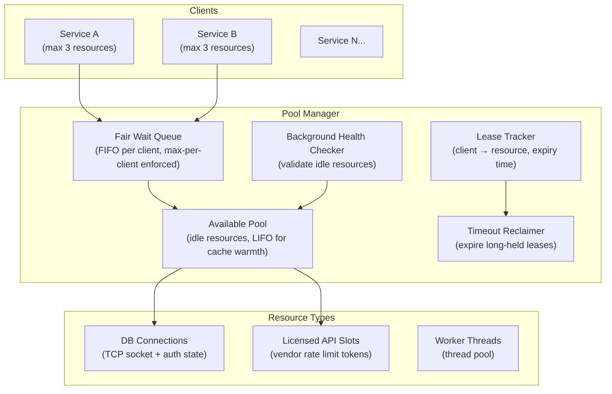
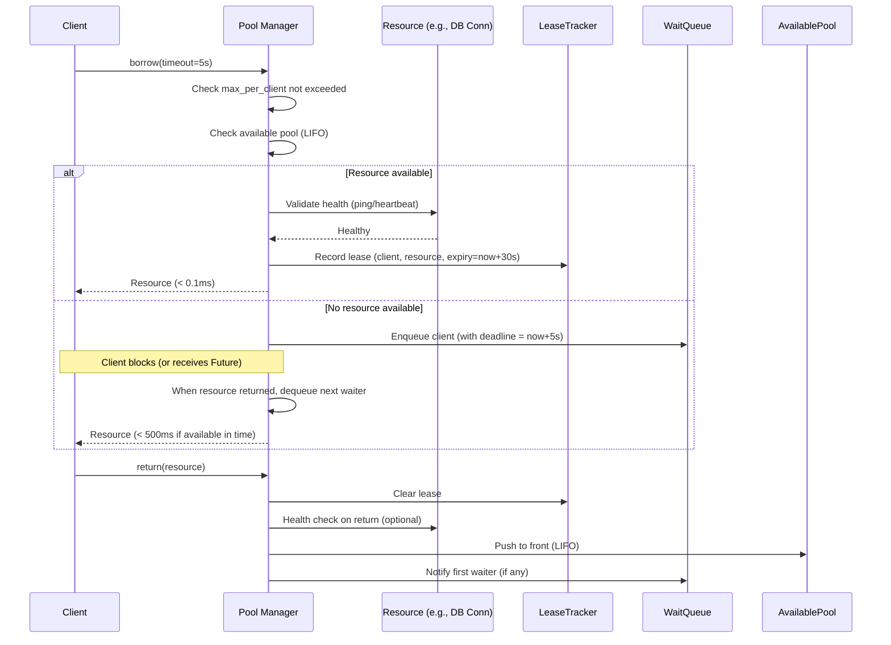

# Design a Service Pool Allocation System — 1,000 Clients, No Starvation

**Difficulty**: 🔴 Advanced (Hard)
**Reading Time**: 22 minutes
**Interview Frequency**: Medium — asked at database middleware, connection pooling, and platform engineering roles

---

## Problem Statement

You are asked to design a resource pool manager that:

- **Works at**: 10 clients sharing 5 DB connections — simple connection pool with a semaphore handles this.
- **Breaks at**: 1,000 microservices sharing 50 expensive licensed API connections — one service can hoard all 50 connections; long-running requests hold connections indefinitely; a service that never returns connections deadlocks the pool; health-checking borrowed connections has overhead; pool size tuning is art, not science.

Target: **50 pooled resources** (connections, licenses, worker threads), **1,000 client services**, **fair queuing**, **timeout + reclamation**, **health checking**, **no starvation**, **sub-millisecond allocation from warm pool**.

---

## Requirements

### Functional Requirements

| Requirement | Description |
|-------------|-------------|
| Borrow | Client borrows resource, blocks if pool empty (up to timeout) |
| Return | Client returns resource to pool for reuse |
| Max Per Client | Limit how many resources one client can hold simultaneously |
| Timeout + Reclaim | Auto-return resource after max hold time expires |
| Health Check | Validate resource before lending (detect stale connections) |
| Pool Resize | Dynamically grow/shrink pool based on demand |

### Non-Functional Requirements

| Requirement | Target |
|-------------|--------|
| Borrow Latency (warm) | < 0.1 ms (resource available in pool) |
| Borrow Latency (wait) | < 500 ms (wait in queue, timeout after 5s) |
| Resource Utilization | > 85% of pool in use during peak |
| Max Per Client | Configurable (default: 5% of pool size) |
| Health Check Overhead | < 5% of borrow operations (check on return, not borrow) |
| Reclamation Accuracy | Detect leaked resources within 30 seconds |

---

## Capacity Estimates

- **50 resources**, **1,000 clients** → average 50 clients per resource
- **Each resource held avg 100ms** → 50 resources × 10/second throughput = **500 borrows/second** capacity
- **1,000 clients × 2 borrows/sec each = 2,000 borrows/sec** → queue depth ~(2000-500)/10 = **150 clients waiting** at peak
- **Resource lease size**: 1 KB metadata per lease × 1,000 concurrent leases = 1 MB (trivial)
- **Wait queue**: 1,000 clients × 256 bytes queue entry = 256 KB (trivial)

---

## High-Level Architecture



---

## Level 1 — Surface: Object Pool Pattern

The pool pattern avoids expensive resource creation on every request:

**Without pool** (new connection per request):
- Client needs DB connection: open TCP, TLS handshake, authenticate = **50–200ms** per operation
- 1,000 concurrent requests = 1,000 simultaneous DB connections → overwhelms DB

**With pool** (reuse connections):
- Client borrows pre-established connection: < 0.1ms
- Return after use: connection stays warm for next client
- DB sees 50 connections (pool size), not 1,000

Key insight: **pool size ≠ throughput**. A pool of 50 connections at 100ms avg hold time serves 500 requests/second. Adding more connections beyond DB capacity degrades performance.

---

## Level 2 — Deep Dive: Borrow/Return Protocol



### LIFO vs. FIFO for Available Pool

| Order | Cache Warmth | Fairness |
|-------|-------------|----------|
| **LIFO** | High — most recently used connection is warm | Lower — same connection used repeatedly |
| **FIFO** | Lower — oldest connection might be stale | Higher — all connections get even use |

**Best practice**: LIFO for available pool (warm connections), FIFO for wait queue (fair ordering of waiters).

### Starvation Prevention

Without per-client limits: Service A submits 1,000 borrow requests → acquires all 50 resources → Services B-Z starve.

**Max-per-client enforcement**:
```
borrow(client_id):
    current_held = leases_by_client[client_id].count()
    if current_held >= max_per_client:  # e.g., 5% of pool = 2-3 resources
        raise QuotaExceededException
    # else proceed with borrow
```

**Fair queuing**: If Service A has 3 resources (max), its subsequent borrow requests go to the back of the wait queue behind other services that have fewer resources. This is **work-conserving max-min fairness**.

### Timeout and Reclamation

```
// Background reclaimer (runs every 5 seconds)
for lease in active_leases:
    if lease.expiry < now:
        log("WARNING: lease expired for client {}", lease.client_id)
        resource = lease.resource
        active_leases.remove(lease)
        resource.reset()  // Clear any in-flight state
        available_pool.push(resource)
        alert_client(lease.client_id, "resource reclaimed")
```

Reclamation is a safety net — it shouldn't trigger in normal operation. Alert if reclamation rate > 1%. Common causes: client crash, long-running query, deadlock.

---

## Key Design Decisions

### 1. Fixed vs. Dynamic Pool Size

| Approach | Pros | Cons |
|----------|------|------|
| **Fixed** | Predictable, simple | Under-provisioned during bursts, over-provisioned during low traffic |
| **Dynamic (grow on demand)** | Efficient resource use | May overwhelm downstream (DB accepts max 100 connections) |
| **Dynamic with ceiling** | Best of both | More complex, requires monitoring |

**HikariCP approach**: Start with `minimumIdle` connections. Grow to `maximumPoolSize` as demand increases. Shrink back to `minimumIdle` when idle for `keepaliveTime`. Never exceed downstream service's connection limit.

### 2. Resource Validation Strategy

| When to Validate | Overhead | Stale Connection Risk |
|-----------------|----------|----------------------|
| **On borrow (every time)** | High (adds 1ms+ per borrow) | None |
| **On return** | Medium | Low (validated recently) |
| **Background heartbeat** | Low (periodic) | Medium (may have stale window) |
| **On borrow (if idle > N ms)** | Low (rare for active pool) | Low |

**HikariCP default**: Validate on borrow only if connection was idle > 500ms (`connectionTestQuery` or `isValid()`). Background heartbeat every `keepaliveTime` ms for idle connections.

### 3. Pool Sizing Formula

**Little's Law**: `pool_size = throughput × average_hold_time`
- 500 requests/sec × 0.1 sec (100ms avg hold) = **50 connections needed**

**Practical adjustment**: Add 20% headroom for bursts → 60 connections. But if DB max connections = 100 and there are 2 app servers, cap at 50/server.

---

## Interview Questions

| Question | What They're Testing | Key Answer Points |
|----------|---------------------|-------------------|
| How do you prevent one service from starving others? | Fairness | Max-per-client quota (e.g., max 5% of pool per client); fair FIFO wait queue; clients over quota are rejected immediately, not queued indefinitely |
| What happens if a client crashes while holding a resource? | Failure mode | Lease expiry timer reclaims resource after timeout (30s–2min); client health check (gRPC keepalive / TCP keepalive) detects crash earlier; resource reset clears any in-flight state |
| How do you tune pool size? | Performance knowledge | Little's Law: pool size = RPS × avg hold time; validate with load test; too small = queuing delays; too large = overwhelms downstream; monitor "pool wait time" metric — should be < 10ms at p99 |

---

## 📚 Resources & References

| Resource | Type | What You'll Learn |
|----------|------|------------------|
| [HikariCP Pool Sizing Wiki](https://github.com/brettwooldridge/HikariCP/wiki/About-Pool-Sizing) | 📖 Blog | Practical pool sizing, Little's Law, database connection limits |
| [Martin Fowler — Object Pool](https://martinfowler.com/bliki/ObjectPool.html) | 📖 Blog | Pattern definition, when to use, trade-offs |
| [High Scalability Blog](https://highscalability.com) | 📖 Blog | Connection pooling at scale, real production war stories |
| [Hussein Nasser YouTube](https://www.youtube.com/@hnasr) | 📺 YouTube | Connection pooling deep dives, database proxies (PgBouncer) |

---

## Related Concepts

- [Rate Limiter](./rate-limiter) — per-client quotas in pool are a form of rate limiting
- [Resource Allocation](./resource-allocation) — cluster-level resource allocation vs. pool-level
- [Distributed Locking](./distributed-locking) — the pool manager itself needs a distributed lock for multi-instance deployment
