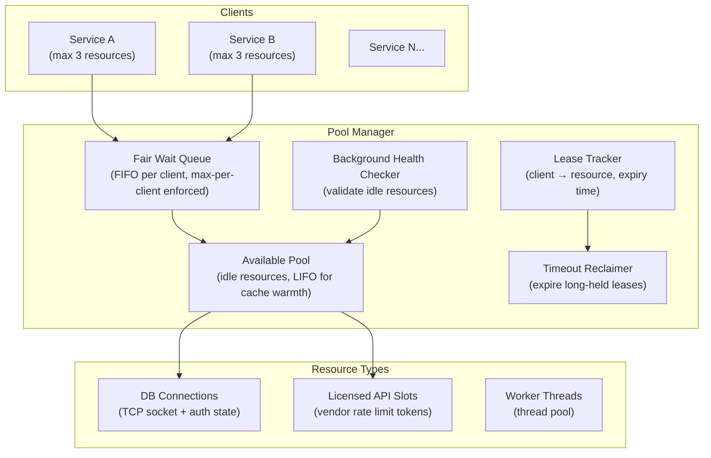
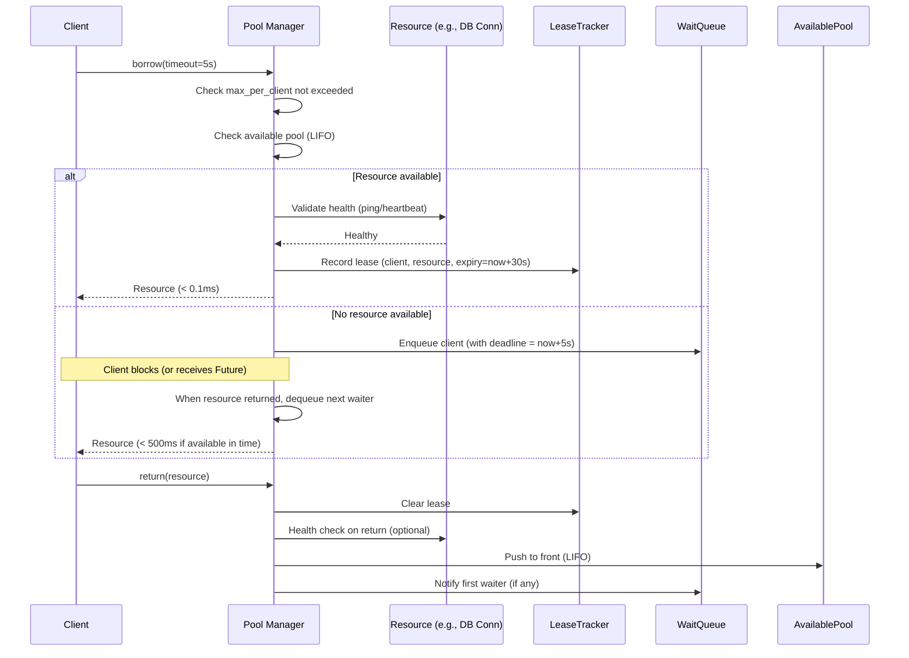
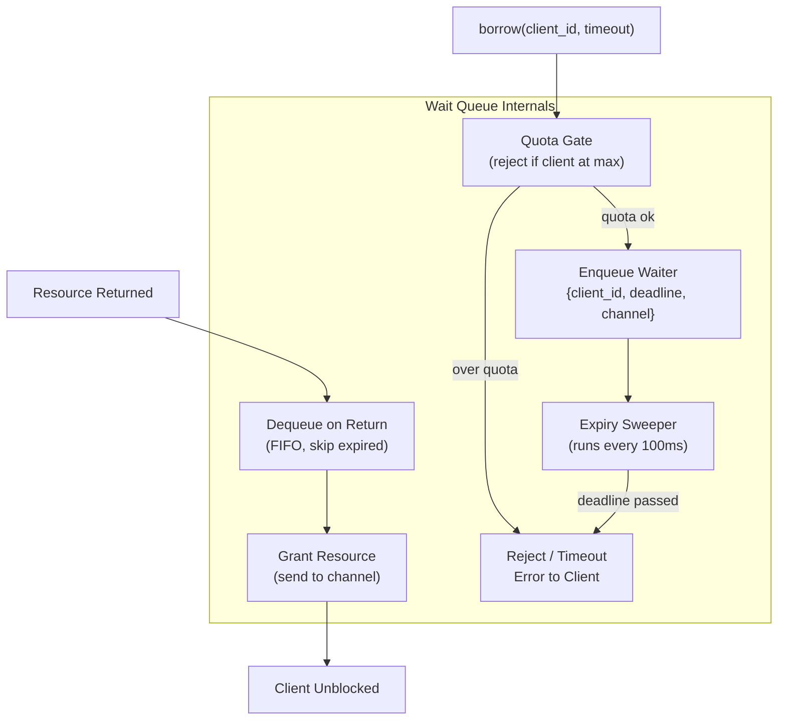
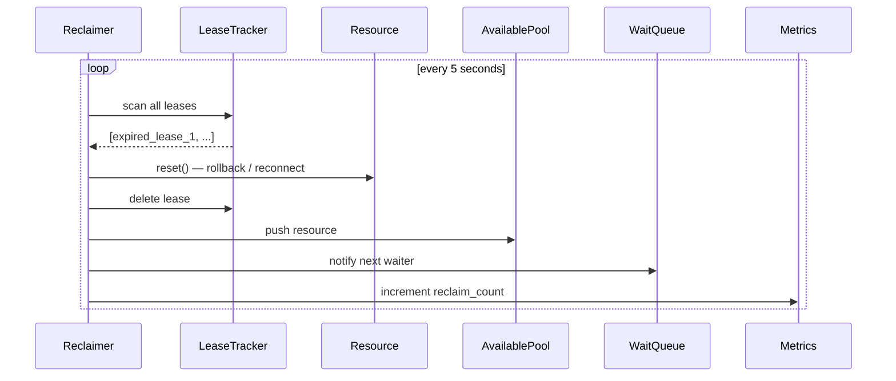
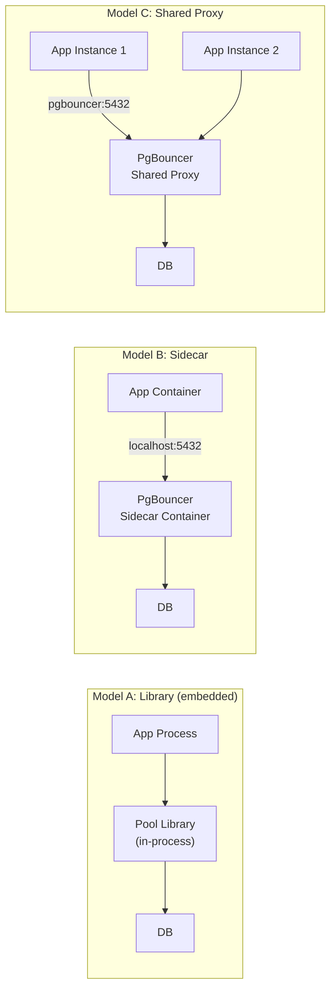

# Design a Service Pool Allocation System — 1,000 Clients, No Starvation

**Difficulty**: 🔴 Advanced (Hard)
**Reading Time**: 22 minutes
**Interview Frequency**: Medium — asked at database middleware, connection pooling, and platform engineering roles

---

## Problem Statement

You are asked to design a resource pool manager that:

- **Works at**: 10 clients sharing 5 DB connections — simple connection pool with a semaphore handles this.
- **Breaks at**: 1,000 microservices sharing 50 expensive licensed API connections — one service can hoard all 50 connections; long-running requests hold connections indefinitely; a service that never returns connections deadlocks the pool; health-checking borrowed connections has overhead; pool size tuning is art, not science.

Target: **50 pooled resources** (connections, licenses, worker threads), **1,000 client services**, **fair queuing**, **timeout + reclamation**, **health checking**, **no starvation**, **sub-millisecond allocation from warm pool**.

---

## Requirements

### Functional Requirements

| Requirement | Description |
|-------------|-------------|
| Borrow | Client borrows resource, blocks if pool empty (up to timeout) |
| Return | Client returns resource to pool for reuse |
| Max Per Client | Limit how many resources one client can hold simultaneously |
| Timeout + Reclaim | Auto-return resource after max hold time expires |
| Health Check | Validate resource before lending (detect stale connections) |
| Pool Resize | Dynamically grow/shrink pool based on demand |

### Non-Functional Requirements

| Requirement | Target |
|-------------|--------|
| Borrow Latency (warm) | < 0.1 ms (resource available in pool) |
| Borrow Latency (wait) | < 500 ms (wait in queue, timeout after 5s) |
| Resource Utilization | > 85% of pool in use during peak |
| Max Per Client | Configurable (default: 5% of pool size) |
| Health Check Overhead | < 5% of borrow operations (check on return, not borrow) |
| Reclamation Accuracy | Detect leaked resources within 30 seconds |

---

## Capacity Estimates

- **50 resources**, **1,000 clients** → average 50 clients per resource
- **Each resource held avg 100ms** → 50 resources × 10/second throughput = **500 borrows/second** capacity
- **1,000 clients × 2 borrows/sec each = 2,000 borrows/sec** → queue depth ~(2000-500)/10 = **150 clients waiting** at peak
- **Resource lease size**: 1 KB metadata per lease × 1,000 concurrent leases = 1 MB (trivial)
- **Wait queue**: 1,000 clients × 256 bytes queue entry = 256 KB (trivial)

---

## High-Level Architecture



---

## Level 1 — Surface: Object Pool Pattern

The pool pattern avoids expensive resource creation on every request:

**Without pool** (new connection per request):
- Client needs DB connection: open TCP, TLS handshake, authenticate = **50–200ms** per operation
- 1,000 concurrent requests = 1,000 simultaneous DB connections → overwhelms DB

**With pool** (reuse connections):
- Client borrows pre-established connection: < 0.1ms
- Return after use: connection stays warm for next client
- DB sees 50 connections (pool size), not 1,000

Key insight: **pool size ≠ throughput**. A pool of 50 connections at 100ms avg hold time serves 500 requests/second. Adding more connections beyond DB capacity degrades performance.

---

## Level 2 — Deep Dive: Borrow/Return Protocol



### LIFO vs. FIFO for Available Pool

| Order | Cache Warmth | Fairness |
|-------|-------------|----------|
| **LIFO** | High — most recently used connection is warm | Lower — same connection used repeatedly |
| **FIFO** | Lower — oldest connection might be stale | Higher — all connections get even use |

**Best practice**: LIFO for available pool (warm connections), FIFO for wait queue (fair ordering of waiters).

### Starvation Prevention

Without per-client limits: Service A submits 1,000 borrow requests → acquires all 50 resources → Services B-Z starve.

**Max-per-client enforcement**:
```
borrow(client_id):
    current_held = leases_by_client[client_id].count()
    if current_held >= max_per_client:  # e.g., 5% of pool = 2-3 resources
        raise QuotaExceededException
    # else proceed with borrow
```

**Fair queuing**: If Service A has 3 resources (max), its subsequent borrow requests go to the back of the wait queue behind other services that have fewer resources. This is **work-conserving max-min fairness**.

### Timeout and Reclamation

```
// Background reclaimer (runs every 5 seconds)
for lease in active_leases:
    if lease.expiry < now:
        log("WARNING: lease expired for client {}", lease.client_id)
        resource = lease.resource
        active_leases.remove(lease)
        resource.reset()  // Clear any in-flight state
        available_pool.push(resource)
        alert_client(lease.client_id, "resource reclaimed")
```

Reclamation is a safety net — it shouldn't trigger in normal operation. Alert if reclamation rate > 1%. Common causes: client crash, long-running query, deadlock.

---

## Key Design Decisions

### 1. Fixed vs. Dynamic Pool Size

| Approach | Pros | Cons |
|----------|------|------|
| **Fixed** | Predictable, simple | Under-provisioned during bursts, over-provisioned during low traffic |
| **Dynamic (grow on demand)** | Efficient resource use | May overwhelm downstream (DB accepts max 100 connections) |
| **Dynamic with ceiling** | Best of both | More complex, requires monitoring |

**HikariCP approach**: Start with `minimumIdle` connections. Grow to `maximumPoolSize` as demand increases. Shrink back to `minimumIdle` when idle for `keepaliveTime`. Never exceed downstream service's connection limit.

### 2. Resource Validation Strategy

| When to Validate | Overhead | Stale Connection Risk |
|-----------------|----------|----------------------|
| **On borrow (every time)** | High (adds 1ms+ per borrow) | None |
| **On return** | Medium | Low (validated recently) |
| **Background heartbeat** | Low (periodic) | Medium (may have stale window) |
| **On borrow (if idle > N ms)** | Low (rare for active pool) | Low |

**HikariCP default**: Validate on borrow only if connection was idle > 500ms (`connectionTestQuery` or `isValid()`). Background heartbeat every `keepaliveTime` ms for idle connections.

### 3. Pool Sizing Formula

**Little's Law**: `pool_size = throughput × average_hold_time`
- 500 requests/sec × 0.1 sec (100ms avg hold) = **50 connections needed**

**Practical adjustment**: Add 20% headroom for bursts → 60 connections. But if DB max connections = 100 and there are 2 app servers, cap at 50/server.

---

## Interview Questions

| Question | What They're Testing | Key Answer Points |
|----------|---------------------|-------------------|
| How do you prevent one service from starving others? | Fairness | Max-per-client quota (e.g., max 5% of pool per client); fair FIFO wait queue; clients over quota are rejected immediately, not queued indefinitely |
| What happens if a client crashes while holding a resource? | Failure mode | Lease expiry timer reclaims resource after timeout (30s–2min); client health check (gRPC keepalive / TCP keepalive) detects crash earlier; resource reset clears any in-flight state |
| How do you tune pool size? | Performance knowledge | Little's Law: pool size = RPS × avg hold time; validate with load test; too small = queuing delays; too large = overwhelms downstream; monitor "pool wait time" metric — should be < 10ms at p99 |

---

---

## Component Deep Dive 1: Fair Wait Queue

The wait queue is the most critical component for correctness in a pool under load. It determines which client gets the next available resource, and a naive implementation causes starvation silently — clients do not error out, they just wait forever.

### How It Works Internally

Each borrow request that cannot be satisfied immediately enqueues a **waiter entry** containing: client ID, request timestamp, deadline (timestamp + timeout), and a channel/future to signal when a resource is granted. The queue is FIFO within a given priority tier, but enforces per-client quota at enqueue time.

When a resource is returned, the pool pops the head of the wait queue and atomically assigns the resource. If the head waiter has expired (deadline < now), it is discarded and the pool checks the next entry. This prevents stale waiters from blocking real requests.

The subtle problem: a client at its per-client maximum should not consume a queue slot. If Service A holds 3 resources (max=3) and keeps issuing borrow requests, those requests must be **rejected at the gate** (QuotaExceededException), not enqueued. Enqueueing them wastes queue capacity and delays other clients.

**Why naive approaches fail at scale:**

A single FIFO queue backed by a mutex is correct but serializes all enqueue/dequeue operations. At 2,000 borrows/sec with a 1µs lock hold time, you get 2ms of contention — acceptable. But at 50,000 borrows/sec (a connection pool fronting a large Redis cluster), the mutex becomes a bottleneck. Solutions: per-shard queues where each resource shard has its own wait queue; or lock-free MPSC queues (one producer slot per client thread).



| Approach | Latency | Throughput | Trade-off |
|----------|---------|------------|-----------|
| **Single mutex + slice** | ~1µs lock contend at low load | ~50k ops/sec before contention | Simple; bottleneck at high concurrency |
| **Per-resource shard queues** | Near-zero contention per shard | Linear scale with shard count | Resource-to-queue mapping adds complexity |
| **Lock-free MPSC (ring buffer)** | <100ns enqueue | >500k ops/sec | Hard to implement; requires careful memory ordering |

HikariCP uses a `ConcurrentBag` with thread-local borrow shortcuts — a thread that recently returned a resource is offered it first before consulting the global queue, reducing latency to near zero for the common case.

---

## Component Deep Dive 2: Lease Tracker and Timeout Reclaimer

The lease tracker records the live contract between a client and a resource. Every borrowed resource has an associated lease record containing: client ID, resource ID, borrow timestamp, expiry timestamp, and a lease token (used for idempotent returns).

### Internal Mechanics

Leases are stored in an in-memory hash map: `resource_id → LeaseRecord`. A secondary index `client_id → [resource_id...]` enables per-client quota checks in O(1). When a resource is returned, the lease is deleted atomically with the resource re-insertion into the available pool — both must happen or neither should (two-phase commit within the pool manager's own in-memory state).

The reclaimer runs as a background goroutine (or scheduled executor) on a 5-second tick. It scans all active leases and reclaims those past their expiry. The tricky part is **resource reset**: a reclaimed connection may have an uncommitted transaction in-flight. The resource's `reset()` method must execute a rollback or close/reopen the underlying socket to ensure the next borrower gets a clean resource.

### Scale Behavior at 10x Load

At baseline (500 borrows/sec, 50 resources), the lease map holds at most 50 entries — trivially small. At 10x load (5,000 borrows/sec), the pool itself does not change — there are still only 50 resources. What changes is wait queue depth and reclamation frequency:

- Wait queue grows from ~150 to ~1,500 entries
- Reclaimer may fire more often if clients are slow to return under CPU pressure
- The secondary `client_id` index scan becomes hotter — profile this path



One non-obvious issue: a client that has already crashed will attempt to return a resource after the reclaimer already reclaimed it. The **lease token** prevents double-return: the pool validates the token on return; if the lease is gone, the return is silently discarded.

---

## Component Deep Dive 3: Health Checker

Resources can go stale without the pool knowing. A DB connection drops after 8 hours of idle time (MySQL's `wait_timeout`). A licensed API slot's token expires. A worker thread panics. The health checker detects these silently broken resources before a client borrows them.

### Technical Decisions

**Check on return vs. check on borrow vs. background heartbeat:** Checking on return is cheap because the resource just finished work (still warm). Checking on borrow adds latency to the hot path. Background heartbeats add complexity but catch stale connections that never get borrowed. Best practice: check on borrow only if the resource has been idle longer than a configurable threshold (e.g., 500ms in HikariCP). Run background heartbeats for connections idle longer than `keepaliveTime` (default 30s in HikariCP).

**What "healthy" means by resource type:**
- DB connection: `SELECT 1` succeeds within 1s, or Java's `Connection.isValid(1)`
- HTTP API slot: HEAD request to health endpoint returns 200 within 500ms
- Thread: thread is alive (`thread.is_alive()`) and not in zombie state

**Evicting unhealthy resources:** When health check fails, the resource is discarded and a replacement is created asynchronously. This keeps pool size at target without blocking the returning client. If creation fails (e.g., DB is down), the pool shrinks and waiters get timeouts — correct behavior under outage.

| Validation Timing | Overhead | Stale Risk | Recommended For |
|-------------------|----------|------------|-----------------|
| Every borrow | +1–5ms per call | None | Rarely used; too slow |
| On return | Minimal | Low | Most production pools |
| Idle > threshold | Rare | Low | HikariCP default |
| Background heartbeat | < 1% CPU | Minimal | Long-idle connections |

---

## Data Model

```sql
-- Lease table (in-memory; shown as SQL for clarity)
CREATE TABLE lease (
  resource_id      VARCHAR(64)   NOT NULL PRIMARY KEY,
  client_id        VARCHAR(128)  NOT NULL,
  lease_token      UUID          NOT NULL,              -- prevents stale returns
  borrowed_at      BIGINT        NOT NULL,              -- epoch ms
  expires_at       BIGINT        NOT NULL,              -- epoch ms; = borrowed_at + max_hold_ms
  resource_type    VARCHAR(32)   NOT NULL,              -- 'db_conn' | 'api_slot' | 'worker'
  INDEX idx_client (client_id),                        -- per-client quota check
  INDEX idx_expiry (expires_at)                        -- reclaimer scan
);

-- Available pool (in-memory ring buffer or deque)
-- LIFO: push/pop from front for cache warmth
CREATE TABLE available_resource (
  resource_id      VARCHAR(64)   NOT NULL PRIMARY KEY,
  resource_type    VARCHAR(32)   NOT NULL,
  last_used_at     BIGINT        NOT NULL,              -- for idle health-check threshold
  last_health_ok   BIGINT        NOT NULL,              -- last successful health check epoch ms
  connection_meta  JSONB,                               -- e.g. {"host":"db1","port":5432,"db":"prod"}
  created_at       BIGINT        NOT NULL
);

-- Wait queue entry (in-memory priority queue ordered by deadline)
CREATE TABLE wait_queue_entry (
  entry_id         UUID          NOT NULL PRIMARY KEY,
  client_id        VARCHAR(128)  NOT NULL,
  resource_type    VARCHAR(32)   NOT NULL,
  enqueued_at      BIGINT        NOT NULL,
  deadline         BIGINT        NOT NULL,              -- = enqueued_at + borrow_timeout_ms
  notify_channel   VARCHAR(256)  NOT NULL               -- internal channel/future reference
);

-- Per-client quota config (can be hot-reloaded)
CREATE TABLE client_quota (
  client_id        VARCHAR(128)  NOT NULL PRIMARY KEY,
  max_held         INT           NOT NULL DEFAULT 3,    -- max resources this client may hold
  priority         INT           NOT NULL DEFAULT 0     -- 0=normal, 1=high (for future priority queuing)
);
```

---

## Scale Bottlenecks

| Traffic Level | Component That Breaks | Symptoms | Mitigation |
|---------------|----------------------|----------|------------|
| **10x baseline** (5,000 borrows/sec) | Wait queue mutex | p99 borrow latency spikes from 2ms to 50ms | Shard wait queue by resource type; use lock-free MPSC queue |
| **10x baseline** | Reclaimer scan | Reclaimer takes >5s to scan 1,500 leases, misses expiry window | Index leases by expiry time (min-heap); scan only expired segment |
| **100x baseline** (50,000 borrows/sec) | Single pool manager process | CPU saturation on a 4-core node at ~100k ops/sec | Shard pool manager across multiple processes; use consistent hashing on resource_type |
| **100x baseline** | Health checker | 2,500 health checks/sec overwhelm DB with `SELECT 1` queries | Validate on idle-threshold only; batch health checks; use `isValid()` socket-level check instead of query |
| **1000x baseline** (500,000 borrows/sec) | In-memory state | Single JVM/Go process cannot hold 500k concurrent leases without GC pressure | Externalize lease state to Redis (with Lua scripts for atomic borrow/return); accept +1ms latency for atomicity |
| **1000x baseline** | Network bottleneck to pool manager | 500k req/sec × 1KB payload = 500MB/sec to a single node | Deploy pool manager as a sidecar (same process or loopback), not a remote service; pool manager must be local |

---

## How PgBouncer Built This

PgBouncer is a lightweight PostgreSQL connection pooler used in production at thousands of companies including GitLab, Shopify, and Instagram. It solves exactly this problem: thousands of application threads sharing a small set of actual Postgres server connections.

**Technology choices:** PgBouncer is written in C with libevent for async I/O. It runs as a single-threaded event loop — no locking overhead, no GC, no context switching. All pool operations (borrow, return, queue management) execute in O(1) within the event loop. This design processes **~100,000 transactions/sec** on a single CPU core, verified in Shopify's production benchmarks published at PGCon 2019.

**Three pooling modes:**
- **Session mode**: client holds a server connection for the entire client session (safe but inefficient — same as no pooling)
- **Transaction mode**: server connection released after each transaction (recommended; 10–100x multiplexing)
- **Statement mode**: server connection released after each SQL statement (aggressive; breaks multi-statement transactions)

**Non-obvious architectural decision:** PgBouncer maintains a **per-database, per-user pair** connection pool. A connection to `db=prod, user=app` is pooled separately from `db=staging, user=readonly`. This avoids cross-contamination of authentication state and allows per-pool size limits. At GitLab's scale (5M+ repos), they run PgBouncer with `pool_size=20` per pool and `max_client_conn=10000`, achieving a **500:1 multiplexing ratio**.

**Specific numbers from Shopify's 2019 analysis:**
- Without PgBouncer: 5,000 Rails threads × 1 Postgres connection = 5,000 connections, 40GB RAM consumed by Postgres backends
- With PgBouncer (transaction mode): 5,000 Rails threads → 100 Postgres connections, **50:1 ratio**, Postgres RAM drops to 800MB
- PgBouncer overhead: < 0.5ms added latency at p99 on Shopify's hardware

**Source:** [Shopify Engineering Blog — Scaling Postgres with PgBouncer](https://shopify.engineering/scaling-shopify-s-database-connections-with-pgbouncer) and PgBouncer official docs at `https://www.pgbouncer.org/config.html`.

---

## Interview Angle

**What the interviewer is testing:** Whether you understand that resource pools are not just semaphores — they require fairness, failure recovery (lease expiry, health check), and correct pool sizing. The interviewer wants to see that you can reason about the interaction between pool size, hold time, and throughput using Little's Law, and that you know where real pools (HikariCP, PgBouncer) have made pragmatic tradeoffs.

**Common mistakes candidates make:**

1. **Treating pool size as a dial to maximize**: Candidates say "just increase the pool size to reduce wait time." This is wrong. Increasing connections beyond the database's optimal count (typically `# CPU cores × 2`) increases context switching and degrades DB performance. A pool of 200 connections to a 4-core Postgres is slower than a pool of 10.

2. **Ignoring the single-pool-manager bottleneck**: Designing a pool manager as a remote microservice called by 1,000 clients adds network round-trips to every borrow. At 2,000 borrows/sec, that is 2,000 network calls/sec to a single process. Pool managers must be co-located (sidecar, library, or same JVM) to achieve sub-millisecond borrow latency.

3. **Forgetting resource reset on reclaim**: When a lease expires and the resource is reclaimed, candidates return it to the available pool without calling `reset()`. A reclaimed DB connection may have an uncommitted transaction or dirty session state. The next borrower gets corrupted state. Always rollback/reset before returning a reclaimed resource.

**The insight that separates good from great answers:** Pool size and throughput are decoupled — **pool size determines concurrency, not throughput**. A pool of 50 connections each held for 100ms serves 500 req/sec. To serve 1,000 req/sec, reduce hold time to 50ms (optimize queries), not double the pool size. This is Little's Law applied to resource pools, and it reframes every capacity planning conversation.

---

## Key Numbers to Remember

| Metric | Value | Context |
|--------|-------|---------|
| Warm borrow latency | < 0.1 ms | Resource available in pool, no contention |
| Wait borrow latency | < 500 ms | Resource not available; waiting in queue |
| Borrow timeout | 5 seconds | Default; client gets error after this |
| Lease / max hold time | 30 seconds | Auto-reclaim after this; alert if triggered |
| Pool throughput (Little's Law) | `pool_size / avg_hold_time` | 50 resources ÷ 0.1s = 500 req/sec |
| PgBouncer max clients | 10,000 client connections | Per single PgBouncer instance in production |
| PgBouncer multiplexing ratio | 50:1 to 500:1 | Shopify: 5,000 Rails threads → 100 Postgres connections |
| Health check threshold | 500 ms idle | Validate on borrow only if idle > this (HikariCP default) |
| Reclaimer scan interval | 5 seconds | Detect leaked resources; alert if reclaim rate > 1% |
| Per-client quota | 5% of pool | Default: 3 resources per client in a pool of 50 |

---

## Failure Mode Analysis

Understanding failure modes is the difference between a pool that degrades gracefully and one that causes cascading failures.

### Failure 1: Pool Exhaustion Under Slow Downstream

**Scenario:** The downstream database is slow (high query latency: p99 = 5s instead of 100ms). Clients hold connections 50× longer. Pool exhaustion time drops from normal operation to seconds.

**Cascade:** All 50 connections held, 1,000 clients queued, queue fills to `max_wait_queue_size`, new borrow requests return `PoolExhaustedException` immediately. Client services start retrying — adding more load to an already exhausted pool.

**Mitigation chain:**
1. `borrow_timeout` (5s) limits client wait time — client gets error rather than waiting forever
2. Client implements exponential backoff with jitter on `PoolExhaustedException` — avoids retry storm
3. Circuit breaker on the pool: if >80% of borrows in the last 10s timed out, stop accepting new requests and return error immediately until pool recovers

```
// Pool-level circuit breaker
if (recent_timeout_rate() > 0.8) {
    throw CircuitOpenException("pool exhausted, circuit open for 10s")
}
```

### Failure 2: Resource Leak (Client Never Returns)

**Scenario:** A client goroutine/thread panics after borrow but before return. The resource is held indefinitely.

**Detection:** Lease TTL expiry — reclaimer fires after 30s. Alert fires: "lease reclaimed for client payment-service, held 30s". If reclaim rate exceeds 1% of borrows, page oncall.

**Prevention:** Require callers to use RAII / try-with-resources / defer pattern:
```go
// Go: defer ensures return even on panic
resource, err := pool.Borrow(ctx)
if err != nil { return err }
defer pool.Return(resource)
// use resource...
```

### Failure 3: Thundering Herd on Pool Recovery

**Scenario:** DB restarts after 60s downtime. All 1,000 clients simultaneously attempt to borrow. Pool manager tries to create 50 connections simultaneously. DB gets hammered with 50 connection requests at once, potentially failing authentication under load.

**Mitigation:** Connection creation with jitter:
```
for i in range(target_pool_size):
    sleep(random(0, 100ms))  // stagger connection creation
    create_connection()
```

Also: reconnect with exponential backoff. First reconnect at T+1s, then T+2s, T+4s, T+8s. Max backoff 60s. Prevents re-triggering the outage during DB warm-up.

### Failure 4: Health Check False Positive Storm

**Scenario:** Background health checker runs `SELECT 1` for all idle connections simultaneously. If the DB is slow (but not down), 50 `SELECT 1` queries fire at once — creating the load that makes the DB slow.

**Mitigation:** Stagger health checks with random jitter. Limit concurrent health checks to `max(2, pool_size × 0.1)`. Use socket-level `isValid()` instead of query-level ping where possible.

---

## Pool Topology: Library vs. Sidecar vs. Proxy

There are three deployment models for a pool manager. The choice affects latency, operational complexity, and failure isolation.



| Model | Borrow Latency | Failure Isolation | Deployment Complexity | When To Use |
|-------|----------------|-------------------|----------------------|-------------|
| **Library** | < 0.1ms (in-process) | Pool dies with app | Low | Single-language monolith; HikariCP in Java |
| **Sidecar** | ~0.1ms (loopback) | App crash doesn't affect sidecar pool | Medium | Kubernetes; each pod gets its own PgBouncer |
| **Shared Proxy** | ~0.5ms (network) | Proxy is a SPOF; needs HA pair | High | Serverless / FaaS where sidecar is impractical |

**HikariCP** (Java library, Model A) is the standard choice for JVM applications: sub-millisecond borrow, zero network overhead, but pool state is lost on app restart.

**PgBouncer as sidecar** (Model B) is the Kubernetes-native pattern: each app pod has a PgBouncer container on localhost. App connects to `localhost:5432`, PgBouncer proxies to the real DB. GitLab uses this pattern with Kubernetes operators to auto-configure PgBouncer settings from DB credentials stored in Secrets.

---

## 📚 Resources & References

| Resource | Type | What You'll Learn |
|----------|------|------------------|
| [HikariCP Pool Sizing Wiki](https://github.com/brettwooldridge/HikariCP/wiki/About-Pool-Sizing) | 📖 Blog | Practical pool sizing, Little's Law, database connection limits |
| [Martin Fowler — Object Pool](https://martinfowler.com/bliki/ObjectPool.html) | 📖 Blog | Pattern definition, when to use, trade-offs |
| [High Scalability Blog](https://highscalability.com) | 📖 Blog | Connection pooling at scale, real production war stories |
| [Hussein Nasser YouTube](https://www.youtube.com/@hnasr) | 📺 YouTube | Connection pooling deep dives, database proxies (PgBouncer) |

---

## Observability: Metrics and Alerts

A pool without instrumentation is a black box. These are the minimum metrics every production pool must emit:

| Metric | Type | Alert Threshold | What It Tells You |
|--------|------|-----------------|-------------------|
| `pool.borrow.latency.p99` | Histogram (ms) | > 50ms | Pool under pressure; queue backing up |
| `pool.wait_queue.depth` | Gauge | > 100 waiters | Demand exceeds pool capacity |
| `pool.active_leases` | Gauge | > 95% of pool size | Nearly exhausted; scale up or optimize hold time |
| `pool.reclaim_count` | Counter | Rate > 1%/min | Clients leaking resources; check for panics |
| `pool.health_check.failures` | Counter | Any non-zero | Resources going stale; check downstream |
| `pool.create_errors` | Counter | Any non-zero | Downstream unreachable; pool shrinking |
| `pool.borrow_timeout_rate` | Gauge (%) | > 5% | Clients waiting too long; pool undersized |
| `pool.size.current` | Gauge | < min_idle | Pool shrinking; creation errors likely |

Emit all metrics with a `resource_type` label so you can distinguish DB connection pool exhaustion from API license slot exhaustion. Dashboard minimum: pool utilization % over time, wait queue depth, and p99 borrow latency — these three together tell you whether the pool is sized correctly.

---

## Related Concepts

- [Rate Limiter](./rate-limiter) — per-client quotas in pool are a form of rate limiting
- [Resource Allocation](./resource-allocation) — cluster-level resource allocation vs. pool-level
- [Distributed Locking](./distributed-locking) — the pool manager itself needs a distributed lock for multi-instance deployment
