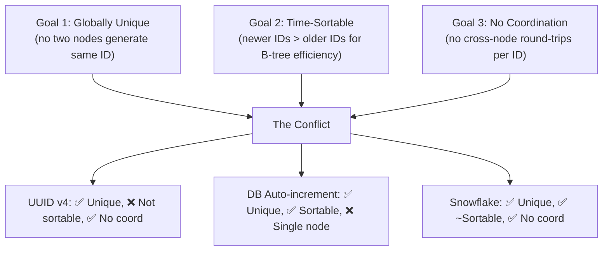
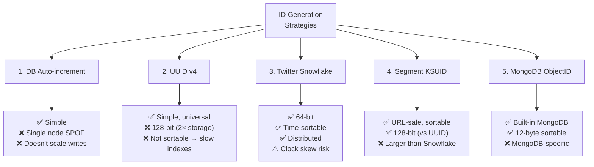
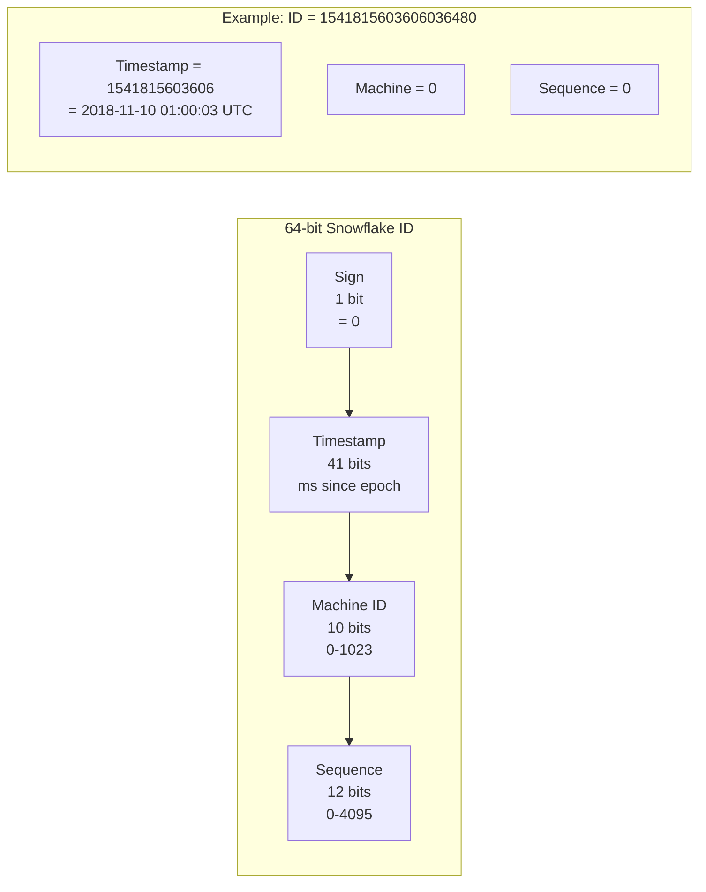
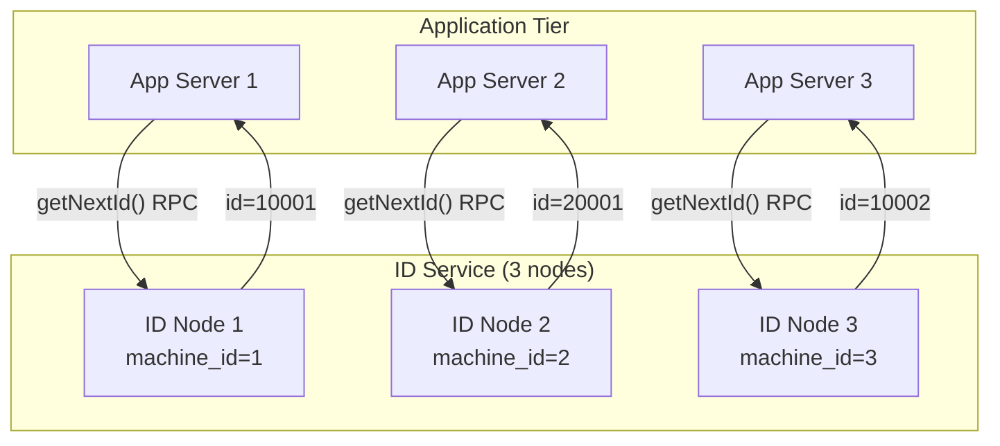
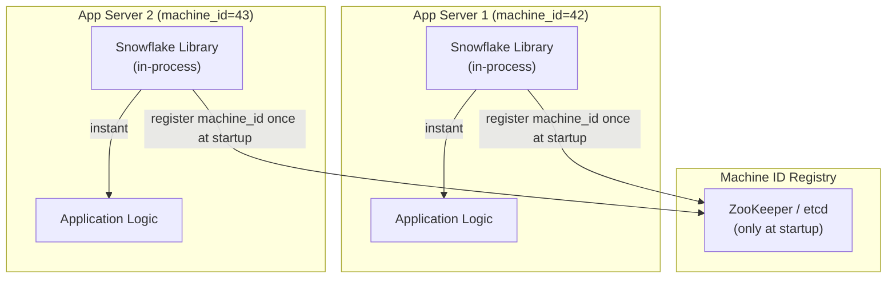
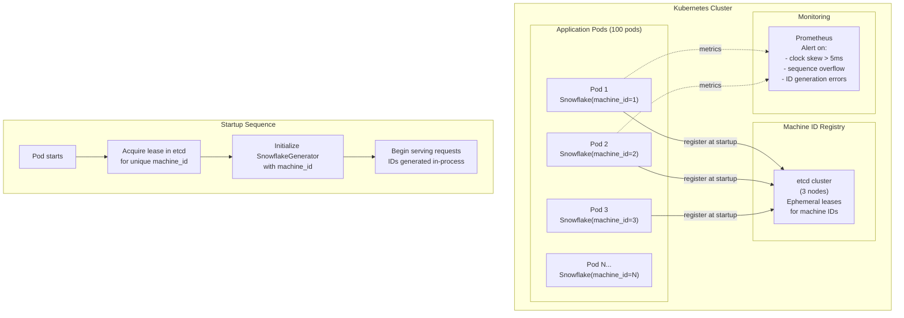

# Design a Unique ID Generator — Snowflake, UUID, and Beyond

**Difficulty**: 🟡 Intermediate → 🔴 Advanced
**Reading Time**: 30 minutes
**Interview Frequency**: High — appears in ~65% of system design interviews, often as a warm-up problem

> **Core Challenge**: Generate 100M unique IDs per day across distributed nodes — IDs must be globally unique, roughly time-sortable (for B-tree index efficiency), fit in a 64-bit integer, and require no central coordination.

---

## Table of Contents

1. [The Mental Model](#1-the-mental-model)
2. [Requirements](#2-requirements)
3. [Capacity Estimation](#3-capacity-estimation)
4. [Level 1 — Five Approaches at a Glance](#4-level-1--five-approaches-at-a-glance)
5. [Deep Dive 1 — Twitter Snowflake](#5-deep-dive-1--twitter-snowflake)
6. [Deep Dive 2 — Clock Skew Handling](#6-deep-dive-2--clock-skew-handling)
7. [Deep Dive 3 — ID Generation as a Service vs Embedded Library](#7-deep-dive-3--id-generation-as-a-service-vs-embedded-library)
8. [Full Comparison Table](#8-full-comparison-table)
9. [Full System Architecture](#9-full-system-architecture)
10. [Problems at Scale](#10-problems-at-scale)
11. [Interview Questions Mapped](#11-interview-questions-mapped)
12. [Key Takeaways](#12-key-takeaways)
13. [Related Concepts](#13-related-concepts)

---

## 1. The Mental Model

### Why Is This Hard?

In a single-server database, auto-increment is trivial: `id = last_id + 1`. The database is the single source of truth.

In a distributed system, three goals conflict:



### Why Does Sortability Matter?

Most databases use B-tree indexes. When you insert a row with a random UUID as the primary key, the B-tree must find a random position to insert. This causes:
- **Page splits**: The target leaf page is full → split into two pages → update parent
- **Random I/O**: The page to update is usually not in buffer pool → disk read required

With sequential IDs (Snowflake, auto-increment), inserts always go to the rightmost leaf page (which is hot in buffer pool). **10-50× faster insert throughput** compared to random UUIDs.

Instagram measured: switching from UUID to sequential IDs reduced B-tree rebalancing overhead by 40%.

---

## 2. Requirements

### Functional Requirements

| Feature | Spec |
|---------|------|
| Uniqueness | Globally unique — no two IDs ever equal, across all nodes, forever |
| Ordering | Time-sortable: ID(t1) < ID(t2) when t1 < t2 (soft guarantee, not strict) |
| ID size | 64-bit integer (fits in SQL BIGINT, standard 8-byte column) |
| Generation rate | 100M IDs/day average, 100K IDs/sec peak |
| Availability | 99.99% — ID generation must not be a bottleneck |

### Non-Functional Requirements

| Requirement | Target | Rationale |
|-------------|--------|-----------|
| Latency | < 1ms to generate one ID | Should be negligible overhead |
| Throughput | 100K IDs/sec per node minimum | Enough for peak load on one node |
| No SPOF | Survive individual node failures | ID generation can't take down the app |
| Monotonic | IDs generated on same node are strictly increasing | Predictable index behavior |

### Non-Requirements

- IDs don't need to be unpredictable (security through obscurity is not a goal)
- IDs don't need to be human-readable
- Strict global ordering across nodes (not achievable without coordination)

---

## 3. Capacity Estimation

### Average and Peak Rates

```
100M IDs/day
→ 100,000,000 / 86,400 seconds/day
= 1,157 IDs/sec average

Peak assumption: 100× average during major events (Black Friday, viral launch)
→ Peak: ~116,000 IDs/sec ≈ 100K IDs/sec (round number)
```

### Snowflake Capacity Check

```
Twitter Snowflake: 12-bit sequence counter per millisecond per node
→ 2^12 = 4,096 IDs per millisecond per node
→ 4,096 × 1,000ms = 4,096,000 IDs/sec per node

At peak 100K IDs/sec:
→ 1 node handles peak alone with 97.5% headroom
→ With 10 nodes: 40M IDs/sec capacity vs 100K needed
→ Headroom ratio: 400×

For 64-bit Snowflake ID, usable until year 2081:
→ 41-bit timestamp at 1ms resolution = 2^41 ms = 2,199,023,255,551 ms ≈ 69.7 years from epoch
→ Twitter epoch: 2010-11-04 01:42:54 UTC + 69.7 years = ~2080
```

### Storage (for reference, not ID generation)

```
If every generated ID stored in a lookup table:
100M IDs/day × 365 days × 8 bytes = 292GB/year
→ Manageable; most applications don't store a separate ID lookup table
→ IDs are embedded in the application's own tables as primary keys
```

---

## 4. Level 1 — Five Approaches at a Glance



**Quick decision guide**:
- **Single-service, low scale** → DB auto-increment
- **Cross-service, don't care about sort perf** → UUID v4
- **High scale, need sortable 64-bit IDs** → Snowflake (Twitter/Instagram approach)
- **Need URL-safe sortable IDs** → ULID or KSUID
- **Already on MongoDB** → ObjectID

---

## 5. Deep Dive 1 — Twitter Snowflake

### Bit Layout

Snowflake packs everything into a 64-bit integer:

```
Bit layout (64 bits total):

 63        22      12       0
  |         |       |       |
  0 [41 bits timestamp] [10 bits machine] [12 bits sequence]
  ^
  Sign bit (always 0 → positive integer)

Breakdown:
- Sign bit (1 bit):    Always 0, ensuring positive 64-bit integer
- Timestamp (41 bits): Milliseconds since custom epoch (Twitter epoch: Nov 4, 2010)
                       → 2^41 ms = 69.7 years of IDs
- Machine ID (10 bits): Unique identifier per node
                        → 2^10 = 1,024 unique nodes max
- Sequence (12 bits):  Counter reset each millisecond
                       → 2^12 = 4,096 IDs per ms per node
```

### Visual Breakdown



### Epoch Choice

Twitter chose a custom epoch (Nov 4, 2010) to maximize the 41-bit range:
- Using Unix epoch (1970): 41 bits covers until year 2109 — plenty of headroom
- Using custom epoch: shifts timestamp to use fewer bits for historical dates → more bits for future

```
Twitter epoch: 1288834974657 ms (Unix timestamp in ms)
Snowflake timestamp = currentUnixMs - TWITTER_EPOCH_MS

Example:
currentUnixMs = 1715000000000 (May 2024)
snowflakeTs   = 1715000000000 - 1288834974657
              = 426165025343

Binary: 0b 0110001100111... (fits in 41 bits? 2^41 = 2,199,023,255,551 > 426B ✅)
```

### Machine ID Registration

Every node needs a unique machine ID (0–1023). Options:

**Option A — ZooKeeper / etcd Registration**:
```
function getMachineId():
  # Try to claim a sequential ID from ZooKeeper
  path = zookeeper.createEphemeral("/id-gen/nodes/", sequential=True)
  # path = "/id-gen/nodes/0000000042"
  machine_id = int(path.split("/")[-1]) % 1024
  return machine_id
  # Ephemeral node disappears when process exits → ID freed
```

**Option B — Environment Variable / Config**:
```
machine_id = int(os.environ["MACHINE_ID"])  # Set in Kubernetes pod spec
# Kubernetes StatefulSet assigns ordinal 0, 1, 2... → use as machine ID
```

**Option C — IP Address Hashing**:
```
machine_id = hash(localIPAddress()) % 1024
# Risk: two nodes in same subnet could get same ID if hash collides
# Not recommended for production without collision detection
```

### Snowflake Generation (Pseudocode)

```python
class SnowflakeGenerator:
  EPOCH = 1288834974657       # Twitter epoch in ms
  MACHINE_BITS = 10
  SEQUENCE_BITS = 12
  MAX_SEQUENCE = (1 << SEQUENCE_BITS) - 1   # 4095
  MAX_MACHINE = (1 << MACHINE_BITS) - 1     # 1023

  def __init__(self, machine_id):
    assert 0 <= machine_id <= MAX_MACHINE, "Invalid machine ID"
    self.machine_id = machine_id
    self.sequence = 0
    self.last_timestamp = -1
    self.lock = Mutex()

  def generate(self) -> int:
    with self.lock:
      timestamp = currentTimeMs()

      if timestamp < self.last_timestamp:
        # Clock moved backwards — handle carefully (see Deep Dive 2)
        raise ClockMovedBackwardsError(f"Clock skew: {self.last_timestamp - timestamp}ms")

      if timestamp == self.last_timestamp:
        self.sequence = (self.sequence + 1) & MAX_SEQUENCE
        if self.sequence == 0:
          # Sequence exhausted this millisecond — wait for next ms
          timestamp = self.waitNextMs(self.last_timestamp)
      else:
        self.sequence = 0

      self.last_timestamp = timestamp

      snowflake_id = (
        ((timestamp - EPOCH) << (MACHINE_BITS + SEQUENCE_BITS))
        | (self.machine_id << SEQUENCE_BITS)
        | self.sequence
      )
      return snowflake_id

  def waitNextMs(self, last_timestamp) -> int:
    ts = currentTimeMs()
    while ts <= last_timestamp:
      ts = currentTimeMs()
    return ts
```

**Thread safety**: A single mutex protects `sequence` and `last_timestamp`. Contention is minimal since the lock is held for nanoseconds.

---

## 6. Deep Dive 2 — Clock Skew Handling

### The Clock Skew Problem

Operating system clocks drift. NTP (Network Time Protocol) corrects drift by adjusting the system clock — sometimes backwards. If the clock goes back by even 1ms, the Snowflake algorithm could generate a duplicate ID:

```
t=1000ms: Generate ID with timestamp=1000, sequence=0 → ID = X
NTP adjusts clock back 2ms
t=998ms:  Generate ID with timestamp=998 → different from X ✅ (no collision here)

But if:
t=1000ms, seq=3: ID = encode(1000, machine=5, seq=3)
NTP adjusts clock back to 999ms
t=999ms,  seq=0: ID = encode(999, machine=5, seq=0) → LOWER number!
t=1001ms, seq=0: ID = encode(1001, machine=5, seq=0) → OK again

Problem: IDs generated around the NTP adjustment are not monotonically increasing
```

### Strategy 1: Refuse and Wait

When `currentTime < lastTimestamp`, wait until the clock catches up:

```python
def generate(self):
  timestamp = currentTimeMs()

  if timestamp < self.last_timestamp:
    skew_ms = self.last_timestamp - timestamp

    if skew_ms > MAX_TOLERATED_SKEW_MS:   # e.g., 5ms
      raise ClockSkewTooLargeError(f"Clock went back {skew_ms}ms — node needs investigation")

    # Small skew: spin-wait until clock catches up
    while timestamp < self.last_timestamp:
      time.sleep(0.001)   # sleep 1ms
      timestamp = currentTimeMs()
```

**Pros**: Simple, no data inconsistency
**Cons**: Request hangs during wait. Max tolerable: ~5ms (one per NTP sync cycle)
**Used by**: Twitter Snowflake original implementation

### Strategy 2: Logical Clock with Fallback Sequence Bits

Reserve extra bits in the sequence field to absorb small backward clock movement:

```
Modified Snowflake: sequence = [2-bit skew-counter][10-bit sequence]

If clock goes back 1-2ms:
  Increment skew-counter (0→1)
  Reset 10-bit sequence to 0
  Continue generating with modified sequence to ensure uniqueness

Max: 3 clock-back events per millisecond (2-bit counter = 0,1,2,3)
```

**Pros**: No waiting, no errors, continuous operation
**Cons**: Reduces sequence capacity from 4096 to 1024 per ms per skew-counter increment
**Used by**: Modified Snowflake implementations (e.g., Discord)

### Strategy 3: Use Monotonic Clock

Most operating systems provide a monotonic clock that never goes backwards (it may freeze during sleep but never decrements):

```python
import time

def currentMonotonicMs():
  # CLOCK_MONOTONIC: guaranteed never to go backwards
  return int(time.monotonic() * 1000)

# Caveat: CLOCK_MONOTONIC gives nanoseconds since process start,
# not a wall-clock timestamp. Need to calibrate against wall time at startup:
WALL_OFFSET = currentWallTimeMs() - currentMonotonicMs()

def calibratedMonotonicMs():
  return currentMonotonicMs() + WALL_OFFSET
```

**Pros**: Eliminates backward clock movement entirely
**Cons**: Calibrated offset drifts over time vs true wall clock — IDs may not perfectly reflect creation wall time, only that they are monotonically increasing

**Used by**: ULID specification mandates monotonic clock

### Clock Skew Comparison

| Strategy | Backward Skew Handling | Throughput Impact | Complexity |
|----------|----------------------|------------------|-----------|
| Refuse + wait | Waits up to MAX_SKEW_MS | Pauses generation | Low |
| Extra sequence bits | Absorbs up to 3× per ms | Reduces max to 1024/ms | Medium |
| Monotonic clock | Immune | None | Low (OS-provided) |
| Reject + alert | Stops service, requires ops | Complete stop | Low (but painful) |

**Recommendation**: Monotonic clock for new systems. For existing Snowflake deployments: refuse + wait with a 5ms tolerance.

---

## 7. Deep Dive 3 — ID Generation as a Service vs Embedded Library

### Approach A: Centralized ID Service

A dedicated fleet of ID generator nodes. Application servers call this service via RPC to get IDs.



**Pros**:
- Machine IDs managed centrally — no coordination risk
- Can emit IDs in strict sequential batches (range allocation)
- Easy to monitor and audit

**Cons**:
- Extra network hop per ID (1-5ms added latency)
- ID service becomes critical infrastructure — needs its own HA
- More complex deployment

**Used by**: Instagram (Postgres-based), Flickr (MySQL ticket servers)

### Approach B: Embedded Library

Each application node runs the Snowflake algorithm locally. No external calls.



**Pros**:
- Zero latency — ID generation is in-process, ~100ns
- No external dependency per ID generation
- Scales linearly with application nodes

**Cons**:
- Machine ID coordination still needed (ZooKeeper at startup)
- Clock skew handling must be correct in each app process
- Harder to audit (IDs generated everywhere)

**Used by**: Twitter (original Snowflake), Discord, most high-scale applications

### Approach C: Database Range Allocation (Ticket Server)

Each generator claims a range of IDs from a database, then dispenses them locally:

```python
class RangeAllocator:
  RANGE_SIZE = 10000

  def __init__(self, db, server_id):
    self.db = db
    self.server_id = server_id
    self.current_id = 0
    self.max_id = 0

  def getNextId(self):
    if self.current_id >= self.max_id:
      self.allocateRange()
    id = self.current_id
    self.current_id += 1
    return id

  def allocateRange(self):
    # Atomic compare-and-swap in DB
    result = self.db.execute("""
      UPDATE id_ranges
      SET max_allocated = max_allocated + :range_size
      WHERE server_id = :server_id
      RETURNING max_allocated
    """, {range_size: RANGE_SIZE, server_id: self.server_id})

    self.max_id = result.max_allocated
    self.current_id = self.max_id - RANGE_SIZE
```

**Pros**:
- IDs are strictly sequential within each range
- DB is the single source of truth — no clock dependency
- Works even with clock skew

**Cons**:
- Gaps in IDs when a server crashes mid-range (IDs from its allocated range are lost)
- DB is still a bottleneck (mitigated by large range size)
- Not time-sortable globally (only within server's range)

**Used by**: Flickr ticket server, Baidu UidGenerator

### Service vs Library vs Range — Comparison

| Approach | Latency | Throughput | Clock Dependency | Coordination |
|----------|---------|------------|-----------------|-------------|
| Centralized service | 1-5ms (network) | Limited by service nodes | No | Yes (always) |
| Embedded library (Snowflake) | ~100ns | 4M IDs/sec/node | Yes (NTP risk) | Yes (startup only) |
| DB range allocation | ~1ms (amortized) | High (amortized) | No | Yes (per range) |

---

## 8. Full Comparison Table

| Approach | Size | Sortable | Unique | SPOF | B-tree Perf | Max Rate |
|----------|------|----------|--------|------|-------------|----------|
| DB auto-increment | 64-bit | ✅ Strict | ✅ | ❌ DB | Excellent | ~10K/sec |
| UUID v4 | 128-bit | ❌ Random | ✅ | ✅ None | Poor (random) | Unlimited |
| UUID v7 (2023 RFC) | 128-bit | ✅ Time-based | ✅ | ✅ None | Good | Unlimited |
| Twitter Snowflake | 64-bit | ✅ Approx | ✅ | ✅ None | Excellent | 4M/sec/node |
| Segment KSUID | 160-bit | ✅ Time-based | ✅ | ✅ None | Good | Unlimited |
| ULID | 128-bit | ✅ Monotonic | ✅ | ✅ None | Good | Unlimited |
| MongoDB ObjectID | 96-bit | ✅ Approx | ✅ | ✅ None | Good | Unlimited |

---

## 9. Full System Architecture



### Startup Machine ID Allocation

```python
def registerMachineId(etcd_client, pod_name):
  for candidate_id in range(1024):
    lease = etcd_client.grant_lease(ttl=30)  # 30-second TTL
    success = etcd_client.put_if_absent(
      key=f"/snowflake/machines/{candidate_id}",
      value=pod_name,
      lease=lease
    )
    if success:
      # Continuously renew lease to keep machine_id
      startLeaseRenewer(lease)
      return candidate_id

  raise Exception("No available machine IDs (all 1024 taken)")
```

If the pod crashes, the etcd lease expires in 30 seconds, and another pod can claim the same machine ID. No manual cleanup needed.

---

## 10. Problems at Scale

### Problem 1: NTP Clock Adjustment Causes Duplicate IDs

**Root Cause**: NTP daemon adjusts system clock backward by 5ms. Two IDs generated 4ms apart have the same millisecond timestamp. If the sequence counter was reset (due to the apparent "new" millisecond), a duplicate could theoretically be generated — though the Snowflake algorithm prevents this by tracking `last_timestamp`.

**The real risk** is not duplicates (the guard catches that) but **IDs going non-monotonic**: ID generated at t=100ms may have a lower numeric value than ID generated at t=98ms if timestamps are embedded directly.

**Symptoms**: B-tree insert patterns show unusual page splits; logs show "clock moved backwards" warnings; sequence wait events spike.

**Fix**: Use monotonic clock for timestamp component. Log all NTP adjustments. Alert on adjustments > 5ms. Configure NTP with `tinker panic 0` to suppress panic on large adjustments (instead apply gradually).

```bash
# Check current NTP synchronization status
chronyc tracking

# Expected: System time offset < 1ms
# Alert threshold: > 5ms offset
```

---

### Problem 2: Two Nodes Get the Same Machine ID

**Root Cause**: Race condition in machine ID registration. Two pods start simultaneously and both believe they successfully claimed machine ID 42.

**Without etcd**: If using simple database rows for machine ID tracking, two simultaneous `INSERT` statements could both succeed if the table uses application-level uniqueness checks rather than DB constraints.

**Symptoms**: IDs from both nodes are identical for all sequence numbers within the same millisecond. Downstream database gets primary key constraint violations.

**Magnitude**: 4096 collisions/ms × duration of dual assignment. If both nodes run for 1 hour: 4096 × 3,600,000 = 14.7 billion potential collisions.

**Fix 1**: Use etcd distributed lock with `put_if_absent` (compare-and-swap). This is atomic — exactly one of the racing nodes succeeds.

**Fix 2**: Use Kubernetes StatefulSet pod ordinal as machine ID. StatefulSets assign ordinals 0, 1, 2... which are strictly unique within the set.

**Fix 3**: Add startup validation — after claiming a machine ID, generate 100 IDs and write them to a test key-value store. The store's uniqueness constraint will detect duplicates immediately at startup before production traffic is served.

---

### Problem 3: Sequence Overflow — More Than 4096 IDs Needed Per Millisecond

**Root Cause**: A single node receives a burst exceeding 4096 requests in the same millisecond. The sequence counter rolls over from 4095 back to 0 — producing a duplicate ID.

**When does this happen?**:
```
4096 IDs/ms = 4,096,000 IDs/sec per node

To overflow: a single node needs > 4M req/sec
→ Rare in practice, but possible with:
  - Batch processing (generating IDs for a bulk import)
  - Load balancer misconfiguration routing all traffic to one node
```

**Symptoms**: `sequence == 0` at the same timestamp as a previous `sequence == 0` assignment.

**Fix 1 — Spin Wait**: When sequence overflows, spin until the next millisecond starts. Max wait = 1ms. At 4096 IDs/ms, overflow happens when generation rate exceeds capacity — waiting 1ms buys another 4096 slots.

```python
if self.sequence == 0:  # overflow
  while currentTimeMs() == self.last_timestamp:
    pass  # spin up to 1ms
  timestamp = currentTimeMs()
```

**Fix 2 — Scale Horizontally**: Add more Snowflake nodes. Two nodes each handle 2M IDs/sec = 8192 IDs/ms combined. This is the correct production answer: sequence overflow should trigger a scaling event.

**Fix 3 — Increase Sequence Bits**: Reduce machine ID from 10 bits to 7 bits (128 nodes max), increase sequence from 12 to 15 bits (32768 IDs/ms). Only viable if you know you'll never need > 128 nodes.

---

## 11. Interview Questions Mapped

| Question | What It Tests | Level |
|----------|---------------|-------|
| "Why not use UUID v4 as your primary key?" | B-tree index insert performance, sortability | Junior |
| "Walk me through the Snowflake bit layout" | 41+10+12 bit allocation, epoch, limits | Mid |
| "What happens when the clock goes backward?" | Clock skew, NTP, failure modes | Mid |
| "Two Snowflake nodes both think they're machine 42 — what happens?" | Machine ID coordination, duplicates, etcd | Senior |
| "How would you generate 10 billion IDs in a batch import?" | Sequence overflow, horizontal scaling | Senior |
| "What's the maximum date Snowflake IDs will work until?" | 41-bit timestamp math (2^41ms from epoch) | Mid |
| "How do you make IDs unpredictable (not guessable)?" | Add random salt to sequence, or use UUID v4 | Senior |
| "Stripe uses KSUID — why not Snowflake?" | URL-safety, 128-bit, no machine coordination | Senior |

---

## 12. Key Takeaways

- **Snowflake 64-bit layout** encodes 41-bit timestamp (ms since epoch) + 10-bit machine ID + 12-bit sequence — producing 4,096 globally unique, time-sortable IDs per millisecond per node, with a ~70-year lifespan from a 2010 epoch
- **Sortable IDs matter for indexes**: random UUID primary keys cause B-tree page splits on every insert; sequential IDs always append to the rightmost leaf page, yielding 10-50× faster bulk insert throughput
- **Clock skew is the primary reliability concern**: NTP can adjust clocks backward by 1-100ms; the Snowflake algorithm handles small skew by spinning up to 1ms, and should use monotonic clock for true immunity to backward jumps
- **Machine ID coordination requires distributed lock**: ZooKeeper or etcd `put_if_absent` ensures no two nodes claim the same machine ID; Kubernetes StatefulSet ordinals provide a simpler alternative for containerized deployments
- **100K IDs/sec peak load needs just 1 Snowflake node** (capacity is 4.096M/sec per node) — the bottleneck is almost never ID generation itself but the downstream writes to store the generated IDs

---

## 13. Related Concepts

- [Key-Value Store](./key-value-store) — IDs are often used as keys in distributed KV stores
- [Distributed Locking](./distributed-locking) — Machine ID registration uses distributed locking patterns
- [Rate Limiter](./rate-limiter) — Rate limiters use per-user IDs as Redis keys
