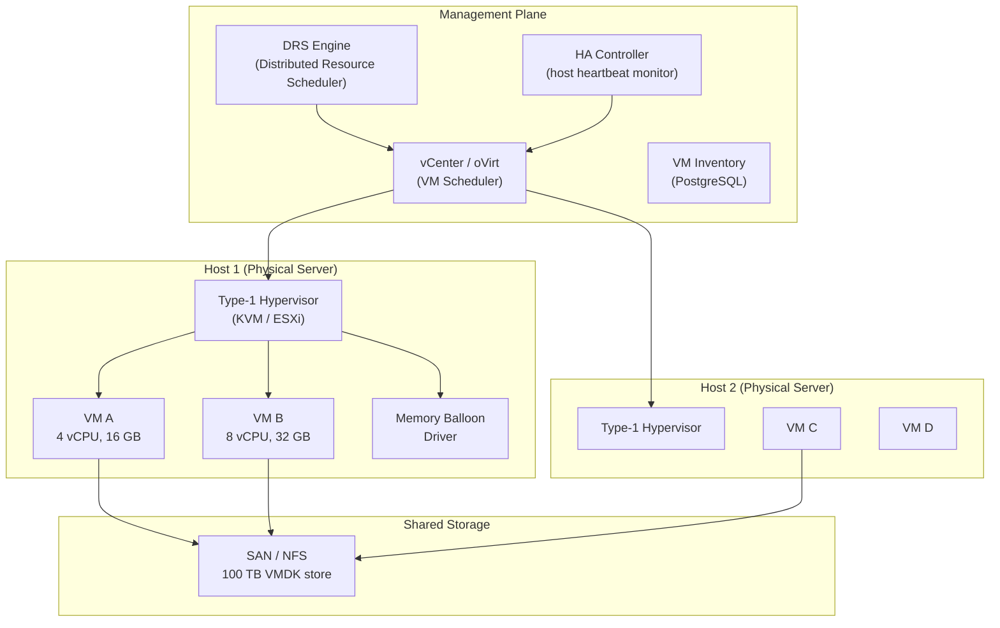
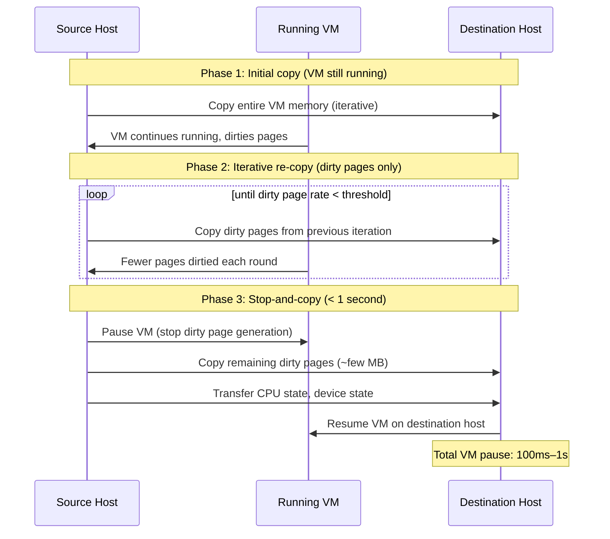

# Design a Virtualization Platform — 1,000 VMs on 50 Physical Hosts

**Difficulty**: 🔴 Advanced
**Reading Time**: 28 minutes
**Interview Frequency**: Medium — asked at cloud infrastructure, private cloud, and VMware ecosystem interviews

---

## Problem Statement

You are asked to design a virtualization platform that:

- **Works at**: 5 VMs on 1 host — simple KVM or VirtualBox handles this.
- **Breaks at**: 1,000 VMs across 50 physical hosts — manual placement wastes resources, host failures leave VMs unrecovered, memory overcommit without tracking causes swapping storms, and live migration during maintenance is error-prone without automation.

Target: **1,000 VMs**, **50 physical hosts** (20 VMs/host average), **4:1 CPU overcommit**, **2:1 memory overcommit**, **live migration < 1 second downtime**, **99.9% VM availability**.

---

## Requirements

### Functional Requirements

| Requirement | Description |
|-------------|-------------|
| VM Lifecycle | Create, start, stop, pause, snapshot, delete VMs |
| Resource Scheduling | Place VMs on hosts based on CPU/memory/storage availability |
| Live Migration | Move running VMs between hosts with < 1s downtime |
| High Availability | Restart VMs automatically on host failure |
| Resource Isolation | Guarantee CPU/memory limits per VM |
| Snapshots | Point-in-time copy of VM disk and memory state |

### Non-Functional Requirements

| Requirement | Target |
|-------------|--------|
| VM Density | 20 VMs/host (1,000 VMs / 50 hosts) |
| CPU Overcommit | 4:1 (4 vCPUs per physical core) |
| Memory Overcommit | 2:1 (using balloon driver + transparent huge pages) |
| Live Migration Downtime | < 1 second (for VMs with < 16 GB RAM) |
| HA Recovery Time | < 5 minutes (VM restarted on surviving host) |
| Management API Latency | < 500 ms for VM operations |

---

## Capacity Estimates

- **50 hosts × 64 physical cores = 3,200 pCPUs**, 4:1 overcommit → supports **12,800 vCPUs** → ~13 vCPUs/VM average
- **50 hosts × 512 GB RAM = 25.6 TB physical**, 2:1 overcommit → supports **51.2 TB virtual RAM** → ~50 GB/VM
- **Live migration**: 8 GB RAM per VM, dirty page rate 100 MB/s → ~80 seconds pre-copy iterations, < 1s final stop-and-copy
- **Storage**: 1,000 VMs × 100 GB = **100 TB** on shared SAN/NFS

---

## High-Level Architecture

---

## Level 1 — Surface: Type 1 vs Type 2 Hypervisors

| Dimension | Type 1 (Bare-Metal) | Type 2 (Hosted) |
|-----------|--------------------|--------------------|
| Runs on | Directly on hardware | On top of host OS |
| Performance | Near-native (2–5% overhead) | Higher overhead (5–15%) |
| Examples | KVM (Linux), VMware ESXi, Hyper-V | VirtualBox, VMware Workstation |
| Use case | Production data centers | Developer laptops, testing |
| Security | Better isolation (smaller attack surface) | Depends on host OS security |

For production virtualization of 1,000 VMs: **Type 1 hypervisor mandatory** — KVM (open source) or VMware ESXi (enterprise).

---

## Level 2 — Deep Dive: Live Migration

Live migration allows moving a running VM between hosts without visible downtime. Critical for:
- Host maintenance (patching, hardware replacement)
- Load balancing (DRS moves VMs when hosts are hot)
- Power management (consolidate VMs at night)

### Pre-Copy Migration Algorithm

**Bandwidth requirement**: 8 GB RAM, 100 MB/s dirty rate, 3 iterations → ~24 GB transferred. At 10 Gbps migration network: ~20 seconds total, < 1s stop-and-copy phase.

### Memory Overcommit Techniques

When VMs collectively request more RAM than physically available:

| Technique | How It Works | Performance Impact |
|-----------|-------------|-------------------|
| **Memory Balloon** | Hypervisor inflates balloon driver inside VM, reclaiming idle pages | Low — guest OS decides what to swap |
| **Transparent Page Sharing (TPS)** | Deduplicate identical pages across VMs (same OS base) | Medium scan overhead, 10–30% savings |
| **Memory Swapping** | Hypervisor swaps VM pages to disk | Severe — disk is 1000× slower than RAM |

**Best practice**: Enable balloon + TPS. Alert when memory utilization > 80% to prevent swapping.

---

## Key Design Decisions

### 1. CPU Overcommit Ratio

| Overcommit Ratio | Risk | Suitable Workload |
|-----------------|------|-------------------|
| 1:1 | None — wasteful | Real-time, latency-sensitive |
| 2:1 | Low | Mixed production workloads |
| **4:1** | **Medium — recommended** | **Dev/test, batch, web apps** |
| 8:1 | High — CPU ready time increases | Idle VMs, development only |

CPU "ready time" is the metric: % of time a vCPU wants to run but has no physical CPU available. Alert if > 5% ready time.

### 2. NUMA Awareness

Modern servers have Non-Uniform Memory Access (NUMA) topology — CPUs in socket 0 access local RAM at ~80 ns but remote RAM (socket 1) at ~120 ns (50% slower).

Without NUMA awareness: A VM with 8 vCPUs spread across both sockets incurs 50% memory latency penalty. With NUMA pinning: scheduler keeps vCPUs and VM memory on the same NUMA node. Trade-off: reduces packing density but improves performance for memory-intensive workloads.

### 3. Storage for VMs: Local vs. Shared

| Storage | Live Migration | HA | Cost | Performance |
|---------|--------------|-----|------|-------------|
| **Local disk** | Not possible | Manual re-create | Low | Highest IOPS |
| **Shared SAN/NFS** | Yes | Automatic | High | Lower IOPS |
| **Distributed storage (vSAN)** | Yes | Automatic | Medium | Medium |

For HA and live migration requirements: **shared storage (SAN/NFS/vSAN) is mandatory** — VM disk stays on shared storage while VM state is migrated.

---

## Interview Questions

| Question | What They're Testing | Key Answer Points |
|----------|---------------------|-------------------|
| How does live migration work without dropping network connections? | Networking knowledge | VM's MAC address moves to destination host via gratuitous ARP; switch updates MAC table; existing TCP connections survive because IP/MAC unchanged from client perspective |
| What happens when a host fails and how does HA work? | Failure modes | HA heartbeats via dedicated network; after 15s no heartbeat, surviving hosts "elect" to restart orphaned VMs on hosts with capacity; shared storage ensures disk is intact |
| Why can't you just overcommit memory 10:1? | Resource management | Beyond 2–3:1, balloon reclamation can't keep up; hypervisor starts swapping VM pages to SSD/HDD; disk is 1000× slower than RAM; all VMs on host experience severe performance degradation |

---

## 📚 Resources & References

| Resource | Type | What You'll Learn |
|----------|------|------------------|
| [KVM Architecture — Red Hat](https://access.redhat.com/documentation/en-us/red_hat_enterprise_linux/9/html/configuring_and_managing_virtualization/index) | 📚 Docs | KVM internals, CPU/memory virtualization, live migration |
| [VMware vSphere Architecture](https://docs.vmware.com/en/VMware-vSphere/8.0/vsphere-resource-management/GUID-98BD5A8A-260A-494F-BAAE-74781F5C4B87.html) | 📚 Docs | DRS algorithm, HA clustering, resource pools |
| [ByteByteGo YouTube](https://www.youtube.com/@ByteByteGo) | 📺 YouTube | Visual walkthroughs of hypervisor and cloud infrastructure concepts |
| [The Architecture of Open Source Applications — QEMU](https://aosabook.org/en/v1/qemu.html) | 📖 Blog | QEMU/KVM architecture deep dive |

---

## Related Concepts

- [Container Orchestration](./container-orchestration) — containers vs VMs, different isolation model
- [Disaster Recovery](./disaster-recovery) — HA is a component of broader DR strategy
- [Load Balancer](./load-balancer) — DRS is a resource-level load balancer for VMs
