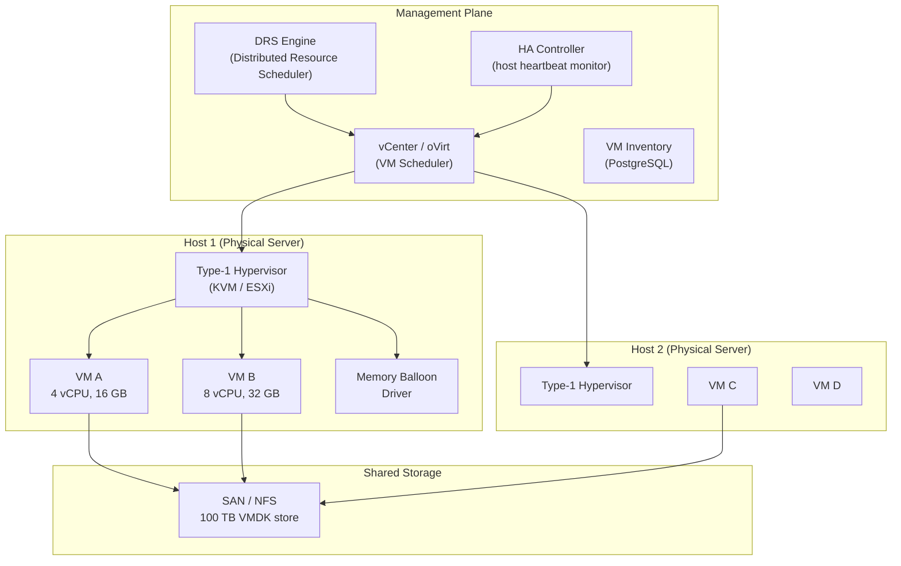
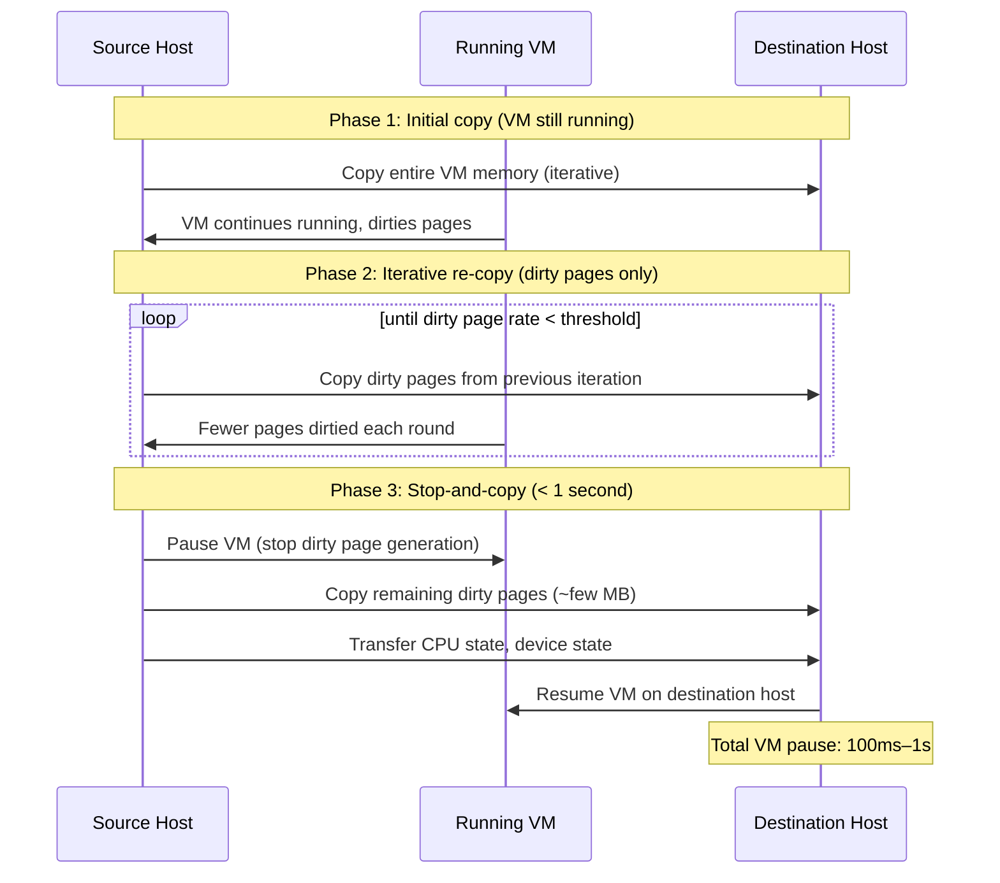
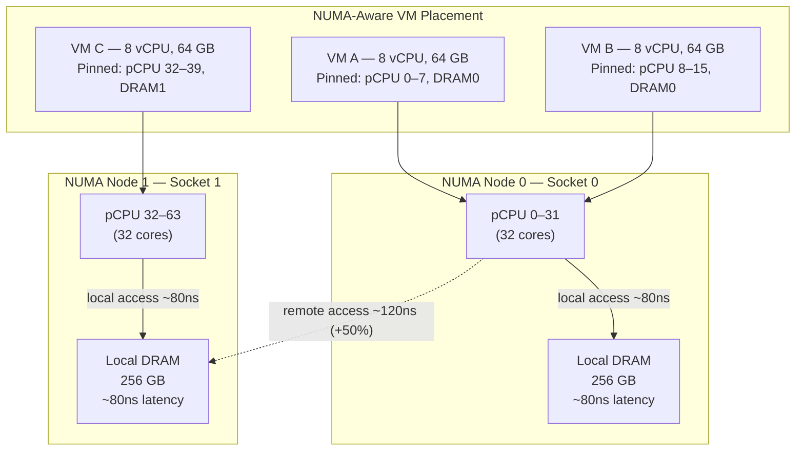
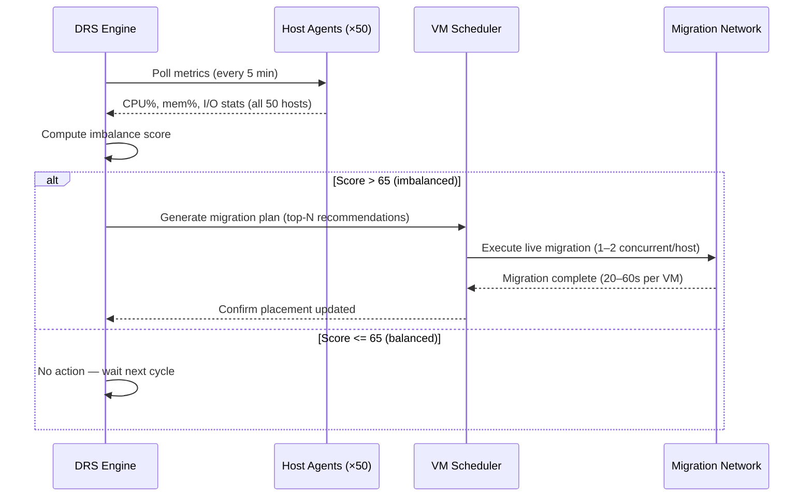
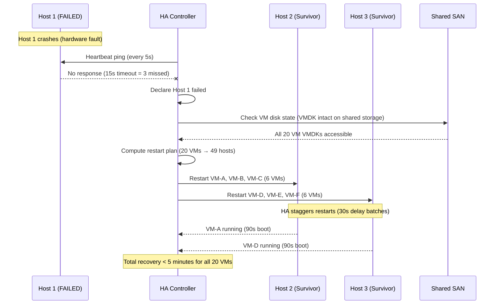

# Design a Virtualization Platform — 1,000 VMs on 50 Physical Hosts

**Difficulty**: 🔴 Advanced
**Reading Time**: 28 minutes
**Interview Frequency**: Medium — asked at cloud infrastructure, private cloud, and VMware ecosystem interviews

---

## Problem Statement

You are asked to design a virtualization platform that:

- **Works at**: 5 VMs on 1 host — simple KVM or VirtualBox handles this.
- **Breaks at**: 1,000 VMs across 50 physical hosts — manual placement wastes resources, host failures leave VMs unrecovered, memory overcommit without tracking causes swapping storms, and live migration during maintenance is error-prone without automation.

Target: **1,000 VMs**, **50 physical hosts** (20 VMs/host average), **4:1 CPU overcommit**, **2:1 memory overcommit**, **live migration < 1 second downtime**, **99.9% VM availability**.

---

## Requirements

### Functional Requirements

| Requirement | Description |
|-------------|-------------|
| VM Lifecycle | Create, start, stop, pause, snapshot, delete VMs |
| Resource Scheduling | Place VMs on hosts based on CPU/memory/storage availability |
| Live Migration | Move running VMs between hosts with < 1s downtime |
| High Availability | Restart VMs automatically on host failure |
| Resource Isolation | Guarantee CPU/memory limits per VM |
| Snapshots | Point-in-time copy of VM disk and memory state |

### Non-Functional Requirements

| Requirement | Target |
|-------------|--------|
| VM Density | 20 VMs/host (1,000 VMs / 50 hosts) |
| CPU Overcommit | 4:1 (4 vCPUs per physical core) |
| Memory Overcommit | 2:1 (using balloon driver + transparent huge pages) |
| Live Migration Downtime | < 1 second (for VMs with < 16 GB RAM) |
| HA Recovery Time | < 5 minutes (VM restarted on surviving host) |
| Management API Latency | < 500 ms for VM operations |

---

## Capacity Estimates

- **50 hosts × 64 physical cores = 3,200 pCPUs**, 4:1 overcommit → supports **12,800 vCPUs** → ~13 vCPUs/VM average
- **50 hosts × 512 GB RAM = 25.6 TB physical**, 2:1 overcommit → supports **51.2 TB virtual RAM** → ~50 GB/VM
- **Live migration**: 8 GB RAM per VM, dirty page rate 100 MB/s → ~80 seconds pre-copy iterations, < 1s final stop-and-copy
- **Storage**: 1,000 VMs × 100 GB = **100 TB** on shared SAN/NFS

---

## High-Level Architecture



---

## Level 1 — Surface: Type 1 vs Type 2 Hypervisors

| Dimension | Type 1 (Bare-Metal) | Type 2 (Hosted) |
|-----------|--------------------|--------------------|
| Runs on | Directly on hardware | On top of host OS |
| Performance | Near-native (2–5% overhead) | Higher overhead (5–15%) |
| Examples | KVM (Linux), VMware ESXi, Hyper-V | VirtualBox, VMware Workstation |
| Use case | Production data centers | Developer laptops, testing |
| Security | Better isolation (smaller attack surface) | Depends on host OS security |

For production virtualization of 1,000 VMs: **Type 1 hypervisor mandatory** — KVM (open source) or VMware ESXi (enterprise).

---

## Level 2 — Deep Dive: Live Migration

Live migration allows moving a running VM between hosts without visible downtime. Critical for:
- Host maintenance (patching, hardware replacement)
- Load balancing (DRS moves VMs when hosts are hot)
- Power management (consolidate VMs at night)

### Pre-Copy Migration Algorithm



**Bandwidth requirement**: 8 GB RAM, 100 MB/s dirty rate, 3 iterations → ~24 GB transferred. At 10 Gbps migration network: ~20 seconds total, < 1s stop-and-copy phase.

### Memory Overcommit Techniques

When VMs collectively request more RAM than physically available:

| Technique | How It Works | Performance Impact |
|-----------|-------------|-------------------|
| **Memory Balloon** | Hypervisor inflates balloon driver inside VM, reclaiming idle pages | Low — guest OS decides what to swap |
| **Transparent Page Sharing (TPS)** | Deduplicate identical pages across VMs (same OS base) | Medium scan overhead, 10–30% savings |
| **Memory Swapping** | Hypervisor swaps VM pages to disk | Severe — disk is 1000× slower than RAM |

**Best practice**: Enable balloon + TPS. Alert when memory utilization > 80% to prevent swapping.

---

## Key Design Decisions

### 1. CPU Overcommit Ratio

| Overcommit Ratio | Risk | Suitable Workload |
|-----------------|------|-------------------|
| 1:1 | None — wasteful | Real-time, latency-sensitive |
| 2:1 | Low | Mixed production workloads |
| **4:1** | **Medium — recommended** | **Dev/test, batch, web apps** |
| 8:1 | High — CPU ready time increases | Idle VMs, development only |

CPU "ready time" is the metric: % of time a vCPU wants to run but has no physical CPU available. Alert if > 5% ready time.

### 2. NUMA Awareness

Modern servers have Non-Uniform Memory Access (NUMA) topology — CPUs in socket 0 access local RAM at ~80 ns but remote RAM (socket 1) at ~120 ns (50% slower).

Without NUMA awareness: A VM with 8 vCPUs spread across both sockets incurs 50% memory latency penalty. With NUMA pinning: scheduler keeps vCPUs and VM memory on the same NUMA node. Trade-off: reduces packing density but improves performance for memory-intensive workloads.

### 3. Storage for VMs: Local vs. Shared

| Storage | Live Migration | HA | Cost | Performance |
|---------|--------------|-----|------|-------------|
| **Local disk** | Not possible | Manual re-create | Low | Highest IOPS |
| **Shared SAN/NFS** | Yes | Automatic | High | Lower IOPS |
| **Distributed storage (vSAN)** | Yes | Automatic | Medium | Medium |

For HA and live migration requirements: **shared storage (SAN/NFS/vSAN) is mandatory** — VM disk stays on shared storage while VM state is migrated.

---

## Interview Questions

| Question | What They're Testing | Key Answer Points |
|----------|---------------------|-------------------|
| How does live migration work without dropping network connections? | Networking knowledge | VM's MAC address moves to destination host via gratuitous ARP; switch updates MAC table; existing TCP connections survive because IP/MAC unchanged from client perspective |
| What happens when a host fails and how does HA work? | Failure modes | HA heartbeats via dedicated network; after 15s no heartbeat, surviving hosts "elect" to restart orphaned VMs on hosts with capacity; shared storage ensures disk is intact |
| Why can't you just overcommit memory 10:1? | Resource management | Beyond 2–3:1, balloon reclamation can't keep up; hypervisor starts swapping VM pages to SSD/HDD; disk is 1000× slower than RAM; all VMs on host experience severe performance degradation |

---

## Component Deep Dive 1: Hypervisor CPU Virtualization and Scheduling

The hypervisor is the core of the entire virtualization platform. Understanding how it multiplexes physical CPUs across hundreds of virtual CPUs is essential — naive approaches collapse at scale.

### How KVM/ESXi CPU Virtualization Works Internally

A Type-1 hypervisor intercepts all privileged CPU instructions. When a guest VM executes a ring-0 instruction (e.g., enabling interrupts, modifying page tables), the CPU traps into the hypervisor rather than executing directly. This is hardware-assisted via Intel VT-x or AMD-V: the CPU provides a "guest mode" (VMX non-root) where the VM believes it owns the hardware, and an "host mode" (VMX root) where the hypervisor runs.

At 20 VMs per host with 4:1 CPU overcommit, a 64-core host runs 256 vCPUs. The hypervisor's CPU scheduler must timeslice all 256 vCPUs across 64 physical cores using a **credit-based or proportional-share scheduler**. ESXi uses a strict credit scheduler: each vCPU earns credits proportional to its allocation; when credits expire, the vCPU is preempted. KVM delegates to Linux's CFS (Completely Fair Scheduler), treating each vCPU as a regular process.

### Why Naive Scheduling Fails at Scale

Simple round-robin scheduling ignores NUMA topology and causes latency spikes. At 256 vCPUs on 64 cores:

- A vCPU migrated to a different NUMA socket suffers 50% memory latency increase for cache-cold access
- Without CPU pinning, a latency-sensitive VM shares cores with a batch job causing 20–50ms latency jitter
- "CPU ready time" — time a vCPU is runnable but waiting for a physical core — exceeds 10% under naive scheduling, manifesting as application-level timeout storms



### CPU Scheduler Implementation Options

| Approach | Latency | Throughput | Trade-off |
|----------|---------|------------|-----------|
| **Credit Scheduler (ESXi)** | Low — preempts exceeding VMs quickly | Medium — overhead from credit accounting | Best fairness; hard limit enforcement; complexity in multi-socket systems |
| **CFS via KVM** | Medium — Linux CFS priority inheritance | High — battle-tested kernel scheduler | Leverages existing kernel; less fine-grained VM-level control |
| **CPU Pinning (dedicated cores)** | Lowest — no context switch | Lowest — wasted idle capacity | Best for latency-critical VMs; destroys overcommit benefit |

**Production recommendation**: Use credit/CFS for general VMs; pin dedicated cores only for database or real-time VMs. Set CPU ready time alert threshold at 5% — beyond that, DRS must migrate VMs.

---

## Component Deep Dive 2: Distributed Resource Scheduler (DRS)

DRS is the automated brain that decides where VMs live and when they should move. Without it, 1,000 VMs across 50 hosts drift into imbalanced states — some hosts at 95% CPU while others sit at 20%.

### Internal Mechanics

DRS runs on the management plane (vCenter/oVirt) every 5 minutes by default. Each cycle:

1. Collects host-level metrics: CPU usage %, memory balloon pressure, network I/O, storage latency
2. Computes a **cluster imbalance score** — standard deviation of host utilization normalized to 0–100
3. If imbalance > threshold (default: 65/100), generates migration recommendations ranked by expected improvement per migration cost
4. Executes live migrations — limited to 1–2 concurrent migrations per host to avoid saturating the 10 GbE migration network

DRS uses a **bin-packing heuristic** (not optimal — NP-hard problem), specifically a first-fit decreasing variant that places the largest VMs first and accounts for anti-affinity rules (e.g., "never place both primary and replica DB on the same host").

### Scale Behavior at 10x Load

At 10× baseline (100 simultaneous VM bursts rather than 10):

- DRS collection phase balloons from 200 ms to 2–4 seconds as all 50 host agents report simultaneously
- Migration recommendation engine processes 1,000 VMs × 50 hosts = 50,000 placement combinations — at 10x VM churn, this can take 8–12 seconds
- Concurrent migrations saturate the 10 GbE migration network: 8 GB RAM per VM × 10 concurrent = 80 GB in-flight; at 10 Gbps = 64 seconds to drain — DRS must throttle



### DRS Anti-Affinity Rules

Anti-affinity rules prevent correlated failures — if a host goes down, you don't want both primary and standby of any service co-located. DRS enforces these as hard constraints (reject placement) or soft constraints (prefer, but allow if necessary).

At 1,000 VMs with 200 anti-affinity pairs, rule evaluation adds ~300 ms to each DRS cycle — acceptable but must be monitored as cluster grows.

---

## Component Deep Dive 3: Shared Storage Layer and VMDK Management

Shared storage is what makes live migration and HA possible. VMs write to VMDK (VMware) or qcow2 (KVM) disk images stored on a SAN/NFS/vSAN that all hosts mount simultaneously. When a VM migrates, only CPU/memory state transfers — the disk stays in place.

### Key Technical Decisions

**Storage Protocol Choice**: iSCSI vs NFS vs Fibre Channel vs vSAN

iSCSI runs block storage over TCP/IP — simpler to set up than FC, supports live migration, but adds ~0.2–0.5 ms latency vs direct-attached. NFS is file-level — easier to manage VMDKs as files, but metadata operations (snapshot creation, VMDK clone) add overhead at 10,000+ files. Fibre Channel (FC) is lowest latency (0.05–0.1 ms) but expensive dedicated HBAs. vSAN distributes host-local SSDs into a software-defined storage pool — eliminates dedicated SAN cost but creates storage/compute coupling.

**Thin vs Thick Provisioning**: Thin-provisioned VMDKs allocate disk blocks on demand (100 TB nominal, 40 TB actual). This enables overcommit — 1,000 VMs × 100 GB = 100 TB nominal on 60 TB physical. Risk: if all VMs fill up simultaneously, storage runs out with no warning. **Mandatory**: storage utilization alert at 75% of physical capacity.

**Snapshot Chains**: Each snapshot creates a delta VMDK that captures all writes since the snapshot. After 3–4 snapshots per VM, the delta chain can be 20–40 GB. Reads must traverse the entire chain, adding 5–15% I/O overhead per snapshot depth level. Production rule: never allow more than 3 active snapshots per VM.

| Storage Option | Latency | Cost | Live Migration | HA |
|---------------|---------|------|----------------|-----|
| Fibre Channel SAN | 0.05–0.1 ms | Very High | Yes | Yes |
| iSCSI SAN | 0.2–0.5 ms | Medium | Yes | Yes |
| NFS | 0.5–2 ms | Low | Yes | Yes |
| vSAN (software-defined) | 0.3–1 ms | Medium | Yes | Yes |
| Local NVMe (no sharing) | 0.01–0.05 ms | Low | No | No |

---

## Data Model

The management plane stores VM state, host inventory, and placement decisions in PostgreSQL:

```sql
-- Physical host inventory
CREATE TABLE hosts (
  host_id          UUID PRIMARY KEY DEFAULT gen_random_uuid(),
  hostname         VARCHAR(255) NOT NULL UNIQUE,
  ip_address       INET NOT NULL,
  total_pcpus      SMALLINT NOT NULL,           -- e.g., 64
  total_memory_gb  SMALLINT NOT NULL,           -- e.g., 512
  numa_nodes       SMALLINT NOT NULL DEFAULT 2,
  status           VARCHAR(32) NOT NULL DEFAULT 'online',  -- online | maintenance | failed
  last_heartbeat   TIMESTAMPTZ NOT NULL DEFAULT NOW(),
  created_at       TIMESTAMPTZ NOT NULL DEFAULT NOW()
);

-- VM definitions and current placement
CREATE TABLE virtual_machines (
  vm_id            UUID PRIMARY KEY DEFAULT gen_random_uuid(),
  vm_name          VARCHAR(255) NOT NULL,
  host_id          UUID REFERENCES hosts(host_id),
  vcpus            SMALLINT NOT NULL,           -- e.g., 4
  memory_gb        SMALLINT NOT NULL,           -- e.g., 16
  disk_gb          INTEGER NOT NULL,            -- e.g., 100
  status           VARCHAR(32) NOT NULL DEFAULT 'stopped',  -- running | stopped | migrating | failed
  vmdk_path        VARCHAR(1024) NOT NULL,      -- e.g., /vmfs/volumes/san01/vm-abc/vm.vmdk
  numa_pinned_node SMALLINT,                   -- NULL = scheduler decides
  created_at       TIMESTAMPTZ NOT NULL DEFAULT NOW(),
  updated_at       TIMESTAMPTZ NOT NULL DEFAULT NOW()
);

-- Real-time host resource utilization (sampled every 60s)
CREATE TABLE host_metrics (
  metric_id        BIGSERIAL PRIMARY KEY,
  host_id          UUID NOT NULL REFERENCES hosts(host_id),
  sampled_at       TIMESTAMPTZ NOT NULL DEFAULT NOW(),
  cpu_used_pct     DECIMAL(5,2) NOT NULL,       -- e.g., 72.50
  memory_used_gb   DECIMAL(8,2) NOT NULL,
  balloon_active_gb DECIMAL(8,2) NOT NULL DEFAULT 0,
  cpu_ready_pct    DECIMAL(5,2) NOT NULL,       -- alert if > 5.0
  network_rx_gbps  DECIMAL(6,3) NOT NULL,
  network_tx_gbps  DECIMAL(6,3) NOT NULL
);
CREATE INDEX idx_host_metrics_host_time ON host_metrics (host_id, sampled_at DESC);

-- Migration history for audit and performance tracking
CREATE TABLE vm_migrations (
  migration_id     UUID PRIMARY KEY DEFAULT gen_random_uuid(),
  vm_id            UUID NOT NULL REFERENCES virtual_machines(vm_id),
  src_host_id      UUID NOT NULL REFERENCES hosts(host_id),
  dst_host_id      UUID NOT NULL REFERENCES hosts(host_id),
  trigger_reason   VARCHAR(64) NOT NULL,         -- drs_rebalance | maintenance | ha_recovery
  started_at       TIMESTAMPTZ NOT NULL,
  completed_at     TIMESTAMPTZ,
  downtime_ms      INTEGER,                      -- measured stop-and-copy duration
  bytes_transferred BIGINT,
  status           VARCHAR(32) NOT NULL DEFAULT 'in_progress'  -- in_progress | success | failed
);

-- Anti-affinity and affinity rules
CREATE TABLE placement_rules (
  rule_id          UUID PRIMARY KEY DEFAULT gen_random_uuid(),
  rule_type        VARCHAR(32) NOT NULL,         -- anti_affinity | affinity
  enforcement      VARCHAR(16) NOT NULL DEFAULT 'soft',  -- hard | soft
  vm_ids           UUID[] NOT NULL,              -- array of VM IDs in the rule group
  description      TEXT,
  created_at       TIMESTAMPTZ NOT NULL DEFAULT NOW()
);
```

---

## Scale Bottlenecks

| Traffic Level | Component That Breaks | Symptoms | Mitigation |
|---------------|----------------------|----------|------------|
| **10x baseline** (200 VMs/host burst) | CPU scheduler — 256 vCPUs compete for 64 pCPUs | CPU ready time spikes to 15–20%; application timeouts inside VMs | Trigger DRS migration; enforce 4:1 hard cap; enable CPU hot-add |
| **10x VM creates** (100 simultaneous provisions) | Shared storage — 100 concurrent VMDK clone operations | NFS metadata server saturates; clone time grows from 30s to 10+ min | Pre-allocate VMDK pool; use storage clones (writable snapshots) instead of full copy |
| **100x baseline** (5,000 VMs on 50 hosts) | Management plane PostgreSQL — DRS query scans 5,000 VM placements every 5 min | DRS cycle time exceeds 30s; placement decisions stale | Partition management DB by cluster; run DRS agents per-cluster with hierarchical aggregation |
| **Host failure storm** (5 hosts fail simultaneously) | HA Controller — all 250 VMs need restart on 45 remaining hosts | HA admission control underestimates headroom; storms create thundering herd on storage | Reserve 10% host capacity for HA (N+1 capacity); stagger HA restarts with 30s delay between VM batches |
| **1000x baseline** (50,000 VMs) | Network control plane — 50,000 MAC table entries for VM NICs | Switch MAC table overflow; ARP flooding on VLAN | Adopt SDN (VMware NSX / OVN) — push MAC learning into overlay network; eliminate physical switch dependency |

---

## How AWS EC2 Built This

AWS EC2 is the world's largest virtualization platform — hundreds of millions of VMs across 30+ regions as of 2024. Their engineering choices at scale are highly instructive.

**The Nitro System (2017–present)**: AWS's most non-obvious architectural decision was moving hypervisor functions off the host CPU entirely. Traditional KVM/ESXi runs the virtualization control plane on host CPU cycles — at 100 VMs/host, that's 10–15% of physical CPU consumed by hypervisor overhead, not available to customer VMs.

AWS designed **Nitro Cards** — dedicated ASICs (application-specific integrated circuits) that handle I/O virtualization, EBS storage encryption, VPC networking, and security monitoring in hardware. The result: 0% hypervisor CPU overhead tax on customer instances. A `c5.metal` instance at $3.84/hr gives customers 100% of 96 vCPUs — no hypervisor overhead.

**Numbers**: EC2 reports < 0.1 ms hypervisor-induced latency on Nitro instances vs 0.5–2 ms on older Xen-based instances. EBS I/O throughput increased 4× when Nitro offloaded the encryption/decryption to dedicated ASICs.

**Placement Groups**: AWS's equivalent of anti-affinity rules. A "cluster placement group" guarantees VMs land on the same physical rack (low latency, 10–25 Gbps inter-VM). A "spread placement group" guarantees each VM lands on different racks. At AWS scale, this requires tight integration between the VM scheduler, physical rack topology database, and network topology — solved by the **Amazon Physalia** placement service which maintains a globally consistent view of host health and topology.

**Live Migration at AWS Scale**: AWS uses a variant of post-copy migration (not pre-copy) for EC2 instance migration. Post-copy starts the VM immediately on the destination, then fetches pages on demand from the source on page faults — resulting in < 10ms observable downtime even for 512 GB memory instances, at the cost of higher network sensitivity during migration.

Source: [AWS re:Invent 2017 — The Nitro Project](https://www.youtube.com/watch?v=LabltEXk0VQ), [AWS EC2 Nitro Architecture](https://aws.amazon.com/ec2/nitro/)

---

## Interview Angle

**What the interviewer is testing:** Your ability to reason about resource overcommit trade-offs, failure isolation under host failures, and the mechanical details of live migration — specifically whether you understand that "zero downtime" is a myth and the real constraint is minimizing the stop-and-copy phase.

**Common mistakes candidates make:**

1. **Claiming live migration has zero downtime.** It does not — there is always a stop-and-copy phase of 100ms–1s where the VM is paused. Candidates who say "zero downtime" reveal they don't understand the algorithm. The correct answer: "sub-second observable downtime, achieved by iterating pre-copy until dirty page rate drops below the network bandwidth."

2. **Ignoring NUMA topology.** Candidates design the scheduler as a flat bin-packer without mentioning NUMA. At 512 GB RAM per host, cross-NUMA memory access adds 50% latency penalty for memory-intensive VMs. A good answer mentions NUMA-aware placement as a scheduling constraint.

3. **Using local storage for VMs to "improve performance."** This breaks HA (no shared storage = can't restart VM on another host) and breaks live migration. The correct answer is: use shared storage (SAN/vSAN/NFS) for HA-required VMs, and only use local NVMe for truly stateless or ephemeral workloads where you accept re-provision on failure.

**The insight that separates good from great answers:** The biggest constraint in a 1,000 VM cluster is not CPU or memory — it is **correlated failure blast radius**. A naive design puts 20 VMs on each host with no anti-affinity rules. When a host fails, 20 VMs restart on remaining 49 hosts — manageable. But if those 20 VMs include 10 primary database replicas and their corresponding 10 standbys are co-located on a second host that also fails (correlated failure from a bad firmware update), you lose all 20 database primaries simultaneously. A production design uses anti-affinity rules, rack-level failure domain awareness, and HA admission control that reserves capacity for N+2 host failures — not just N+1.

---

## Key Numbers to Remember

| Metric | Value | Context |
|--------|-------|---------|
| Type-1 hypervisor CPU overhead | 2–5% | KVM/ESXi on modern Intel VT-x hardware |
| AWS Nitro hypervisor CPU overhead | ~0% | Offloaded to dedicated ASICs |
| CPU overcommit sweet spot | 4:1 | Dev/web workloads; alert at > 5% CPU ready time |
| Memory overcommit maximum | 2:1 | Beyond 2:1 triggers hypervisor swap (1000× slower than RAM) |
| Live migration total transfer time | ~20 seconds | 8 GB RAM, 100 MB/s dirty rate, 10 Gbps network |
| Live migration stop-and-copy phase | 100ms–1s | VM pause time; proportional to final dirty page set |
| NUMA remote memory penalty | +50% latency | 80 ns local vs 120 ns remote on dual-socket server |
| DRS rebalance interval | 5 minutes | Default in vSphere; shorter = higher management overhead |
| Snapshot chain I/O penalty | 5–15% per depth | More than 3 snapshots per VM degrades I/O significantly |
| HA recovery time target | < 5 minutes | VM restart on surviving host after host failure detection |
| Storage alert threshold | 75% physical | Thin-provisioned VMDKs can silently overrun physical capacity |
| Host evacuation time | ~3.5 minutes | 20 VMs × 8 GB RAM, 2 concurrent migrations, 10 Gbps migration network |
| Max snapshot depth (practical) | 3 snapshots | Beyond 3 deltas, I/O latency increases 15–45%; read must traverse full chain |
| Management plane HA failover | < 5 minutes | vCenter HA 3-node cluster; blocking window for new VM ops during failover |
| iSCSI storage latency | 0.2–0.5 ms | vs Fibre Channel 0.05–0.1 ms; acceptable for most VM workloads |

---

## Common Mistakes in Production Virtualization

### 1. Over-trusting Memory Overcommit Without Monitoring

Teams set 2:1 memory overcommit, enable balloon drivers, and assume the system is self-managing. In practice, balloon reclamation is cooperative — the guest OS must respond to the balloon driver's memory pressure signals. If a guest OS is running a Java process with a fixed heap (`-Xmx`), it will not release that heap memory regardless of balloon pressure. The hypervisor then escalates to swap — writing VM pages to SSD/NVMe at 0.5–1 ms latency vs RAM at 80 ns, causing a 600–12,500× performance cliff. **Fix**: Monitor `balloon_active_gb` per host. If balloon active > 20% of host RAM, the cluster is under-provisioned — add hosts or reduce VM density before swapping starts.

### 2. Single Point of Failure in the Management Plane

Teams run a single vCenter or oVirt engine instance. When the management plane fails, no new VMs can be created, no DRS migrations fire, and — critically — HA cannot restart VMs on host failure. The management plane itself is a dependency of the HA system. **Fix**: Deploy management plane in a clustered or HA configuration. VMware vCenter HA runs three nodes (active, passive, witness) with automated failover in < 5 minutes. Ensure the management plane VMs are on a separate host failure domain from the VMs they manage.

### 3. Ignoring Network Bandwidth for Live Migration

Teams provision 10 GbE host NICs and assume live migration won't contend with VM traffic. At 20 VMs/host with 8 GB RAM each, one DRS migration transfers 8 GB in ~7 seconds at 10 Gbps. If DRS fires 3 concurrent migrations (60 hosts rebalancing), that's 3 × 8 Gbps = 24 Gbps — saturating the uplinks and causing packet loss for running VMs. **Fix**: Dedicate a separate 10 GbE or 25 GbE NIC for vMotion/live migration traffic, isolated on a dedicated VLAN. Rate-limit migration bandwidth to 8 Gbps to preserve 2 Gbps headroom for VM workload traffic.

### 4. Snapshot Accumulation

Snapshots are a backup mechanism, not a version control system. Teams leave snapshot chains open for weeks — creating 10+ snapshot deltas per VM. Read I/O must traverse the entire delta chain, adding 5–15% latency per level. At 10 snapshots deep, read latency can increase 50–150%, causing application SLA violations. Storage utilization grows silently as deltas accumulate. **Fix**: Enforce a policy: no snapshot older than 72 hours. Automate snapshot cleanup via API. Alert when a VM has > 3 active snapshots.

---

## HA Failure Recovery Flow

The sequence below shows how the HA controller handles a host failure — the most critical failure mode in the cluster:



**HA Admission Control**: HA reserves capacity for N+1 host failures by default. With 50 hosts, it reserves ~2% capacity headroom (1/50th of cluster resources) for VM restarts. If a host fails and restarts consume this reserved capacity, HA blocks creation of new VMs until capacity is restored — this prevents "double jeopardy" where a second host failure has nowhere to restart VMs.

---

## 📚 Resources & References

| Resource | Type | What You'll Learn |
|----------|------|------------------|
| [KVM Architecture — Red Hat](https://access.redhat.com/documentation/en-us/red_hat_enterprise_linux/9/html/configuring_and_managing_virtualization/index) | 📚 Docs | KVM internals, CPU/memory virtualization, live migration |
| [VMware vSphere Architecture](https://docs.vmware.com/en/VMware-vSphere/8.0/vsphere-resource-management/GUID-98BD5A8A-260A-494F-BAAE-74781F5C4B87.html) | 📚 Docs | DRS algorithm, HA clustering, resource pools |
| [AWS re:Invent 2017 — The Nitro Project](https://www.youtube.com/watch?v=LabltEXk0VQ) | 📺 Video | How AWS offloaded hypervisor overhead to custom ASICs |
| [The Architecture of Open Source Applications — QEMU](https://aosabook.org/en/v1/qemu.html) | 📖 Blog | QEMU/KVM architecture deep dive |
| [ByteByteGo YouTube](https://www.youtube.com/@ByteByteGo) | 📺 YouTube | Visual walkthroughs of hypervisor and cloud infrastructure concepts |

---

## Operational Runbook: Host Maintenance Procedure

The correct sequence to safely evacuate a host for maintenance (patching, hardware swap) without VM downtime:

1. **Set host to maintenance mode** — signals DRS to migrate all VMs off, blocks new VM placement
2. **Wait for DRS evacuation** — DRS live-migrates VMs over 5–15 minutes; monitor migration network utilization; expect 80–90% of 10 GbE uplink during this window
3. **Verify zero running VMs on host** — `esxcli vm process list` or oVirt API returns empty
4. **Confirm storage multipath health** — ensure remaining hosts still have redundant paths to SAN before taking the host offline
5. **Power off / patch host** — safe to proceed; no VM impact
6. **Bring host back online** — host reconnects to vCenter/oVirt, passes health checks
7. **Exit maintenance mode** — DRS rebalances VMs back to reintroduce the host into the cluster over the next 5-minute DRS cycle

**Time budget**: Full evacuation of 20 VMs (8 GB RAM each) at 2 concurrent migrations ≈ 20 × 20s / 2 = 200 seconds ≈ 3.5 minutes. Plan 10 minutes total for safety margin.

**Storage multipath**: Before taking any host offline, verify all remaining hosts have at least 2 active paths to shared SAN. A single-path failure during host maintenance leaves surviving hosts with no redundancy — a second path failure causes a storage partition and VM I/O freeze cluster-wide. Check with `esxcli storage nmp device list` (ESXi) or `multipath -ll` (Linux/KVM).

---

## Containers vs VMs — When to Use Which

A common interview trap is conflating containers and VMs. They solve different isolation problems:

| Dimension | Virtual Machine | Container |
|-----------|----------------|-----------|
| Isolation | Hardware-level (separate kernel) | OS-level (shared kernel, namespaces) |
| Boot time | 30–120 seconds | 100ms–2 seconds |
| Memory overhead | 256 MB–2 GB per instance | 5–50 MB per instance |
| Density | 20–50 per host | 200–500 per host |
| Security blast radius | VM escape requires hypervisor 0-day | Container escape requires kernel 0-day (more common) |
| Use case | Multi-tenant workloads needing strong isolation, legacy OS support | Microservices, CI/CD, stateless apps |

**The right answer for 1,000 mixed workloads**: Run containers inside VMs. Kubernetes pods run inside VM nodes — you get container density (500 pods/VM) with VM-level isolation between tenants. AWS EKS, GKE, and AKS all use this model: each customer's node group is isolated VMs; containers share the kernel only within a single customer boundary.

---

## Related Concepts

- [Container Orchestration](./container-orchestration) — containers vs VMs: different isolation model, same scheduling problems
- [Disaster Recovery](./disaster-recovery) — HA is one component of a broader DR strategy (RPO/RTO targets)
- [Load Balancer](./load-balancer) — DRS is a resource-level load balancer; same bin-packing algorithms apply
