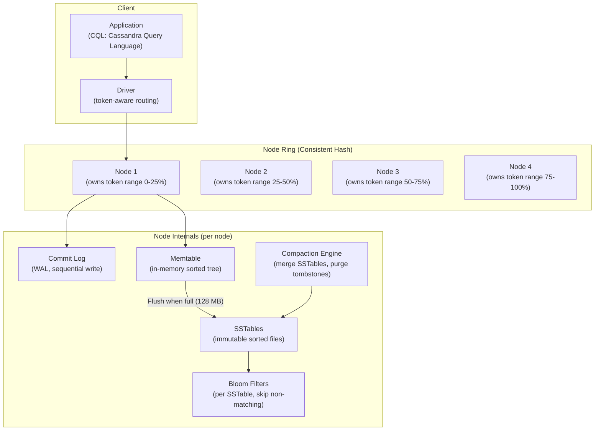
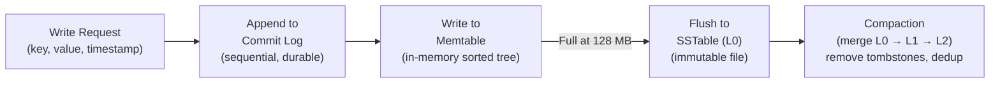
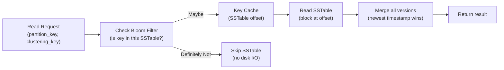

# Design a Wide-Column Database — 1M Writes/Sec, Flexible Schema

**Difficulty**: 🔴 Advanced (Hard)
**Reading Time**: 30 minutes
**Interview Frequency**: High — Cassandra/HBase design is a common interview topic at time-series, IoT, and high-write companies

---

## Problem Statement

You are asked to design a wide-column store that:

- **Works at**: 10K writes/second to PostgreSQL — a single node handles it with good indexing.
- **Breaks at**: 1M writes/second with IoT sensor data, time-series metrics, or social activity events — PostgreSQL's B-tree index on every insert causes random I/O; ALTER TABLE for new sensor types locks the table; cross-shard transactions for time-series queries are expensive; TTL-based expiry requires background jobs.

Target: **1M writes/second**, **flexible schema** (unlimited columns per row), **time-series query patterns** (range by row key + timestamp), **built-in TTL**, **no single point of failure**, comparable to Apache Cassandra.

---

## Requirements

### Functional Requirements

| Requirement | Description |
|-------------|-------------|
| Write | Insert row with flexible columns (schema-free column families) |
| Read | Get row by primary key, range scan by partition + clustering key |
| TTL | Automatic expiry of columns/rows after N seconds |
| Secondary Index | Query by non-primary-key columns |
| Batch Write | Atomic batch of rows within same partition |
| Schema Evolution | Add new columns without table lock or migration |

### Non-Functional Requirements

| Requirement | Target |
|-------------|--------|
| Write Throughput | 1M writes/second |
| Write Latency | < 2 ms p99 |
| Read Latency | < 5 ms p99 for key lookup |
| Availability | 99.999% (no single point of failure) |
| Durability | 3× replication factor |
| Scale | 100 nodes, petabyte-scale data |

---

## Capacity Estimates

- **1M writes/sec × 200 bytes/write = 200 MB/s** write throughput
- **3× replication**: effective disk write = **600 MB/s** across cluster
- **100 nodes**: 6 MB/s per node (easily handled by modern SSDs at 500 MB/s)
- **SSTables accumulation**: 200 MB/s × 86,400 = **16.6 TB/day** new data; compaction reduces by ~30% = 11.6 TB/day net
- **Bloom filter size**: 1B rows × 10 bits/element = **1.25 GB** (fits in RAM)

---

## High-Level Architecture



---

## Level 1 — Surface: Why Wide-Column for Time-Series?

**Data model**: A wide-column row has a **partition key** (determines shard) + **clustering key** (determines sort order within partition) + unlimited columns.

For IoT sensor data:
```
CREATE TABLE sensor_readings (
    device_id text,           -- partition key (same device → same shard)
    timestamp timestamp,      -- clustering key (sorted within partition)
    temperature float,        -- column (only present if sensor has it)
    humidity float,           -- column (optional)
    co2_ppm int,             -- column (optional, may not exist for all devices)
    PRIMARY KEY (device_id, timestamp)
) WITH CLUSTERING ORDER BY (timestamp DESC)
  AND default_time_to_live = 2592000;  -- 30 day TTL
```

**Query**: `SELECT * FROM sensor_readings WHERE device_id='sensor-1' AND timestamp > '2024-01-01'` → hits one partition, sequential scan = **< 5ms**.

This is impossible with RDBMS at this scale: 1M writes/sec × random B-tree updates = disk random I/O bottleneck.

---

## Level 2 — Deep Dive: LSM Tree Write Path

Cassandra uses a **Log-Structured Merge Tree (LSM Tree)** — all writes are sequential (no random I/O), enabling 1M writes/sec.



### Read Path



**Bloom filter**: Probabilistic data structure. False positive rate ~1% with 10 bits/element. If bloom filter says "not present" → skip SSTable entirely. Reduces reads from O(num_SSTables) to O(1) for non-existent keys.

### Compaction Strategies

| Strategy | Use Case | Write Amplification | Read Amplification |
|----------|----------|--------------------|--------------------|
| **STCS** (Size-Tiered) | Write-heavy (time-series, IoT) | Low | High (many SSTables) |
| **LCS** (Leveled) | Read-heavy | High (more rewriting) | Low (few SSTables) |
| **TWCS** (Time-Window) | Time-series with TTL | Low | Low (same-window merge) |

**Recommendation**: Use TWCS for IoT/time-series — groups SSTables by time window, entire window dropped when TTL expires (no need to scan for individual tombstones).

### Tombstones and GC Grace Period

Cassandra never modifies in-place. Deletes create **tombstones** — markers that say "this key was deleted". During compaction, tombstones older than `gc_grace_seconds` (default 10 days) are purged.

**Tombstone storm**: 1M deletes/day × 30 days = 30M tombstones. Queries scan all tombstones before finding live data → severe read degradation. Fix: TWCS with TTL (data expires without tombstones), or use partition-level deletes (drop entire partition, not individual rows).

---

## Key Design Decisions

### 1. Wide Schema vs. Narrow Schema

| Design | Schema | Read Efficiency | Schema Flexibility |
|--------|--------|----------------|-------------------|
| **Narrow** | Few columns, many rows | High (specific columns indexed) | Low (ALTER TABLE required) |
| **Wide** | Many columns per row | Medium (scan columns in row) | High (add column, no migration) |
| **Sparse Wide** | Columns present only when set | High (no null storage) | Highest |

Cassandra uses **sparse wide rows** — only set columns are stored. A row with 1,000 possible sensor types stores only the 5 types that device actually has.

### 2. Consistency Level Trade-off

Cassandra supports tunable consistency per operation:

| Consistency | Write | Read | Availability |
|-------------|-------|------|--------------|
| **ONE** | Write to 1 replica (async to others) | Read from 1 replica | Highest (1 node survives) |
| **QUORUM** | Write to majority (N/2+1) | Read from majority | Medium (survive minority failure) |
| **ALL** | Write to all replicas | Read from all | Lowest (all must be up) |

**Formula**: `W + R > N` → strong consistency. `W=QUORUM, R=QUORUM, N=3` → 2+2 > 3 → strong consistency, tolerates 1 node failure.

For time-series: use `W=ONE, R=ONE` for maximum write/read throughput, accepting eventual consistency.

### 3. Row Key Design (Anti-Patterns)

**Hot partition anti-pattern**:
```
// BAD: All writes for current day go to one partition
partition_key = current_date  // e.g., "2024-01-15"
```
10K devices × 100 writes/sec = 1M writes/sec on ONE partition → hot node.

**Good design**:
```
// GOOD: Device ID distributes writes evenly
partition_key = device_id  // Each device has its own partition
```
1M writes/sec across 1M devices = 1 write/sec/device → even distribution.

---

## Interview Questions

| Question | What They're Testing | Key Answer Points |
|----------|---------------------|-------------------|
| Why is Cassandra better than PostgreSQL for 1M writes/sec? | Storage engine knowledge | LSM tree: all writes are sequential (commit log + memtable); no random B-tree index updates; compaction handles merging offline; sequential write throughput 10× higher than random |
| What is a Cassandra tombstone storm and how do you prevent it? | Operational depth | Many row-level deletes create tombstones that accumulate between compactions; queries scan all tombstones; prevention: use TTL (data expires, no tombstone); use TWCS (window drop = mass tombstone purge); avoid deleting individual columns at high rate |
| How do you design a partition key for sensor data? | Data modeling | Partition by device_id (even distribution); cluster by timestamp DESC (newest first); avoids hot partitions, enables time-range queries on specific devices in < 5ms |

---

## 📚 Resources & References

| Resource | Type | What You'll Learn |
|----------|------|------------------|
| [DataStax Cassandra Architecture](https://docs.datastax.com/en/cassandra-oss/3.0/cassandra/architecture/archIntro.html) | 📚 Docs | LSM tree, compaction, gossip protocol, consistent hashing |
| [Facebook Cassandra Paper](https://www.cs.cornell.edu/projects/ladis2009/papers/lakshman-ladis2009.pdf) | 📖 Blog | Original Cassandra design, column family model, Dynamo-style replication |
| [Designing Data-Intensive Applications](https://www.oreilly.com/library/view/designing-data-intensive-applications/9781491903063/) | 📚 Book | Chapter 3: LSM trees vs B-trees, bloom filters, compaction strategies |
| [ByteByteGo YouTube](https://www.youtube.com/@ByteByteGo) | 📺 YouTube | Cassandra internals, wide-column vs other NoSQL, time-series patterns |

---

## Related Concepts

- [Key-Value Store](./key-value-store) — Cassandra's underlying storage uses similar key-value primitives
- [Distributed OLTP](./distributed-oltp) — contrast: OLTP for ACID transactions vs. wide-column for high-write analytics
- [Big Data Pipeline](./big-data-pipeline) — Cassandra serves as the hot storage layer in data pipelines
