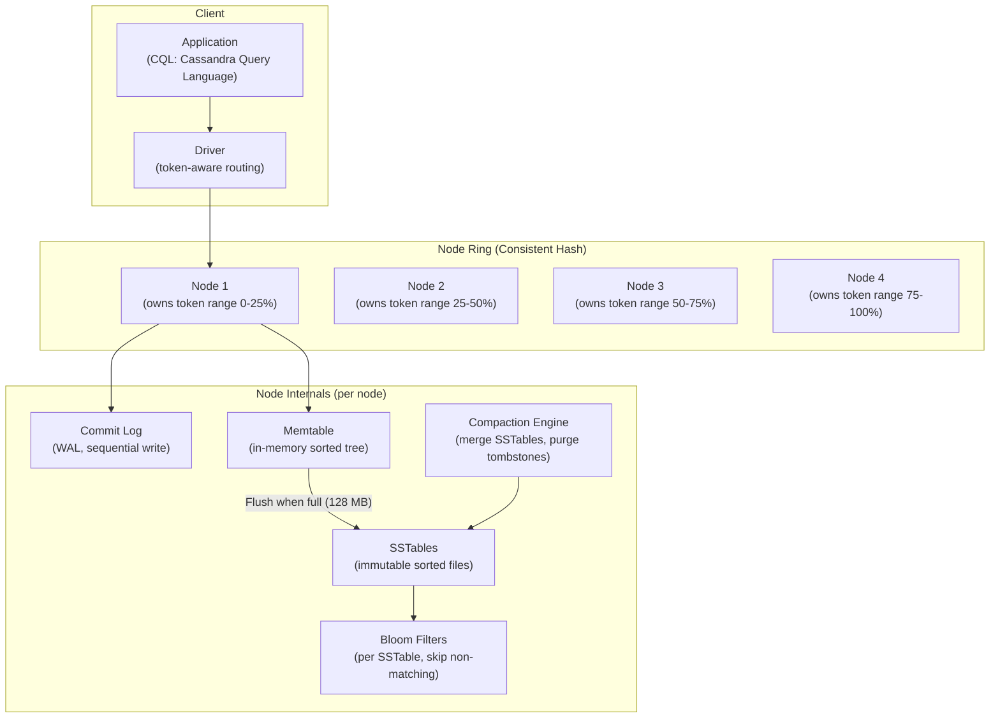
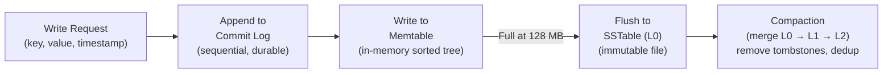
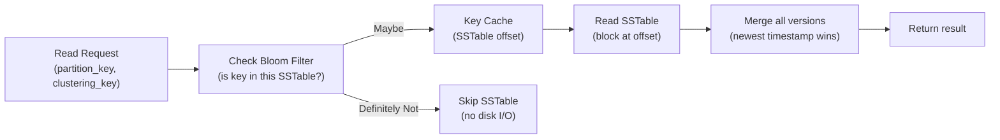
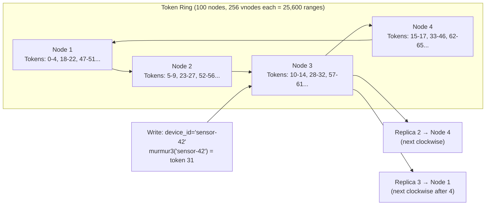
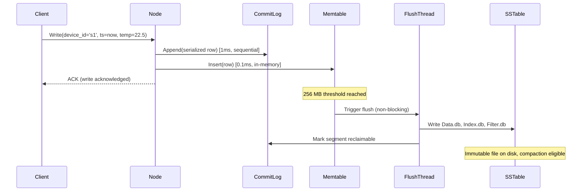

# Design a Wide-Column Database — 1M Writes/Sec, Flexible Schema

**Difficulty**: 🔴 Advanced (Hard)
**Reading Time**: 30 minutes
**Interview Frequency**: High — Cassandra/HBase design is a common interview topic at time-series, IoT, and high-write companies

---

## Problem Statement

You are asked to design a wide-column store that:

- **Works at**: 10K writes/second to PostgreSQL — a single node handles it with good indexing.
- **Breaks at**: 1M writes/second with IoT sensor data, time-series metrics, or social activity events — PostgreSQL's B-tree index on every insert causes random I/O; ALTER TABLE for new sensor types locks the table; cross-shard transactions for time-series queries are expensive; TTL-based expiry requires background jobs.

Target: **1M writes/second**, **flexible schema** (unlimited columns per row), **time-series query patterns** (range by row key + timestamp), **built-in TTL**, **no single point of failure**, comparable to Apache Cassandra.

---

## Requirements

### Functional Requirements

| Requirement | Description |
|-------------|-------------|
| Write | Insert row with flexible columns (schema-free column families) |
| Read | Get row by primary key, range scan by partition + clustering key |
| TTL | Automatic expiry of columns/rows after N seconds |
| Secondary Index | Query by non-primary-key columns |
| Batch Write | Atomic batch of rows within same partition |
| Schema Evolution | Add new columns without table lock or migration |

### Non-Functional Requirements

| Requirement | Target |
|-------------|--------|
| Write Throughput | 1M writes/second |
| Write Latency | < 2 ms p99 |
| Read Latency | < 5 ms p99 for key lookup |
| Availability | 99.999% (no single point of failure) |
| Durability | 3× replication factor |
| Scale | 100 nodes, petabyte-scale data |

---

## Capacity Estimates

- **1M writes/sec × 200 bytes/write = 200 MB/s** write throughput
- **3× replication**: effective disk write = **600 MB/s** across cluster
- **100 nodes**: 6 MB/s per node (easily handled by modern SSDs at 500 MB/s)
- **SSTables accumulation**: 200 MB/s × 86,400 = **16.6 TB/day** new data; compaction reduces by ~30% = 11.6 TB/day net
- **Bloom filter size**: 1B rows × 10 bits/element = **1.25 GB** (fits in RAM)

---

## High-Level Architecture



---

## Level 1 — Surface: Why Wide-Column for Time-Series?

**Data model**: A wide-column row has a **partition key** (determines shard) + **clustering key** (determines sort order within partition) + unlimited columns.

For IoT sensor data:
```
CREATE TABLE sensor_readings (
    device_id text,           -- partition key (same device → same shard)
    timestamp timestamp,      -- clustering key (sorted within partition)
    temperature float,        -- column (only present if sensor has it)
    humidity float,           -- column (optional)
    co2_ppm int,             -- column (optional, may not exist for all devices)
    PRIMARY KEY (device_id, timestamp)
) WITH CLUSTERING ORDER BY (timestamp DESC)
  AND default_time_to_live = 2592000;  -- 30 day TTL
```

**Query**: `SELECT * FROM sensor_readings WHERE device_id='sensor-1' AND timestamp > '2024-01-01'` → hits one partition, sequential scan = **< 5ms**.

This is impossible with RDBMS at this scale: 1M writes/sec × random B-tree updates = disk random I/O bottleneck.

---

## Level 2 — Deep Dive: LSM Tree Write Path

Cassandra uses a **Log-Structured Merge Tree (LSM Tree)** — all writes are sequential (no random I/O), enabling 1M writes/sec.



### Read Path



**Bloom filter**: Probabilistic data structure. False positive rate ~1% with 10 bits/element. If bloom filter says "not present" → skip SSTable entirely. Reduces reads from O(num_SSTables) to O(1) for non-existent keys.

### Compaction Strategies

| Strategy | Use Case | Write Amplification | Read Amplification |
|----------|----------|--------------------|--------------------|
| **STCS** (Size-Tiered) | Write-heavy (time-series, IoT) | Low | High (many SSTables) |
| **LCS** (Leveled) | Read-heavy | High (more rewriting) | Low (few SSTables) |
| **TWCS** (Time-Window) | Time-series with TTL | Low | Low (same-window merge) |

**Recommendation**: Use TWCS for IoT/time-series — groups SSTables by time window, entire window dropped when TTL expires (no need to scan for individual tombstones).

### Tombstones and GC Grace Period

Cassandra never modifies in-place. Deletes create **tombstones** — markers that say "this key was deleted". During compaction, tombstones older than `gc_grace_seconds` (default 10 days) are purged.

**Tombstone storm**: 1M deletes/day × 30 days = 30M tombstones. Queries scan all tombstones before finding live data → severe read degradation. Fix: TWCS with TTL (data expires without tombstones), or use partition-level deletes (drop entire partition, not individual rows).

---

## Key Design Decisions

### 1. Wide Schema vs. Narrow Schema

| Design | Schema | Read Efficiency | Schema Flexibility |
|--------|--------|----------------|-------------------|
| **Narrow** | Few columns, many rows | High (specific columns indexed) | Low (ALTER TABLE required) |
| **Wide** | Many columns per row | Medium (scan columns in row) | High (add column, no migration) |
| **Sparse Wide** | Columns present only when set | High (no null storage) | Highest |

Cassandra uses **sparse wide rows** — only set columns are stored. A row with 1,000 possible sensor types stores only the 5 types that device actually has.

### 2. Consistency Level Trade-off

Cassandra supports tunable consistency per operation:

| Consistency | Write | Read | Availability |
|-------------|-------|------|--------------|
| **ONE** | Write to 1 replica (async to others) | Read from 1 replica | Highest (1 node survives) |
| **QUORUM** | Write to majority (N/2+1) | Read from majority | Medium (survive minority failure) |
| **ALL** | Write to all replicas | Read from all | Lowest (all must be up) |

**Formula**: `W + R > N` → strong consistency. `W=QUORUM, R=QUORUM, N=3` → 2+2 > 3 → strong consistency, tolerates 1 node failure.

For time-series: use `W=ONE, R=ONE` for maximum write/read throughput, accepting eventual consistency.

### 3. Row Key Design (Anti-Patterns)

**Hot partition anti-pattern**:
```
// BAD: All writes for current day go to one partition
partition_key = current_date  // e.g., "2024-01-15"
```
10K devices × 100 writes/sec = 1M writes/sec on ONE partition → hot node.

**Good design**:
```
// GOOD: Device ID distributes writes evenly
partition_key = device_id  // Each device has its own partition
```
1M writes/sec across 1M devices = 1 write/sec/device → even distribution.

---

## Interview Questions

| Question | What They're Testing | Key Answer Points |
|----------|---------------------|-------------------|
| Why is Cassandra better than PostgreSQL for 1M writes/sec? | Storage engine knowledge | LSM tree: all writes are sequential (commit log + memtable); no random B-tree index updates; compaction handles merging offline; sequential write throughput 10× higher than random |
| What is a Cassandra tombstone storm and how do you prevent it? | Operational depth | Many row-level deletes create tombstones that accumulate between compactions; queries scan all tombstones; prevention: use TTL (data expires, no tombstone); use TWCS (window drop = mass tombstone purge); avoid deleting individual columns at high rate |
| How do you design a partition key for sensor data? | Data modeling | Partition by device_id (even distribution); cluster by timestamp DESC (newest first); avoids hot partitions, enables time-range queries on specific devices in < 5ms |

---

## 📚 Resources & References

| Resource | Type | What You'll Learn |
|----------|------|------------------|
| [DataStax Cassandra Architecture](https://docs.datastax.com/en/cassandra-oss/3.0/cassandra/architecture/archIntro.html) | 📚 Docs | LSM tree, compaction, gossip protocol, consistent hashing |
| [Facebook Cassandra Paper](https://www.cs.cornell.edu/projects/ladis2009/papers/lakshman-ladis2009.pdf) | 📖 Blog | Original Cassandra design, column family model, Dynamo-style replication |
| [Designing Data-Intensive Applications](https://www.oreilly.com/library/view/designing-data-intensive-applications/9781491903063/) | 📚 Book | Chapter 3: LSM trees vs B-trees, bloom filters, compaction strategies |
| [ByteByteGo YouTube](https://www.youtube.com/@ByteByteGo) | 📺 YouTube | Cassandra internals, wide-column vs other NoSQL, time-series patterns |

---

## Component Deep Dive 1: Consistent Hashing and the Token Ring

The token ring is the engine behind Cassandra's ability to scale horizontally without a central coordinator or manual sharding. Every node is assigned one or more **virtual nodes (vnodes)**, each owning a range of the 128-bit token space (2^127 positions). When a write arrives, the driver computes `murmur3_hash(partition_key) % 2^127` and routes to the node that owns that token range. No configuration table lookups, no master lookup service — pure math.

**Why naive consistent hashing fails at scale**: Classic consistent hashing assigns each physical node exactly one position on the ring. This produces massively uneven load when nodes are heterogeneous or when token ranges cluster. If 3 of 100 nodes get 30% of the keyspace, those 3 nodes absorb 10× the write load of their neighbors, triggering GC pressure, memtable flush storms, and compaction backlogs.

**Vnodes solve the skew problem**: Instead of 1 position per node, Cassandra assigns each node `num_tokens=256` vnode positions uniformly distributed around the ring. A 100-node cluster has 25,600 token ranges. When a new node joins, it "steals" ~256 ranges from existing nodes, distributing the data movement evenly. Old single-token approach required moving up to 50% of data on node addition; vnodes reduce it to 1/N of data per added node.



**Replication**: After the coordinator node receives the write, it forwards copies to the next N-1 clockwise neighbors in the ring. With `replication_factor=3`, 3 different physical nodes always hold every partition, each in different racks/datacenters if `NetworkTopologyStrategy` is configured. This ensures rack-level failure tolerance with zero data loss.

| Approach | Ring Positions | Load Balance | Node Addition Cost | Suitable For |
|----------|---------------|--------------|-------------------|--------------|
| Single token | 1 per node | Poor (skewed under heterogeneous nodes) | High (manual token recalculation) | Small clusters, uniform hardware |
| Vnodes (256) | 256 per node | Excellent (even distribution) | Low (automatic range splitting) | Production, heterogeneous nodes |
| Vnodes (4) | 4 per node | Moderate | Medium | Testing environments |

**Gossip protocol** keeps the ring state consistent: every second, each node gossips its own state + state of 1-3 random peers. Within `O(log N)` rounds (~7 rounds for a 100-node cluster), every node has an up-to-date view of the ring topology, node liveness, and load information without a central registry.

---

## Component Deep Dive 2: Memtable, Flush, and SSTable Lifecycle

The memtable is the in-memory write buffer that makes Cassandra's write path sequential. Understanding its lifecycle explains both the write performance and the complexity of the read path.

**Write path mechanics**: Every write hits two structures simultaneously — the commit log (append-only on-disk WAL, sequential I/O) and the memtable (in-memory sorted `ConcurrentSkipListMap`, sorted by partition key then clustering key). The commit log provides durability; the memtable provides fast read-back of recent data. A write is acknowledged to the client as soon as both are written — typically in **<1ms**.

**Flush trigger**: When the memtable reaches its configured size (`memtable_heap_space` defaults to 256 MB per table) or the commit log segment fills (`commitlog_segment_size` defaults to 32 MB), the memtable is flushed to disk as an immutable SSTable. Flush is done by a background thread; writes continue to a new memtable without blocking.

**SSTable internals**: Each SSTable flush produces 4 files:
- `Data.db` — the actual row data, sorted by partition key
- `Index.db` — sparse index of partition offsets (every ~128th partition)
- `Summary.db` — in-memory index of the `Index.db` entries (fits entirely in RAM)
- `Filter.db` — the bloom filter for this SSTable (10 bits/key at 1% false positive rate)

**Scale behavior at 10× load**: At 10× baseline (10M writes/sec), the memtable fills 10× faster — every 2.5 minutes instead of 25 minutes. Flush rate increases proportionally. The L0 SSTable accumulation rate outpaces the compaction engine, causing `L0 file count` to spike. Reads degrade because they must check more SSTables. Mitigation: increase `concurrent_compactors`, use TWCS to avoid cross-window merging, add nodes to spread the flush load.



---

## Component Deep Dive 3: Compaction Engine and Tombstone Management

Compaction is Cassandra's garbage collection mechanism. Because SSTables are immutable, updates create new versions and deletes create tombstones. Without compaction, reads would scan every SSTable ever written. Compaction merges SSTables, retaining only the latest version of each cell and purging expired tombstones.

**Three compaction strategies with different trade-offs**:

STCS (Size-Tiered Compaction): Triggers when N SSTables of similar size accumulate (default N=4). Merges all 4 into 1 larger SSTable. Write amplification is low (each byte written ~10× total), but temporary disk space requirement is 2× the data size (old + new). Read amplification stays moderate for write-heavy workloads.

LCS (Leveled Compaction): Maintains strict size limits per level — L1 maximum 10 SSTables of 160 MB = 1.6 GB max, L2 = 16 GB max, L3 = 160 GB max. Every compaction picks an overlapping SSTable from the next level and merges it in. Read amplification is low (each key exists in exactly one SSTable per level) but write amplification is high (~30× for hot keys).

TWCS (Time-Window Compaction): Groups SSTables by time window (configurable: 1 hour, 1 day). Within a window, uses STCS. When a window's TTL expires, the entire SSTable file is deleted at the OS level — no tombstone scanning required. This is the key insight: for IoT sensor data with 30-day TTL, TWCS deletes 30-day-old data in `O(1)` (one file deletion) instead of `O(rows)` (individual tombstone purge).

**Tombstone accumulation formula**: If you insert 1M rows/day and delete 500K rows/day without TTL, after 10 days (default `gc_grace_seconds`) you accumulate 5M tombstones that must be scanned on every read touching those partitions. The symptom is `TombstoneOverwhelmingException` — Cassandra aborts reads that would scan >100K tombstones (configurable `tombstone_failure_threshold`).

| Compaction Strategy | Best For | Write Amplification | Read Amplification | Disk Overhead |
|--------------------|----------|--------------------|--------------------|---------------|
| STCS | Write-heavy, time-series append | ~10× | Moderate (N SSTables) | 100% temporary |
| LCS | Read-heavy, key-value lookups | ~30× | Low (1 SSTable/level) | 10% headroom needed |
| TWCS | Time-series with TTL | ~10× | Low (same window only) | Minimal (window drop) |

---

## Data Model

Wide-column schema for a multi-tenant IoT platform handling 1M writes/sec across 10M devices:

```sql
-- Primary time-series table: device readings
-- Partition key: (tenant_id, device_id) — each device's data on one node
-- Clustering key: reading_ts DESC — newest data first (typical query pattern)
CREATE TABLE iot_platform.device_readings (
    tenant_id     uuid,          -- partition key component 1 (multi-tenancy isolation)
    device_id     text,          -- partition key component 2 (device-level locality)
    reading_ts    timestamp,     -- clustering key (sorted DESC for recent-first queries)
    temperature   float,         -- sparse column (null if device lacks sensor)
    humidity      float,         -- sparse column
    co2_ppm       int,           -- sparse column
    battery_mv    int,           -- sparse column (millivolts, present only for battery devices)
    signal_rssi   smallint,      -- sparse column (WiFi/LTE signal strength)
    firmware_ver  text,          -- sparse column (updated infrequently)
    raw_payload   blob,          -- fallback for unknown sensor types (schema evolution)
    tags          map<text,text>,-- flexible key-value labels (location, environment, owner)
    alert_flags   set<text>,     -- active alerts on this reading
    PRIMARY KEY ((tenant_id, device_id), reading_ts)
) WITH CLUSTERING ORDER BY (reading_ts DESC)
  AND compaction = {
      'class': 'TimeWindowCompactionStrategy',
      'compaction_window_unit': 'DAYS',
      'compaction_window_size': 1
  }
  AND default_time_to_live = 7776000  -- 90 days
  AND gc_grace_seconds = 86400        -- 1 day (safe with TWCS)
  AND bloom_filter_fp_chance = 0.01;  -- 1% false positive, ~10 bits/key

-- Device metadata table: separate from readings (different access pattern)
-- Partition key: tenant_id — list all devices for a tenant
CREATE TABLE iot_platform.device_registry (
    tenant_id      uuid,
    device_id      text,
    device_type    text,          -- 'temperature_sensor', 'smart_meter', 'gateway'
    registered_at  timestamp,
    location_lat   double,
    location_lon   double,
    firmware_ver   text,
    capabilities   set<text>,     -- {'temperature', 'humidity', 'co2'}
    config         map<text,text>,-- device-specific configuration
    last_seen_ts   timestamp,     -- updated on every write (separate table to avoid tombstones)
    PRIMARY KEY (tenant_id, device_id)
);

-- Materialized view for querying by device_type across a tenant
-- (secondary index alternative for tenant-wide queries)
CREATE MATERIALIZED VIEW iot_platform.readings_by_type AS
    SELECT tenant_id, device_type, reading_ts, device_id, temperature, humidity
    FROM iot_platform.device_readings
    WHERE tenant_id IS NOT NULL AND device_id IS NOT NULL AND reading_ts IS NOT NULL
    PRIMARY KEY ((tenant_id, device_type), reading_ts, device_id)
    WITH CLUSTERING ORDER BY (reading_ts DESC);
```

**Query patterns this schema supports:**

```sql
-- Q1: Latest 100 readings from a device (< 5ms, single partition, sequential read)
SELECT * FROM device_readings
WHERE tenant_id = ? AND device_id = 'sensor-4821'
LIMIT 100;

-- Q2: Readings in a time window (< 5ms, single partition range scan)
SELECT temperature, humidity, reading_ts FROM device_readings
WHERE tenant_id = ? AND device_id = 'sensor-4821'
  AND reading_ts >= '2024-01-01T00:00:00Z'
  AND reading_ts <= '2024-01-02T00:00:00Z';

-- Q3: All devices for a tenant that reported temperature > 80°C (allow filtering — batch job only)
SELECT device_id, temperature, reading_ts FROM device_readings
WHERE tenant_id = ? ALLOW FILTERING;  -- ONLY for async jobs, not real-time queries
```

---

## Scale Bottlenecks

| Traffic Level | Component That Breaks | Symptoms | Mitigation |
|---------------|----------------------|----------|------------|
| 10× baseline (10M writes/sec, 100 nodes) | Compaction backlog | L0 SSTable count > 32; read latency spikes from 5ms to 500ms; `CompactionExecutor` queue depth grows | Add compaction threads (`concurrent_compactors=8`); switch to TWCS; add 50 more nodes |
| 10× baseline | Memtable pressure | GC pause > 500ms; `MemtablePool` allocation failures; heap utilization > 70% | Increase node heap to 32GB; enable off-heap memtables (`memtable_allocation_type: offheap_objects`); add nodes |
| 100× baseline (100M writes/sec) | Network gossip overhead | Gossip rounds take > 1s; node liveness detection delayed > 10s; false failure detections trigger unnecessary repairs | Increase nodes to 1000+; use `phi_convict_threshold=12` to reduce false failures; enable rack-aware placement |
| 100× baseline | Partition size limit | Individual partitions > 100 MB; `PartitionSizeWarningThreshold` triggered; entire partition loaded into memory on read | Bucket partitions by time: `PRIMARY KEY ((tenant_id, device_id, date_bucket), reading_ts)`; limits each partition to 1-day of data |
| 1000× baseline (1B writes/sec) | Cross-datacenter replication lag | `NativeTransportRequestsDropped` metric rises; async replication queues back up; eventual consistency window grows from ms to minutes | Dedicated replication thread pool; use lightweight transactions only for idempotent operations; pre-aggregate at edge before writing to Cassandra |
| 1000× baseline | Coordinator node hot spot | Single coordinator node receives all writes from one app cluster; that node saturates at ~5M writes/sec | Enable token-aware routing in driver (each write goes directly to correct replica); no coordinator bottleneck |

---

## How Apple Built Their Cassandra-Based Metrics Platform

Apple operates one of the world's largest Cassandra deployments, running **over 160,000 Cassandra nodes** storing metrics, device telemetry, and iCloud metadata as of 2019 (per their re:Invent 2019 presentation by DataStax).

**Scale numbers**: Apple handles **~1 million writes per second** per cluster across multiple globally distributed clusters. Their total stored data exceeds **10 petabytes** across the fleet. Individual clusters process **tens of billions of operations per day**.

**Technology choices**:
- **Cassandra 3.x with custom patches** for improved compaction scheduling and read path optimizations tuned for Apple's access patterns.
- **NetworkTopologyStrategy with RF=3** per datacenter — 3 US datacenters and 2 European datacenters ensure data sovereignty compliance.
- **TWCS for all time-series tables** — Apple's telemetry data has natural TTLs (90 days for device events, 1 year for aggregate metrics). TWCS made TTL-based expiry operationally simple at petabyte scale.
- **Off-heap memtables** — with 160,000 nodes, JVM GC pauses at even 100ms would translate to millions of degraded requests per second cluster-wide. Off-heap reduces GC pause to < 10ms p99.

**Non-obvious architectural decision**: Apple pre-aggregates time-series data **at write time** in a Kafka Streams layer before it reaches Cassandra. Raw device events (1M/sec) are aggregated into 1-minute buckets (reducing to ~16K/sec) before storage. This reduces Cassandra storage requirements by ~60× while still supporting the operational dashboards that read aggregate data 99% of the time. Raw events are stored in HDFS for rare deep-dive investigations.

**Operational insight**: Apple tracks `DroppedMessageMetrics` per node as a leading indicator. When dropped messages exceed 0.01% of total requests, they trigger a cluster expansion procedure — provisioning new nodes takes 30 minutes, data rebalancing completes in 2-4 hours for a 160 TB node.

Source: [DataStax Accelerate 2019 — "Cassandra at Apple" (public talk recording)](https://www.datastax.com/resources/webinar/cassandra-apple)

---

## Interview Angle

**What the interviewer is testing:** Deep understanding of LSM tree trade-offs (why sequential writes beat B-trees), Cassandra's data model constraints (partition key design is the hardest part), and operational awareness (tombstones, compaction lag, hot partitions are not theoretical — they kill real systems).

**Common mistakes candidates make:**

1. **Using secondary indexes for high-cardinality columns.** Secondary indexes in Cassandra are local (each node indexes only its own data), so a query on a secondary index fans out to all nodes. At 1M writes/sec, querying `WHERE temperature > 50` hits all 100 nodes and joins results — latency is 100× worse than a partition-key query. Correct answer: denormalize the data model, create separate tables for each query pattern.

2. **Using current date as partition key.** `partition_key = TODAY` routes all writes from all devices to one node for the entire day. The interviewer will ask "what happens on a busy day?" — answer should be: hot partition, one node at 100% CPU, 99 nodes idle, writes time out. Fix: use `device_id` as partition key.

3. **Ignoring tombstone accumulation.** Candidates often design a system with frequent deletes (e.g., "update device status by deleting old row and inserting new") without understanding tombstone storms. At 1M updates/sec where each update creates a tombstone, the cluster accumulates 30M tombstones after gc_grace_seconds=30 days. The right answer is to use TTL for expiry and avoid row-level deletes; or use a separate "current state" table with UPSERT semantics.

**The insight that separates good from great answers:** Cassandra is a **query-first** database, not a schema-first database. The data model is determined entirely by the query patterns you need to support. Great candidates immediately ask "what are the 3-5 most frequent queries?" before designing any table. They understand that **every query pattern needs its own table** — denormalization is the Cassandra way, and storage is cheaper than cross-partition query fan-out.

---

## Key Numbers to Remember

| Metric | Value | Context |
|--------|-------|---------|
| Write latency (p99) | < 2 ms | Commit log + memtable, sequential I/O, CL=ONE |
| Read latency (p99) | < 5 ms | Key cache hit + 1 SSTable read, CL=ONE |
| Bloom filter false positive rate | 1% | At 10 bits/element; reduces SSTable reads by 99% for absent keys |
| Memtable flush threshold | 256 MB | Default; triggers SSTable flush + new memtable allocation |
| Default gc_grace_seconds | 864,000 (10 days) | Tombstone purge window; safe minimum with RF=3 |
| TWCS window size (recommended) | 1 day | One SSTable dropped per expired day-window; no tombstone scan |
| Vnode count per node | 256 | Default; ensures < 0.5% load imbalance on node addition |
| Max partition size (practical) | 100 MB | Larger partitions cause full-partition memory loads; use date bucketing |
| Apple cluster size | 160,000 nodes | Largest known Cassandra deployment; 10+ PB total data |
| Writes per node (100-node cluster) | 10K/sec | At 1M/sec cluster total; within SSD sequential write budget |
| Compaction write amplification (STCS) | ~10× | Each byte written ~10 times total across L0→L1→L2 merges |
| Token space | 2^127 | murmur3 hash range; 256 vnodes per node = 25,600 ranges for 100-node cluster |

---

## Related Concepts

- [Key-Value Store](./key-value-store) — Cassandra's underlying storage uses similar key-value primitives
- [Distributed OLTP](./distributed-oltp) — contrast: OLTP for ACID transactions vs. wide-column for high-write analytics
- [Big Data Pipeline](./big-data-pipeline) — Cassandra serves as the hot storage layer in data pipelines
