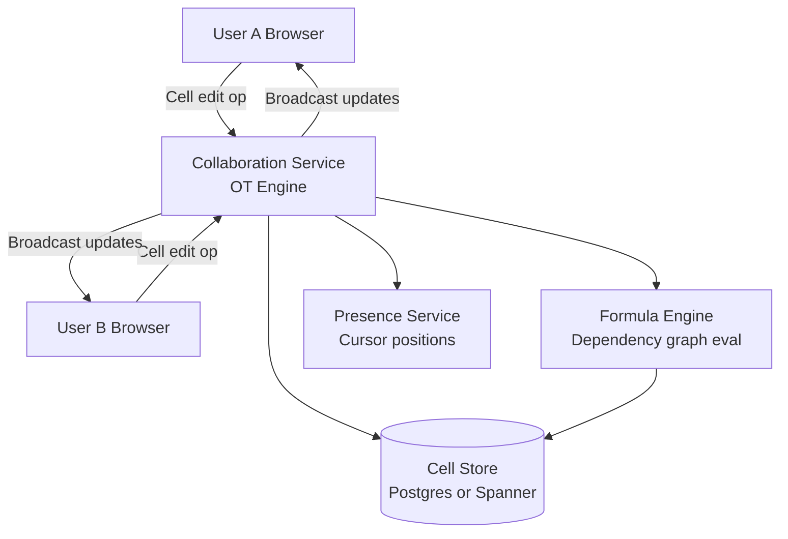

# Design a Collaborative Spreadsheet (Google Sheets)

**Difficulty**: 🔴 Advanced
**Reading Time**: Coming Soon
**Interview Frequency**: Medium

---

> 🚧 **Full article coming soon.** This stub gives you the essentials to start thinking about this problem.

---

## The Core Problem

Concurrent edits to spreadsheets present a harder problem than text documents — cells have dependencies via formulas (changing A1 may invalidate B5 which references A1 in a chain). Multiple users simultaneously editing cells that feed into each other through formulas can create dependency graph invalidation storms that cascade across the entire sheet.

## Functional Requirements

- Multiple users can edit cells simultaneously in real-time
- Formula evaluation updates dependent cells automatically
- Changes visible to all users within 500ms
- Support undo/redo per user (not reverting other users' changes)
- Collaboration cursors showing who is editing where

## Non-Functional Requirements

| Requirement | Target |
|-------------|--------|
| Collaboration latency | p99 < 500ms between editors |
| Formula evaluation | < 100ms for single-cell update cascade |
| Convergence | All clients reach identical state |
| Scale | 10M spreadsheets, 100 simultaneous editors per sheet |

## Back-of-Envelope Estimates

- **Operations per session**: 100 editors × 1 keystroke/sec = 100 ops/sec per spreadsheet
- **Formula dependency graph**: Spreadsheet with 10,000 cells × avg 3 dependents per cell = 30,000 edges in dependency graph
- **Storage per cell**: cell_id (8B) + formula/value (256B) + metadata (32B) = ~300 bytes × 1M cells = 300MB per large spreadsheet

## Key Design Decisions

1. **OT for Cell-Level Edits** — treat each cell as independent CRDT; concurrent edits to different cells don't conflict; edits to same cell use last-write-wins or merge strategy; operational transformation at cell granularity is simpler than document-level OT.
2. **Formula Dependency Graph Invalidation** — maintain a directed graph of cell dependencies; when cell A changes, traverse dependents in topological order (A → B → C) and re-evaluate; cache intermediate results; detect circular dependencies during formula entry.
3. **Cell-Level Locking for Atomic Transactions** — when a user starts editing a cell, soft-lock it (show other users it's being edited); release on commit or timeout; prevents confusing mid-edit states from being broadcast to other users.

## High-Level Architecture

## Top Interview Questions for This Problem

| Question | Tests |
|----------|-------|
| How do you detect and prevent circular formula references (A1=B1+1, B1=A1+1)? | Dependency graph, cycle detection |
| How do you handle two users simultaneously editing the same cell? | Cell-level OT, conflict resolution |
| How would you implement user-level undo that doesn't revert another user's edits? | Selective undo, operation history |

## Related Concepts

- [Google Docs real-time collaborative editing](../03-communication/google-docs)
- [Distributed locking for cell lock management](../05-infrastructure/distributed-locking)

---

*📚 Full deep-dive with multiple approaches, trade-off tables, and pseudocode coming soon.*
