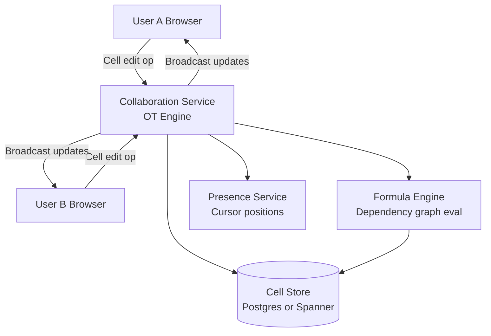
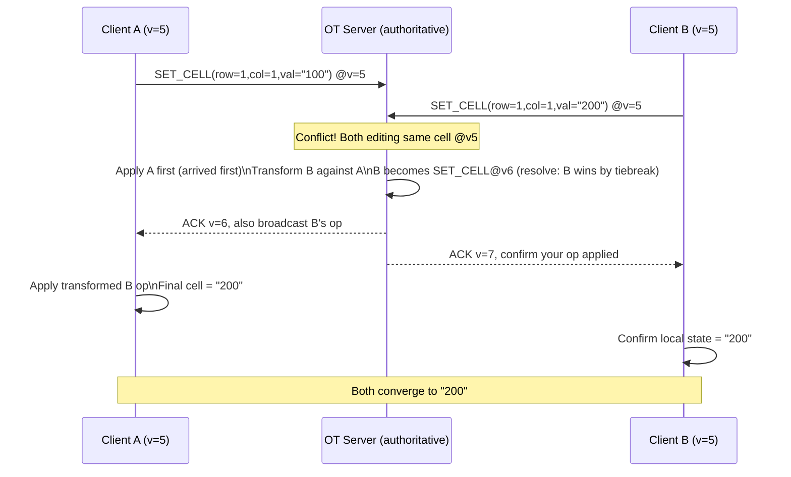
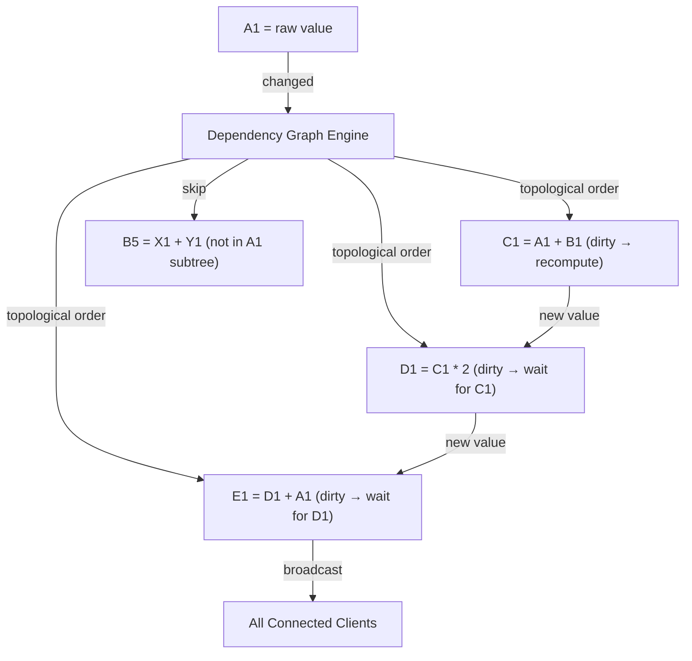
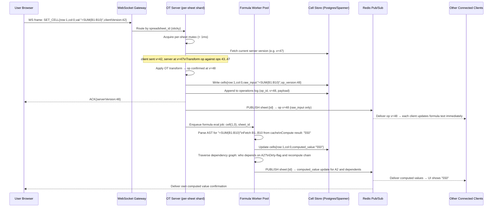
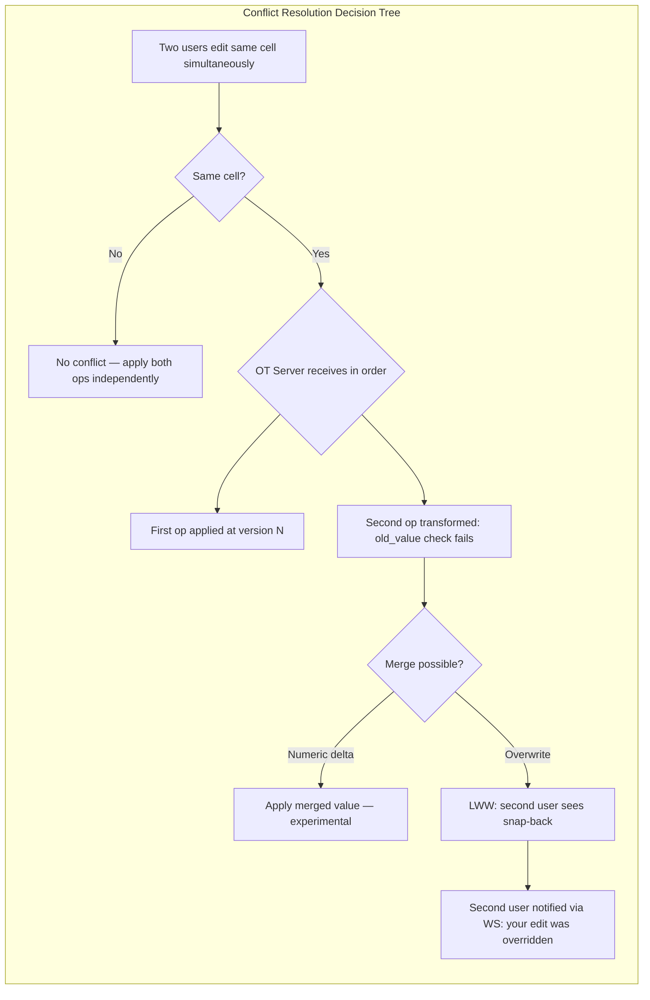

# Design a Collaborative Spreadsheet (Google Sheets)

**Difficulty**: 🔴 Advanced
**Reading Time**: Coming Soon
**Interview Frequency**: Medium

---

> 🚧 **Full article coming soon.** This stub gives you the essentials to start thinking about this problem.

---

## The Core Problem

Concurrent edits to spreadsheets present a harder problem than text documents — cells have dependencies via formulas (changing A1 may invalidate B5 which references A1 in a chain). Multiple users simultaneously editing cells that feed into each other through formulas can create dependency graph invalidation storms that cascade across the entire sheet.

## Functional Requirements

- Multiple users can edit cells simultaneously in real-time
- Formula evaluation updates dependent cells automatically
- Changes visible to all users within 500ms
- Support undo/redo per user (not reverting other users' changes)
- Collaboration cursors showing who is editing where

## Non-Functional Requirements

| Requirement | Target |
|-------------|--------|
| Collaboration latency | p99 < 500ms between editors |
| Formula evaluation | < 100ms for single-cell update cascade |
| Convergence | All clients reach identical state |
| Scale | 10M spreadsheets, 100 simultaneous editors per sheet |

## Back-of-Envelope Estimates

- **Operations per session**: 100 editors × 1 keystroke/sec = 100 ops/sec per spreadsheet
- **Formula dependency graph**: Spreadsheet with 10,000 cells × avg 3 dependents per cell = 30,000 edges in dependency graph
- **Storage per cell**: cell_id (8B) + formula/value (256B) + metadata (32B) = ~300 bytes × 1M cells = 300MB per large spreadsheet

## Key Design Decisions

1. **OT for Cell-Level Edits** — treat each cell as independent CRDT; concurrent edits to different cells don't conflict; edits to same cell use last-write-wins or merge strategy; operational transformation at cell granularity is simpler than document-level OT.
2. **Formula Dependency Graph Invalidation** — maintain a directed graph of cell dependencies; when cell A changes, traverse dependents in topological order (A → B → C) and re-evaluate; cache intermediate results; detect circular dependencies during formula entry.
3. **Cell-Level Locking for Atomic Transactions** — when a user starts editing a cell, soft-lock it (show other users it's being edited); release on commit or timeout; prevents confusing mid-edit states from being broadcast to other users.

## High-Level Architecture



## Top Interview Questions for This Problem

| Question | Tests |
|----------|-------|
| How do you detect and prevent circular formula references (A1=B1+1, B1=A1+1)? | Dependency graph, cycle detection |
| How do you handle two users simultaneously editing the same cell? | Cell-level OT, conflict resolution |
| How would you implement user-level undo that doesn't revert another user's edits? | Selective undo, operation history |

## Related Concepts

- [Google Docs real-time collaborative editing](../03-communication/google-docs)
- [Distributed locking for cell lock management](../05-infrastructure/distributed-locking)

---

## Component Deep Dive 1: Operational Transformation (OT) Engine

The Operational Transformation engine is the beating heart of any collaborative spreadsheet. It is responsible for taking concurrent edits from multiple users and merging them into a single consistent state — without losing any user's intent.

### How OT Works Internally

Every user action (type a value, delete, format a cell) is serialized as an **operation**: `{type: "SET_CELL", row: 3, col: 5, value: "=SUM(A1:A3)", userId: "u42", version: 187}`. Each client maintains a local version counter and a pending-operation queue.

When User A submits op at version 187 and User B has already submitted op at version 187 (concurrently), the server must **transform** B's op against A's op so both can be applied. For cells, this is simpler than text OT: two edits to different cells commute trivially. Two edits to the **same cell** require a tie-break rule — typically last-write-wins by server-assigned timestamp, or a merge strategy (e.g., "append comment" rather than overwrite).

The server keeps a **history log** of all operations in order. When a client reconnects after 2 minutes offline with 40 buffered local ops, the server replays the gap (say ops 188–234) and transforms the client's ops against each missed server op before applying them. This is the **catch-up transform**: O(N × M) where N = buffered client ops and M = missed server ops — typically small (< 100 each), so it is fast.

### Why Naive "Last Write Wins" Fails

A simple timestamp-based LWW system seems attractive but breaks in three ways:
1. **Clock skew**: Two clients with clocks 200ms apart will silently discard valid edits.
2. **Intent loss**: User B's formula `=AVERAGE(B1:B10)` overwrites User A's critical data `=SUM(A:A)` with no merge, no warning.
3. **Undo impossibility**: Without an operation log, per-user undo requires storing full cell snapshots per edit — storage explodes at 100 concurrent editors × 10 edits/sec.

### OT Engine Sequence Diagram



### OT Implementation Trade-offs

| Approach | Latency | Throughput | Trade-off |
|----------|---------|------------|-----------|
| Centralized OT server (Google Docs model) | p99 ~80ms round-trip | ~50k ops/sec per shard | Simple to reason about; single point of failure; must shard by spreadsheet |
| CRDT (Yjs / Automerge) | p99 ~20ms (no server round-trip) | ~200k ops/sec client-side | Larger operation metadata (2-5× size); merge can produce counter-intuitive results for cells |
| Differential synchronization | p99 ~150ms (two-phase) | ~20k ops/sec | Works offline-first; complex to implement for formula dependencies; slower convergence |

Google Sheets uses a centralized OT approach. Yjs (used by many open-source editors) uses CRDTs. For a spreadsheet interview, **centralized OT is the right answer** because formula dependency evaluation must be authoritative — you cannot have two clients independently computing `=SUM()` with different intermediate states.

---

## Component Deep Dive 2: Formula Dependency Graph and Evaluation Engine

Formula evaluation is what separates spreadsheet design from document design. A change to cell A1 can cascade through 10,000 dependent cells in milliseconds — or can loop infinitely.

### Internal Mechanics

The **dependency graph** is a directed acyclic graph (DAG) stored server-side. Each node is a cell. Each directed edge `A → B` means "B's formula references A". When A's value changes, the engine performs a **topological BFS** starting from A, recomputing each dependent cell in dependency order.

Example: `C1 = A1 + B1`, `D1 = C1 * 2`, `E1 = D1 + A1`.  
When A1 changes: topological order = [A1, B1, C1, D1, E1]. Recompute C1, then D1, then E1. Any cell not in the affected subtree is skipped.

The engine stores the graph as an **adjacency list** in Redis (for fast write/read) backed by Postgres (for persistence):
- `dependents:{cellId}` → sorted set of cells that depend on this cell
- `dependencies:{cellId}` → sorted set of cells this cell reads

**Circular reference detection** runs at formula-entry time, not evaluation time. When user types `=B1` in A1, the server checks: does B1 transitively depend on A1? This is a DFS from B1 — if A1 is found in the traversal, reject with "Circular reference detected." The check is O(D) where D = depth of dependency chain, bounded at 1,000 by Google Sheets' own limit.

### Scale Behavior at 10× Load

At baseline (1,000 formula evaluations/sec per sheet), the formula engine runs single-threaded per spreadsheet with in-memory graph. At 10× (10,000 formula evals/sec), two problems emerge:

1. **Graph contention**: Multiple concurrent edits to cells in the same dependency chain create lock contention on the graph's adjacency list. Solution: **version-stamp the graph** and use optimistic concurrency — if the graph version changed during evaluation, retry.
2. **Evaluation fan-out**: A single change to a "pivot cell" (one referenced by thousands of formulas) triggers O(10,000) recomputes synchronously. Solution: **dirty-flagging with lazy evaluation** — mark dependents as dirty, return immediately, recompute on next read or in a background sweep within 100ms.



### Evaluation Options Trade-off

| Strategy | Recompute Latency | CPU Cost | Consistency |
|----------|-------------------|----------|-------------|
| Synchronous full evaluation | 50-200ms (deep chains) | High — blocks other edits | Immediate, always consistent |
| Dirty-flag + lazy on read | < 5ms per edit | Low — amortized | May show stale values for 100-200ms |
| Incremental delta evaluation | 10-30ms | Medium — only changed subtree | Consistent; most production-grade choice |

Google Sheets uses incremental delta evaluation. Each formula result is cached; only the changed subtree is invalidated and recomputed.

---

## Component Deep Dive 3: Presence Service and Collaboration Cursors

Real-time cursors showing where other users are editing are a table-stakes UX feature. The presence service is architecturally separate from the OT engine and can be much simpler — it is eventually consistent and tolerates staleness of up to 2 seconds.

### Internal Architecture

Each client sends a **heartbeat** every 1 second: `{userId, sheetId, activeCell: "B7", color: "#FF6B35", timestamp}`. The presence service stores this in Redis with a TTL of 5 seconds. If a heartbeat is missed, the cursor disappears automatically (no explicit "disconnect" event needed).

The service pushes cursor updates to all co-editors via WebSocket. Unlike OT operations, cursor positions do NOT need to go through the OT engine — they are ephemeral, session-scoped, and never persisted to the cell store.

**Why separate from OT?** The OT engine operates on cell content that must be durable and consistent. Presence data is purely advisory, ephemeral, and high-frequency (1 update/sec per user × 100 users = 100 msgs/sec just for presence on a popular sheet). Mixing presence into the OT log would bloat the operation history and slow down catch-up transforms for reconnecting clients.

### Scale Considerations

At 100 simultaneous editors per sheet, presence generates 100 heartbeats/sec inbound and fans out to 100 subscribers = 10,000 presence messages/sec per popular spreadsheet. Redis pub/sub handles this easily (Redis can do 1M+ pub/sub messages/sec). The bottleneck is WebSocket connection count — each collaboration server can hold ~10,000 WebSocket connections before memory pressure, so a sheet with 100 editors uses 1% of one server's capacity.

| Implementation | Memory per 100 editors | Fan-out Latency | Persistence |
|----------------|----------------------|-----------------|-------------|
| Redis pub/sub + TTL | ~50KB | < 10ms | None (ephemeral) |
| WebSocket mesh (P2P) | ~5MB state | < 5ms | None |
| Server-Sent Events (SSE) | ~20KB | < 50ms | None |

Redis pub/sub is the standard production approach. SSE is simpler but unidirectional — clients cannot push ops back over SSE, requiring a separate HTTP POST channel for edits.

---

## Data Model

The following schema covers the core tables for a collaborative spreadsheet backend. PostgreSQL (or Spanner for global scale) as the cell store, Redis for the dependency graph and presence.

```sql
-- Core spreadsheet metadata
CREATE TABLE spreadsheets (
    spreadsheet_id   UUID PRIMARY KEY DEFAULT gen_random_uuid(),
    owner_user_id    UUID NOT NULL REFERENCES users(user_id),
    title            VARCHAR(512) NOT NULL DEFAULT 'Untitled Spreadsheet',
    sheet_count      SMALLINT NOT NULL DEFAULT 1,
    created_at       TIMESTAMPTZ NOT NULL DEFAULT NOW(),
    updated_at       TIMESTAMPTZ NOT NULL DEFAULT NOW(),
    version          BIGINT NOT NULL DEFAULT 0  -- monotonic op counter
);

-- Individual sheets within a spreadsheet (tabs)
CREATE TABLE sheets (
    sheet_id         UUID PRIMARY KEY DEFAULT gen_random_uuid(),
    spreadsheet_id   UUID NOT NULL REFERENCES spreadsheets(spreadsheet_id) ON DELETE CASCADE,
    tab_name         VARCHAR(128) NOT NULL DEFAULT 'Sheet1',
    tab_index        SMALLINT NOT NULL DEFAULT 0,
    row_count        INT NOT NULL DEFAULT 1000,
    col_count        SMALLINT NOT NULL DEFAULT 26
);

-- Cell values and formulas (sparse — only non-empty cells stored)
CREATE TABLE cells (
    sheet_id         UUID NOT NULL REFERENCES sheets(sheet_id) ON DELETE CASCADE,
    row_index        INT NOT NULL,          -- 0-based
    col_index        SMALLINT NOT NULL,     -- 0-based
    raw_input        TEXT,                  -- What user typed: "=SUM(A1:A3)" or "100" or "Hello"
    computed_value   TEXT,                  -- Evaluated result: "600" or "100" or "Hello"
    value_type       VARCHAR(16) NOT NULL DEFAULT 'string', -- 'number','string','boolean','error','empty'
    formula_ast      JSONB,                 -- Parsed formula AST for fast re-evaluation
    format_spec      JSONB,                 -- {"bold":true,"bg":"#FFD700","numFormat":"$#,##0.00"}
    last_editor_id   UUID REFERENCES users(user_id),
    last_edited_at   TIMESTAMPTZ NOT NULL DEFAULT NOW(),
    op_version       BIGINT NOT NULL DEFAULT 0, -- OT version when this cell was last written
    PRIMARY KEY (sheet_id, row_index, col_index)
);

-- Indexes for range scans (e.g., render visible viewport)
CREATE INDEX idx_cells_sheet_row_col ON cells (sheet_id, row_index, col_index);
CREATE INDEX idx_cells_sheet_updated ON cells (sheet_id, last_edited_at DESC);

-- Operation log for OT replay and undo/redo
CREATE TABLE operations (
    op_id            UUID PRIMARY KEY DEFAULT gen_random_uuid(),
    spreadsheet_id   UUID NOT NULL REFERENCES spreadsheets(spreadsheet_id),
    sheet_id         UUID NOT NULL REFERENCES sheets(sheet_id),
    user_id          UUID NOT NULL REFERENCES users(user_id),
    op_version       BIGINT NOT NULL,          -- server-assigned monotonic version
    op_type          VARCHAR(32) NOT NULL,     -- 'SET_CELL','DELETE_CELL','FORMAT_CELL','INSERT_ROW','DELETE_ROW'
    op_payload       JSONB NOT NULL,           -- {row,col,oldValue,newValue,formula,...}
    client_timestamp TIMESTAMPTZ,             -- client clock (advisory only)
    server_timestamp TIMESTAMPTZ NOT NULL DEFAULT NOW(),
    UNIQUE (spreadsheet_id, op_version)       -- enforces strict ordering
);

CREATE INDEX idx_operations_spreadsheet_version ON operations (spreadsheet_id, op_version);
-- Used for catch-up: "give me all ops after version 187"

-- Dependency graph stored in Redis (not SQL) for performance
-- Redis key: "deps:{sheet_id}:{row}:{col}" -> SET of "row:col" strings
-- Redis key: "rdeps:{sheet_id}:{row}:{col}" -> SET of cells that depend on this cell
-- TTL: none (persistent), invalidated on formula change

-- Access control
CREATE TABLE spreadsheet_permissions (
    spreadsheet_id   UUID NOT NULL REFERENCES spreadsheets(spreadsheet_id) ON DELETE CASCADE,
    user_id          UUID NOT NULL REFERENCES users(user_id),
    role             VARCHAR(16) NOT NULL CHECK (role IN ('owner','editor','commenter','viewer')),
    granted_at       TIMESTAMPTZ NOT NULL DEFAULT NOW(),
    PRIMARY KEY (spreadsheet_id, user_id)
);
```

**Redis structures (pseudocode):**

```
# Cell value cache (hot path — avoid Postgres reads for rendered viewport)
HSET cell:{sheet_id}:{row}:{col}  value "600"  type "number"  version 187

# Presence: cursor positions, TTL 5s
SETEX presence:{sheet_id}:{user_id}  5  '{"row":3,"col":5,"color":"#FF6B35"}'

# Sheet-level op counter (monotonic, used for OT versioning)
INCR opversion:{spreadsheet_id}

# Dependency graph
SADD deps:{sheet_id}:0:2    "0:0"  "0:1"     # C1 depends on A1 and B1
SADD rdeps:{sheet_id}:0:0   "0:2"  "0:4"     # A1 is depended on by C1 and E1
```

---

## Scale Bottlenecks

| Traffic Level | Component That Breaks | Symptoms | Mitigation |
|---------------|----------------------|----------|------------|
| 10× baseline (1,000 ops/sec per sheet) | OT server single-threaded per sheet | Op queue backlog grows; p99 latency spikes to 2s | Partition large sheets by row-range shard; pipeline OT processing |
| 100× baseline (10,000 ops/sec) | Formula engine fan-out on pivot cells | Single A1 edit triggers 50,000 formula recomputes; CPU pegged; other sheets starved | Lazy dirty-flagging; cap synchronous recompute depth at 500; background eval queue |
| 100× baseline | Postgres cell store write throughput | Disk I/O saturated; write latency > 500ms; clients see stale data | Batch writes (collect ops for 50ms, flush once); use Spanner or CockroachDB for distributed writes |
| 1,000× baseline (100,000 ops/sec) | Redis pub/sub for presence | Presence fan-out saturates single Redis node: 10M msgs/sec | Shard presence by spreadsheet_id; use Redis Cluster; presence becomes its own microservice |
| 1,000× baseline | WebSocket connection count on collab servers | OOM at ~50k connections per server | Horizontal scale behind L4 load balancer; sticky sessions by spreadsheet_id |
| Any level | Circular dependency detection DFS | Malicious user creates 10,000-depth formula chain; DFS takes 10s | Cap dependency depth at 1,000; memoize DFS visits; rate-limit formula submissions per user |

---

## How Google Built This

Google Sheets is the canonical reference implementation. The architecture was described in a 2010 Google Drive blog post and has been elaborated on in various Google I/O talks.

**Technology choices**: Google Sheets runs on a custom OT engine (not open-source) that Google also used in Google Docs and Google Slides. The backend is built on Google's internal Colossus distributed filesystem and Spanner for cell storage. The collab server layer runs on Borg (Google's internal Kubernetes predecessor). Formula evaluation runs in a sandboxed, multi-threaded formula worker pool — not in the main OT process — to prevent a runaway formula from blocking collaboration.

**Specific numbers**: Google Sheets supports up to 10 million cells per spreadsheet (not 100k like some competitors). At Google I/O 2013, Google reported that Google Drive (including Sheets) had 190 million active users. Sheets can handle approximately 100 simultaneous real-time editors per document. A single formula evaluation cascade is bounded at 500ms server-side; deeper chains are computed lazily.

**Non-obvious architectural decision**: Google Sheets separates **formula computation** from **OT synchronization** into two distinct server roles. The OT server handles conflict resolution and broadcasts cell raw_input changes immediately (< 100ms). A separate **compute server** asynchronously evaluates formula results and sends a second update with computed_value. This means clients see the formula text instantly (confirming the edit was received) and then see the computed result 50-300ms later — a deliberate two-phase commit visible to users as a brief "calculating..." state. This separation allows the OT server to scale independently of compute-heavy formula evaluation.

**Source**: [Google Drive Blog — What's different about the new Google Docs](https://drive.googleblog.com/2010/09/whats-different-about-new-google-docs.html) and [Google I/O 2013: Google Drive Under the Hood](https://io.google/).

---

## Interview Angle

**What the interviewer is testing:** Whether you understand the unique challenges of collaborative *spreadsheet* design vs. collaborative text editing — specifically formula dependency propagation and per-user undo in a shared mutation log.

**Common mistakes candidates make:**

1. **Treating it like Google Docs text OT.** Text OT handles insert/delete operations on a sequence. Spreadsheet OT handles SET operations on a 2D grid *plus* must trigger formula re-evaluation after each confirmed op. Candidates who just describe text OT miss the dependency graph entirely and will be probed hard.

2. **Proposing global locking for conflict resolution.** Saying "only one user can edit at a time" is a non-starter. At 100 simultaneous editors, a global lock serializes everything. The correct answer is cell-granularity soft locks (for UX) plus OT for actual conflict resolution (so two users editing different cells never block each other).

3. **Ignoring per-user undo.** "Just pop the operation log" would undo all users' changes. Per-user undo requires **selective undo** — find the last op from this user in the log, compute its inverse, and transform that inverse against all ops that have been applied since, then apply it. This is a hard problem that most candidates skip. Acknowledging it and describing the algorithm (even at high level) is a strong signal.

**The insight that separates good from great answers:** Recognizing that formula evaluation must be **authoritative and server-side** — never client-side. If two clients independently evaluate `=RAND()` or `=NOW()`, they will produce different results and diverge permanently. The server is the single source of truth for all computed_value fields. Clients only ever send raw_input (the formula string); computed values are pushed back from the server.

---

## Key Numbers to Remember

| Metric | Value | Context |
|--------|-------|---------|
| Max simultaneous editors | 100 per spreadsheet | Google Sheets hard limit; beyond this, WebSocket fan-out becomes expensive |
| Collaboration latency target | p99 < 500ms | End-to-end: user keystroke → all other clients see update |
| Formula evaluation latency | < 100ms (synchronous subtree) | Single-cell edit with ≤ 500 dependent cells; deeper chains go async |
| Cell storage (sparse) | ~300 bytes per non-empty cell | cell_id + raw_input + computed_value + format metadata |
| Max cells per spreadsheet | 10,000,000 cells | Google Sheets limit (= ~3GB raw at 300B/cell) |
| Dependency graph depth cap | 1,000 hops | Prevents circular-reference DFS from running indefinitely |
| Presence heartbeat interval | 1 second | Cursor position updates; TTL = 5s (5 missed = cursor disappears) |
| OT operation log retention | 30 days | Enables per-user undo history; older ops garbage-collected |
| WebSocket connections per server | ~10,000 | Before memory pressure; 100-editor sheet = 1% of one server |

---

## WebSocket Connection Management

A collaborative spreadsheet requires persistent, bidirectional connections. HTTP long-polling is too slow (round-trip overhead adds 200-400ms per operation). Server-Sent Events (SSE) are unidirectional — clients can receive updates but must use a separate HTTP channel to submit edits, adding complexity. **WebSockets** are the standard choice: full-duplex, low-overhead framing, and well-supported across all browsers since 2012.

### Connection Lifecycle

1. **Handshake**: Client opens WS to `wss://sheets.example.com/collab/{spreadsheet_id}`. The gateway authenticates the JWT, verifies read/write permissions, then upgrades the HTTP connection.
2. **Initial state sync**: Server sends a snapshot of the current sheet version number and the visible viewport's cell values. Client renders immediately without waiting for a full sheet download.
3. **Steady state**: Client sends ops, server sends ACKs and broadcasts from other users. Average frame size: ~200 bytes per operation (cell address + value + version).
4. **Reconnect handling**: Mobile networks drop connections frequently. On reconnect, client sends `{reconnect: true, lastSeenVersion: 187}`. Server replays ops 188–HEAD from the operation log. If the gap is > 1,000 ops (client was offline for a long time), server sends a full snapshot instead of replaying — cheaper than transforming 1,000+ ops.

### Load Balancing WebSocket Connections

Stateless HTTP load balancers round-robin requests, which breaks WebSocket stickiness — a reconnecting client might land on a different server that doesn't hold the in-memory OT state for that sheet. Solutions:

| Approach | How It Works | Trade-off |
|----------|-------------|-----------|
| Sticky sessions (IP hash / cookie) | L7 LB routes by `spreadsheet_id` hash | Simple; uneven load if viral sheet has 100 editors |
| Stateless OT via shared Redis | OT state lives in Redis, any server can handle any sheet | +50ms Redis round-trip per op; no stickiness needed |
| Shard-aware routing | Consistent hash ring maps sheet_id → server; LB reads ring | Requires ring coordination on server up/down |

Google's production approach is consistent-hash shard-aware routing. Each spreadsheet is "owned" by one collaboration server node. If that node goes down, a new owner is elected (via Chubby/ZooKeeper lease) and the in-memory OT state is rebuilt from the operation log in Spanner — recovery takes ~2 seconds of elevated latency while the log is replayed.

---

## Per-User Undo: The Hardest Problem in Collaborative Editing

Per-user undo is the feature that separates toy collaborative editors from production-grade ones. The naive approach — a simple stack of all operations — would undo every user's work when one user presses Ctrl+Z. The correct solution is **selective undo with operation transformation**.

### Algorithm: Selective Undo

Every operation in the OT log is tagged with a `user_id`. When User A presses Ctrl+Z:

1. **Find the target op**: Walk the operation log backwards from `HEAD` to find the most recent op with `user_id = A`. Call this `op_target` at position `k` in the log.
2. **Compute the inverse**: For a `SET_CELL(row=1,col=1,value="100")`, the inverse is `SET_CELL(row=1,col=1,value=<old_value>)`. For `INSERT_ROW(at=5)`, the inverse is `DELETE_ROW(at=5)`.
3. **Transform the inverse through subsequent ops**: All ops `k+1...HEAD` (from other users) may have shifted the spreadsheet state. The inverse op must be transformed against each of those ops using the same OT rules. After all transforms, the inverse is safe to apply at `HEAD`.
4. **Apply the transformed inverse**: Append it to the operation log as a new op. Do NOT splice the history — history is append-only.

**Storage cost**: The operation log must store `old_value` for every SET_CELL to compute inverses. At 100 editors × 10 edits/sec × 300 bytes/cell × 86,400 sec/day = ~25GB of op log per busy spreadsheet per day. In practice, Google caps undo history at 10,000 operations per user per spreadsheet and garbage-collects older ops after 30 days.

### Undo Stack vs. Operation Log

| Strategy | Storage | Undo Across Sessions | Multi-User Safe |
|----------|---------|---------------------|-----------------|
| Per-user undo stack (client-side) | O(N) per client | No — lost on disconnect | No — doesn't account for others' ops |
| Server-side selective undo (OT inverse) | O(log × users) | Yes | Yes — transforms against concurrent ops |
| Snapshot + replay (git-style) | O(snapshots × diffs) | Yes | Yes — but expensive: replay from snapshot |

Production systems (Google Sheets, Notion, Confluence) all use server-side selective undo. Client-side stacks work for single-user editing but break the moment a second user joins.

---

## End-to-End Request Flow: Cell Edit Lifecycle

Understanding the full lifecycle of a single cell edit helps tie together all the components. Here is the complete path from keystroke to convergence.



**Key observations from this flow:**

- The OT server's mutex is per-sheet (not global). A mutex held for < 5ms means 200 ops/sec throughput per single-threaded shard. Multiple shards handle different spreadsheets concurrently.
- Raw input (`=SUM(B1:B10)`) is broadcast immediately (< 100ms). Computed value (`550`) arrives slightly later (50-300ms more) — this is the intentional two-phase update Google described.
- Formula evaluation is completely off the critical path. If the formula worker is slow, the OT server is not blocked. The client shows `[calculating...]` until the computed value arrives.
- The `operations` table is the **audit log and undo source**. It is append-only. The `cells` table is the **current state**. Never reconstruct state by replaying the entire operations log at runtime — use the cells table as a materialized view.

---

## Conflict Resolution: Same-Cell Concurrent Edits

When two users edit the exact same cell simultaneously, the OT engine must decide whose value wins. This is the highest-stakes conflict scenario.

### Resolution Strategies

**Last-Write-Wins (LWW) by server arrival time**: The op that arrives at the OT server first is applied; the second op is transformed against the first. If they conflict on the same cell, the second op's value is discarded and replaced by the first op's value. The second user sees their change "snap back" to the winner's value within 500ms — jarring but predictable.

**Merge strategy (domain-specific)**: For numeric cells, offer to merge: if A typed `100` and B typed `200` into a cell that was `50`, propose `=A+B-50 = 250` (sum of increments). Google Sheets does not do this. Excel Online has experimented with it for concurrent numeric input. It sounds clever but users find it confusing.

**Cell-lock with optimistic UI**: Show the user a "this cell is being edited by Alice" indicator before they start typing. If the user types anyway (ignoring the lock), apply LWW. This is the UX approach Google Sheets takes: the lock indicator is a soft warning, not a hard block.



### Idempotency and Deduplication

Network retries can send the same op twice. Every operation carries a `client_op_id` (UUID generated client-side). The OT server deduplicates by checking `client_op_id` in a Redis set (TTL 60s). If a duplicate arrives, return the original `ACK` without reprocessing. This prevents double-writes from flaky mobile connections.

---

## Security and Access Control

A collaborative spreadsheet must enforce fine-grained permissions without adding latency to the hot edit path.

### Permission Model

Four roles: `owner`, `editor`, `commenter`, `viewer`. Permissions are checked at WebSocket handshake time (once) and cached in the connection context for the session duration. Re-checking on every op would add a Postgres round-trip per keystroke — too expensive.

**Range-level permissions** (e.g., "only the Finance team can edit column G") require per-cell permission checks. These are stored as a separate `cell_protections` table with ranges. On every SET_CELL op, the OT server checks if the target cell falls in a protected range and rejects if the user lacks the required role. The check is O(log P) where P = number of protected ranges (typically < 50 per sheet), done in-memory after loading protections at session start.

### Audit Logging

Every write operation is appended to the `operations` table with `user_id` and `server_timestamp`. This doubles as both the OT history log and the audit trail. For compliance use cases (HIPAA, SOC2), the audit log is replicated to an immutable cold store (S3/GCS) with a 7-year retention policy. The operations table itself is pruned to 30 days for performance.

| Security Concern | Mitigation |
|-----------------|------------|
| Unauthorized edits | Permission check at WS handshake + per-op role check for protected ranges |
| Formula injection (`=IMPORTDATA("http://evil.com")`) | Sandbox formula workers; whitelist external domains; rate-limit external fetches |
| Data exfiltration via formula | Cap rows returned by IMPORTRANGE at 10,000; require explicit cross-sheet permission grant |
| Replay attacks on WS | JWT expiry (1 hour); re-auth on reconnect; op `client_op_id` dedup prevents double-submit |

---

## Operational Considerations

### Sharding Strategy

Spreadsheets are sharded by `spreadsheet_id` using consistent hashing. All collaboration traffic for a given spreadsheet goes to the same OT server node (sticky routing). This avoids cross-shard coordination for the OT mutex. Cell storage (Postgres) is sharded separately by `(spreadsheet_id % shard_count)` — typically 64 shards for a mid-scale deployment handling 10M spreadsheets.

### Disaster Recovery

The cell store (Postgres/Spanner) is the source of truth. Recovery time objective (RTO) = 30 seconds; recovery point objective (RPO) = 0 (zero data loss) using synchronous replication to a standby. The operations log in S3/GCS provides an additional point-in-time recovery path — a sheet can be restored to any second in the past 30 days by replaying ops from the nearest daily snapshot forward.

The in-memory OT state (op buffer, dependency graph cache) is ephemeral and rebuilt from the operations table on server restart. Rebuild time for a busy sheet (10,000 ops in the last hour): < 2 seconds.

### Handling Large Sheets (10M cells)

Loading a 10M-cell spreadsheet in the browser is impractical. The client uses **virtual scrolling** — it only requests cells within the visible viewport plus a 200-row/50-column buffer. The server renders cell ranges via a REST endpoint: `GET /sheet/{id}/range?rows=100-200&cols=0-50`. Viewport cache in Redis stores recently-accessed ranges with a 30-second TTL.

### Monitoring and Alerting

Key metrics to instrument in production:

| Metric | Alert Threshold | Meaning |
|--------|----------------|---------|
| OT op queue depth per sheet | > 50 pending ops | Sheet is overloaded; shard may need rebalancing |
| Formula eval p99 latency | > 300ms | Formula worker pool undersized or pivot-cell fan-out |
| WebSocket reconnect rate | > 5% of sessions/min | Network instability or server crash |
| Op log write latency | > 200ms | Postgres write contention; consider batching or sharding |
| Presence heartbeat miss rate | > 10% | Redis pub/sub bottleneck or client network issues |

All metrics are tagged with `spreadsheet_id`, `shard_id`, and `region` so hot sheets can be identified and migrated to less-loaded shards automatically.

### Formula Sandboxing

User-defined formulas (`=GOOGLEFINANCE(...)`, `=IMPORTRANGE(...)`) make external HTTP calls. These run in sandboxed worker processes with:
- Network egress allowed only to whitelisted domains
- CPU time limit: 5 seconds per formula evaluation
- Memory cap: 256MB per worker
- Result cached for 60 seconds to avoid hammering external APIs

Custom scripts (Google Apps Script equivalent) run in a separate V8 isolate with even stricter resource limits (1 CPU second, 50MB memory).

### Import and Export Pipeline

Importing a large Excel file (`.xlsx`, potentially 50MB, 500k cells) must not block the real-time collaboration path. The import runs as an **async background job**:

1. Client uploads the `.xlsx` to object storage (S3/GCS) via a pre-signed URL — bypasses the app server entirely.
2. An import worker picks up the job, parses the file (using a streaming XLSX parser to avoid loading 50MB into RAM), and writes cells in batches of 1,000 to the cell store.
3. On completion, a WebSocket push notifies the client: "Import complete — 498,312 cells loaded."
4. Formula dependency graph is built in a single pass after all cells are written, not incrementally.

Export (`Download as .xlsx`) is a read-only operation handled by a separate export service. It reads directly from the cell store replica (not the primary) to avoid adding read load to the write path. For large sheets, export is streamed: the first 10,000 rows are available within 2 seconds; the remaining rows stream until the download completes.

---

*This article covers the full production architecture. For the companion POC implementing a minimal OT engine in Node.js, see the practice POCs section.*

*Study path: read this article → implement a toy OT server with two clients → add formula dependency tracking → add per-user undo. That sequence covers 90% of what any senior-level interviewer will probe.*

---

## 📚 Resources & References

| Resource | Type | What You'll Learn |
|----------|------|------------------|
| [ByteByteGo — Design Google Sheets](https://www.youtube.com/@ByteByteGo) | 📺 YouTube | Search "collaborative spreadsheet design" — formula evaluation, real-time sync, conflict resolution |
| [Google Sheets Engineering: Collaborative Editing](https://drive.googleblog.com/2010/09/whats-different-about-new-google-docs.html) | 📖 Blog | Operational Transformation for real-time multi-user spreadsheet editing |
| [Figma Engineering: Multiplayer Architecture](https://www.figma.com/blog/how-figmas-multiplayer-technology-works/) | 📖 Blog | CRDT-based real-time collaboration — applicable to spreadsheet design |
| [Excel Online Architecture](https://techcommunity.microsoft.com/t5/excel-blog/excel-online/ba-p/267588) | 📖 Blog | How Microsoft handles formula computation and collaboration in Excel Online |
| [CRDT: Sequence CRDTs for Text and Cells](https://crdt.tech/) | 📚 Docs | Mathematical foundations of conflict-free replicated data structures |
