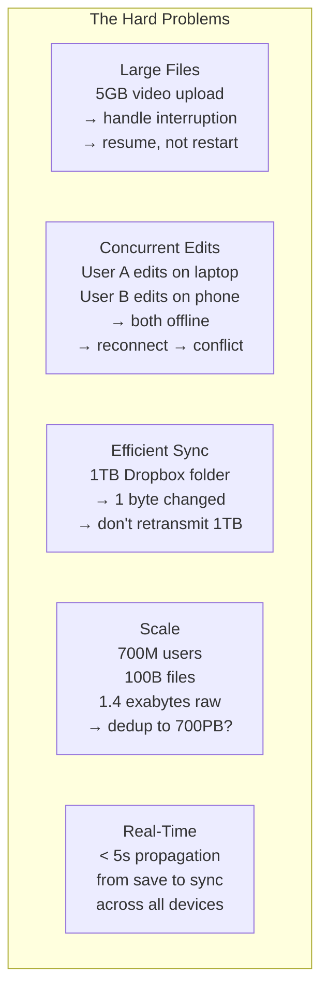
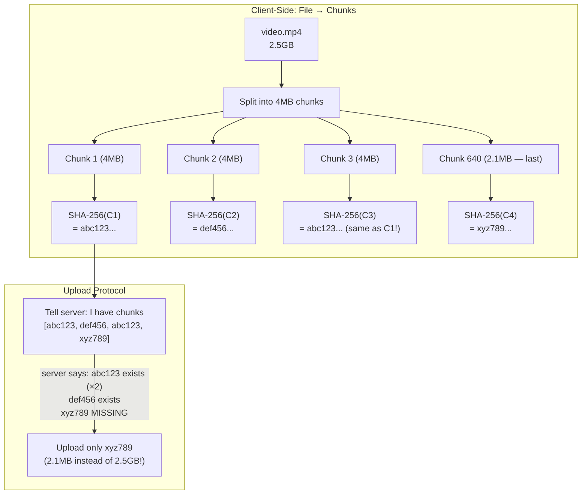
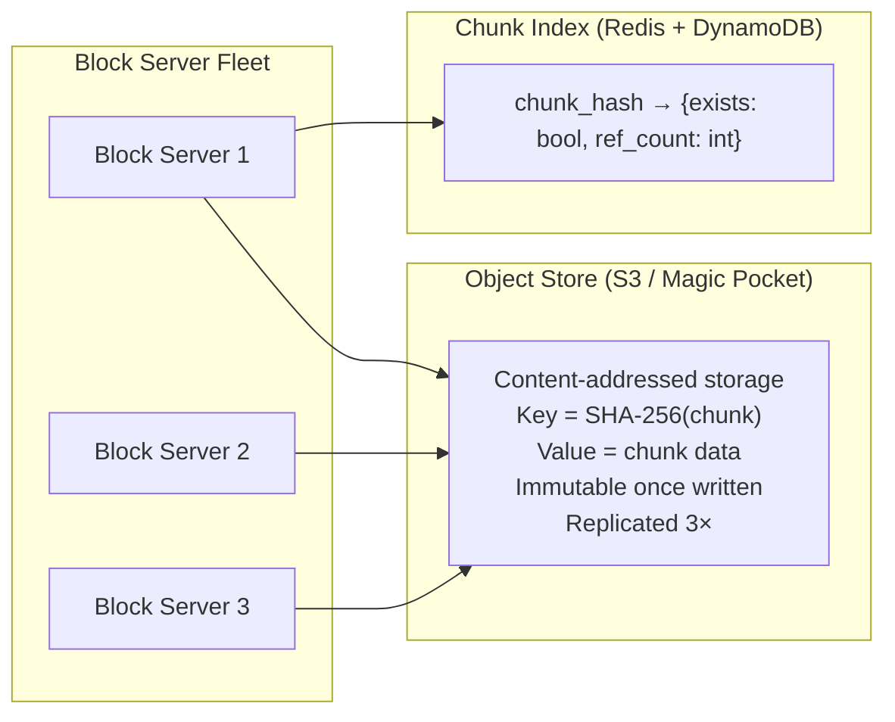
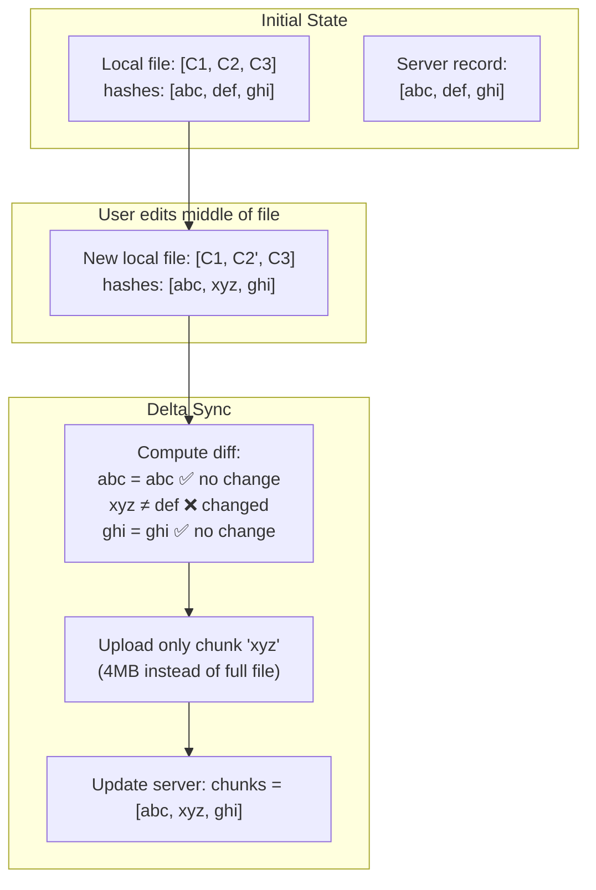
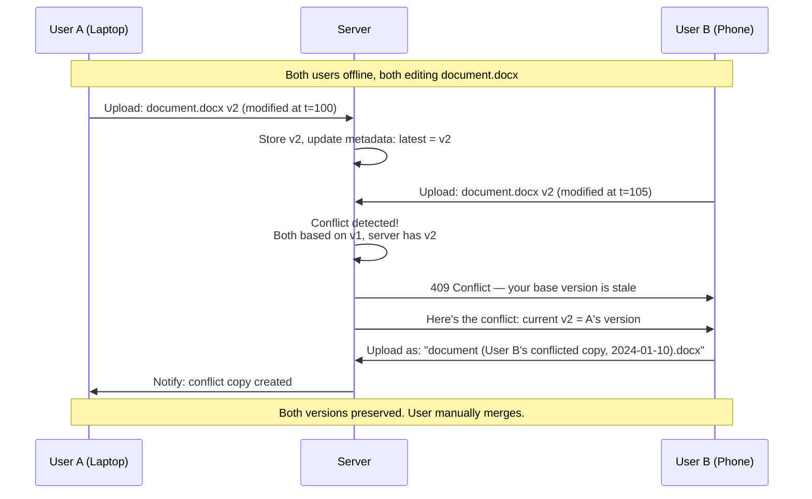
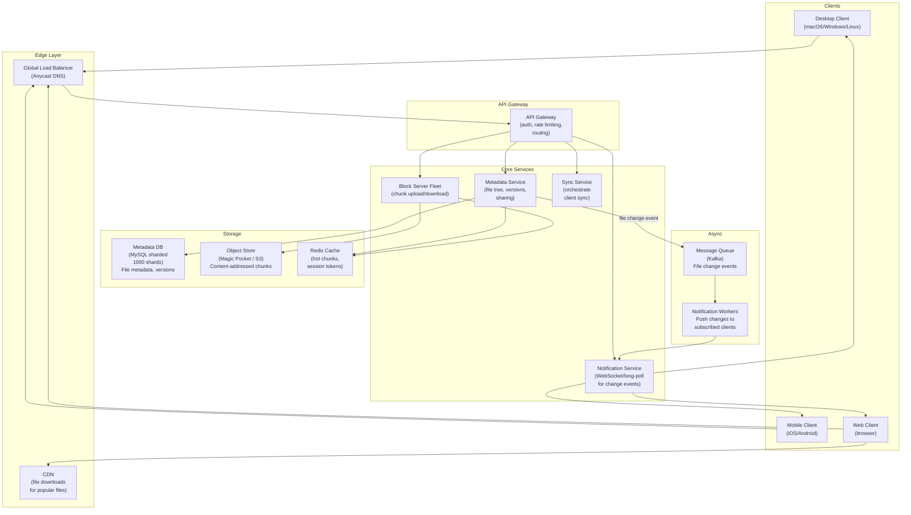

# Design Dropbox — Distributed File Sync at 700M Users

**Difficulty**: 🔴 Advanced → ⚫ Senior
**Reading Time**: 45 minutes
**Interview Frequency**: Very High — top-5 system design interview problem; asked at Dropbox, Google (Drive), Microsoft (OneDrive), Box

> **Core Challenge**: Store and sync 100 billion files for 700 million users across desktop, mobile, and web — keeping every device in sync within 5 seconds, handling concurrent edits without data loss, and storing petabytes efficiently with aggressive deduplication.

---

## Table of Contents

1. [The Mental Model](#1-the-mental-model)
2. [Requirements](#2-requirements)
3. [Capacity Estimation](#3-capacity-estimation)
4. [Deep Dive 1 — Chunked Upload with Deduplication](#4-deep-dive-1--chunked-upload-with-deduplication)
5. [Deep Dive 2 — Sync Engine (Delta Sync and Conflict Resolution)](#5-deep-dive-2--sync-engine)
6. [Deep Dive 3 — Metadata Service](#6-deep-dive-3--metadata-service)
7. [Full System Architecture](#7-full-system-architecture)
8. [Notification System — How Clients Learn About Changes](#8-notification-system)
9. [Problems at Scale](#9-problems-at-scale)
10. [Interview Questions Mapped](#10-interview-questions-mapped)
11. [Key Takeaways](#11-key-takeaways)
12. [Related Concepts](#12-related-concepts)

---

## 1. The Mental Model

### What Makes File Sync Hard?

Syncing files sounds simple: upload a file, download it everywhere. The hard problems emerge at scale:



### The Core Insight: Content Addressing

The breakthrough that makes Dropbox efficient is **content addressing**:

> Instead of naming files by path, name them by their content hash (SHA-256). Two files with identical content share exactly one copy in storage — regardless of who uploaded them, when, or where.

```
Traditional storage:
  user_a/photo.jpg → store file → 10MB
  user_b/photo.jpg → store file → 10MB (duplicate!)
  Total stored: 20MB

Content-addressed storage:
  user_a/photo.jpg → hash = abc123 → store block "abc123" → 10MB
  user_b/photo.jpg → hash = abc123 → pointer to "abc123" (already exists)
  Total stored: 10MB (50% savings, 2 pointers)
```

At Dropbox's scale, deduplication eliminates **~40-60%** of stored data. With 1.4 exabytes of logical data, this saves **560PB–840PB** of storage costs.

---

## 2. Requirements

### Functional Requirements

| Feature | Spec |
|---------|------|
| File operations | Upload, download, delete, rename, move files and folders |
| Sync | Changes propagate to all devices within 5 seconds |
| File size | Support up to 50GB per file |
| Sharing | Share files/folders with other users (read/write permissions) |
| Versioning | Retain previous versions for 30 days (free tier) / 180 days (paid) |
| Conflict handling | Detect concurrent edits; create conflict copy rather than silently overwrite |
| Offline support | Queue changes locally; sync when reconnected |

### Non-Functional Requirements

| Requirement | Target | Rationale |
|-------------|--------|-----------|
| Availability | 99.99% | Storage is core business — can't be down |
| Durability | 99.999999999% (11 nines) | Files must never be lost |
| Sync latency | < 5 seconds P99 for files < 1MB | User expectation: near-realtime |
| Upload throughput | 1GB/min per user (max) | Limited by client's network, not server |
| Deduplication | ≥ 40% reduction in stored bytes | Storage cost control |
| Search | Not in scope (separate service) | Out of scope for this design |

### Non-Requirements

- Real-time collaborative editing (Google Docs model — out of scope)
- Full-text search within files
- Video transcoding

---

## 3. Capacity Estimation

### Users and Files

```
700M registered users
~200M daily active users (DAU)

Average files per user: 500 files (mixed docs, photos, code)
Total files: 700M × 500 = 350 billion files

Average file size: 500KB (mix of small docs and large media)
Total logical data: 350B × 500KB = 175 exabytes

With deduplication (40% reduction):
→ 175 × 0.6 = 105 exabytes stored

Dropbox's actual stored data (as of 2023): ~500PB (Exabyte-class but not public)
→ Our estimate is in the right ballpark
```

### Traffic

```
200M DAU × 10 file operations/day = 2B operations/day
→ 2B / 86,400 = 23,150 ops/sec average
→ Peak (3× average): ~70,000 ops/sec

Upload traffic:
200M users × 50MB uploaded/day = 10PB/day
→ 10PB / 86,400 = 116 GB/sec average upload throughput

Download traffic (3× uploads):
→ 350 GB/sec average download throughput
```

### Block Storage

```
Average file size: 500KB
Chunk size: 4MB
Chunks per file: 500KB / 4MB → most files are 1 chunk

For large files (1% of files are > 10MB):
10MB file / 4MB chunks = 3 chunks
50GB file / 4MB chunks = 12,800 chunks

Total chunks stored:
350B files × 1.2 avg chunks/file = 420B chunks
420B chunks × 4MB/chunk (avg) = 1.68 exabytes of chunk data
After dedup (40%): ~1 exabyte
```

### Metadata Storage

```
Per-file metadata:
  file_id (8B) + user_id (8B) + parent_folder_id (8B) + name (256B) +
  size (8B) + chunk_hashes (varies) + created_at (8B) + modified_at (8B)
= ~350 bytes per file

350B files × 350 bytes = ~120TB of metadata
→ Fits in a distributed SQL cluster (e.g., 100 shards × 1.2TB each)
```

---

## 4. Deep Dive 1 — Chunked Upload with Deduplication

### Why Chunking?

Uploading a 5GB file as one HTTP request has catastrophic failure characteristics:
- If the upload fails at byte 4.9GB (98% complete), the entire file must be retransmitted
- A single TCP connection held for the entire 5GB duration is unreliable on mobile
- The server cannot start processing (e.g., scanning for duplicates) until fully received

**Chunking** breaks files into 4MB blocks. Each block is uploaded independently and can be retried individually.

### Content-Addressed Chunking Algorithm



### The Upload Protocol (Check-Before-Upload)

```
Client → Server: CommitUpload({
  filename: "video.mp4",
  size: 2684354560,
  chunks: ["abc123", "def456", "abc123", "xyz789"]   # hashes only
})

Server → Client: {
  existing: ["abc123", "def456"],   # server already has these
  missing:  ["xyz789"]              # client must upload these
}

Client → Server: UploadChunk("xyz789", <2.1MB data>)

Server → Client: UploadComplete({
  file_id: "f_8a7b3c",
  url: "https://dropbox.com/s/f_8a7b3c"
})
```

**Savings from dedup**: In this example, only 2.1MB of 2.5GB was actually uploaded (0.08% of file size) because the rest already existed.

### Variable-Size Chunking (Content-Defined Chunking)

The problem with fixed 4MB chunks: inserting 1 byte at the start of a file shifts all chunk boundaries by 1 byte, making every chunk "new" (different hash). This defeats deduplication for modifications.

**Rabin fingerprinting** (content-defined chunking): chunk boundaries are determined by file content, not byte position. Inserting 1 byte at the start only changes 1-2 chunks near the insertion point.

```python
def contentDefinedChunks(file_data, target_size=4*1024*1024):
  chunks = []
  window_size = 48
  min_chunk = 512 * 1024    # 512KB min
  max_chunk = 8 * 1024 * 1024  # 8MB max

  hash_val = 0
  chunk_start = 0

  for i, byte in enumerate(file_data):
    # Rabin fingerprint: rolling hash over sliding window
    hash_val = (hash_val * 31 + byte) & 0xFFFFFFFF

    chunk_size = i - chunk_start
    # Split on natural content boundary
    if (chunk_size >= min_chunk and hash_val & 0x1FFF == 0x1234) \
       or chunk_size >= max_chunk:
      chunks.append(file_data[chunk_start:i])
      chunk_start = i
      hash_val = 0

  if chunk_start < len(file_data):
    chunks.append(file_data[chunk_start:])  # last chunk

  return chunks
```

**Used by**: Dropbox (their "Magic Pocket" storage), restic backup, ZFS deduplication.

### Chunk Storage in Object Store



Each chunk is stored exactly once, referenced by its SHA-256 hash. The chunk index tracks reference counts (for garbage collection when all files referencing a chunk are deleted).

---

## 5. Deep Dive 2 — Sync Engine

### The Delta Sync Algorithm

When a file changes, the client must determine what to send. The naive approach — retransmit the entire file — is unacceptable for large files. Delta sync sends only the changed chunks.



### Client-Side Sync State Machine

The sync client maintains a local hash index that mirrors the server's view. On any file system event, it computes the diff:

```python
class SyncEngine:
  def __init__(self, local_index, server_index):
    self.local_index = local_index    # {path → [chunk_hashes]}
    self.server_index = server_index  # {path → [chunk_hashes]}
    self.pending_uploads = Queue()
    self.pending_downloads = Queue()

  def onLocalFileChanged(self, path):
    new_chunks = computeChunks(path)  # content-defined chunking
    new_hashes = [sha256(c) for c in new_chunks]

    old_hashes = self.local_index.get(path, [])

    # Compute diff: which chunks changed?
    changed = [h for h, old in zip(new_hashes, old_hashes) if h != old]
    new_chunks_to_upload = [c for c, h in zip(new_chunks, new_hashes)
                            if h in changed]

    # Check server for existing chunks
    missing = server.checkChunks(changed)
    upload_needed = [c for c, h in zip(new_chunks, new_hashes) if h in missing]

    for chunk in upload_needed:
      self.pending_uploads.put(chunk)

    # Commit file metadata after all chunks uploaded
    self.pending_uploads.onAllComplete(lambda: server.commitFile(path, new_hashes))
    self.local_index[path] = new_hashes

  def onServerFileChanged(self, path, remote_hashes):
    local_hashes = self.local_index.get(path, [])
    missing_locally = [h for h in remote_hashes if h not in local_hashes]
    for hash in missing_locally:
      self.pending_downloads.put(hash)
    self.pending_downloads.onAllComplete(lambda: self.assembleFile(path, remote_hashes))
```

### Conflict Detection and Resolution

**Scenario**: User A edits `document.docx` on their laptop (offline). User B edits the same file on their phone (also offline). Both reconnect and try to sync.



### Conflict Detection Logic

```python
def handleFileUpload(user_id, path, new_content, client_base_version):
  with db.transaction():
    current = db.getFileMetadata(path)

    if current is None:
      # New file — no conflict possible
      storeFile(path, new_content, version=1)
      return SUCCESS

    if current.version == client_base_version:
      # Client had the latest version before editing — clean update
      storeFile(path, new_content, version=current.version + 1)
      notifyOtherDevices(user_id, path, new_content)
      return SUCCESS

    else:
      # Conflict! Client's base version is stale (someone else edited first)
      conflict_name = generateConflictName(path, user_id)
      # e.g., "document (John's conflicted copy 2024-01-10).docx"

      storeFile(conflict_name, new_content, version=1)
      notifyAllDevices(user_id, conflict_name, "Conflict copy created")
      return CONFLICT(current_version=current, conflict_copy=conflict_name)
```

**Dropbox's philosophy**: Never silently overwrite. Always surface conflicts to the user. Let humans resolve ambiguity. The alternative (auto-merge) requires understanding file formats (impossible for binary files).

### Version History

```
file_versions table:
  file_id    | version | chunk_hashes              | modified_at | modified_by
  ---------- | ------- | ------------------------- | ----------- | -----------
  f_abc123   | 1       | [aaa, bbb, ccc]           | 2024-01-09  | user_42
  f_abc123   | 2       | [aaa, xxx, ccc]           | 2024-01-10  | user_42
  f_abc123   | 3       | [aaa, xxx, yyy]           | 2024-01-10  | user_77  (shared)

Versioned restore:
  → Fetch chunk list for version N
  → Download any chunks not in local cache
  → Assemble file from chunks
```

Chunk hashes are shared across versions. If version 1 and version 3 share chunks `[aaa, ccc]`, those chunks are stored once and referenced by both versions. Storage cost scales with changed content, not version count.

---

## 6. Deep Dive 3 — Metadata Service

### What the Metadata Service Stores

The metadata service is the "brain" of Dropbox. It holds everything about files except the file content itself:

```
Files Table:
  file_id        BIGINT PRIMARY KEY
  owner_user_id  BIGINT REFERENCES users
  parent_folder  BIGINT REFERENCES folders
  name           VARCHAR(255)
  size_bytes     BIGINT
  content_hash   CHAR(64)     # SHA-256 of entire file (for quick equality check)
  current_ver    INT
  created_at     TIMESTAMP
  modified_at    TIMESTAMP
  is_deleted     BOOLEAN      # soft delete for recovery

File Versions Table:
  file_id        BIGINT REFERENCES files
  version        INT
  chunk_hashes   JSONB        # ["hash1", "hash2", "hash3", ...]
  size_bytes     BIGINT
  created_at     TIMESTAMP
  created_by     BIGINT REFERENCES users

Folders Table:
  folder_id      BIGINT PRIMARY KEY
  owner_user_id  BIGINT REFERENCES users
  parent_folder  BIGINT REFERENCES folders  # NULL for root
  name           VARCHAR(255)
  created_at     TIMESTAMP

Shares Table:
  resource_id    BIGINT       # file_id or folder_id
  resource_type  ENUM('file', 'folder')
  shared_with    BIGINT REFERENCES users
  permission     ENUM('read', 'write')
  created_at     TIMESTAMP
```

### Sharding Strategy

700M users × 500 files/user = 350B rows in the files table. This doesn't fit on a single database.

**Shard by user_id**: All of a user's files live on the same shard. This makes listing a user's directory (the most common operation) a single-shard query.

```
shard_id = user_id % NUM_SHARDS
num_shards = 1000  # 350B / 1000 = 350M rows per shard (manageable)

SELECT * FROM files
WHERE owner_user_id = 42 AND parent_folder = 100
ORDER BY name
```

**Problem with user_id sharding**: Shared files. User A shares a folder with User B. User B's shard doesn't have those files.

**Solution**: Metadata pointers. When user A shares folder X with user B, create a pointer record on user B's shard:

```
Shared Pointers Table (on receiver's shard):
  pointer_id     BIGINT PRIMARY KEY
  for_user_id    BIGINT        # user B (this shard's user)
  original_file  BIGINT        # file_id on user A's shard
  owner_shard    INT           # which shard to look up for content
  mounted_at     BIGINT        # folder in user B's namespace
  permission     ENUM('read', 'write')
```

For reads/writes, follow the pointer to user A's shard. For listing user B's directory, the pointer appears as a local entry.

### File Tree as a Graph

Dropbox's file system is a tree of folders containing files. With nesting, a path like `/Work/Projects/2024/Q1/report.docx` requires traversing 5 folder records.

**Materialized Path Pattern**: Store the full path string to avoid recursive queries:

```
Folders with materialized paths:
  folder_id | path                        | name
  1         | /                           | (root)
  2         | /Work/                      | Work
  3         | /Work/Projects/             | Projects
  4         | /Work/Projects/2024/        | 2024
  5         | /Work/Projects/2024/Q1/     | Q1

# List all folders under /Work/:
SELECT * FROM folders WHERE path LIKE '/Work/%'

# Works with index on path prefix
```

---

## 7. Full System Architecture



### Request Flow: Upload a File

```
1. Client splits file into 4MB chunks (content-defined chunking)
2. Client hashes each chunk: hashes = [sha256(c) for c in chunks]
3. Client → API Gateway: POST /api/v1/files/precheck
   Body: {filename, size, chunk_hashes: [...]}

4. Metadata Service checks chunk index:
   → Returns {existing: ["abc", "def"], missing: ["xyz"]}

5. Client → Block Server: PUT /api/v1/chunks/xyz
   Body: <raw chunk data>
   Block Server: stores to object store, returns 200 OK

6. Client → Metadata Service: POST /api/v1/files/commit
   Body: {filename, parent_folder, chunk_hashes: ["abc","def","xyz"]}

7. Metadata Service:
   a. Writes file metadata to MySQL shard (for file owner)
   b. Emits "file_created" event to Kafka

8. Kafka → Notification Workers → Notification Service
9. Notification Service pushes event to all other client connections for this user
10. Other clients receive event: "file video.mp4 created"
11. Other clients fetch only missing chunks, assemble file locally
```

---

## 8. Notification System

Clients need to know when files change on other devices. Two approaches:

### Option A: Long-Polling

Client holds an HTTP connection open. Server responds only when there's a notification:

```
Client → Server: GET /api/v1/changes?since=cursor_1234&timeout=30s

(Server holds connection for up to 30 seconds)

Server → Client: {
  changes: [
    {type: "file_created", path: "/video.mp4", file_id: "f_abc"}
  ],
  next_cursor: "cursor_1235"
}

Client immediately issues next long-poll
```

**Pros**: Works through firewalls and proxies; HTTP-based; simple
**Cons**: High server connection count; ~30s latency; each "call" costs a thread or connection

### Option B: WebSocket

Persistent bidirectional connection:

```
Client → Server: WebSocket upgrade (ws://api.dropbox.com/ws)
Server: Maintains connection in event loop (nginx/Node.js)

Server → Client (when change occurs):
{"event": "file_changed", "path": "/doc.txt", "version": 3}

Client → Server (heartbeat every 30s):
{"type": "ping"}
```

**Pros**: Sub-second notification latency; efficient (no repeated connection setup)
**Cons**: Harder to scale (stateful connections); requires sticky routing to same server

### Dropbox's Actual Approach

Dropbox uses long-polling for change notification (simpler to scale), but the notification payload is minimal — just a signal that something changed. The client then fetches the delta via a separate API call:

```
Long-poll notification: {"has_changes": true}

→ Client immediately calls: GET /api/v1/sync/delta?cursor=abc123
→ Returns full list of what changed since cursor
→ Client downloads missing chunks
```

This decoupling means the notification server is stateless (just a trigger), and the delta API handles all the real state.

### Scaling Notification Connections

```
200M DAU, each with 3 devices average = 600M concurrent connections
Each WebSocket/long-poll holds ~1 connection = 600M connections

Nginx on a 32-core server: ~100K concurrent connections
→ Need: 600M / 100K = 6,000 notification servers

Alternative: Use a message pub/sub like AWS IoT Core or Pusher
→ Managed service handles connection scaling
→ Dropbox uses their own service
```

---

## 9. Problems at Scale

### Problem 1: Large File Upload Interrupted — Resuming From Chunk N

**Root Cause**: A 10GB file upload fails at chunk 1,500 of 2,500 (60% complete). The client must know which chunks the server already received and resume from chunk 1,501, not restart from chunk 1.

**Symptoms without fix**: Each interrupted large upload retransmits gigabytes. Mobile users on flaky connections constantly retry from the beginning, never completing uploads.

**Fix — Upload Session with Chunk Status Tracking**:

```python
# Step 1: Create an upload session (returns session_id)
session = server.createUploadSession(filename, total_chunks=2500)
# session = {session_id: "sess_abc", received_chunks: []}

# Step 2: Upload chunks (can be in any order, in parallel)
for chunk_id, chunk_data in enumerate(chunks):
  server.uploadChunk(session.session_id, chunk_id, sha256(chunk_data), chunk_data)

# Step 3: If upload interrupted, query session status
status = server.getSessionStatus(session.session_id)
# status = {received_chunks: [0,1,...,1499], missing: [1500,...,2499]}

# Step 4: Resume — upload only missing chunks
for chunk_id in status.missing_chunks:
  server.uploadChunk(session.session_id, chunk_id, ...)

# Step 5: Commit once all chunks received
server.commitSession(session.session_id, filename, parent_folder)
```

The session record in Redis (with 24-hour TTL) tracks which chunks have been received. Clients poll for session status and resume exactly where they left off. No retransmission of already-uploaded chunks.

---

### Problem 2: Client A and Client B Edit Same File Offline — Merge Conflict

**Root Cause**: Both clients have version N of a file. Both go offline and edit the file. Both reconnect. Client A uploads first, creating version N+1. Client B uploads version N+1 based on stale version N.

**Symptoms without fix**: Client B's upload silently overwrites Client A's changes. User A loses work without any warning.

**Fix — Version-Stamped Commits**:

Every commit includes the client's `base_version`:

```python
server.commitFile(
  path="/shared/report.docx",
  new_chunk_hashes=[...],
  base_version=42      # "I'm basing this on version 42"
)
```

Server logic:

```python
def commitFile(path, new_hashes, base_version, user_id):
  current = db.getFileMetadata(path)

  if current.version == base_version:
    # Clean commit — no conflict
    db.updateFile(path, new_hashes, version=base_version+1)
    emitChangeEvent(path)
    return SUCCESS

  else:
    # Conflict: someone else has committed changes since base_version
    conflict_filename = f"{stem} ({user_display_name}'s conflicted copy {today}).{ext}"
    db.createFile(conflict_filename, new_hashes, version=1)
    emitChangeEvent(conflict_filename)
    return CONFLICT(
      conflict_copy=conflict_filename,
      current_version=current.version
    )
```

Both versions survive. No data is lost. The user sees a conflict copy and can manually merge.

**Auto-merge for known formats**: Dropbox Paper (their document format) supports real-time collaborative editing with operational transforms. Plain `.docx` files cannot be auto-merged (binary format) — conflict copy is the only safe option.

---

### Problem 3: Sync Loop — Change A Triggers Sync to B, B's Sync Triggers Notification to A

**Root Cause**: Client A uploads a file → server notifies Client B → Client B downloads and "saves" the file (triggering a local file system event) → Client B's sync engine detects a change and attempts to upload → server notifies Client A → infinite loop.

**Symptoms**: Bandwidth consumed by constant sync activity; disk I/O spikes; notifications flood the system; clients never reach a stable state.

**Fix 1 — Content Hash Comparison (Most Important)**:

Before uploading, compare the file's content hash with the server's stored hash:

```python
def onLocalFileChanged(path):
  new_hash = sha256(readFile(path))
  server_hash = getServerContentHash(path)  # from local cache of server state

  if new_hash == server_hash:
    # File content identical to server — skip upload (this was a download, not a user edit)
    return

  uploadDelta(path, new_hash)
```

If the change was triggered by a download (not a user edit), the content hash matches the server's hash, and the loop is broken.

**Fix 2 — Ignore List During Downloads**:

```python
def downloadFile(path, chunk_hashes):
  self.ignore_list.add(path)      # suppress local FS events during download
  assembleFile(path, chunk_hashes)
  self.ignore_list.remove(path)   # re-enable after download complete

def onLocalFileChanged(path):
  if path in self.ignore_list:
    return  # ignore — this is our own download
  uploadDelta(path)
```

**Fix 3 — Change Origin Tracking**:

The notification payload includes the `device_id` of who made the change. The receiving client skips changes that originated from itself:

```json
{
  "event": "file_changed",
  "path": "/doc.txt",
  "origin_device": "device_abc123",
  "new_version": 5
}
```

If `origin_device == myDeviceId`, skip the notification. This prevents Client A from re-syncing changes it just uploaded.

---

## 10. Interview Questions Mapped

| Question | What It Tests | Level |
|----------|---------------|-------|
| "How do you handle a 5GB file upload?" | Chunking, resumable uploads, session tracking | Mid |
| "Two users edit the same file offline — what happens?" | Conflict detection, version stamping, conflict copy | Mid |
| "How does Dropbox avoid storing duplicate files?" | Content addressing, SHA-256 chunk hashing, chunk index | Mid |
| "Walk me through delta sync — why not retransmit the full file?" | Content-defined chunking, diff on chunk hashes | Senior |
| "How do you notify 200M clients of file changes without DDOS-ing yourself?" | Long-polling vs WebSocket, notification decoupling | Senior |
| "How do you shard the metadata database for 700M users?" | User_id sharding, shared file pointers | Senior |
| "What's the sync loop problem and how do you solve it?" | Content hash comparison, origin tracking | Senior |
| "How do you store 1.4 exabytes efficiently?" | Content addressing, dedup savings (40-60%), object store | Staff |
| "How do you handle file versioning without 10× storage overhead?" | Chunk-level dedup across versions, only store deltas | Staff |

---

## 11. Key Takeaways

- **Content-addressed chunking (4MB chunks, SHA-256 hashed)** enables two critical optimizations: resumable uploads (re-upload only missing chunks on retry) and cross-user deduplication (one stored chunk serves millions of users with identical content), saving 40-60% of storage at Dropbox's scale of 1.4 exabytes
- **Delta sync computes a diff on chunk hash arrays** — after any file edit, only chunks with changed hashes are uploaded; editing 100 bytes in a 1GB file uploads 4MB (one changed chunk) instead of 1GB, reducing sync bandwidth by 99.9%
- **Conflict resolution uses base-version stamping** — every commit includes the client's `base_version`; if the server's current version is higher, the commit is rejected and a conflict copy is created with a descriptive name; no data is ever silently overwritten
- **Sync loops are prevented by content hash comparison** — before uploading a locally-changed file, compare its SHA-256 hash to the server's stored hash; if equal (the change was a download, not a user edit), skip the upload; this breaks the loop without any special state tracking
- **Metadata DB shards by user_id** — all of a user's 500 files live on the same shard, making directory listings a single-shard query; shared files use pointer records on the recipient's shard with a foreign reference to the owner's shard, avoiding cross-shard joins

---

## 12. Related Concepts

- [Key-Value Store](../05-infrastructure/key-value-store) — Chunk index and session state use distributed KV stores
- [Unique ID Generator](../05-infrastructure/unique-id-generator) — Every file and chunk needs a globally unique identifier
- [Rate Limiter](../05-infrastructure/rate-limiter) — Upload/download bandwidth limiting per user
