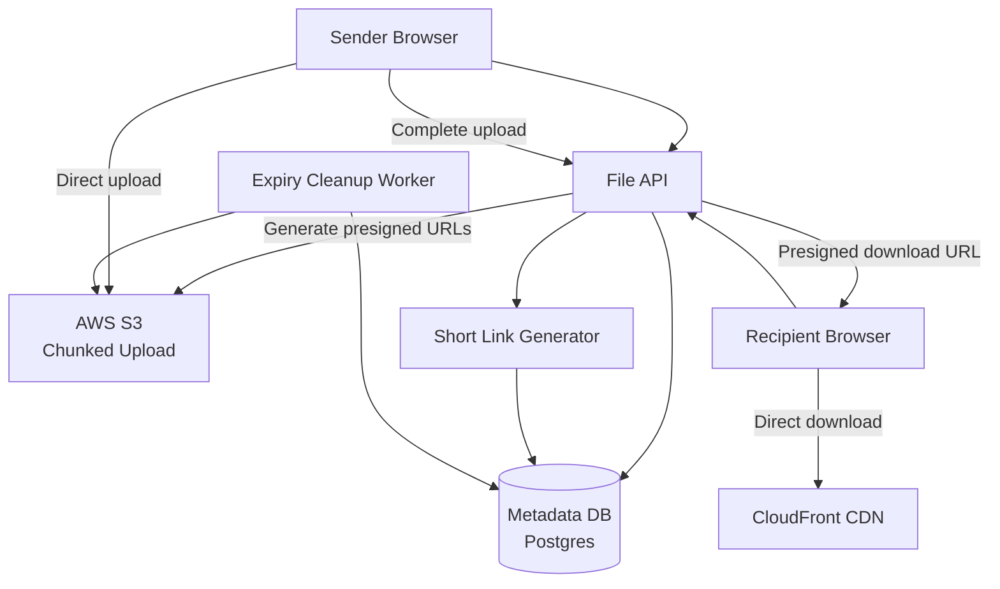

# Design a File Sharing Platform (WeTransfer)

**Difficulty**: 🟡 Intermediate
**Reading Time**: Coming Soon
**Interview Frequency**: Medium

---

> 🚧 **Full article coming soon.** This stub gives you the essentials to start thinking about this problem.

---

## The Core Problem

Accepting file uploads up to 20GB and sharing via a short-lived link with expiry — uploading a 20GB file over a single HTTP connection is unreliable; the upload will likely time out or fail midway and require starting over. Chunked upload with resumability is essential, and presigned URLs let clients upload directly to S3 without proxying through your backend.

## Functional Requirements

- Upload files up to 20GB per transfer
- Receive a shareable link that expires after 7 days
- Recipients can download without an account
- Optional password protection for links
- Track download count and send notification to sender

## Non-Functional Requirements

| Requirement | Target |
|-------------|--------|
| Upload throughput | 10GB/s aggregate ingest |
| Download availability | 99.9% (8.7 hrs downtime/year) |
| Link expiry | Files deleted within 1 hour of expiry |
| Max file size | 20GB per file, 5GB free tier |

## Back-of-Envelope Estimates

- **Storage**: 1M uploads/day × 500MB avg = 500TB/day ingest (significant; CDN required for downloads)
- **Expiry cleanup**: Files deleted after 7 days → rolling 7TB storage per day = ~3.5PB peak storage
- **Chunk size**: 20GB file ÷ 100MB chunks = 200 chunks; each uploaded independently with retry

## Key Design Decisions

1. **Multipart Upload via Presigned URLs** — backend generates 200 presigned S3 URLs (one per 100MB chunk); client uploads chunks directly to S3 in parallel (5 concurrent); on completion, client calls backend to trigger S3's CompleteMultipartUpload; no 20GB data passes through your servers.
2. **Content-Addressed Deduplication** — compute SHA-256 of file before upload; check if same hash exists in storage; if yes, create a new metadata record pointing to existing S3 object — no re-upload needed (especially useful for common files like OS images).
3. **Expiry via Scheduled Cleanup Worker** — set file expiry timestamp in metadata DB; scheduled worker runs every hour, queries "WHERE expiry < NOW()"; deletes S3 objects then metadata record; use S3 Object Expiration as backup for missed cleanups.

## High-Level Architecture

## Top Interview Questions for This Problem

| Question | Tests |
|----------|-------|
| How do you handle a 20GB upload that fails midway? | Chunked upload, resumable uploads |
| How do you prevent your short links from being guessable / brute-forced? | Token entropy, rate limiting |
| How would you implement virus scanning without blocking the upload? | Async scanning, quarantine state |

## Related Concepts

- [Dropbox for persistent file sync comparison](../06-storage-files)
- [Pastebin for similar short-link generation patterns](../02-social-platforms/pastebin)

---

*📚 Full deep-dive with multiple approaches, trade-off tables, and pseudocode coming soon.*

## 📚 Resources & References

| Resource | Type | What You'll Learn |
|----------|------|------------------|
| [ByteByteGo — Design a File Sharing System](https://www.youtube.com/@ByteByteGo) | 📺 YouTube | Search "file sharing design" — presigned URLs, access control, CDN delivery |
| [AWS S3 Presigned URLs](https://docs.aws.amazon.com/AmazonS3/latest/userguide/ShareObjectPreSignedURL.html) | 📚 Docs | Secure temporary access to private S3 objects without exposing credentials |
| [WeTransfer Engineering: Large File Transfer](https://engineering.wetransfer.com/) | 📖 Blog | How WeTransfer handles large file uploads and temporary sharing at scale |
| [Multipart Upload Architecture](https://docs.aws.amazon.com/AmazonS3/latest/userguide/mpuoverview.html) | 📚 Docs | Handling large file uploads reliably with resumable multipart transfers |
| [Box Engineering: File Permissions at Scale](https://medium.com/box-tech-blog) | 📖 Blog | Enterprise file sharing — folder hierarchies, permission propagation, audit logs |
