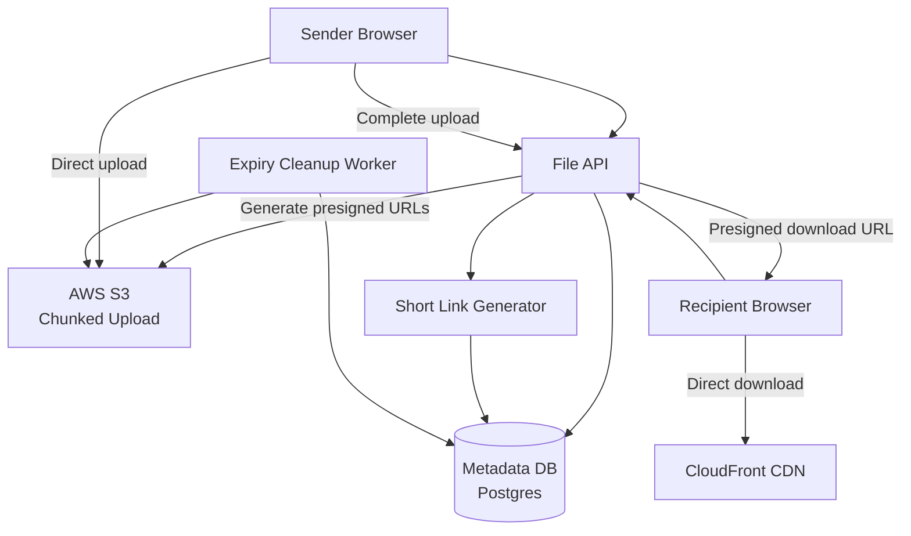
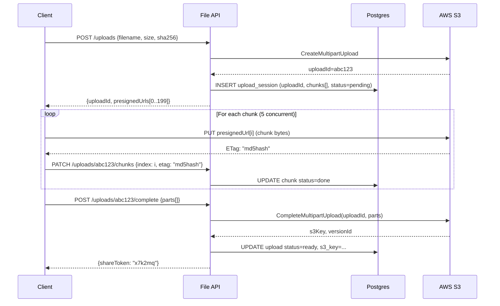
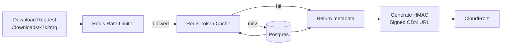
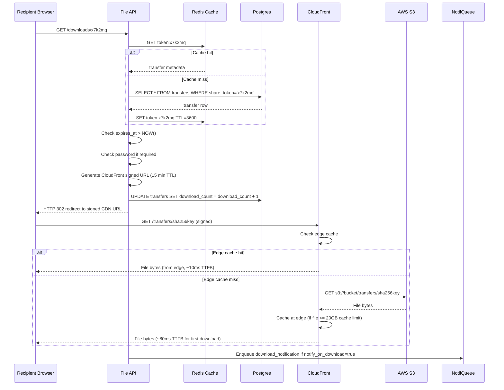

# Design a File Sharing Platform (WeTransfer)

**Difficulty**: 🟡 Intermediate
**Reading Time**: ~18 minutes
**Interview Frequency**: Medium

---

## The Core Problem

Accepting file uploads up to 20GB and sharing via a short-lived link with expiry — uploading a 20GB file over a single HTTP connection is unreliable; the upload will likely time out or fail midway and require starting over. Chunked upload with resumability is essential, and presigned URLs let clients upload directly to S3 without proxying through your backend.

## Functional Requirements

- Upload files up to 20GB per transfer
- Receive a shareable link that expires after 7 days
- Recipients can download without an account
- Optional password protection for links
- Track download count and send notification to sender

## Non-Functional Requirements

| Requirement | Target |
|-------------|--------|
| Upload throughput | 10GB/s aggregate ingest |
| Download availability | 99.9% (8.7 hrs downtime/year) |
| Link expiry | Files deleted within 1 hour of expiry |
| Max file size | 20GB per file, 5GB free tier |

## Back-of-Envelope Estimates

- **Storage**: 1M uploads/day × 500MB avg = 500TB/day ingest (significant; CDN required for downloads)
- **Expiry cleanup**: Files deleted after 7 days → rolling 7TB storage per day = ~3.5PB peak storage
- **Chunk size**: 20GB file ÷ 100MB chunks = 200 chunks; each uploaded independently with retry

## Key Design Decisions

1. **Multipart Upload via Presigned URLs** — backend generates 200 presigned S3 URLs (one per 100MB chunk); client uploads chunks directly to S3 in parallel (5 concurrent); on completion, client calls backend to trigger S3's CompleteMultipartUpload; no 20GB data passes through your servers.
2. **Content-Addressed Deduplication** — compute SHA-256 of file before upload; check if same hash exists in storage; if yes, create a new metadata record pointing to existing S3 object — no re-upload needed (especially useful for common files like OS images).
3. **Expiry via Scheduled Cleanup Worker** — set file expiry timestamp in metadata DB; scheduled worker runs every hour, queries "WHERE expiry < NOW()"; deletes S3 objects then metadata record; use S3 Object Expiration as backup for missed cleanups.

## High-Level Architecture



## Top Interview Questions for This Problem

| Question | Tests |
|----------|-------|
| How do you handle a 20GB upload that fails midway? | Chunked upload, resumable uploads |
| How do you prevent your short links from being guessable / brute-forced? | Token entropy, rate limiting |
| How would you implement virus scanning without blocking the upload? | Async scanning, quarantine state |

## Related Concepts

- [Dropbox for persistent file sync comparison](../06-storage-files)
- [Pastebin for similar short-link generation patterns](../02-social-platforms/pastebin)

---

## Component Deep Dive 1: Chunked Upload with Presigned URLs

### How It Works Internally

The chunked upload pipeline is the backbone of any large-file transfer platform. Without it, a single 20GB file upload over HTTP/1.1 will hit connection timeouts (most load balancers default to 60s–300s idle timeout), consume enormous memory on the API server buffering the stream, and offer zero recovery on partial failure.

The flow has three distinct phases:

**Phase 1 — Initiation**: The client sends file metadata (name, size, SHA-256 hash, MIME type) to the API. The API calls `s3.CreateMultipartUpload` and receives an `UploadId`. It then generates N presigned PUT URLs — one per chunk — each valid for 12 hours. The API stores the `UploadId` and chunk manifest in the metadata DB and returns the presigned URL list to the client.

**Phase 2 — Parallel Chunk Uploads**: The client splits the file into chunks (100MB each for a 20GB file = 200 chunks). It uploads 5 chunks concurrently directly to S3 via the presigned URLs. Each successful PUT returns an `ETag` (MD5 of the chunk). The client stores `(chunk_index, ETag)` pairs locally. On any failure, the client retries that specific chunk up to 3 times with exponential backoff — no other chunks are affected.

**Phase 3 — Assembly**: Once all ETags are collected, the client calls the API's `/complete-upload` endpoint with the full `[(PartNumber, ETag)]` list. The API calls `s3.CompleteMultipartUpload`, which atomically assembles all chunks into one S3 object. S3 validates that every declared part exists and the ETags match before making the object accessible.

The naive approach — proxying 20GB through your API servers — would require 20GB × concurrent_uploads of RAM and would saturate your outbound bandwidth before S3 does. Presigned URLs offload 100% of upload bandwidth directly to S3's edge nodes.

### Resumability at Scale

If the client closes the browser mid-upload, the `UploadId` and completed chunk ETags must be persisted server-side (not just in localStorage, which is cleared). When the user returns, the API returns the already-completed chunk indices; the client skips those and resumes from the first incomplete chunk. S3 retains incomplete multipart uploads for up to 7 days by default — configure an S3 Lifecycle Policy to abort them after 24 hours to avoid storage charges for abandoned uploads.

### Upload Pipeline Sequence



### Approach Comparison

| Approach | Latency (20GB) | Throughput | Trade-off |
|----------|---------------|------------|-----------|
| Single HTTP PUT via API proxy | Fails >5GB (timeout) | Limited by API bandwidth | Simple but unscalable; API becomes bottleneck |
| Presigned URL multipart (100MB chunks) | 8–12 min @ 300Mbps | Scales to S3 limits (~5TB/s aggregate) | Correct approach; client complexity is higher |
| Resumable upload protocol (TUS) | 8–12 min @ 300Mbps | Same as above | Standardized protocol; requires TUS server middleware |

---

## Component Deep Dive 2: Short Link Generation and Token Security

### Internal Mechanics

A short link like `https://wetransfer.com/downloads/x7k2mq` must satisfy three properties: (1) unguessable — an attacker should not be able to enumerate valid tokens by brute force; (2) short — ideally 8–12 characters for human readability; (3) unique — no collision within the active token namespace.

The naive approach of using sequential IDs (`transfer/1`, `transfer/2`) leaks upload volume and is trivially enumerable. Using UUIDs (128-bit) is collision-resistant but at 32 hex characters is impractically long for a "short" link.

The production approach: generate 8 bytes from a CSPRNG (cryptographically secure random number generator), Base62-encode them to produce a 10–11 character token. The collision probability with 8 bytes of entropy is 1/(2^64) ≈ negligible. At 1M tokens in flight at any time, the birthday attack probability is ~5×10^-9 — safe.

```
raw_bytes = os.urandom(8)            # 64 bits of entropy
token = base62_encode(raw_bytes)     # ~10 chars: [A-Za-z0-9]
```

The token is stored as the primary lookup key with a covering index on `(token, expires_at)` so link resolution is a single index seek.

### Rate Limiting and Abuse Prevention

Without rate limiting, an attacker can hit the download endpoint 10M times/hour and enumerate tokens. Mitigations:

- **Token entropy**: 64 bits makes brute force computationally infeasible (at 10M req/s it takes 58,000 years to enumerate half the space)
- **IP-based rate limiting**: Max 100 download requests per IP per minute via Redis sliding window counter
- **HMAC signature on download URLs**: The API generates a time-limited HMAC-signed download URL (valid 15 min) — even if a token is known, without a valid signature the CDN rejects the request

### Scale Behavior at 10x Load

At 10M link resolutions/day (10x baseline), the bottleneck shifts to the Postgres lookup. A single Postgres instance handles ~5,000 point reads/sec comfortably. At 10x that becomes 50,000 req/s — add a read replica or front with Redis cache (token → metadata) with TTL matching the link expiry. Cache hit rate approaches 99% since popular transfers are downloaded many times.



---

## Component Deep Dive 3: Expiry, Cleanup, and Storage Lifecycle

### Technical Decisions

File expiry is deceptively complex. The business rule is simple — "delete files after 7 days" — but the implementation must handle: (1) S3 objects vs. metadata records going out of sync; (2) cleanup at scale (3.5PB rolling storage × 1M files/day expiring in batches); (3) the file being actively downloaded when the cleanup worker fires.

**Two-layer expiry** is the correct approach:

**Layer 1 — Application Cleanup Worker**: A scheduled job (runs every 15 minutes) queries:
```sql
SELECT transfer_id, s3_key FROM transfers
WHERE expires_at < NOW() AND status != 'deleted'
LIMIT 1000;
```
For each batch: call `s3.DeleteObjects` (batch delete up to 1000 keys per API call), then `UPDATE transfers SET status='deleted', deleted_at=NOW()`. Process in batches of 1000 to avoid long transactions and memory pressure.

**Layer 2 — S3 Object Lifecycle Policy**: Configure S3 to automatically expire objects with prefix `transfers/` after 8 days. This acts as a safety net — even if the cleanup worker misses a file (crash, DB lag), S3 will purge it within 24 hours of the policy trigger.

**In-flight download protection**: Before deleting, check `active_downloads` counter in Redis. If non-zero, defer deletion by 1 hour. Alternatively, keep the S3 object accessible and only mark the metadata as expired — the link resolution layer returns 410 Gone for any token past its `expires_at`, regardless of whether the S3 object still exists.

**Deduplication interaction**: Files stored via content-addressed deduplication (multiple transfer records → one S3 object) must not delete the S3 object until ALL referencing transfer records have expired. Use a `reference_count` column; decrement on each expiry; only issue `s3.DeleteObject` when count reaches 0.

---

## Data Model

```sql
-- Core transfer record
CREATE TABLE transfers (
    transfer_id     UUID PRIMARY KEY DEFAULT gen_random_uuid(),
    share_token     CHAR(11) UNIQUE NOT NULL,         -- Base62 token for short link
    sender_email    VARCHAR(320),                      -- NULL for anonymous uploads
    created_at      TIMESTAMPTZ NOT NULL DEFAULT NOW(),
    expires_at      TIMESTAMPTZ NOT NULL,              -- created_at + 7 days
    status          VARCHAR(20) NOT NULL DEFAULT 'pending',
                    -- pending | uploading | scanning | ready | expired | deleted
    password_hash   VARCHAR(60),                       -- bcrypt hash, NULL if no password
    download_count  INTEGER NOT NULL DEFAULT 0,
    notify_on_download BOOLEAN NOT NULL DEFAULT TRUE
);

CREATE INDEX idx_transfers_share_token ON transfers (share_token);
CREATE INDEX idx_transfers_expires_at  ON transfers (expires_at) WHERE status != 'deleted';

-- Individual files within a transfer (a transfer can contain multiple files)
CREATE TABLE transfer_files (
    file_id         UUID PRIMARY KEY DEFAULT gen_random_uuid(),
    transfer_id     UUID NOT NULL REFERENCES transfers(transfer_id) ON DELETE CASCADE,
    filename        VARCHAR(1024) NOT NULL,
    mime_type       VARCHAR(255),
    file_size_bytes BIGINT NOT NULL,
    sha256_hash     CHAR(64) NOT NULL,                 -- for deduplication
    s3_key          VARCHAR(2048) NOT NULL,             -- e.g. transfers/2026/06/01/<sha256>
    s3_version_id   VARCHAR(255),
    upload_id       VARCHAR(255),                       -- S3 multipart UploadId during upload
    chunk_count     SMALLINT NOT NULL,
    chunks_done     SMALLINT NOT NULL DEFAULT 0,
    ref_count       SMALLINT NOT NULL DEFAULT 1,        -- dedup reference count
    scan_status     VARCHAR(20) DEFAULT 'pending'       -- pending | clean | infected | skipped
);

CREATE INDEX idx_transfer_files_transfer ON transfer_files (transfer_id);
CREATE INDEX idx_transfer_files_sha256   ON transfer_files (sha256_hash);  -- dedup lookup

-- Chunk progress (for resumable uploads)
CREATE TABLE upload_chunks (
    file_id         UUID NOT NULL REFERENCES transfer_files(file_id) ON DELETE CASCADE,
    chunk_index     SMALLINT NOT NULL,
    etag            VARCHAR(64),                        -- S3 ETag returned after successful PUT
    status          VARCHAR(10) NOT NULL DEFAULT 'pending', -- pending | done | failed
    uploaded_at     TIMESTAMPTZ,
    PRIMARY KEY (file_id, chunk_index)
);

-- Download event log (for notification and analytics)
CREATE TABLE download_events (
    event_id        BIGSERIAL PRIMARY KEY,
    transfer_id     UUID NOT NULL REFERENCES transfers(transfer_id),
    downloaded_at   TIMESTAMPTZ NOT NULL DEFAULT NOW(),
    recipient_ip    INET,
    user_agent      TEXT
);

CREATE INDEX idx_download_events_transfer ON download_events (transfer_id, downloaded_at);
```

---

## Scale Bottlenecks

| Traffic Level | Component That Breaks | Symptoms | Mitigation |
|---------------|----------------------|----------|------------|
| 10x baseline (10M uploads/day) | Postgres write throughput on `upload_chunks` updates | Chunk progress updates generate 200 writes per file × 10M files = 2B writes/day; Postgres saturates at ~50k writes/s | Batch chunk status updates; use Redis for in-flight chunk tracking, flush to Postgres only on completion |
| 100x baseline (100M uploads/day) | S3 `CompleteMultipartUpload` API rate limits | S3 throttles at ~3,500 PUT/s per prefix; 100M completions/day = ~1,157/s but burst spike can exceed limit | Use randomized S3 key prefixes (`transfers/<random4chars>/<sha256>`) to spread load across S3 partitions |
| 100x baseline | Expiry cleanup worker throughput | 100M files expiring per 7-day cycle = ~14M files/day to delete; single worker can process ~50k/min | Shard cleanup workers by `transfer_id % N`; use SQS to fan out deletion tasks to 100+ worker instances |
| 1000x baseline (1B uploads/day) | Metadata DB (single Postgres) | Read/write IOPS ceiling (~100k IOPS on RDS io2); link resolution and upload progress overwhelm single instance | Migrate to distributed DB (CockroachDB or Vitess-sharded MySQL); separate read replicas per region; cache hot token lookups in Redis Cluster |
| 1000x baseline | CDN egress cost | 1B downloads × 500MB avg = 500EB/year of egress (not feasible from single cloud) | Multi-CDN strategy (Akamai + CloudFront); regional S3 replication; negotiate volume pricing; enforce bandwidth caps per download |

---

## How Dropbox Built Large File Transfer

Dropbox handles billions of file operations daily and their engineering blog documents their file transfer architecture in detail (Dropbox Tech Blog, 2018–2023).

**Scale**: Dropbox stores 500 billion files as of 2023, with peak ingest rates exceeding 1 million files/minute. Their system handles files ranging from 1-byte text files to multi-GB video files from professional creators.

**Non-obvious architectural decision — Magic Pocket (custom block storage)**: Rather than relying solely on S3, Dropbox built "Magic Pocket," a custom distributed block storage system. Files are split into 4MB blocks, each content-addressed by SHA-256. The same 4MB block shared across 1,000 different user files is stored exactly once. At their scale, deduplication saves an estimated 40–50% of raw storage. The dedup ratio for common document types (PDFs, Office files) approaches 3:1.

**Upload chunking**: Dropbox client splits files into 4MB blocks (not 100MB like WeTransfer) for finer-grained deduplication. Each block is uploaded with its SHA-256 hash. The server performs a "check before upload" — if the block hash already exists in Magic Pocket, the client skips that block entirely (zero-byte upload for already-stored blocks). This is called block-level deduplication vs. file-level deduplication.

**Metadata separation**: File metadata (path, permissions, version history) is stored in separate sharded MySQL databases, completely decoupled from block storage. This allows metadata operations (rename, move, share) to be instant even for multi-GB files — no data movement required.

**Numbers**: The Dropbox desktop client uploads at 60MB/s on a fast connection; their backend handles 500k API requests/second at peak; their block storage system sustains 10GB/s sustained write throughput across their data centers.

Source: Dropbox Tech Blog — "Rewriting the Heart of Our Sync Engine" (2019), "Inside the Magic Pocket" (2016).

---

## Interview Angle

**What the interviewer is testing:** Whether you understand that large file uploads fundamentally cannot go through your application servers, and whether you can reason about the full lifecycle — from chunked upload through expiry and cleanup — without hand-waving the hard parts.

**Common mistakes candidates make:**

1. **Proxying file data through the API server**: Saying "the client POSTs the file to `/api/upload`" for a 20GB file shows a lack of production awareness. API servers have 30s–5min timeouts, limited memory, and limited bandwidth. The interviewer immediately knows the candidate hasn't shipped a real upload feature. The correct answer always involves presigned URLs or direct-to-storage upload.

2. **Ignoring resumability**: Describing chunked upload but not addressing "what happens if the upload fails at chunk 150 of 200" misses the core value of chunking. The candidate should explain that chunk progress is persisted server-side so the client can resume, and that S3 retains incomplete multipart uploads.

3. **Using sequential IDs for short tokens**: Proposing `wetransfer.com/downloads/12345` for the share link exposes upload volume, is trivially enumerable, and fails basic security requirements. The candidate should mention CSPRNG, Base62 encoding, and rate limiting on the resolution endpoint.

**The insight that separates good from great answers:** Deduplication at the block level (not just file level) dramatically changes the storage cost model. A candidate who explains that computing SHA-256 before upload enables a "check before upload" round-trip — and that at WeTransfer's scale this might save 20–30% of ingest volume because the same video/installer gets re-uploaded thousands of times — demonstrates systems thinking beyond the happy path.

---

## Key Numbers to Remember

| Metric | Value | Context |
|--------|-------|---------|
| Optimal chunk size | 100MB | Balances retry overhead vs. parallelism for 20GB files; AWS minimum is 5MB, maximum 5GB |
| Max concurrent S3 PUTs per client | 5 | Browser/OS connection limit per origin; more than 5 shows diminishing returns due to network congestion |
| S3 multipart part limit | 10,000 parts | Hard AWS limit; for 20GB file with 5MB chunks = 4,000 parts — safe; with 1MB chunks = 20,000 — exceeds limit |
| Token entropy (Base62, 10 chars) | ~59.6 bits | 62^10 ≈ 839 trillion combinations; brute force at 10M req/s takes 2.6 years |
| S3 PUT rate per prefix | 3,500 req/s | Randomizing first 4 chars of key spreads to 14M req/s effective limit |
| Postgres point reads (single instance) | ~5,000 req/s | Add Redis cache for token lookups beyond this; RDS r6g.2xlarge handles up to 25k with connection pooling |
| Cleanup worker batch size | 1,000 files/batch | Matches `s3.DeleteObjects` API limit (1,000 keys per call) |
| Dedup storage savings | 20–50% | Higher for platforms with many identical OS images, installers, media files |
| WeTransfer free tier limit | 2GB per transfer | Up from original 2GB to handle modern HD video; Pro tier: 200GB |
| S3 multipart upload abandonment TTL | 24 hours | Set via Lifecycle Policy to avoid charges for incomplete uploads from crashed clients |

---

## Virus Scanning Pipeline

Large-file platforms are a prime vector for malware distribution. Without scanning, an attacker uploads a malicious executable, shares the link with thousands of users, and the platform becomes an unwitting distribution network. The challenge: scanning must not block the download experience for legitimate files, but infected files must never reach recipients.

### Async Quarantine Pattern

The key insight is that scanning happens asynchronously after the upload completes, and files are held in a quarantine state until cleared. The transfer `status` field drives this state machine:

```
pending -> uploading -> scan_pending -> scan_clean (ready) -> expired -> deleted
                                    -> scan_infected (blocked)
```

When `CompleteMultipartUpload` succeeds, the API publishes a `file.uploaded` event to SQS. A fleet of virus scanner workers (running ClamAV or a commercial AV engine like Symantec) consume from the queue, download the file from S3, scan it in memory, and update `scan_status`. The file's share link returns HTTP 202 (accepted but not yet ready) while scanning is in progress, and HTTP 451 (unavailable for legal reasons) if infected.

### Scanning at Scale

ClamAV scans at ~50MB/s on a single core. A 20GB file takes ~400 seconds — over 6 minutes. Options:

| Approach | Scan Speed | Cost | Trade-off |
|----------|-----------|------|-----------|
| ClamAV single-threaded | 50MB/s | Near-zero (open source) | Too slow for 20GB files; acceptable for <1GB |
| ClamAV multi-threaded (8 cores) | ~300MB/s | Low | 20GB file scans in ~67s; workable |
| Commercial cloud AV (e.g., VirusTotal API) | Near-instant for known hashes | Per-scan fee (~$0.001) | Hash-lookup for known malware is instant; unknown files still need full scan |
| Chunked hash-based pre-screening | Instant for known signatures | Minimal | Check SHA-256 against threat intelligence DB before full scan; skip scan if hash is in known-clean registry |

The production approach combines hash-based pre-screening (instant, eliminates 90%+ of known-safe files) with full AV scan for unknown hashes. Known-clean hashes are cached in Redis with long TTL. This keeps median scan latency under 2 seconds for common files and under 2 minutes for truly novel files.

---

## Download Flow and CDN Architecture

### Why Not Serve Downloads Directly from S3

S3 supports direct public access but there are three reasons not to use it for downloads:

1. **Cost**: S3 egress to the internet costs $0.09/GB. CloudFront costs $0.0085/GB for cached content — 10x cheaper. A platform doing 500TB/day of downloads saves $38,250/day using CDN.
2. **Latency**: S3 is a single-region object store. CloudFront has 450+ edge locations globally. A user in Singapore downloading from an S3 bucket in us-east-1 gets 200–300ms TTFB. From a Singapore CloudFront edge: 10–20ms.
3. **Access control**: Serving through CloudFront lets you issue signed URLs with short expiry (15 minutes) so the download link cannot be hotlinked or re-shared indefinitely.

### Download Sequence



### Multi-Region Strategy

For a globally distributed platform, a single S3 bucket in us-east-1 creates hot-path latency for users in APAC and EU. The architecture for global scale:

- **S3 Cross-Region Replication**: Replicate `transfers/` prefix to eu-west-1 and ap-southeast-1. Objects replicate within 15 minutes (S3 RTC — Replication Time Control — guarantees 99.99% of objects within 15 minutes for an additional cost).
- **CloudFront origin groups**: Configure primary origin as us-east-1 bucket, failover origins as eu-west-1 and ap-southeast-1. CloudFront routes each download request to the lowest-latency origin.
- **Upload routing**: Use Route53 latency-based routing to direct upload API requests to the nearest region. Store files in that region's S3 bucket first, then replicate globally.

---

## Notification System

When a recipient downloads a file, the sender receives an email or push notification. This is a write-ahead fire-and-forget workload — the download itself must not be delayed waiting for notification delivery.

### Architecture

The API enqueues a `download_event` message to SQS immediately after updating `download_count`. A separate notification worker consumes from SQS and sends via AWS SES (email) or a push notification service. The worker is idempotent — duplicate SQS messages (SQS guarantees at-least-once delivery) are deduplicated by checking a `notifications_sent` Redis set keyed by `(transfer_id, download_event_id)`.

Notification frequency is rate-limited to prevent inbox flooding: if the same transfer gets 1,000 downloads in an hour, the sender receives one batched summary email ("Your transfer was downloaded 1,000 times") rather than 1,000 individual emails. A Redis counter `notif_count:{transfer_id}:{hour}` tracks the rate and triggers batching when count > 5 in a 10-minute window.

---

## Password Protection Implementation

Optional password protection on a transfer adds one bcrypt comparison to the download flow. The implementation details matter:

```python
# On transfer creation with password
password_hash = bcrypt.hashpw(password.encode(), bcrypt.gensalt(rounds=12))
# Store in transfers.password_hash

# On download request
if transfer.password_hash:
    submitted = request.form.get('password', '')
    if not bcrypt.checkpw(submitted.encode(), transfer.password_hash):
        return Response(status=401, body='{"error": "incorrect password"}')
```

**Critical detail**: bcrypt with 12 rounds takes ~250ms per check. This is intentional — it makes brute force attacks slow. But it also means the download endpoint handles only ~4 password checks/second per CPU core. Rate-limit password attempts to 10/minute per IP to prevent CPU exhaustion from an attacker hammering the endpoint with many concurrent wrong-password requests.

Do not return the password hash in any API response. Do not log the submitted password. Return a generic 401 for both "wrong password" and "no password field submitted" — do not distinguish them in the response body (information leak).

---

## Content Deduplication: File-Level vs Block-Level

Deduplication is one of the highest-leverage cost-reduction techniques in a file-sharing platform. Understanding the two strategies and when each makes sense is a strong signal in interviews.

### File-Level Deduplication

The simplest form: compute SHA-256 of the entire file before upload. Query the database for an existing `transfer_files` record with a matching `sha256_hash`. If found, create a new `transfer_files` row pointing to the same `s3_key` and increment `ref_count`. Skip the S3 upload entirely.

```sql
-- Check before upload
SELECT s3_key, ref_count FROM transfer_files
WHERE sha256_hash = $1
LIMIT 1;

-- If found: link to existing S3 object
INSERT INTO transfer_files (transfer_id, sha256_hash, s3_key, ref_count, ...)
VALUES ($1, $2, $existing_s3_key, 1, ...);

UPDATE transfer_files SET ref_count = ref_count + 1
WHERE sha256_hash = $2;
```

**Effectiveness**: Excellent for platforms where users frequently upload identical files — OS ISO images, software installers, corporate template documents. A 4GB Windows installer uploaded by 10,000 different users is stored once. Dedup ratio can reach 50:1 for such content. Effectiveness drops to near zero for unique content (personal videos, custom documents).

**Client-side SHA-256 timing**: Computing SHA-256 of a 20GB file in JavaScript takes ~15–25 seconds on a modern laptop (Web Crypto API, `SubtleCrypto.digest`). This is a UX cost that must be weighed against the upload bandwidth savings. For files under 1GB, the hash computation is fast enough to always be worth it. For files over 5GB, consider offering it as an opt-in or computing it in a background thread while the upload starts.

### Block-Level Deduplication

Instead of hashing the whole file, split into fixed-size blocks (4MB–16MB) and hash each block. Only upload blocks that don't already exist in the block store. This is how Dropbox's Magic Pocket works and how cloud backup tools like Restic and Duplicati achieve high compression ratios on incremental backups.

**Effectiveness**: Much higher than file-level for partially similar content. If a user uploads version 1 and version 2 of a 10GB video where only the first 500MB changed, block-level dedup stores only the 500MB of new blocks. File-level dedup stores two full 10GB files.

**Complexity cost**: Block-level requires a block manifest (list of block hashes in order) per file, a separate block store, reassembly logic on download, and a more complex reference counting scheme (a block may be referenced by hundreds of files). Not worth building for a WeTransfer-style ephemeral platform; it is worth building for a persistent sync platform like Dropbox or Google Drive.

| Strategy | Storage Savings | Implementation Complexity | Best For |
|----------|----------------|--------------------------|----------|
| No dedup | 0% | None | Simplest path; use for MVP |
| File-level (SHA-256) | 20–50% | Low (one DB lookup) | Ephemeral sharing platforms |
| Block-level (4MB blocks) | 40–80% | High (block manifest, block store) | Persistent sync, backup tools |
| Delta encoding (binary diff) | Up to 95% for similar files | Very high | Version control systems (Git) |

---

## Abuse Prevention and Rate Limiting

A file-sharing platform without rate limiting becomes a free CDN for abuse: spam campaigns use it to host phishing pages, copyright infringement flourishes, and storage fills with scraped content.

### Upload Rate Limits

Per IP and per account:

| Limit | Free Tier | Pro Tier |
|-------|-----------|----------|
| Transfers per day | 10 | Unlimited |
| Total upload GB per day | 5GB | 200GB |
| Max file size per transfer | 2GB | 20GB |
| Max files per transfer | 20 | 250 |

Implement with Redis token bucket: `INCRBY uploads:{ip}:{date} 1` with TTL set to end of day. If count exceeds limit, return HTTP 429 with `Retry-After` header.

### Link Scraping Prevention

Short tokens are 11 chars of Base62 = 62^11 ≈ 52 quadrillion combinations. Even at 10M requests/second, enumerating 1% of the space takes 1.6 million years. However, attackers don't enumerate randomly — they target recently created tokens (sequential time windows). Mitigate by:

1. **Token format does not encode creation time** — use pure random bytes, not time-prefixed UUIDs
2. **CAPTCHA on download page** for IPs with >50 download attempts in 10 minutes
3. **Honeypot tokens** — a small set of valid-looking tokens that are never shared; any request to these tokens triggers an IP block

### DMCA and Copyright Takedown

The platform must support takedown workflows:

```sql
CREATE TABLE takedown_requests (
    request_id    UUID PRIMARY KEY,
    transfer_id   UUID REFERENCES transfers(transfer_id),
    reported_by   VARCHAR(320),
    reason        VARCHAR(50),   -- dmca | abuse | malware | other
    filed_at      TIMESTAMPTZ DEFAULT NOW(),
    resolved_at   TIMESTAMPTZ,
    resolution    VARCHAR(20)    -- removed | rejected | pending
);
```

On filing: mark transfer `status='takedown_pending'`; block downloads immediately; notify abuse team via PagerDuty. On resolution: either delete permanently or restore and notify reporter.

---

## Observability: What to Monitor

A file-sharing platform has unique observability needs because most of the data flow bypasses your servers (client → S3 directly). You cannot see upload progress from server logs alone.

### Key Metrics

| Metric | Instrumentation | Alert Threshold |
|--------|----------------|-----------------|
| Upload initiation rate | API server counter | Drop >20% from baseline → alert |
| Upload completion rate | `status=ready` transitions/min | Completion rate < 80% of initiations → alert (stuck uploads) |
| Chunk failure rate | Client-reported via `/chunks` PATCH failures | >5% failure rate per IP → investigate S3 connectivity |
| Time-to-ready (P50/P99) | Timestamp delta: created_at → status=ready | P99 > 30 min for files < 1GB → alert |
| Download 404 rate | CloudFront access logs | >0.1% 404 on `downloads/*` → expiry worker running ahead |
| Cleanup worker lag | `COUNT(*) WHERE expires_at < NOW() - 1hour AND status != deleted` | > 10,000 → worker falling behind |
| Scan queue depth | SQS `ApproximateNumberOfMessages` | > 50,000 → spin up more scanner instances |

### Distributed Tracing

Because the upload flow spans client, API, S3, and database, a trace ID must be threaded through:

- Client generates `X-Trace-Id: uuid` on upload initiation
- API logs trace ID with every operation
- S3 access logs include the `x-amz-request-id` — correlate with API trace via the presigned URL's `X-Amz-Security-Token`
- CloudFront access logs include the `x-edge-request-id`

Use Jaeger or AWS X-Ray to stitch these together into a single waterfall view per upload/download.

---

## Alternative Architecture: TUS Protocol

The [TUS open protocol](https://tus.io/) is a standardized resumable upload protocol used by Vimeo, Cloudflare Stream, and others. Instead of a custom chunk-tracking implementation, TUS defines standard HTTP headers for resumable uploads:

```
# TUS upload flow
POST /files                          # Create upload, get Location URL
HEAD /files/abc123                   # Query progress (returns Upload-Offset)
PATCH /files/abc123                  # Send bytes from offset
  Upload-Offset: 104857600           # Resume from byte 100MB
  Content-Type: application/offset+octet-stream
```

**Advantages over custom implementation**:
- Client libraries exist for all major platforms (tusd for server, tus-js-client for browser)
- Standard protocol means no custom chunk-tracking logic on the server
- Built-in support for parallel chunk uploads (TUS Concatenation extension)

**Disadvantages**:
- Adds a TUS server component between client and S3 (data proxies through your server unless you use TUS's S3 store backend)
- Less control over chunk size, concurrency, and presigned URL integration
- Vendor libraries add dependency maintenance overhead

For WeTransfer-scale use, the custom presigned URL approach is preferable because it eliminates server-side data proxying entirely. TUS is better when you need a standard client library ecosystem and are willing to proxy data through a TUS server.

---

## 📚 Resources & References

| Resource | Type | What You'll Learn |
|----------|------|------------------|
| [ByteByteGo — Design a File Sharing System](https://www.youtube.com/@ByteByteGo) | 📺 YouTube | Search "file sharing design" — presigned URLs, access control, CDN delivery |
| [AWS S3 Presigned URLs](https://docs.aws.amazon.com/AmazonS3/latest/userguide/ShareObjectPreSignedURL.html) | 📚 Docs | Secure temporary access to private S3 objects without exposing credentials |
| [WeTransfer Engineering: Large File Transfer](https://engineering.wetransfer.com/) | 📖 Blog | How WeTransfer handles large file uploads and temporary sharing at scale |
| [Multipart Upload Architecture](https://docs.aws.amazon.com/AmazonS3/latest/userguide/mpuoverview.html) | 📚 Docs | Handling large file uploads reliably with resumable multipart transfers |
| [Box Engineering: File Permissions at Scale](https://medium.com/box-tech-blog) | 📖 Blog | Enterprise file sharing — folder hierarchies, permission propagation, audit logs |
| [Dropbox — Inside the Magic Pocket](https://dropbox.tech/infrastructure/inside-the-magic-pocket) | 📖 Blog | Block-level deduplication, content-addressed storage at 500B file scale |
| [Dropbox — Rewriting the Heart of Our Sync Engine](https://dropbox.tech/infrastructure/rewriting-the-heart-of-our-sync-engine) | 📖 Blog | How Dropbox redesigned metadata storage to separate it from block storage |
