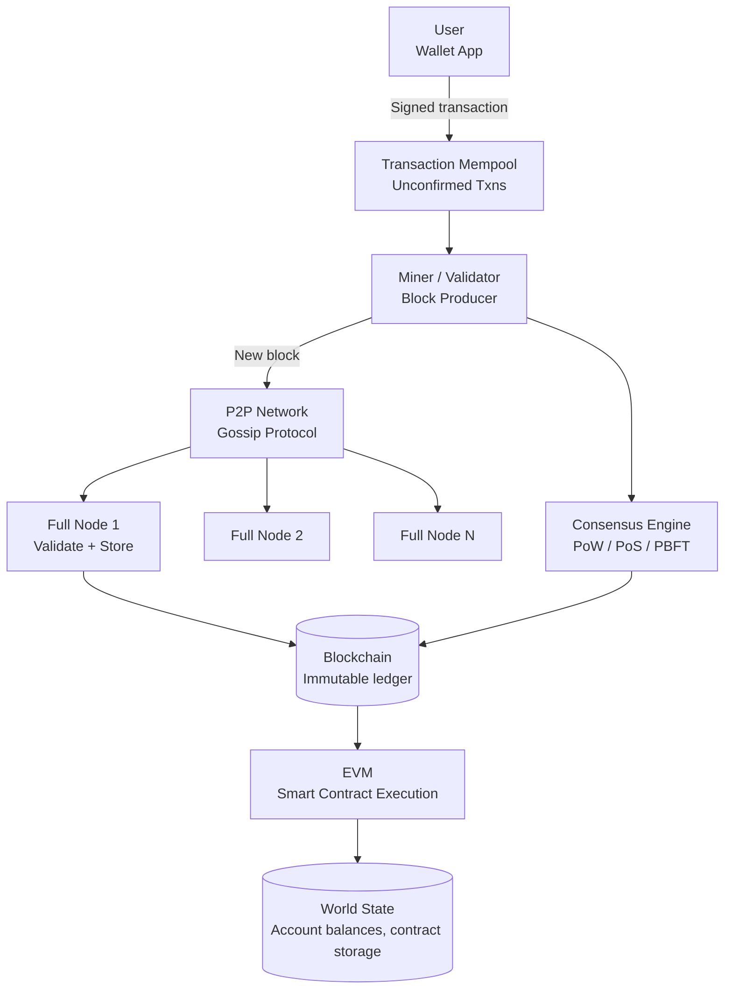

# Design a Blockchain System

**Difficulty**: 🟡 Intermediate
**Reading Time**: ~30 minutes
**The Core Problem**: How do you build a distributed ledger where thousands of untrusted participants agree on a single transaction history — without a central authority — and guarantee that history is tamper-proof?

---

## Table of Contents

1. [Requirements](#1-requirements)
2. [Capacity Estimation](#2-capacity-estimation)
3. [High-Level Architecture](#3-high-level-architecture)
4. [Block Structure](#4-block-structure)
5. [Consensus Mechanisms](#5-consensus-mechanisms)
6. [P2P Network & Block Propagation](#6-p2p-network--block-propagation)
7. [Transaction Model (UTXO vs Account)](#7-transaction-model-utxo-vs-account)
8. [Smart Contract VM](#8-smart-contract-vm)
9. [Key Design Decisions](#9-key-design-decisions)
10. [Interview Questions](#10-interview-questions)
11. [Key Takeaways](#11-key-takeaways)
12. [References](#12-references)

---

## 1. Requirements

### Functional
- Permissionless: anyone can join, submit transactions, and become a validator
- Immutable: once confirmed, transactions cannot be altered
- Decentralized: no single point of control
- Smart contracts: programmable logic executed on-chain
- Transaction finality: users can trust confirmed transactions

### Non-Functional
- **Throughput**: Bitcoin: 7 TPS; Ethereum: 15 TPS; target: 10,000 TPS (modern chains)
- **Finality time**: Bitcoin: ~60 min (6 blocks); Ethereum PoS: ~12 sec
- **Byzantine tolerance**: System continues with up to 33% malicious nodes (for PBFT)
- **Decentralization**: 10,000+ full nodes globally

---

## 2. Capacity Estimation

| Metric | Value (Bitcoin-like) |
|--------|---------------------|
| Block size | 1 MB (Bitcoin) / 2 MB (SegWit) |
| Block time | 10 minutes |
| Transactions per block | ~2,000 |
| TPS | 2,000 / 600s = **~3.3 TPS** |
| Annual chain growth | 1MB × 6 blocks/hr × 8760hr = **52 GB/year** |
| Full node storage (2024) | ~600 GB (Bitcoin full chain) |
| Mempool size (peak) | 100k transactions (~50 MB) |
| P2P network peers | 10,000 full nodes |

---

## 3. High-Level Architecture



---

## 4. Block Structure

### Block Header
```
Block Header (80 bytes in Bitcoin):
  Version:          4 bytes  (protocol version)
  PrevBlockHash:   32 bytes  (SHA-256 hash of previous block header)
  MerkleRoot:      32 bytes  (hash of all transactions in block)
  Timestamp:        4 bytes  (Unix time)
  Difficulty Target:4 bytes  (PoW target)
  Nonce:            4 bytes  (variable, incremented during mining)

Block Hash = SHA-256(SHA-256(header))
Required: block_hash < difficulty_target (for PoW)
```

### Merkle Tree
```
Transactions in block: [T1, T2, T3, T4]

Merkle Tree:
        Root = H(H12 + H34)
       /                  \
  H12 = H(H1+H2)      H34 = H(H3+H4)
  /     \              /        \
H1=H(T1) H2=H(T2)  H3=H(T3)  H4=H(T4)

Benefits:
  - Prove T1 is in block: only need [H2, H34] — O(log N) proof
  - Any tampered transaction changes MerkleRoot → invalidates block hash
  - Lightweight clients (SPV) can verify inclusion without full chain
```

### Chain Immutability
```
Chain is a singly linked list of blocks:
  Block N contains hash of Block N-1

Tampering attack: if attacker modifies Block 100:
  1. Block 100's hash changes
  2. Block 101's PrevBlockHash is now wrong → Block 101 invalid
  3. Must re-mine Blocks 101, 102, ... up to current tip
  4. Must outpace all honest miners (requires > 50% hashrate)
  → Computationally infeasible with PoW
```

---

## 5. Consensus Mechanisms

### Proof of Work (PoW) — Bitcoin
```
Mining: Find nonce such that SHA256(SHA256(header)) < target

Difficulty adjusts every 2016 blocks (~2 weeks) to maintain 10min block time.
51% attack cost: Must control > 50% of global hashrate.
Pros: Proven security (15+ years), Sybil-resistant
Cons: Energy-intensive, low TPS (3–7), 60min finality
```

### Proof of Stake (PoS) — Ethereum 2.0
```
Validators: stake 32 ETH as collateral
Block production: randomly selected proportional to stake
Slashing: misbehaving validators lose their stake

Pros: 99.9% less energy than PoW, faster finality (12 sec)
Cons: Rich-get-richer dynamics, newer (less battle-tested)
TPS: 15–100 on base layer (L2 rollups: 1000–10,000 TPS)
```

### PBFT (Practical Byzantine Fault Tolerance) — Permissioned Blockchains
```
Used by: Hyperledger Fabric, Quorum
Requires known validator set (N validators, tolerates f = (N-1)/3 failures)

3-phase protocol per block:
  1. Pre-prepare: primary sends proposed block to all replicas
  2. Prepare: replicas broadcast "I agree" — wait for 2f+1 agreements
  3. Commit: broadcast "I commit" — once 2f+1 seen → block final

Pros: Immediate finality (no forks), 1000+ TPS, no mining
Cons: Doesn't scale beyond ~100 validators, requires known participants
```

| Mechanism | TPS | Finality | Energy | Decentralization |
|-----------|-----|----------|--------|-----------------|
| PoW | 3–7 | 60 min | Very High | Maximum |
| PoS | 15–100 | 12 sec | Low | High |
| PBFT | 1000+ | Instant | Minimal | Low (known set) |

---

## 6. P2P Network & Block Propagation

```
Network topology: unstructured P2P (each node connects to 8 peers)

Block propagation:
  1. Miner mines new block
  2. Announces to 8 peers: "I have block at height 750,000"
  3. Peers request full block
  4. Each peer validates: check PoW, validate all transactions
  5. If valid: forward to own peers
  6. Propagation to full network: ~2–12 seconds

Compact blocks (BIP 152):
  Optimization: send only short transaction IDs (6 bytes vs full tx)
  Receiver reconstructs from mempool (already has most transactions)
  Bandwidth reduction: 10× (1MB block → 100KB announcement)

Uncle/orphan blocks:
  Two miners find valid blocks simultaneously → temporary fork
  Resolution: longest chain wins
  Shorter-chain blocks = orphaned (their transactions return to mempool)
```

---

## 7. Transaction Model (UTXO vs Account)

### UTXO Model (Bitcoin)
```
No account balance. Instead: unspent transaction outputs (UTXOs).
  UTXO: { txid, output_index, amount, locking_script }

To spend: provide valid unlocking_script (signature)
Transaction: consumes UTXOs as inputs, creates new UTXOs as outputs

Example: Alice sends 1 BTC to Bob
  Input: UTXO₁ (Alice, 1.5 BTC) [unlocked by Alice's signature]
  Output 1: 1.0 BTC → Bob's address
  Output 2: 0.499 BTC → Alice's address (change)
  Miner fee: 0.001 BTC (inputs - outputs)

Pros: Privacy (each transaction creates new addresses), parallelizable verification
Cons: Complex (must track all UTXOs), harder for smart contracts
```

### Account Model (Ethereum)
```
Explicit account state: { address → { balance, nonce, storage, code } }

Transaction:
  From: Alice's address
  To: Bob's address
  Value: 1 ETH
  Nonce: 42 (prevents replay)
  Signature: Alice's ECDSA signature

World state updated atomically: Alice.balance -= 1 ETH, Bob.balance += 1 ETH

Pros: Simple to understand, efficient for smart contracts
Cons: Less privacy, requires nonce tracking to prevent replay
```

---

## 8. Smart Contract VM

```
EVM (Ethereum Virtual Machine):
  Stack-based, deterministic VM
  Executes bytecode (compiled from Solidity/Vyper)
  Every node executes same code → same result → consensus on output

Gas mechanism:
  Every EVM opcode costs gas (prevents infinite loops)
  User sets gasLimit (max gas willing to spend)
  gasPrice (wei per gas unit)
  If execution hits gasLimit → revert (but gas consumed)

Smart contract example (Solidity):
  // Simple escrow
  contract Escrow {
    address payer;
    address payee;
    uint amount;

    function deposit() payable { amount = msg.value; payer = msg.sender; }
    function release(address _payee) { payee = _payee; payee.transfer(amount); }
  }

Execution isolation:
  Contract state persists on-chain (world state trie)
  No external I/O (no network calls — oracles provide external data)
  Deterministic: same block → same execution result across all nodes
```

---

## 9. Key Design Decisions

| Decision | Option A | Option B | Choice & Reason |
|----------|----------|----------|-----------------|
| Permissioned vs permissionless | Permissioned (known validators, PBFT) | Permissionless (open, PoW/PoS) | **Permissioned** for enterprise (Hyperledger); **permissionless** for crypto (Bitcoin/Ethereum) |
| Transaction model | UTXO | Account-based | **UTXO** for currency (privacy, parallelism); **account-based** for smart contracts (simpler state) |
| Consensus | PoW | PoS | **PoS** for new chains — 99.9% less energy, faster finality; PoW only justified by proven security track record |
| Block size | Small (1 MB) | Large (32 MB) | **Small** = more decentralization (home nodes can sync); Large = more TPS but fewer full nodes |
| Layer 2 scaling | None | Rollups / State channels | **Rollups** — process thousands of txns off-chain, post proofs on-chain; 100–1000× TPS gain |

---

## 10. Interview Questions

| Question | Key Answer |
|----------|-----------|
| What prevents someone from altering old transactions? | Merkle root in block header; changing any transaction changes root → changes block hash → invalidates all subsequent blocks |
| What is a 51% attack? | Attacker controls >50% of hashrate → can re-mine chain faster than honest miners → double-spend |
| Why is PoW energy-intensive? | Miners must compute billions of SHA-256 hashes to find valid nonce; difficult by design (Sybil resistance) |
| What is a smart contract oracle problem? | Smart contracts can't access external data (non-deterministic); oracles (Chainlink) provide trusted data feeds |
| What is a hard fork vs soft fork? | Hard fork: protocol change incompatible with old nodes (creates two chains); soft fork: backward-compatible upgrade |

---

## 11. Key Takeaways

- **Merkle tree** is the cryptographic primitive enabling tamper detection — changing any transaction changes the root hash
- **Consensus mechanism is the core design choice** — PoW (energy, proven), PoS (efficient, newer), PBFT (enterprise, known validators)
- **UTXO model** (Bitcoin) and **Account model** (Ethereum) are both valid — choice depends on use case
- **Smart contracts are deterministic programs** — every node executes them and must reach identical results → gas limits prevent infinite loops
- **Layer 2 rollups** solve the blockchain trilemma scalability corner — 100–1000× TPS without sacrificing decentralization

---

## 📚 Resources & References

| Resource | Type | What You'll Learn |
|----------|------|------------------|
| [Bitcoin Whitepaper — Satoshi Nakamoto](https://bitcoin.org/bitcoin.pdf) | 📚 Book | Original blockchain design, PoW, UTXO model |
| [Ethereum Developer Documentation](https://ethereum.org/en/developers/docs/) | 📚 Book | EVM, smart contracts, account model, PoS |
| [ByteByteGo — Blockchain Explained](https://www.youtube.com/@ByteByteGo) | 📺 YouTube | Visual walkthrough of blockchain concepts |
| [Mastering Bitcoin — Andreas Antonopoulos](https://github.com/bitcoinbook/bitcoinbook) | 📚 Book | Deep technical reference for Bitcoin architecture |
