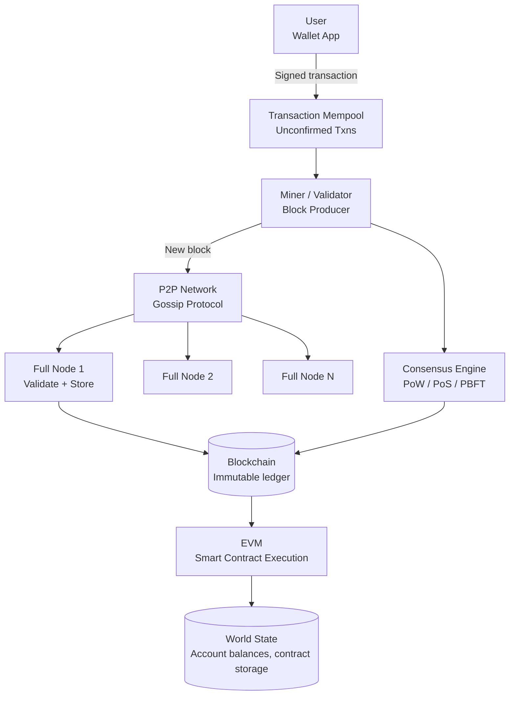
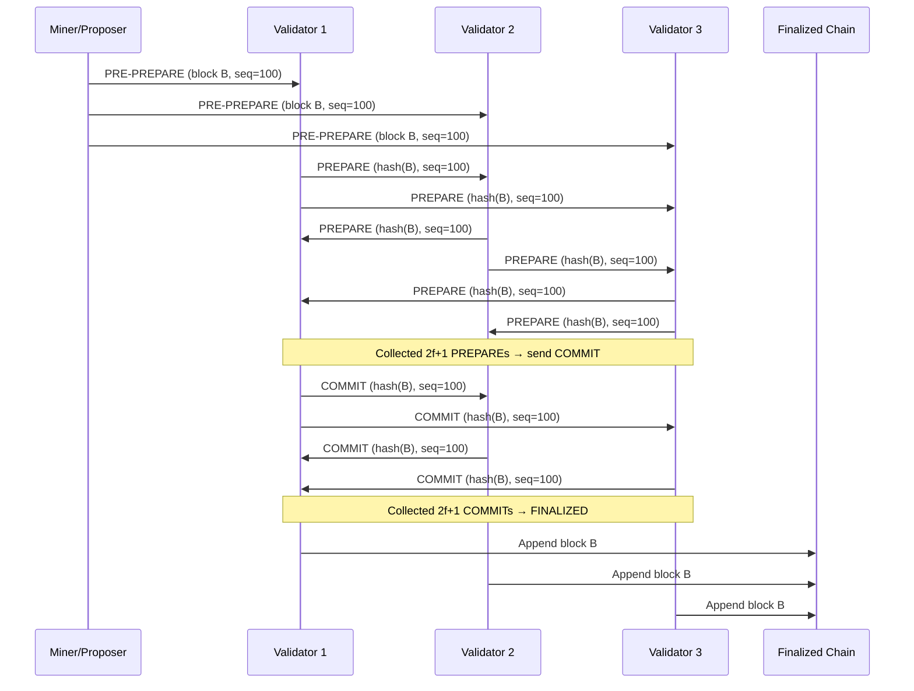
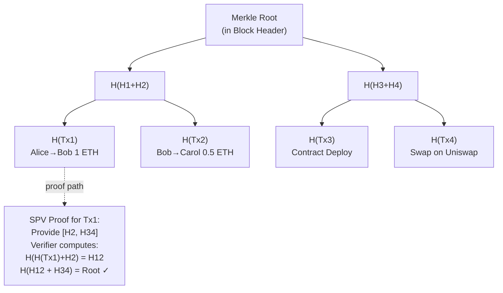

# Design a Blockchain System

**Difficulty**: 🟡 Intermediate
**Reading Time**: ~30 minutes
**The Core Problem**: How do you build a distributed ledger where thousands of untrusted participants agree on a single transaction history — without a central authority — and guarantee that history is tamper-proof?

---

## Table of Contents

1. [Requirements](#1-requirements)
2. [Capacity Estimation](#2-capacity-estimation)
3. [High-Level Architecture](#3-high-level-architecture)
4. [Block Structure](#4-block-structure)
5. [Consensus Mechanisms](#5-consensus-mechanisms)
6. [P2P Network & Block Propagation](#6-p2p-network--block-propagation)
7. [Transaction Model (UTXO vs Account)](#7-transaction-model-utxo-vs-account)
8. [Smart Contract VM](#8-smart-contract-vm)
9. [Key Design Decisions](#9-key-design-decisions)
10. [Interview Questions](#10-interview-questions)
11. [Key Takeaways](#11-key-takeaways)
12. [References](#12-references)

---

## 1. Requirements

### Functional
- Permissionless: anyone can join, submit transactions, and become a validator
- Immutable: once confirmed, transactions cannot be altered
- Decentralized: no single point of control
- Smart contracts: programmable logic executed on-chain
- Transaction finality: users can trust confirmed transactions

### Non-Functional
- **Throughput**: Bitcoin: 7 TPS; Ethereum: 15 TPS; target: 10,000 TPS (modern chains)
- **Finality time**: Bitcoin: ~60 min (6 blocks); Ethereum PoS: ~12 sec
- **Byzantine tolerance**: System continues with up to 33% malicious nodes (for PBFT)
- **Decentralization**: 10,000+ full nodes globally

---

## 2. Capacity Estimation

| Metric | Value (Bitcoin-like) |
|--------|---------------------|
| Block size | 1 MB (Bitcoin) / 2 MB (SegWit) |
| Block time | 10 minutes |
| Transactions per block | ~2,000 |
| TPS | 2,000 / 600s = **~3.3 TPS** |
| Annual chain growth | 1MB × 6 blocks/hr × 8760hr = **52 GB/year** |
| Full node storage (2024) | ~600 GB (Bitcoin full chain) |
| Mempool size (peak) | 100k transactions (~50 MB) |
| P2P network peers | 10,000 full nodes |

---

## 3. High-Level Architecture



---

## 4. Block Structure

### Block Header
```
Block Header (80 bytes in Bitcoin):
  Version:          4 bytes  (protocol version)
  PrevBlockHash:   32 bytes  (SHA-256 hash of previous block header)
  MerkleRoot:      32 bytes  (hash of all transactions in block)
  Timestamp:        4 bytes  (Unix time)
  Difficulty Target:4 bytes  (PoW target)
  Nonce:            4 bytes  (variable, incremented during mining)

Block Hash = SHA-256(SHA-256(header))
Required: block_hash < difficulty_target (for PoW)
```

### Merkle Tree
```
Transactions in block: [T1, T2, T3, T4]

Merkle Tree:
        Root = H(H12 + H34)
       /                  \
  H12 = H(H1+H2)      H34 = H(H3+H4)
  /     \              /        \
H1=H(T1) H2=H(T2)  H3=H(T3)  H4=H(T4)

Benefits:
  - Prove T1 is in block: only need [H2, H34] — O(log N) proof
  - Any tampered transaction changes MerkleRoot → invalidates block hash
  - Lightweight clients (SPV) can verify inclusion without full chain
```

### Chain Immutability
```
Chain is a singly linked list of blocks:
  Block N contains hash of Block N-1

Tampering attack: if attacker modifies Block 100:
  1. Block 100's hash changes
  2. Block 101's PrevBlockHash is now wrong → Block 101 invalid
  3. Must re-mine Blocks 101, 102, ... up to current tip
  4. Must outpace all honest miners (requires > 50% hashrate)
  → Computationally infeasible with PoW
```

---

## 5. Consensus Mechanisms

### Proof of Work (PoW) — Bitcoin
```
Mining: Find nonce such that SHA256(SHA256(header)) < target

Difficulty adjusts every 2016 blocks (~2 weeks) to maintain 10min block time.
51% attack cost: Must control > 50% of global hashrate.
Pros: Proven security (15+ years), Sybil-resistant
Cons: Energy-intensive, low TPS (3–7), 60min finality
```

### Proof of Stake (PoS) — Ethereum 2.0
```
Validators: stake 32 ETH as collateral
Block production: randomly selected proportional to stake
Slashing: misbehaving validators lose their stake

Pros: 99.9% less energy than PoW, faster finality (12 sec)
Cons: Rich-get-richer dynamics, newer (less battle-tested)
TPS: 15–100 on base layer (L2 rollups: 1000–10,000 TPS)
```

### PBFT (Practical Byzantine Fault Tolerance) — Permissioned Blockchains
```
Used by: Hyperledger Fabric, Quorum
Requires known validator set (N validators, tolerates f = (N-1)/3 failures)

3-phase protocol per block:
  1. Pre-prepare: primary sends proposed block to all replicas
  2. Prepare: replicas broadcast "I agree" — wait for 2f+1 agreements
  3. Commit: broadcast "I commit" — once 2f+1 seen → block final

Pros: Immediate finality (no forks), 1000+ TPS, no mining
Cons: Doesn't scale beyond ~100 validators, requires known participants
```

| Mechanism | TPS | Finality | Energy | Decentralization |
|-----------|-----|----------|--------|-----------------|
| PoW | 3–7 | 60 min | Very High | Maximum |
| PoS | 15–100 | 12 sec | Low | High |
| PBFT | 1000+ | Instant | Minimal | Low (known set) |

---

## 6. P2P Network & Block Propagation

```
Network topology: unstructured P2P (each node connects to 8 peers)

Block propagation:
  1. Miner mines new block
  2. Announces to 8 peers: "I have block at height 750,000"
  3. Peers request full block
  4. Each peer validates: check PoW, validate all transactions
  5. If valid: forward to own peers
  6. Propagation to full network: ~2–12 seconds

Compact blocks (BIP 152):
  Optimization: send only short transaction IDs (6 bytes vs full tx)
  Receiver reconstructs from mempool (already has most transactions)
  Bandwidth reduction: 10× (1MB block → 100KB announcement)

Uncle/orphan blocks:
  Two miners find valid blocks simultaneously → temporary fork
  Resolution: longest chain wins
  Shorter-chain blocks = orphaned (their transactions return to mempool)
```

---

## 7. Transaction Model (UTXO vs Account)

### UTXO Model (Bitcoin)
```
No account balance. Instead: unspent transaction outputs (UTXOs).
  UTXO: { txid, output_index, amount, locking_script }

To spend: provide valid unlocking_script (signature)
Transaction: consumes UTXOs as inputs, creates new UTXOs as outputs

Example: Alice sends 1 BTC to Bob
  Input: UTXO₁ (Alice, 1.5 BTC) [unlocked by Alice's signature]
  Output 1: 1.0 BTC → Bob's address
  Output 2: 0.499 BTC → Alice's address (change)
  Miner fee: 0.001 BTC (inputs - outputs)

Pros: Privacy (each transaction creates new addresses), parallelizable verification
Cons: Complex (must track all UTXOs), harder for smart contracts
```

### Account Model (Ethereum)
```
Explicit account state: { address → { balance, nonce, storage, code } }

Transaction:
  From: Alice's address
  To: Bob's address
  Value: 1 ETH
  Nonce: 42 (prevents replay)
  Signature: Alice's ECDSA signature

World state updated atomically: Alice.balance -= 1 ETH, Bob.balance += 1 ETH

Pros: Simple to understand, efficient for smart contracts
Cons: Less privacy, requires nonce tracking to prevent replay
```

---

## 8. Smart Contract VM

```
EVM (Ethereum Virtual Machine):
  Stack-based, deterministic VM
  Executes bytecode (compiled from Solidity/Vyper)
  Every node executes same code → same result → consensus on output

Gas mechanism:
  Every EVM opcode costs gas (prevents infinite loops)
  User sets gasLimit (max gas willing to spend)
  gasPrice (wei per gas unit)
  If execution hits gasLimit → revert (but gas consumed)

Smart contract example (Solidity):
  // Simple escrow
  contract Escrow {
    address payer;
    address payee;
    uint amount;

    function deposit() payable { amount = msg.value; payer = msg.sender; }
    function release(address _payee) { payee = _payee; payee.transfer(amount); }
  }

Execution isolation:
  Contract state persists on-chain (world state trie)
  No external I/O (no network calls — oracles provide external data)
  Deterministic: same block → same execution result across all nodes
```

---

## 9. Key Design Decisions

| Decision | Option A | Option B | Choice & Reason |
|----------|----------|----------|-----------------|
| Permissioned vs permissionless | Permissioned (known validators, PBFT) | Permissionless (open, PoW/PoS) | **Permissioned** for enterprise (Hyperledger); **permissionless** for crypto (Bitcoin/Ethereum) |
| Transaction model | UTXO | Account-based | **UTXO** for currency (privacy, parallelism); **account-based** for smart contracts (simpler state) |
| Consensus | PoW | PoS | **PoS** for new chains — 99.9% less energy, faster finality; PoW only justified by proven security track record |
| Block size | Small (1 MB) | Large (32 MB) | **Small** = more decentralization (home nodes can sync); Large = more TPS but fewer full nodes |
| Layer 2 scaling | None | Rollups / State channels | **Rollups** — process thousands of txns off-chain, post proofs on-chain; 100–1000× TPS gain |

---

## 10. Interview Questions

| Question | Key Answer |
|----------|-----------|
| What prevents someone from altering old transactions? | Merkle root in block header; changing any transaction changes root → changes block hash → invalidates all subsequent blocks |
| What is a 51% attack? | Attacker controls >50% of hashrate → can re-mine chain faster than honest miners → double-spend |
| Why is PoW energy-intensive? | Miners must compute billions of SHA-256 hashes to find valid nonce; difficult by design (Sybil resistance) |
| What is a smart contract oracle problem? | Smart contracts can't access external data (non-deterministic); oracles (Chainlink) provide trusted data feeds |
| What is a hard fork vs soft fork? | Hard fork: protocol change incompatible with old nodes (creates two chains); soft fork: backward-compatible upgrade |

---

## 11. Key Takeaways

- **Merkle tree** is the cryptographic primitive enabling tamper detection — changing any transaction changes the root hash
- **Consensus mechanism is the core design choice** — PoW (energy, proven), PoS (efficient, newer), PBFT (enterprise, known validators)
- **UTXO model** (Bitcoin) and **Account model** (Ethereum) are both valid — choice depends on use case
- **Smart contracts are deterministic programs** — every node executes them and must reach identical results → gas limits prevent infinite loops
- **Layer 2 rollups** solve the blockchain trilemma scalability corner — 100–1000× TPS without sacrificing decentralization

---

## Component Deep Dive 1: Consensus Engine

The consensus engine is the most critical architectural component in any blockchain system. It is the mechanism by which thousands of independent, untrusted nodes agree on which transactions are valid and in what order they were recorded — without any central coordinator.

### How It Works Internally

In **Proof of Work**, each miner independently collects transactions from the mempool, assembles a candidate block, and iterates over a 32-bit nonce field in the block header. For each nonce value, the miner computes `SHA256(SHA256(header))` and checks whether the resulting hash is numerically less than the current difficulty target. At Bitcoin's peak hashrate (~600 EH/s in 2024), the global network collectively performs roughly 600 × 10^18 hashes per second. Finding a valid nonce is probabilistic: expected attempts = 2^256 / target. Difficulty adjusts every 2,016 blocks (approximately two weeks) to keep average block time at 600 seconds regardless of total hashrate.

In **Proof of Stake** (Ethereum post-Merge, September 2022), validators lock 32 ETH in a deposit contract. Each epoch (32 slots × 12 seconds = ~6.4 minutes), the beacon chain pseudo-randomly selects one validator per slot as the block proposer using RANDAO (a commit-reveal randomness scheme). The remaining validators are divided into committees that attest to the proposed block. A block is considered finalized after two consecutive justified checkpoints — known as Casper FFG — which takes approximately 2 epochs (~13 minutes) for economic finality, though the chain advances every 12 seconds.

In **PBFT** (used in Hyperledger Fabric), a known primary node proposes a block. All replicas exchange `PREPARE` and `COMMIT` messages. A block finalizes when `2f + 1` replicas (where f = number of tolerated Byzantine failures) broadcast COMMIT. This produces immediate, deterministic finality with zero forks — but the O(n²) message complexity limits practical validator sets to roughly 20–100 nodes.

### Why Naive Approaches Fail at Scale

A simple "first-write-wins" or "majority vote" approach breaks down when nodes are Byzantine (actively malicious, not just slow). Naive majority vote over a gossip network can be manipulated: a malicious node sends conflicting votes to different partitions simultaneously, causing a fork that never resolves. The Sybil attack — creating thousands of fake identities — makes any vote-based scheme trivially exploitable unless identity has a real cost (electricity for PoW, staked capital for PoS, known identity for PBFT).

### Consensus Internals Sequence Diagram



### Consensus Mechanism Trade-offs

| Approach | Latency | Throughput | Decentralization | Failure Tolerance |
|----------|---------|------------|-----------------|-------------------|
| PoW (Bitcoin) | ~60 min probabilistic finality | 3–7 TPS | Maximum (10,000+ nodes) | 50% hashrate attack cost |
| PoS (Ethereum) | 12 sec slot / 13 min economic finality | 15–100 TPS base layer | High (500,000+ validators) | Slashing deters 33% attack |
| PBFT (Hyperledger) | <1 sec deterministic finality | 1,000–3,000 TPS | Low (20–100 known validators) | Tolerates (N-1)/3 Byzantine |

---

## Component Deep Dive 2: Merkle Tree and State Trie

The Merkle tree is the cryptographic data structure that makes tamper-detection efficient and enables lightweight clients to participate without downloading the full chain.

### Internal Mechanics

Each transaction in a block is hashed individually: `H(Tx) = SHA256(TX_bytes)`. Adjacent hashes are concatenated and hashed again to form parent nodes. This continues until a single root hash remains. The Merkle root is embedded in the block header, so any modification to any transaction — even flipping a single bit — cascades up to produce a completely different root hash, which invalidates the block's PoW.

For **Merkle proofs** (SPV — Simplified Payment Verification, used in Bitcoin mobile wallets): to prove that transaction T is included in a block with 4,096 transactions, a prover needs only 12 hashes (log₂(4096)) rather than all 4,096 transactions. The verifier recomputes the root and compares against the block header.

Ethereum extends this concept to a **Merkle Patricia Trie** — a combination of Patricia (radix) trie and Merkle tree — to store the entire world state (account balances, nonces, contract storage). Three separate tries exist per block:
- **State Trie**: maps 20-byte address → account object `{nonce, balance, storageRoot, codeHash}`
- **Transaction Trie**: all transactions in this block
- **Receipt Trie**: execution receipts (gas used, logs, status)

Each block header contains the roots of all three tries, enabling cryptographic verification of any piece of state at any block height.

### Behavior at 10x Load

At 10x transaction volume (e.g., moving from 15 TPS to 150 TPS), the Merkle tree depth increases by ~3 levels (log₂(10) ≈ 3.3). This means block assembly time grows logarithmically — not linearly — so the structure scales well. However, the state trie becomes the bottleneck: with 10x more accounts and contracts, trie lookups require more disk I/O (each trie node is a separate database read). Ethereum's LevelDB backend historically showed 100–500 ms state lookups under heavy load. This drove the move to SNAP sync (downloading flat key-value snapshots instead of traversing the trie) which reduced sync times from weeks to hours.



---

## Component Deep Dive 3: P2P Network and Transaction Mempool

The mempool (memory pool) is the staging area for unconfirmed transactions on every full node. It is a critical and often underappreciated bottleneck in blockchain systems.

### Technical Decisions

Each full node maintains an in-memory pool of valid, unconfirmed transactions. When a user broadcasts a transaction, it propagates via gossip: a node receives it, validates it (signature check, sufficient balance/UTXO, nonce is sequential), then forwards it to connected peers. Bitcoin's mempool defaults to 300 MB; Ethereum's to 5,000 transactions per account slot. During peak congestion (NFT mints, DeFi liquidations), mempools can hold 150,000+ transactions.

**Fee prioritization**: Miners and validators select transactions by fee density (fee per byte in Bitcoin; gas price × gas limit in Ethereum). This creates a fee market — during congestion, users bid higher fees to get included sooner. In May 2021, Ethereum average gas prices reached 500+ Gwei ($50+ per simple transfer) during peak DeFi activity.

**Mempool eviction**: To prevent memory exhaustion, low-fee transactions are evicted when the mempool is full. Bitcoin Core evicts transactions below a minimum relay fee (currently 1 satoshi/byte). Ethereum clients evict the lowest-nonce pending transactions for an address if the address has too many pending.

**Replace-by-Fee (RBF)**: Bitcoin allows a user to rebroadcast a transaction with a higher fee to replace a stuck low-fee transaction, as long as the new transaction signals RBF and the fee is at least 1 sat/byte higher.

---

## Data Model

### Bitcoin UTXO Set (LevelDB)

```sql
-- Conceptual schema (Bitcoin stores this in LevelDB, not SQL)
-- UTXO Set: only unspent outputs — ~80 million entries as of 2024, ~5 GB RAM
CREATE TABLE utxo_set (
    txid          CHAR(64)  NOT NULL,   -- SHA256d hex (32 bytes)
    output_index  INT       NOT NULL,   -- vout index within transaction
    amount        BIGINT    NOT NULL,   -- satoshis (1 BTC = 100,000,000 sat)
    locking_script BYTEA   NOT NULL,   -- scriptPubKey (P2PKH, P2SH, P2WPKH, etc.)
    block_height  INT       NOT NULL,   -- block where this UTXO was created
    coinbase       BOOLEAN  NOT NULL,   -- true if from coinbase (mining reward)
    PRIMARY KEY (txid, output_index)
);

-- Transaction index (optional, txindex=1 flag)
CREATE TABLE transactions (
    txid          CHAR(64)  PRIMARY KEY,
    block_hash    CHAR(64)  NOT NULL,
    block_height  INT       NOT NULL,
    tx_index      INT       NOT NULL,   -- position within block
    raw_tx        BYTEA     NOT NULL,   -- full serialized transaction
    INDEX idx_block_height (block_height)
);

-- Block headers (stored in flat files + index in LevelDB)
CREATE TABLE block_headers (
    block_hash     CHAR(64) PRIMARY KEY,
    height         INT      NOT NULL UNIQUE,
    version        INT      NOT NULL,
    prev_hash      CHAR(64) NOT NULL,
    merkle_root    CHAR(64) NOT NULL,
    timestamp      INT      NOT NULL,   -- Unix timestamp
    bits           INT      NOT NULL,   -- encoded difficulty target
    nonce          INT      NOT NULL,
    tx_count       INT      NOT NULL,
    INDEX idx_height (height),
    INDEX idx_prev_hash (prev_hash)
);
```

### Ethereum World State (LevelDB / Merkle Patricia Trie)

```json
// Account object stored in state trie (key = keccak256(address))
{
  "address": "0x742d35Cc6634C0532925a3b8D4C9c3d93b2e3A8F",
  "nonce": 142,
  "balance": "1500000000000000000",
  "storage_root": "0x56e81f171bcc55a6ff8345e692c0f86e5b48e01b996cadc001622fb5e363b421",
  "code_hash": "0xc5d2460186f7233c927e7db2dcc703c0e500b653ca82273b7bfad8045d85a470"
}

// ERC-20 token contract storage slot (key = keccak256(address, slot_index))
{
  "slot": "0x000000000000000000000000742d35cc...00000000000000000000000000000000",
  "value": "0x0000000000000000000000000000000000000000000000008ac7230489e80000"
}

// Transaction receipt
{
  "tx_hash": "0x88df016429689c079f3b2f6ad39fa052532c56795b733da78a91ebe6a713944b",
  "block_number": 19500000,
  "transaction_index": 42,
  "from": "0x742d35Cc6634C0532925a3b8D4C9c3d93b2e3A8F",
  "to": "0xA0b86991c6218b36c1d19D4a2e9Eb0cE3606eB48",
  "gas_used": 46109,
  "cumulative_gas_used": 3812954,
  "status": 1,
  "logs": [
    {
      "address": "0xA0b86991c6218b36c1d19D4a2e9Eb0cE3606eB48",
      "topics": [
        "0xddf252ad1be2c89b69c2b068fc378daa952ba7f163c4a11628f55a4df523b3ef",
        "0x000000000000000000000000742d35cc...",
        "0x000000000000000000000000d8da6bf2..."
      ],
      "data": "0x0000000000000000000000000000000000000000000000000000000005F5E100"
    }
  ]
}
```

---

## Scale Bottlenecks

| Traffic Level | Component That Breaks | Symptoms | Mitigation |
|---------------|----------------------|----------|------------|
| 10x baseline (70 TPS on Ethereum) | Mempool congestion | Gas prices spike 5–10x; transactions pending for hours | Fee market auto-adjusts (EIP-1559 base fee burns); users set priority fee |
| 100x baseline (1,500 TPS) | State trie I/O (LevelDB) | Block processing time exceeds slot time (12 sec); nodes fall behind chain tip | SNAP sync; verkle trees (planned Ethereum upgrade reducing proof size 6–8x) |
| 1,000x baseline (15,000 TPS) | P2P gossip bandwidth | 1 MB blocks every 12 sec = ~5 Mbps per peer connection × 50 peers = 250 Mbps per full node; consumer nodes drop off | Erasure coding (Danksharding): split block into 128 shards, each node stores only 2 shards |
| 10,000x baseline | Base-layer consensus itself | Cannot achieve global BFT consensus at this speed without sacrificing decentralization | Layer 2 rollups (ZK-Rollup or Optimistic Rollup): batch 1,000–10,000 txns off-chain, post single proof on-chain |

---

## How Ethereum Built This

Ethereum's transition from Proof of Work to Proof of Stake (The Merge, September 15, 2022) is one of the most significant real-world examples of live blockchain re-architecture at scale — replacing the consensus engine of a $200B+ network without downtime.

**Scale**: At merge time, Ethereum had ~1 million active addresses, processed ~1.2 million transactions per day, and held $60B in DeFi smart contracts. Any consensus failure would have been catastrophic.

**Technology choices**: The beacon chain (Ethereum's PoS coordination layer) launched in December 2020 as a parallel chain. For 21 months it ran alongside the PoW chain, accumulating 425,000+ validators who each deposited 32 ETH (~$40,000 at merge prices). The merge itself was a TTD (Terminal Total Difficulty) trigger — when the PoW chain reached a pre-agreed cumulative difficulty of 58,750,000,000,000,000,000,000, execution clients handed off block production to consensus clients permanently.

**Non-obvious decision — client diversity**: The Ethereum Foundation deliberately maintained 5+ independent consensus client implementations (Prysm, Lighthouse, Teku, Nimbus, Lodestar) and 3+ execution clients (Geth, Nethermind, Besu). The goal: no single client exceeds 33% of validators. A bug in any one client affects at most 33% of stake — not enough to finalize a bad block. This was proven when a Prysm bug in 2023 caused that client subset to miss attestations for ~30 minutes without affecting finality.

**Numbers**: Post-merge, Ethereum energy consumption dropped 99.95% (from ~112 TWh/year to ~0.01 TWh/year). Validator count grew to 900,000+ by 2024, representing ~28 million ETH staked (~23% of total supply). Block time stabilized at exactly 12 seconds (±0 seconds variance vs ±30 seconds variance with PoW).

Source: [Ethereum.org — The Merge](https://ethereum.org/en/roadmap/merge/)

---

## Interview Angle

**What the interviewer is testing:** Whether the candidate understands the fundamental three-way tension in distributed consensus (speed vs. decentralization vs. security — the Blockchain Trilemma), and whether they can reason about concrete failure modes rather than just reciting mechanism names.

**Common mistakes candidates make:**

1. **Treating TPS as the only scalability metric.** Candidates say "just increase block size to get more TPS" without recognizing the second-order effect: larger blocks require more bandwidth per node, which prices out home validators, which reduces decentralization, which weakens the security model. Bitcoin deliberately capped blocks at 1 MB to preserve node count.

2. **Ignoring finality vs. confirmation.** Candidates say "Bitcoin confirms in 10 minutes" but miss that a single confirmation is probabilistically reversible — a 6-confirmation wait (~60 minutes) gives practical finality because reversing requires re-mining 6 blocks faster than the honest chain advances. Ethereum PoS provides economic finality (slashing) rather than probabilistic finality.

3. **Conflating consensus and execution.** Candidates describe consensus as "how transactions are processed." In reality, consensus determines which set of transactions is canonical; execution (EVM, WASM) processes them. These are separate layers — a chain can swap VMs (Ethereum is considering RISC-V for the EVM) without changing consensus.

**The insight that separates good from great answers:** The blockchain trilemma is not solved by base-layer changes alone — it is solved by separating concerns across layers. Base layer optimizes for security and decentralization (slow, 15–100 TPS). Layer 2 rollups (Optimism, Arbitrum, zkSync) inherit the base layer's security guarantees while executing transactions off-chain at 1,000–10,000 TPS and posting compressed proofs on-chain. This is why Ethereum's roadmap explicitly treats L2s as the execution layer, not a workaround.

---

## Key Numbers to Remember

| Metric | Value | Context |
|--------|-------|---------|
| Bitcoin block time | 10 minutes | Difficulty adjusts every 2,016 blocks to maintain this |
| Bitcoin practical finality | 6 blocks (~60 min) | Probability of reversal after 6 blocks: ~0.1% |
| Ethereum slot time (PoS) | 12 seconds | Hard-coded; one block proposed per slot |
| Ethereum economic finality | ~13 minutes | Two justified checkpoints (Casper FFG) |
| Bitcoin full chain size (2024) | ~600 GB | Growing at ~52 GB/year |
| Ethereum state size (2024) | ~1.1 TB (archive) / 200 GB (pruned) | Archive stores every historical state root |
| PBFT max validators | ~100 nodes | O(n²) message complexity beyond this is impractical |
| Ethereum validator count (2024) | 900,000+ | Each stakes 32 ETH; 33% threshold = 288,000 validators |
| L2 rollup TPS (Arbitrum/Optimism) | 2,000–4,000 TPS | With EIP-4844 blobs, targeting 10,000+ TPS |
| Bitcoin global hashrate (2024) | ~600 EH/s | 600 × 10^18 SHA-256 hashes per second |

---

## 📚 Resources & References

| Resource | Type | What You'll Learn |
|----------|------|------------------|
| [Bitcoin Whitepaper — Satoshi Nakamoto](https://bitcoin.org/bitcoin.pdf) | 📚 Book | Original blockchain design, PoW, UTXO model |
| [Ethereum Developer Documentation](https://ethereum.org/en/developers/docs/) | 📚 Book | EVM, smart contracts, account model, PoS |
| [ByteByteGo — Blockchain Explained](https://www.youtube.com/@ByteByteGo) | 📺 YouTube | Visual walkthrough of blockchain concepts |
| [Mastering Bitcoin — Andreas Antonopoulos](https://github.com/bitcoinbook/bitcoinbook) | 📚 Book | Deep technical reference for Bitcoin architecture |
| [Ethereum — The Merge](https://ethereum.org/en/roadmap/merge/) | 📖 Article | Official documentation on the PoW→PoS transition, energy impact, and validator mechanics |
