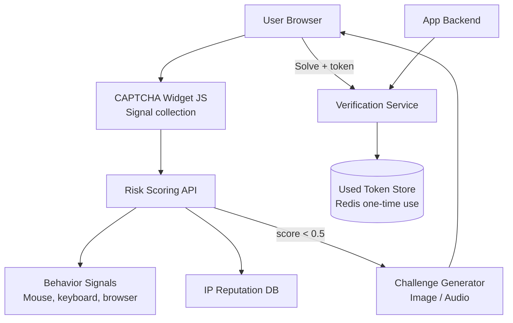

# Design a CAPTCHA System

**Difficulty**: 🟡 Intermediate
**Reading Time**: Coming Soon
**Interview Frequency**: Medium

---

> 🚧 **Full article coming soon.** This stub gives you the essentials to start thinking about this problem.

---

## The Core Problem

Distinguishing humans from bots on login forms without degrading UX — traditional image CAPTCHAs have 95% human solve rate but also 85% bot solve rate (commercial CAPTCHA farms charge $2/1000 solves). Modern risk-scoring approaches analyze behavioral signals (mouse movement, typing cadence, browser fingerprint) to make invisible decisions, showing hard challenges only to high-risk traffic.

## Functional Requirements

- Distinguish human users from automated bots
- Issue a token on successful verification for backend validation
- Support multiple challenge types (image, audio, invisible)
- Risk scoring API that returns confidence score without showing challenge
- Backend token verification endpoint

## Non-Functional Requirements

| Requirement | Target |
|-------------|--------|
| False negative rate | < 5% (bots that pass) |
| False positive rate | < 0.1% (humans shown challenge) |
| Verification latency | < 200ms for backend token check |
| Scale | 1B verification requests/day |

## Back-of-Envelope Estimates

- **Verification rate**: 1B/day ÷ 86,400 = ~11,600 verifications/sec
- **Risk signal collection**: 100 behavioral signals per session × 11,600 sessions/sec = 1.16M signal data points/sec
- **Token storage**: Short-lived tokens (5-minute TTL) × 11,600 new tokens/sec = 3.5M active tokens at any time

## Key Design Decisions

1. **Risk Score over Binary Pass/Fail** — instead of showing a challenge to everyone, collect passive signals (mouse entropy, typing speed, time-on-page, browser fingerprint, IP reputation) and compute 0.0-1.0 score; show challenge only to scores below 0.5; invisible to 99% of real users.
2. **Challenge Token with One-Time Use** — when challenge is passed, issue a signed JWT with (site_key, timestamp, challenge_id); backend verifies signature and marks challenge_id as used; prevents replay of solved challenges.
3. **Accessibility Fallback Chain** — visual challenge → audio challenge (for visually impaired) → SMS verification → email verification; always provide fallback for users who can't solve visual challenges due to disability.

## High-Level Architecture

## Top Interview Questions for This Problem

| Question | Tests |
|----------|-------|
| How would you handle a CAPTCHA farm that employs humans to solve challenges? | Arms race, behavioral signals, rate limiting |
| How do you design a CAPTCHA that works for blind users? | Accessibility, audio challenges, fallback |
| How would you prevent a solved CAPTCHA token from being reused (replay attack)? | One-time use tokens, expiry |

## Related Concepts

- [Identity management for login security context](./identity-management)
- [Rate limiter as complementary defense layer](../05-infrastructure/rate-limiter)

---

*📚 Full deep-dive with multiple approaches, trade-off tables, and pseudocode coming soon.*
