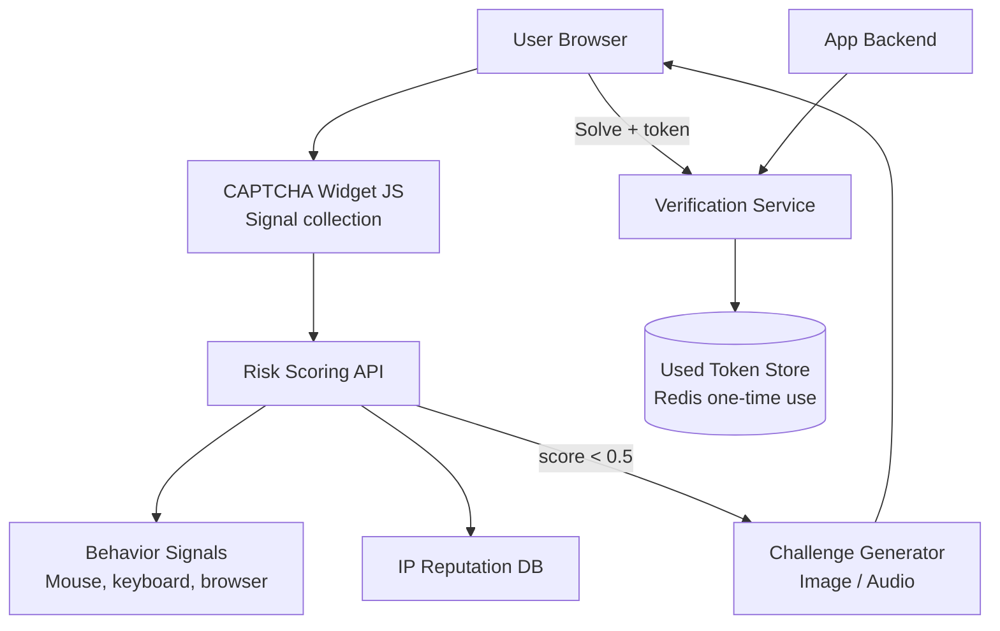
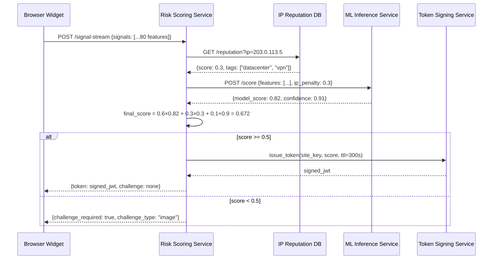
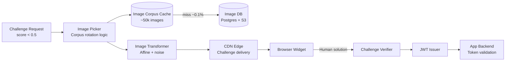
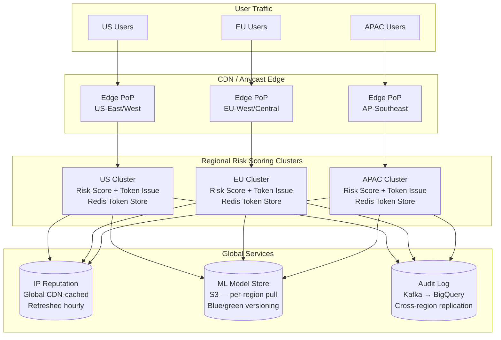

# Design a CAPTCHA System

**Difficulty**: 🟡 Intermediate
**Reading Time**: Coming Soon
**Interview Frequency**: Medium

---

> 🚧 **Full article coming soon.** This stub gives you the essentials to start thinking about this problem.

---

## The Core Problem

Distinguishing humans from bots on login forms without degrading UX — traditional image CAPTCHAs have 95% human solve rate but also 85% bot solve rate (commercial CAPTCHA farms charge $2/1000 solves). Modern risk-scoring approaches analyze behavioral signals (mouse movement, typing cadence, browser fingerprint) to make invisible decisions, showing hard challenges only to high-risk traffic.

## Functional Requirements

- Distinguish human users from automated bots
- Issue a token on successful verification for backend validation
- Support multiple challenge types (image, audio, invisible)
- Risk scoring API that returns confidence score without showing challenge
- Backend token verification endpoint

## Non-Functional Requirements

| Requirement | Target |
|-------------|--------|
| False negative rate | < 5% (bots that pass) |
| False positive rate | < 0.1% (humans shown challenge) |
| Verification latency | < 200ms for backend token check |
| Scale | 1B verification requests/day |

## Back-of-Envelope Estimates

- **Verification rate**: 1B/day ÷ 86,400 = ~11,600 verifications/sec
- **Risk signal collection**: 100 behavioral signals per session × 11,600 sessions/sec = 1.16M signal data points/sec
- **Token storage**: Short-lived tokens (5-minute TTL) × 11,600 new tokens/sec = 3.5M active tokens at any time

## Key Design Decisions

1. **Risk Score over Binary Pass/Fail** — instead of showing a challenge to everyone, collect passive signals (mouse entropy, typing speed, time-on-page, browser fingerprint, IP reputation) and compute 0.0-1.0 score; show challenge only to scores below 0.5; invisible to 99% of real users.
2. **Challenge Token with One-Time Use** — when challenge is passed, issue a signed JWT with (site_key, timestamp, challenge_id); backend verifies signature and marks challenge_id as used; prevents replay of solved challenges.
3. **Accessibility Fallback Chain** — visual challenge → audio challenge (for visually impaired) → SMS verification → email verification; always provide fallback for users who can't solve visual challenges due to disability.

## High-Level Architecture



## Approach Comparison: Classical vs. Risk-Scoring vs. Attestation-Based

| Dimension | Classical CAPTCHA (text/image) | Risk-Scoring (reCAPTCHA v3 style) | Device Attestation (Private Access Tokens) |
|-----------|-------------------------------|-----------------------------------|---------------------------------------------|
| User friction | High — challenge shown to all | Low — challenge shown to < 1% | Zero — no interaction required |
| Bot pass rate | 85% (CAPTCHA farms) | 5–15% (behavioral mimicry) | < 1% (cryptographic proof) |
| Accessibility | Poor (requires vision/hearing) | Excellent (invisible for most) | Excellent (hardware-level, transparent) |
| Privacy | Low concern | Moderate (behavioral profiling) | High (no behavioral data collected) |
| Implementation complexity | Low | High (ML pipeline, signal infra) | Very high (OS/browser ecosystem dependency) |
| Coverage | All browsers/devices | All browsers/devices | Apple devices + Android (Play Integrity) only |
| Defeat mechanism | CAPTCHA farms, ML solvers | Stealth browsers, signal mimicry | Jailbroken/rooted devices (partial bypass) |
| Cost to attacker per bypass | $0.001 (CAPTCHA farm) | $0.01–$0.10 (browser simulation) | $50–$500 (device compromise) |

For most production systems today, a **risk-scoring approach as the primary path with image/audio challenge as fallback** represents the right balance. New greenfield deployments should also integrate device attestation signals as a supplementary trust layer from day one — adding it later requires widget version bumps and coordinated rollout across customer integrations.
 Device attestation should be layered on top as a trust signal where available (reduce challenge rate further for attested Apple/Android devices) without being required (to maintain desktop browser compatibility).

## Top Interview Questions for This Problem

| Question | Tests |
|----------|-------|
| How would you handle a CAPTCHA farm that employs humans to solve challenges? | Arms race, behavioral signals, rate limiting |
| How do you design a CAPTCHA that works for blind users? | Accessibility, audio challenges, fallback |
| How would you prevent a solved CAPTCHA token from being reused (replay attack)? | One-time use tokens, expiry |

## Related Concepts

- [Identity management for login security context](./identity-management)
- [Rate limiter as complementary defense layer](../05-infrastructure/rate-limiter)

---

## Component Deep Dive 1: Risk Scoring Engine

The risk scoring engine is the most critical architectural component in a modern CAPTCHA system. It is responsible for passively collecting behavioral signals from the browser, aggregating them into a scalar risk score between 0.0 and 1.0, and deciding in real time whether to (a) pass the user transparently, (b) show a friction challenge, or (c) hard-block the request. A naive binary pass/fail model fails at scale for a fundamental reason: by 2024 commercial CAPTCHA-solving farms (Anti-CAPTCHA, 2captcha) charge $0.50–$2 per 1,000 solved challenges, meaning any challenge-only gate can be bypassed for fractions of a cent per attempt. The risk engine has to make it economically unviable to automate by producing a high-entropy signal that bots cannot predict.

**How it works internally.** When the CAPTCHA JavaScript widget loads on the page, it begins collecting a stream of behavioral micro-signals: mouse trajectory entropy (Shannon entropy of dx/dy vectors), keystroke inter-arrival timing (a human shows 80–200ms variance; scripts show < 10ms variance), scroll velocity and depth, device sensor data (accelerometer on mobile), browser fingerprint (canvas hash, WebGL renderer string, installed fonts via CSS enumeration), and session context (referring URL, interaction time before first input). These signals — roughly 80–120 per session — are serialized and sent to the risk scoring API endpoint over an encrypted channel every 500ms during an active session.

The scoring service feeds this signal vector into a gradient-boosted ensemble (XGBoost or LightGBM in Google's reCAPTCHA v3 case) trained on labeled bot-vs-human traffic. The model outputs a probability estimate. The system also consults a real-time IP reputation lookup: known Tor exit nodes, datacenter CIDR ranges (AWS, GCP, Azure), and IP addresses seen in recent abuse patterns get a flat penalty applied to the score. Final score = `0.6 × model_score + 0.3 × ip_reputation + 0.1 × device_trust`.

**Why naive thresholding fails.** A single global threshold (e.g., score < 0.5 → show challenge) is brittle. Bot operators run adversarial probing: they make thousands of requests, observing which ones pass, and train their own models to mimic the signal distribution that produces high scores. A better approach is **adaptive thresholds per site key** calibrated to each customer's traffic baseline, plus **score poisoning detection** (if a site suddenly sees 95% of requests scoring above 0.9, that's an anomaly warranting review, not a success signal).

**Sequence diagram — risk scoring flow:**



**Implementation options for the ML inference layer:**

| Approach | Latency | Throughput | Trade-off |
|----------|---------|------------|-----------|
| In-process XGBoost (C++ via JNI) | 0.5–2ms | 50k req/sec per node | Low latency; model updates require redeploy |
| gRPC sidecar inference server (TF Serving) | 3–8ms | 20k req/sec per node | Fast model hot-reload; adds network hop |
| Async batch scoring (Kafka → consumer) | 100–500ms | 500k req/sec aggregate | Highest throughput; too slow for real-time gate |

For a CAPTCHA system where the verdict must be returned within the page-load interaction, the in-process or gRPC sidecar approaches are the only viable options. Google reCAPTCHA v3 uses a variant of the in-process approach with periodic model reloads via a blue-green model versioning system.

---

## Component Deep Dive 2: Challenge Generation and Token Issuance

When the risk engine scores a session below the challenge threshold, the challenge generator must produce a task that is easy for humans but computationally expensive or perceptually difficult for automated solvers. The design of this component determines the upper bound on bot pass rate.

**Internal mechanics.** Image challenges (the classic "select all traffic lights") are drawn from a curated image corpus where images are transformed at request time: random affine distortions, color channel shifts, JPEG compression artifacts, and partial occlusions are layered on top of the base image. The goal is to defeat ML classifiers trained on clean reference images. Each image is tagged with a ground-truth label and a served-count; images served more than 5,000 times are retired to prevent training-set leakage to adversaries who use the challenge images themselves as training data for their solvers.

Audio challenges (for visually impaired users) are generated by TTS engines with random background noise, pitch shifting (±20%), and variable playback speed. Human success rate on audio challenges is approximately 70% versus 95% for image; audio challenges should only be offered as an accessibility fallback, not as the primary path.

**Token design.** Upon successful challenge completion, the server issues a one-time use signed token:
- Structure: `JWT(header.payload.sig)` where payload = `{site_key, jti (UUID v4), iat, exp: iat+300, risk_score, challenge_id}`
- Signature: HMAC-SHA256 using a server-side secret rotated every 24 hours
- The `jti` is inserted into a Redis SET with TTL = 300 seconds at issuance
- Backend verification atomically checks signature validity AND removes the `jti` from Redis; if `jti` is missing, token has been replayed

**Scale behavior at 10x load.** At baseline 11,600 verifications/sec, the challenge generator is comfortably within a single-region deployment. At 116,000/sec (10x), the image corpus query becomes a hot-spot: if images are served from a single RDS instance, read IOPS saturates around 50,000/sec at typical image metadata row sizes. Mitigation: cache the image corpus in a read-through Redis cluster; images change only when retired, so a TTL of 1 hour and 99.9% cache hit rate is achievable, dropping DB load to ~120 reads/sec even at 10x scale.



---

## Component Deep Dive 3: Token Store and Replay Prevention

The token store is the consistency-critical layer: it must guarantee that a solved CAPTCHA token is used exactly once (preventing replay attacks where a bot farm distributes a single solved token across many requests). Consistency requirements here are strict — using Redis with `SET NX` (set-if-not-exists) semantics on the `jti` provides atomic check-and-mark in a single round trip.

**Specific technical decisions:**

1. **Redis SETNX vs. Lua script**: A plain `GET` followed by `DELETE` is not atomic — a race between two concurrent verification requests for the same token could both see "token exists" before either deletes it. Using a Lua script (`if redis.call('GET', jti) then redis.call('DEL', jti) return 1 else return 0 end`) or the `SET key value NX GET` pattern (Redis 7.0+) ensures atomicity within a single Redis slot.

2. **TTL alignment**: Tokens have a 5-minute (300s) lifetime. The Redis key TTL is set to 360s (20% buffer) to handle clock skew between token issuer and verifier. After 360s, the key expires automatically — no background cleanup job needed.

3. **Cluster sharding strategy**: At 11,600 verifications/sec with each verification requiring one `SET NX` and (on success) one `DEL`, peak Redis write throughput is ~23,200 writes/sec. A single Redis node can handle 100k–200k ops/sec, so this fits comfortably on one node. For 10x scale, horizontal sharding by `site_key` prefix ensures deterministic routing: tokens for a given site always go to the same shard, keeping cross-shard coordination at zero.

4. **Persistence**: Token store data has a maximum horizon of 5 minutes. Redis AOF persistence is unnecessary here — if a node fails, all tokens issued in the last 5 minutes are invalidated; users simply retry their action and get a new challenge. The tradeoff (brief inconvenience on node failure) is acceptable because token store data has zero long-term value.

---

## Data Model

```sql
-- Challenge corpus table (PostgreSQL)
CREATE TABLE challenge_images (
    image_id        UUID PRIMARY KEY DEFAULT gen_random_uuid(),
    s3_key          TEXT NOT NULL,                    -- e.g. "corpus/traffic-light/tl_00423.jpg"
    category        TEXT NOT NULL,                    -- "traffic_light", "crosswalk", "bicycle"
    label_hash      TEXT NOT NULL,                    -- SHA256 of correct tile selection bitmask
    distortion_seed INTEGER NOT NULL DEFAULT 0,       -- deterministic transform seed
    serve_count     INTEGER NOT NULL DEFAULT 0,
    retired_at      TIMESTAMPTZ,
    created_at      TIMESTAMPTZ NOT NULL DEFAULT NOW()
);

CREATE INDEX idx_challenge_images_category_active
    ON challenge_images (category)
    WHERE retired_at IS NULL;

-- Site key registration table
CREATE TABLE site_keys (
    site_key        UUID PRIMARY KEY DEFAULT gen_random_uuid(),
    owner_id        UUID NOT NULL REFERENCES accounts(account_id),
    domain_allowlist TEXT[] NOT NULL,                 -- ["example.com", "*.example.com"]
    score_threshold FLOAT NOT NULL DEFAULT 0.5,       -- site-specific threshold
    plan            TEXT NOT NULL DEFAULT 'free',
    created_at      TIMESTAMPTZ NOT NULL DEFAULT NOW(),
    rotated_at      TIMESTAMPTZ
);

-- Verification audit log (append-only, partitioned by day)
CREATE TABLE verification_events (
    event_id        UUID NOT NULL DEFAULT gen_random_uuid(),
    site_key        UUID NOT NULL,
    jti             UUID NOT NULL,                    -- JWT ID (one-time use)
    risk_score      FLOAT NOT NULL,
    challenge_shown BOOLEAN NOT NULL,
    challenge_type  TEXT,                             -- NULL if invisible pass
    outcome         TEXT NOT NULL,                    -- "pass", "fail", "expired", "replay"
    client_ip       INET NOT NULL,
    user_agent_hash TEXT NOT NULL,                    -- SHA256(user-agent) for privacy
    created_at      TIMESTAMPTZ NOT NULL DEFAULT NOW()
) PARTITION BY RANGE (created_at);

CREATE INDEX idx_verification_events_site_key_created
    ON verification_events (site_key, created_at DESC);

-- Redis key patterns (not SQL, shown for completeness)
-- Used tokens:   token:{jti}  → "1"   TTL=360s
-- IP reputation: ip:{sha256(ip)}  → {score, tags, ttl}   TTL=3600s
-- Score cache:   session:{fp_hash} → {score, signals_ts}  TTL=120s
```

---

## Scale Bottlenecks

| Traffic Level | Component That Breaks | Symptoms | Mitigation |
|---------------|----------------------|----------|------------|
| 10x baseline (~116k verifications/sec) | Image corpus Postgres reads | Read IOPS ceiling (~50k/sec), p99 latency > 100ms on corpus lookups | Redis cache for image metadata; CDN pre-warm challenge images |
| 10x baseline | ML inference sidecar | CPU saturation on feature encoding; p99 scoring > 50ms | Horizontal scale inference pods; reduce feature vector to top-40 by importance |
| 100x baseline (~1.16M/sec) | Risk Scoring API (stateless compute) | Request queuing, timeout cascade | Auto-scaling stateless scoring pods; pre-score sessions at first byte load |
| 100x baseline | Redis token store | Write throughput ceiling (~200k ops/sec single shard) | Cluster mode with site_key-based sharding; 4–8 shards handles 1M ops/sec |
| 1000x baseline (~11.6M/sec) | IP Reputation DB | Point-lookup latency at 100M+ IP records | Bloom filter as first-pass (known-clean IPs skip full lookup); in-memory CIDR trie for datacenter ranges |
| 1000x baseline | Signal streaming ingest | 1.16B signal data points/sec overwhelms single Kafka cluster | Regional Kafka deployments; drop non-critical signals (scroll depth) under load; lossy aggregation |

---

## How Google Built reCAPTCHA v3

Google reCAPTCHA v3, launched in 2018, is the most widely deployed CAPTCHA system in the world, integrated on over 4 million websites and processing roughly **500 million verification requests per day** (approximately 5,800/sec average, with peaks exceeding 50,000/sec during major events like bot-driven ticket purchases).

**Technology choices.** The risk scoring model is a gradient-boosted ensemble running in Google's internal Borg cluster, served via a C++ inference binary colocated with the scoring API. Behavioral signals are collected by a ~130KB JavaScript snippet that runs entirely client-side. The snippet uses WebGL fingerprinting, battery API (where available), and interaction timings serialized into a compact binary format before transmission — minimizing payload to under 2KB per signal batch.

**The non-obvious architectural decision.** Google decided to make the score **site-specific, not global**. The same user interacting with site A and site B gets two independent scores calibrated to each site's traffic baseline. This was non-obvious because a global user reputation score would seem more powerful. The reason for site-scoping: aggregating behavioral data across sites at Google's scale raised significant regulatory concerns under GDPR and CCPA, and cross-site tracking would require explicit consent. By scoping scores to individual site keys, each site's data is treated as isolated, allowing Google to offer reCAPTCHA under a single privacy policy that declares only first-party use from each site's perspective.

**Specific numbers from public sources.** At Google I/O 2019, Google disclosed that reCAPTCHA v3 reduces visible CAPTCHA challenges by **99.9%** for low-risk users. The token TTL is 120 seconds (published in their docs). The system uses a two-minute rolling window for IP rate limiting: more than 10 failed verifications from the same IP in 120 seconds triggers a penalty score applied to subsequent requests from that IP.

**Source**: [Google Developers — reCAPTCHA v3 documentation](https://developers.google.com/recaptcha/docs/v3), Google I/O 2019 — "Fighting spam with reCAPTCHA".

---

## Interview Angle

**What the interviewer is testing:** Whether you understand that modern CAPTCHA design is a risk-scoring problem, not a challenge-response problem — and whether you can reason about adversarial economics (CAPTCHA farms, ML-based solvers) when designing a system that must be tamper-resistant.

**Common mistakes candidates make:**

1. **Designing purely challenge-based systems.** Proposing "show a distorted image to everyone" ignores that CAPTCHA farms can solve image challenges for $0.001 each, making challenge-only gates economically trivial to bypass. The correct answer introduces passive risk scoring so challenges are shown only to < 1% of traffic.

2. **Treating the token as single-use without atomic enforcement.** Candidates often say "store used tokens in a DB and check before accepting," but fail to specify atomic check-and-delete. A non-atomic GET-then-DELETE allows replay under concurrent requests — a real attack vector that Redis SETNX or Lua scripts solve correctly.

3. **Ignoring accessibility.** Proposing a system with only visual challenges will fail WCAG 2.1 accessibility requirements and exclude blind or low-vision users. The correct design includes a fallback chain: image → audio → SMS/email verification.

**The insight that separates good from great answers:** The best candidates recognize that CAPTCHA is fundamentally an **arms race with economic dynamics**. The system doesn't need to be unbeatable — it needs to make the cost of bypassing it exceed the value of what's being protected. A risk-scoring approach that raises the marginal cost of each bot request from $0.001 (challenge farm) to $0.01–$0.10 (behavioral mimicry requiring expensive simulation) is sufficient to deter most attackers, because most attacks are economically motivated. Designing for "cost asymmetry" — cheap for legitimate users, expensive for attackers — is the core architectural insight.

---

## Key Numbers to Remember

| Metric | Value | Context |
|--------|-------|---------|
| CAPTCHA farm solve rate | 85% on image challenges | Commercial farms like Anti-CAPTCHA at $2/1,000 solves |
| Human solve rate (image) | 95% | Baseline; audio is ~70% |
| reCAPTCHA v3 invisible rate | 99.9% of users see no challenge | Per Google I/O 2019 disclosure |
| Behavioral signal count per session | 80–120 features | Mouse, keyboard, scroll, fingerprint |
| Token TTL (reCAPTCHA v3) | 120 seconds | Published in Google reCAPTCHA v3 docs |
| Scale of reCAPTCHA v3 | ~500M verifications/day | ~5,800/sec average, peaks > 50,000/sec |
| Redis SETNX throughput (single node) | ~100k–200k ops/sec | Baseline for token replay store sizing |
| Challenge image retirement threshold | ~5,000 serves per image | Prevents training-set leakage to solver ML models |
| False positive rate target | < 0.1% | Humans blocked — too high destroys UX |
| False negative rate target | < 5% | Bots passing — above this, rate limiting must compensate |

---

## Adversarial Arms Race: CAPTCHA vs. Bot Evolution

Understanding the adversarial history is critical for designing a CAPTCHA system that remains useful over time. The CAPTCHA problem is not a static security problem — it is an ongoing evolutionary arms race where each defense generates a counter-attack, which generates a new defense.

### Generation 1: Distorted Text (1997–2012)

The original CAPTCHA (Completely Automated Public Turing test to tell Computers and Humans Apart) presented distorted text strings. Humans can recognize characters despite rotation, overlap, and noise; OCR systems of the era could not. This worked until neural networks trained on labeled CAPTCHA corpora achieved > 99% solve rates. By 2012, Google's own research team demonstrated that the reCAPTCHA text challenges could be solved by ML with 99.8% accuracy — the same accuracy as humans. Google deprecated text-based reCAPTCHA entirely in 2014.

**Lesson**: Any challenge solvable by pattern recognition on fixed visual features will eventually be defeated by neural networks given enough labeled examples.

### Generation 2: Image Classification (2014–2018)

reCAPTCHA v2 ("click all traffic lights") replaced text with semantically richer image grids. The hypothesis was that understanding scene context — distinguishing a traffic light from a stop sign in a real photograph — required higher-order visual reasoning that would take longer to automate. This bought approximately 3–4 years. By 2017–2018, computer vision models (ResNet-50, EfficientNet) pre-trained on ImageNet could solve image CAPTCHAs with 70–88% accuracy, and adversarial CAPTCHA-specific training datasets were being sold commercially. A 2018 academic paper from Columbia University demonstrated 85% solve rate on reCAPTCHA v2 using Google's own Cloud Vision API.

**Lesson**: Any challenge based on a well-defined visual classification task will be defeated as soon as the task is representable as a standard ML benchmark.

### Generation 3: Behavioral Signals + Risk Scoring (2018–present)

reCAPTCHA v3 and Cloudflare Turnstile moved the detection signal from "can you solve this challenge" to "does your behavior look human." This is fundamentally harder to defeat because:

1. The signal distribution shifts per-site and per-time-window — bots cannot train a single model to mimic all sites
2. Behavioral mimicry requires simulating a full browser with realistic interaction timing — expensive compared to calling an API
3. The model is continuously retrained on labeled traffic, so yesterday's mimicry pattern is detected tomorrow

Current state of the arms race: sophisticated bot frameworks (Puppeteer Extra, Playwright with stealth plugins, FraudFox VM) attempt to mimic human behavioral signals by injecting randomized mouse movement scripts and timing delays. These add $0.01–$0.05 per bot session in compute cost. At sufficient scale, this economic friction is meaningful.

### Generation 4: Device Attestation (emerging, 2023–present)

The next frontier is cryptographic device attestation: Apple's Private Access Tokens (used in Safari + iCloud), Android's Play Integrity API, and browser-based WebAuthn attestation allow a device to prove to the server "this request originated from a non-jailbroken Apple/Android device running legitimate app code" without revealing identity. Cloudflare Turnstile integrates Private Access Tokens: on supported Apple devices, Turnstile can issue a CAPTCHA bypass entirely based on device attestation, reducing false positives for Apple users to near zero. The limitation is that attestation requires a cooperating ecosystem (Apple, Google) — it doesn't cover desktop browsers from arbitrary manufacturers.

---

## Deployment Architecture: Multi-Region Considerations

At 1B verifications/day distributed globally, a single-region deployment creates unacceptable latency for users in distant regions (a risk scoring call from Sydney to a US-East data center adds 250ms of round-trip before the page can proceed). The deployment model must be multi-region.



**Token verification cross-region problem.** When a user completes a CAPTCHA challenge in one region, their app backend (potentially in a different region) needs to verify the token. The naive approach — each region has its own Redis token store — creates a problem: a token issued in the EU cluster cannot be verified by a US cluster because the `jti` is not present in the US Redis. Two solutions:

1. **Token self-verification via signature** (Google's approach): The token is a signed JWT. The backend verifies the signature using the public key (rotated daily, distributed globally via KMS). The `jti` is still stored in the issuing region's Redis to prevent replay, but the backend does a regional lookup based on an embedded `region` claim in the JWT. The issuing region claim routes the replay check to the correct token store.

2. **Global token store** (simpler but more latency): A single globally distributed Redis cluster (e.g., Redis Enterprise Active-Active geo-replication) holds all tokens. All verification requests query this global store. Latency overhead: 20–80ms for cross-region replication, acceptable if verification latency SLA is 200ms.

**GDPR implication for EU deployments.** EU traffic behavioral signals must not be stored in US data centers without adequate transfer mechanisms. In practice, this means EU cluster signal data must remain within EU-West/Central regions. The ML model trained on EU data must be a separate model instance or a federated learning approach where gradients (not raw signals) are shared globally for joint model improvement. This is a real architectural complexity that Google and Cloudflare both navigate in their deployments.

---

## Monitoring and Abuse Detection

A CAPTCHA system without a monitoring plane is blind to its own failure modes. The following metrics are the minimum required operational instrumentation:

| Metric | Alert Threshold | What It Indicates |
|--------|----------------|-------------------|
| Bot pass rate (false negative) | > 5% over 5-minute window | Model degradation or new evasion technique |
| Human challenge rate (false positive) | > 1% of total traffic | Overly aggressive scoring; UX degradation |
| Token replay attempts | > 10/sec per site_key | Active replay attack in progress |
| Signal batch latency (p99) | > 100ms | Network congestion or widget JS performance regression |
| ML inference latency (p99) | > 20ms | Inference service under load; may need scaling |
| Image corpus serve diversity | Gini coefficient > 0.8 | Too few images serving too much traffic — leakage risk |
| Challenge solve rate drop | > 20% below 7-day baseline | Possible bot farm solving with lower accuracy OR legitimate users encountering UX friction |

**Anomaly detection for bot coordinated campaigns.** A sudden spike in verification requests from a narrow IP CIDR range with homogeneous browser fingerprints (all same Canvas hash, same WebGL renderer) is a clear bot campaign signature. An automated alerting rule watching for: `(unique_canvas_hashes / total_requests) < 0.01` within a 1-minute window per site_key fires a campaign alert, automatically reducing the score threshold for that site_key from 0.5 to 0.7 (show challenges to more traffic) until the anomaly subsides.

---

## API Design: Public Interface

The CAPTCHA system exposes three primary APIs:

### 1. Widget Signal Submission (Browser → Risk Service)

```
POST /v3/signal
Authorization: Bearer {site_key}
Content-Type: application/octet-stream  (compressed binary signal batch)

Response 200:
{
  "session_id": "sess_a1b2c3d4",
  "score": 0.72,
  "action": "none",              // "none" | "challenge" | "block"
  "challenge_type": null         // null | "image" | "audio"
}
```

### 2. Token Verification (App Backend → Verify Service)

```
POST /v3/verify
Content-Type: application/json

{
  "token": "<signed_jwt>",
  "site_secret": "<server_side_secret>",
  "expected_action": "login",    // optional — validate action claim in token
  "remote_ip": "203.0.113.5"    // optional — additional IP check
}

Response 200:
{
  "success": true,
  "score": 0.72,
  "action": "login",
  "challenge_ts": "2024-01-15T10:30:00Z",
  "hostname": "example.com",
  "error_codes": []
}

Response 200 (failure):
{
  "success": false,
  "error_codes": ["timeout-or-duplicate"]   // "missing-input-secret",
                                             // "invalid-input-secret",
                                             // "missing-input-response",
                                             // "invalid-input-response",
                                             // "bad-request",
                                             // "timeout-or-duplicate"
}
```

The error codes mirror reCAPTCHA v3's published API — `timeout-or-duplicate` covers both expired tokens (TTL exceeded) and replay attempts (jti already consumed). Distinguishing these is intentionally avoided to prevent attackers from knowing whether their replay was detected.

### 3. Site Key Management (Admin → Registration Service)

```
POST /v3/sites
{
  "domain_allowlist": ["example.com", "*.example.com"],
  "score_threshold": 0.5,
  "plan": "enterprise"
}

Response 201:
{
  "site_key": "6LeIxAcT...public",      // embedded in frontend JS
  "site_secret": "6LeIxAcT...secret",   // kept server-side only
  "created_at": "2024-01-15T10:00:00Z"
}
```

The site_key is public (embedded in HTML/JS). The site_secret is used only in server-to-server token verification calls and must never appear in client-side code. This separation mirrors how OAuth2 client_id vs. client_secret work.

---

## Common Failure Modes and Mitigations

### Failure Mode 1: Score Poisoning via Headless Browser Mimicry

**What happens:** Sophisticated bot operators use Puppeteer with the `puppeteer-extra-plugin-stealth` library, which patches dozens of JavaScript properties that normally distinguish a headless Chrome from a real browser (`navigator.webdriver`, `chrome.runtime`, `permissions.query` behavior, WebGL fingerprint). When these patches are applied, the browser fingerprint component of the risk score returns a high trust value. If the attacker also adds randomized mouse movements via `@ghost-cursor/playwright`, the behavioral signal component is also partially spoofed.

**Detection:** The arms race here is micro-timing. Stealth plugins inject fake human-like mouse movements, but these movements are generated by a random walk algorithm that produces statistically uniform entropy across time bins. Real human mouse movements show **bursty entropy** — low entropy during idle periods, high entropy during intentional interactions. A Kolmogorov-Smirnov test comparing the observed mouse entropy distribution to the expected human distribution can detect programmatic injection with 80–90% sensitivity even against well-tuned stealth configurations.

**Mitigation:** Ensemble signals that are difficult to fake simultaneously. Headless environments reveal themselves through combinations: DevTools protocol latency patterns, sub-millisecond `requestAnimationFrame` timing consistency (real browsers have jitter from OS scheduling; headless VMs do not), and absence of audio context latency distribution (real devices have hardware latency fingerprints; virtual audio drivers produce perfectly uniform timing).

### Failure Mode 2: Token Replay via Man-in-the-Middle on Customer Backend

**What happens:** The CAPTCHA token is designed to be one-time-use, but the one-time enforcement happens at the CAPTCHA verification service, not at the customer's app backend. A bug in the customer's integration — checking `success: true` without checking `timeout-or-duplicate` in error_codes, or caching the verification response for performance — can allow replayed tokens to be accepted at the application layer even after the CAPTCHA service has rejected them.

**Detection and mitigation:** The CAPTCHA system can't fully prevent this at the customer layer — it's a client integration error. However, the monitoring plane can detect anomalies: if the same `jti` is submitted to the verification endpoint more than once within its TTL window, flag it as a replay attempt AND log it in the audit table. Rate-limit that site_key's verification requests for 60 seconds (reducing replay amplification). Publish SDK client libraries that correctly handle error_codes to minimize the chance of buggy integration.

### Failure Mode 3: Audio Challenge Abuse for Accessibility Bypass

**What happens:** Audio challenges exist as an accessibility fallback, but the audio challenge solve rate for speech-to-text APIs (Google Cloud Speech-to-Text, AWS Transcribe) is 85–95% on typical CAPTCHA audio. Bots detect when a visual challenge is served, immediately request the audio alternative, run STT on the audio track, and submit the transcribed text. This converts the audio fallback into a reliably solvable path for bots.

**Mitigation:** Audio challenge abuse can be rate-limited by session: allow at most 2 audio challenge requests per session before requiring the visual path or escalating to SMS verification. More importantly, audio challenges should have non-trivial noise characteristics — overlapping voices, random speaker gender and accent variation, distortions that degrade STT accuracy while remaining human-comprehensible. Additionally, track the audio fallback rate per site: if > 10% of users on a given site request audio challenges (a strong anomaly — typical rate is < 0.5%), flag for manual review.

### Failure Mode 4: Challenge Image Training Data Leakage

**What happens:** Operators of CAPTCHA-solving farms collect the challenge images shown to them over millions of verification attempts. Once they have 10,000+ labeled examples of a given image category (traffic lights, fire hydrants), they train a classifier on that specific image corpus, achieving > 90% accuracy. The attack surface is the image corpus itself — the finite set of challenge images that the CAPTCHA system serves.

**Mitigation:** The `serve_count` field in the `challenge_images` table is critical. Retiring images after 5,000 serves forces attackers to continuously re-collect new examples. Additionally, the per-request distortion (affine transforms, color shifts) applied at serve time should use a seed derived from `image_id + request_id` — making each served variant unique even for the same source image. A corpus of 50,000 images retired at 5,000 serves creates a rolling window where the effective corpus at any given time is a random 10% of the total, making it hard to collect enough labeled examples of any single image before it is retired.

---

## Extension: Fraud Signal Correlation

A mature CAPTCHA system does not exist in isolation — it feeds into a broader fraud signal platform. The risk score computed during CAPTCHA verification is one of many signals that a fraud prevention layer aggregates:

| Signal Source | Signal Type | Value Added |
|---------------|-------------|-------------|
| CAPTCHA risk score | Behavioral/ML | 0.0–1.0 bot probability at interaction time |
| Account creation velocity | Rate signal | New accounts from same device/IP in 24h window |
| Login failure history | Auth signal | Failed auth attempts → credential stuffing indicator |
| Order velocity | Business signal | N orders in 1h from same payment method |
| Device fingerprint history | Identity signal | Device seen in prior fraudulent sessions |
| Email domain reputation | Identity signal | Disposable email domains (mailinator, tempmail) |

A CAPTCHA score below 0.3 combined with an account creation velocity above 5 new accounts per hour from the same device fingerprint is a strong indicator of account farming, even if each individual CAPTCHA challenge is solved by a human (CAPTCHA farms). This cross-signal correlation is what distinguishes a CAPTCHA system from a fraud prevention platform — the CAPTCHA is the data collection mechanism, while the fraud layer is where actionable decisions are made.

**Integration pattern:** The CAPTCHA service publishes risk events to a Kafka topic (`captcha.risk.events`). The fraud platform consumes this topic alongside other event streams, computes composite fraud scores, and feeds decisions back via a shared Redis cache keyed by `device_fingerprint_hash`. The CAPTCHA service can optionally read this cache to apply a fraud-platform-derived penalty to the CAPTCHA score, closing the feedback loop.

---

## Accessibility and Legal Compliance

CAPTCHA accessibility is not optional — it is legally required in many jurisdictions. The Web Content Accessibility Guidelines (WCAG) 2.1, incorporated by reference into the EU Web Accessibility Directive and the US Section 508 standards, explicitly call out CAPTCHA:

> **WCAG 1.1.1 Non-text Content (Level A):** If a CAPTCHA is provided, at minimum an alternative form of CAPTCHA using a different modality must be provided (e.g., audio for a visual CAPTCHA).

> **WCAG 1.1.1 Note:** CAPTCHAs that rely solely on visual perception are barriers for users who are blind, have low vision, or have cognitive disabilities affecting visual processing.

**Design implications:**

1. **Minimum: provide two modalities.** Any system with only a visual challenge fails WCAG 1.1.1 at Level A (the minimum required for legal compliance). The audio fallback is not optional.

2. **Invisible CAPTCHA is the best accessibility outcome.** A risk-scoring system that passes 99.9% of users without any visible challenge is inherently more accessible than any challenge-based system. Users with screen readers, keyboard-only navigation, or motor impairments are not asked to perform visual or auditory tasks.

3. **Challenge solve rate varies significantly across disability groups.** Testing with actual users with visual impairments has shown audio challenge solve rates as low as 40–50% when audio challenges have heavy noise applied. The accessibility vs. security tension here is real: noise that defeats speech-to-text APIs also degrades human solve rates for users with hearing impairments. A tiered approach — moderate noise for first attempt, heavier noise only after STT-detection signals — balances these.

4. **SMS/email fallback has its own accessibility requirements.** SMS requires a mobile phone (not universal); email requires checking another application. Both increase friction. They should be positioned as last-resort options, not the primary accessibility path.

5. **Cognitive load guidelines.** For users with cognitive disabilities (dyslexia, ADHD), image classification tasks (select all traffic lights across 9 tiles) can be more burdensome than they appear. Time limits on challenge completion should be generous (60+ seconds rather than 30), with clear feedback on which tiles were incorrect without forcing a full restart.

**Operational note:** Some jurisdictions have begun imposing fines specifically for inaccessible CAPTCHA implementations (several EU accessibility enforcement actions have included CAPTCHA as a violation). Budget for regular accessibility auditing of the challenge widget, not just the product pages surrounding it.

**Summary of required accessibility features by compliance level:**

| Requirement | WCAG Level | Concrete Implementation |
|-------------|------------|------------------------|
| At least two challenge modalities | A (minimum) | Visual image + audio fallback |
| No time limit, or time limit is adjustable | AA | Challenge timeout >= 60s; extend on request |
| Error feedback without full reset | AA | Show which tiles are wrong, allow re-selection |
| SMS/email as tertiary fallback | Best practice | For users who cannot complete audio challenge |
| Invisible CAPTCHA as primary path | Best practice | Risk scoring — no challenge shown to >= 99% of users |

---

## 📚 Resources & References

| Resource | Type | What You'll Learn |
|----------|------|------------------|
| [ByteByteGo — Design a CAPTCHA System](https://www.youtube.com/@ByteByteGo) | 📺 YouTube | Search "CAPTCHA design" — bot detection, challenge types, accessibility |
| [Google reCAPTCHA v3 Architecture](https://developers.google.com/recaptcha/docs/v3) | 📚 Docs | Risk score-based bot detection without user friction |
| [Cloudflare Turnstile: CAPTCHA Alternative](https://blog.cloudflare.com/turnstile-ga/) | 📖 Blog | How Cloudflare built a privacy-preserving CAPTCHA replacement |
| [hCaptcha Architecture and Privacy Design](https://www.hcaptcha.com/post/hcaptcha-now-the-largest-independent-captcha-service) | 📖 Blog | Alternative CAPTCHA with privacy-first approach and revenue sharing |
| [Machine Learning for Bot Detection](https://research.google/pubs/pub36834/) | 📖 Blog | How ML models replace traditional CAPTCHA challenges for risk scoring |
