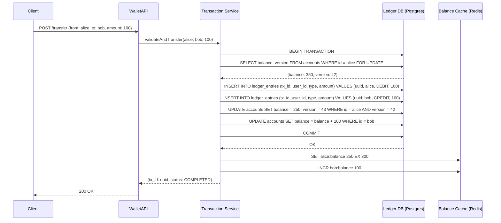
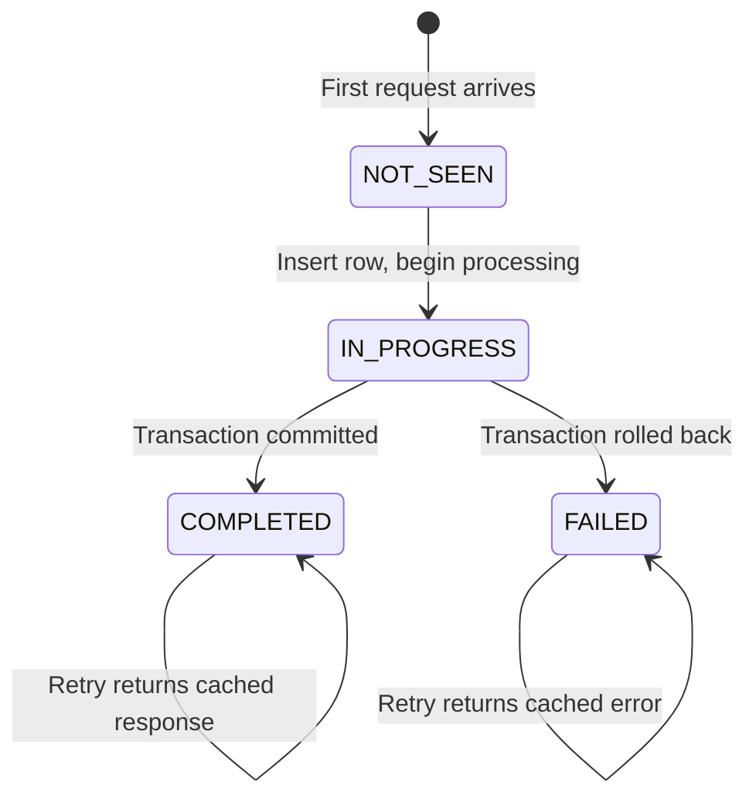
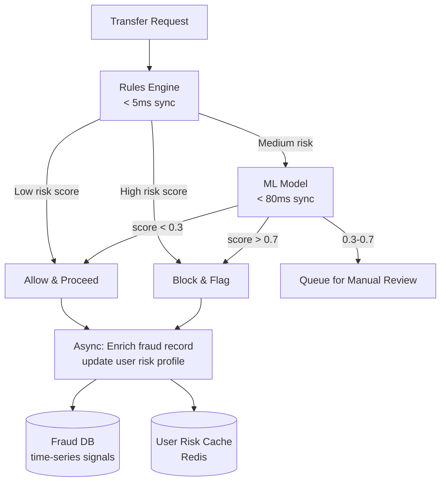
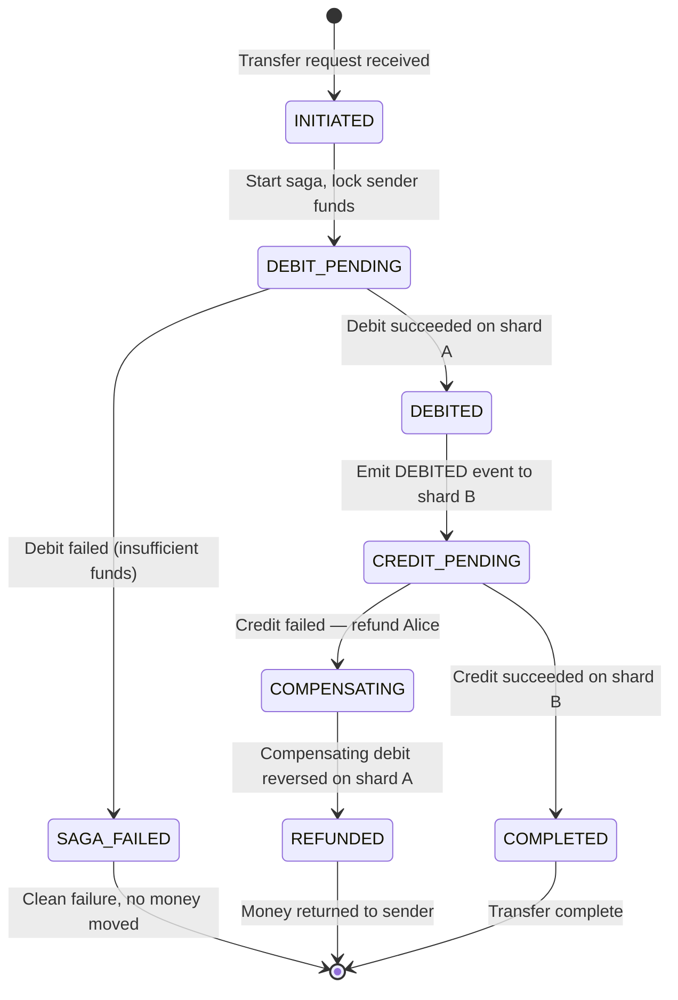

# Design a Digital Wallet (PayPal/Venmo)

**Difficulty**: 🔴 Advanced
**Reading Time**: Coming Soon
**Interview Frequency**: High

---

> 🚧 **Full article coming soon.** This stub gives you the essentials to start thinking about this problem.

---

## The Core Problem

Managing balances for 100 million users with ACID guarantees on transfers means every "send $100 from Alice to Bob" must be atomic — Alice's balance decreases AND Bob's balance increases in the same transaction, or neither happens. In a distributed system where Alice and Bob might be on different database shards, achieving this atomicity without 2-phase commit is the central challenge.

## Functional Requirements

- Send money between users instantly
- Receive money and see real-time balance update
- Link bank accounts and credit cards for top-up
- Transaction history with filtering
- Request money from other users

## Non-Functional Requirements

| Requirement | Target |
|-------------|--------|
| Consistency | ACID: balance never incorrect |
| Availability | 99.99% (52 min/year) |
| Transfer latency | < 500ms for peer-to-peer |
| Scale | 100M users, 10M transactions/day |

## Back-of-Envelope Estimates

- **Transaction rate**: 10M transactions/day ÷ 86,400 = ~116 tx/sec (peak 10x = 1,160 tx/sec)
- **Ledger entries**: 116 tx/sec × 2 entries per tx (debit + credit) = 232 ledger writes/sec
- **Balance computation**: Current balance = SUM of all ledger entries for user — too slow; maintain running balance column updated atomically with each transaction

## Key Design Decisions

1. **Double-Entry Bookkeeping** — every transaction creates two ledger entries: debit (sender -$100) and credit (recipient +$100); ledger is append-only; balance = SUM(credits) - SUM(debits); immutable audit trail for every dollar movement.
2. **Same-Shard Transactions for Common Case** — co-locate users on same shard by user_id hash; most peer-to-peer payments happen between users on same shard; enabling single-DB transaction for 95% of transfers; cross-shard uses Saga.
3. **Optimistic Locking on Balance** — read balance + version; verify sufficient funds; write new balance with version+1; if version conflict (concurrent tx), retry; prevents negative balance without holding long DB locks.

## High-Level Architecture

```mermaid
graph TD
    User[User App] --> WalletAPI[Wallet API]
    WalletAPI --> FraudCheck[Fraud Check Service]
    FraudCheck --> TxSvc[Transaction Service]
    TxSvc --> LedgerDB[(Ledger DB\nPostgres — append-only)]
    TxSvc --> BalanceDB[(Balance Cache\nMaterialized View]
    TxSvc --> EventBus[Event Bus\nNotifications]
    EventBus --> NotifySvc[Notification Service]
    TxSvc --> AuditLog[(Audit Log\nImmutable S3)]
```

## Top Interview Questions for This Problem

| Question | Tests |
|----------|-------|
| How do you transfer money between users on different database shards atomically? | Distributed transactions, Saga pattern |
| How do you prevent a user from spending the same balance twice (race condition)? | Optimistic locking, serialization |
| How would you reconstruct a user's balance from scratch if the balance column is corrupted? | Double-entry ledger, event sourcing |

## Related Concepts

- [Online payment service for card processing layer](./online-payment)
- [Payment gateway for bank connectivity](./payment-gateway)

---

## Component Deep Dive 1: Ledger Service and Double-Entry Bookkeeping

The Ledger Service is the heart of any digital wallet — it is the system of record for every dollar that has ever moved. Every balance claim must be derivable from the ledger; if the balance table is lost or corrupted, a full replay of all ledger entries must reproduce the exact same balances. This constraint forces you into double-entry bookkeeping, the same accounting model banks have used for 700 years.

**How it works internally:** Every money movement creates exactly two ledger entries. When Alice sends $100 to Bob, the ledger receives one DEBIT entry (Alice, -$100, tx_id: 1234) and one CREDIT entry (Bob, +$100, tx_id: 1234). Both entries share the same `transaction_id`, making them atomically linkable. The invariant is: for any completed transaction, SUM(all credits) == SUM(all debits). If this invariant ever fails, money has been created or destroyed — a catastrophic bug. Ledger entries are **append-only and immutable** — no UPDATE or DELETE is ever issued on the ledger table.

**Why naive approaches fail at scale:** A naive implementation stores just a `balance` column per user and does `UPDATE accounts SET balance = balance - 100 WHERE user_id = alice`. This breaks in three ways: (1) no audit trail — you cannot reconstruct how Alice reached her current balance; (2) race conditions — two concurrent transfers both read Alice's balance of $200 and both proceed, resulting in -$0 instead of $100; (3) no way to dispute chargebacks — you cannot prove to a regulator what happened when.

**Ledger write flow (sequence diagram):**



**Ledger implementation trade-offs:**

| Approach | Latency | Throughput | Trade-off |
|----------|---------|------------|-----------|
| Single Postgres (running balance + ledger entries) | 5–15ms | ~5,000 tx/sec per node | Simple; correct; breaks at 500k DAU without sharding |
| Sharded Postgres (user_id-based) | 5–20ms | ~50,000 tx/sec (10 shards) | Cross-shard transfers need Saga; 95% of transfers stay local |
| CockroachDB (distributed SQL) | 10–50ms | ~20,000 tx/sec | Geo-distributed ACID; higher latency than single-node Postgres |

PayPal runs sharded Postgres with a dedicated "Ledger DB" cluster separate from account metadata — the write throughput on the ledger table is far higher than on user profile data.

---

## Component Deep Dive 2: Idempotency Layer

Every payment API must be idempotent. Mobile networks drop requests; clients retry; servers crash mid-response. Without idempotency, a client retrying "Send $50" could charge Alice twice. The idempotency layer ensures that no matter how many times a request is retried with the same idempotency key, the financial effect happens exactly once.

**How it works internally:** Each incoming transfer request carries a client-generated `idempotency_key` (a UUID). Before processing, the Transaction Service does a lookup against an `idempotency_table`. If no row exists, it inserts a row with status `IN_PROGRESS` and proceeds with the transfer. If a row exists with status `COMPLETED`, it returns the cached response immediately without re-executing the transfer. If a row exists with status `IN_PROGRESS`, the server is still processing — return 202 Accepted and let the client poll.

**Scale behavior at 10x load:** At 1,160 tx/sec, idempotency lookups become a hot-path read. The idempotency table needs an index on `idempotency_key` (unique). At 10x, 11,600 tx/sec means ~11,600 idempotency reads/sec. A single Postgres instance handles this fine (Postgres can do 50k–100k indexed point reads/sec). However, at 100x (116,000 tx/sec), you need to front the idempotency table with Redis: `SET idempotency:{key} {response_json} NX EX 86400`. The `NX` flag (set only if not exists) provides atomic test-and-set semantics, and expiry prevents unbounded growth.

**Idempotency state machine:**



| Approach | Storage | Atomicity | Trade-off |
|----------|---------|-----------|-----------|
| Postgres idempotency table | Durable | INSERT … ON CONFLICT | Disk I/O on every request; no cross-DC |
| Redis NX + TTL | In-memory, volatile | Atomic SETNX | Fast; data lost on Redis restart; need TTL management |
| Redis NX + async persist to Postgres | Hybrid | Redis-first | Best performance + durability; operational complexity |

Stripe's published architecture uses a database-backed idempotency store with per-key locking — they accept the latency cost for absolute durability guarantees on financial operations.

---

## Component Deep Dive 3: Balance Consistency and Optimistic Locking

The balance column is a denormalized summary of the ledger — it exists only for fast reads ("What is Alice's current balance?") without summing 50,000 ledger rows. Because it is derived, it must stay strictly in sync with the ledger. This sync is maintained through **optimistic locking with versioned writes**.

**How it works:** Every `accounts` row carries a `version` integer. To debit Alice's balance: (1) `SELECT balance, version FROM accounts WHERE id = alice`; (2) verify `balance >= amount`; (3) `UPDATE accounts SET balance = balance - amount, version = version + 1 WHERE id = alice AND version = {old_version}`. If the UPDATE affects 0 rows, a concurrent transaction changed Alice's balance — retry from step 1. The balance update and the ledger entry insert are wrapped in the same database transaction, so they are atomic: the balance is never updated without a corresponding ledger entry.

**Why this beats pessimistic locking:** `SELECT FOR UPDATE` holds a row lock for the full duration of the transaction. At 1,000 concurrent transfers, this creates a lock queue on Alice's row if she is a busy sender (e.g., a business account). Optimistic locking avoids this — contention only triggers retries, not blocking. For typical wallet users (1–5 concurrent transfers), retry rate under optimistic locking is under 0.1%.

**Cross-shard consistency:** When Alice and Bob are on different shards, a single DB transaction is impossible. The Saga pattern is used: (1) debit Alice on shard A; (2) emit event `ALICE_DEBITED`; (3) credit Bob on shard B; (4) if step 3 fails, emit compensating event `CREDIT_ALICE` to refund. The saga coordinator persists its state so it can resume after crash. This means cross-shard transfers are **eventually consistent** — Bob's balance updates within 200–500ms of Alice's debit, not instantaneously.

---

## Data Model

```sql
-- Core accounts table: one row per wallet user
CREATE TABLE accounts (
    account_id      UUID PRIMARY KEY DEFAULT gen_random_uuid(),
    user_id         UUID NOT NULL UNIQUE,
    currency        CHAR(3) NOT NULL DEFAULT 'USD',  -- ISO 4217
    balance         NUMERIC(19, 4) NOT NULL DEFAULT 0.0000,
    version         BIGINT NOT NULL DEFAULT 0,        -- optimistic lock
    status          VARCHAR(20) NOT NULL DEFAULT 'ACTIVE', -- ACTIVE | FROZEN | CLOSED
    created_at      TIMESTAMPTZ NOT NULL DEFAULT NOW(),
    updated_at      TIMESTAMPTZ NOT NULL DEFAULT NOW(),
    CONSTRAINT balance_non_negative CHECK (balance >= 0)
);

CREATE INDEX idx_accounts_user_id ON accounts(user_id);

-- Ledger: append-only, never updated or deleted
CREATE TABLE ledger_entries (
    entry_id        UUID PRIMARY KEY DEFAULT gen_random_uuid(),
    transaction_id  UUID NOT NULL,      -- links debit + credit pair
    account_id      UUID NOT NULL REFERENCES accounts(account_id),
    entry_type      VARCHAR(6) NOT NULL,  -- 'DEBIT' or 'CREDIT'
    amount          NUMERIC(19, 4) NOT NULL CHECK (amount > 0),
    balance_after   NUMERIC(19, 4) NOT NULL,  -- running balance snapshot
    currency        CHAR(3) NOT NULL,
    description     TEXT,
    created_at      TIMESTAMPTZ NOT NULL DEFAULT NOW()
);

CREATE INDEX idx_ledger_account_created ON ledger_entries(account_id, created_at DESC);
CREATE INDEX idx_ledger_transaction_id  ON ledger_entries(transaction_id);

-- Transactions: one row per logical money movement
CREATE TABLE transactions (
    transaction_id  UUID PRIMARY KEY DEFAULT gen_random_uuid(),
    sender_id       UUID NOT NULL REFERENCES accounts(account_id),
    recipient_id    UUID NOT NULL REFERENCES accounts(account_id),
    amount          NUMERIC(19, 4) NOT NULL CHECK (amount > 0),
    currency        CHAR(3) NOT NULL,
    status          VARCHAR(20) NOT NULL DEFAULT 'PENDING',
    -- PENDING | PROCESSING | COMPLETED | FAILED | REVERSED
    idempotency_key VARCHAR(255) UNIQUE,   -- client-supplied dedup key
    fraud_score     SMALLINT,              -- 0-100; >80 = manual review
    created_at      TIMESTAMPTZ NOT NULL DEFAULT NOW(),
    completed_at    TIMESTAMPTZ
);

CREATE INDEX idx_transactions_sender    ON transactions(sender_id, created_at DESC);
CREATE INDEX idx_transactions_recipient ON transactions(recipient_id, created_at DESC);
CREATE INDEX idx_transactions_idem_key  ON transactions(idempotency_key);

-- Idempotency store: prevents duplicate processing
CREATE TABLE idempotency_records (
    idempotency_key VARCHAR(255) PRIMARY KEY,
    response_body   JSONB,
    status          VARCHAR(20) NOT NULL,  -- IN_PROGRESS | COMPLETED | FAILED
    created_at      TIMESTAMPTZ NOT NULL DEFAULT NOW(),
    expires_at      TIMESTAMPTZ NOT NULL DEFAULT NOW() + INTERVAL '24 hours'
);
```

**Key design decisions in the schema:**
- `NUMERIC(19,4)` stores up to $999,999,999,999,999.9999 — never use FLOAT for money (floating-point rounding errors corrupt balances).
- `balance_after` on each ledger entry enables O(1) balance reconstruction at any point in time without summing all entries.
- `CHECK (balance >= 0)` as a DB-level constraint is the last line of defense — the application should enforce this earlier, but the constraint prevents any code path from creating negative balances.
- `idempotency_key` is stored on the transaction so it can be looked up by clients without a separate table scan.

---

## Observability: Critical Metrics to Instrument

A digital wallet must alert before customers notice problems. The following metrics represent the minimum viable observability setup:

| Metric | Type | Alert Threshold | Why It Matters |
|--------|------|-----------------|----------------|
| `transfer.latency.p99` | Histogram | > 800ms | SLA breach indicator |
| `transfer.success_rate` | Gauge | < 99.5% over 1 min | Payment failures affect revenue |
| `idempotency.collision_rate` | Counter | > 0.1% of requests | Indicates client retry storm |
| `saga.in_flight_count` | Gauge | > 500 | Saga backlog growing — downstream shard slow |
| `fraud.block_rate` | Gauge | > 5% or < 0.01% | Either too aggressive or too permissive |
| `balance.reconciliation.drift_count` | Counter | Any non-zero | Balance/ledger mismatch — data integrity issue |
| `ledger.write.latency.p99` | Histogram | > 50ms | DB under pressure |
| `optimistic_lock.retry_rate` | Counter | > 1% of writes | Contention on hot accounts |

**Distributed tracing** is mandatory: each transfer request carries a `trace_id` propagated through all service calls (WalletAPI → Transaction Service → Ledger DB → Fraud Service). When a transfer fails, the on-call engineer queries Jaeger with the `trace_id` and sees the full call graph with latencies at each hop. Without this, debugging cross-shard saga failures becomes guesswork.

---

## Scale Bottlenecks

| Traffic Level | Component That Breaks | Symptoms | Mitigation |
|---------------|----------------------|----------|------------|
| 10x baseline (~1,160 tx/sec) | Single Postgres ledger writer | Write latency climbs from 10ms → 80ms; connection pool exhaustion | Read replicas for balance reads; PgBouncer connection pooling; separate ledger and accounts tables |
| 100x baseline (~11,600 tx/sec) | Postgres write throughput ceiling | Replication lag >1s; WAL write contention; pg_locks table hot | Shard by `account_id` across 10–20 Postgres nodes; route transactions by shard |
| 100x baseline (~11,600 tx/sec) | Fraud check service latency | P99 fraud latency >200ms; async queue backup | Move fraud check to async post-authorization; allow low-risk txns to proceed; flag high-risk for manual review |
| 1000x baseline (~116,000 tx/sec) | Cross-shard saga coordinator | Saga log becomes write bottleneck; in-flight sagas accumulate | Partition saga log by shard pair; use Kafka topics per shard pair; event-driven saga execution |
| 1000x baseline (~116,000 tx/sec) | Balance cache (Redis) | Cache invalidation storms on popular accounts (merchants) | Per-account Redis sharding; hot-account detection + dedicated Redis slots; write-through cache with DB as source of truth |

---

## API Design and Failure Handling

A well-designed wallet API makes idempotency easy for clients and impossible to misuse. Every mutating endpoint must require an idempotency key and return deterministic responses on retry.

### Core Transfer Endpoint

```
POST /v1/transfers
Headers:
  Authorization: Bearer {jwt}
  Idempotency-Key: {client-uuid}   // required; 400 if missing
  Content-Type: application/json

Request body:
{
  "sender_wallet_id": "wlt_alice_7f3a",
  "recipient_wallet_id": "wlt_bob_2c9d",
  "amount": "50.00",
  "currency": "USD",
  "description": "Dinner split",
  "metadata": {
    "client_ref": "order_789"
  }
}

Response 201 Created (first call):
{
  "transaction_id": "txn_xk9m2p",
  "status": "COMPLETED",
  "sender_balance_after": "300.00",
  "completed_at": "2026-06-01T14:23:11Z"
}

Response 200 OK (retry with same Idempotency-Key):
{
  "transaction_id": "txn_xk9m2p",   // same as first
  "status": "COMPLETED",             // cached response
  "sender_balance_after": "300.00",
  "completed_at": "2026-06-01T14:23:11Z"
}
```

**Error responses must be idempotency-aware:**
- `409 CONFLICT` — idempotency key already used with different request body (client bug)
- `422 INSUFFICIENT_FUNDS` — deterministic; retry will never succeed, return same error
- `503 PROCESSING` — saga in-flight; client should poll `/v1/transfers/{tx_id}` with exponential backoff
- `400 DUPLICATE_TRANSFER` — same amount to same recipient within 60 seconds (safety check)

### Balance Read Endpoint

```
GET /v1/wallets/{wallet_id}/balance
Headers:
  Authorization: Bearer {jwt}
  Cache-Control: no-cache   // client opt-in to bypass cache

Response 200:
{
  "wallet_id": "wlt_alice_7f3a",
  "available_balance": "300.00",
  "pending_balance": "0.00",   // funds held for in-flight sagas
  "currency": "USD",
  "as_of": "2026-06-01T14:23:15Z"
}
```

**Pending balance** is critical for cross-shard transfers — Alice's balance should show $250 as "available" immediately when the debit is applied, even if Bob's credit is still in-flight. Without pending balance, Alice could initiate another transfer during the saga and over-spend.

---

## Reconciliation and Audit

Every financial system will diverge from its expected state over time — hardware failures, software bugs, operator errors, and edge cases in distributed systems all cause drift. A reconciliation job is the safety net that detects and fixes discrepancies before they become customer-visible problems.

### Nightly Balance Reconciliation

```python
# Pseudocode — runs nightly as a batch job
def reconcile_balances(shard_id: int):
    """
    For every account on this shard:
    1. Sum all ledger entries to compute expected balance
    2. Compare to stored balance column
    3. Alert if they diverge by more than $0.0001
    """
    discrepancies = []

    # Efficient: use a window function to get running sum at latest entry
    query = """
        SELECT 
            a.account_id,
            a.balance AS stored_balance,
            COALESCE(SUM(
                CASE e.entry_type 
                    WHEN 'CREDIT' THEN e.amount 
                    WHEN 'DEBIT' THEN -e.amount 
                END
            ), 0) AS computed_balance
        FROM accounts a
        LEFT JOIN ledger_entries e ON e.account_id = a.account_id
        WHERE a.shard_id = %(shard_id)s
        GROUP BY a.account_id, a.balance
        HAVING ABS(a.balance - SUM(...)) > 0.0001
    """
    
    for row in db.execute(query, shard_id=shard_id):
        discrepancies.append({
            "account_id": row.account_id,
            "stored": row.stored_balance,
            "computed": row.computed_balance,
            "delta": row.stored_balance - row.computed_balance
        })
        alert_on_call(row)   # page on-call engineer immediately
    
    return discrepancies
```

### Ledger Invariant Checks

Beyond balance reconciliation, run these checks hourly:

| Check | SQL | Alert Threshold |
|-------|-----|-----------------|
| Orphaned ledger entries | `SELECT tx_id FROM ledger_entries GROUP BY tx_id HAVING COUNT(*) != 2` | Any result |
| Debit without matching credit | `SELECT tx_id WHERE SUM(CASE WHEN type='DEBIT' THEN amount ELSE -amount END) != 0` | Any result |
| Completed txn with wrong entry count | `JOIN transactions WHERE status='COMPLETED' AND entry_count != 2` | Any result |
| Negative balance (should be caught by constraint) | `SELECT account_id FROM accounts WHERE balance < 0` | Any result |

### Audit Log Export

Every ledger entry and transaction event is streamed to an immutable audit log in S3 using a Change Data Capture (CDC) pipeline (Debezium → Kafka → S3). The S3 objects are:
- Encrypted with AES-256 using AWS KMS customer-managed keys
- Object-locked (WORM — Write Once Read Many) for 7 years per financial regulations
- Queryable via AWS Athena for ad-hoc regulatory investigations

This separation means the audit log survives even a total loss of the primary database — investigators can reconstruct every transaction from the S3 audit trail.

---

## Security and Compliance Considerations

Digital wallets are PCI DSS Level 1 environments — the highest compliance tier. Key requirements:

**PCI DSS controls that affect architecture:**
- Card numbers (PANs) must be tokenized before storage — never stored in plaintext in the ledger or transaction tables. Use a tokenization vault (e.g., VGS — Very Good Security) that returns a token like `tok_4111xxxx1111` that can be stored safely.
- All data in transit encrypted with TLS 1.2+; all data at rest encrypted (AES-256 or equivalent).
- Access to cardholder data restricted to the minimum necessary personnel; all access logged.
- Quarterly penetration testing; annual PCI DSS audit by a Qualified Security Assessor (QSA).

**Authentication and authorization:**
- Wallet API uses short-lived JWTs (15 min expiry) signed with RSA-256. Refresh tokens (7-day TTL) are stored server-side in a Redis cache with revocation support.
- High-value transfers (> $1,000) require step-up authentication: the user must re-enter PIN or pass biometric check within the last 5 minutes.
- All API calls are rate-limited per user: 60 transfer attempts/minute; 5 failed authentication attempts triggers a 15-minute account lock.

**Regulatory requirements:**
- FinCEN/KYC: Users transferring > $10,000/day require identity verification (SSN, government ID). Suspicious Activity Reports (SARs) filed automatically for patterns matching FinCEN typologies.
- OFAC screening: Every new recipient is screened against OFAC's SDN (Specially Designated Nationals) list in real-time. Blocked if match found.
- GDPR/CCPA: Balance and transaction data is classified as financial PII. Deletion requests must anonymize transaction records (replace user_id with pseudonym) while preserving the ledger integrity for audit purposes.

---

## How PayPal Built This

Fraud detection in a digital wallet must be **fast** (< 100ms added latency) and **accurate** (low false-positive rate, or legitimate users get blocked). The design challenge is that fraud signals are inherently async and multi-dimensional — a single transfer looks fine in isolation, but becomes suspicious when combined with device fingerprint, velocity, geolocation, and recipient risk score.

**Two-tier fraud architecture:**



**Tier 1 — Rules Engine (< 5ms):** Hard rules applied synchronously before the ledger write. Examples:
- `IF transfer_amount > 5000 AND account_age < 7 days THEN BLOCK`
- `IF same recipient within 60 seconds AND amount identical THEN BLOCK` (duplicate detection)
- `IF country_mismatch(IP, registered_country) AND amount > 500 THEN FLAG`
- `IF daily_transfer_volume > account_limit THEN BLOCK`

Rules are stored in a feature flag system (LaunchDarkly or similar) — no code deploy needed to add/tune rules.

**Tier 2 — ML Model (< 80ms):** For medium-risk transfers, a gradient-boosted model (XGBoost) scores the transfer using 50+ features: user velocity (transfers in last 1h/6h/24h), recipient risk score, device fingerprint match, time-of-day pattern deviation, and graph features (is recipient a known fraud account?). Model is pre-loaded in memory per service instance — no external call needed for inference.

**Velocity limiting** is implemented with Redis sorted sets:
```
ZADD user:{id}:transfers {timestamp} {tx_id}
ZREMRANGEBYSCORE user:{id}:transfers 0 {now - 3600}
ZCARD user:{id}:transfers   // count of transfers in last 1 hour
```
This O(log N) operation runs in < 1ms and gives per-user rate limiting without touching the primary DB.

---

## Cross-Shard Saga Pattern

For the ~5% of transfers where sender and recipient are on different database shards, a distributed Saga replaces the single-DB ACID transaction. The Saga coordinator is a lightweight state machine — each step emits an event, and compensating transactions undo completed steps if a later step fails.

**Saga state machine for cross-shard transfer:**



**Saga coordinator implementation details:**

- The saga state is persisted to a `saga_log` table (Postgres) before each step. If the coordinator crashes mid-saga, a recovery job reads `saga_log` entries with status `IN_PROGRESS` and resumes from the last completed step.
- Steps are idempotent: the DEBIT step carries the `saga_id` as the idempotency key. If the debit is replayed, the idempotency check prevents double-debit.
- The saga coordinator uses **Kafka** as the event bus between shards — `topic: shard-A-events`, `topic: shard-B-events`. Kafka's at-least-once delivery combined with idempotent consumers guarantees exactly-once financial effect.
- Compensation timeout: if shard B does not respond within 5 seconds, the saga coordinator automatically triggers compensation. This prevents "limbo" states where Alice's funds are debited but the saga is waiting indefinitely.

**Saga vs 2-Phase Commit trade-off:**

| Approach | Consistency | Availability | Latency | Complexity |
|----------|-------------|--------------|---------|------------|
| 2-Phase Commit (2PC) | Strong (all-or-nothing) | Low (coordinator SPOF; locks held) | 50–200ms | Low (protocol handled by DB) |
| Saga (choreography) | Eventual (compensating) | High (no locks) | 200–500ms end-to-end | Medium (need compensation logic) |
| Saga (orchestration) | Eventual (compensating) | High | 200–500ms | High (coordinator service required) |

For a digital wallet, orchestrated Saga is the right choice: the coordinator maintains a clear audit trail of every saga state transition, making debugging and customer support possible. Choreography-based sagas (services reacting to events without a central coordinator) are harder to debug when a transfer is stuck.

---

## How PayPal Built This

PayPal processes over **25 billion transactions per year** (roughly 800 transactions/sec sustained, with peaks above 5,000 tx/sec on Cyber Monday). Their engineering blog post ["Scaling PayPal's Internal Ledger System"](https://medium.com/paypal-tech/scaling-paypal-s-internal-ledger-system-for-high-throughput-6b6edf9cb6d4) describes a specific architectural evolution that is directly relevant.

**Technology choices:** PayPal runs a dedicated Ledger Service backed by a sharded MySQL cluster (not Postgres). Sharding key is `account_id mod N` where N is the number of shards. Ledger entries are written synchronously in the same DB transaction as the balance update — they do not use eventual consistency for the ledger itself.

**Specific numbers:** Their internal ledger handles **200 million ledger entries per day** (roughly 2,300 writes/sec). The balance cache is materialized as a column on the account row — not a separate table — so a balance read is a single indexed lookup at sub-millisecond latency. Transaction history reads (for the user's activity feed) query the ledger table with pagination and a covering index on `(account_id, created_at DESC)`.

**Non-obvious architectural decision:** PayPal separates the **money movement ledger** from the **accounting ledger**. The money movement ledger records real-time transfers and is optimized for write throughput. The accounting ledger is a separate, reconciliation-grade system that runs async, applies accounting rules (revenue recognition, fees), and feeds into their financial reporting systems. This decoupling means a bug in the accounting rules engine cannot corrupt real-time balances — the two systems are connected only via immutable event streams.

**Idempotency:** PayPal enforces idempotency at the API gateway layer — each payment request must carry a `PayPal-Request-Id` header. The gateway deduplicates within a 24-hour window using a distributed cache (they describe this as similar to Stripe's approach). Requests that arrive without the header are rejected with HTTP 400.

**Cross-currency:** For international transfers, PayPal converts at the time of debit using a rate snapshot stored with the transaction. The ledger entry records both the source amount (EUR) and the converted amount (USD) in separate columns, enabling precise reconstruction of historical balances in either currency.

---

## Interview Angle

**What the interviewer is testing:** Whether you understand that financial systems require stronger consistency guarantees than typical web applications — and whether you know the concrete mechanisms (double-entry ledger, optimistic locking, idempotency keys, Saga pattern) that deliver those guarantees without sacrificing availability.

**Common mistakes candidates make:**

1. **Proposing eventual consistency for balance updates.** Saying "we can use Kafka and update balances asynchronously" sounds scalable but is wrong for a wallet. If Bob's balance update is delayed by 200ms, he might initiate a second transfer during that window based on a stale balance — double spend. Balance updates must be synchronous and within the same transaction as the ledger write.

2. **Ignoring idempotency entirely.** Most candidates design the happy path but skip retry semantics. The interviewer will immediately probe: "What happens if the client times out and retries?" If your design processes the retry as a new transaction, Alice gets charged twice. Idempotency keys must be in the design from the start, not bolted on.

3. **Using `FLOAT` or `DOUBLE` for money.** Floating-point arithmetic cannot represent 0.1 + 0.2 exactly. Storing $10.30 as a float may yield $10.299999999. For financial systems, always use `DECIMAL`/`NUMERIC` or store amounts as integer cents (1030 for $10.30).

**The insight that separates good from great answers:** The best candidates recognize that the ledger is the source of truth and the balance column is a **performance cache** — not the truth itself. They design the system so the balance can always be recomputed from the ledger, they add a `balance_after` snapshot on each ledger entry for O(1) point-in-time reconstruction, and they implement a periodic reconciliation job that verifies `accounts.balance == SUM(ledger_entries) for account_id` — catching any drift before it becomes a customer-visible bug.

---

## Key Numbers to Remember

| Metric | Value | Context |
|--------|-------|---------|
| Baseline transfer rate | 116 tx/sec | 10M transactions/day ÷ 86,400 sec |
| Peak transfer rate | 1,160 tx/sec | 10x daily average |
| Ledger writes | 232 writes/sec | 2 entries per transaction (debit + credit) |
| Single Postgres write throughput | ~5,000 tx/sec | Before sharding is needed |
| Sharded Postgres (10 shards) | ~50,000 tx/sec | For 95% same-shard transfers |
| PayPal ledger volume | 200M entries/day | ~2,300 writes/sec sustained |
| PayPal peak throughput | 5,000+ tx/sec | Cyber Monday peak |
| Idempotency key TTL | 24 hours | Client retry window; expire after to reclaim space |
| Optimistic lock retry rate | < 0.1% | At typical wallet usage patterns (1–5 concurrent txns per user) |
| Balance read latency | < 1ms | With balance column index on account row |
| Cross-shard saga completion | 200–500ms | For the 5% of transfers that span shards |
| PCI DSS Level 1 threshold | > 6M card txns/year | Triggers highest compliance tier |
| Fraud false-positive rate target | < 0.5% | Above this, too many legitimate users blocked |
| Reconciliation run frequency | Nightly (full) + hourly (spot) | Detects drift before customer complaints |

### Quick Decision Rules

- **Single DB vs sharded?** Start single. Shard when write latency consistently exceeds 20ms or when replication lag exceeds 500ms.
- **Optimistic vs pessimistic locking?** Optimistic for wallets (low contention). Pessimistic only for shared accounts with high concurrent writes (e.g., business accounts with 10+ active users).
- **Saga vs 2PC?** Saga always for cross-shard. 2PC only if you control both databases and can tolerate coordinator SPOF — almost never the right call for a distributed wallet.
- **Redis balance cache?** Add it when balance reads exceed 20k/sec. Below that, the DB index is sufficient.
- **Sync vs async fraud check?** Sync rules engine always (< 5ms). Async ML model for low-risk transactions where 80ms latency budget is too tight.
- **When to use NUMERIC vs integer cents?** NUMERIC(19,4) for multi-currency wallets. Integer cents (INT8) for single-currency wallets — simpler arithmetic, no rounding issues.

---

## 📚 Resources & References

| Resource | Type | What You'll Learn |
|----------|------|------------------|
| [System Design Interview Vol 2 — Alex Xu](https://www.amazon.com/System-Design-Interview-Insiders-Guide/dp/1736049119) | 📚 Book | Chapter on designing a digital wallet / payment system |
| [ByteByteGo — Design a Digital Wallet](https://www.youtube.com/@ByteByteGo) | 📺 YouTube | Search "digital wallet design" — balance management, transfers, fraud prevention |
| [Stripe Engineering: Financial Infrastructure](https://stripe.com/blog/idempotency) | 📖 Blog | Idempotent API design for payment operations — critical for wallet reliability |
| [PayPal Engineering: Money Movement](https://medium.com/paypal-tech) | 📖 Blog | How PayPal handles multi-currency wallets and cross-border transfers |
| [PCI DSS Compliance Requirements](https://www.pcisecuritystandards.org/merchants/what_is_pci_compliance.php) | 📚 Docs | Security standards for storing, processing, and transmitting payment card data |
