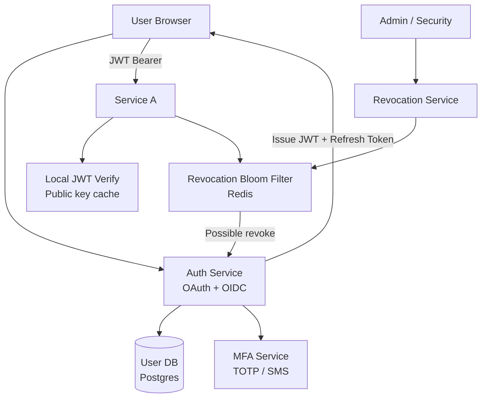
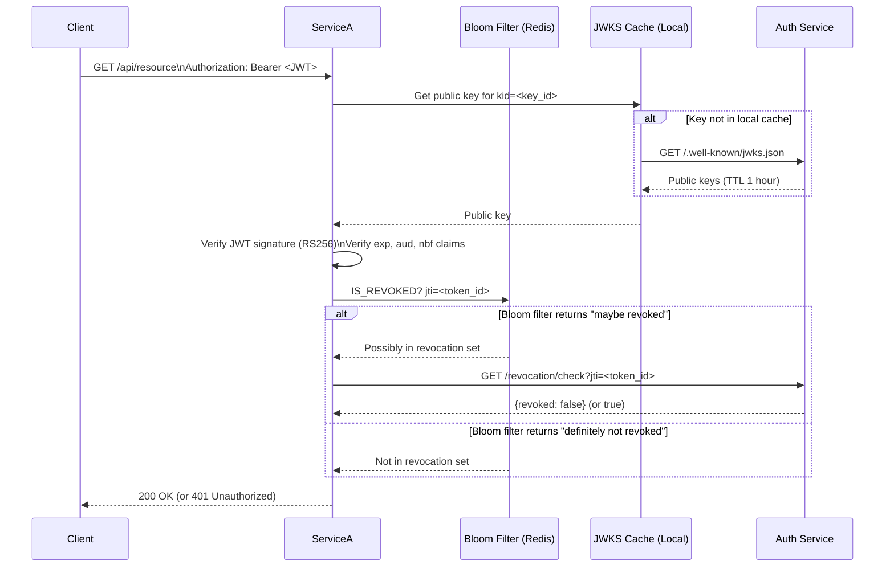
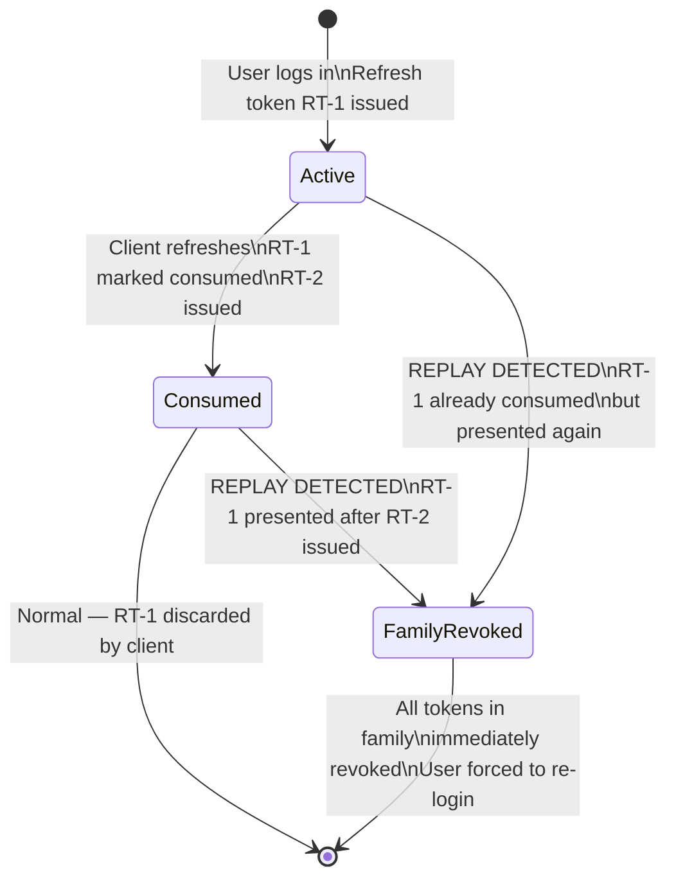

# Design an Identity Management System (OAuth/OIDC)

**Difficulty**: 🔴 Advanced
**Reading Time**: ~25 minutes
**Interview Frequency**: High

---

## The Core Problem

Managing identity for 1 billion users across 10,000 services with SSO and MFA — every service call needs to verify "is this token valid?" — creates massive token validation load. Stateless JWTs enable local verification but can't be revoked; stateful opaque tokens are revocable but require central lookup on every request. Neither approach is perfect.

## Functional Requirements

- User registration and login (email/password + social OAuth)
- Multi-factor authentication (TOTP, SMS, WebAuthn)
- Single sign-on across all services in the platform
- Token issuance (access tokens + refresh tokens)
- Token revocation (logout, security events)

## Non-Functional Requirements

| Requirement | Target |
|-------------|--------|
| Token validation latency | p99 < 5ms |
| Availability | 99.999% — auth outage = full platform outage |
| Scale | 1B users, 100K token validations/sec |
| Security | Tokens invalid within 30 seconds of revocation |

## Back-of-Envelope Estimates

- **Token validations**: 100K services × 1,000 req/sec = 100K/sec — JWTs must be validated locally
- **Refresh token storage**: 1B users × 5 devices avg = 5B refresh tokens × 200 bytes = 1TB
- **Revocation check**: 0.1% of tokens revoked daily × 100K validations/sec = 100 revocation checks/sec

## Key Design Decisions

1. **JWT for Access Tokens (Short TTL)** — JWT allows stateless local verification (verify signature + expiry); no auth service call per request; set 15-minute TTL to limit exposure window; long-lived tokens must be refresh tokens stored server-side with revocation support.
2. **Refresh Token Rotation** — on each refresh, issue new refresh token and invalidate old one; detect replay attacks (old refresh token reuse); if detected, revoke entire session family as security response.
3. **Token Revocation via Bloom Filter + Short-Circuit** — maintain distributed bloom filter of revoked JWTs; services check bloom filter before accepting JWT; false positives cause a cache miss to auth service (rare); false negatives impossible — revoked tokens are always flagged.

## High-Level Architecture



## Top Interview Questions for This Problem

| Question | Tests |
|----------|-------|
| Why use JWTs over opaque tokens for access tokens? What's the trade-off? | Stateless vs stateful, revocation |
| How do you revoke a JWT that's still within its 15-minute TTL? | Bloom filter, short-circuit revocation |
| How does PKCE protect OAuth in mobile/SPA applications? | Authorization code flow, security |

## Related Concepts

- [CAPTCHA system for bot detection at login](./captcha-system)
- [Voting system for similar identity-critical integrity needs](./voting-system)

---

## Component Deep Dive 1: Token Issuance and Validation Pipeline

The token issuance and validation pipeline is the most performance-critical component in any identity management system. At 100K token validations per second, even a 1ms average overhead on the critical path means 100 additional CPU-seconds consumed per second of operation. Getting this right requires understanding precisely what work is unavoidable and what can be eliminated.

**How it works internally:**

When a user authenticates, the Auth Service generates a signed JWT (RS256 or ES256) containing claims: `sub` (user ID), `aud` (audience — which services may accept this token), `exp` (expiry timestamp), `iat` (issued-at), `jti` (JWT ID for revocation), and a `scope` claim listing granted permissions. The Auth Service signs this with its private key. The corresponding public key is published at a well-known JWKS (JSON Web Key Set) endpoint.

Each downstream service — a microservice handling an API request — receives the JWT in the `Authorization: Bearer <token>` header. It must verify: (1) the signature is valid, (2) the token has not expired, (3) the audience matches this service, (4) the token has not been revoked. Steps 1–3 are completely local — no network call needed. Step 4 is where the system design challenge lies.

**Why naive approaches fail at scale:**

A naive approach calls the Auth Service on every request to check revocation status. At 100K req/sec across all services, this creates 100K/sec inbound load on the Auth Service — easily 10–100x its capacity for issuing new tokens. The Auth Service becomes a bottleneck for every API call in the system.

A second naive approach is simply trusting JWTs until expiry and not supporting revocation. This fails security requirements: a stolen access token is valid for up to 15 minutes. For a banking app, that's unacceptable.

The production solution uses a layered approach: short JWT TTL (15 minutes) reduces the revocation window to acceptable bounds, a distributed in-memory bloom filter catches the rare revoked tokens without a network round-trip, and false positives (bloom filter says "maybe revoked" when the token is actually valid) trigger a single authoritative check against the Auth Service. The key insight is that revocation events are rare — 0.1% of tokens daily — so the bloom filter almost never fires, and the system operates at near-zero overhead.



**Trade-off comparison: token validation strategies**

| Approach | Latency | Throughput | Revocation Support | Complexity |
|----------|---------|------------|-------------------|------------|
| JWT local verify only (no revocation) | p99 < 1ms | Unlimited — pure CPU | None — stolen tokens valid until expiry | Low |
| Opaque token + central lookup | p99 5–20ms | Bottlenecked by auth service (~50K/sec max) | Immediate | Medium |
| JWT + Bloom filter (production) | p99 < 2ms (normal), < 10ms (false positive) | >500K/sec — limited by Redis | Within 30 seconds | High |
| JWT + local revocation cache (TTL 30s) | p99 < 1ms | >1M/sec — no Redis needed | Within 30 seconds (cache TTL) | Medium |

---

## Component Deep Dive 2: Refresh Token Rotation and Session Management

Refresh tokens are the long-lived credentials that allow access tokens to be renewed without requiring re-authentication. They are stored server-side (unlike JWTs) and must be managed carefully — a stolen refresh token grants persistent access until detected.

**Internal mechanics:**

Each refresh token is a cryptographically random 32-byte value (256-bit entropy), stored as a hashed value in the database (never plaintext). The token maps to a record containing: the user ID, device fingerprint, session family ID, creation time, expiry time (typically 30–90 days), and a "consumed" flag.

When a client presents a refresh token to obtain a new access token, the Auth Service:
1. Looks up the token hash in the `refresh_tokens` table
2. Verifies it has not expired and has not been consumed
3. Marks the existing token as `consumed = true`
4. Issues a new refresh token (new random value)
5. Issues a new JWT access token
6. Returns both to the client atomically

**Refresh token rotation — detecting replay attacks:**

The session family ID links all tokens that descended from the original login event. If a client presents an already-consumed refresh token (indicating the token was stolen and used by an attacker before the legitimate client could rotate it), the Auth Service detects the reuse and immediately revokes all refresh tokens in that session family. This is the "refresh token rotation" security property defined in RFC 6819.

**Scale behavior at 10x load:**

At baseline, refresh token operations are rare relative to JWT validations — perhaps 1 refresh per 15-minute JWT expiry per active session. At 100M active sessions, that's roughly 111K refresh operations per minute, or ~1,800/sec. At 10x, that's 18K/sec. The primary database (Postgres with read replicas) handles this comfortably with proper indexing on the token hash column. However, at 100x (180K refresh/sec), a single Postgres instance saturates. The mitigation is sharding refresh tokens by `session_family_id` across multiple Postgres clusters — each cluster handles a subset of session families independently.



| Approach | Stolen Token Impact | Session UX | DB Load |
|----------|--------------------|-----------|----|
| Single long-lived refresh token (no rotation) | Attacker has access until expiry (30–90 days) | No interruption | Low |
| Refresh token rotation (production) | Detected on next use by legitimate client; family revoked | Re-login on detection | Medium (write per refresh) |
| Short-lived refresh token (1 hour) | 1-hour exposure window | Re-login every hour | High (frequent refresh ops) |

---

## Component Deep Dive 3: JWKS Key Management and Rotation

The JWKS (JSON Web Key Set) endpoint is a critical piece of infrastructure that publishes the public keys used to verify JWT signatures. Key management sounds simple — host a public key — but at scale, it has important failure modes.

**Technical decisions:**

The Auth Service maintains 2–3 active signing key pairs at any time. Each key has a `kid` (key ID) embedded in the JWT header. Services cache the JWKS response with a 1-hour TTL. When the Auth Service rotates keys (recommended every 90 days, or immediately after a suspected compromise), it follows a deliberate process: generate new key pair, publish both old and new keys in JWKS for 1 TTL period (1 hour), then after all cached JWTs using the old key have expired (TTL = 15 minutes), remove the old key from JWKS.

**What breaks at scale:** If every service fetches JWKS independently, a key rotation event triggers a thundering herd — all services simultaneously fetch the updated JWKS within 1 cache TTL period. At 10,000 services, that's 10,000 requests to the Auth Service within a 1-hour window. The mitigation is a dedicated JWKS CDN distribution or a Redis-backed shared JWKS cache that all services read from, converting 10,000 individual fetches into one single cache miss.

**Emergency key rotation:** If a private signing key is compromised, the Auth Service must immediately remove it from JWKS. This invalidates all currently-valid JWTs signed with that key — effectively a forced logout for all users. This is intentional: the security risk of a compromised signing key outweighs the UX cost of forced re-authentication.

| Key Rotation Strategy | Key Exposure Window | Forced Re-login? | JWKS Fetch Overhead |
|----------------------|--------------------|-----------------|--------------------|
| Never rotate | Indefinite if compromised | No | Minimal |
| Rotate every 90 days (production) | Max 90 days | No (overlap period) | Low |
| Emergency rotation on compromise | < 1 hour (TTL period) | Yes — all users | Thundering herd risk |

---

## Data Model

The core tables in an identity management system. This is a PostgreSQL schema for a system supporting 1B users.

```sql
-- Core user identity record
CREATE TABLE users (
    user_id         UUID PRIMARY KEY DEFAULT gen_random_uuid(),
    email           TEXT NOT NULL UNIQUE,
    email_verified  BOOLEAN NOT NULL DEFAULT false,
    password_hash   TEXT,                        -- Argon2id hash; NULL for social-only users
    created_at      TIMESTAMPTZ NOT NULL DEFAULT now(),
    last_login_at   TIMESTAMPTZ,
    is_active       BOOLEAN NOT NULL DEFAULT true,
    locked_until    TIMESTAMPTZ                  -- Account lockout after N failed attempts
);
CREATE INDEX idx_users_email ON users (email);

-- OAuth social identity providers linked to a user
CREATE TABLE user_identities (
    identity_id     UUID PRIMARY KEY DEFAULT gen_random_uuid(),
    user_id         UUID NOT NULL REFERENCES users(user_id) ON DELETE CASCADE,
    provider        TEXT NOT NULL,               -- 'google', 'github', 'facebook'
    provider_sub    TEXT NOT NULL,               -- Provider's user ID (sub claim)
    provider_email  TEXT,
    access_token    TEXT,                        -- Encrypted provider access token
    refresh_token   TEXT,                        -- Encrypted provider refresh token
    token_expires_at TIMESTAMPTZ,
    UNIQUE (provider, provider_sub)
);
CREATE INDEX idx_identities_user_id ON user_identities (user_id);

-- MFA configuration per user
CREATE TABLE mfa_methods (
    mfa_id          UUID PRIMARY KEY DEFAULT gen_random_uuid(),
    user_id         UUID NOT NULL REFERENCES users(user_id) ON DELETE CASCADE,
    method_type     TEXT NOT NULL,               -- 'totp', 'sms', 'webauthn', 'backup_code'
    secret          TEXT,                        -- Encrypted TOTP secret or phone number
    is_verified     BOOLEAN NOT NULL DEFAULT false,
    created_at      TIMESTAMPTZ NOT NULL DEFAULT now(),
    last_used_at    TIMESTAMPTZ
);
CREATE INDEX idx_mfa_user_id ON mfa_methods (user_id);

-- Refresh token storage (server-side, rotated on each use)
CREATE TABLE refresh_tokens (
    token_hash      TEXT PRIMARY KEY,            -- SHA-256 of the raw token value
    user_id         UUID NOT NULL REFERENCES users(user_id) ON DELETE CASCADE,
    session_family  UUID NOT NULL,               -- Groups all tokens from same login event
    device_id       UUID,                        -- Client device identifier
    device_name     TEXT,                        -- "iPhone 15 Pro — Safari"
    scopes          TEXT[] NOT NULL,             -- ['read', 'write', 'openid', 'profile']
    is_consumed     BOOLEAN NOT NULL DEFAULT false,
    created_at      TIMESTAMPTZ NOT NULL DEFAULT now(),
    expires_at      TIMESTAMPTZ NOT NULL,        -- Typically now() + 30 days
    consumed_at     TIMESTAMPTZ,
    ip_address      INET,
    user_agent      TEXT
);
CREATE INDEX idx_refresh_tokens_user_id ON refresh_tokens (user_id);
CREATE INDEX idx_refresh_tokens_session_family ON refresh_tokens (session_family);
CREATE INDEX idx_refresh_tokens_expires_at ON refresh_tokens (expires_at)
    WHERE is_consumed = false;                   -- Partial index for active tokens only

-- JWT signing keys (JWKS management)
CREATE TABLE signing_keys (
    key_id          TEXT PRIMARY KEY,            -- kid claim in JWT header
    algorithm       TEXT NOT NULL DEFAULT 'RS256',
    private_key     TEXT NOT NULL,               -- Encrypted with KMS; never plaintext
    public_key_jwk  JSONB NOT NULL,              -- Public key in JWK format for JWKS endpoint
    created_at      TIMESTAMPTZ NOT NULL DEFAULT now(),
    retired_at      TIMESTAMPTZ,                 -- Set when key is rotated out
    is_active       BOOLEAN NOT NULL DEFAULT true
);

-- Audit log for security-relevant events
CREATE TABLE auth_events (
    event_id        UUID PRIMARY KEY DEFAULT gen_random_uuid(),
    user_id         UUID REFERENCES users(user_id),
    event_type      TEXT NOT NULL,               -- 'login_success', 'login_fail', 'token_revoke', 'mfa_challenge'
    ip_address      INET,
    user_agent      TEXT,
    metadata        JSONB,                       -- Event-specific data
    occurred_at     TIMESTAMPTZ NOT NULL DEFAULT now()
);
CREATE INDEX idx_auth_events_user_id_occurred ON auth_events (user_id, occurred_at DESC);
CREATE INDEX idx_auth_events_type_occurred ON auth_events (event_type, occurred_at DESC);
-- Partition by month for manageable table sizes at 1B users
-- Expected volume: ~10M events/day = 300M rows/month
```

**Redis data structures (revocation and rate limiting):**

```
# Revocation bloom filter key (single key, shared)
REVOCATION_BF  (Redis Bloom Filter module)
  -- Stores jti values of revoked JWTs
  -- Capacity: 10M entries, error rate: 0.001%
  -- Memory: ~24MB

# Per-user revocation set (for confirmed compromises)
REVOKED_FAMILY:{session_family_id}  SET
  -- TTL: max JWT TTL (15 minutes) after last token in family expires
  -- Checked only when bloom filter fires

# Rate limiting for login attempts
LOGIN_ATTEMPTS:{ip_address}  STRING (counter)
  -- TTL: 15 minutes
  -- Block after 20 attempts from same IP

LOGIN_ATTEMPTS_USER:{user_id}  STRING (counter)
  -- TTL: 1 hour
  -- Lockout after 10 failed attempts
```

---

## Scale Bottlenecks

| Traffic Level | Component That Breaks | Symptoms | Mitigation |
|---------------|----------------------|----------|------------|
| 10x baseline (1M token validations/sec) | Redis bloom filter single-node throughput (~500K ops/sec) | Increased p99 latency on token validation; Redis CPU > 90% | Redis Cluster with 3+ shards; bloom filter sharded by `jti` prefix |
| 10x baseline | Postgres `refresh_tokens` write path (18K writes/sec) | Replication lag; high Postgres CPU; refresh operations timing out | Shard `refresh_tokens` across 4–8 Postgres clusters by `session_family` hash |
| 100x baseline (10M token validations/sec) | JWKS cache miss storm during key rotation | Auth Service CPU spike; increased JWT validation latency across all services | Dedicated JWKS CDN (CloudFront / Fastly); single shared Redis JWKS cache |
| 100x baseline | Auth Service login endpoint (issuing new tokens) | Login latency > 1 second; queue depth growing | Horizontal scale Auth Service to 50+ instances; async MFA verification where possible |
| 1000x baseline (100M token validations/sec) | Network bandwidth — JWT payloads at this scale | Inter-datacenter bandwidth saturation | Token compression (JWTs are base64 JSON — compress claims); region-local auth services with global user DB replication |
| Any scale | Single region auth outage | Full platform outage (auth is critical path) | Multi-region active-active deployment; users pinned to nearest region; cross-region refresh token sync via CDC |

---

## How Okta Built This

Okta manages identity for over 18,000 enterprise customers, processing more than 50 billion authentication events per year — roughly 1,600 authentications per second at average load, with peaks exceeding 10,000/sec during business-hour spikes as corporate users across time zones start their workdays simultaneously.

**Technology stack choices:**

Okta runs on AWS, using a multi-region active-active architecture across us-east-1, us-west-2, eu-west-1, eu-central-1, ap-southeast-2, and others. Each region maintains a full copy of the user directory, replicated via a custom CDC (change data capture) pipeline built on Apache Kafka. Write operations (password changes, MFA enrollment) are serialized through a global coordination layer using Zookeeper-based leader election per customer tenant — ensuring no split-brain scenarios for security-critical mutations.

For token validation, Okta uses a hybrid approach they call "fast path" validation: JWTs are signed with per-tenant keys, and each of Okta's API gateway nodes maintains a local in-process cache of JWKS data (updated every 5 minutes). This means token validation is entirely local CPU work — no Redis, no network calls — achieving sub-millisecond validation at the gateway layer.

**Non-obvious architectural decision — per-tenant key isolation:**

Rather than using a single system-wide signing key (like most IdP designs), Okta generates unique RSA-2048 key pairs per customer tenant. This means a compromise of one customer's signing key has zero impact on other customers' tokens. The operational cost is significant: Okta manages hundreds of thousands of key pairs in AWS KMS, with automated 90-day rotation. The JWKS endpoint is therefore tenant-scoped: `https://{tenant}.okta.com/oauth2/v1/keys` rather than a global endpoint. This design is detailed in Okta's 2019 security architecture blog post (developer.okta.com/blog).

**Scale numbers from Okta's engineering blog:**
- 50B+ authentication events/year (published 2023)
- 18,000+ enterprise customers
- 99.99% uptime SLA (four nines)
- Breach notification within 72 hours (SOC 2 Type II certified)
- Token issuance latency p99 < 250ms including MFA challenge

The key lesson: at Okta's scale, the per-tenant key isolation model makes each customer's auth operations independently scalable and securable — each tenant's token pipeline can be managed, rotated, and audited without touching any other tenant.

---

## Interview Angle

**What the interviewer is testing:** Can the candidate reason about the fundamental tension between stateless scalability (JWTs) and security correctness (revocation), and do they understand that this isn't a binary choice — production systems use both with careful TTL and bloom filter layering?

**Common mistakes candidates make:**

1. **Proposing opaque tokens for all validations**: Candidates often say "just use server-side session tokens and look them up on every request." This collapses under 100K validations/sec — the lookup store becomes the single point of failure and bottleneck for every API call in the system. The interviewer is looking for awareness of this.

2. **Ignoring refresh token security entirely**: Many candidates design token issuance but treat refresh tokens as "just store them in a database." They miss refresh token rotation, replay detection via session families, and the catastrophic impact of a stolen refresh token (persistent access for 30–90 days). Failing to address refresh token security is a red flag at senior level.

3. **Treating MFA as a simple "verify TOTP code" step**: Candidates describe MFA as a single point in the login flow but miss the hard problems: TOTP code replay attacks (a code is valid for 30 seconds — how do you prevent it being used twice?), MFA bypass via recovery codes (recovery codes must be single-use and hashed), and WebAuthn as the phishing-resistant MFA standard that NIST now recommends over TOTP.

**The insight that separates good from great answers:** Recognizing that the bloom filter false-positive rate must be tuned to the ratio of revocation-check cost to validation-check cost. A 0.1% false positive rate means 1 in 1,000 token validations triggers an Auth Service round-trip. At 100K validations/sec, that's 100 unnecessary Auth Service calls/sec — totally manageable. But at 1M validations/sec with a 1% false positive rate, that's 10,000 unnecessary calls/sec — now a scaling problem. The bloom filter size and false positive rate must be co-designed with the expected revocation rate and total validation volume.

---

## Key Numbers to Remember

| Metric | Value | Context |
|--------|-------|---------|
| JWT access token TTL | 15 minutes | Industry standard; limits stolen token exposure window |
| Refresh token TTL | 30–90 days | User-facing: "stay logged in"; security: rotate on every use |
| Token validation p99 (local JWT verify) | < 1ms | RS256 signature verify is ~0.3ms on modern CPU |
| Token validation p99 (with bloom filter) | < 2ms | Extra Redis GET; Redis local p99 ~0.5ms |
| Bloom filter false positive rate (production) | 0.001–0.1% | Lower = larger bloom filter; 0.1% at 10M entries = ~24MB |
| Refresh token storage at 1B users | ~1TB | 5B tokens × 200 bytes per record |
| Auth Service token issuance capacity | ~5,000–10,000/sec per instance | CPU-bound (RSA signing); scale horizontally |
| JWKS cache TTL | 1 hour | Balance: reduces key rotation overlap period vs. key fetch load |
| Argon2id password hash time | 200–500ms deliberately | CPU-hard by design; prevents brute-force at acceptable login latency |
| Session family revocation propagation | < 30 seconds | Time for all services to reflect a revocation via bloom filter sync |

---

## 📚 Resources & References

| Resource | Type | What You'll Learn |
|----------|------|------------------|
| [ByteByteGo — Design an Identity Management System](https://www.youtube.com/@ByteByteGo) | 📺 YouTube | Search "identity management design" — SSO, OAuth 2.0, multi-tenancy |
| [OAuth 2.0 RFC 6749](https://datatracker.ietf.org/doc/html/rfc6749) | 📚 Docs | The authorization framework standard — flows, tokens, and scopes |
| [Auth0 Architecture: Identity as a Service](https://auth0.com/blog/auth0-architecture-running-in-multiple-cloud-providers-and-regions/) | 📖 Blog | How Auth0 runs identity infrastructure at 99.99% across multiple clouds |
| [Okta Engineering: SSO at Scale](https://developer.okta.com/blog/2019/10/21/illustrated-guide-to-oauth-and-oidc) | 📖 Blog | Illustrated guide to OAuth and OIDC — foundational identity protocols |
| [NIST: Digital Identity Guidelines](https://pages.nist.gov/800-63-3/) | 📚 Docs | NIST 800-63 — authoritative guidance on authentication assurance levels |
