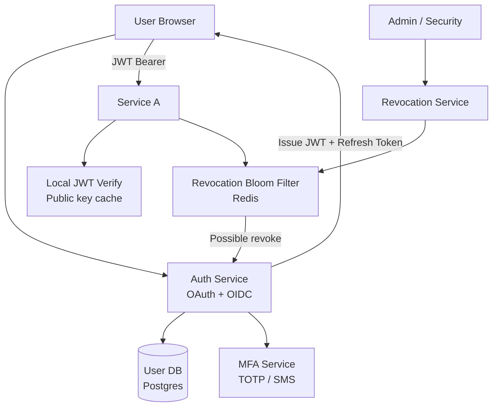

# Design an Identity Management System (OAuth/OIDC)

**Difficulty**: 🔴 Advanced
**Reading Time**: Coming Soon
**Interview Frequency**: High

---

> 🚧 **Full article coming soon.** This stub gives you the essentials to start thinking about this problem.

---

## The Core Problem

Managing identity for 1 billion users across 10,000 services with SSO and MFA — every service call needs to verify "is this token valid?" — creates massive token validation load. Stateless JWTs enable local verification but can't be revoked; stateful opaque tokens are revocable but require central lookup on every request. Neither approach is perfect.

## Functional Requirements

- User registration and login (email/password + social OAuth)
- Multi-factor authentication (TOTP, SMS, WebAuthn)
- Single sign-on across all services in the platform
- Token issuance (access tokens + refresh tokens)
- Token revocation (logout, security events)

## Non-Functional Requirements

| Requirement | Target |
|-------------|--------|
| Token validation latency | p99 < 5ms |
| Availability | 99.999% — auth outage = full platform outage |
| Scale | 1B users, 100K token validations/sec |
| Security | Tokens invalid within 30 seconds of revocation |

## Back-of-Envelope Estimates

- **Token validations**: 100K services × 1,000 req/sec = 100K/sec — JWTs must be validated locally
- **Refresh token storage**: 1B users × 5 devices avg = 5B refresh tokens × 200 bytes = 1TB
- **Revocation check**: 0.1% of tokens revoked daily × 100K validations/sec = 100 revocation checks/sec

## Key Design Decisions

1. **JWT for Access Tokens (Short TTL)** — JWT allows stateless local validation (verify signature + expiry); no auth service call per request; set 15-minute TTL to limit exposure window; long-lived tokens must be refresh tokens stored server-side with revocation support.
2. **Refresh Token Rotation** — on each refresh, issue new refresh token and invalidate old one; detect replay attacks (old refresh token reuse); if detected, revoke entire session family as security response.
3. **Token Revocation via Bloom Filter + Short-Circuit** — maintain distributed bloom filter of revoked JWTs; services check bloom filter before accepting JWT; false positives cause a cache miss to auth service (rare); false negatives impossible — revoked tokens are always flagged.

## High-Level Architecture

## Top Interview Questions for This Problem

| Question | Tests |
|----------|-------|
| Why use JWTs over opaque tokens for access tokens? What's the trade-off? | Stateless vs stateful, revocation |
| How do you revoke a JWT that's still within its 15-minute TTL? | Bloom filter, short-circuit revocation |
| How does PKCE protect OAuth in mobile/SPA applications? | Authorization code flow, security |

## Related Concepts

- [CAPTCHA system for bot detection at login](./captcha-system)
- [Voting system for similar identity-critical integrity needs](./voting-system)

---

*📚 Full deep-dive with multiple approaches, trade-off tables, and pseudocode coming soon.*
