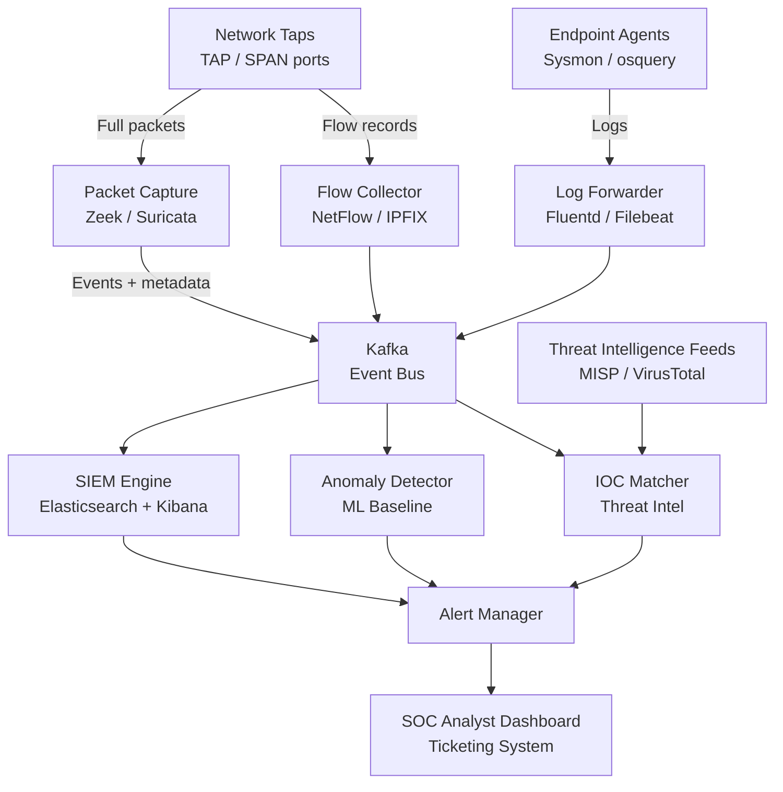

# Design a Network Security Monitoring System

**Difficulty**: 🔴 Advanced
**Reading Time**: ~30 minutes
**The Core Problem**: How do you monitor all network traffic across a 10,000-node enterprise in real time — detecting intrusions, anomalies, and compliance violations — without drowning analysts in false positives?

---

## Table of Contents

1. [Requirements](#1-requirements)
2. [Capacity Estimation](#2-capacity-estimation)
3. [High-Level Architecture](#3-high-level-architecture)
4. [Packet Capture Layer](#4-packet-capture-layer)
5. [Flow Analysis (NetFlow/IPFIX)](#5-flow-analysis-netflowipfix)
6. [SIEM — Log Aggregation & Correlation](#6-siem--log-aggregation--correlation)
7. [Behavioral Anomaly Detection](#7-behavioral-anomaly-detection)
8. [Threat Intelligence Integration](#8-threat-intelligence-integration)
9. [Key Design Decisions](#9-key-design-decisions)
10. [Interview Questions](#10-interview-questions)
11. [Key Takeaways](#11-key-takeaways)
12. [References](#12-references)

---

## 1. Requirements

### Functional
- Monitor all network traffic (internal + perimeter) across 10k nodes
- Detect known attack signatures (IDS rules)
- Detect anomalous behavior (ML baseline + deviation)
- Real-time alerts for high-severity incidents
- Threat intelligence integration (IOC feeds — IPs, domains, hashes)
- Compliance: log retention for 1 year, query within 30 seconds

### Non-Functional
- **Scale**: 10 Gbps aggregate network traffic; 1M log events/day
- **Detection latency**: Alert within 60 seconds of anomaly
- **False positive rate**: < 5% (alert fatigue is a real failure mode)
- **Query performance**: Historical log query < 30 seconds over 1 year
- **Availability**: 99.9% — security monitoring cannot go dark

---

## 2. Capacity Estimation

| Metric | Estimate |
|--------|----------|
| Network nodes | 10,000 |
| Aggregate bandwidth | 10 Gbps |
| NetFlow records/sec | 10 Gbps / 1500B avg packet / 40 packets/flow = **~1,400 flows/sec** |
| Full packet capture rate | 10 Gbps = **75 TB/day** (impractical to store all) |
| Selected packet capture | 5% of flows × 10% of packets = **~375 GB/day** |
| Log events/day | 1M (auth, firewall, DNS, proxy, endpoint) |
| Log storage/year | 1M × 365 × 2KB = **730 GB/year** |
| IOC feed updates | 10k new IOCs/day (IPs, domains, file hashes) |
| Analysts | 5–10 SOC (Security Operations Center) analysts |

---

## 3. High-Level Architecture



---

## 4. Packet Capture Layer

### Passive Tap vs SPAN Port
```
Network TAP (Test Access Point):
  Physical device inline on network path
  Copies all packets to monitoring port
  Pros: Cannot be disabled by network error; captures full duplex
  Cons: Requires physical installation; adds hardware in path (failure risk)

SPAN Port (Switched Port Analyzer):
  Switch mirrors traffic to monitoring port
  Pros: No hardware installation; software-configured
  Cons: Can drop packets under high load (SPAN is best-effort); only one direction

Placement:
  Core switches: SPAN for east-west (internal) traffic
  Internet edge routers: TAP for north-south (external) traffic
  Critical segments (PCI, HR): dedicated TAP
```

### Zeek (formerly Bro) — Network Analysis
```
Zeek sits on the monitoring port (passive, never touches production traffic):
  Input: Raw packets
  Output: Protocol-level logs:
    conn.log     — all connections (src/dst IP, port, bytes, duration)
    dns.log      — all DNS queries/responses
    http.log     — HTTP requests/responses
    ssl.log      — TLS certificate info
    files.log    — files transferred (with MD5/SHA256)
    notice.log   — policy violations

Zero-copy packet processing: 10 Gbps on commodity hardware
Zeek scripting: custom detection logic in Zeek scripting language
Benefit: Structured logs (not raw packets) — 1000× smaller than PCAP
```

---

## 5. Flow Analysis (NetFlow/IPFIX)

### NetFlow Records
```
Routers/switches export flow summaries (not full packets):
  NetFlow record:
    src_ip, dst_ip, src_port, dst_port, protocol
    bytes, packets, start_time, end_time, tcp_flags

1 flow record ≈ 50 bytes (vs 1500 bytes for full packet)
Sampling: typically 1-in-100 packets sampled (reduces volume 100×)

Use case: network baseline, bandwidth analysis, DDoS detection
Limitation: No payload data (can't detect application-layer attacks)

IPFIX (IP Flow Information Export):
  Upgraded NetFlow standard, flexible field definitions
  Supports IPv6, additional metadata fields
```

### Flow-Based Anomaly Detection
```
Detect at flow level:
  - Port scan: one src_ip → many dst_ips, same dst_port, few bytes
  - Data exfiltration: unusual large bytes out to external IP
  - C2 beaconing: regular small connections to same external IP (e.g., every 60s)
  - DDoS incoming: many src_ips → single dst_ip, high packet rate

Rule example (port scan):
  COUNT(DISTINCT dst_ip) > 100 per src_ip per 5 minutes
  AND avg_bytes < 100
  → Alert: "Port scan from 192.168.1.5"
```

---

## 6. SIEM — Log Aggregation & Correlation

### Log Sources
```
1. Firewall logs: allow/deny decisions (pfsense, Palo Alto, AWS Security Groups)
2. Authentication logs: AD/LDAP login success/fail, MFA events
3. DNS logs: all queries (C2 detection, tunneling detection)
4. Proxy logs: all HTTP/HTTPS requests (URL, user, bytes)
5. Endpoint logs: process creation, file modification, registry changes (Sysmon)
6. VPN logs: who connected from where, when
7. Email gateway: spam, phishing, attachment scan results
```

### Elasticsearch as SIEM Backend
```
Index strategy: daily indices (logs-2024-03-15)
  Shard per day: 1 primary × 1 replica per index
  Retention: hot (7 days, SSD) → warm (30 days, HDD) → cold (1 year, S3)

Index lifecycle management (ILM):
  After 7 days: move to warm tier (reduce replicas to 0)
  After 30 days: force merge (reduce segments, shrink disk)
  After 365 days: delete (compliance: 1-year retention)

Query: "Show all failed logins for user alice in last 24 hours"
  GET logs-*/_search
  { "query": { "bool": { "must": [
    { "term": { "user": "alice" } },
    { "term": { "event_type": "login_failure" } },
    { "range": { "timestamp": { "gte": "now-24h" } } }
  ]}}}
  → Response: < 1 second (with proper indexing)
```

### Correlation Rules (SIEM Logic)
```
Rule: Brute Force + Successful Login
  Condition:
    login_failure COUNT > 10 in 5 minutes for same user
    FOLLOWED BY login_success for same user within 10 minutes
  Severity: CRITICAL
  Action: Alert + disable account + page SOC analyst

Rule: Impossible Travel
  Condition:
    login from location A at T1
    login from location B at T2
    distance(A, B) / (T2 - T1) > 1000 km/h (physically impossible)
  Severity: HIGH
  Action: Alert, require MFA re-auth

Rule: DNS over HTTPS tunneling
  Condition:
    DNS query byte size > 200 bytes (normal queries < 40 bytes)
    same destination domain, regular interval (beacon)
  Severity: MEDIUM
```

---

## 7. Behavioral Anomaly Detection

### Baseline + Deviation
```
Build 30-day baseline per entity (user, host, subnet):
  User baseline:
    - Typical working hours (9am–6pm Mon-Fri)
    - Typical source IPs (office, home VPN)
    - Typical data volumes (100 MB/day outbound)
    - Typical accessed systems (HR, email, code repo)

Detection: deviation from baseline
  User accesses 10GB of data at 2am → anomaly score: HIGH
  User accesses new system they've never touched → anomaly score: MEDIUM
  User logs in from new country → anomaly score: HIGH

Algorithm options:
  Isolation Forest: good for multivariate anomalies
  LSTM: time-series patterns (detect unusual sequences of events)
  Statistical: Z-score per metric (simple, explainable to analysts)

False positive reduction:
  Combine multiple signals (single anomaly = low confidence)
  Context: known IT maintenance windows suppress alerts
  Entity context: finance team downloads large datasets regularly → not anomalous
```

---

## 8. Threat Intelligence Integration

### IOC (Indicators of Compromise) Feeds
```
Feed types:
  - Malicious IPs (C2 servers, TOR exit nodes): updated hourly
  - Malicious domains (phishing, malware): updated daily
  - File hashes (known malware): updated hourly
  - URL patterns (exploit kits): updated daily

Sources:
  - Commercial: Recorded Future, CrowdStrike Intel
  - Open source: AlienVault OTX, abuse.ch, Feodo Tracker
  - ISAC (Information Sharing and Analysis Centers)

Storage: Redis for fast IOC lookup (in-memory, key = indicator, value = threat info)
  SET ioc:ip:1.2.3.4 '{"type":"c2","threat":"emotet","confidence":90}'
  GET ioc:ip:{src_ip}  → hit = alert

IOC matching pipeline:
  Every new network connection → check src/dst IP against Redis
  Every DNS query → check domain against Redis
  Every file hash from Zeek → check hash against Redis
  Latency: < 1ms per lookup
  Volume: 1,400 flows/sec → 2,800 Redis lookups/sec (trivial)
```

---

## 9. Key Design Decisions

| Decision | Option A | Option B | Choice & Reason |
|----------|----------|----------|-----------------|
| Capture depth | Full packet capture (PCAP) | Flow records (NetFlow) | **Flow + selective PCAP** — flows for broad visibility (cheap), PCAP triggered for high-priority alerts |
| Detection approach | Rule-based (signatures) | ML anomaly detection | **Both** — rules for known threats (low false positives), ML for unknown threats (higher FP, needs tuning) |
| Alert storage | Elasticsearch | PostgreSQL | **Elasticsearch** — log search patterns (text query + time range) are perfect for ES; Postgres is better for structured RDBMS queries |
| Analysis timing | Real-time streaming | Batch (hourly) | **Both** — streaming for alerts, batch for ML baseline computation |
| IOC lookup | Database query | Redis in-memory | **Redis** — 2,800 lookups/sec requires < 1ms; DB would take 5–10ms per query |

---

## 10. Interview Questions

| Question | Key Answer |
|----------|-----------|
| How do you avoid alert fatigue? | Correlation rules (not single events), suppression during maintenance, ML confidence scoring, SOC analyst feedback loop |
| What's the difference between IDS and IPS? | IDS (Intrusion Detection) is passive — alerts only; IPS (Intrusion Prevention) is inline — can block traffic |
| How do you detect encrypted C2 traffic (no payload)? | Behavioral analysis on flow records: beacon patterns (regular intervals), JA3 fingerprinting (TLS fingerprint), anomalous bytes/timing |
| How do you scale to 10 Gbps? | Parallel Zeek workers (each handles one network segment); Kafka absorbs burst; Elasticsearch horizontal scaling |
| How do you handle 75 TB/day of raw packets? | Don't store all. Zeek extracts structured logs (1000× smaller). Store full PCAP only for high-severity alerts (1% of traffic) |

---

## 11. Key Takeaways

- **Flow records + selective PCAP** is the practical approach — full PCAP at 10 Gbps generates 75 TB/day (unaffordable); flows give broad visibility at 1/1000th the volume
- **SIEM correlation rules** (multi-event, multi-source) are far more effective than per-event alerts — brute force + success is a real indicator; each alone is noise
- **Behavioral baselines** detect unknown threats that signature rules miss — but require 30 days of training and careful false-positive tuning
- **Redis IOC matching** enables < 1ms per-connection threat intel lookup — DB-based lookup at 2,800/sec would bottleneck
- **Alert fatigue is a system failure** — 95% false positive rate means analysts ignore everything; precision matters as much as recall

---

## 📚 Resources & References

| Resource | Type | What You'll Learn |
|----------|------|------------------|
| [The Practice of Network Security Monitoring — Bejtlich](https://nostarch.com/nsm) | 📚 Book | Comprehensive NSM methodology and tool usage |
| [Zeek Network Monitor Architecture](https://docs.zeek.org/en/master/architecture.html) | 📖 Blog | Zeek scripting and protocol analysis |
| [SANS — SIEM Best Practices](https://www.sans.org/reading-room/whitepapers/detection/) | 📖 Blog | Correlation rules and SOC workflow design |
| [ByteByteGo — Security System Design](https://www.youtube.com/@ByteByteGo) | 📺 YouTube | Network security architecture overview |
