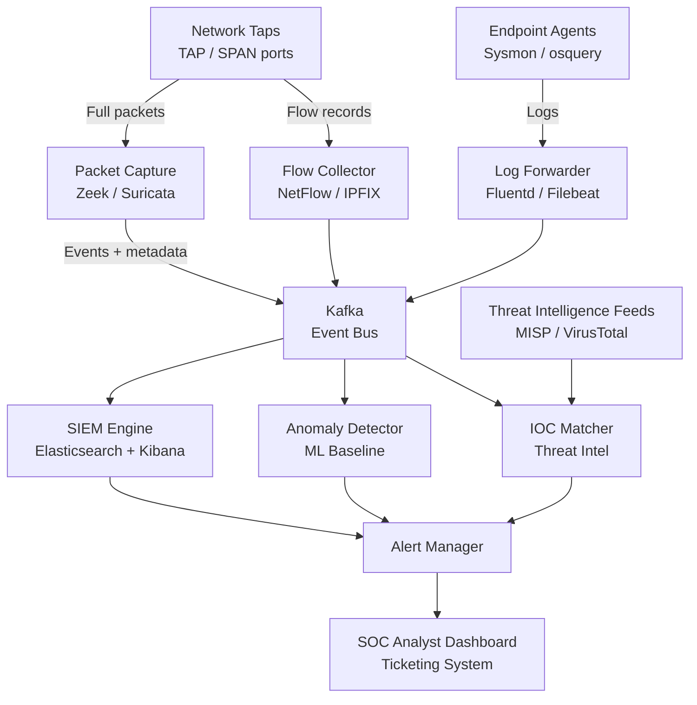
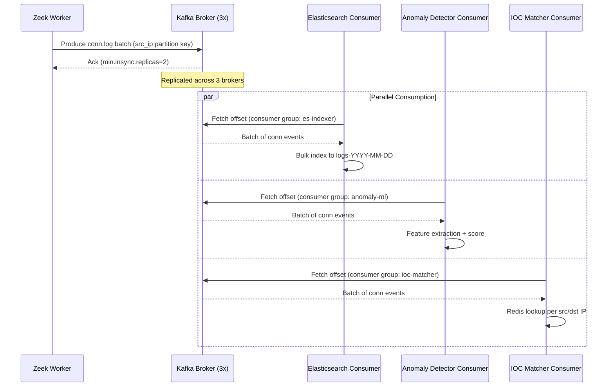
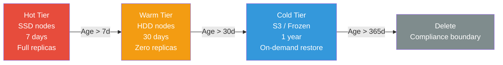

# Design a Network Security Monitoring System

**Difficulty**: 🔴 Advanced
**Reading Time**: ~30 minutes
**The Core Problem**: How do you monitor all network traffic across a 10,000-node enterprise in real time — detecting intrusions, anomalies, and compliance violations — without drowning analysts in false positives?

---

## Table of Contents

1. [Requirements](#1-requirements)
2. [Capacity Estimation](#2-capacity-estimation)
3. [High-Level Architecture](#3-high-level-architecture)
4. [Packet Capture Layer](#4-packet-capture-layer)
5. [Flow Analysis (NetFlow/IPFIX)](#5-flow-analysis-netflowipfix)
6. [SIEM — Log Aggregation & Correlation](#6-siem--log-aggregation--correlation)
7. [Behavioral Anomaly Detection](#7-behavioral-anomaly-detection)
8. [Threat Intelligence Integration](#8-threat-intelligence-integration)
9. [Key Design Decisions](#9-key-design-decisions)
10. [Interview Questions](#10-interview-questions)
11. [Key Takeaways](#11-key-takeaways)
12. [Component Deep Dive 1: Kafka Event Bus](#component-deep-dive-1-kafka-event-bus)
13. [Component Deep Dive 2: Elasticsearch SIEM Backend](#component-deep-dive-2-elasticsearch-siem-backend)
14. [Component Deep Dive 3: Behavioral Anomaly Detection Engine](#component-deep-dive-3-behavioral-anomaly-detection-engine)
15. [Data Model](#data-model)
16. [Scale Bottlenecks](#scale-bottlenecks)
17. [How Cloudflare Built Network Security Monitoring](#how-cloudflare-built-network-security-monitoring)
18. [Interview Angle](#interview-angle)
19. [Key Numbers to Remember](#key-numbers-to-remember)
20. [References](#references)

---

## 1. Requirements

### Functional
- Monitor all network traffic (internal + perimeter) across 10k nodes
- Detect known attack signatures (IDS rules)
- Detect anomalous behavior (ML baseline + deviation)
- Real-time alerts for high-severity incidents
- Threat intelligence integration (IOC feeds — IPs, domains, hashes)
- Compliance: log retention for 1 year, query within 30 seconds

### Non-Functional
- **Scale**: 10 Gbps aggregate network traffic; 1M log events/day
- **Detection latency**: Alert within 60 seconds of anomaly
- **False positive rate**: < 5% (alert fatigue is a real failure mode)
- **Query performance**: Historical log query < 30 seconds over 1 year
- **Availability**: 99.9% — security monitoring cannot go dark

---

## 2. Capacity Estimation

| Metric | Estimate |
|--------|----------|
| Network nodes | 10,000 |
| Aggregate bandwidth | 10 Gbps |
| NetFlow records/sec | 10 Gbps / 1500B avg packet / 40 packets/flow = **~1,400 flows/sec** |
| Full packet capture rate | 10 Gbps = **75 TB/day** (impractical to store all) |
| Selected packet capture | 5% of flows × 10% of packets = **~375 GB/day** |
| Log events/day | 1M (auth, firewall, DNS, proxy, endpoint) |
| Log storage/year | 1M × 365 × 2KB = **730 GB/year** |
| IOC feed updates | 10k new IOCs/day (IPs, domains, file hashes) |
| Analysts | 5–10 SOC (Security Operations Center) analysts |

---

## 3. High-Level Architecture



---

## 4. Packet Capture Layer

### Passive Tap vs SPAN Port
```
Network TAP (Test Access Point):
  Physical device inline on network path
  Copies all packets to monitoring port
  Pros: Cannot be disabled by network error; captures full duplex
  Cons: Requires physical installation; adds hardware in path (failure risk)

SPAN Port (Switched Port Analyzer):
  Switch mirrors traffic to monitoring port
  Pros: No hardware installation; software-configured
  Cons: Can drop packets under high load (SPAN is best-effort); only one direction

Placement:
  Core switches: SPAN for east-west (internal) traffic
  Internet edge routers: TAP for north-south (external) traffic
  Critical segments (PCI, HR): dedicated TAP
```

### Zeek (formerly Bro) — Network Analysis
```
Zeek sits on the monitoring port (passive, never touches production traffic):
  Input: Raw packets
  Output: Protocol-level logs:
    conn.log     — all connections (src/dst IP, port, bytes, duration)
    dns.log      — all DNS queries/responses
    http.log     — HTTP requests/responses
    ssl.log      — TLS certificate info
    files.log    — files transferred (with MD5/SHA256)
    notice.log   — policy violations

Zero-copy packet processing: 10 Gbps on commodity hardware
Zeek scripting: custom detection logic in Zeek scripting language
Benefit: Structured logs (not raw packets) — 1000× smaller than PCAP
```

---

## 5. Flow Analysis (NetFlow/IPFIX)

### NetFlow Records
```
Routers/switches export flow summaries (not full packets):
  NetFlow record:
    src_ip, dst_ip, src_port, dst_port, protocol
    bytes, packets, start_time, end_time, tcp_flags

1 flow record ≈ 50 bytes (vs 1500 bytes for full packet)
Sampling: typically 1-in-100 packets sampled (reduces volume 100×)

Use case: network baseline, bandwidth analysis, DDoS detection
Limitation: No payload data (can't detect application-layer attacks)

IPFIX (IP Flow Information Export):
  Upgraded NetFlow standard, flexible field definitions
  Supports IPv6, additional metadata fields
```

### Flow-Based Anomaly Detection
```
Detect at flow level:
  - Port scan: one src_ip → many dst_ips, same dst_port, few bytes
  - Data exfiltration: unusual large bytes out to external IP
  - C2 beaconing: regular small connections to same external IP (e.g., every 60s)
  - DDoS incoming: many src_ips → single dst_ip, high packet rate

Rule example (port scan):
  COUNT(DISTINCT dst_ip) > 100 per src_ip per 5 minutes
  AND avg_bytes < 100
  → Alert: "Port scan from 192.168.1.5"
```

---

## 6. SIEM — Log Aggregation & Correlation

### Log Sources
```
1. Firewall logs: allow/deny decisions (pfsense, Palo Alto, AWS Security Groups)
2. Authentication logs: AD/LDAP login success/fail, MFA events
3. DNS logs: all queries (C2 detection, tunneling detection)
4. Proxy logs: all HTTP/HTTPS requests (URL, user, bytes)
5. Endpoint logs: process creation, file modification, registry changes (Sysmon)
6. VPN logs: who connected from where, when
7. Email gateway: spam, phishing, attachment scan results
```

### Elasticsearch as SIEM Backend
```
Index strategy: daily indices (logs-2024-03-15)
  Shard per day: 1 primary × 1 replica per index
  Retention: hot (7 days, SSD) → warm (30 days, HDD) → cold (1 year, S3)

Index lifecycle management (ILM):
  After 7 days: move to warm tier (reduce replicas to 0)
  After 30 days: force merge (reduce segments, shrink disk)
  After 365 days: delete (compliance: 1-year retention)

Query: "Show all failed logins for user alice in last 24 hours"
  GET logs-*/_search
  { "query": { "bool": { "must": [
    { "term": { "user": "alice" } },
    { "term": { "event_type": "login_failure" } },
    { "range": { "timestamp": { "gte": "now-24h" } } }
  ]}}}
  → Response: < 1 second (with proper indexing)
```

### Correlation Rules (SIEM Logic)
```
Rule: Brute Force + Successful Login
  Condition:
    login_failure COUNT > 10 in 5 minutes for same user
    FOLLOWED BY login_success for same user within 10 minutes
  Severity: CRITICAL
  Action: Alert + disable account + page SOC analyst

Rule: Impossible Travel
  Condition:
    login from location A at T1
    login from location B at T2
    distance(A, B) / (T2 - T1) > 1000 km/h (physically impossible)
  Severity: HIGH
  Action: Alert, require MFA re-auth

Rule: DNS over HTTPS tunneling
  Condition:
    DNS query byte size > 200 bytes (normal queries < 40 bytes)
    same destination domain, regular interval (beacon)
  Severity: MEDIUM
```

---

## 7. Behavioral Anomaly Detection

### Baseline + Deviation
```
Build 30-day baseline per entity (user, host, subnet):
  User baseline:
    - Typical working hours (9am–6pm Mon-Fri)
    - Typical source IPs (office, home VPN)
    - Typical data volumes (100 MB/day outbound)
    - Typical accessed systems (HR, email, code repo)

Detection: deviation from baseline
  User accesses 10GB of data at 2am → anomaly score: HIGH
  User accesses new system they've never touched → anomaly score: MEDIUM
  User logs in from new country → anomaly score: HIGH

Algorithm options:
  Isolation Forest: good for multivariate anomalies
  LSTM: time-series patterns (detect unusual sequences of events)
  Statistical: Z-score per metric (simple, explainable to analysts)

False positive reduction:
  Combine multiple signals (single anomaly = low confidence)
  Context: known IT maintenance windows suppress alerts
  Entity context: finance team downloads large datasets regularly → not anomalous
```

---

## 8. Threat Intelligence Integration

### IOC (Indicators of Compromise) Feeds
```
Feed types:
  - Malicious IPs (C2 servers, TOR exit nodes): updated hourly
  - Malicious domains (phishing, malware): updated daily
  - File hashes (known malware): updated hourly
  - URL patterns (exploit kits): updated daily

Sources:
  - Commercial: Recorded Future, CrowdStrike Intel
  - Open source: AlienVault OTX, abuse.ch, Feodo Tracker
  - ISAC (Information Sharing and Analysis Centers)

Storage: Redis for fast IOC lookup (in-memory, key = indicator, value = threat info)
  SET ioc:ip:1.2.3.4 '{"type":"c2","threat":"emotet","confidence":90}'
  GET ioc:ip:{src_ip}  → hit = alert

IOC matching pipeline:
  Every new network connection → check src/dst IP against Redis
  Every DNS query → check domain against Redis
  Every file hash from Zeek → check hash against Redis
  Latency: < 1ms per lookup
  Volume: 1,400 flows/sec → 2,800 Redis lookups/sec (trivial)
```

---

## 9. Key Design Decisions

| Decision | Option A | Option B | Choice & Reason |
|----------|----------|----------|-----------------|
| Capture depth | Full packet capture (PCAP) | Flow records (NetFlow) | **Flow + selective PCAP** — flows for broad visibility (cheap), PCAP triggered for high-priority alerts |
| Detection approach | Rule-based (signatures) | ML anomaly detection | **Both** — rules for known threats (low false positives), ML for unknown threats (higher FP, needs tuning) |
| Alert storage | Elasticsearch | PostgreSQL | **Elasticsearch** — log search patterns (text query + time range) are perfect for ES; Postgres is better for structured RDBMS queries |
| Analysis timing | Real-time streaming | Batch (hourly) | **Both** — streaming for alerts, batch for ML baseline computation |
| IOC lookup | Database query | Redis in-memory | **Redis** — 2,800 lookups/sec requires < 1ms; DB would take 5–10ms per query |

---

## 10. Interview Questions

| Question | Key Answer |
|----------|-----------|
| How do you avoid alert fatigue? | Correlation rules (not single events), suppression during maintenance, ML confidence scoring, SOC analyst feedback loop |
| What's the difference between IDS and IPS? | IDS (Intrusion Detection) is passive — alerts only; IPS (Intrusion Prevention) is inline — can block traffic |
| How do you detect encrypted C2 traffic (no payload)? | Behavioral analysis on flow records: beacon patterns (regular intervals), JA3 fingerprinting (TLS fingerprint), anomalous bytes/timing |
| How do you scale to 10 Gbps? | Parallel Zeek workers (each handles one network segment); Kafka absorbs burst; Elasticsearch horizontal scaling |
| How do you handle 75 TB/day of raw packets? | Don't store all. Zeek extracts structured logs (1000× smaller). Store full PCAP only for high-severity alerts (1% of traffic) |

---

## 11. Key Takeaways

- **Flow records + selective PCAP** is the practical approach — full PCAP at 10 Gbps generates 75 TB/day (unaffordable); flows give broad visibility at 1/1000th the volume
- **SIEM correlation rules** (multi-event, multi-source) are far more effective than per-event alerts — brute force + success is a real indicator; each alone is noise
- **Behavioral baselines** detect unknown threats that signature rules miss — but require 30 days of training and careful false-positive tuning
- **Redis IOC matching** enables < 1ms per-connection threat intel lookup — DB-based lookup at 2,800/sec would bottleneck
- **Alert fatigue is a system failure** — 95% false positive rate means analysts ignore everything; precision matters as much as recall

---

## Component Deep Dive 1: Kafka Event Bus

The Kafka event bus is the most critical architectural component in a network security monitoring system because it is the single conduit through which all telemetry — packet-derived events from Zeek, NetFlow records, endpoint logs, and firewall logs — must flow before any detection logic runs. A failure or bottleneck here blinds every downstream consumer simultaneously.

### How Kafka Works Internally in This Context

Kafka organizes data into topics. Each security telemetry type maps to a dedicated topic: `netflow-records`, `zeek-conn`, `zeek-dns`, `endpoint-events`, `firewall-logs`. Within each topic, partitions distribute load. The partition key is the source IP address so that all events from a single host land on the same partition, preserving ordering for per-host behavioral correlation.

Producers (Zeek, Filebeat, NetFlow collector) write records using batch compression (lz4). Consumers (Elasticsearch indexer, anomaly detector, IOC matcher) maintain separate consumer groups so each downstream system independently replays the stream. This is the key insight: Kafka acts as a **durable replay buffer**, not just a message queue. If the anomaly detector falls behind during a spike, it catches up without dropping events.

Retention is configured at 24 hours — long enough to replay a missed window if the anomaly detector restarts, but not so long that disk consumption becomes unmanageable. Each partition is replicated across 3 brokers (replication factor = 3, `min.insync.replicas = 2`) to survive broker failure without data loss.

### Why Naive Approaches Fail at Scale

The naive approach is to write events directly from Zeek to Elasticsearch and fire IOC lookups synchronously per connection. At 1,400 flows/sec this seems fine, but during a DDoS event flows spike to 50,000/sec. Direct writes to Elasticsearch during this spike cause index pressure, replication lag, and dropped events. IOC lookups stack up in a synchronous queue and introduce 200ms latency per connection — causing cascading backpressure that freezes Zeek's write path and creates a blind spot exactly when visibility is most critical.

Kafka decouples capture from analysis. Producers write at wire speed; consumers work at their own pace. The DDoS spike appears as a short lag in the consumer offset, not a data loss event.

### Kafka Internal Sequence



### Kafka Implementation Trade-offs

| Approach | Latency | Throughput | Trade-off |
|----------|---------|------------|-----------|
| Single partition per topic | < 5ms | ~50k events/sec | No parallelism; single broker failure = outage |
| Partition by src_ip (chosen) | 5–20ms | 500k events/sec per topic | Per-host ordering preserved; hot IPs can imbalance partitions |
| Partition by random round-robin | 5–20ms | 500k events/sec per topic | Maximum throughput but loses per-host event ordering |

---

## Component Deep Dive 2: Elasticsearch SIEM Backend

Elasticsearch is the long-term store and query engine for all security events. Its design choices determine whether a SOC analyst can run a forensic query in 2 seconds or 45 seconds — a difference that meaningfully affects incident response speed.

### Internal Mechanics

Elasticsearch organizes data into indices. For security monitoring, the correct pattern is **time-based daily indices** (e.g., `logs-2026-06-01`). Each index holds all log types for that day: Zeek conn events, DNS queries, endpoint process events, firewall allow/deny, authentication events. The day boundary aligns with Index Lifecycle Management (ILM) so hot/warm/cold transitions happen automatically.

Within each daily index, the shard count is set to the number of data nodes in the hot tier (e.g., 6 shards for a 6-node hot cluster). Each primary shard has one replica. Shard size target is 30–50 GB — smaller shards slow down at 10M+ document searches, larger shards make recovery after node failure slow.

The most important index mapping decision: `src_ip` and `dst_ip` are mapped as `ip` type (not `keyword`), enabling CIDR range queries like `src_ip: 10.0.0.0/8`. `timestamp` is a `date` field. `user_agent`, `url`, and `domain` fields use `keyword` (not `text`) because analysts filter by exact value, not full-text search. Enabling `text` analysis on these fields wastes CPU and disk.

### Scale Behavior at 10x Load

At baseline (1M events/day), a 6-node Elasticsearch cluster with 3 hot nodes and 3 warm nodes handles queries in under 1 second. At 10x load (10M events/day), the same cluster shows index write pressure: bulk indexing queue depth increases, and segment merges compete with query threads for I/O. The mitigation is to increase the number of primary shards per day index from 6 to 12, and to add 3 more hot nodes — total 9 hot nodes processing 2M events/day per node.

At 100x load (100M events/day), Elasticsearch alone is insufficient. The solution is to route raw events to a cold object store (S3 with Parquet) and run Athena queries for events older than 7 days. Elasticsearch retains only the hot 7 days, and Kibana dashboards blend both sources via Canvas or external query federation.

### Elasticsearch Index Lifecycle



| Tier | Storage | Query Latency | Cost/TB/month |
|------|---------|---------------|---------------|
| Hot (SSD, replicated) | 7 days | < 1 second | ~$230 |
| Warm (HDD, no replica) | 30 days | 2–10 seconds | ~$30 |
| Cold (S3 Frozen) | 1 year | 10–60 seconds | ~$3 |

---

## Component Deep Dive 3: Behavioral Anomaly Detection Engine

The anomaly detection engine is the layer that catches threats signature rules miss entirely — insider threats, novel malware variants, slow-burn lateral movement. Its accuracy directly determines whether the SOC team trusts the alert stream or treats it as noise.

### Internal Architecture

The engine operates in two modes: **online scoring** (stream processing, per-event) and **offline baseline training** (batch, nightly). The nightly batch job reads 30 days of events from Elasticsearch, computes per-entity feature vectors, and writes baselines to a feature store (Redis for low-latency reads, PostgreSQL for durable storage).

Each entity (user, host, subnet) has a feature vector with 20–40 dimensions:
- Temporal features: typical login hours (histogram), mean connection count per hour
- Geographic features: typical source ASNs, country codes
- Behavioral features: typical destination ports, typical accessed internal services, mean bytes/connection
- Peer group features: deviation from peer group average (finance users vs. engineering users)

During online scoring, each new event hits the Kafka consumer, enriches with entity baseline, computes a delta score (Mahalanobis distance for multivariate features, Z-score for individual metrics), and emits a risk signal if the score exceeds a threshold. A single anomalous event rarely triggers an alert — the engine accumulates risk signals per entity in a sliding 30-minute window. Only when the window score exceeds a tunable threshold does an alert fire.

The threshold is tuned by SOC analyst feedback: analysts mark alerts as True Positive or False Positive in the ticketing system. A weekly feedback loop retrains the thresholds per entity group, targeting a 4% false positive rate.

### False Positive Suppression

The single most important operational decision is building a **suppression list** of known-benign events. IT maintenance windows, batch backup jobs, security scanner IPs, and CI/CD agent IPs are registered as suppression contexts. Any anomaly originating from a suppressed context is scored at zero, preventing the nightly backup job from generating 200 false positives every night.

---

## Data Model

### Core Event Schema (Elasticsearch document)

```json
{
  "_index": "logs-2026-06-01",
  "_id": "zeek-conn-a1b2c3d4",
  "_source": {
    "event_type": "conn",
    "source": "zeek",
    "timestamp": "2026-06-01T14:23:11.442Z",
    "ingested_at": "2026-06-01T14:23:12.100Z",
    "src_ip": "10.4.22.31",
    "dst_ip": "203.0.113.44",
    "src_port": 54321,
    "dst_port": 443,
    "protocol": "tcp",
    "bytes_sent": 4210,
    "bytes_received": 98320,
    "duration_ms": 3420,
    "conn_state": "SF",
    "tcp_flags": ["SYN", "ACK", "FIN"],
    "hostname": "workstation-22.corp.example.com",
    "user": "alice@example.com",
    "geo_dst": {
      "country_code": "US",
      "asn": 15169,
      "asn_org": "Google LLC"
    },
    "ioc_hit": false,
    "anomaly_score": 0.12,
    "tags": ["internal_to_external", "https"]
  }
}
```

### IOC Store (Redis)

```
# Key format: ioc:<type>:<value>
# Value: JSON with threat metadata, TTL = feed refresh interval

SET ioc:ip:203.0.113.99 '{"threat":"emotet_c2","confidence":95,"feed":"feodo","updated":"2026-06-01T10:00:00Z"}' EX 86400

SET ioc:domain:evil-phish.ru '{"threat":"phishing","confidence":80,"feed":"openphish","updated":"2026-06-01T08:00:00Z"}' EX 86400

SET ioc:hash:md5:d41d8cd98f00b204e9800998ecf8427e '{"threat":"wannacry_dropper","confidence":99,"feed":"mhr","updated":"2026-05-31T12:00:00Z"}' EX 172800

# Bloom filter for fast "definitely not an IOC" pre-check
# Reduces Redis lookups by 80% for clean traffic
BF.ADD ioc_bloom 203.0.113.99
BF.EXISTS ioc_bloom 10.4.22.31  → 0 (skip Redis lookup)
```

### Alert Schema (PostgreSQL)

```sql
CREATE TABLE alerts (
    alert_id        UUID PRIMARY KEY DEFAULT gen_random_uuid(),
    created_at      TIMESTAMPTZ NOT NULL DEFAULT NOW(),
    severity        TEXT NOT NULL CHECK (severity IN ('CRITICAL','HIGH','MEDIUM','LOW')),
    alert_type      TEXT NOT NULL,  -- 'ioc_hit', 'brute_force', 'anomaly', 'rule_match'
    title           TEXT NOT NULL,
    description     TEXT,
    src_ip          INET,
    dst_ip          INET,
    src_user        TEXT,
    src_host        TEXT,
    rule_id         TEXT,           -- e.g. 'SIEM-1042' or 'ML-anomaly-v3'
    confidence_pct  SMALLINT CHECK (confidence_pct BETWEEN 0 AND 100),
    raw_event_ids   TEXT[],         -- Elasticsearch doc IDs backing this alert
    ioc_indicators  JSONB,          -- matched IOC details
    anomaly_scores  JSONB,          -- per-dimension anomaly scores
    status          TEXT NOT NULL DEFAULT 'open'
                    CHECK (status IN ('open','in_progress','resolved','false_positive')),
    analyst_id      UUID REFERENCES analysts(analyst_id),
    resolved_at     TIMESTAMPTZ,
    ticket_id       TEXT            -- external ticketing system (Jira, ServiceNow)
);

CREATE INDEX idx_alerts_created_at ON alerts (created_at DESC);
CREATE INDEX idx_alerts_severity_status ON alerts (severity, status);
CREATE INDEX idx_alerts_src_ip ON alerts USING GIST (src_ip inet_ops);
CREATE INDEX idx_alerts_src_user ON alerts (src_user);

-- Analyst feedback loop table
CREATE TABLE alert_feedback (
    feedback_id     UUID PRIMARY KEY DEFAULT gen_random_uuid(),
    alert_id        UUID REFERENCES alerts(alert_id),
    analyst_id      UUID REFERENCES analysts(analyst_id),
    verdict         TEXT NOT NULL CHECK (verdict IN ('true_positive','false_positive','benign_explained')),
    notes           TEXT,
    created_at      TIMESTAMPTZ NOT NULL DEFAULT NOW()
);
```

---

## Scale Bottlenecks

| Traffic Level | Component That Breaks | Symptoms | Mitigation |
|---------------|----------------------|----------|------------|
| 10x baseline (14,000 flows/sec) | Zeek single-process CPU | Packet drops at NIC ring buffer; `conn.log` gaps | Add Zeek worker cluster: 4 workers each handling 2.5 Gbps via AF_PACKET ring buffer |
| 10x baseline | Elasticsearch hot tier write pressure | Indexing queue depth > 1000; bulk reject 429 errors | Increase shard count from 6 to 12 per day; add 3 hot data nodes |
| 100x baseline (140,000 flows/sec) | Kafka partition throughput | Consumer lag grows unboundedly; anomaly detector 30+ min behind | Increase partitions from 12 to 48; add Kafka brokers from 3 to 9 |
| 100x baseline | Redis IOC lookup memory | OOM; Redis starts swapping | Shard IOC data across Redis Cluster (3 primary + 3 replica nodes); add Bloom filter pre-check to avoid 80% of lookups |
| 100x baseline | Elasticsearch storage costs | Hot tier at 70 Gbps daily ingestion = 8.5 TB/day SSD | Move to S3-backed frozen indices for > 7 days; keep only 7 days in hot tier |
| 1000x baseline (1.4M flows/sec) | Everything — fundamental redesign needed | Network capture misses packets; all queues overflow | Distributed capture with 40 Zeek cluster nodes; Apache Flink replacing Kafka Streams for stateful aggregation; ClickHouse replacing Elasticsearch for 10B+ event queries at P99 < 2s |

---

## How Cloudflare Built Network Security Monitoring

Cloudflare's network spans 300+ cities and processes 65 million HTTP requests per second, with a network edge that simultaneously needs to detect DDoS attacks, BGP hijacks, and application-layer abuse in real time. Their published engineering blog posts (2020–2024) detail an architecture that directly parallels the system described here, but at a scale that stress-tests every assumption.

**Technology choices**: Cloudflare uses their own flow analysis infrastructure built on ClickHouse rather than Elasticsearch for their network observability tier. ClickHouse handles their 50 TB/day of network metadata ingestion with P99 query times under 3 seconds over a full year of data — something Elasticsearch cannot do without frozen indices and significant query latency degradation. For real-time detection, they use a custom rules engine built in Rust that evaluates 10,000+ firewall rules against each packet at line rate (100 Gbps per edge node).

**Specific architectural decision — Magic Transit**: For DDoS mitigation, Cloudflare made the non-obvious choice to perform traffic scrubbing at the BGP announcement layer, not the application layer. When their ML system detects a volumetric DDoS (threshold: 1 Gbps inbound to a single prefix), they programmatically re-announce the customer's IP prefix via their own AS (AS13335), pull all traffic through their scrubbing centers, and advertise a more specific /32 route back to the customer origin. This happens in under 10 seconds from detection to mitigation — entirely automated, with no human in the loop.

**Numbers**: Their DDoS detection system processes 100 billion flow records per day. Baseline anomaly detection uses a 7-day rolling window (not 30 days) because their traffic patterns are highly seasonal within a week but stable week-over-week. Their false positive rate on DDoS mitigation auto-triggers is under 0.1%, achieved by requiring 3 independent signals to coincide: high PPS, high bandwidth, AND entropy drop in source IP distribution.

**Source**: Cloudflare Blog — "How Cloudflare auto-mitigates DDoS attacks" (blog.cloudflare.com/deep-dive-cloudflare-autonomous-edge-ddos-protection/) and "ClickHouse at Cloudflare" (blog.cloudflare.com/clickhouse-and-kafka-for-network-analytics/).

---

## Interview Angle

**What the interviewer is testing**: Whether the candidate understands the tension between visibility (capture everything) and practicality (storage and cost constraints), and whether they can reason about false positive rates as a first-class system property — not an afterthought.

**Common mistakes candidates make**:

1. **Proposing full packet capture as the default storage strategy**: Storing 75 TB/day of raw packets is cost-prohibitive and operationally unworkable. Candidates who default to "store everything" haven't thought through the economics. The correct answer is: Zeek-extracted structured logs for all traffic, full PCAP only for triggered captures on high-severity events (< 1% of flows).

2. **Treating detection as a pure recall problem**: Maximizing detection (catching every attack) while ignoring precision (false positive rate) results in a system that pages analysts 500 times a day. Real-world SOC teams route around systems with > 10% false positive rates. Alert fatigue is a security failure, not just an operational inconvenience.

3. **Ignoring the insider threat model**: Many candidates design only for perimeter threats (external attacker → internal network). The behavioral anomaly engine exists specifically because credentialed users — compromised accounts, malicious insiders — are invisible to signature-based IDS. Missing this shows a gap in threat modeling depth.

**The insight that separates good from great answers**: The best candidates recognize that the anomaly detection system must be personalized per entity peer group, not per-organization. A finance analyst downloading 10 GB of data is anomalous; a data engineer doing the same is normal. Flat organization-wide baselines produce massive false positives for high-volume users. Peer group segmentation (finance, engineering, sales, IT) reduces false positives by 60–70% while maintaining detection sensitivity.

---

## Key Numbers to Remember

| Metric | Value | Context |
|--------|-------|---------|
| Full PCAP storage at 10 Gbps | 75 TB/day | Why you never store all packets |
| Zeek log compression ratio | 1000× | Structured logs vs raw packets |
| Selective PCAP (5% flows, 10% packets) | 375 GB/day | Practical storage target |
| NetFlow record size | 50 bytes | vs 1,500 bytes average packet |
| Flow rate at 10 Gbps | ~1,400 flows/sec | Basis for IOC lookup volume estimate |
| IOC Redis lookup latency | < 1ms | vs 5–10ms for database query |
| IOC Redis lookup throughput | 2,800/sec | 1,400 flows × 2 (src + dst IP check) |
| Elasticsearch hot tier retention | 7 days SSD | Balance query speed vs cost |
| Anomaly baseline training window | 30 days | Sufficient for weekly work pattern cycles |
| Target false positive rate | < 5% | Above this, analysts stop trusting the system |
| Cloudflare DDoS auto-mitigation time | < 10 seconds | Detection to BGP re-announcement |
| Cloudflare daily flow records | 100 billion/day | At 65M req/sec scale |
| Alert deduplication window | 15 minutes | Same rule + same src_ip = one alert |

---

## 📚 Resources & References

| Resource | Type | What You'll Learn |
|----------|------|------------------|
| [The Practice of Network Security Monitoring — Bejtlich](https://nostarch.com/nsm) | 📚 Book | Comprehensive NSM methodology and tool usage |
| [Zeek Network Monitor Architecture](https://docs.zeek.org/en/master/architecture.html) | 📖 Blog | Zeek scripting and protocol analysis |
| [SANS — SIEM Best Practices](https://www.sans.org/reading-room/whitepapers/detection/) | 📖 Blog | Correlation rules and SOC workflow design |
| [ByteByteGo — Security System Design](https://www.youtube.com/@ByteByteGo) | 📺 YouTube | Network security architecture overview |
| [Cloudflare — Autonomous Edge DDoS Protection](https://blog.cloudflare.com/deep-dive-cloudflare-autonomous-edge-ddos-protection/) | 📖 Blog | Real-world DDoS detection at 100B flows/day |
| [Cloudflare — ClickHouse for Network Analytics](https://blog.cloudflare.com/clickhouse-and-kafka-for-network-analytics/) | 📖 Blog | Why ClickHouse beats Elasticsearch at 50 TB/day |
| [Elastic SIEM — Index Lifecycle Management](https://www.elastic.co/guide/en/elasticsearch/reference/current/index-lifecycle-management.html) | 📚 Docs | Hot/warm/cold ILM configuration |
| [Kafka Design — Producer and Consumer Internals](https://kafka.apache.org/documentation/#design) | 📚 Docs | Partition ordering, consumer group isolation, retention |
