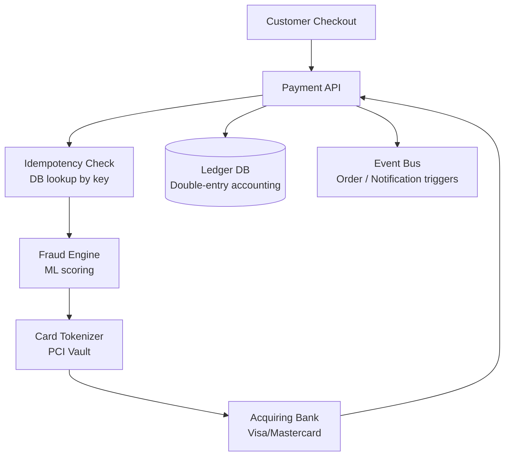

# Design an Online Payment Service

**Difficulty**: 🔴 Advanced
**Reading Time**: Coming Soon
**Interview Frequency**: Very High

---

> 🚧 **Full article coming soon.** This stub gives you the essentials to start thinking about this problem.

---

## The Core Problem

Processing 1 million payments per day with exactly-once semantics and fraud detection — if the network times out after the payment is processed but before the success response returns, the client will retry and potentially charge the customer twice. Every payment system must be idempotent by design, not as an afterthought.

## Functional Requirements

- Accept payments via credit card, bank transfer, or digital wallet
- Process payment through acquiring bank with 3DS authentication
- Notify buyer and seller of payment status in real-time
- Support refunds and chargebacks
- Fraud detection to decline suspicious transactions

## Non-Functional Requirements

| Requirement | Target |
|-------------|--------|
| Availability | 99.99% (52 min/year) — lost transactions = lost revenue |
| Transaction latency | p99 < 3 seconds (user-visible) |
| Exactly-once | Never double-charge |
| PCI compliance | No raw card data stored |

## Back-of-Envelope Estimates

- **Transaction rate**: 1M payments/day ÷ 86,400 = ~11.6 transactions/sec (peak Black Friday: ~100/sec)
- **Fraud checks**: 100% of transactions × 50ms ML inference = must be inline within 3-second budget
- **Ledger records**: 1M transactions/day × 4 ledger entries (double-entry) × 100 bytes = ~400MB/day

## Key Design Decisions

1. **Idempotency Keys** — client generates UUID before calling payment API; server stores (idempotency_key → result) in DB; on retry, return cached result without re-processing; key expires after 24 hours; prevents double-charge on timeout-retry.
2. **Saga Pattern for Distributed Transaction** — payment spans: fraud check → card authorization → inventory reservation → order creation; if any step fails, execute compensating transactions in reverse; avoid 2-phase commit which would lock resources for seconds.
3. **Card Tokenization for PCI Compliance** — never store raw PAN (primary account number); call payment vault to get a token; store token + last-4 + expiry; vault is the only PCI-scoped system; reduces your compliance burden from SAQ D to SAQ A.

## High-Level Architecture

## Top Interview Questions for This Problem

| Question | Tests |
|----------|-------|
| How do you prevent double-charging when the payment times out? | Idempotency keys, at-most-once |
| How do you handle a partial failure in the saga (payment approved but order creation failed)? | Compensating transactions, rollback |
| How would you design the fraud detection system to approve in under 100ms? | ML inference, feature store |

## Related Concepts

- [Digital wallet for balance management](./digital-wallet)
- [Payment gateway for multi-acquirer routing](./payment-gateway)

---

*📚 Full deep-dive with multiple approaches, trade-off tables, and pseudocode coming soon.*

## 📚 Resources & References

| Resource | Type | What You'll Learn |
|----------|------|------------------|
| [System Design Interview Vol 2 — Alex Xu](https://www.amazon.com/System-Design-Interview-Insiders-Guide/dp/1736049119) | 📚 Book | Chapter on designing a payment system with exactly-once guarantees |
| [ByteByteGo — Design a Payment System](https://www.youtube.com/@ByteByteGo) | 📺 YouTube | Search "payment system design" — idempotency, double-spending, reconciliation |
| [Stripe Engineering: Idempotent APIs](https://stripe.com/blog/idempotency) | 📖 Blog | How Stripe uses idempotency keys to make payment APIs retry-safe |
| [Braintree Engineering: Payment Processing](https://articles.braintreepayments.com/reference/security/data-security) | 📚 Docs | Payment card data security — tokenization and vault architecture |
| [Visa Architecture: Payment Network at Scale](https://developer.visa.com/pages/working-with-visa/visa-developer-program) | 📚 Docs | How Visa processes 76,000 transactions per second globally |
