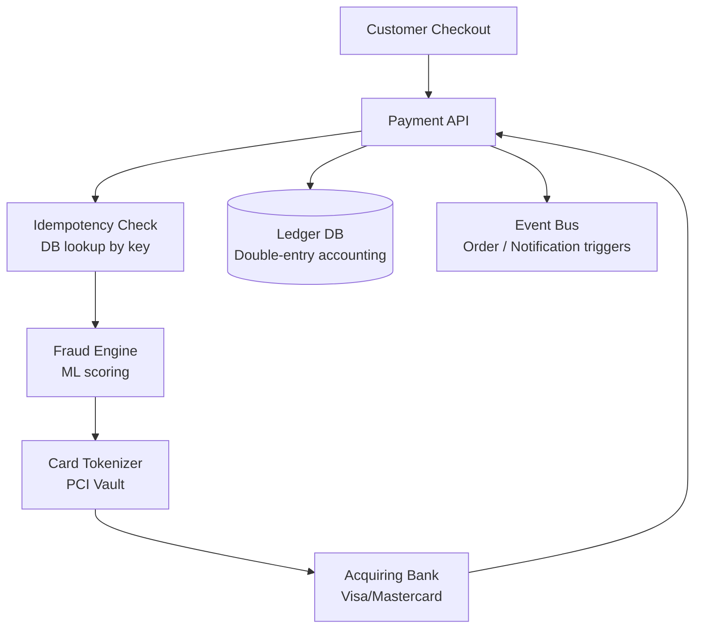
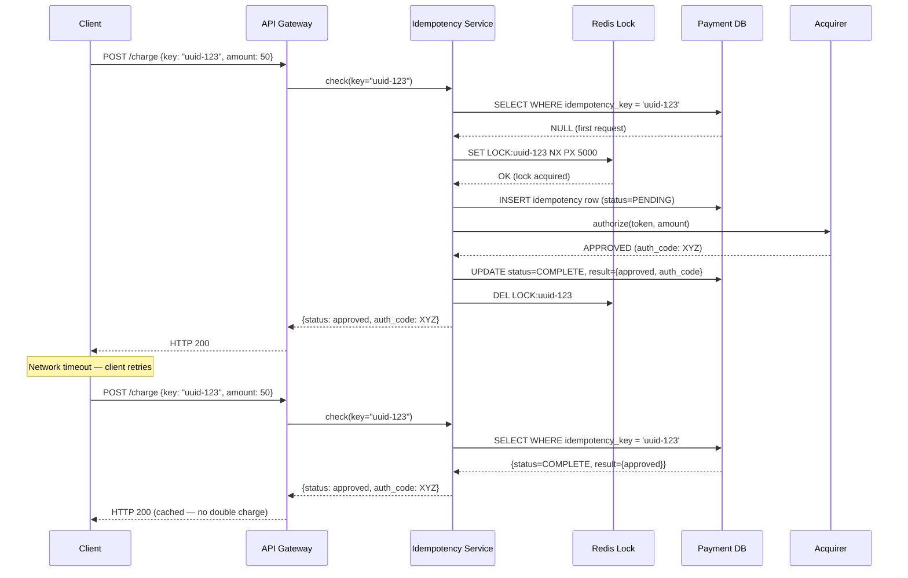
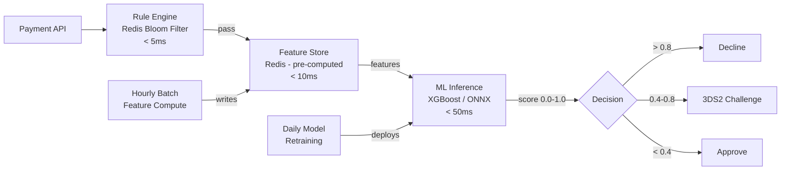
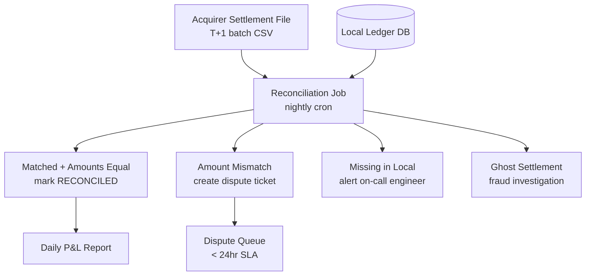
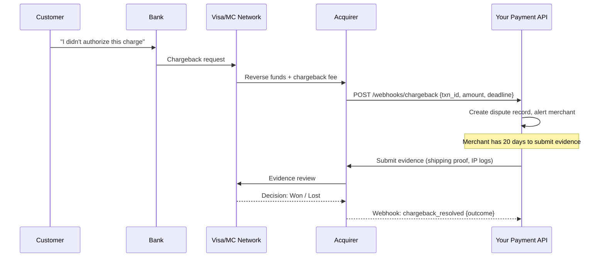

# Design an Online Payment Service

**Difficulty**: 🔴 Advanced
**Reading Time**: Coming Soon
**Interview Frequency**: Very High

---

> 🚧 **Full article coming soon.** This stub gives you the essentials to start thinking about this problem.

---

## The Core Problem

Processing 1 million payments per day with exactly-once semantics and fraud detection — if the network times out after the payment is processed but before the success response returns, the client will retry and potentially charge the customer twice. Every payment system must be idempotent by design, not as an afterthought.

## Functional Requirements

- Accept payments via credit card, bank transfer, or digital wallet
- Process payment through acquiring bank with 3DS authentication
- Notify buyer and seller of payment status in real-time
- Support refunds and chargebacks
- Fraud detection to decline suspicious transactions

## Non-Functional Requirements

| Requirement | Target |
|-------------|--------|
| Availability | 99.99% (52 min/year) — lost transactions = lost revenue |
| Transaction latency | p99 < 3 seconds (user-visible) |
| Exactly-once | Never double-charge |
| PCI compliance | No raw card data stored |

## Back-of-Envelope Estimates

- **Transaction rate**: 1M payments/day ÷ 86,400 = ~11.6 transactions/sec (peak Black Friday: ~100/sec)
- **Fraud checks**: 100% of transactions × 50ms ML inference = must be inline within 3-second budget
- **Ledger records**: 1M transactions/day × 4 ledger entries (double-entry) × 100 bytes = ~400MB/day

## Key Design Decisions

1. **Idempotency Keys** — client generates UUID before calling payment API; server stores (idempotency_key → result) in DB; on retry, return cached result without re-processing; key expires after 24 hours; prevents double-charge on timeout-retry.
2. **Saga Pattern for Distributed Transaction** — payment spans: fraud check → card authorization → inventory reservation → order creation; if any step fails, execute compensating transactions in reverse; avoid 2-phase commit which would lock resources for seconds.
3. **Card Tokenization for PCI Compliance** — never store raw PAN (primary account number); call payment vault to get a token; store token + last-4 + expiry; vault is the only PCI-scoped system; reduces your compliance burden from SAQ D to SAQ A.

## High-Level Architecture



## Top Interview Questions for This Problem

| Question | Tests |
|----------|-------|
| How do you prevent double-charging when the payment times out? | Idempotency keys, at-most-once |
| How do you handle a partial failure in the saga (payment approved but order creation failed)? | Compensating transactions, rollback |
| How would you design the fraud detection system to approve in under 100ms? | ML inference, feature store |

## Related Concepts

- [Digital wallet for balance management](./digital-wallet)
- [Payment gateway for multi-acquirer routing](./payment-gateway)

---

## Component Deep Dive 1: Idempotency Engine

Idempotency is the single most critical correctness guarantee in any payment system. Without it, a network hiccup between the acquirer's ACK and your API's response causes the client to retry — and you charge the customer twice. This is not a theoretical edge case: at 100 transactions/sec, a 30-second network partition generates hundreds of in-flight retries.

### How it Works Internally

Every payment request carries a client-generated idempotency key (UUID v4, typically 36 bytes). On receipt, the Payment API executes:

1. **Atomic conditional insert**: Write `(idempotency_key, status=PENDING, request_hash, created_at)` with a unique constraint on `idempotency_key`. If the row already exists, return the stored result immediately — no downstream calls made.
2. **Request fingerprinting**: Hash the request body alongside the key. If the key matches but the request hash differs, return HTTP 422 — the client is retrying with different parameters, which is illegal.
3. **TTL expiry**: Keys expire after 24 hours. A background job prunes expired rows. Stripe uses 24 hours; PayPal uses 30 days for high-value B2B transactions.
4. **Distributed lock on key**: Before executing the first (non-cached) request, acquire a distributed lock on the idempotency key for 5 seconds. This prevents two identical concurrent retries from both passing the initial lookup and both executing.

### Why Naive Approaches Fail

A simple "check-then-insert" pattern has a TOCTOU race condition. Two concurrent retries both read NULL, both insert, and both proceed to execute. The fix is `INSERT ... ON CONFLICT DO NOTHING` in Postgres, or a Redis `SET NX PX 5000` distributed lock before the DB write. An in-memory cache (e.g., local HashMap) fails because requests may hit different API server instances behind a load balancer.



### Implementation Options

| Approach | Latency | Throughput | Trade-off |
|----------|---------|------------|-----------|
| Postgres unique constraint + `ON CONFLICT DO NOTHING` | 2–5ms (indexed PK lookup) | ~20k ops/sec per node | Durable, ACID; becomes bottleneck at high QPS without sharding |
| Redis `SET NX` as distributed lock + Postgres for durable result | 0.5–1ms lock + 2–5ms DB write | ~80k ops/sec | Faster check; Redis restart loses in-flight lock state — needs careful TTL |
| DynamoDB conditional write (`condition_expression`) | 5–10ms (cross-AZ) | ~40k writes/sec per table | Fully managed, auto-scaling; higher cost per operation vs self-managed Postgres |

---

## Component Deep Dive 2: Fraud Detection Engine

Fraud detection sits in the critical path of every payment. It must run synchronously (inline approval decisions) within a 200ms budget — any slower and the p99 3-second SLA becomes impossible to meet with retries factored in.

### Internal Mechanics

The fraud engine combines three signal layers evaluated sequentially:

1. **Rule engine (< 5ms)**: Hard rules block obvious fraud immediately — velocity limits (>5 transactions in 60 seconds from same card), impossible geography (card used in Tokyo then New York within 2 minutes), known bad BINs (Bank Identification Numbers linked to stolen cards). These are stored in Redis sorted sets or a Bloom filter for O(1) lookup.

2. **Feature store lookup (< 10ms)**: Retrieve pre-computed user features: 30-day spend total, average transaction amount, most frequent merchant categories, device fingerprint history. A feature store (e.g., Feast backed by Redis) serves these as a single batch read in under 10ms. Features are pre-computed offline in hourly batch jobs — do not compute them inline.

3. **ML inference (< 50ms)**: A gradient-boosted tree model (XGBoost or LightGBM — preferred over deep learning for interpretability in financial audits) takes ~200 features and outputs a fraud probability score (0.0–1.0). Score > 0.8 = decline. Score 0.4–0.8 = step-up authentication (3DS2 challenge). Score < 0.4 = approve. Model is served via TensorFlow Serving or custom ONNX runtime, typically on CPU (trees don't benefit from GPU), achieving < 50ms p99.

### Scale Behavior at 10x Load

At 10x baseline (1,000 txn/sec), the ML inference tier becomes the bottleneck. A single inference server handles ~200 req/sec (50ms × 1 thread). You need at minimum 5 inference pods. At 10x, deploy 50 pods behind a load balancer. The feature store Redis cluster must be sized to handle 1,000 multi-key lookups/sec — achievable with a 3-node Redis cluster. Rule engine scales linearly with Redis read replicas.



| Approach | Latency | False Positive Rate | Operational Cost |
|----------|---------|---------------------|-----------------|
| Rules only (no ML) | < 10ms | ~5% (misses sophisticated fraud) | Low — just Redis |
| XGBoost inline inference | 30–50ms p99 | ~0.3% | Medium — 50 pods at 1000 TPS |
| Deep learning (LSTM) | 100–200ms p99 | ~0.15% | High — GPU nodes required; overkill for most |

---

## Component Deep Dive 3: Distributed Saga Orchestrator

A payment spans multiple microservices: fraud check, card authorization, inventory reservation, and order creation. If the card authorizes but inventory reservation fails (item went out of stock), you must release the card authorization. Two-phase commit (2PC) across services is not viable — it holds locks for the duration of all service calls, creating 2–5 second lock windows at p99. That deadlocks at scale.

### How Sagas Work Here

The Saga Orchestrator is a state machine that advances through steps and tracks which compensating transactions to run on failure:

**Forward flow:**
1. `FraudCheck.execute()` → on success → step 2
2. `CardAuthorize.execute()` → on success → step 3
3. `InventoryReserve.execute()` → on success → step 4
4. `OrderCreate.execute()` → on success → COMPLETE

**Compensating flow (step 3 fails):**
- `CardAuthorize.compensate()` → void/release authorization
- `FraudCheck.compensate()` → release fraud hold (no-op for most engines)

The orchestrator persists its state in a Postgres table (`saga_executions`) after every step. If the orchestrator crashes mid-saga, it replays from the last persisted step on restart. This is the outbox pattern applied to saga steps: write state to DB, then call external service, then update state.

### Technical Decisions

Each service exposed in the saga must implement an idempotent compensating transaction. Card authorization void is idempotent at Visa/Mastercard — voiding an already-voided auth returns success. Inventory release is idempotent — releasing a non-held reservation is a no-op. This requirement forces each downstream service to be designed for idempotent operations from day one.

Saga timeout: if a step doesn't complete within 30 seconds (e.g., acquirer is slow), trigger compensation automatically. This prevents sagas from getting stuck indefinitely.

| Orchestration Style | Coupling | Debuggability | Recovery Complexity |
|--------------------|----------|---------------|---------------------|
| Choreography (events) | Low | Hard — trace spans multiple services | High — each service must know when to compensate |
| Orchestration (central state machine) | Medium | Easy — single saga log | Low — orchestrator replays from last state |
| 2PC | High | Moderate | Very High — distributed lock manager needed |

---

## Data Model

```sql
-- Core payment record
CREATE TABLE payments (
    payment_id        UUID PRIMARY KEY DEFAULT gen_random_uuid(),
    idempotency_key   VARCHAR(64) UNIQUE NOT NULL,
    request_hash      CHAR(64) NOT NULL,             -- SHA-256 of request body
    customer_id       UUID NOT NULL,
    merchant_id       UUID NOT NULL,
    amount_minor      BIGINT NOT NULL,               -- in minor units (cents)
    currency          CHAR(3) NOT NULL,              -- ISO 4217 e.g., 'USD'
    card_token        VARCHAR(128),                  -- token from PCI vault, NOT raw PAN
    card_last_four    CHAR(4),
    card_expiry_mm    SMALLINT,
    card_expiry_yyyy  SMALLINT,
    status            VARCHAR(20) NOT NULL DEFAULT 'PENDING',
    -- PENDING | FRAUD_DECLINED | AUTHORIZED | CAPTURED | FAILED | REFUNDED
    acquirer_auth_code VARCHAR(32),
    acquirer_txn_id   VARCHAR(64),
    fraud_score       DECIMAL(5,4),                 -- 0.0000 to 1.0000
    created_at        TIMESTAMPTZ NOT NULL DEFAULT NOW(),
    updated_at        TIMESTAMPTZ NOT NULL DEFAULT NOW(),
    expires_at        TIMESTAMPTZ NOT NULL           -- idempotency key TTL
);

CREATE INDEX idx_payments_customer_id ON payments(customer_id);
CREATE INDEX idx_payments_merchant_id ON payments(merchant_id);
CREATE INDEX idx_payments_status_created ON payments(status, created_at);
CREATE INDEX idx_payments_idempotency ON payments(idempotency_key)
    WHERE expires_at > NOW();   -- partial index for active keys only

-- Double-entry ledger
CREATE TABLE ledger_entries (
    entry_id          UUID PRIMARY KEY DEFAULT gen_random_uuid(),
    payment_id        UUID NOT NULL REFERENCES payments(payment_id),
    account_id        UUID NOT NULL,                -- customer account or merchant account
    entry_type        VARCHAR(10) NOT NULL,         -- 'DEBIT' or 'CREDIT'
    amount_minor      BIGINT NOT NULL,
    currency          CHAR(3) NOT NULL,
    balance_after     BIGINT NOT NULL,              -- denormalized for audit speed
    created_at        TIMESTAMPTZ NOT NULL DEFAULT NOW()
);

CREATE INDEX idx_ledger_account_id ON ledger_entries(account_id, created_at DESC);
CREATE INDEX idx_ledger_payment_id ON ledger_entries(payment_id);

-- Saga execution state
CREATE TABLE saga_executions (
    saga_id           UUID PRIMARY KEY DEFAULT gen_random_uuid(),
    payment_id        UUID NOT NULL REFERENCES payments(payment_id),
    current_step      VARCHAR(50) NOT NULL,
    status            VARCHAR(20) NOT NULL,         -- RUNNING | COMPLETED | COMPENSATING | FAILED
    step_results      JSONB NOT NULL DEFAULT '{}',  -- per-step outputs (auth_code, reservation_id, etc.)
    compensation_log  JSONB NOT NULL DEFAULT '[]',  -- which compensations have run
    started_at        TIMESTAMPTZ NOT NULL DEFAULT NOW(),
    updated_at        TIMESTAMPTZ NOT NULL DEFAULT NOW(),
    timeout_at        TIMESTAMPTZ NOT NULL           -- auto-compensate if exceeded
);

-- Idempotency cache (hot path — can be Redis or Postgres)
CREATE TABLE idempotency_cache (
    idempotency_key   VARCHAR(64) PRIMARY KEY,
    payment_id        UUID,
    response_status   SMALLINT NOT NULL,            -- HTTP status code
    response_body     JSONB NOT NULL,
    created_at        TIMESTAMPTZ NOT NULL DEFAULT NOW(),
    expires_at        TIMESTAMPTZ NOT NULL
);

CREATE INDEX idx_idem_expires ON idempotency_cache(expires_at);
```

---

## Scale Bottlenecks

| Traffic Level | Component That Breaks | Symptoms | Mitigation |
|---------------|----------------------|----------|------------|
| 10x baseline (~120 TPS) | Single Postgres payment writer | Write latency climbs past 50ms p99, connection pool exhausted | Add PgBouncer connection pooler; shard payments table by `customer_id % N`; use read replicas for fraud feature reads |
| 100x baseline (~1,200 TPS) | Idempotency key lookup table | Table scan on expiring keys; lock contention on `idempotency_key` unique index | Move hot idempotency cache to Redis Cluster (3+ shards); partial index on active keys only; set Redis max-memory-policy = allkeys-lru |
| 100x baseline (~1,200 TPS) | Fraud ML inference tier | Pod CPU saturation; p99 inference latency > 200ms | Scale inference pods horizontally (50+ pods); switch to ONNX quantized model (2x speed); pre-warm feature store cache on model warmup |
| 1000x baseline (~12,000 TPS) | Acquirer rate limits | HTTP 429 from Visa/Mastercard; authorization queue backup; payment latency spikes | Multi-acquirer routing (Stripe + Adyen + Braintree); implement acquirer-specific rate-limit buckets with token bucket algorithm; use smart retry with exponential backoff |
| 1000x baseline (~12,000 TPS) | Ledger DB double-entry writes | 4 writes per transaction × 12,000 TPS = 48,000 ledger writes/sec; Postgres max ~20k writes/sec per node | Partition `ledger_entries` by month; use append-only Kafka-backed ledger (Confluent); batch micro-writes into 100ms windows; consider NewSQL (CockroachDB) for global distribution |

---

## How Stripe Built This

Stripe processes over 500 million API requests per day and powers payments for 3+ million businesses. Their engineering blog provides specific details about their architecture decisions.

**Technology choices**: Stripe uses Ruby on Rails for the API layer (for fast iteration, not performance), with critical paths offloaded to Go microservices. The payment processing core runs on bare-metal servers in Stripe-owned datacenters (not AWS) to reduce latency variability and achieve the p99 < 100ms authorization times Visa requires. Their database layer uses MySQL with custom sharding on `account_id`, not Postgres — a non-obvious choice motivated by MySQL's mature row-level locking behavior under high write contention.

**Specific numbers**: Stripe's idempotency key system handles approximately 200 million unique keys per day. Keys are stored in a distributed key-value store with a 24-hour TTL and automatic expiry. Their fraud system (`Stripe Radar`) evaluates over 1,000 signals per transaction including device fingerprinting, behavioral biometrics, and merchant reputation scores, completing ML inference in under 100ms at the 99th percentile.

**Non-obvious architectural decision**: Stripe uses a **nonce-based request deduplication** approach where the idempotency key is bound to a specific API version and API key. This means that if a merchant rotates their API key (a security best practice), old idempotency keys from the previous API key cannot be replayed — preventing a class of key-rotation-based replay attacks that naive UUID-only systems miss.

**Stripe's outbox pattern**: Every payment state transition writes an event to an `outbox` table in the same Postgres transaction as the state update. A separate relay process tails this table and publishes to Kafka. This guarantees that downstream services (order service, notification service) always receive exactly one event per payment state change, even if the relay crashes mid-publish.

Source: [Stripe Engineering Blog — Idempotent Requests](https://stripe.com/blog/idempotency), [Stripe — Building Reliable Systems at Scale (StripeConf 2022)](https://stripe.com/blog/stripe-infrastructure-availability)

---

## Interview Angle

**What the interviewer is testing:** The ability to reason about distributed systems correctness — specifically, how to guarantee exactly-once semantics across network boundaries where retries are unavoidable, while keeping the system performant enough to meet user-facing SLAs.

**Common mistakes candidates make:**

1. **Saying "use a transaction" to prevent double-charging**: Transactions solve local atomicity, but the problem is distributed — the payment has already been authorized at the bank before your API crashes. A DB transaction cannot roll back a Visa authorization that's already in-flight.

2. **Generating the idempotency key server-side**: If the server generates the key and returns it in the response, but the response is lost, the client retries with a new request (no key), and gets charged again. The key must be client-generated before the first request, so retries can carry the same key.

3. **Ignoring the saga compensation failure case**: Candidates describe the saga happy path but don't handle "what if the compensation itself fails?" (e.g., the card authorization void call times out). The answer: compensating transactions must also be idempotent and retried via a dead-letter queue until success — you cannot give up on releasing a held authorization.

**The insight that separates good from great answers:** The best candidates distinguish between **at-most-once** (never double-charge, but may miss a charge) and **exactly-once** (never double-charge AND never miss a charge). A naive idempotency implementation achieves at-most-once. True exactly-once requires that the idempotency key persist its `PENDING` state durably *before* calling the acquirer, so if the orchestrator crashes after the acquirer approves but before updating to `COMPLETE`, a recovery job can reconcile the acquirer's transaction log against the local `PENDING` rows and mark them `COMPLETE` — not re-execute them.

---

## Key Numbers to Remember

| Metric | Value | Context |
|--------|-------|---------|
| Visa peak throughput | 76,000 TPS globally | Network-level capacity across all acquirers |
| Stripe daily API requests | 500M+ requests/day | ~5,800 req/sec average, ~50k req/sec peak |
| Fraud ML inference budget | < 100ms p99 | Must fit inside 3-second user-visible SLA |
| Idempotency key TTL | 24 hours (Stripe) | Safe replay window for client retries |
| Ledger entries per payment | 4 entries (double-entry) | Debit customer, credit merchant, debit escrow, credit fee |
| PCI DSS SAQ A scope | Card data never touches your server | Achieved via iframe + tokenization; reduces audit scope from 300+ controls to 22 |
| Saga compensation timeout | 30 seconds | Auto-trigger compensation if step exceeds this |
| Acquirer authorization hold | 7 days (consumer) / 30 days (B2B) | Authorization expires if not captured — must capture within this window |

---

## Reconciliation and Settlement

No payment system is complete without a reconciliation layer. Authorization and capture happen in real time, but the actual money movement (settlement) is a batch process that runs once per day. Discrepancies between your internal ledger and the acquirer's settlement file are normal — and dangerous if left undetected.

### How Settlement Works

1. **Authorization** (real-time): Your system calls the acquirer, which places a hold on the customer's card. No money has moved. The authorization hold is valid for 7 days.
2. **Capture** (real-time or delayed): You call capture to instruct the acquirer to collect the funds. E-commerce typically captures immediately; hotels and car rentals capture at checkout with the final amount.
3. **Settlement** (batch, T+1 or T+2): The acquirer batches all captured transactions and submits them to the card network (Visa/Mastercard), which settles funds into your merchant bank account. You receive a settlement file (CSV or ISO 8583 format) the next business day.

### Reconciliation Process

Every night, a reconciliation job runs:

```
For each row in acquirer_settlement_file:
  Find matching payment in local ledger by acquirer_txn_id
  If not found: flag as MISSING_LOCAL — potential lost revenue
  If found but amounts differ: flag as AMOUNT_MISMATCH — investigate immediately
  If found and matches: mark as RECONCILED

For each local CAPTURED payment not in settlement file:
  If older than 2 business days: flag as NOT_SETTLED — resubmit or investigate
```

Reconciliation mismatches fall into four categories:
- **Timing differences** (T+1 lag): The most common — transaction captured today won't appear in settlement until tomorrow. Resolve by re-running reconciliation the next day.
- **Amount mismatches**: Partial captures, currency conversion rounding, or acquirer fees applied differently than expected.
- **Missing settlements**: Capture requests that the acquirer never received (network failure after your write). Fix: retry capture with the original idempotency key.
- **Ghost settlements**: The acquirer settled an amount with no matching local record. Rare — investigate immediately for fraud or system bugs.



### Why This Matters in Interviews

Most candidates forget reconciliation entirely. Mentioning it signals production awareness — at scale, even a 0.01% mismatch rate means 100 broken transactions per million. At Stripe's volume, that's 50,000 discrepancies per day without a reconciliation system.

---

## PCI DSS Compliance Architecture

PCI DSS (Payment Card Industry Data Security Standard) is not optional — any system that handles cardholder data must comply or face fines up to $100,000/month and potential loss of payment processing privileges.

### Scope Reduction via Tokenization

The key architectural goal is to minimize PCI scope — the set of systems that must comply with all 300+ PCI DSS controls. Every system that touches raw card data (PAN, CVV, expiry) is in scope.

**SAQ D (full scope)**: Your servers handle raw card numbers → all 300+ controls apply → ~6 months of audit work, ~$50k/year.

**SAQ A (minimal scope)**: Card data is entered in an iframe hosted by your payment processor (Stripe.js, Braintree Drop-in UI) → raw PAN never touches your servers → only 22 controls apply.

The architectural implication: use a client-side JavaScript library (Stripe.js) that renders a card input iframe from Stripe's domain. The browser sends card data directly to Stripe's PCI-scoped vault. Stripe returns a single-use token. Your server only ever sees the token. Your servers are SAQ A scope.

### What You DO Store (Safely)

| Field | Store? | Notes |
|-------|--------|-------|
| Raw PAN (card number) | Never | Tokenize at Stripe/Braintree vault |
| CVV / CVC2 | Never | Not even tokenized — discard after auth |
| Full magnetic stripe data | Never | PCI prohibits storage post-auth |
| Card token (from vault) | Yes | Safe to store; useless without vault |
| Last 4 digits | Yes | For display only (e.g., "Visa ending 4242") |
| Expiry month/year | Yes | Needed for recurring billing checks |
| Cardholder name | Yes | Low sensitivity; still encrypt at rest |
| Billing address | Yes | Used for AVS (Address Verification System) fraud check |

### Encryption at Rest and in Transit

All payment data must be encrypted at rest (AES-256) and in transit (TLS 1.2+). Key management must use an HSM (Hardware Security Module) — a tamper-proof device that holds encryption keys and never exposes them in plaintext. AWS CloudHSM or HashiCorp Vault with a PKCS#11 backend are common choices. Key rotation must happen at least annually, with zero-downtime rotation strategies (envelope encryption: data keys encrypted by a master key; rotate master key, re-encrypt data keys without touching data).

---

## Retry and Timeout Strategy

Payment API calls to acquirers have variable latency (50ms p50, 2,000ms p99 during peak). A naive fixed timeout of 3 seconds causes two failure modes: timeout too short → legitimate transactions fail; timeout too long → users wait 3+ seconds on errors.

### Timeout Budget Decomposition

Total user-visible budget: 3,000ms

| Step | Budget | Notes |
|------|--------|-------|
| API gateway overhead | 10ms | TLS termination, auth |
| Idempotency check | 5ms | Redis or indexed Postgres lookup |
| Fraud engine (rules) | 5ms | Redis Bloom filter |
| Fraud engine (ML) | 80ms | XGBoost inference |
| Card tokenization | 20ms | Vault lookup (cached token) |
| Acquirer authorization | 1,500ms | p99 budget for external call |
| Ledger write | 20ms | Postgres write + replicate |
| Event publish | 10ms | Kafka async — fire and forget |
| Response serialization | 5ms | JSON marshal |
| **Total** | **1,655ms** | **~1,345ms headroom for retries** |

### Retry Policy

Acquirer calls use exponential backoff with jitter:
- Attempt 1: immediate
- Attempt 2: wait 200ms ± 50ms jitter
- Attempt 3: wait 400ms ± 100ms jitter
- Give up after attempt 3, return HTTP 504 to client

Crucially, retries to the acquirer must carry the same idempotency key. Visa and Mastercard support retriable authorization requests via the `original_transaction_id` field — the acquirer deduplicates on their side too.

**Circuit breaker**: If the acquirer's error rate exceeds 10% in a 30-second window, open the circuit and route to a backup acquirer (if multi-acquirer routing is configured). This prevents cascading timeouts from exhausting the thread pool of the entire Payment API service.

---

## Refund and Chargeback Flow

Refunds and chargebacks are two distinct mechanisms for returning money — they are often confused in interviews.

### Refund (merchant-initiated)

A refund is initiated by the merchant (your system) when the customer requests their money back within your return policy window (typically 30–90 days). Flow:

1. Customer requests refund via your API.
2. Your system looks up the original `payment_id`, verifies refundable amount (can be partial), creates a `REFUND_PENDING` ledger entry.
3. Call acquirer's refund API with the original `acquirer_txn_id` and refund amount. The acquirer credits the customer's card.
4. Settlement of refund appears in next day's settlement file (negative amount). Reconciliation matches it against the `REFUND_PENDING` row.
5. Notify customer via email/webhook.

Partial refunds require tracking `amount_refunded` against `amount_original` to prevent over-refunding. Use a `payment_refunds` table (one payment → many refund rows, each with their own idempotency key).

### Chargeback (customer-initiated, via bank)

A chargeback bypasses your system entirely. The customer disputes the charge with their bank. The bank issues a reversal directly through the card network. Your acquirer notifies you via webhook (typically 1–7 days after the dispute). You have a fixed window (usually 20 calendar days) to submit evidence (shipping proof, signed terms, IP logs) via the acquirer's dispute portal. If you lose, the funds are clawed back plus a $15–$25 chargeback fee.

Chargeback rate above 1% of transactions triggers Visa's Dispute Monitoring Program — potential fines and risk of losing payment processing capability. Fraud detection directly reduces chargeback rate, which is why it is worth investing in even at low transaction volumes.



### Idempotency for Refunds

Refund requests from clients must also be idempotent. If the refund API call times out, the client may retry. Use the same idempotency key pattern: client sends `refund_idempotency_key` with each refund request. The server stores `(refund_idempotency_key → refund_result)` in the same idempotency cache. On retry, return the stored result — do not re-issue the refund to the acquirer.

---

## Monitoring and Alerting

A payment system requires tighter monitoring than typical web services because failures directly translate to lost revenue and customer trust erosion.

### Key Metrics to Track

| Metric | Alert Threshold | Why It Matters |
|--------|----------------|----------------|
| Authorization success rate | < 95% in any 5-min window | Drop indicates acquirer issues or fraud spike |
| Payment API p99 latency | > 2,500ms | Approaching user-visible SLA breach |
| Fraud decline rate | > 3% or < 0.5% | Spike = attack; drop = model degraded |
| Idempotency cache hit rate | < expected baseline | Surge in retries = client-side issue or network instability |
| Saga stuck count | > 0 for > 5 min | Compensation not triggering — operational emergency |
| Chargeback rate (weekly) | > 0.8% | Approaching Visa's 1% threshold |
| Reconciliation mismatch rate | > 0.05% | Settlement discrepancies growing |
| Acquirer circuit breaker state | OPEN | Immediate page — route to backup acquirer |

### Distributed Tracing

Every payment request should carry a `trace_id` (W3C Trace Context format) propagated through all downstream calls: fraud engine, vault, acquirer, ledger. This enables end-to-end tracing in Jaeger or Datadog APM for debugging latency spikes. Without trace correlation, diagnosing "why was this specific payment slow?" requires log scraping across 6 services manually.

Store the `trace_id` in the `payments` table so support engineers can pull the full trace for any payment ID in one query.

---

## API Contract Design

### Payment Initiation Request

```json
POST /v1/payments
{
  "idempotency_key": "550e8400-e29b-41d4-a716-446655440000",
  "amount": {
    "value": 5000,
    "currency": "USD"
  },
  "payment_method": {
    "type": "card",
    "token": "tok_visa_4242",
    "last_four": "4242",
    "expiry_month": 12,
    "expiry_year": 2027
  },
  "merchant_id": "merch_abc123",
  "order_id": "order_xyz789",
  "metadata": {
    "customer_ip": "203.0.113.42",
    "device_fingerprint": "fp_a1b2c3d4",
    "user_agent": "Mozilla/5.0 ..."
  }
}
```

### Payment Response (success)

```json
HTTP 200 OK
{
  "payment_id": "pay_9f8e7d6c5b4a",
  "status": "AUTHORIZED",
  "amount": { "value": 5000, "currency": "USD" },
  "auth_code": "831729",
  "acquirer_txn_id": "vis_20260101_XYZ",
  "fraud_score": 0.12,
  "created_at": "2026-06-01T10:30:00Z",
  "idempotency_key": "550e8400-e29b-41d4-a716-446655440000"
}
```

### Error Responses

| HTTP Status | Code | Meaning |
|------------|------|---------|
| 402 | `card_declined` | Acquirer declined — tell user to try another card |
| 409 | `idempotency_key_mismatch` | Same key, different request body — client bug |
| 422 | `fraud_declined` | Fraud score above threshold — do not reveal reason |
| 429 | `rate_limit_exceeded` | Too many requests — retry after `Retry-After` header |
| 504 | `acquirer_timeout` | Acquirer did not respond — safe to retry with same idempotency key |

Note: Never return `fraud_declined` with a specific reason (e.g., "velocity limit exceeded"). Revealing fraud rules to the caller helps fraudsters tune their attacks. Return a generic decline message to the user; log the real reason internally.

---

*📚 Resources & References below.*

## 📚 Resources & References

| Resource | Type | What You'll Learn |
|----------|------|------------------|
| [System Design Interview Vol 2 — Alex Xu](https://www.amazon.com/System-Design-Interview-Insiders-Guide/dp/1736049119) | 📚 Book | Chapter on designing a payment system with exactly-once guarantees |
| [ByteByteGo — Design a Payment System](https://www.youtube.com/@ByteByteGo) | 📺 YouTube | Search "payment system design" — idempotency, double-spending, reconciliation |
| [Stripe Engineering: Idempotent APIs](https://stripe.com/blog/idempotency) | 📖 Blog | How Stripe uses idempotency keys to make payment APIs retry-safe |
| [Braintree Engineering: Payment Processing](https://articles.braintreepayments.com/reference/security/data-security) | 📚 Docs | Payment card data security — tokenization and vault architecture |
| [Visa Architecture: Payment Network at Scale](https://developer.visa.com/pages/working-with-visa/visa-developer-program) | 📚 Docs | How Visa processes 76,000 transactions per second globally |
