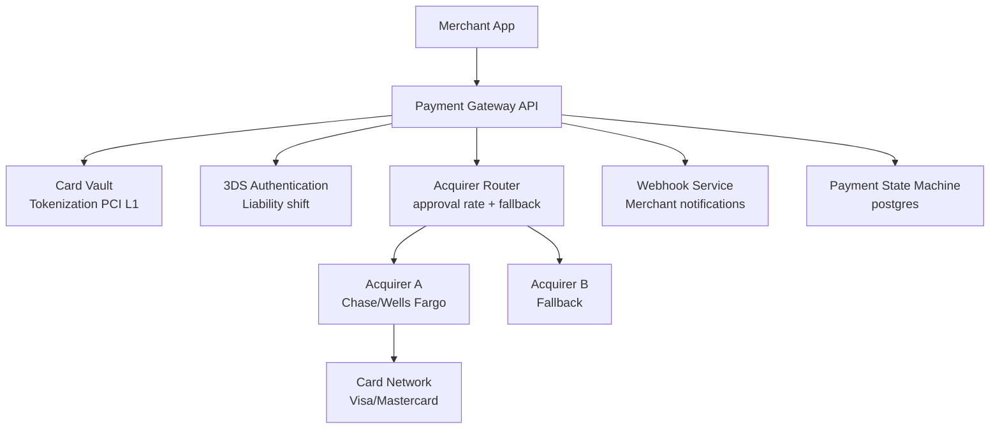
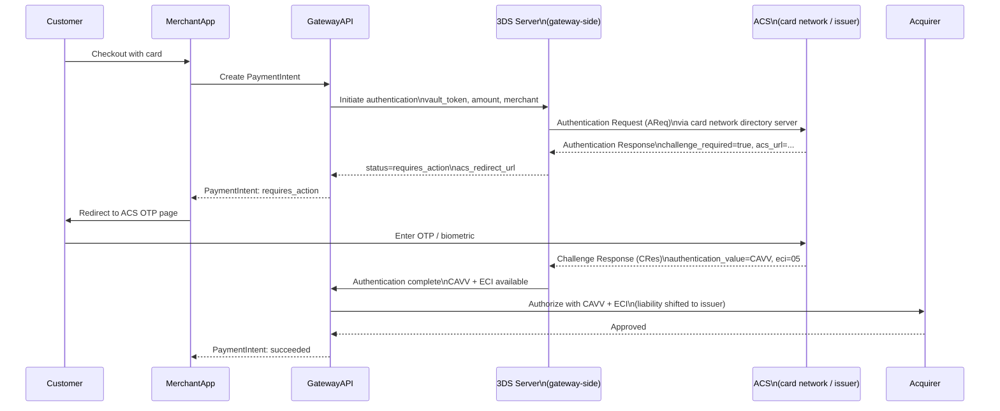
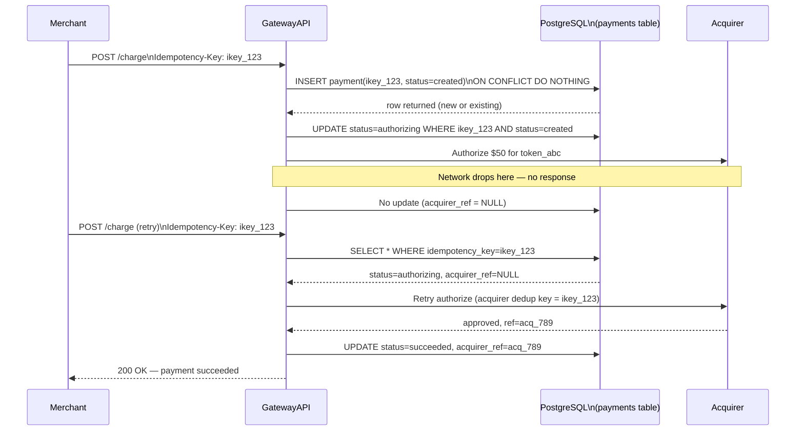
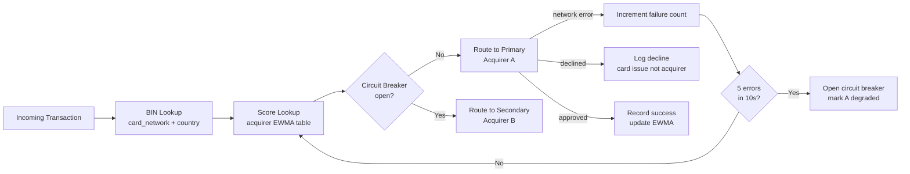
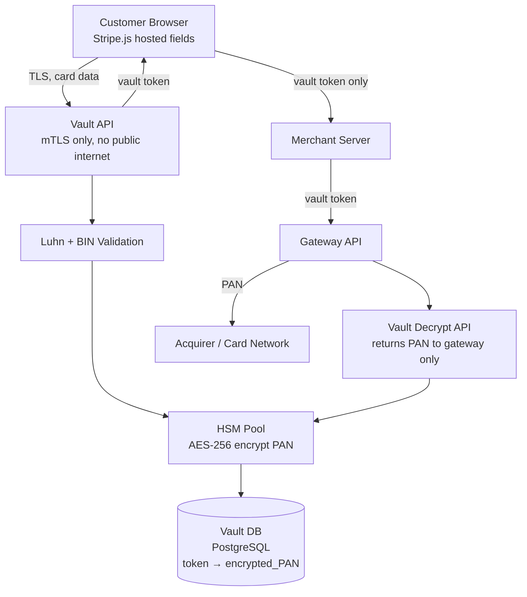
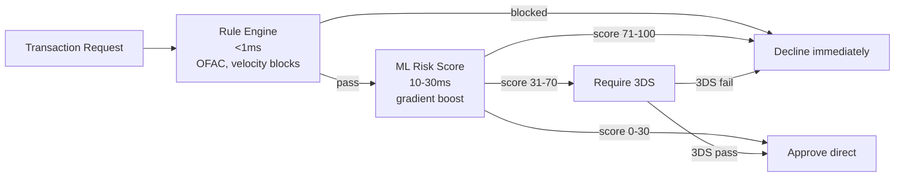
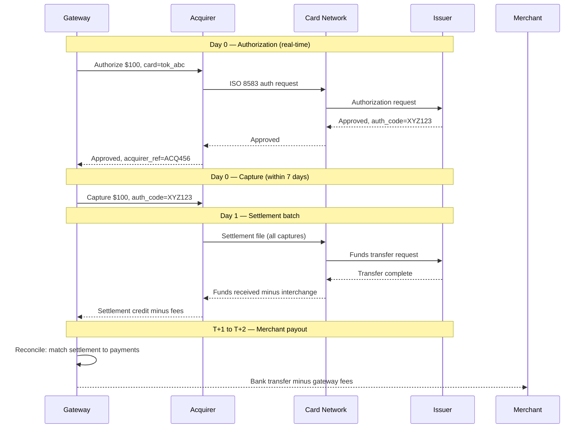

# Design a Payment Gateway (Stripe)

**Difficulty**: 🔴 Advanced
**Reading Time**: 25 min
**Interview Frequency**: High

---

## The Core Problem

Routing payments through multiple acquiring banks with retry logic and idempotency — when Acquirer A is down or has low approval rates for a card type, the gateway must transparently failover to Acquirer B without double-charging the customer. This requires knowing payment state at all times and making retries safe.

## Functional Requirements

- Accept card payments from merchants via API
- Route to appropriate acquirer based on card type, geography, approval rates
- Handle 3DS authentication for European cards (SCA mandate)
- Provide webhooks to merchants for payment status updates
- Support refunds and dispute management

## Non-Functional Requirements

| Requirement | Target |
|-------------|--------|
| Availability | 99.999% (5 min/year) — revenue depends on uptime |
| Transaction latency | p99 < 2 seconds end-to-end |
| PCI-DSS Level 1 | Full compliance required |
| Throughput | 100K transactions/sec at peak |

## Back-of-Envelope Estimates

- **Transaction volume**: 100K tx/sec peak × 100 bytes = 10MB/sec transaction log
- **Acquirer fallback rate**: 2% acquirer failure rate × 100K tx/sec = 2,000 fallback attempts/sec
- **Webhook delivery**: 100K tx/sec × 3 webhook events avg = 300K webhook deliveries/sec

## Key Design Decisions

1. **State Machine for Payment** — payment states: created → authenticating → authorizing → capturing → succeeded/failed; each transition is atomic; gateway can determine current state on any retry and only advance forward, never re-execute completed steps.
2. **Acquirer Routing with Fallback** — maintain real-time approval rate per (acquirer × card_type × geography); route to highest approval-rate acquirer; if 3 consecutive failures, mark acquirer degraded and route to secondary; retest primary every 5 minutes.
3. **Card Data Vault with Tokens** — on card entry, immediately replace PAN with vault token; all downstream processing uses token; only the vault (isolated, PCI Level 1 system) can decrypt PAN; reduces attack surface for the rest of the system.

## High-Level Architecture



## 3DS Authentication Flow

3DS (3D Secure) is the authentication protocol mandated by EU PSD2 regulation for Strong Customer Authentication (SCA). It involves three parties — the merchant's domain, the card network's Access Control Server (ACS), and the issuer — in a redirect flow that must complete before authorization can proceed. It is mandatory for EU cards above €30 and strongly recommended for high-risk transactions globally (it shifts fraud liability from the merchant to the issuer upon successful 3DS completion).

### The Flow

The key design challenge is that 3DS is inherently asynchronous from the gateway's perspective. The gateway initiates the 3DS flow, the customer is redirected to the issuer's OTP page, and the gateway must wait — potentially 2–10 minutes — for the customer to complete authentication before proceeding with authorization. This cannot be a blocking HTTP request; the gateway must suspend the payment and resume it upon receiving a callback from the ACS.



The CAVV (Cardholder Authentication Verification Value) and ECI (Electronic Commerce Indicator) returned by the ACS are included in the authorization message to the acquirer. These values cryptographically prove that 3DS was completed. Without them, the authorization is treated as unauthenticated and the merchant bears fraud liability.

**Frictionless flow**: For low-risk transactions, the ACS can approve 3DS without presenting a challenge to the customer (no OTP required). The ACS uses device fingerprinting, transaction history, and ML to decide. Roughly 70–80% of 3DS transactions qualify for frictionless flow — the customer never sees an OTP prompt and the entire 3DS round-trip adds only 50–200ms to checkout.

---

## Top Interview Questions for This Problem

| Question | Tests |
|----------|-------|
| How do you ensure a payment isn't charged twice if the acquirer connection drops mid-request? | Idempotency, state machine |
| How do you handle acquirer outages without merchants knowing? | Failover routing, circuit breaker |
| What is 3DS and when is it required? | European SCA, liability shift |
| How does card tokenization reduce PCI-DSS scope? | Security architecture, vault isolation |
| How does the settlement flow differ from the authorization flow? | End-to-end payment lifecycle understanding |
| How would you design the webhook delivery system to guarantee at-least-once delivery? | Outbox pattern, retries, idempotency at delivery layer |
| How does fraud scoring work inline with authorization? | ML pipeline, latency budget, risk thresholds |
| How would you handle key rotation for the card vault without downtime? | HSM key management, lazy re-encryption, key versioning |

## Related Concepts

- [Online payment service for merchant-level design](./online-payment)
- [Digital wallet for stored-value balance management](./digital-wallet)

---

## Component Deep Dive 1: Payment State Machine with Idempotency

The payment state machine is the most critical component in any payment gateway. Without it, you face the "double charge" problem: a network timeout between the gateway and the acquirer leaves you with no knowledge of whether the authorization succeeded. If you retry naively, the customer may be charged twice. If you don't retry, you silently fail a valid payment.

### How It Works Internally

Every payment is represented as a row in a durable database (PostgreSQL at Stripe) with an explicit `status` field and an append-only `events` table that records every transition. A payment begins in the `created` state when the merchant submits the charge. The state machine only ever advances forward: `created → authenticating → authorizing → capturing → succeeded`. There is no backwards transition.

The idempotency key — sent by the merchant in the `Idempotency-Key` HTTP header — is stored as a unique index on the payments table. On the first request, a row is inserted with `status = created`. On any duplicate request with the same idempotency key, the database `INSERT ... ON CONFLICT DO NOTHING` returns the existing row, and the gateway returns the current state without re-executing any step. This prevents double charges even when the merchant retries aggressively after a timeout.

The critical insight is that retrying at the wrong layer is the source of most payment bugs. If the gateway retries a network call to the acquirer without first checking whether the acquirer already processed the request, you get a double authorization. The state machine forces all retries to be state-aware: before calling the acquirer, check whether `status = authorizing` is already recorded. If so, only retry if no acquirer response exists in the events table.

### Why Naive Approaches Fail at Scale

A simple "try-catch-retry" loop fails because the failure point is the network, not the application. The acquirer may have received and processed the request before the TCP connection dropped. A stateless retry will submit a second authorization request. At 100K tx/sec with 2% acquirer timeout rate, that is 2,000 potential double charges per second.

A distributed lock (e.g., Redis SETNX) partially solves this but introduces its own failure mode: if the gateway node crashes while holding the lock, the lock TTL must expire before any other node can retry. During that window (typically 30 seconds), the payment is stuck. For a 99.999% SLA, a 30-second stuck window is unacceptable at high volume.

The correct solution is database-level idempotency: the payment row IS the lock, and the `status` field encodes exactly what has already happened.

### Sequence Diagram: Idempotent Retry Flow



### Trade-off: State Machine Storage Options

| Approach | Latency | Throughput | Trade-off |
|----------|---------|------------|-----------|
| PostgreSQL with row-level lock | 2–5ms | 50K tx/sec per node | Strong consistency, ACID guarantees; vertical scaling only |
| CockroachDB distributed SQL | 5–15ms | 200K tx/sec across cluster | Geo-distributed consistency; higher p99 due to consensus overhead |
| DynamoDB with conditional writes | 1–3ms | 500K tx/sec | Eventually consistent reads can expose stale state; need conditional expression on every write |

Stripe uses PostgreSQL with careful sharding by `merchant_id`. The primary key on `(idempotency_key, merchant_id)` keeps deduplication fast. They shard to distribute writes, but within a shard everything is a single-node ACID transaction — no distributed transaction coordinator needed.

---

## Component Deep Dive 2: Acquirer Router with Circuit Breaker

The acquirer router decides which bank (acquirer) to forward each authorization request to. It looks simple — "pick the best acquirer" — but at scale it must continuously learn from live traffic, react to degraded acquirers in milliseconds, and make routing decisions at 100K tx/sec with sub-millisecond overhead.

### Internal Mechanics

The router maintains an in-memory score for each `(acquirer_id, card_network, currency, geography)` tuple. The score is the exponentially weighted moving average (EWMA) of the approval rate over the last 5 minutes:

```
score = alpha * new_approval_rate + (1 - alpha) * old_score
alpha = 0.1   # slow to react to noise, fast enough to catch degradation
```

For each incoming transaction, the router:
1. Extracts BIN (first 6 digits of card number) to identify card network and issuing country.
2. Looks up the top-2 scorers for `(card_network, issuing_country)`.
3. Selects Acquirer A (primary). If circuit breaker is open for A, immediately routes to Acquirer B.
4. If Acquirer A returns a network error (not a card decline), records a failure and decrements the score.
5. After 5 consecutive network errors in a 10-second window, opens the circuit breaker. All traffic routes to B.
6. After 5 minutes, sends 1% probe traffic to A. If probe succeeds, closes the breaker.

### Scale Behavior at 10x Load

At 1M tx/sec (10x baseline), the bottleneck is not the router logic (pure in-memory, <0.5ms) but the state synchronization between router replicas. Each router replica independently tracks approval rates. If they diverge, one replica may keep routing to a degraded acquirer longer than another.

Mitigation: replicas publish aggregated stats every 500ms to a shared Redis stream. Each replica reads the stream and merges the stats. This introduces at most 1 second of lag in detecting degradation — acceptable given the 10-second circuit breaker window.

### Acquirer Router Flow



### Trade-off: Routing Strategy

| Strategy | Approval Rate Gain | Complexity | Failure Mode |
|----------|-------------------|------------|--------------|
| Static routing (card network → acquirer) | Baseline | Low | Doesn't adapt to live degradation |
| EWMA approval rate per BIN range | +3–5% vs static | Medium | Slow to detect sudden acquirer outage (10s lag) |
| ML model per transaction (Adyen approach) | +5–8% vs static | High | Model drift, cold start for new card types, 50ms inference overhead |

Stripe uses EWMA routing with circuit breakers. Adyen uses an ML model they call "Smart Routing" that factors in issuer, card type, transaction amount, and time-of-day to predict approval likelihood per acquirer.

---

## Component Deep Dive 3: Card Vault and Tokenization

The card vault is an isolated service that is the only system allowed to see raw PANs (Primary Account Numbers). Every other service — the router, state machine, webhook service, risk engine — sees only a vault token (e.g., `tok_visa_4242...`). If the router is compromised, the attacker gets tokens, not real card numbers. This "scope reduction" is the core of PCI-DSS Level 1 compliance.

### How Tokenization Works

When a card is entered via Stripe's hosted fields (JavaScript loaded from Stripe's CDN, not the merchant's domain), the card data travels directly from the browser to the vault service over TLS. The vault:

1. Validates the Luhn checksum and BIN range.
2. Generates a random 128-bit token (not derived from the PAN — pure random, not reversible without the vault).
3. Stores `(token → encrypted_PAN, encrypted_CVV_ephemeral, expiry)` in a dedicated HSM-backed database.
4. Returns the token to the browser / merchant API layer.
5. Destroys the CVV immediately after the first authorization (CVV storage beyond auth is a PCI violation).

A critical implementation detail: the token must be format-preserving if the downstream systems require a "card number"-shaped string (16 digits, Luhn-valid). Format-Preserving Encryption (FPE, standardized as FF3-1 in NIST SP 800-38G) produces a 16-digit encrypted output from a 16-digit PAN. This is useful when the vault token needs to pass through legacy systems that validate card number format without being able to decrypt the actual value.

### Vault Architecture Diagram



### Scale Behavior

The vault is read-heavy at authorization time: every authorization requires a vault lookup to decrypt the PAN before forwarding to the acquirer. At 100K tx/sec, the vault handles 100K decrypt operations per second. Hardware Security Modules (HSMs) — which perform the decryption — typically handle 5,000–20,000 RSA operations per second per unit. At 100K tx/sec, you need 5–20 HSMs in a pool, with keys distributed across them.

At 1M tx/sec (10x), the HSM pool becomes the hard limit. Mitigation: pre-decrypt PANs into an in-memory encrypted cache with a 30-second TTL (covering the 2-second auth window with margin). Cache hit rate for repeat customers reduces vault load by 40–60%.

An alternative at extreme scale is **network tokenization**: Visa Token Service (VTS) and Mastercard Digital Enablement Service (MDES) let the gateway replace the PAN with a network token issued by the card network itself. The acquirer can process the network token directly without the gateway needing to decrypt it. This bypasses the vault entirely on the hot path, eliminating HSM as a bottleneck. Stripe has supported Visa network tokenization since 2022, citing a 2–3% improvement in authorization rates as a secondary benefit (issuers approve network tokens at higher rates because they carry device binding signals).

### Security Isolation

The vault runs in a separate network segment with no egress to the public internet. All other services call the vault via an internal mTLS API. The vault service's only dependencies are the HSM pool and its own dedicated PostgreSQL cluster. Vault nodes cannot be reached from the application tier — only the API gateway (running as a sidecar on vault nodes) can initiate vault calls, and it requires a short-lived certificate from an internal PKI to do so.

**Key rotation**: AES encryption keys in the HSM are rotated every 90 days. Rotation is online — new tokens use the new key, old tokens are lazily re-encrypted on the next read. The vault maintains a `key_version` column alongside the encrypted PAN so it always knows which key to use for decryption. At 100M stored tokens, a forced rotation (re-encrypt all) would require approximately 55 hours at 500K re-encrypts/second — so lazy rotation is the only practical option at scale.

---

## Fraud Detection and Risk Scoring

Fraud detection runs inline on every authorization request. The risk engine must return a score in under 100ms (p99) because the authorization call to the acquirer waits for the score. A fraud engine that adds 500ms to checkout kills conversion — Stripe data shows every 100ms of checkout latency reduces conversion by 1%.

### Signal Sources

The risk engine assembles features from multiple sources before scoring:

| Signal Category | Examples | Latency to Retrieve |
|----------------|----------|---------------------|
| Device fingerprint | Browser user-agent, screen resolution, IP, timezone | Embedded in API request — 0ms |
| Behavioral signals | Time on checkout page, mouse movement patterns, copy-paste vs typed card number | Embedded in Stripe.js payload — 0ms |
| Card velocity | # charges to this vault token in last 1h / 24h / 7d | Redis counter lookup — 1–2ms |
| Merchant velocity | # declines at this merchant in last 5min | Redis counter — 1–2ms |
| IP reputation | IP in known fraud list, VPN/proxy detection, geolocation vs billing address | In-memory bloom filter + Redis — 2–5ms |
| Cross-merchant signals | Is this card associated with chargebacks at other merchants? | Shared Redis HyperLogLog per vault token — 2ms |
| Issuer response patterns | How often does this BIN decline / request 3DS? | Pre-computed BIN stats in Redis — 1ms |

Total feature assembly: 5–10ms. ML inference (gradient boosted tree or small neural net): 10–30ms. Total risk scoring: p50=20ms, p99=80ms.

### Risk Decision

The engine outputs a score from 0 (definitely legitimate) to 100 (definitely fraud). The gateway applies three rules:

- **Score 0–30**: Approve without 3DS. Fastest checkout path.
- **Score 31–70**: Request 3DS authentication. If 3DS passes, proceed. Shifts liability to issuer.
- **Score 71–100**: Block the transaction. Return `decline_code: fraud_suspected` to the merchant.

The 3DS threshold is tunable per merchant. A merchant selling high-value electronics may lower the threshold to 20, accepting more friction in exchange for lower fraud losses. A merchant selling low-cost digital goods may raise it to 60, optimizing for conversion.

### Rule Engine vs ML Model

Most production gateways run a hybrid: a fast rule engine (deterministic rules like "block if IP is in OFAC sanction list") runs first, then the ML model scores what the rules don't catch. Rules run in <1ms; ML runs in 10–30ms. This ensures sanctioned transactions are blocked without ML overhead.



---

## Data Model

```sql
-- Core payments table (sharded by merchant_id)
CREATE TABLE payments (
    payment_id          UUID            PRIMARY KEY DEFAULT gen_random_uuid(),
    idempotency_key     VARCHAR(255)    NOT NULL,
    merchant_id         UUID            NOT NULL,
    amount_cents        BIGINT          NOT NULL CHECK (amount_cents > 0),
    currency            CHAR(3)         NOT NULL,   -- ISO 4217, e.g. 'USD'
    vault_token         VARCHAR(64)     NOT NULL,   -- token from card vault, never PAN
    status              payment_status  NOT NULL DEFAULT 'created',
    acquirer_id         SMALLINT,                   -- FK to acquirers table
    acquirer_ref        VARCHAR(64),                -- acquirer's transaction ID (for dedup)
    acquirer_response   JSONB,                      -- raw response blob
    risk_score          SMALLINT,                   -- 0-100 from fraud engine
    three_ds_ref        VARCHAR(64),                -- 3DS authentication reference
    created_at          TIMESTAMPTZ     NOT NULL DEFAULT now(),
    authorized_at       TIMESTAMPTZ,
    captured_at         TIMESTAMPTZ,
    failed_at           TIMESTAMPTZ,
    failure_code        VARCHAR(32),                -- e.g. 'insufficient_funds', 'do_not_honor'
    metadata            JSONB                       -- merchant-supplied key-value pairs
);

CREATE TYPE payment_status AS ENUM (
    'created', 'authenticating', 'authorizing',
    'authorized', 'capturing', 'succeeded',
    'failed', 'refunded', 'disputed'
);

-- Unique index enforces idempotency per merchant
CREATE UNIQUE INDEX payments_idempotency_idx
    ON payments (merchant_id, idempotency_key);

-- Hot path: merchant dashboard queries by merchant + status
CREATE INDEX payments_merchant_status_idx
    ON payments (merchant_id, status, created_at DESC);

-- Payment events log — append only, never updated
CREATE TABLE payment_events (
    event_id        UUID            PRIMARY KEY DEFAULT gen_random_uuid(),
    payment_id      UUID            NOT NULL REFERENCES payments(payment_id),
    event_type      VARCHAR(64)     NOT NULL,  -- e.g. 'authorization_requested', 'acquirer_response_received'
    previous_status payment_status,
    new_status      payment_status,
    actor           VARCHAR(32),               -- 'gateway', 'merchant', 'card_network'
    payload         JSONB           NOT NULL,
    created_at      TIMESTAMPTZ     NOT NULL DEFAULT now()
);

CREATE INDEX payment_events_payment_idx ON payment_events (payment_id, created_at);

-- Acquirer health tracking (updated by router replicas every 500ms)
CREATE TABLE acquirer_stats (
    acquirer_id     SMALLINT        NOT NULL,
    card_network    VARCHAR(16)     NOT NULL,  -- 'visa', 'mastercard', 'amex'
    currency        CHAR(3)         NOT NULL,
    country         CHAR(2)         NOT NULL,  -- ISO 3166-1 alpha-2
    window_start    TIMESTAMPTZ     NOT NULL,
    attempt_count   INT             NOT NULL DEFAULT 0,
    success_count   INT             NOT NULL DEFAULT 0,
    approval_rate   NUMERIC(5,4)    NOT NULL,  -- EWMA, e.g. 0.9734
    circuit_open    BOOLEAN         NOT NULL DEFAULT false,
    PRIMARY KEY (acquirer_id, card_network, currency, country, window_start)
);

-- Webhook delivery table (outbox pattern)
CREATE TABLE webhook_deliveries (
    delivery_id     UUID            PRIMARY KEY DEFAULT gen_random_uuid(),
    merchant_id     UUID            NOT NULL,
    payment_id      UUID            NOT NULL,
    event_type      VARCHAR(64)     NOT NULL,
    endpoint_url    VARCHAR(512)    NOT NULL,
    payload         JSONB           NOT NULL,
    status          VARCHAR(16)     NOT NULL DEFAULT 'pending',  -- pending, delivered, failed
    attempt_count   SMALLINT        NOT NULL DEFAULT 0,
    next_attempt_at TIMESTAMPTZ     NOT NULL DEFAULT now(),
    delivered_at    TIMESTAMPTZ,
    last_response   JSONB,
    created_at      TIMESTAMPTZ     NOT NULL DEFAULT now()
);

CREATE INDEX webhook_pending_idx
    ON webhook_deliveries (status, next_attempt_at)
    WHERE status IN ('pending', 'failed');
```

---

## Scale Bottlenecks

| Traffic Level | Component That Breaks | Symptoms | Mitigation |
|---------------|----------------------|----------|------------|
| 10x baseline (1M tx/sec) | PostgreSQL write throughput on `payments` table | p99 insert latency climbs from 3ms to 50ms+; replication lag grows | Shard by `merchant_id` across 20 PostgreSQL clusters; use connection pooling (PgBouncer) to cap connections at 1,000 per node |
| 10x baseline | Webhook delivery queue depth | Merchants report status update delays of 30+ seconds | Scale webhook workers horizontally; switch from polling the DB to consuming a Kafka topic; partition by `merchant_id` to preserve ordering |
| 100x baseline (10M tx/sec) | HSM pool decrypt capacity | Authorization latency spikes; vault queue backlog grows | Pre-decrypt into encrypted in-memory cache (AES-256, 30s TTL); add HSM nodes; for trusted repeat customers, use network tokenization (Visa Token Service) to bypass vault entirely |
| 100x baseline | Acquirer stat synchronization via Redis | Router replicas disagree on acquirer health for up to 5 seconds; some replicas continue routing to degraded acquirer | Reduce Redis publish interval from 500ms to 100ms; add local circuit breaker that triggers on 3 errors in 5s before syncing to Redis |
| 1000x baseline (100M tx/sec) | Single-region SQL bottleneck | Cross-region latency adds 50–150ms to every authorization | Deploy active-active across 3 regions (US, EU, APAC); use regional sharding — European cards processed in EU region; cross-region replication for reporting only |
| 1000x baseline | Card network rate limits | Visa/Mastercard impose per-gateway rate limits (typically 50M auth/day per BIN range) | Distribute across multiple network principal membership IDs; pre-negotiate burst limits with card networks |

---

## Settlement and Reconciliation Flow

One aspect of payment gateways that is almost always omitted in interviews is the settlement cycle. Authorization is only step 1. Money does not move at authorization time — it moves at settlement, which is a batch process that runs once per day per acquirer (in most card network schemes).

The gateway must track two separate flows:

1. **Authorization flow** (real-time, online): Gateway → Acquirer → Card Network → Issuer. Result: an authorization hold on the cardholder's account. No money moves yet.
2. **Capture and settlement flow** (batch, T+1): At end of day, the acquirer sends a settlement file to the card network with all authorized transactions. The issuer transfers funds to the acquirer, who credits the merchant's account (minus interchange fees) within 1–2 business days.

The gateway must correlate authorization records with settlement records to detect:
- **Settlement failures**: An authorized transaction is not settled (e.g., merchant never captured). The authorization expires after 7 days and the hold is released. The merchant receives no funds.
- **Chargebacks**: A cardholder disputes a charge. The issuer initiates a chargeback, debiting the acquirer, who debits the gateway, who debits the merchant. The gateway must track dispute state machine separately from the payment state machine.
- **Interchange fee reconciliation**: Each transaction carries an interchange fee (typically 1.5–2.5% for consumer cards) that is netted out of the settlement. The gateway must verify that the fee applied matches the rate card for the card type + merchant category code.



The reconciliation service runs nightly, joining the `payments` table against settlement files received from each acquirer. Any `authorized` payment not appearing in the settlement file within 48 hours triggers an alert — the gateway must either re-attempt capture or contact the acquirer for manual resolution.

---

## How Stripe Built This

Stripe's payment infrastructure is one of the best-documented cases of building a payment gateway at extreme scale. By 2023 Stripe processed over $1 trillion in annual payment volume across 195 countries, handling peaks of several hundred thousand transactions per second.

**State machine with PostgreSQL**: Stripe's core payment state machine runs on PostgreSQL, sharded by `merchant_id`. Each shard handles roughly 5,000 tx/sec in steady state. The `idempotency_key` is the cornerstone of their API contract — Stripe's public documentation explicitly tells merchants to retry with the same key on any network error. This is not a suggestion; it is a hard requirement for their correctness guarantee.

**Radar — ML fraud engine**: Stripe runs a machine learning fraud engine called Radar that scores every transaction in under 100ms using features extracted from the vault token, merchant, device fingerprint, and behavioral signals. Radar processes 500+ features per transaction. The model is updated daily. Radar's false positive rate is under 0.1% (1 in 1,000 legitimate transactions flagged), while blocking a significant fraction of fraudulent charges. Stripe publishes the aggregate stats in their annual "The State of Online Fraud" reports.

**Payment intents API**: Stripe's major architectural evolution was the PaymentIntents API (launched 2019), which encapsulates the full payment lifecycle — including 3DS authentication — in a single server-side object. Previously, merchants had to manage 3DS state in their own code, leading to double charges when the redirect flow failed. With PaymentIntents, the state machine lives entirely at Stripe. The merchant simply polls or receives a webhook when the intent reaches `succeeded` or `requires_action`.

**Distributed tracing**: Every payment carries a `trace_id` that propagates through all internal services. Stripe uses an internal OpenTelemetry-based tracing system to reconstruct the full path of any transaction — from merchant API call through vault, Radar, router, acquirer, and webhook delivery — in a single trace. This is essential for debugging: when a merchant reports "my payment failed at 3:47pm," support can pull the trace and see the exact acquirer decline code and which Radar rule triggered.

**Source**: Stripe Engineering Blog — "Designing robust and predictable APIs with idempotency" (stripe.com/blog/idempotency), Stripe Sessions conference talks (2019–2023), and Patrick Collison's public interviews on Stripe's infrastructure philosophy.

---

## Interview Angle

**What the interviewer is testing:** The ability to design for correctness under failure — specifically, can the candidate reason about what happens when a network call succeeds at the remote end but the response is lost, and how to make the system safe to retry.

**Common mistakes candidates make:**

1. **Treating idempotency as an afterthought.** Candidates add "and we'll use an idempotency key" as a bullet point without explaining how it is enforced at the database level. The correct answer is a unique index on `(merchant_id, idempotency_key)` with an `INSERT ... ON CONFLICT DO NOTHING` — not application-level duplicate checking, which has TOCTOU races.

2. **Conflating card declines with system failures.** A decline from the acquirer (`insufficient_funds`, `do_not_honor`) is NOT a retryable error. Only network errors and 5xx responses from the acquirer warrant retry. Candidates who say "retry all failures" will re-attempt declined payments, annoying issuers and potentially triggering fraud blocks.

3. **Ignoring the 3DS redirect loop.** 3DS authentication involves a browser redirect to the card network's ACS page, a callback to the gateway, and then an authorization. Many candidates design 3DS as a synchronous step and draw it inline in the sequence diagram. In reality, the authorization cannot proceed until the ACS callback arrives — this can take 30+ seconds for a user filling in their OTP. The gateway must suspend the payment object and resume it upon callback, requiring a durable state machine, not a blocking RPC call.

**The insight that separates good from great answers:** The acquirer deduplication key is not the same as the merchant idempotency key. When retrying an authorization request to an acquirer, the gateway must send a vendor-specific deduplication field (e.g., Visa's `x_transaction_id`, Mastercard's `retrieval_reference_number`). This tells the acquirer "I already sent this — if you processed it, don't process it again." Without this, even a perfectly idempotent gateway can cause double charges because the acquirer's network stack processes the retry as a new transaction. Great candidates mention this acquirer-level idempotency as a separate layer from gateway-level idempotency.

---

## Common Production Failure Scenarios

Understanding how payment gateways fail in production separates engineers who have thought deeply about this domain from those who have not.

### Scenario 1: Split-Brain During Acquirer Failover

**What happens**: Two router replicas simultaneously detect that Acquirer A has exceeded the error threshold. Replica 1 opens the circuit breaker and routes to Acquirer B. Replica 2, with slightly stale stats, does not open the circuit breaker and continues routing to Acquirer A. For 500ms (until the next Redis sync), roughly half the traffic still goes to the degraded Acquirer A.

**Impact**: 500ms of elevated errors at 2,000 tx/sec = 1,000 transactions hit the degraded acquirer. If the degraded acquirer returns timeouts (not declines), these transactions retry to Acquirer B, doubling effective load on B momentarily.

**Mitigation**: Each router replica independently opens its local circuit breaker after 3 consecutive errors (regardless of Redis state). This local breaker triggers in <100ms without waiting for Redis sync. The Redis sync is used only to coordinate re-enabling the breaker — a conservative majority vote across replicas before declaring the acquirer recovered.

### Scenario 2: Webhook Delivery Thundering Herd

**What happens**: The webhook service goes down for 10 minutes (deployment, DB connection exhaustion). When it recovers, it has 300K × 10min × 3 events = 54 million queued webhook deliveries. If the service processes these at maximum speed (50K deliveries/sec), it floods merchants' endpoints with 50K requests/sec simultaneously — most merchants' servers can't handle a sudden 100x spike in webhook traffic, causing their servers to return 5xx errors, which the gateway retries, compounding the flood.

**Impact**: Widespread merchant server overload. Ironically, the retry loop delays delivery further — a merchant that would have gotten caught up in 18 minutes now takes hours because the gateway keeps retrying failed deliveries alongside new ones.

**Mitigation**: Apply per-merchant rate limiting on webhook delivery (e.g., max 100 requests/sec per merchant endpoint). On service recovery, drain the backlog at the rate limit, not at maximum speed. Use an exponential backoff with jitter on retries to spread the retry storm over time.

### Scenario 3: Idempotency Key Collision at High Volume

**What happens**: A merchant generates idempotency keys using `UUID.randomUUID()` on a JVM node with a poorly seeded PRNG. At 10K tx/sec across 50 application nodes, the probability of a UUID4 collision is negligible mathematically (birthday paradox: need 2^61 UUIDs for 50% collision probability). But if the merchant uses `timestamp_millisecond + random_4_digits` as a "UUID," collisions occur at 10K tx/sec within minutes (10K tx/sec / 10K possible last-4-digits = ~1 collision per second).

**Impact**: Two different customers' payments map to the same idempotency key. The second customer sees the first customer's payment response — potentially a success for a different amount, or a failure. The gateway has correctly deduplicated based on the key, but the key itself was not unique.

**Mitigation**: The gateway cannot fix bad merchant idempotency keys. Documentation must clearly specify that idempotency keys must be globally unique per merchant (not just per API key or per session). Stripe's docs specify UUID v4 explicitly. The gateway can add a warning in the dashboard when it detects a high collision rate on idempotency keys from a single merchant.

---

## Key Numbers to Remember

| Metric | Value | Context |
|--------|-------|---------|
| Stripe annual volume | $1 trillion+ | As of 2023; ~$30K/sec in payment value at average order size |
| Peak authorization throughput | 100K–500K tx/sec | Stripe-scale during Black Friday; 5x normal peak |
| Idempotency window | 24 hours | Stripe honors idempotency keys for 24h; after that, same key = new charge |
| Acquirer circuit breaker threshold | 5 errors in 10 seconds | Typical production setting; opens circuit, redirects all traffic to secondary |
| 3DS authentication timeout | 10 minutes | Maximum wait for user to complete OTP before payment expires |
| HSM throughput | 5,000–20,000 decrypt/sec per unit | Determines vault capacity; 100K tx/sec requires 5–20 HSMs |
| Radar ML scoring latency | <100ms p99 | Must complete before authorization to avoid adding latency to checkout |
| Webhook retry schedule | Exponential backoff: 1s, 5s, 30s, 2m, 10m, 1h, 6h, 24h | After 72 hours without delivery, webhook is marked failed |
| PCI-DSS scope reduction via tokenization | ~95% | Tokenization removes 95% of system components from PCI scope |
| Approval rate improvement from smart routing | +3–8% | EWMA routing vs. static routing, measured across acquirers |
| 3DS frictionless rate | 70–80% | Transactions that complete 3DS without presenting OTP challenge to user |
| 3DS challenge completion time | 30s–3 min | Time for user to complete OTP; payment intent must hold state during this window |
| Settlement cycle | T+1 to T+2 | Time from authorization capture to funds credited to merchant bank account |
| Chargeback window | 120 days | Maximum time a cardholder has to dispute a charge (Visa rule) |
| Network tokenization auth rate uplift | +2–3% | Visa Token Service tokens authorized at higher rates than raw PANs due to device binding |
| Fraud loss rate (industry avg) | 0.05–0.10% of GMV | Basis points of gross merchandise value lost to fraud at a well-run gateway |
| PCI QSA audit cost | $50K–$500K/year | Annual cost of PCI Level 1 compliance audit for a full payment gateway |

---

## 📚 Resources & References

| Resource | Type | What You'll Learn |
|----------|------|------------------|
| [ByteByteGo — Design a Payment Gateway](https://www.youtube.com/@ByteByteGo) | 📺 YouTube | Search "payment gateway design" — routing, settlement, and fraud detection |
| [Stripe Engineering: How Stripe Works](https://stripe.com/blog) | 📖 Blog | Inside Stripe's payment infrastructure — routing, retries, and SLA guarantees |
| [Stripe — Designing robust APIs with idempotency](https://stripe.com/blog/idempotency) | 📖 Blog | The definitive guide to idempotency keys from the team that built it |
| [Adyen Engineering: Payment Processing](https://www.adyen.com/knowledge-hub/payment-processing) | 📖 Blog | How Adyen routes payments to maximize authorization rates globally |
| [PCI DSS PCI Compliance Guide](https://www.pcisecuritystandards.org/) | 📚 Docs | Mandatory security standards for payment gateway operators |
| [Square Engineering: Developer Platform](https://developer.squareup.com/blog/) | 📖 Blog | Building a developer-friendly payment API with strong consistency |
| [Visa Token Service Technical Specification](https://developer.visa.com/capabilities/vts) | 📚 Docs | Network tokenization spec — how to bypass the vault on the hot path |
| [EMVCo 3DS Specification](https://www.emvco.com/emv-technologies/3d-secure/) | 📚 Docs | Official 3DS 2.x protocol specification — authentication flow, CAVV, ECI codes |
| [NIST SP 800-38G: Format-Preserving Encryption](https://csrc.nist.gov/publications/detail/sp/800-38g/final) | 📚 Docs | FF3-1 algorithm used for format-preserving tokenization of card numbers |
