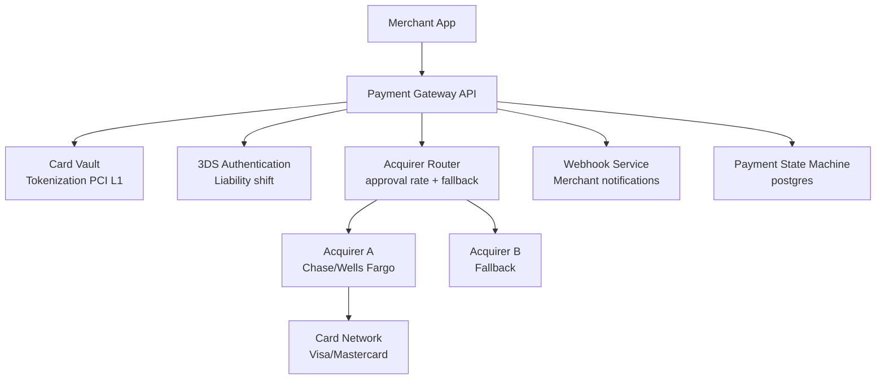

# Design a Payment Gateway (Stripe)

**Difficulty**: 🔴 Advanced
**Reading Time**: Coming Soon
**Interview Frequency**: High

---

> 🚧 **Full article coming soon.** This stub gives you the essentials to start thinking about this problem.

---

## The Core Problem

Routing payments through multiple acquiring banks with retry logic and idempotency — when Acquirer A is down or has low approval rates for a card type, the gateway must transparently failover to Acquirer B without double-charging the customer. This requires knowing payment state at all times and making retries safe.

## Functional Requirements

- Accept card payments from merchants via API
- Route to appropriate acquirer based on card type, geography, approval rates
- Handle 3DS authentication for European cards (SCA mandate)
- Provide webhooks to merchants for payment status updates
- Support refunds and dispute management

## Non-Functional Requirements

| Requirement | Target |
|-------------|--------|
| Availability | 99.999% (5 min/year) — revenue depends on uptime |
| Transaction latency | p99 < 2 seconds end-to-end |
| PCI-DSS Level 1 | Full compliance required |
| Throughput | 100K transactions/sec at peak |

## Back-of-Envelope Estimates

- **Transaction volume**: 100K tx/sec peak × 100 bytes = 10MB/sec transaction log
- **Acquirer fallback rate**: 2% acquirer failure rate × 100K tx/sec = 2,000 fallback attempts/sec
- **Webhook delivery**: 100K tx/sec × 3 webhook events avg = 300K webhook deliveries/sec

## Key Design Decisions

1. **State Machine for Payment** — payment states: created → authenticating → authorizing → capturing → succeeded/failed; each transition is atomic; gateway can determine current state on any retry and only advance forward, never re-execute completed steps.
2. **Acquirer Routing with Fallback** — maintain real-time approval rate per (acquirer × card_type × geography); route to highest approval-rate acquirer; if 3 consecutive failures, mark acquirer degraded and route to secondary; retest primary every 5 minutes.
3. **Card Data Vault with Tokens** — on card entry, immediately replace PAN with vault token; all downstream processing uses token; only the vault (isolated, PCI Level 1 system) can decrypt PAN; reduces attack surface for the rest of the system.

## High-Level Architecture

## Top Interview Questions for This Problem

| Question | Tests |
|----------|-------|
| How do you ensure a payment isn't charged twice if the acquirer connection drops mid-request? | Idempotency, state machine |
| How do you handle acquirer outages without merchants knowing? | Failover routing, circuit breaker |
| What is 3DS and when is it required? | European SCA, liability shift |

## Related Concepts

- [Online payment service for merchant-level design](./online-payment)
- [Digital wallet for stored-value balance management](./digital-wallet)

---

*📚 Full deep-dive with multiple approaches, trade-off tables, and pseudocode coming soon.*
