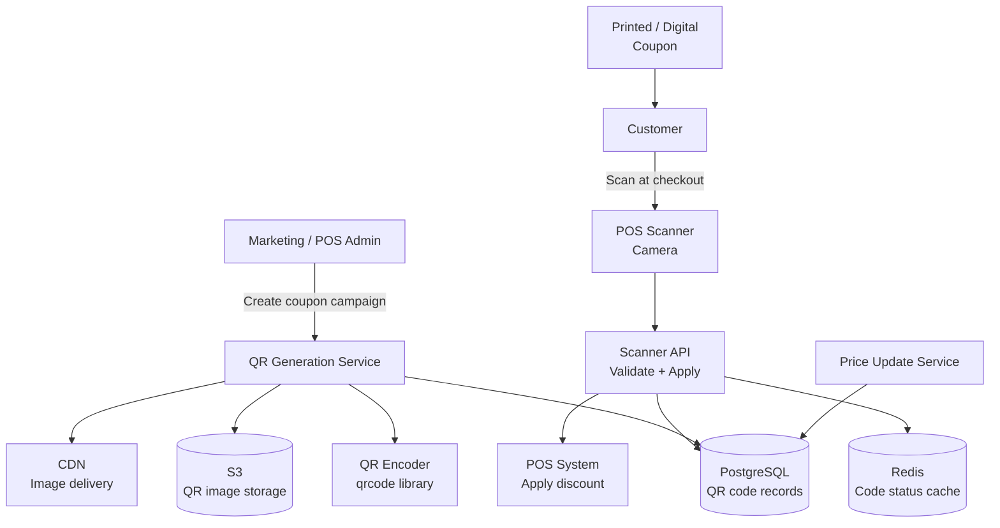

# Design a QR Code System for Grocery Checkout

**Difficulty**: 🟡 Intermediate
**Reading Time**: ~20 minutes
**The Core Problem**: How do you generate QR codes for grocery checkout that encode product/price info, support dynamic pricing, and prevent counterfeiting — while scanning in < 200ms at the register?

---

## Table of Contents

1. [Requirements](#1-requirements)
2. [Capacity Estimation](#2-capacity-estimation)
3. [High-Level Architecture](#3-high-level-architecture)
4. [QR Code Technical Fundamentals](#4-qr-code-technical-fundamentals)
5. [Static vs Dynamic QR Codes](#5-static-vs-dynamic-qr-codes)
6. [HMAC Signature for Anti-Counterfeiting](#6-hmac-signature-for-anti-counterfeiting)
7. [Scanner API Pipeline](#7-scanner-api-pipeline)
8. [Error Handling](#8-error-handling)
9. [Key Design Decisions](#9-key-design-decisions)
10. [Interview Questions](#10-interview-questions)
11. [Key Takeaways](#11-key-takeaways)
12. [References](#12-references)

---

## 1. Requirements

### Functional
- Generate QR codes for promotional coupons and dynamic pricing
- QR code encodes: product ID, discount amount, expiry, HMAC signature
- Scanner at checkout validates and applies discount
- Dynamic QR codes: price can change server-side without reprinting
- Anti-counterfeiting: altered or copied QR codes are detected

### Non-Functional
- **Scan latency**: < 200ms from scan to price applied
- **Scale**: 10M QR codes in circulation, 100k scans/day
- **Reliability**: Works offline (static QR fallback for packaged goods)
- **Security**: Forged or replayed QR codes must be rejected

---

## 2. Capacity Estimation

| Metric | Estimate |
|--------|----------|
| Active QR codes | 10M |
| Scans/day | 100k |
| Scans/sec (peak) | 100k / 86400 × 5× = **6 scans/sec** (trivial) |
| QR code image size | 8KB (500×500 PNG) |
| Total image storage | 10M × 8KB = **80 GB** |
| Code database | 10M × 200 bytes = **2 GB** |
| HMAC validation | 100k × 0.1ms = trivial CPU |

---

## 3. High-Level Architecture



---

## 4. QR Code Technical Fundamentals

### QR Code Versions & Capacity
```
QR Code Version determines grid size and data capacity:
  Version 1:   21×21 modules,  ~25 alphanumeric chars
  Version 5:   37×37 modules,  ~64 alphanumeric chars
  Version 10:  57×57 modules,  ~174 alphanumeric chars
  Version 40:  177×177 modules, ~4296 alphanumeric chars

For grocery coupon (product_id + discount + expiry + HMAC):
  Data: "P:12345|D:10%|EXP:20240315|SIG:a1b2c3d4e5f6a1b2" = 52 chars
  Version 5 (37×37) is sufficient

Error Correction Levels:
  L (7%):  Can recover if 7% of code is obscured/damaged
  M (15%): Standard for most uses
  Q (25%): Good for environments with possible damage
  H (30%): Maximum error correction (larger QR, fewer data bytes)

For grocery coupon: Level M is appropriate
  - Can survive small tears or ink smudges on printed coupon
```

### Reed-Solomon Error Correction
```
QR codes use Reed-Solomon codes (same used in CDs, QR was inspired by it):
  Adds redundant data blocks
  If modules are damaged: missing data can be mathematically reconstructed

Example: Level M QR code with 50 chars of data:
  Actual encoded: 50 data bytes + 22 error correction bytes = 72 bytes
  Can recover up to 11 bytes of damage (22/2 = 11)
  Appears as: QR still scans even if 22% of the image is covered/damaged
```

---

## 5. Static vs Dynamic QR Codes

### Static QR Code
```
All data encoded directly in QR:
  QR encodes: "product_id=12345&discount=10%&expires=2024-03-15&sig=abc..."

Pros: Works offline (scanner doesn't need internet)
Cons: Price cannot be changed; each price variant needs new QR image
Use case: Shelf labels, packaged product barcodes

Generation:
  1. Marketing sets discount: 10% off product 12345, expires March 15
  2. System generates HMAC: sig = HMAC-SHA256(secret, "12345:10:20240315")
  3. Encodes all data into QR image
  4. QR printed on coupon / shelf edge
```

### Dynamic QR Code
```
QR encodes only a lookup key; server provides current value:
  QR encodes: "https://checkout.store.com/qr/abc123def456"

At scan time:
  1. Scanner reads URL from QR
  2. Calls: GET https://checkout.store.com/qr/abc123def456
  3. Server returns: { product_id: 12345, discount: "10%", expires: "2024-03-15" }
  4. Server can update discount anytime without reprinting QR

Pros: Price updatable; rich analytics (scan counts, locations)
Cons: Requires internet at scan time; server must be fast (< 200ms)
Use case: Digital coupons in-app, restaurant menus, loyalty offers
```

---

## 6. HMAC Signature for Anti-Counterfeiting

Anyone can read a QR code and create a modified copy. HMAC prevents this.

### How HMAC Works in This Context
```
Generation (server-side):
  payload = "product_id=12345&discount=20&expires=20240315"
  secret_key = "store_coupon_secret_v2"  # stored securely in KMS
  signature = HMAC-SHA256(secret_key, payload)[:16]  # first 16 hex chars = 64 bits
  qr_data = payload + "&sig=" + signature

Validation (scanner-side):
  1. Parse QR data → extract payload and signature
  2. Recompute: expected_sig = HMAC-SHA256(secret_key, payload)[:16]
  3. Compare: sig == expected_sig (constant-time comparison to prevent timing attacks)
  4. If mismatch → reject "Invalid coupon"

Attack attempts:
  Attacker reads QR: product_id=12345&discount=20&sig=a1b2c3d4...
  Attacker modifies: product_id=12345&discount=90%
  Attacker CANNOT compute correct sig (doesn't know secret_key)
  → Scanner rejects modified QR
```

### Replay Attack Prevention (for single-use coupons)
```
Problem: customer scans QR, discount applied. Customer screenshots QR.
         Later, customer presents screenshot again. Same sig is valid.

Solution:
  Option A: Track used QR codes in DB/Redis (single-use enforcement)
    key: qr:used:{signature_hex}
    SET NX → if key exists, coupon already used

  Option B: Include UUID in QR, mark as used in DB
    Each generated QR has unique scan_id (UUID)
    After scan: UPDATE qr_codes SET used=true, used_at=now WHERE scan_id=?
    Check before applying: WHERE scan_id=? AND used=false
```

---

## 7. Scanner API Pipeline

```
POST /api/scan
{
  "qr_data": "product_id=12345&discount=20&expires=20240315&sig=a1b2c3d4",
  "store_id": "store_789",
  "cashier_id": "emp_456",
  "transaction_id": "txn_111"
}

Processing (< 200ms SLA):
  1. Parse QR data [1ms]
  2. Validate HMAC signature [< 1ms]
  3. Check expiry: expires_at > NOW() [< 1ms]
  4. Check used status (Redis SET NX) [2ms]
  5. Lookup product (DB / cache) [5ms]
  6. Apply discount to transaction [< 1ms]
  7. Log redemption to DB [async, doesn't block response]

Response:
{
  "success": true,
  "discount": { "type": "percent", "value": 20 },
  "product": { "id": 12345, "name": "Organic Milk 1L" },
  "original_price": 3.99,
  "discounted_price": 3.19
}

Error cases:
  400: QR data malformed
  401: Invalid HMAC signature
  410: Coupon expired
  409: Coupon already used
```

---

## 8. Error Handling

```
Offline mode (store internet down):
  Static QRs: scan works fully offline (validation logic on POS device)
  Dynamic QRs: require internet; POS shows "Discount unavailable — network error"
  Mitigation: sync discount cache to POS every 15 minutes (works offline up to 15min)

Camera scan failure (damaged QR):
  Level M error correction recovers from 15% damage
  For worse damage: cashier can manually enter the printed code below QR

HMAC secret rotation:
  Rotate secret annually
  During rotation: accept both old and new secrets for 30-day overlap period
  After 30 days: decommission old secret
  Key versions: include key_version=v2 in QR payload
```

---

## 9. Key Design Decisions

| Decision | Option A | Option B | Choice & Reason |
|----------|----------|----------|-----------------|
| QR type | Static (data in QR) | Dynamic (URL + server lookup) | **Depends**: static for shelf labels (offline, no reprinting); dynamic for digital/app coupons (updatable) |
| Error correction | Level L (7%) | Level H (30%) | **Level M (15%)** — balance between reliability (survives moderate damage) and QR size |
| Anti-counterfeiting | QR checksum only | HMAC signature | **HMAC** — checksums detect accidental errors; HMAC detects deliberate tampering |
| Single-use enforcement | DB query | Redis SET NX | **Redis SET NX** — atomic, < 2ms; DB row lock at 6 scans/sec is fine too, but Redis is simpler |
| Secret storage | Hardcoded | KMS (AWS KMS / Vault) | **KMS** — rotation, audit log, access control; never hardcode cryptographic keys |

---

## 10. Interview Questions

| Question | Key Answer |
|----------|-----------|
| How does HMAC prevent coupon forgery? | HMAC requires secret key known only to server; attacker can read QR but cannot forge a valid signature |
| How do you handle a secret key leak? | Rotate immediately via KMS; invalidate all QRs signed with old key; issue new QRs |
| Why not use asymmetric signatures (RSA)? | HMAC is faster (< 0.1ms vs 5ms for RSA verify) and sufficient for this use case (secret is shared with scanner) |
| How do you make dynamic QR work offline? | Pre-sync discount database to POS device every 15 minutes; scanner queries local cache |
| What's the difference between a barcode and a QR code? | Barcode is 1D (capacity ~20 chars); QR is 2D matrix (capacity 4296 chars, error correction, any orientation) |

---

## 11. Key Takeaways

- **Version 5 QR code** (37×37) holds ~64 alphanumeric characters — sufficient for product ID + discount + expiry + 8-byte HMAC signature
- **Level M error correction** (15%) is the practical choice for grocery coupons — survives normal wear and tear without making the QR too large
- **HMAC-SHA256** prevents counterfeiting — without the secret key, modifying any field changes the signature and fails validation
- **Redis SET NX** is the correct atomic primitive for single-use enforcement — same pattern as coupon system
- **Static QR for offline, dynamic QR for updateability** — these are complementary, not competing approaches

---

## 📚 Resources & References

| Resource | Type | What You'll Learn |
|----------|------|------------------|
| [QR Code ISO Standard (ISO/IEC 18004)](https://www.iso.org/standard/62021.html) | 📚 Book | Official QR code specification, versions, error correction |
| [ByteByteGo — URL Shortener Design](https://www.youtube.com/@ByteByteGo) | 📺 YouTube | Dynamic redirect pattern applicable to dynamic QR |
| [HMAC Security — NIST Guidelines](https://csrc.nist.gov/publications/detail/fips/198/1/final) | 📚 Book | HMAC-SHA256 standard and security properties |
| [Reed-Solomon Codes Explained](https://highscalability.com) | 📖 Blog | Error correction mathematics in practice |
