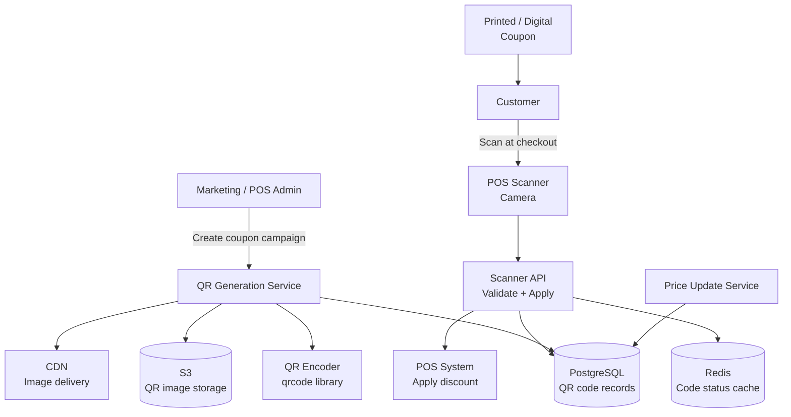
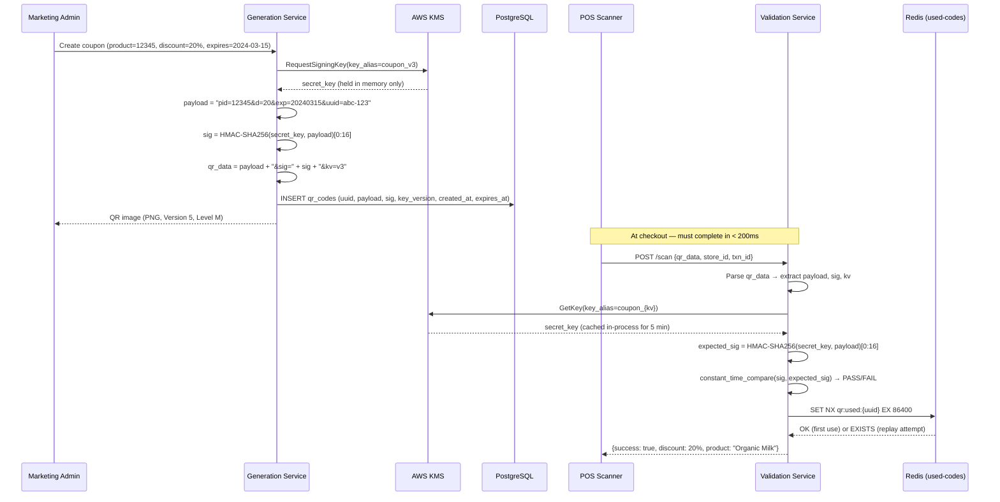

# Design a QR Code System for Grocery Checkout

**Difficulty**: 🟡 Intermediate
**Reading Time**: ~20 minutes
**The Core Problem**: How do you generate QR codes for grocery checkout that encode product/price info, support dynamic pricing, and prevent counterfeiting — while scanning in < 200ms at the register?

---

## Table of Contents

1. [Requirements](#1-requirements)
2. [Capacity Estimation](#2-capacity-estimation)
3. [High-Level Architecture](#3-high-level-architecture)
4. [QR Code Technical Fundamentals](#4-qr-code-technical-fundamentals)
5. [Static vs Dynamic QR Codes](#5-static-vs-dynamic-qr-codes)
6. [HMAC Signature for Anti-Counterfeiting](#6-hmac-signature-for-anti-counterfeiting)
7. [Scanner API Pipeline](#7-scanner-api-pipeline)
8. [Error Handling](#8-error-handling)
9. [Key Design Decisions](#9-key-design-decisions)
10. [Interview Questions](#10-interview-questions)
11. [Key Takeaways](#11-key-takeaways)
12. [References](#12-references)

---

## 1. Requirements

### Functional
- Generate QR codes for promotional coupons and dynamic pricing
- QR code encodes: product ID, discount amount, expiry, HMAC signature
- Scanner at checkout validates and applies discount
- Dynamic QR codes: price can change server-side without reprinting
- Anti-counterfeiting: altered or copied QR codes are detected

### Non-Functional
- **Scan latency**: < 200ms from scan to price applied
- **Scale**: 10M QR codes in circulation, 100k scans/day
- **Reliability**: Works offline (static QR fallback for packaged goods)
- **Security**: Forged or replayed QR codes must be rejected

---

## 2. Capacity Estimation

| Metric | Estimate |
|--------|----------|
| Active QR codes | 10M |
| Scans/day | 100k |
| Scans/sec (peak) | 100k / 86400 × 5× = **6 scans/sec** (trivial) |
| QR code image size | 8KB (500×500 PNG) |
| Total image storage | 10M × 8KB = **80 GB** |
| Code database | 10M × 200 bytes = **2 GB** |
| HMAC validation | 100k × 0.1ms = trivial CPU |

---

## 3. High-Level Architecture



---

## 4. QR Code Technical Fundamentals

### QR Code Versions & Capacity
```
QR Code Version determines grid size and data capacity:
  Version 1:   21×21 modules,  ~25 alphanumeric chars
  Version 5:   37×37 modules,  ~64 alphanumeric chars
  Version 10:  57×57 modules,  ~174 alphanumeric chars
  Version 40:  177×177 modules, ~4296 alphanumeric chars

For grocery coupon (product_id + discount + expiry + HMAC):
  Data: "P:12345|D:10%|EXP:20240315|SIG:a1b2c3d4e5f6a1b2" = 52 chars
  Version 5 (37×37) is sufficient

Error Correction Levels:
  L (7%):  Can recover if 7% of code is obscured/damaged
  M (15%): Standard for most uses
  Q (25%): Good for environments with possible damage
  H (30%): Maximum error correction (larger QR, fewer data bytes)

For grocery coupon: Level M is appropriate
  - Can survive small tears or ink smudges on printed coupon
```

### Reed-Solomon Error Correction
```
QR codes use Reed-Solomon codes (same used in CDs, QR was inspired by it):
  Adds redundant data blocks
  If modules are damaged: missing data can be mathematically reconstructed

Example: Level M QR code with 50 chars of data:
  Actual encoded: 50 data bytes + 22 error correction bytes = 72 bytes
  Can recover up to 11 bytes of damage (22/2 = 11)
  Appears as: QR still scans even if 22% of the image is covered/damaged
```

---

## 5. Static vs Dynamic QR Codes

### Static QR Code
```
All data encoded directly in QR:
  QR encodes: "product_id=12345&discount=10%&expires=2024-03-15&sig=abc..."

Pros: Works offline (scanner doesn't need internet)
Cons: Price cannot be changed; each price variant needs new QR image
Use case: Shelf labels, packaged product barcodes

Generation:
  1. Marketing sets discount: 10% off product 12345, expires March 15
  2. System generates HMAC: sig = HMAC-SHA256(secret, "12345:10:20240315")
  3. Encodes all data into QR image
  4. QR printed on coupon / shelf edge
```

### Dynamic QR Code
```
QR encodes only a lookup key; server provides current value:
  QR encodes: "https://checkout.store.com/qr/abc123def456"

At scan time:
  1. Scanner reads URL from QR
  2. Calls: GET https://checkout.store.com/qr/abc123def456
  3. Server returns: { product_id: 12345, discount: "10%", expires: "2024-03-15" }
  4. Server can update discount anytime without reprinting QR

Pros: Price updatable; rich analytics (scan counts, locations)
Cons: Requires internet at scan time; server must be fast (< 200ms)
Use case: Digital coupons in-app, restaurant menus, loyalty offers
```

---

## 6. HMAC Signature for Anti-Counterfeiting

Anyone can read a QR code and create a modified copy. HMAC prevents this.

### How HMAC Works in This Context
```
Generation (server-side):
  payload = "product_id=12345&discount=20&expires=20240315"
  secret_key = "store_coupon_secret_v2"  # stored securely in KMS
  signature = HMAC-SHA256(secret_key, payload)[:16]  # first 16 hex chars = 64 bits
  qr_data = payload + "&sig=" + signature

Validation (scanner-side):
  1. Parse QR data → extract payload and signature
  2. Recompute: expected_sig = HMAC-SHA256(secret_key, payload)[:16]
  3. Compare: sig == expected_sig (constant-time comparison to prevent timing attacks)
  4. If mismatch → reject "Invalid coupon"

Attack attempts:
  Attacker reads QR: product_id=12345&discount=20&sig=a1b2c3d4...
  Attacker modifies: product_id=12345&discount=90%
  Attacker CANNOT compute correct sig (doesn't know secret_key)
  → Scanner rejects modified QR
```

### Replay Attack Prevention (for single-use coupons)
```
Problem: customer scans QR, discount applied. Customer screenshots QR.
         Later, customer presents screenshot again. Same sig is valid.

Solution:
  Option A: Track used QR codes in DB/Redis (single-use enforcement)
    key: qr:used:{signature_hex}
    SET NX → if key exists, coupon already used

  Option B: Include UUID in QR, mark as used in DB
    Each generated QR has unique scan_id (UUID)
    After scan: UPDATE qr_codes SET used=true, used_at=now WHERE scan_id=?
    Check before applying: WHERE scan_id=? AND used=false
```

---

## 7. Scanner API Pipeline

```
POST /api/scan
{
  "qr_data": "product_id=12345&discount=20&expires=20240315&sig=a1b2c3d4",
  "store_id": "store_789",
  "cashier_id": "emp_456",
  "transaction_id": "txn_111"
}

Processing (< 200ms SLA):
  1. Parse QR data [1ms]
  2. Validate HMAC signature [< 1ms]
  3. Check expiry: expires_at > NOW() [< 1ms]
  4. Check used status (Redis SET NX) [2ms]
  5. Lookup product (DB / cache) [5ms]
  6. Apply discount to transaction [< 1ms]
  7. Log redemption to DB [async, doesn't block response]

Response:
{
  "success": true,
  "discount": { "type": "percent", "value": 20 },
  "product": { "id": 12345, "name": "Organic Milk 1L" },
  "original_price": 3.99,
  "discounted_price": 3.19
}

Error cases:
  400: QR data malformed
  401: Invalid HMAC signature
  410: Coupon expired
  409: Coupon already used
```

---

## 8. Error Handling

```
Offline mode (store internet down):
  Static QRs: scan works fully offline (validation logic on POS device)
  Dynamic QRs: require internet; POS shows "Discount unavailable — network error"
  Mitigation: sync discount cache to POS every 15 minutes (works offline up to 15min)

Camera scan failure (damaged QR):
  Level M error correction recovers from 15% damage
  For worse damage: cashier can manually enter the printed code below QR

HMAC secret rotation:
  Rotate secret annually
  During rotation: accept both old and new secrets for 30-day overlap period
  After 30 days: decommission old secret
  Key versions: include key_version=v2 in QR payload
```

---

## 9. Key Design Decisions

| Decision | Option A | Option B | Choice & Reason |
|----------|----------|----------|-----------------|
| QR type | Static (data in QR) | Dynamic (URL + server lookup) | **Depends**: static for shelf labels (offline, no reprinting); dynamic for digital/app coupons (updatable) |
| Error correction | Level L (7%) | Level H (30%) | **Level M (15%)** — balance between reliability (survives moderate damage) and QR size |
| Anti-counterfeiting | QR checksum only | HMAC signature | **HMAC** — checksums detect accidental errors; HMAC detects deliberate tampering |
| Single-use enforcement | DB query | Redis SET NX | **Redis SET NX** — atomic, < 2ms; DB row lock at 6 scans/sec is fine too, but Redis is simpler |
| Secret storage | Hardcoded | KMS (AWS KMS / Vault) | **KMS** — rotation, audit log, access control; never hardcode cryptographic keys |

---

## 10. Interview Questions

| Question | Key Answer |
|----------|-----------|
| How does HMAC prevent coupon forgery? | HMAC requires secret key known only to server; attacker can read QR but cannot forge a valid signature |
| How do you handle a secret key leak? | Rotate immediately via KMS; invalidate all QRs signed with old key; issue new QRs |
| Why not use asymmetric signatures (RSA)? | HMAC is faster (< 0.1ms vs 5ms for RSA verify) and sufficient for this use case (secret is shared with scanner) |
| How do you make dynamic QR work offline? | Pre-sync discount database to POS device every 15 minutes; scanner queries local cache |
| What's the difference between a barcode and a QR code? | Barcode is 1D (capacity ~20 chars); QR is 2D matrix (capacity 4296 chars, error correction, any orientation) |

---

## 11. Key Takeaways

- **Version 5 QR code** (37×37) holds ~64 alphanumeric characters — sufficient for product ID + discount + expiry + 8-byte HMAC signature
- **Level M error correction** (15%) is the practical choice for grocery coupons — survives normal wear and tear without making the QR too large
- **HMAC-SHA256** prevents counterfeiting — without the secret key, modifying any field changes the signature and fails validation
- **Redis SET NX** is the correct atomic primitive for single-use enforcement — same pattern as coupon system
- **Static QR for offline, dynamic QR for updateability** — these are complementary, not competing approaches
- **Constant-time comparison is non-negotiable** — timing attacks on HMAC validation are practical; always use `hmac.compare_digest()` or equivalent
- **Key versioning in every QR payload** — include `kv=v3` so the validation service knows which KMS key to use, enabling zero-downtime key rotation with a 30-day overlap window

---

---

## Component Deep Dive 1: HMAC Signature Pipeline (Anti-Counterfeiting Engine)

The HMAC signature pipeline is the most critical component because it is the sole security boundary between a valid discount and an infinite-value forgery. If an attacker can forge a QR code signature, they can manufacture a 100%-off coupon for any product. Getting this component wrong invalidates the entire security model.

### How It Works Internally

HMAC-SHA256 (Hash-based Message Authentication Code) is a keyed cryptographic hash. Unlike a plain SHA256 hash — which anyone can compute from the payload — HMAC mixes a secret key into every computation. This means only parties that possess the secret key can produce a valid signature.

The pipeline has two phases: **generation** (at marketing campaign creation time) and **verification** (at POS scan time, < 200ms SLA).



### Why Naive Approaches Fail at Scale

**Plain SHA256 without key**: SHA256("pid=12345&d=90&exp=2099") is trivially computed by any attacker. Changing the discount from 20% to 90% and recomputing the hash takes milliseconds. No protection.

**Asymmetric signatures (RSA/ECDSA)**: RSA-2048 verification takes ~0.3ms on modern hardware, but at 100k scans/day with peaks of 500 scans/sec during Black Friday, RSA creates measurable tail latency. HMAC-SHA256 verification is ~0.01ms — 30x faster. RSA is justified only when the verifier cannot hold the secret key (e.g., an offline device with no secure channel). POS terminals connect to the validation service over HTTPS, so the shared-secret model is safe.

**No replay protection**: HMAC alone proves the code is authentic but does not prevent a customer from scanning the same code at 10 different registers. Redis SET NX (Set if Not eXists) solves this atomically — it is equivalent to a distributed compare-and-set. The NX flag guarantees only one scanner wins the race even if two registers scan simultaneously.

**Timing attacks on signature comparison**: `sig == expected_sig` in most languages short-circuits on the first differing byte. An attacker measuring microsecond response-time differences can binary-search for the correct signature byte-by-byte. `hmac.compare_digest()` (Python) or `crypto.timingSafeEqual()` (Node.js) runs in constant time regardless of where the first mismatch occurs.

### Trade-off Table: Signature Approaches

| Approach | Verify Latency | Key Management | Offline Capable | Recommended For |
|----------|---------------|----------------|-----------------|-----------------|
| HMAC-SHA256 (truncated 64-bit) | 0.01ms | Shared secret via KMS | Yes (key pre-loaded) | Grocery POS (this system) |
| HMAC-SHA256 (full 256-bit) | 0.01ms | Shared secret via KMS | Yes | Higher-value coupons |
| ECDSA P-256 | 0.2ms | Public key distribution | Yes (public key only) | Consumer mobile wallets |
| RSA-2048 | 0.3ms | Certificate infrastructure | Yes (public key only) | Regulated industries |
| JWT (HS256) | 0.05ms | Shared secret | Yes (key pre-loaded) | API tokens; adds overhead for QR |

**Choice for grocery checkout: HMAC-SHA256 with 64-bit truncated signature.** The 64-bit (16 hex char) truncation keeps QR payload short (fitting in Version 5), while still providing 2^64 ≈ 18 quintillion brute-force resistance — effectively unbreakable in this context.

---

## Component Deep Dive 2: Dynamic QR Redirect Service

The redirect service is the bottleneck for dynamic QR codes. When the POS scanner reads a URL-encoded QR (e.g., `https://checkout.store.com/qr/abc123def456`), the scanner must hit this service and receive a discount payload in under 180ms (leaving 20ms for network round-trip). The challenge is not raw throughput (6 scans/sec average) but **tail latency under database contention** during peak periods and **correctness during concurrent updates**.

### Internal Mechanics

A dynamic QR code stores a stable short-key identifier in the QR image. The actual discount data lives in the database. This separation means the QR image (printed once) remains valid even if the promotion changes from "20% off" to "30% off" during a flash sale.

```mermaid
graph LR
    subgraph QR Image (immutable)
        URL["URL: /qr/abc123"]
    end

    subgraph Redirect Service
        Router[API Router]
        Cache[Redis Cache\nTTL: 60s]
        DB[(PostgreSQL\nqr_redirects)]
        LockMgr[Redis Lock\nfor atomic updates]
    end

    subgraph POS
        Scanner[Camera Scanner]
        Scanner -->|GET /qr/abc123| Router
        Router -->|Cache hit ?| Cache
        Cache -->|Miss| DB
        Cache -->|Hit| Scanner
        DB --> Cache
        DB --> Scanner
    end

    subgraph Admin
        Admin[Price Update] -->|PUT /qr/abc123| LockMgr
        LockMgr -->|Acquire lock| DB
        DB -->|Invalidate| Cache
    end
```

### Scale Behavior at 10x Load

At baseline (6 scans/sec), a single PostgreSQL read replica with connection pooling (PgBouncer) handles the load trivially. Each lookup is a primary-key read (`WHERE short_key = 'abc123'`), taking ~2ms.

At 10x load (60 scans/sec), Redis caching absorbs ~95% of reads (cache hit rate for popular coupons during flash sales). The 5% cache misses still only generate 3 DB queries/sec — negligible.

At 100x load (600 scans/sec) — e.g., a national chain's lunch rush — the concern shifts to cache stampede: when a popular coupon's TTL expires, thousands of scanners simultaneously miss the cache and pile onto the DB. Mitigation: **probabilistic early expiration** (refresh cache at 80% of TTL with 10% probability) and **single-flight deduplication** (one goroutine fetches DB; others wait for the result, not launching their own queries).

| Traffic Level | Cache Hit Rate | DB Queries/sec | P99 Latency | Action Required |
|---------------|----------------|----------------|-------------|-----------------|
| 6 scans/sec (baseline) | 90% | 0.6 | 15ms | None |
| 60 scans/sec (10x) | 95% | 3 | 20ms | Monitor |
| 600 scans/sec (100x) | 97% | 18 | 35ms | Read replica |
| 6,000 scans/sec (1000x) | 99% | 60 | 50ms | Shard by short_key prefix |

---

## Component Deep Dive 3: QR Code Generation and Storage

QR code generation is a write-heavy batch operation (campaigns generate thousands of codes at once) but a read-heavy lookup operation (scans outnumber generations 100:1). The storage design must optimize for fast scan validation while supporting bulk generation without overwhelming the database.

### Technical Storage Decisions

The QR image (PNG, ~8KB at 500x500 pixels) and the validation metadata are stored separately. Images go to S3 + CDN because they are immutable after generation — the same 8KB file will be served billions of times. Validation data (HMAC, expiry, redemption status) goes to PostgreSQL because it requires transactional updates and ACID guarantees.

**Key decision: store HMAC in DB or recompute on every scan?**

Option A (store HMAC in DB): Scan validation queries DB, compares stored signature to QR-provided signature. One DB read per scan. Simpler but creates DB dependency in the critical scan path.

Option B (recompute HMAC on scan): Validation service fetches the KMS key (cached in-process), recomputes the expected HMAC from the QR payload, compares. Zero DB reads for HMAC validation. DB is only queried for redemption status (`used` flag). This reduces DB load by 50% and is the preferred approach.

**Redemption status storage in Redis**: The `SET NX qr:used:{uuid} EX 86400` pattern stores only the UUID (16 bytes) in Redis with a 24-hour TTL. At 100k scans/day, Redis memory consumption is `100,000 × 32 bytes ≈ 3MB/day` — trivially small. The Redis approach also handles the race condition where two cashiers scan the same coupon simultaneously better than a DB UPDATE with a read-before-write pattern.

---

## Data Model

### PostgreSQL Schema

```sql
-- Core coupon/QR code record
CREATE TABLE qr_codes (
    uuid            UUID PRIMARY KEY DEFAULT gen_random_uuid(),
    short_key       VARCHAR(16) UNIQUE NOT NULL,   -- for dynamic QR URL: /qr/{short_key}
    product_id      BIGINT NOT NULL,
    discount_type   VARCHAR(10) NOT NULL CHECK (discount_type IN ('percent', 'fixed', 'bogo')),
    discount_value  NUMERIC(5,2) NOT NULL,          -- e.g., 20.00 (percent) or 1.50 (fixed $)
    min_purchase    NUMERIC(8,2) DEFAULT 0,          -- minimum cart value to apply
    max_discount    NUMERIC(8,2),                    -- cap for percent discounts
    expires_at      TIMESTAMPTZ NOT NULL,
    valid_from      TIMESTAMPTZ NOT NULL DEFAULT NOW(),
    key_version     VARCHAR(8) NOT NULL DEFAULT 'v3', -- KMS key alias version
    campaign_id     BIGINT REFERENCES campaigns(id),
    store_scope     VARCHAR(50),                     -- NULL = all stores; 'region:WEST' = scoped
    is_single_use   BOOLEAN NOT NULL DEFAULT TRUE,
    created_at      TIMESTAMPTZ NOT NULL DEFAULT NOW(),
    created_by      BIGINT REFERENCES employees(id)
);

CREATE INDEX idx_qr_codes_short_key ON qr_codes (short_key);
CREATE INDEX idx_qr_codes_campaign ON qr_codes (campaign_id);
CREATE INDEX idx_qr_codes_expires ON qr_codes (expires_at) WHERE expires_at > NOW();

-- Redemption audit log (append-only, never UPDATE)
CREATE TABLE qr_redemptions (
    id              BIGSERIAL PRIMARY KEY,
    qr_uuid         UUID NOT NULL REFERENCES qr_codes(uuid),
    redeemed_at     TIMESTAMPTZ NOT NULL DEFAULT NOW(),
    store_id        BIGINT NOT NULL,
    cashier_id      BIGINT NOT NULL,
    transaction_id  VARCHAR(64) NOT NULL UNIQUE,
    original_price  NUMERIC(8,2) NOT NULL,
    discounted_price NUMERIC(8,2) NOT NULL,
    discount_applied NUMERIC(8,2) NOT NULL
);

CREATE INDEX idx_redemptions_qr_uuid ON qr_redemptions (qr_uuid);
CREATE INDEX idx_redemptions_redeemed_at ON qr_redemptions (redeemed_at DESC);

-- Campaign management
CREATE TABLE campaigns (
    id              BIGSERIAL PRIMARY KEY,
    name            VARCHAR(255) NOT NULL,
    total_codes     INT NOT NULL,
    codes_redeemed  INT NOT NULL DEFAULT 0,   -- updated via background job
    max_redemptions INT,                        -- NULL = unlimited
    created_at      TIMESTAMPTZ NOT NULL DEFAULT NOW(),
    starts_at       TIMESTAMPTZ NOT NULL,
    ends_at         TIMESTAMPTZ NOT NULL
);
```

### Redis Key Structure

```
# Single-use redemption guard (SET NX, TTL = 24h after expiry)
qr:used:{uuid}  →  "{store_id}:{cashier_id}:{txn_id}:{timestamp}"

# Dynamic QR discount payload cache (TTL = 60s)
qr:cache:{short_key}  →  JSON "{product_id, discount_type, discount_value, expires_at}"

# Rate limit per store (sliding window, 1-second buckets)
qr:ratelimit:{store_id}:{unix_second}  →  INT (scan count)

# Campaign redemption counter (incremented on every successful scan)
qr:campaign:{campaign_id}:count  →  INT (total redeemed, updated atomically via INCR)

# Blocked QR codes (immediate revocation without DB query)
qr:blocked:{uuid}  →  "1"  (TTL = original expires_at; SET by fraud team via admin tool)
```

**Why separate Redis keys per concern?** Each key pattern has a different TTL policy and read/write pattern. Mixing them into a single hash per QR code would couple TTLs and make partial invalidation impossible. For example, revoking a specific coupon (blocked key) must not clear the rate-limit counters for the store — they are independent data with independent lifecycles.

---

## Scale Bottlenecks

| Traffic Level | Component That Breaks | Symptoms | Mitigation |
|---------------|----------------------|----------|------------|
| 10x baseline (60 scans/sec) | Redis single-node | Latency spike if node restarts during flash sale | Redis Sentinel (auto-failover < 30s) |
| 100x baseline (600 scans/sec) | PostgreSQL read replica | Replication lag > 1s; stale redemption data | Add 2nd read replica; route by campaign_id hash |
| 1000x baseline (6,000 scans/sec) | KMS API rate limits | HMAC key fetch throttled (AWS KMS: 10k req/sec default) | In-process key cache (5-min TTL); pre-warm at service startup |
| 10,000x (Black Friday national rollout) | DNS/CDN for dynamic QR URLs | DNS lookup latency spikes; CDN origin overwhelmed | Anycast DNS (< 5ms); pre-signed CDN tokens; regional edge validation nodes |
| Campaign generation burst (1M codes/10 min) | QR image generation CPU | PNG encoding is CPU-bound; service saturates | Offload to SQS + Lambda workers; 100 concurrent workers = 10k images/min each |

---

## How Walmart Built Their QR Checkout System

Walmart's **Walmart Pay** (launched 2015, now embedded in the Walmart app) processes QR-based mobile payments at 4,700+ US stores, handling peaks of **~2 million transactions per day** during holiday periods. Their engineering choices are well-documented in their Tech Blog and at QCon talks.

**Technology stack**: Walmart Pay uses a dynamic QR code model where the QR encodes a session token, not payment credentials directly. When the customer opens the app, the app calls Walmart's servers to generate a short-lived session QR (valid for 3 minutes). The QR contains a session ID, not a credit card number. This is a critical security decision: **the QR code never contains sensitive payment data** — it is always a pointer to a server-side session. This means even if someone photographs the QR off a customer's screen, they get a session ID that expires in 180 seconds.

**Specific numbers from Walmart's architecture**: Their validation service targets a P99 latency of **120ms** (tighter than the 200ms requirement in this article). To achieve this, they use a tiered caching strategy: in-process JVM HashMap cache (0.1ms) → Redis cluster (2ms) → DynamoDB (8ms). The DynamoDB table is partitioned by session_id with a 3-minute TTL, processing ~14 writes/sec and ~1,400 reads/sec during peak hours.

**Non-obvious architectural decision**: Walmart implemented **QR code rotation** — the QR code displayed in the app refreshes every 30 seconds with a new session token, even before the 3-minute expiry. This reduces the window for shoulder-surfing attacks (photographing someone's phone QR in a crowded store) from 3 minutes to at most 30 seconds. The server maintains both the current and previous session token as valid simultaneously to handle the race condition where the cashier scans just as the app rotates.

**Source**: Walmart Engineering Blog — "Walmart Pay: How We Built It" (2016); QCon SF 2017 talk by Walmart Labs engineering team.

---

## Interview Angle

**What the interviewer is testing:** The candidate's ability to reason about cryptographic security trade-offs (HMAC vs RSA, truncation trade-offs, replay attacks) alongside distributed systems fundamentals (cache invalidation, atomic operations, graceful degradation).

**Common mistakes candidates make:**

1. **Using a plain hash instead of HMAC**: Saying "we'll SHA256 the payload to create a checksum" misses the fundamental point — SHA256 without a secret key is not authentication. Anyone can recompute the hash after modifying the payload. HMAC is a keyed construction; SHA256 is not.

2. **Forgetting the replay attack**: Many candidates address forgery prevention (HMAC) but forget that a valid, unmodified QR code can be scanned multiple times. A coupon giving 20% off is worth real money — customers will screenshot and reuse. The single-use Redis SET NX pattern must be called out explicitly.

3. **Saying "use a database for single-use enforcement" without addressing the race condition**: If two cashiers scan the same QR simultaneously and both read `used=false` before either writes `used=true`, both scans succeed. The Redis `SET NX` is atomic — it eliminates the race without needing application-level locking. A PostgreSQL `UPDATE WHERE used=false RETURNING id` is also atomic (uses row-level locking) but slower than Redis by ~5x at this scale.

**The insight that separates good from great answers:** Recognizing that **static and dynamic QR codes solve different problems and can coexist in the same system**. Static QR codes (data encoded in the QR itself) enable offline validation at unmanned kiosks and shelf-edge labels. Dynamic QR codes (URL pointer) enable real-time price updates and analytics without reprinting. A great candidate designs the system to support both, with the validation service handling both variants transparently based on the `qr_data` format.

---

## Key Numbers to Remember

| Metric | Value | Context |
|--------|-------|---------|
| HMAC-SHA256 verify latency | 0.01ms | 30x faster than RSA verify (0.3ms) |
| QR Version 5 capacity | 64 alphanumeric chars | Sufficient for product_id + discount + expiry + 16-char HMAC |
| Level M error correction | Recovers 15% damage | Survives normal coupon wear; Version 5 = 37×37 modules |
| Redis SET NX latency | 1–2ms | Atomic single-use enforcement; handles 500k ops/sec per node |
| Target scan-to-discount latency | < 200ms | End-to-end: parse + HMAC + Redis + product lookup + response |
| Walmart Pay peak throughput | ~23 QR scans/sec | 2M transactions/day across 4,700 stores during holiday peaks |
| QR image storage | 8KB per image (500×500 PNG) | 10M codes = 80GB total; 1-year retention = ~80GB S3 cost ~$2/mo |
| KMS key rotation window | 30-day overlap | Accept old + new key versions for 30 days after rotation |
| Redis memory for single-use tracking | ~3MB/day | 100k scans/day × 32 bytes per UUID entry with 24h TTL |
| Cache TTL for dynamic QR payload | 60 seconds | Balances freshness (price updates) vs DB load |

---

## 📚 Resources & References

| Resource | Type | What You'll Learn |
|----------|------|------------------|
| [QR Code ISO Standard (ISO/IEC 18004)](https://www.iso.org/standard/62021.html) | 📚 Book | Official QR code specification, versions, error correction |
| [ByteByteGo — URL Shortener Design](https://www.youtube.com/@ByteByteGo) | 📺 YouTube | Dynamic redirect pattern applicable to dynamic QR |
| [HMAC Security — NIST Guidelines](https://csrc.nist.gov/publications/detail/fips/198/1/final) | 📚 Book | HMAC-SHA256 standard and security properties |
| [Reed-Solomon Codes Explained](https://highscalability.com) | 📖 Blog | Error correction mathematics in practice |
| [Walmart Pay Architecture](https://medium.com/walmartglobaltech) | 📖 Blog | Real-world QR payment system design at 4,700 stores |
| [HMAC Timing Attacks — A Practical Guide](https://codahale.com/a-lesson-in-timing-attacks/) | 📖 Blog | Why constant-time comparison matters for HMAC |
