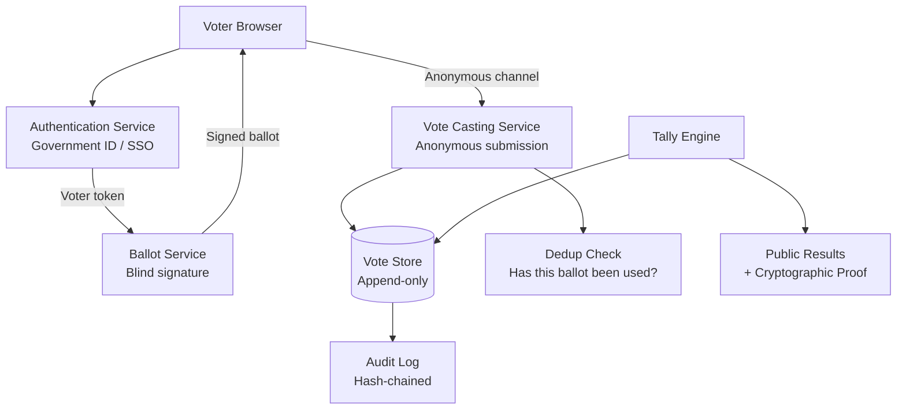

# Design an Online Voting System

**Difficulty**: 🔴 Advanced
**Reading Time**: Coming Soon
**Interview Frequency**: Medium

---

> 🚧 **Full article coming soon.** This stub gives you the essentials to start thinking about this problem.

---

## The Core Problem

Accepting 10 million votes with fraud prevention, anonymity, and auditability creates three mutually conflicting requirements: you need to verify each voter is eligible (identity check), ensure each votes only once (uniqueness), yet cannot link a specific vote to a specific voter (anonymity). Solving all three simultaneously requires cryptographic techniques.

## Functional Requirements

- Voters authenticate with government ID or trusted identity provider
- Each eligible voter can cast exactly one vote
- Votes are anonymous — no one can see who voted for whom
- Results can be independently verified (end-to-end verifiability)
- System produces tamper-evident audit log

## Non-Functional Requirements

| Requirement | Target |
|-------------|--------|
| Availability | 99.99% — elections have hard deadlines |
| Fraud prevention | Each voter votes exactly once |
| Anonymity | Vote cannot be linked to voter identity |
| Auditability | Any party can verify final tally is correct |

## Back-of-Envelope Estimates

- **Peak voting rate**: 10M voters over 12-hour election day = ~230 votes/sec average; assume 10x peak = 2,300 votes/sec
- **Vote storage**: 10M votes × 200 bytes = 2GB — trivially small; security properties matter more than scale
- **Audit trail**: Every vote + proof = 500 bytes × 10M = 5GB immutable audit log

## Key Design Decisions

1. **Blind Signature for Anonymity** — voter authenticates and gets a ballot token blindly signed by the authority (authority signs without seeing the content); voter submits token + vote through anonymous channel; authority verifies its signature but can't link to original voter.
2. **Commit-Reveal for Verifiability** — voter commits hash of their vote before election closes; after close, reveals vote; anyone can verify the revealed vote matches the commitment; prevents changing votes after seeing preliminary results.
3. **Append-Only Blockchain-Style Audit Log** — each vote creates a hash-chained log entry; tampering with any vote invalidates all subsequent hashes; independent observers can recompute final tally from public audit log.

## High-Level Architecture

## Top Interview Questions for This Problem

| Question | Tests |
|----------|-------|
| How do you prove a voter voted only once without knowing which vote is theirs? | Blind signatures, anonymity vs uniqueness |
| How do you allow any observer to verify the election result is correct? | End-to-end verifiability, public audit log |
| How do you handle voters who lose their ballot token before voting? | Lost credential recovery, identity binding |

## Related Concepts

- [Identity management for voter authentication](./identity-management)
- [Online payment for similar fraud-prevention patterns](./online-payment)

---

*📚 Full deep-dive with multiple approaches, trade-off tables, and pseudocode coming soon.*

## 📚 Resources & References

| Resource | Type | What You'll Learn |
|----------|------|------------------|
| [ByteByteGo — Design a Voting System](https://www.youtube.com/@ByteByteGo) | 📺 YouTube | Search "voting system design" — idempotency, audit trails, fraud prevention |
| [MIT: E2E Verifiable Voting](https://people.csail.mit.edu/rivest/voting/papers/rivest-Scratch_and_Vote.pdf) | 📖 Blog | Cryptographic approaches to verifiable voting systems |
| [US NIST: Voting System Guidelines](https://www.nist.gov/topics/voting) | 📚 Docs | Federal guidelines for electronic voting system reliability and security |
| [Stack Overflow Voting Architecture](https://stackexchange.com/performance) | 📖 Blog | How Stack Exchange handles votes with fraud prevention at scale |
| [Reddit Karma System Architecture](https://redditblog.com/2017/05/24/view-counting-at-reddit/) | 📖 Blog | Vote counting with fraud detection and approximate vs exact counts |
