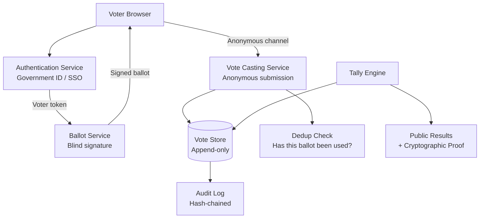
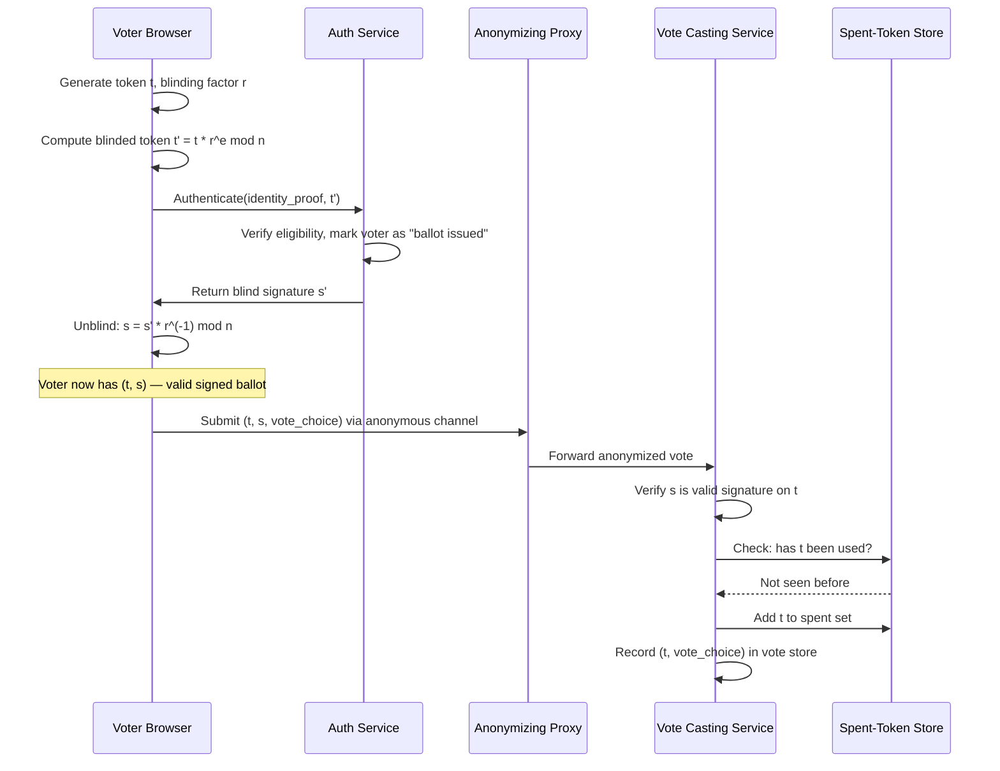
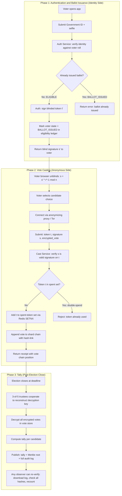
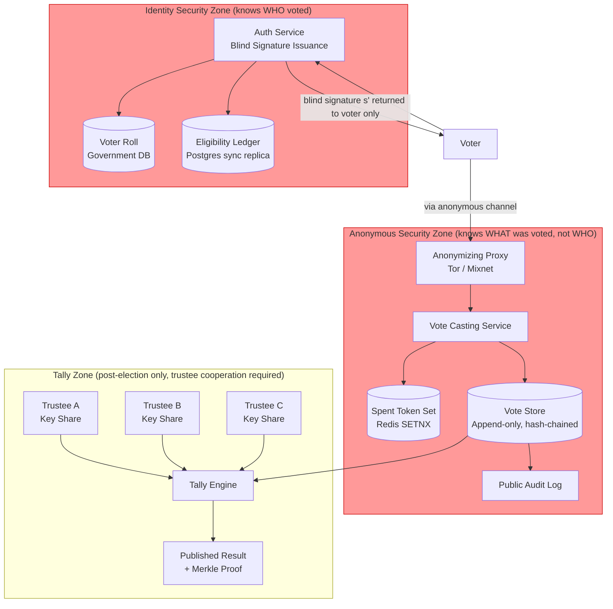

# Design an Online Voting System

**Difficulty**: 🔴 Advanced
**Reading Time**: Coming Soon
**Interview Frequency**: Medium

---

> 🚧 **Full article coming soon.** This stub gives you the essentials to start thinking about this problem.

---

## The Core Problem

Accepting 10 million votes with fraud prevention, anonymity, and auditability creates three mutually conflicting requirements: you need to verify each voter is eligible (identity check), ensure each votes only once (uniqueness), yet cannot link a specific vote to a specific voter (anonymity). Solving all three simultaneously requires cryptographic techniques.

## Functional Requirements

- Voters authenticate with government ID or trusted identity provider
- Each eligible voter can cast exactly one vote
- Votes are anonymous — no one can see who voted for whom
- Results can be independently verified (end-to-end verifiability)
- System produces tamper-evident audit log

## Non-Functional Requirements

| Requirement | Target |
|-------------|--------|
| Availability | 99.99% — elections have hard deadlines |
| Fraud prevention | Each voter votes exactly once |
| Anonymity | Vote cannot be linked to voter identity |
| Auditability | Any party can verify final tally is correct |

## Back-of-Envelope Estimates

- **Peak voting rate**: 10M voters over 12-hour election day = ~230 votes/sec average; assume 10x peak = 2,300 votes/sec
- **Vote storage**: 10M votes × 200 bytes = 2GB — trivially small; security properties matter more than scale
- **Audit trail**: Every vote + proof = 500 bytes × 10M = 5GB immutable audit log

## Key Design Decisions

1. **Blind Signature for Anonymity** — voter authenticates and gets a ballot token blindly signed by the authority (authority signs without seeing the content); voter submits token + vote through anonymous channel; authority verifies its signature but can't link to original voter.
2. **Commit-Reveal for Verifiability** — voter commits hash of their vote before election closes; after close, reveals vote; anyone can verify the revealed vote matches the commitment; prevents changing votes after seeing preliminary results.
3. **Append-Only Blockchain-Style Audit Log** — each vote creates a hash-chained log entry; tampering with any vote invalidates all subsequent hashes; independent observers can recompute final tally from public audit log.

## High-Level Architecture



## Top Interview Questions for This Problem

| Question | Tests |
|----------|-------|
| How do you prove a voter voted only once without knowing which vote is theirs? | Blind signatures, anonymity vs uniqueness |
| How do you allow any observer to verify the election result is correct? | End-to-end verifiability, public audit log |
| How do you handle voters who lose their ballot token before voting? | Lost credential recovery, identity binding |

## Related Concepts

- [Identity management for voter authentication](./identity-management)
- [Online payment for similar fraud-prevention patterns](./online-payment)

---

## Component Deep Dive 1: Blind Signature Protocol (Anonymity + Uniqueness Engine)

The blind signature protocol is the cryptographic heart of anonymous online voting. It solves a fundamental paradox: the election authority must verify that a voter is eligible and hasn't voted before (requiring identity), yet must not be able to link a submitted vote to that voter's identity (requiring anonymity). Naive approaches fail entirely — if you simply store `(voter_id, candidate)`, you've destroyed anonymity. If you store votes without any identity binding, you cannot prevent double voting.

**How it works internally:**

The protocol has three phases. In the **blinding phase**, the voter's browser generates a random ballot token `t` and a blinding factor `r`. It blinds the token as `t' = t * r^e mod n` (using the authority's RSA public key `(e, n)`) and sends `t'` to the auth service along with their identity proof. The auth service verifies eligibility, marks the voter as "ballot issued" in the eligibility ledger, and signs the blinded token: `s' = (t')^d mod n`. It returns `s'` to the voter without ever seeing `t`.

In the **unblinding phase**, the voter's browser computes the real signature: `s = s' * r^(-1) mod n`. Now `s` is a valid signature on `t` from the authority — but the authority only ever signed `t'`, which is computationally unlinkable to `t` without knowing `r`.

In the **casting phase**, the voter submits `(t, s, vote_choice)` through an anonymous channel (Tor, mixnet, or a separate anonymizing proxy layer). The vote casting service verifies `s` is a valid authority signature on `t`, checks that `t` hasn't been used before (stored in a spent-token set), records the vote, and adds `t` to the spent-token set. The identity-to-token linkage only existed in the voter's browser — it was never transmitted to any server in plaintext.

**Why naive approaches fail at scale:**

A simple "one vote per account" check leaks identity — you can correlate login timestamps with vote submission times. Storing votes in a single database with voter IDs violates anonymity. Using IP-based deduplication is trivially bypassed with VPNs and also violates anonymity for legitimate users behind NAT.



| Approach | Anonymity | Double-Vote Prevention | Complexity | Key Risk |
|----------|-----------|----------------------|------------|----------|
| Blind RSA Signature | Strong — server never sees t | Yes — spent-token set | High — crypto implementation | RSA key compromise exposes all votes |
| Commitment Scheme | Strong — commit before reveal | Partial — needs extra mechanism | Medium | Voter can not commit after deadline |
| Zero-Knowledge Proof (ZKP) | Strongest — no secret info revealed | Yes — ZKP proves eligibility | Very High — computation expensive | 2-10 second proof generation per vote |

---

## Component Deep Dive 2: Append-Only Vote Store and Hash-Chained Audit Log

The vote store is not a normal database. Every write is final and immutable. The audit log must allow any independent party to recompute the tally from scratch and get the same result, making it a distributed integrity guarantee.

**Internal mechanics:**

Each vote record `V_i` is stored with a hash chain: `hash_i = SHA-256(hash_{i-1} || voter_token || encrypted_vote || timestamp)`. The genesis entry `hash_0` is the election's public setup commitment published before voting opens. This means:
- Adding a vote requires reading the previous hash (serialized per shard)
- Deleting or modifying vote `V_i` invalidates `hash_{i+1}` through `hash_n`
- Any third-party observer can download the full chain and verify every link

Votes are stored encrypted with the election's public key. Decryption (tallying) requires the private key, which is split using Shamir's Secret Sharing across `k` independent trustees — no single party can decrypt without `t-of-k` cooperation. This means even if the election authority is compromised, votes cannot be decrypted without trustee cooperation.

**Behavior at 10x load (23,000 votes/sec):**

At 10x baseline, hash chaining becomes a bottleneck if done globally — computing `hash_i` from `hash_{i-1}` prevents parallel writes. The mitigation is **sharded chains**: partition votes across `S` shards by `token mod S`. Each shard has its own hash chain. The final tally merges all shards with a Merkle root combining all shard-chain tips. This allows `S * sequential_write_rate` total throughput. At 10x load with 100 shards, each shard handles 230 writes/sec, which is trivially achievable.

```mermaid
graph LR
    V0[Genesis Block\nhash_0 = SHA256(election_params)] --> V1[Vote 1\nhash_1 = SHA256(hash_0 || t1 || enc_vote_1)]
    V1 --> V2[Vote 2\nhash_2 = SHA256(hash_1 || t2 || enc_vote_2)]
    V2 --> V3[Vote N\nhash_N = SHA256(hash_{N-1} || tN || enc_vote_N)]
    V3 --> Merkle[Merkle Root\nPublished after election close]
    Merkle --> PublicAudit[Public Audit File\nDownloadable by anyone]
```

| Storage Approach | Tamper Evidence | Tally Verifiability | Write Throughput | Operational Risk |
|-----------------|-----------------|--------------------|-----------------:|-----------------|
| Hash-chained append-only DB | Strong — any change detectable | Yes — public download | ~2,300/sec (sharded) | Chain corruption requires replay |
| Blockchain (Ethereum) | Very strong — distributed | Yes — on-chain | ~15-50 TPS on Ethereum | Gas costs prohibitive at 10M votes |
| Merkle-tree batch audit | Strong at batch level | Yes — Merkle proofs | High — parallel writes | Intra-batch tampering harder to detect |

---

## Component Deep Dive 3: Eligibility Ledger and Deduplication

The eligibility ledger tracks two states per eligible voter: `BALLOT_ISSUED` and `VOTED`. The critical invariant is: no voter transitions from `ELIGIBLE` to `BALLOT_ISSUED` more than once, and no ballot token appears in the spent-token set more than once. These are separate checks on separate systems, which is intentional — one system tracks identity, the other tracks anonymous tokens.

**Technical decisions:**

The eligibility ledger is a strongly consistent, synchronously replicated database (PostgreSQL with synchronous replication or etcd). It must use a compare-and-swap operation: `UPDATE voters SET state='BALLOT_ISSUED' WHERE voter_id=X AND state='ELIGIBLE'`. If this returns 0 rows updated, the voter already has a ballot and the request is rejected. This prevents TOCTOU (Time-Of-Check-Time-Of-Use) race conditions that would allow double-ballot issuance in a window of network partition.

The spent-token set is a separate service from the identity system. Tokens are hashed before storage (`SHA-256(token)`) so even if the spent-token store is breached, the attacker learns nothing useful. With 10M tokens of 32 bytes each (SHA-256), the entire spent-token set fits in 320MB RAM — small enough for a Redis set with persistence. Lookups are O(1). The Redis set uses `SETNX` (set-if-not-exists) atomically: returns 1 if the token is new (allow vote), returns 0 if already seen (reject as duplicate).

At 2,300 votes/sec peak, Redis handles this comfortably — Redis can sustain 100k+ simple SET/GET operations per second on a single node. The real bottleneck is the persistent write to the vote store, not the token deduplication check.

**Failure mode:** If the spent-token Redis node fails and is restored from a snapshot, it may be missing tokens submitted after the last snapshot. This creates a window where tokens could be double-spent. Mitigation: write-ahead log replication (`appendonly yes` in Redis config), and require that the vote store also tracks tokens — the spent-token set can be rebuilt from the vote store on restart.

---

## Data Model

```sql
-- Voter eligibility registry (identity-side, high consistency required)
CREATE TABLE voters (
    voter_id        UUID PRIMARY KEY,
    id_hash         CHAR(64) NOT NULL UNIQUE,  -- SHA-256(government_id), never store raw ID
    election_id     UUID NOT NULL,
    state           ENUM('ELIGIBLE', 'BALLOT_ISSUED', 'VOTED') NOT NULL DEFAULT 'ELIGIBLE',
    ballot_issued_at TIMESTAMPTZ,
    ballot_issued_ip INET,
    created_at      TIMESTAMPTZ NOT NULL DEFAULT NOW(),
    UNIQUE (id_hash, election_id)
);

CREATE INDEX idx_voters_election_state ON voters(election_id, state);

-- Spent token set (anonymous-side, separate DB, no voter identity)
CREATE TABLE spent_tokens (
    token_hash      CHAR(64) PRIMARY KEY,  -- SHA-256(blind_token)
    election_id     UUID NOT NULL,
    spent_at        TIMESTAMPTZ NOT NULL DEFAULT NOW(),
    shard_id        SMALLINT NOT NULL      -- which audit chain shard received this vote
);

-- Vote store (anonymous, append-only, hash-chained)
CREATE TABLE votes (
    vote_id             BIGSERIAL PRIMARY KEY,
    election_id         UUID NOT NULL,
    shard_id            SMALLINT NOT NULL,
    token_hash          CHAR(64) NOT NULL UNIQUE,   -- links to spent_tokens, NOT to voter
    encrypted_vote      BYTEA NOT NULL,              -- encrypted with election public key
    authority_signature BYTEA NOT NULL,              -- blind signature from auth service
    chain_hash          CHAR(64) NOT NULL,           -- SHA-256 of (prev_hash || token_hash || encrypted_vote || submitted_at)
    prev_chain_hash     CHAR(64),                    -- NULL for shard genesis entry
    submitted_at        TIMESTAMPTZ NOT NULL DEFAULT NOW(),
    CONSTRAINT fk_spent CHECK (token_hash IS NOT NULL)
);

CREATE INDEX idx_votes_shard_chain ON votes(shard_id, vote_id);

-- Elections metadata
CREATE TABLE elections (
    election_id         UUID PRIMARY KEY,
    name                TEXT NOT NULL,
    opens_at            TIMESTAMPTZ NOT NULL,
    closes_at           TIMESTAMPTZ NOT NULL,
    authority_public_key BYTEA NOT NULL,    -- RSA/EC public key for blind signature verification
    tally_public_key    BYTEA NOT NULL,     -- Threshold encryption public key for vote decryption
    genesis_hash        CHAR(64) NOT NULL,  -- SHA-256(election_params || opens_at || closes_at)
    trustee_threshold   SMALLINT NOT NULL,  -- t in t-of-k secret sharing
    total_shards        SMALLINT NOT NULL DEFAULT 100,
    status              ENUM('SETUP', 'OPEN', 'CLOSED', 'TALLIED') NOT NULL DEFAULT 'SETUP'
);

-- Tally (populated post-close by t-of-k trustee decryption ceremony)
CREATE TABLE tally_results (
    election_id     UUID NOT NULL REFERENCES elections(election_id),
    candidate_id    TEXT NOT NULL,
    vote_count      BIGINT NOT NULL,
    merkle_root     CHAR(64) NOT NULL,     -- root of all shard chain tips
    published_at    TIMESTAMPTZ NOT NULL DEFAULT NOW(),
    PRIMARY KEY (election_id, candidate_id)
);
```

---

## Scale Bottlenecks

| Traffic Level | Component That Breaks | Symptoms | Mitigation |
|--------------|----------------------|----------|------------|
| 10x baseline (23k votes/sec) | Hash-chained write serialization per shard | Write latency spikes, queue backlog grows | Increase shard count from 100 to 1,000; each shard handles 23 writes/sec |
| 100x baseline (230k votes/sec) | Eligibility ledger (Postgres synchronous replication) | Replication lag, `BALLOT_ISSUED` CAS timeouts | Partition eligibility ledger by voter_id range; 10 nodes × 23k CAS/sec |
| 100x baseline (230k votes/sec) | Anonymizing proxy layer (mixnet) | Proxy throughput ceiling, anonymity set degrades | Add more mix nodes; accept higher latency (batch mixing) |
| 1000x baseline (2.3M votes/sec) | Auth service blind signature computation | CPU saturation on RSA signing (RSA-2048 ~1k signs/sec per core) | Switch to EC-based blind signatures (ECDSA blind: ~10x faster); horizontal scale auth service to 50+ nodes |
| 1000x baseline (2.3M votes/sec) | Spent-token Redis set | Memory exhaustion, Redis SETNX throughput | Shard Redis by `token_hash[0:2]` (256 buckets); bloom filter pre-check; entire set = 320MB per 10M tokens |
| Any level | Trustee key ceremony at tally time | Manual process bottleneck post-election | Pre-stage threshold decryption; automate ceremony with HSMs and secure multi-party computation |

---

## How Stack Exchange Built Their Voting System

Stack Overflow (Stack Exchange) operates one of the most active voting systems in the world: as of 2023, Stack Overflow alone has over 50 million votes cast on questions and answers, with peaks around 300-500 votes/sec during high-traffic events. While this is not a government election system, it handles many of the same problems — fraud prevention, vote integrity, rate limiting, and audit trails — at genuine internet scale with published architecture details.

**Technology choices:** Stack Exchange stores votes in SQL Server with a `Votes` table containing `(PostId, UserId, VoteTypeId, CreationDate)`. The primary fraud prevention is a set of server-side rules applied at write time: same-user voting on their own posts is rejected at the application layer before the DB write; vote reversal within a time window is allowed (UPDATE vs INSERT); suspicious voting patterns (one user voting on all posts of another user) trigger automatic serial voting detection that reverses the votes nightly via a background job.

**Specific numbers:** The Stack Exchange performance page (stackexchange.com/performance) has historically shown ~1,400 HTTP requests/sec across the network. Their SQL Server cluster handles ~4,000 queries/sec. The votes table, despite 50M+ rows, stays fast because they aggressively cache vote counts in Redis with a write-through pattern — the displayed vote score is served from Redis (`post:{id}:score`), not from a COUNT query on the votes table.

**Non-obvious architectural decision:** Stack Exchange separates the vote count (approximate, Redis, fast) from the authoritative vote record (SQL Server, consistent, slower). When you upvote a post, the response comes back instantly — Redis is updated synchronously, the SQL insert is fire-and-forget async. If the async write fails, the count is reconciled overnight. They accept eventual consistency in the score display because the UX benefit (instant feedback) outweighs the cost of a brief inconsistency window. This "optimistic vote counting" pattern is widely applicable.

**Source:** Stack Exchange Engineering Blog (blog.stackoverflow.com), particularly "Stack Overflow: The Architecture - 2016 Edition" by Nick Craver. The view-counting pattern is similar to Reddit's approach published on the Reddit Engineering blog ("View Counting at Reddit," 2017).

---

## Interview Angle

**What the interviewer is testing:** Whether the candidate understands that anonymity and auditability are in fundamental tension, and knows at least one cryptographic mechanism (blind signatures, commitment schemes, or ZKP) that resolves the tension. Secondary test: whether the candidate treats this as a data engineering problem (sharding, replication) vs a security problem (cryptographic correctness first, then scale).

**Common mistakes candidates make:**

1. **Proposing a database row with `(voter_id, candidate)` as the vote record.** This completely breaks anonymity — any DB admin can see how everyone voted. The correct answer must separate identity from vote choice using a cryptographic protocol. Many candidates propose "just encrypt the voter_id column" — this only obscures, it doesn't prevent the authority from decrypting it.

2. **Treating double-vote prevention as just a uniqueness constraint on `voter_id`.** This reveals that the candidate hasn't thought about the anonymity requirement. If you can check `voter_id` at vote-cast time, you can link identity to vote. The correct mechanism (blind signatures or commitment schemes) prevents double voting without revealing identity at submission time.

3. **Proposing blockchain as the primary solution without understanding the latency and throughput constraints.** Ethereum mainnet does ~15 TPS; 2,300 votes/sec is 150x that. Candidates who say "just put it on blockchain" without specifying a private/permissioned chain or a Layer 2 solution haven't thought through scale.

**The insight that separates good from great answers:** Recognizing that the **spent-token set** and the **eligibility ledger** must be physically separate systems with no join possible between them. The eligibility ledger maps `voter_identity → ballot_issued_flag`. The spent-token set maps `anonymous_token → used_flag`. These two tables must never be joinable — if they are, the entire anonymity guarantee collapses. Great candidates explicitly mention this separation as a security architecture boundary, not just an implementation detail.

---

## Key Numbers to Remember

| Metric | Value | Context |
|--------|-------|---------|
| Peak vote rate (national election, US scale) | 2,300 votes/sec | 10M voters over 12-hour window, 10x peak factor |
| Total vote storage | 5 GB | 10M votes × 500 bytes including cryptographic proofs |
| Spent-token set (RAM) | 320 MB | 10M × 32-byte SHA-256 hashes, fits in a single Redis node |
| RSA-2048 blind signing throughput | ~1,000 signs/sec per CPU core | Bottleneck for auth service at 2,300 votes/sec — need 3+ cores minimum |
| Redis SETNX throughput | ~100,000 ops/sec | Token deduplication is not the bottleneck at 2,300 votes/sec |
| Shard count for 10x load | 1,000 shards | Each shard handles ~23 writes/sec for hash-chaining without serialization bottleneck |
| Stack Exchange votes (cumulative) | 50M+ votes | Largest public vote-counting system with published architecture |
| Stack Exchange peak vote rate | 300-500 votes/sec | With Redis write-through for scores, SQL Server for authoritative records |
| Shamir Secret Sharing threshold | Typically 3-of-5 trustees | Minimum trustee cooperation needed for tally decryption — balance security vs liveness |

---

## Full System Flow: Vote Cast End-to-End

Walking through the complete flow makes the component interactions concrete:



---

## Threat Model and Attack Mitigations

A voting system faces adversaries at every layer. A strong design explicitly names threats and mitigations:

### Identity Threats

**Threat: Voter impersonation** — attacker registers with someone else's ID to get their ballot slot.
- Mitigation: Multi-factor identity verification (government ID + biometric, or hardware security key). The auth service must integrate with an authoritative voter roll, not just validate that an ID number looks valid.

**Threat: Coercion / vote buying** — attacker forces voter to show their ballot choice or use their credentials.
- Mitigation: Allow voters to re-cast (latest vote wins within a window). This is standard in some paper-hybrid systems. Also: receipt-freeness protocols (voter cannot prove to a third party how they voted, even if coerced, because the cryptographic receipt reveals nothing about the actual choice).

### Protocol Threats

**Threat: Authority collusion** — the election authority collaborates with an observer to link blind tokens to voter identities.
- Mitigation: Shamir Secret Sharing for the authority signing key — require `t-of-k` independent signing parties to cooperate to issue a ballot. No single party can link tokens.

**Threat: Replay attack** — attacker intercepts a valid `(t, s, vote)` tuple and re-submits it.
- Mitigation: The spent-token set provides exactly-once semantics. First submission wins; replays are rejected with "token already used."

**Threat: Premature result leakage** — attacker queries tally before election closes, uses that to influence remaining voters.
- Mitigation: Homomorphic encryption of votes. The tally engine can compute the sum of encrypted votes without decrypting individual votes. Final plaintext result is only available after the election closes and trustees cooperate for the decryption ceremony.

### Infrastructure Threats

**Threat: DDoS on vote casting service during peak hours** — prevent legitimate voters from casting in the last hour.
- Mitigation: Rate limit per IP + per anonymizing proxy node. Spread voter authentication windows (voters get time slots). Pre-authenticate voters in a 48-hour window, only the anonymous casting window is last-minute. Anycast CDN fronting the vote casting endpoint.

**Threat: Audit log tampering by insider** — sysadmin deletes or modifies vote records.
- Mitigation: Hash-chained log means any deletion is detectable. Replicate the audit log to multiple independent jurisdictions (e.g., observers from different political parties each hold a copy). Cross-verify Merkle roots at regular intervals.

---

## Availability vs Correctness Trade-off

Voting systems have a hard deadline: the election closes at a fixed time regardless. This creates an unusual availability vs correctness trade-off:

| Scenario | Correct Behavior | Why |
|----------|-----------------|-----|
| Spent-token store temporarily unreachable | REJECT the vote submission | False negatives (allowing a double-vote) are worse than false positives (briefly blocking legitimate votes). Voter can retry once service recovers. |
| Eligibility ledger partition during ballot issuance | REJECT the ballot issuance | Issuing a second ballot to the same voter is an integrity violation. Block the operation; voter waits for partition to heal. |
| Vote store write fails after token is spent | RETRY then ALERT operators | Token is spent but vote not recorded — a dangerous "lost vote" scenario. Use two-phase commit: mark token spent only after vote is durably written, or use compensating transaction to un-spend token on rollback. |
| Auth service is down in last 10 minutes | Voters who haven't authenticated yet cannot vote | Hard deadline is the hard deadline. Pre-authenticate days in advance; don't rely on last-minute authentication capacity. |

This contrasts sharply with typical web services where you'd rather return stale data than return nothing. In a voting system, a stale eligibility check that allows a double-vote is a security failure, not just a data inconsistency.

---

## Implementation Pseudocode: Blind Signature Issuance

```python
# Auth Service — ballot issuance endpoint
def issue_ballot(voter_id: str, id_proof: bytes, blinded_token: bytes) -> bytes:
    # Step 1: Verify identity against voter roll
    if not voter_roll.verify(voter_id, id_proof):
        raise AuthError("Identity verification failed")

    # Step 2: Atomic state transition — CAS prevents race conditions
    rows_updated = db.execute("""
        UPDATE voters
        SET state = 'BALLOT_ISSUED', ballot_issued_at = NOW()
        WHERE voter_id = %s AND election_id = %s AND state = 'ELIGIBLE'
    """, (voter_id, current_election_id))

    if rows_updated == 0:
        raise ConflictError("Ballot already issued for this voter")

    # Step 3: Blind sign the token (RSA blind signature)
    # authority_private_key is an RSA key — (d, n)
    blind_signature = pow(
        int.from_bytes(blinded_token, 'big'),
        authority_private_key.d,
        authority_private_key.n
    ).to_bytes(256, 'big')

    return blind_signature

# Vote Casting Service — anonymous vote submission
def cast_vote(token: bytes, authority_sig: bytes, encrypted_vote: bytes) -> str:
    # Step 1: Verify blind signature (anyone can verify with public key)
    token_int = int.from_bytes(token, 'big')
    sig_int = int.from_bytes(authority_sig, 'big')
    expected = pow(sig_int, authority_public_key.e, authority_public_key.n)
    if token_int != expected:
        raise InvalidSignatureError("Token signature invalid")

    # Step 2: Atomic token deduplication via Redis SETNX
    token_hash = sha256(token).hexdigest()
    if not redis.set(f"spent:{election_id}:{token_hash}", "1", nx=True, ex=86400*30):
        raise DuplicateVoteError("Token already used")

    # Step 3: Durably write to vote store with hash-chain link
    shard_id = int(token_hash[:4], 16) % NUM_SHARDS
    prev_hash = get_shard_tip_hash(shard_id)  # serialized per shard
    chain_hash = sha256(prev_hash + token_hash.encode() + encrypted_vote).hexdigest()

    vote_id = db.execute("""
        INSERT INTO votes (election_id, shard_id, token_hash, encrypted_vote,
                          authority_signature, chain_hash, prev_chain_hash)
        VALUES (%s, %s, %s, %s, %s, %s, %s)
        RETURNING vote_id
    """, (election_id, shard_id, token_hash, encrypted_vote,
          authority_sig, chain_hash, prev_hash))

    return f"receipt:{election_id}:{shard_id}:{vote_id}:{chain_hash[:8]}"
```

---

## Security Boundary Diagram

The physical separation between the identity side and the anonymous side is not just a logical boundary — it must be enforced at the network and data layer. No query, join, or API call should be able to cross from the anonymous vote store back to the eligibility ledger with a voter identity.



**Critical rule:** The anonymizing proxy must strip all identifying metadata (IP address, User-Agent, TLS fingerprint) before forwarding to the cast service. The cast service must be deployed in a separate network segment with no inbound connections from the identity zone. Firewall rules must prevent any outbound connection from the anonymous zone back to the identity zone.

This boundary is the single most important architectural constraint. Violating it — even through a shared logging pipeline or a shared database credential — collapses the anonymity guarantee for every voter in the election.

A penetration test checklist for this boundary: (1) confirm no shared DB instance between zones, (2) confirm cast service logs contain only `token_hash` and never `voter_id`, (3) confirm the anonymizing proxy drops the `X-Forwarded-For` header before forwarding, (4) confirm network ACLs block all traffic from anonymous zone to identity zone, (5) confirm the audit log published to the public contains no fields from the identity zone.

---

---

## Tally Verification: How Any Observer Can Audit the Result

End-to-end verifiability means the election result is not "trust us" — it is independently computable by anyone with the public audit log. The verification procedure is:

1. **Download the full audit log** — every vote record `(token_hash, encrypted_vote, chain_hash, prev_chain_hash)` for all shards.
2. **Verify hash chain integrity** — for each shard, recompute `SHA-256(prev_hash || token_hash || encrypted_vote)` for every entry and confirm it matches the stored `chain_hash`. Any tampered entry breaks the chain.
3. **Verify all signatures** — confirm every `(token, authority_signature)` pair satisfies the authority's public key: `sig^e mod n == token`.
4. **Verify no token appears twice** — sort all `token_hash` values and check for duplicates. Any duplicate indicates a double-vote that the cast service failed to reject.
5. **Decrypt the votes** — once the trustees publish the reconstructed decryption key after election close, decrypt every `encrypted_vote` and tally counts per candidate.
6. **Verify the Merkle root** — compute the Merkle root from all shard chain tips and confirm it matches the published `tally_results.merkle_root`.

If all six checks pass, the result is correct. If any check fails, the specific failure point is identifiable in the public log — a tampered vote at shard 47, entry 1,203,772 shows a broken hash link at that exact position.

This is fundamentally different from a paper ballot recount, where you trust that the physical ballots haven't been substituted. In a cryptographically verifiable system, the math proves the ballots are identical to what was originally submitted.

---

## Comparison: Approaches to Anonymity

Three main cryptographic approaches exist. Choosing among them depends on your threat model and implementation capability:

| Approach | How it achieves anonymity | Double-vote prevention | Voter verifiability | Computational cost | Maturity |
|----------|--------------------------|----------------------|--------------------|--------------------|---------|
| **Blind Signatures (Chaum 1982)** | Authority signs token without seeing it; voter submits via anonymous channel | Spent-token set | Voter can check receipt in public audit log | Low — RSA/EC ops only | High — decades of research |
| **Mix Networks** | Votes routed through N shuffling nodes; each decrypts/re-encrypts one layer | Token dedup at final mixer | Difficult — shuffle breaks direct linkage | Medium — N rounds of crypto | Medium — complex to deploy correctly |
| **Homomorphic Encryption (e.g., ElGamal)** | Votes stay encrypted throughout; tally computed on ciphertexts without decryption | ZKP of ballot validity | Voter's encrypted vote appears in public tally | High — multiplicative operations on large integers; ~100ms per vote | Medium — used in Helios, Belenios |
| **Zero-Knowledge Proofs (ZKP)** | Voter proves eligibility and correct ballot format without revealing vote | ZKP proves one-of-N choice | Voter's proof appears in public audit | Very High — Groth16: ~200ms prove, ~5ms verify | Low — complex to implement securely |

For a national election at 2,300 votes/sec, **blind signatures** are the pragmatic choice: low computational cost, well-understood security properties, and a large body of prior art. Homomorphic tally (ElGamal) is suitable for smaller elections (< 100k voters) where the extra auditability of never decrypting individual votes justifies the overhead.

---

## Operational Considerations: Election Day Runbook

Elections are not normal software deployments. The election window is fixed, cannotbe extended, and failure has political consequences. Key operational protocols:

**Pre-election (T-48 hours):**
- Load test with synthetic voter traffic at 3x expected peak
- Verify eligibility ledger contains correct voter roll (imported from official source)
- Trustees perform key generation ceremony; split private key using Shamir 3-of-5
- Publish election genesis hash and authority public key to public transparency log
- Smoke test full vote flow on staging environment with real cryptographic keys

**Election day monitoring:**
- Alert on: eligibility ledger CAS failure rate > 0.1% (indicates DB overload); spent-token Redis P99 > 10ms; vote store write queue depth > 1,000; auth service blind-sign P99 > 500ms
- On-call rotation with 5-minute SLA for P0 incidents
- Read-only observer dashboard showing real-time vote counts (encrypted tally, not decrypted)

**Election close (T+0):**
- Hard cut-off: votes submitted after close timestamp are rejected regardless of network conditions
- Trustees convene (in-person or via secure video with HSM) to perform decryption ceremony
- Tally engine decrypts batch-by-batch; each batch result published incrementally to transparency log
- Full audit log (all vote records) published to public download endpoint within 2 hours of close

**Post-election:**
- 30-day public challenge window: any observer can submit a dispute with a specific chain position and computed expected hash
- Independent audit by opposition party observers using published verification procedure
- Archive eligibility ledger and spent-token set for 7 years (legal requirement in most jurisdictions)

---

## 📚 Resources & References

| Resource | Type | What You'll Learn |
|----------|------|------------------|
| [ByteByteGo — Design a Voting System](https://www.youtube.com/@ByteByteGo) | 📺 YouTube | Search "voting system design" — idempotency, audit trails, fraud prevention |
| [MIT: E2E Verifiable Voting](https://people.csail.mit.edu/rivest/voting/papers/rivest-Scratch_and_Vote.pdf) | 📖 Blog | Cryptographic approaches to verifiable voting systems |
| [US NIST: Voting System Guidelines](https://www.nist.gov/topics/voting) | 📚 Docs | Federal guidelines for electronic voting system reliability and security |
| [Stack Overflow Voting Architecture](https://stackexchange.com/performance) | 📖 Blog | How Stack Exchange handles votes with fraud prevention at scale |
| [Reddit Karma System Architecture](https://redditblog.com/2017/05/24/view-counting-at-reddit/) | 📖 Blog | Vote counting with fraud detection and approximate vs exact counts |
