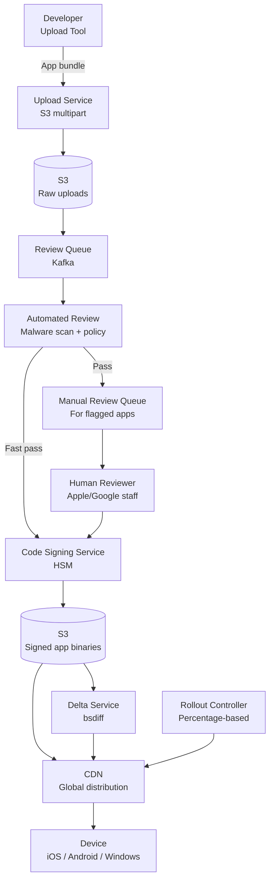

# Design a Digital App Distribution Platform

**Difficulty**: 🟡 Intermediate
**Reading Time**: ~25 minutes
**The Core Problem**: How do you build an app store that handles uploads from 10M developers, reviews and signs apps, distributes them to 100M devices, delivers delta updates efficiently, and manages version rollouts — at petabyte scale?

---

## Table of Contents

1. [Requirements](#1-requirements)
2. [Capacity Estimation](#2-capacity-estimation)
3. [High-Level Architecture](#3-high-level-architecture)
4. [App Upload & Review Pipeline](#4-app-upload--review-pipeline)
5. [Code Signing](#5-code-signing)
6. [CDN Distribution](#6-cdn-distribution)
7. [Delta Updates (Binary Diff)](#7-delta-updates-binary-diff)
8. [Gradual Rollout](#8-gradual-rollout)
9. [License Enforcement](#9-license-enforcement)
10. [Key Design Decisions](#10-key-design-decisions)
11. [Interview Questions](#11-interview-questions)
12. [Key Takeaways](#12-key-takeaways)
13. [References](#13-references)

---

## 1. Requirements

### Functional
- Developers upload app packages (APK/IPA/MSIX)
- Automated + manual review queue
- Code signing (store-issued certificate)
- Distribution to 100M devices
- Delta updates (download only changed bytes vs previous version)
- Gradual rollout (release to 1% → 10% → 100% of users)
- Version management (rollback capability)

### Non-Functional
- **Scale**: 10M apps, 100M devices, 5M updates/day
- **Download throughput**: peak 500 Gbps (major app launches)
- **Review time**: automated review < 1 hour; manual review < 48 hours
- **Availability**: 99.99% for downloads (can't distribute broken updates)

---

## 2. Capacity Estimation

| Metric | Estimate |
|--------|----------|
| Apps in store | 10M |
| New uploads/day | 100k (new + updates) |
| App size (avg) | 100 MB |
| Daily upload storage | 100k × 100MB = **10 TB/day** |
| Total app storage | 10M × 100MB = **1 PB** |
| Downloads/day | 5M × 100MB avg = **500 TB/day downloads** |
| Delta update size (avg) | 10% of full app = 10MB |
| CDN bandwidth savings (delta) | 90% → 500 TB/day × 0.1 = **50 TB from origin** |
| Review queue depth | 100k/day / 24hr = **70 uploads/min** |

---

## 3. High-Level Architecture



---

## 4. App Upload & Review Pipeline

### Upload Phase
```
1. Developer requests upload URL:
   POST /apps/{app_id}/versions
   → Response: { upload_url: "s3://...", version_id: "v2.3.0" }

2. Multi-part S3 upload (for large apps, 100MB+):
   Part size: 10 MB per part
   Parallel upload: 5 parts simultaneously
   Checksum: MD5 per part + SHA-256 of full file (integrity verification)

3. Upload complete callback:
   S3 triggers Lambda → publishes to Kafka: app.upload.complete { app_id, version_id, s3_path }
```

### Automated Review Checks
```
Automated checks run within 1 hour:

Static analysis:
  1. Malware scan: VirusTotal API (70+ antivirus engines) → if any flag → reject
  2. Permissions check: requested permissions vs app category
     (Why does a flashlight app need CONTACTS permission?)
  3. Privacy labels validation: declared data collection matches code scan
  4. Metadata check: title/description length, screenshots count, age rating

Dynamic analysis (sandbox execution):
  Run app in instrumented emulator for 5 minutes:
    Monitor: network calls, file access, API calls
    Detect: data exfiltration, crypto mining, ad fraud patterns

Pass/fail:
  PASS: proceed to code signing queue (fast pass, < 1 hour)
  FAIL: reject with reason codes, notify developer
  UNCERTAIN: escalate to human review queue
```

### Human Review Queue
```
~30% of submissions require human review
Priority queue (not FIFO):
  - New developer: high priority (first impression)
  - Update to existing approved app: lower priority
  - Flagged by automated system: highest priority (potential harm)

Reviewer tools:
  - App runs in emulated device
  - Screen recording of test session
  - Comparison diff to previous version (for updates)
  - Decision: APPROVE / REJECT / REQUEST_INFO

SLA: 48 hours (Apple) / 3 days (Google)
Review time tracked per category for SLA monitoring
```

---

## 5. Code Signing

Store signs every approved app with its own certificate — devices only run store-signed apps.

```
Code signing architecture:
  Signing key stored in HSM (Hardware Security Module)
  HSM: tamper-proof hardware device that holds private key
       key never leaves HSM; operations performed inside HSM

Signing process:
  1. Compute SHA-256 hash of app binary
  2. HSM signs hash with store private key: signature = RSA-SHA256(private_key, hash)
  3. Embed signature + certificate chain in app package
  4. Upload signed app to S3:
     s3://apps-signed/{app_id}/{version_id}/app-signed.ipa

Verification on device:
  1. Device downloads signed app
  2. Compute hash of downloaded binary
  3. Verify signature: RSA-verify(store_public_key, hash, signature)
  4. If valid → allow install
  5. If invalid → refuse install (tampered binary)

Key rotation:
  Annual rotation of signing key
  Old signatures remain valid (store keeps revocation list)
  New apps signed with new key
```

---

## 6. CDN Distribution

```
App binary size: 100 MB average
Delta size: 10 MB average

CDN strategy:
  Pre-position popular apps:
    Top 1000 apps (99% of downloads) → push to all CDN PoPs at release time
    Long-tail apps: pull-through cache (CDN fetches from S3 on first request)

Cache-Control:
  Versioned URLs → immutable: max-age=31536000 (1 year)
  URL: /apps/{app_id}/{version}/{hash}.ipa (hash in URL = version fingerprint)
  Content never changes for a given URL → perfect CDN caching

Bandwidth calculation for major app update:
  Facebook app: 100M users × 30% update in first day = 30M downloads
  App size: 150 MB (full) / 15 MB (delta)
  Delta: 30M × 15MB = 450 TB in first day = 5.2 Gbps average → CDN handles
  Full: 30M × 150MB = 4.5 PB → 52 Gbps average → CDN required
```

---

## 7. Delta Updates (Binary Diff)

Full re-download wastes bandwidth and user time. Delta updates download only changed bytes.

### Binary Diff Algorithm
```
Approach: bsdiff (suffix array based binary diff)
  Input: old_version.apk + new_version.apk
  Output: patch.bsdiff (typically 10–20% of new version size)

Apply patch on device:
  bspatch old_version.apk new_version.apk patch.bsdiff
  Result: new_version.apk (identical to original download)

For 100MB app with minor changes:
  Full download: 100 MB
  Delta download: 10 MB (90% bandwidth saving)

Pre-computation at release time:
  For each new version: compute diffs from last 3 versions
    v2.3 → v2.4 patch (1 version back)
    v2.2 → v2.4 patch (2 versions back)
    v2.1 → v2.4 patch (3 versions back)
  Covers 95% of users (most are on recent version)
  Cost: 3 × CPU time for bsdiff per release (run on dedicated patch server)

VCDIFF (RFC 3284) alternative:
  Streaming delta compression
  Used by Google Play for Android: "xdelta3" format
  More CPU efficient for large files (streaming vs in-memory bsdiff)
```

### Device-Side Patch Application
```
Steps on device:
  1. Check update: device OS version, current app version → server returns patch or full
  2. Download patch (10 MB) in background
  3. Apply patch: bspatch old_app patch new_app_candidate
  4. Verify: SHA-256(new_app_candidate) == expected_hash
  5. If valid: atomically swap old with new (rename)
  6. If invalid: delete candidate, fall back to full download

Atomic swap ensures no partial upgrade state
```

---

## 8. Gradual Rollout

```
Rollout percentages:
  Day 1: 1% of users (canary)
  Day 2: 10% (if no crash spikes)
  Day 3: 50%
  Day 4: 100%

User assignment (deterministic):
  hash(device_id + version_id) % 100 < rollout_percentage → update served

Rollout pauses automatically if:
  Crash rate (new version) / crash rate (old version) > 2×
  ANR (App Not Responding) rate increases
  1-star review spike in first 24 hours

Emergency rollback:
  Set rollout_percentage = 0 (stop serving new version)
  Already-updated users: cannot be easily downgraded (OS restriction)
  Future updates: rollback = publish new version from previous binary
```

---

## 9. License Enforcement

```
Per-device activation:
  App is purchased → license tied to user account + device (up to 5 devices)
  License check at app launch (online) or periodic check (offline grace: 7 days)

License server:
  POST /licenses/verify { user_id, device_id, app_id, receipt }
  Response: { valid: true, expires_at: null, features: ["premium"] }

Subscription apps:
  License re-checked daily
  Grace period on payment failure: 3 days
  After grace: app transitions to free tier (not blocked, to reduce user harm)

Free apps:
  No license check needed
  Downloaded and cached locally; no online verification required
```

---

## 10. Key Design Decisions

| Decision | Option A | Option B | Choice & Reason |
|----------|----------|----------|-----------------|
| App updates | Pull (device checks) | Push (store notifies) | **Pull** — devices check on their schedule; push to 1B devices simultaneously is a thundering herd |
| Delta format | bsdiff | VCDIFF (xdelta) | **Both** — bsdiff for iOS (better compression); VCDIFF for Android (streaming, lower peak memory) |
| Review automation | Pure ML | Rule-based + human | **Both** — ML for pattern matching (malware signatures); human for novel violations |
| Code signing | Client-side (developer's cert) | Store-signed | **Store-signed** — device trusts store certificate; developer certificates can be compromised |
| Rollout decision | Manual | Automated with crash signals | **Automated** — at 100M users, watching crash metrics manually is impractical; auto-pause on signal |

---

## 11. Interview Questions

| Question | Key Answer |
|----------|-----------|
| How do you prevent malicious apps from being distributed? | Multi-layer: malware scan → dynamic analysis in sandbox → human review → code signing (device rejects unsigned apps) |
| How does a device know an app is genuine? | Store-issued code signature on app binary; device verifies against store's public key at install time |
| What happens when you release a buggy update to 100M users? | Gradual rollout: only 1% affected first day; automated crash monitoring triggers pause; rollback = re-publish old version |
| How do you distribute a 100 MB app to 100M devices efficiently? | CDN with pre-positioned popular apps; delta updates reduce 100MB to 10MB for most users (90% bandwidth saving) |
| How do you handle a developer whose app is rejected? | Rejection reason codes + detailed explanation; developer can resubmit; appeal process for borderline cases |

---

## 12. Key Takeaways

- **Delta updates (bsdiff/VCDIFF)** reduce bandwidth by 90% for minor app updates — critical at 500 TB/day download volume
- **Gradual rollout** (1% → 10% → 100%) with automated crash monitoring is the safe deploy pattern for 100M+ users
- **Store-side code signing** via HSM ensures only reviewed apps run on devices — developer certificates alone cannot guarantee this
- **Pre-compute patches for last 3 versions** covers 95% of users while only storing 3× the patch computation cost
- **Pull-based updates** (device polls) scale better than push — pushing simultaneously to 1B devices is an uncontrolled thundering herd

---

## 📚 Resources & References

| Resource | Type | What You'll Learn |
|----------|------|------------------|
| [Apple App Store Review Guidelines](https://developer.apple.com/app-store/review/) | 📖 Blog | App review policy, automated and manual review criteria |
| [ByteByteGo — App Store Design](https://www.youtube.com/@ByteByteGo) | 📺 YouTube | Distribution system design, CDN, and update delivery |
| [bsdiff Binary Patching](http://www.daemonology.net/bsdiff/) | 📚 Book | Binary diff algorithm for delta update generation |
| [Google Play Android Delta Updates](https://android-developers.googleblog.com/2016/07/improvements-for-smaller-app-downloads.html) | 📖 Blog | Android delta update implementation at Google scale |
