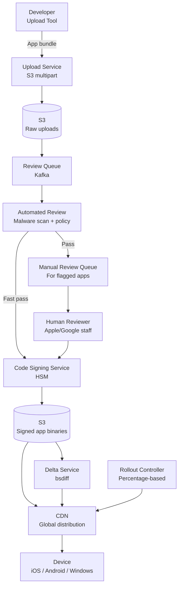
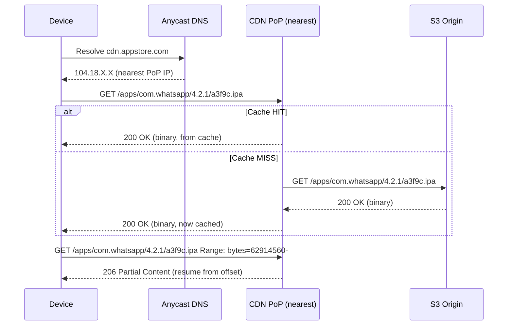
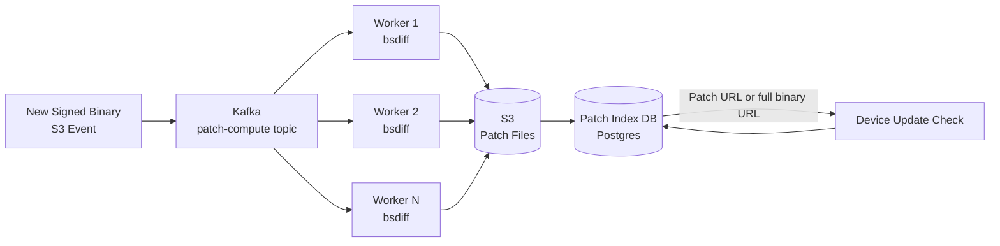

# Design a Digital App Distribution Platform

**Difficulty**: 🟡 Intermediate
**Reading Time**: ~25 minutes
**The Core Problem**: How do you build an app store that handles uploads from 10M developers, reviews and signs apps, distributes them to 100M devices, delivers delta updates efficiently, and manages version rollouts — at petabyte scale?

---

## Table of Contents

1. [Requirements](#1-requirements)
2. [Capacity Estimation](#2-capacity-estimation)
3. [High-Level Architecture](#3-high-level-architecture)
4. [App Upload & Review Pipeline](#4-app-upload--review-pipeline)
5. [Code Signing](#5-code-signing)
6. [CDN Distribution](#6-cdn-distribution)
7. [Delta Updates (Binary Diff)](#7-delta-updates-binary-diff)
8. [Gradual Rollout](#8-gradual-rollout)
9. [License Enforcement](#9-license-enforcement)
10. [Key Design Decisions](#10-key-design-decisions)
11. [Interview Questions](#11-interview-questions)
12. [Key Takeaways](#12-key-takeaways)
13. [References](#13-references)

---

## 1. Requirements

### Functional
- Developers upload app packages (APK/IPA/MSIX)
- Automated + manual review queue
- Code signing (store-issued certificate)
- Distribution to 100M devices
- Delta updates (download only changed bytes vs previous version)
- Gradual rollout (release to 1% → 10% → 100% of users)
- Version management (rollback capability)

### Non-Functional
- **Scale**: 10M apps, 100M devices, 5M updates/day
- **Download throughput**: peak 500 Gbps (major app launches)
- **Review time**: automated review < 1 hour; manual review < 48 hours
- **Availability**: 99.99% for downloads (can't distribute broken updates)

---

## 2. Capacity Estimation

| Metric | Estimate |
|--------|----------|
| Apps in store | 10M |
| New uploads/day | 100k (new + updates) |
| App size (avg) | 100 MB |
| Daily upload storage | 100k × 100MB = **10 TB/day** |
| Total app storage | 10M × 100MB = **1 PB** |
| Downloads/day | 5M × 100MB avg = **500 TB/day downloads** |
| Delta update size (avg) | 10% of full app = 10MB |
| CDN bandwidth savings (delta) | 90% → 500 TB/day × 0.1 = **50 TB from origin** |
| Review queue depth | 100k/day / 24hr = **70 uploads/min** |

---

## 3. High-Level Architecture



---

## 4. App Upload & Review Pipeline

### Upload Phase
```
1. Developer requests upload URL:
   POST /apps/{app_id}/versions
   → Response: { upload_url: "s3://...", version_id: "v2.3.0" }

2. Multi-part S3 upload (for large apps, 100MB+):
   Part size: 10 MB per part
   Parallel upload: 5 parts simultaneously
   Checksum: MD5 per part + SHA-256 of full file (integrity verification)

3. Upload complete callback:
   S3 triggers Lambda → publishes to Kafka: app.upload.complete { app_id, version_id, s3_path }
```

### Automated Review Checks
```
Automated checks run within 1 hour:

Static analysis:
  1. Malware scan: VirusTotal API (70+ antivirus engines) → if any flag → reject
  2. Permissions check: requested permissions vs app category
     (Why does a flashlight app need CONTACTS permission?)
  3. Privacy labels validation: declared data collection matches code scan
  4. Metadata check: title/description length, screenshots count, age rating

Dynamic analysis (sandbox execution):
  Run app in instrumented emulator for 5 minutes:
    Monitor: network calls, file access, API calls
    Detect: data exfiltration, crypto mining, ad fraud patterns

Pass/fail:
  PASS: proceed to code signing queue (fast pass, < 1 hour)
  FAIL: reject with reason codes, notify developer
  UNCERTAIN: escalate to human review queue
```

### Human Review Queue
```
~30% of submissions require human review
Priority queue (not FIFO):
  - New developer: high priority (first impression)
  - Update to existing approved app: lower priority
  - Flagged by automated system: highest priority (potential harm)

Reviewer tools:
  - App runs in emulated device
  - Screen recording of test session
  - Comparison diff to previous version (for updates)
  - Decision: APPROVE / REJECT / REQUEST_INFO

SLA: 48 hours (Apple) / 3 days (Google)
Review time tracked per category for SLA monitoring
```

---

## 5. Code Signing

Store signs every approved app with its own certificate — devices only run store-signed apps.

```
Code signing architecture:
  Signing key stored in HSM (Hardware Security Module)
  HSM: tamper-proof hardware device that holds private key
       key never leaves HSM; operations performed inside HSM

Signing process:
  1. Compute SHA-256 hash of app binary
  2. HSM signs hash with store private key: signature = RSA-SHA256(private_key, hash)
  3. Embed signature + certificate chain in app package
  4. Upload signed app to S3:
     s3://apps-signed/{app_id}/{version_id}/app-signed.ipa

Verification on device:
  1. Device downloads signed app
  2. Compute hash of downloaded binary
  3. Verify signature: RSA-verify(store_public_key, hash, signature)
  4. If valid → allow install
  5. If invalid → refuse install (tampered binary)

Key rotation:
  Annual rotation of signing key
  Old signatures remain valid (store keeps revocation list)
  New apps signed with new key
```

---

## 6. CDN Distribution

```
App binary size: 100 MB average
Delta size: 10 MB average

CDN strategy:
  Pre-position popular apps:
    Top 1000 apps (99% of downloads) → push to all CDN PoPs at release time
    Long-tail apps: pull-through cache (CDN fetches from S3 on first request)

Cache-Control:
  Versioned URLs → immutable: max-age=31536000 (1 year)
  URL: /apps/{app_id}/{version}/{hash}.ipa (hash in URL = version fingerprint)
  Content never changes for a given URL → perfect CDN caching

Bandwidth calculation for major app update:
  Facebook app: 100M users × 30% update in first day = 30M downloads
  App size: 150 MB (full) / 15 MB (delta)
  Delta: 30M × 15MB = 450 TB in first day = 5.2 Gbps average → CDN handles
  Full: 30M × 150MB = 4.5 PB → 52 Gbps average → CDN required
```

---

## 7. Delta Updates (Binary Diff)

Full re-download wastes bandwidth and user time. Delta updates download only changed bytes.

### Binary Diff Algorithm
```
Approach: bsdiff (suffix array based binary diff)
  Input: old_version.apk + new_version.apk
  Output: patch.bsdiff (typically 10–20% of new version size)

Apply patch on device:
  bspatch old_version.apk new_version.apk patch.bsdiff
  Result: new_version.apk (identical to original download)

For 100MB app with minor changes:
  Full download: 100 MB
  Delta download: 10 MB (90% bandwidth saving)

Pre-computation at release time:
  For each new version: compute diffs from last 3 versions
    v2.3 → v2.4 patch (1 version back)
    v2.2 → v2.4 patch (2 versions back)
    v2.1 → v2.4 patch (3 versions back)
  Covers 95% of users (most are on recent version)
  Cost: 3 × CPU time for bsdiff per release (run on dedicated patch server)

VCDIFF (RFC 3284) alternative:
  Streaming delta compression
  Used by Google Play for Android: "xdelta3" format
  More CPU efficient for large files (streaming vs in-memory bsdiff)
```

### Device-Side Patch Application
```
Steps on device:
  1. Check update: device OS version, current app version → server returns patch or full
  2. Download patch (10 MB) in background
  3. Apply patch: bspatch old_app patch new_app_candidate
  4. Verify: SHA-256(new_app_candidate) == expected_hash
  5. If valid: atomically swap old with new (rename)
  6. If invalid: delete candidate, fall back to full download

Atomic swap ensures no partial upgrade state
```

---

## 8. Gradual Rollout

```
Rollout percentages:
  Day 1: 1% of users (canary)
  Day 2: 10% (if no crash spikes)
  Day 3: 50%
  Day 4: 100%

User assignment (deterministic):
  hash(device_id + version_id) % 100 < rollout_percentage → update served

Rollout pauses automatically if:
  Crash rate (new version) / crash rate (old version) > 2×
  ANR (App Not Responding) rate increases
  1-star review spike in first 24 hours

Emergency rollback:
  Set rollout_percentage = 0 (stop serving new version)
  Already-updated users: cannot be easily downgraded (OS restriction)
  Future updates: rollback = publish new version from previous binary
```

---

## 9. License Enforcement

```
Per-device activation:
  App is purchased → license tied to user account + device (up to 5 devices)
  License check at app launch (online) or periodic check (offline grace: 7 days)

License server:
  POST /licenses/verify { user_id, device_id, app_id, receipt }
  Response: { valid: true, expires_at: null, features: ["premium"] }

Subscription apps:
  License re-checked daily
  Grace period on payment failure: 3 days
  After grace: app transitions to free tier (not blocked, to reduce user harm)

Free apps:
  No license check needed
  Downloaded and cached locally; no online verification required
```

---

## 10. Key Design Decisions

| Decision | Option A | Option B | Choice & Reason |
|----------|----------|----------|-----------------|
| App updates | Pull (device checks) | Push (store notifies) | **Pull** — devices check on their schedule; push to 1B devices simultaneously is a thundering herd |
| Delta format | bsdiff | VCDIFF (xdelta) | **Both** — bsdiff for iOS (better compression); VCDIFF for Android (streaming, lower peak memory) |
| Review automation | Pure ML | Rule-based + human | **Both** — ML for pattern matching (malware signatures); human for novel violations |
| Code signing | Client-side (developer's cert) | Store-signed | **Store-signed** — device trusts store certificate; developer certificates can be compromised |
| Rollout decision | Manual | Automated with crash signals | **Automated** — at 100M users, watching crash metrics manually is impractical; auto-pause on signal |

---

## 11. Interview Questions

| Question | Key Answer |
|----------|-----------|
| How do you prevent malicious apps from being distributed? | Multi-layer: malware scan → dynamic analysis in sandbox → human review → code signing (device rejects unsigned apps) |
| How does a device know an app is genuine? | Store-issued code signature on app binary; device verifies against store's public key at install time |
| What happens when you release a buggy update to 100M users? | Gradual rollout: only 1% affected first day; automated crash monitoring triggers pause; rollback = re-publish old version |
| How do you distribute a 100 MB app to 100M devices efficiently? | CDN with pre-positioned popular apps; delta updates reduce 100MB to 10MB for most users (90% bandwidth saving) |
| How do you handle a developer whose app is rejected? | Rejection reason codes + detailed explanation; developer can resubmit; appeal process for borderline cases |

---

## 12. Key Takeaways

- **Delta updates (bsdiff/VCDIFF)** reduce bandwidth by 90% for minor app updates — critical at 500 TB/day download volume
- **Gradual rollout** (1% → 10% → 100%) with automated crash monitoring is the safe deploy pattern for 100M+ users
- **Store-side code signing** via HSM ensures only reviewed apps run on devices — developer certificates alone cannot guarantee this
- **Pre-compute patches for last 3 versions** covers 95% of users while only storing 3× the patch computation cost
- **Pull-based updates** (device polls) scale better than push — pushing simultaneously to 1B devices is an uncontrolled thundering herd

---

## Component Deep Dive 1: CDN Distribution Layer

The CDN distribution layer is the most performance-critical component — it directly determines whether 100M devices can download apps without the origin servers melting. A naive approach of serving all traffic from a central S3 bucket would saturate at roughly 10 Gbps even with horizontal scaling, nowhere near the 500 Gbps peak demand during major app launches.

### How It Works Internally

CDN PoPs (Points of Presence) are distributed globally — typically 200-400 locations. Each PoP holds a partial cache of app binaries. When a device requests an app, the request routes to the nearest PoP via Anycast DNS. If the PoP has it cached, it serves locally. If not, it fetches from origin (S3) and caches — this is pull-through caching.

The key insight is URL immutability: every app version URL is `/{app_id}/{version}/{content_hash}.ipa`. Because the content hash is embedded in the URL, the binary for a given URL never changes. This lets CDN nodes set `Cache-Control: immutable, max-age=31536000` — a 1-year TTL with no revalidation. A PoP that has cached v2.3 of an app will never send a conditional GET back to origin for that same URL.

**Pre-warming vs pull-through**: Top 1000 apps (covering 99% of daily download volume) are pushed proactively to all PoPs at publish time. When WhatsApp releases an update, the CDN publisher script immediately enqueues a push job to all 350 PoPs before a single user requests it. Long-tail apps (the other 9.99 million) use pull-through — they get cached at individual PoPs on first request in that region.

**Byte-range requests**: Devices support resumable downloads via HTTP Range requests. CDN PoPs handle range requests transparently — a 100MB app download interrupted at 60MB resumes from byte 62,914,560 without re-downloading. This is critical in mobile environments with flaky connections.



### CDN Implementation Options

| Approach | Latency | Throughput | Trade-off |
|----------|---------|------------|-----------|
| Single-origin (S3 only) | 50–200ms | ~10 Gbps max | Simple, but origin melts at peak launch |
| CDN pull-through (no pre-warm) | 5–30ms (cache hit) / 200ms (miss) | 500+ Gbps | Good for long-tail; first requester per PoP pays full latency |
| CDN push pre-warm + pull fallback | 5–20ms for top apps | 500+ Gbps | Best performance; higher operational complexity and CDN storage cost |

---

## Component Deep Dive 2: Delta Update Pre-computation Pipeline

Delta updates are where the system earns back most of its bandwidth budget. At 5M updates/day with an average app size of 100MB, full downloads would cost 500TB/day from origin — with deltas, this drops to roughly 50TB (90% reduction). The challenge is generating and storing these patches efficiently before any device requests them.

### Internal Mechanics

When a new app version v2.4 is approved and signed, the patch server triggers a pre-computation job. It fetches the new binary and the last 3 approved versions (v2.3, v2.2, v2.1) from S3, then computes binary diffs using bsdiff or xdelta3.

**Why 3 versions?** Historical data shows version distribution: ~70% of users are on the immediately previous version, ~20% are one version older, ~5% are two versions older. Pre-computing 3 back covers 95%+ of users. Computing further back gives diminishing returns and generates increasingly large (less efficient) patches.

**Patch storage naming convention:**
```
s3://app-patches/{app_id}/from-{old_hash}-to-{new_hash}.patch
```

The device sends its current version hash in the update check request. The server looks up the pre-computed patch. If no patch exists (e.g., user is 4 versions behind), the server returns the full binary URL instead.

### Scale Behavior at 10x Load

At baseline, 100k new uploads/day × 3 patches each = 300k bsdiff operations/day. At 10x (1M uploads/day), naive sequential processing would require 10x the patch servers. The solution is a Kafka-backed worker pool — upload events queue in Kafka, patch workers consume and write to S3. Adding workers is elastic. The patch computation itself is CPU-bound (bsdiff for a 100MB binary takes ~15 seconds on a 4-core worker), so horizontal scaling directly addresses the throughput gap.



| Approach | Patch Size | CPU Cost | Device Memory |
|----------|-----------|----------|---------------|
| bsdiff (suffix array) | Best compression (~5–10% of app) | High (loads full files in RAM) | Low (apply is streaming) |
| xdelta3 / VCDIFF | Moderate (~10–15% of app) | Low (streaming, O(1) memory) | Very low |
| Google BSDiff variant (courgette) | Excellent for PE/ELF binaries | Moderate | Low |

---

## Component Deep Dive 3: Gradual Rollout Controller

The rollout controller decides which users receive which version of an app at any given moment. It is the safety mechanism that prevents a buggy update from simultaneously breaking 100M devices.

### Technical Design

User assignment is deterministic and stateless: `hash(device_id + app_id + version_id) % 10000`. If the result is less than the current rollout threshold (expressed as basis points — 100 = 1%), the device receives the new version URL; otherwise it receives the previous stable version URL.

Deterministic hashing ensures a device always gets the same assignment for a given rollout state — it won't flip back and forth between versions across update checks. It also means rollout segments are stable user cohorts, which is essential for crash attribution.

**Automated pause triggers** are implemented as a streaming consumer on crash telemetry events. The rollout service maintains a rolling 30-minute P99 crash rate per version. When new-version crash rate exceeds 2× the 7-day baseline for old version, the service automatically sets `rollout_threshold = 0` and pages the on-call engineer. No human needs to be watching a dashboard at 3am.

**Emergency rollback** is distinct from rollout pause: a rollback publishes a new version record pointing to the old binary. Since version URLs are immutable, devices that already downloaded the new version will re-download the old one — there is no "undo" for already-installed binaries at the OS level.

```mermaid
graph TD
    UpdateCheck[Device Update Check\nGET /apps/{id}/latest] --> RolloutSvc[Rollout Controller]
    RolloutSvc --> HashFn["hash(device_id + version_id) % 10000"]
    HashFn -->|< threshold| NewVersion[Return new version URL]
    HashFn -->|>= threshold| OldVersion[Return stable version URL]
    CrashTelemetry[Crash Telemetry\nKafka stream] --> Monitor[Crash Rate Monitor]
    Monitor -->|Rate > 2x baseline| AutoPause[Set threshold = 0\nPage on-call]
    RolloutSvc --> RolloutDB[(Rollout Config DB\nRedis)]
```

---

## Data Model

The core tables that power app distribution, update routing, and license enforcement:

```sql
-- App catalog
CREATE TABLE apps (
    app_id          UUID PRIMARY KEY DEFAULT gen_random_uuid(),
    bundle_id       VARCHAR(255) UNIQUE NOT NULL,  -- e.g. com.instagram.ios
    developer_id    UUID NOT NULL REFERENCES developers(developer_id),
    category        VARCHAR(64) NOT NULL,           -- social, productivity, games
    age_rating      SMALLINT NOT NULL,              -- 4, 9, 12, 17
    created_at      TIMESTAMPTZ NOT NULL DEFAULT now()
);

-- App versions (one row per approved version)
CREATE TABLE app_versions (
    version_id       UUID PRIMARY KEY DEFAULT gen_random_uuid(),
    app_id           UUID NOT NULL REFERENCES apps(app_id),
    version_string   VARCHAR(32) NOT NULL,           -- e.g. "4.2.1"
    build_number     BIGINT NOT NULL,
    binary_sha256    CHAR(64) NOT NULL,              -- content hash (also in CDN URL)
    signed_s3_key    TEXT NOT NULL,                  -- s3://apps-signed/{app_id}/{version_id}/app.ipa
    file_size_bytes  BIGINT NOT NULL,
    review_status    VARCHAR(32) NOT NULL,           -- pending, auto_pass, approved, rejected
    signature_cert   TEXT NOT NULL,                  -- PEM cert used to sign
    created_at       TIMESTAMPTZ NOT NULL DEFAULT now(),
    approved_at      TIMESTAMPTZ,
    UNIQUE (app_id, version_string)
);
CREATE INDEX idx_app_versions_app_status ON app_versions(app_id, review_status, approved_at DESC);

-- Rollout configuration (updated by rollout controller)
CREATE TABLE rollout_configs (
    app_id              UUID NOT NULL REFERENCES apps(app_id),
    target_version_id   UUID NOT NULL REFERENCES app_versions(version_id),
    rollout_bps         SMALLINT NOT NULL DEFAULT 0,  -- basis points: 100 = 1%, 10000 = 100%
    stable_version_id   UUID NOT NULL REFERENCES app_versions(version_id),
    paused              BOOLEAN NOT NULL DEFAULT false,
    pause_reason        TEXT,
    updated_at          TIMESTAMPTZ NOT NULL DEFAULT now(),
    PRIMARY KEY (app_id)
);

-- Pre-computed delta patches
CREATE TABLE delta_patches (
    patch_id         UUID PRIMARY KEY DEFAULT gen_random_uuid(),
    app_id           UUID NOT NULL REFERENCES apps(app_id),
    from_version_id  UUID NOT NULL REFERENCES app_versions(version_id),
    to_version_id    UUID NOT NULL REFERENCES app_versions(version_id),
    patch_s3_key     TEXT NOT NULL,
    patch_sha256     CHAR(64) NOT NULL,
    patch_size_bytes BIGINT NOT NULL,
    created_at       TIMESTAMPTZ NOT NULL DEFAULT now(),
    UNIQUE (from_version_id, to_version_id)
);
CREATE INDEX idx_delta_patches_lookup ON delta_patches(app_id, to_version_id, from_version_id);

-- License records
CREATE TABLE licenses (
    license_id     UUID PRIMARY KEY DEFAULT gen_random_uuid(),
    user_id        UUID NOT NULL,
    app_id         UUID NOT NULL REFERENCES apps(app_id),
    purchase_type  VARCHAR(32) NOT NULL,   -- one_time, subscription, free
    purchase_at    TIMESTAMPTZ NOT NULL,
    expires_at     TIMESTAMPTZ,            -- NULL for one-time purchases
    grace_until    TIMESTAMPTZ,            -- non-null during payment retry window
    UNIQUE (user_id, app_id)
);
CREATE INDEX idx_licenses_user ON licenses(user_id);
```

---

## Scale Bottlenecks

| Traffic Level | Component That Breaks | Symptoms | Mitigation |
|---------------|----------------------|----------|------------|
| 10x baseline (1M uploads/day) | Patch compute workers | Patch queue depth grows; devices fall back to full downloads; CDN origin bandwidth spikes | Autoscale worker pool via Kafka consumer group; increase worker instance count elastically |
| 10x baseline (50M downloads/day) | CDN origin (S3) | Cache miss rate rises for long-tail apps; S3 GET latency p99 degrades; download error rate increases | Expand pre-warm list from top 1k to top 10k apps; add CDN origin shield (single intermediate cache between PoPs and S3) |
| 100x baseline (500M downloads/day) | Rollout Config DB | Update check latency increases; rollout decisions slow; cascading timeouts on devices | Move rollout config to Redis Cluster (sub-millisecond reads); cache rollout config in CDN edge logic with 5s TTL |
| 100x baseline | License verification service | License check latency spikes; apps fail to launch for valid users | Add Redis cache layer for license responses (TTL: 1 hour for valid licenses); circuit-breaker for offline grace mode |
| 1000x baseline (5B downloads/day) | CDN peering and egress costs | Network egress bill explodes; CDN SLA violations at extreme PoP saturation | Peer with ISPs directly (Apple/Google run their own CDN infrastructure); use multicast delivery for top apps in carrier networks |

---

## How Google Built This: Google Play Store

Google Play serves 2.5 billion active Android devices across 190 countries, distributing over 3 million apps. Their engineering blog posts and Android Developers Summit talks reveal several non-obvious architectural decisions.

**APK splitting and AAB format**: In 2018 Google introduced the Android App Bundle (AAB) format. Instead of uploading one APK, developers upload a single AAB. Google Play's servers then generate device-specific APKs — delivering only the screen densities, CPU architectures (arm64, x86), and language resources needed by each device. A monolithic APK for a popular game might be 120MB. The device-specific APK for an arm64 phone with English locale might be 45MB — a 62% size reduction without the developer writing a single extra line of code. This is implemented as a server-side split/repack pipeline that runs after review approval.

**File-by-file delta compression**: Google's "File-by-File" patching (published as an open-source tool, archive-patcher) goes beyond binary-level bsdiff. APKs are ZIP archives; File-by-File unzips both old and new APK, diffs individual files (Java class files, resources, native libs), then recompresses. Result: patches average 65% smaller than bsdiff patches for typical app updates. Google reported this saved 6 petabytes of user download bandwidth in the first 6 months after rollout (source: Android Developers Blog, 2016).

**Dynamic delivery at update check time**: The Play Store client on a device sends its device fingerprint (CPU ABI list, screen density, installed languages, current APK version) in the update check request. The server-side delivery engine computes the optimal combination of base APK + configuration splits + delta patch in real time per device. This happens at roughly 50,000 update check requests per second globally.

**Staged rollouts**: Google Play's developer console exposes rollout percentage as a slider (0–100%). Internally, assignment uses `crc32(package_name + device_id) % 10000`. Developers can also target rollouts by country or Android version. Automated rollout halt is triggered when the ANR (App Not Responding) rate in the Firebase Crashlytics signal stream exceeds configurable thresholds.

Source: [Android Developers Blog — Smaller APKs with file-by-file patching](https://android-developers.googleblog.com/2016/12/saving-data-safely-with-app-updates.html), Google I/O 2019 "What's New in Android App Bundles."

---

## Interview Angle

**What the interviewer is testing:** Whether the candidate understands the end-to-end lifecycle of a binary artifact — from developer upload through security review, signing, CDN distribution, and safe rollout — and whether they can reason about the bandwidth and compute economics at 100M-device scale.

**Common mistakes candidates make:**

1. **Skipping code signing entirely.** Many candidates design the storage and CDN layers but never mention how a device verifies a binary is genuine. The interviewer will probe: "What stops a MITM from injecting a malicious binary?" The answer requires HSM-backed signing and on-device signature verification — without this the system has a critical security hole.

2. **Proposing push-based update notifications at scale.** Candidates often say "we'll push a notification to all devices when a new version is available." Pushing simultaneously to 1 billion devices is a self-inflicted thundering herd — all devices wake up and hammer the download infrastructure at the same moment. The correct answer is pull-based: devices check for updates on their own schedule (app launch, background refresh), with jitter.

3. **Ignoring delta updates for the bandwidth math.** If a candidate estimates 5M downloads/day × 100MB = 500TB/day and designs purely for that, they miss the 90% reduction achievable with delta updates. An interviewer noticing this will ask "how do you reduce CDN costs?" — missing delta updates signals unfamiliarity with how app stores actually work.

**The insight that separates good from great answers:** Pre-computing delta patches for the last 3 versions at publish time rather than generating patches on-demand per device request. On-demand patch generation would require the origin server to hold both binaries in memory and run bsdiff synchronously for each device — non-starter at 50,000 update checks/second. Pre-computation turns a latency-sensitive operation into a background batch job, and the patch is served directly from CDN cache just like any other immutable artifact.

---

## Key Numbers to Remember

| Metric | Value | Context |
|--------|-------|---------|
| Full app average size | 100 MB | Baseline for bandwidth math |
| Delta patch size | 10 MB (10% of full) | bsdiff for minor version update |
| Google File-by-File patch size | ~3.5 MB (3.5% of full) | Using archive-patcher on APK internals |
| Daily download volume (500GB peak) | 500 Gbps peak throughput | Major app launch (e.g., Facebook update) |
| CDN bandwidth saving (delta) | 90% | From 500 TB/day to ~50 TB origin egress |
| Rollout canary window | 1% of users on day 1 | ~1M users for a 100M install base |
| Automated pause trigger | 2× crash rate increase | Compared to 7-day baseline on old version |
| Patch pre-compute depth | Last 3 versions | Covers 95% of active users |
| bsdiff compute time | ~15 seconds | For 100MB binary on 4-core worker |
| Review SLA (automated) | < 1 hour | Automated static + dynamic analysis |
| Review SLA (manual) | 48 hours (Apple) / 72 hours (Google) | Human reviewer queue |
| Google Play update checks | ~50,000 req/sec | Global steady-state |

---

## 📚 Resources & References

| Resource | Type | What You'll Learn |
|----------|------|------------------|
| [Apple App Store Review Guidelines](https://developer.apple.com/app-store/review/) | 📖 Blog | App review policy, automated and manual review criteria |
| [ByteByteGo — App Store Design](https://www.youtube.com/@ByteByteGo) | 📺 YouTube | Distribution system design, CDN, and update delivery |
| [bsdiff Binary Patching](http://www.daemonology.net/bsdiff/) | 📚 Book | Binary diff algorithm for delta update generation |
| [Google Play Android Delta Updates](https://android-developers.googleblog.com/2016/07/improvements-for-smaller-app-downloads.html) | 📖 Blog | Android delta update implementation at Google scale |
