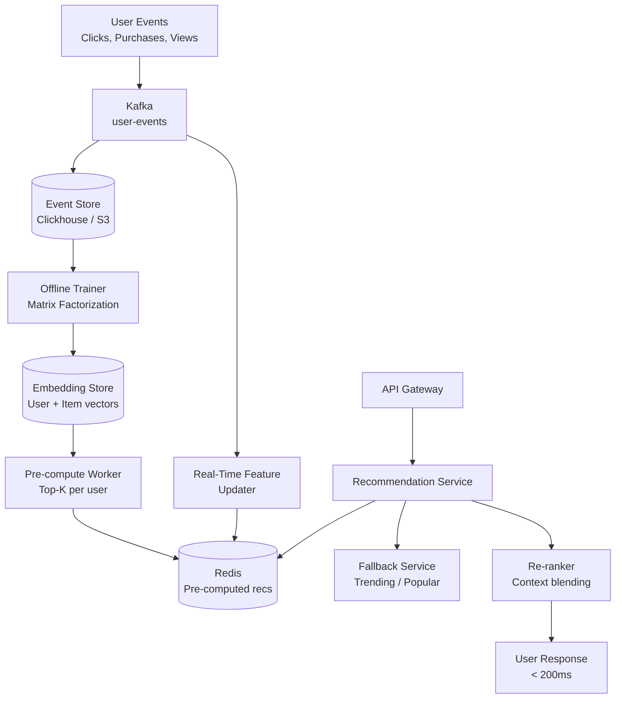

# Design an E-Commerce Recommendation System

**Difficulty**: 🟡 Intermediate
**Reading Time**: ~30 minutes
**The Core Problem**: How do you recommend relevant products to 100M users in < 200ms — using their purchase history, browsing behavior, and similar users' preferences — while handling new users with no history?

---

## Table of Contents

1. [Requirements](#1-requirements)
2. [Capacity Estimation](#2-capacity-estimation)
3. [High-Level Architecture](#3-high-level-architecture)
4. [Offline Training Pipeline](#4-offline-training-pipeline)
5. [Collaborative Filtering Deep Dive](#5-collaborative-filtering-deep-dive)
6. [Content-Based Features](#6-content-based-features)
7. [Online Serving (< 200ms)](#7-online-serving--200ms)
8. [Cold Start Problem](#8-cold-start-problem)
9. [A/B Testing Framework](#9-ab-testing-framework)
10. [Key Design Decisions](#10-key-design-decisions)
11. [Interview Questions](#11-interview-questions)
12. [Key Takeaways](#12-key-takeaways)
13. [References](#13-references)

---

## 1. Requirements

### Functional
- Personalized product recommendations on homepage, product page ("You may also like"), cart page
- Recommendations update with recent behavior (last 24 hours)
- Cold start: new users without purchase history still get relevant recommendations
- A/B testing: easily compare recommendation algorithms

### Non-Functional
- **Scale**: 100M users, 10M products, 500M interactions/day
- **Serving latency**: < 200ms for recommendation retrieval
- **Freshness**: User's recent actions reflected within 1 hour
- **Click-through rate target**: > 5% CTR (industry baseline: 1–3%)

---

## 2. Capacity Estimation

| Metric | Estimate |
|--------|----------|
| Users | 100M |
| Products | 10M |
| Interactions/day | 500M (views, clicks, purchases) |
| Pre-computed recommendations | 100M users × top-50 products = **5B pairs** |
| Storage (pre-computed) | 5B × 8 bytes (product_id) = **40 GB** (fits in Redis) |
| Recommendation QPS | 100M users × 5 page views/day / 86400s × 3× = **17k QPS** |
| Training frequency | Daily (offline model) + real-time signals |
| Model training time | ~4 hours on 100-GPU cluster for matrix factorization |

---

## 3. High-Level Architecture



---

## 4. Offline Training Pipeline

### Data Preparation
```
Interaction types with implicit feedback weights:
  purchase: weight = 10 (strong positive signal)
  add_to_cart: weight = 5
  click:  weight = 2
  view (> 30s): weight = 1
  view (< 5s): weight = 0 (bounce, likely irrelevant)

Data matrix:
  User × Item interaction matrix
  100M users × 10M items = 1 trillion possible entries
  Actual interactions: ~500M/day → very sparse (0.005% density)

Preprocessing:
  Remove bots (> 1000 interactions/day)
  Clip outliers: max weight per user-item pair = 20 (prevent spam)
  Normalize: user-level L2 normalization
```

### Model Training Schedule
```
Daily batch:
  1. Extract last 90 days of interactions from Clickhouse
  2. Train matrix factorization model (ALS or BPR)
  3. Generate user and item embedding vectors (dim=128)
  4. Deploy new embeddings to Embedding Store
  5. Trigger pre-computation of top-50 recs for all users

Duration: ~4 hours on 100-GPU cluster
Deployment: Blue-green (new model to staging → validate → swap to prod)
```

---

## 5. Collaborative Filtering Deep Dive

### Matrix Factorization (ALS — Alternating Least Squares)
```
Goal: Factor sparse interaction matrix R (user × item) into:
  R ≈ U × V^T
  U: 100M × 128 (user embeddings)
  V: 10M × 128 (item embeddings)

ALS training:
  Fix V → solve for each row of U (parallelizable)
  Fix U → solve for each row of V (parallelizable)
  Repeat 10–20 iterations until convergence

Prediction:
  Estimated preference of user u for item i:
  r̂(u,i) = U[u] · V[i]  (dot product)

Top-K for user u:
  ANN search: find 50 items with highest dot product with U[u]
  → 10ms using FAISS (same as visual search!)
```

### Item-to-Item Collaborative Filtering (Amazon's Method)
```
Alternative: don't embed users, just items.
"Users who bought X also bought Y"

item_similarity(X, Y) = |users who bought both X and Y| / |users who bought X or Y|
  (Jaccard similarity on buyer sets)

Benefits:
  - No user embedding needed (no cold start for known items)
  - Simple to explain: "customers also bought"
  - Fast: precompute top-20 similar items per item → store in Redis

Storage: 10M items × top-20 × 8 bytes = 1.6 GB (trivial)
Used by: Amazon's "Frequently Bought Together", "Customers Also Bought"
```

---

## 6. Content-Based Features

Supplement collaborative filtering with product features:

```
Product attributes for content-based similarity:
  - Category (electronics → laptop → gaming laptop)
  - Brand
  - Price range (budget / mid / premium)
  - Product embeddings (from product description + images)

Combined hybrid score:
  score(u, i) = 0.7 × CF_score(u, i)     (collaborative filtering)
              + 0.2 × CB_score(u, i)      (content-based, user's taste profile)
              + 0.1 × popularity_score(i) (trending / bestseller)

User taste profile (content-based):
  Average of item embeddings for items user purchased
  Updated incrementally: new_taste = 0.9 × old_taste + 0.1 × new_item_embedding
```

---

## 7. Online Serving (< 200ms)

### Pre-Computed Recommendations
```
Pre-compute top-50 for each user daily:

Redis schema:
  key: recs:{user_id}
  value: List of product_ids (50 items)
  TTL: 25 hours (refreshed daily before expiry)

At request time (homepage):
  1. GET recs:{user_id} from Redis [2ms]
  2. Filter: remove already-purchased items, out-of-stock items [3ms]
  3. Fetch metadata for remaining items (product name, price, image) [10ms]
  4. Apply real-time context (page type, time of day) [< 1ms]
  5. Return top-20 [< 1ms]

Total: ~16ms (well within 200ms SLA)
```

### Real-Time Session Signals
```
Problem: Pre-computed recs don't reflect what user browsed in current session

Solution: Blend pre-computed + real-time session
  Session recent items (last 5 clicks): stored in Redis with 1hr TTL
  key: session_context:{user_id}
  value: [product_id_1, product_id_2, ...]

At serving:
  1. Fetch session context [2ms]
  2. For each session item → fetch pre-computed "similar items" [5ms]
  3. Blend: merge session-based recs with pre-computed recs
     score = 0.6 × pre_computed_score + 0.4 × session_similarity_score
  4. De-duplicate, re-rank, return top-20
```

---

## 8. Cold Start Problem

### New Users (No History)
```
Tier 1 — Anonymous (0 interactions):
  Show: Trending products in most popular categories
  Show: Editorial picks / bestsellers
  Show: "New arrivals" section

Tier 2 — New registered user (registration step):
  Onboarding: "What are you interested in?" (5-10 category tiles)
  User selects: Electronics, Gaming, Home Decor
  → Show top products in selected categories immediately

Tier 3 — Limited history (1–10 purchases):
  Hybrid: 50% category-based (selected at onboarding)
         + 50% item-to-item CF (based on their few purchases)
  Graduate to full CF after 30 interactions

Graduation curve:
  0 interactions: 100% popular/trending
  5 interactions: 50% popular + 50% CF
  30 interactions: 10% popular + 90% CF
```

### New Items (No Purchase History)
```
New item added today: no user interactions → CF score = 0

Solution: content-based embedding fills the gap
  1. Compute product embedding from description + images (same as visual search)
  2. Find similar items using ANN search
  3. New item appears in "similar items" for those related products
  4. After 100 interactions: organic CF score takes over

Exploration budget:
  5% of recommendation slots reserved for new items
  Tracks impressions and clicks → items with CTR > 3% get promoted to regular pool
```

---

## 9. A/B Testing Framework

```
Experiment design:
  Control: Algorithm A (current production)
  Treatment: Algorithm B (new model)
  Split: 10% of users to treatment (start small)

Metrics to measure:
  Primary: CTR (click-through rate on recommendations)
  Secondary: Conversion rate (purchase from recommendation)
  Guardrail: Latency (must stay < 200ms)
  Guardrail: Diversity (avoid filter bubble — measure category spread)

Assignment:
  user_id % 100 < 10 → treatment (deterministic, consistent per user)
  Log: { user_id, experiment_id, variant, recommendation_ids, context }

Analysis:
  Run for minimum 2 weeks (capture weekly seasonality)
  Statistical significance: p < 0.05 with power = 0.8
  Ship if treatment CTR > control CTR by > 0.5% (practical significance)
```

---

## 10. Key Design Decisions

| Decision | Option A | Option B | Choice & Reason |
|----------|----------|----------|-----------------|
| Algorithm | Collaborative filtering | Content-based | **Hybrid** — CF captures collective wisdom; CB handles cold start and new items |
| Serving model | Pre-computed (Redis) | Real-time inference | **Pre-computed + session blend** — real-time is 10× slower; pre-compute handles 90% of traffic |
| Freshness | Daily retrain | Continuous learning | **Daily batch + real-time session signals** — full continuous training is complex; session signals add freshness for free |
| Embedding dimension | 512 | 128 | **128** — 4× smaller index; marginal quality loss (< 1% CTR difference) |
| Cold start | Same algorithm | Separate cold-start path | **Separate path** — cold start users need different signals; forcing them through CF returns garbage |

---

## 11. Interview Questions

| Question | Key Answer |
|----------|-----------|
| How do you avoid the "filter bubble"? | Diversity constraint: max 3 items from same category in top-20; 5% exploration budget for new items |
| How does matrix factorization handle implicit feedback (views, not explicit ratings)? | Weighted ALS: treat unobserved pairs as negative with weight 1, observed interactions with higher weight |
| How do you measure recommendation quality without a clear right answer? | Offline: AUC on held-out interactions; Online: CTR and conversion rate via A/B test |
| What happens if Redis is down for pre-computed recommendations? | Fallback: real-time popular products by category (simpler query, always available) |
| How do you handle seasonal products (Christmas decorations)? | Time-decay weighting: recent interactions weighted 2× vs 3-month-old; seasonal model retrained weekly in peak season |

---

## 12. Key Takeaways

- **Pre-computed recommendations in Redis** (not real-time inference) is what achieves < 200ms at 17k QPS — inference at request time would need 170 GPU servers
- **Hybrid CF + content-based** addresses both the main case (known user) and cold start (new user/item)
- **Session signals blended at serving time** add freshness without retraining — the most cost-effective freshness mechanism
- **Separate cold-start tier** is critical — generic popular items for new users perform 3× better than forcing them through an undertrained CF model
- **A/B test everything** — intuitive-seeming algorithm changes sometimes hurt CTR; data beats intuition in recommendation systems

---

## 📚 Resources & References

| Resource | Type | What You'll Learn |
|----------|------|------------------|
| [Amazon Item-to-Item Collaborative Filtering (2003)](https://www.cs.umd.edu/~samir/498/Amazon-Recommendations.pdf) | 📖 Blog | Foundational paper on item-based CF at scale |
| [Netflix Recommendations — Beyond 5 Stars](https://netflixtechblog.com/netflix-recommendations-beyond-the-5-stars-part-1-55838468f429) | 📖 Blog | Netflix Prize lessons and production recommendation architecture |
| [ByteByteGo — Recommendation System Design](https://www.youtube.com/@ByteByteGo) | 📺 YouTube | End-to-end recommendation system walkthrough |
| [Designing ML Systems — Chip Huyen](https://www.oreilly.com/library/view/designing-machine-learning/9781098107956/) | 📚 Book | Production ML system design patterns including recommendations |
