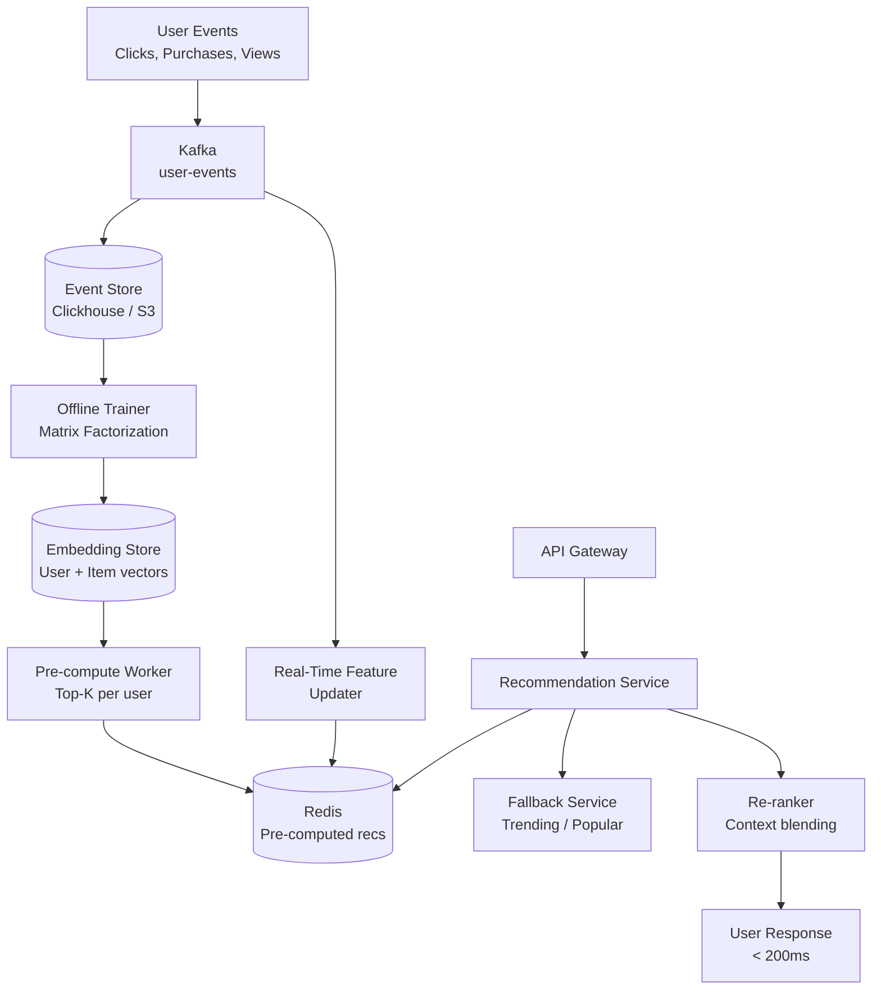
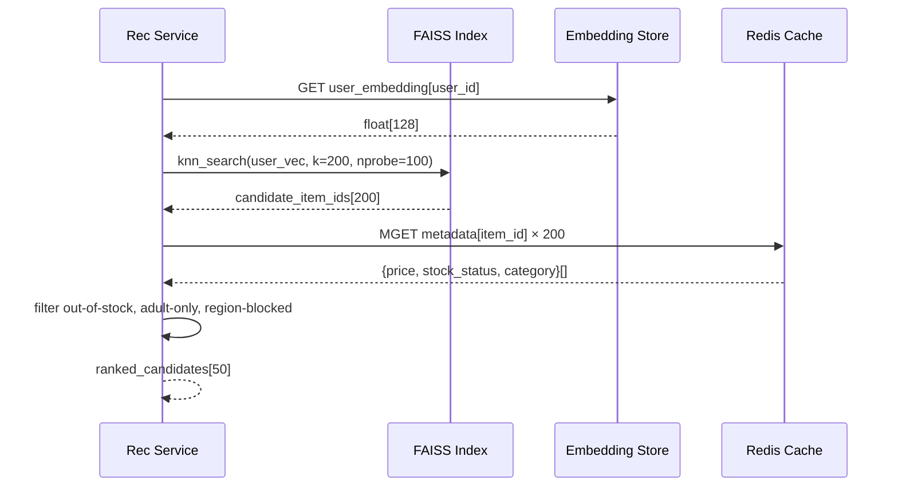
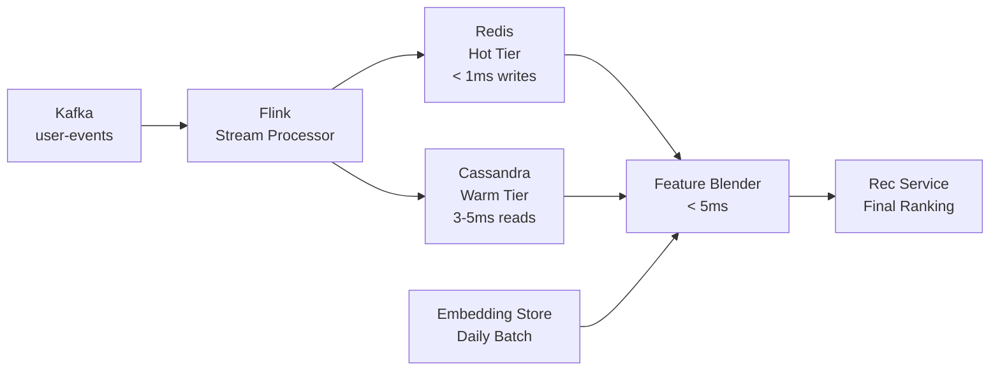

# Design an E-Commerce Recommendation System

**Difficulty**: 🟡 Intermediate
**Reading Time**: ~30 minutes
**The Core Problem**: How do you recommend relevant products to 100M users in < 200ms — using their purchase history, browsing behavior, and similar users' preferences — while handling new users with no history?

---

## Table of Contents

1. [Requirements](#1-requirements)
2. [Capacity Estimation](#2-capacity-estimation)
3. [High-Level Architecture](#3-high-level-architecture)
4. [Offline Training Pipeline](#4-offline-training-pipeline)
5. [Collaborative Filtering Deep Dive](#5-collaborative-filtering-deep-dive)
6. [Content-Based Features](#6-content-based-features)
7. [Online Serving (< 200ms)](#7-online-serving--200ms)
8. [Cold Start Problem](#8-cold-start-problem)
9. [A/B Testing Framework](#9-ab-testing-framework)
10. [Key Design Decisions](#10-key-design-decisions)
11. [Interview Questions](#11-interview-questions)
12. [Key Takeaways](#12-key-takeaways)
13. [References](#13-references)

---

## 1. Requirements

### Functional
- Personalized product recommendations on homepage, product page ("You may also like"), cart page
- Recommendations update with recent behavior (last 24 hours)
- Cold start: new users without purchase history still get relevant recommendations
- A/B testing: easily compare recommendation algorithms

### Non-Functional
- **Scale**: 100M users, 10M products, 500M interactions/day
- **Serving latency**: < 200ms for recommendation retrieval
- **Freshness**: User's recent actions reflected within 1 hour
- **Click-through rate target**: > 5% CTR (industry baseline: 1–3%)

---

## 2. Capacity Estimation

| Metric | Estimate |
|--------|----------|
| Users | 100M |
| Products | 10M |
| Interactions/day | 500M (views, clicks, purchases) |
| Pre-computed recommendations | 100M users × top-50 products = **5B pairs** |
| Storage (pre-computed) | 5B × 8 bytes (product_id) = **40 GB** (fits in Redis) |
| Recommendation QPS | 100M users × 5 page views/day / 86400s × 3× = **17k QPS** |
| Training frequency | Daily (offline model) + real-time signals |
| Model training time | ~4 hours on 100-GPU cluster for matrix factorization |

---

## 3. High-Level Architecture



---

## 4. Offline Training Pipeline

### Data Preparation
```
Interaction types with implicit feedback weights:
  purchase: weight = 10 (strong positive signal)
  add_to_cart: weight = 5
  click:  weight = 2
  view (> 30s): weight = 1
  view (< 5s): weight = 0 (bounce, likely irrelevant)

Data matrix:
  User × Item interaction matrix
  100M users × 10M items = 1 trillion possible entries
  Actual interactions: ~500M/day → very sparse (0.005% density)

Preprocessing:
  Remove bots (> 1000 interactions/day)
  Clip outliers: max weight per user-item pair = 20 (prevent spam)
  Normalize: user-level L2 normalization
```

### Model Training Schedule
```
Daily batch:
  1. Extract last 90 days of interactions from Clickhouse
  2. Train matrix factorization model (ALS or BPR)
  3. Generate user and item embedding vectors (dim=128)
  4. Deploy new embeddings to Embedding Store
  5. Trigger pre-computation of top-50 recs for all users

Duration: ~4 hours on 100-GPU cluster
Deployment: Blue-green (new model to staging → validate → swap to prod)
```

---

## 5. Collaborative Filtering Deep Dive

### Matrix Factorization (ALS — Alternating Least Squares)
```
Goal: Factor sparse interaction matrix R (user × item) into:
  R ≈ U × V^T
  U: 100M × 128 (user embeddings)
  V: 10M × 128 (item embeddings)

ALS training:
  Fix V → solve for each row of U (parallelizable)
  Fix U → solve for each row of V (parallelizable)
  Repeat 10–20 iterations until convergence

Prediction:
  Estimated preference of user u for item i:
  r̂(u,i) = U[u] · V[i]  (dot product)

Top-K for user u:
  ANN search: find 50 items with highest dot product with U[u]
  → 10ms using FAISS (same as visual search!)
```

### Item-to-Item Collaborative Filtering (Amazon's Method)
```
Alternative: don't embed users, just items.
"Users who bought X also bought Y"

item_similarity(X, Y) = |users who bought both X and Y| / |users who bought X or Y|
  (Jaccard similarity on buyer sets)

Benefits:
  - No user embedding needed (no cold start for known items)
  - Simple to explain: "customers also bought"
  - Fast: precompute top-20 similar items per item → store in Redis

Storage: 10M items × top-20 × 8 bytes = 1.6 GB (trivial)
Used by: Amazon's "Frequently Bought Together", "Customers Also Bought"
```

---

## 6. Content-Based Features

Supplement collaborative filtering with product features:

```
Product attributes for content-based similarity:
  - Category (electronics → laptop → gaming laptop)
  - Brand
  - Price range (budget / mid / premium)
  - Product embeddings (from product description + images)

Combined hybrid score:
  score(u, i) = 0.7 × CF_score(u, i)     (collaborative filtering)
              + 0.2 × CB_score(u, i)      (content-based, user's taste profile)
              + 0.1 × popularity_score(i) (trending / bestseller)

User taste profile (content-based):
  Average of item embeddings for items user purchased
  Updated incrementally: new_taste = 0.9 × old_taste + 0.1 × new_item_embedding
```

---

## 7. Online Serving (< 200ms)

### Pre-Computed Recommendations
```
Pre-compute top-50 for each user daily:

Redis schema:
  key: recs:{user_id}
  value: List of product_ids (50 items)
  TTL: 25 hours (refreshed daily before expiry)

At request time (homepage):
  1. GET recs:{user_id} from Redis [2ms]
  2. Filter: remove already-purchased items, out-of-stock items [3ms]
  3. Fetch metadata for remaining items (product name, price, image) [10ms]
  4. Apply real-time context (page type, time of day) [< 1ms]
  5. Return top-20 [< 1ms]

Total: ~16ms (well within 200ms SLA)
```

### Real-Time Session Signals
```
Problem: Pre-computed recs don't reflect what user browsed in current session

Solution: Blend pre-computed + real-time session
  Session recent items (last 5 clicks): stored in Redis with 1hr TTL
  key: session_context:{user_id}
  value: [product_id_1, product_id_2, ...]

At serving:
  1. Fetch session context [2ms]
  2. For each session item → fetch pre-computed "similar items" [5ms]
  3. Blend: merge session-based recs with pre-computed recs
     score = 0.6 × pre_computed_score + 0.4 × session_similarity_score
  4. De-duplicate, re-rank, return top-20
```

---

## 8. Cold Start Problem

### New Users (No History)
```
Tier 1 — Anonymous (0 interactions):
  Show: Trending products in most popular categories
  Show: Editorial picks / bestsellers
  Show: "New arrivals" section

Tier 2 — New registered user (registration step):
  Onboarding: "What are you interested in?" (5-10 category tiles)
  User selects: Electronics, Gaming, Home Decor
  → Show top products in selected categories immediately

Tier 3 — Limited history (1–10 purchases):
  Hybrid: 50% category-based (selected at onboarding)
         + 50% item-to-item CF (based on their few purchases)
  Graduate to full CF after 30 interactions

Graduation curve:
  0 interactions: 100% popular/trending
  5 interactions: 50% popular + 50% CF
  30 interactions: 10% popular + 90% CF
```

### New Items (No Purchase History)
```
New item added today: no user interactions → CF score = 0

Solution: content-based embedding fills the gap
  1. Compute product embedding from description + images (same as visual search)
  2. Find similar items using ANN search
  3. New item appears in "similar items" for those related products
  4. After 100 interactions: organic CF score takes over

Exploration budget:
  5% of recommendation slots reserved for new items
  Tracks impressions and clicks → items with CTR > 3% get promoted to regular pool
```

---

## 9. A/B Testing Framework

```
Experiment design:
  Control: Algorithm A (current production)
  Treatment: Algorithm B (new model)
  Split: 10% of users to treatment (start small)

Metrics to measure:
  Primary: CTR (click-through rate on recommendations)
  Secondary: Conversion rate (purchase from recommendation)
  Guardrail: Latency (must stay < 200ms)
  Guardrail: Diversity (avoid filter bubble — measure category spread)

Assignment:
  user_id % 100 < 10 → treatment (deterministic, consistent per user)
  Log: { user_id, experiment_id, variant, recommendation_ids, context }

Analysis:
  Run for minimum 2 weeks (capture weekly seasonality)
  Statistical significance: p < 0.05 with power = 0.8
  Ship if treatment CTR > control CTR by > 0.5% (practical significance)
```

---

## 10. Key Design Decisions

| Decision | Option A | Option B | Choice & Reason |
|----------|----------|----------|-----------------|
| Algorithm | Collaborative filtering | Content-based | **Hybrid** — CF captures collective wisdom; CB handles cold start and new items |
| Serving model | Pre-computed (Redis) | Real-time inference | **Pre-computed + session blend** — real-time is 10× slower; pre-compute handles 90% of traffic |
| Freshness | Daily retrain | Continuous learning | **Daily batch + real-time session signals** — full continuous training is complex; session signals add freshness for free |
| Embedding dimension | 512 | 128 | **128** — 4× smaller index; marginal quality loss (< 1% CTR difference) |
| Cold start | Same algorithm | Separate cold-start path | **Separate path** — cold start users need different signals; forcing them through CF returns garbage |

---

## 11. Interview Questions

| Question | Key Answer |
|----------|-----------|
| How do you avoid the "filter bubble"? | Diversity constraint: max 3 items from same category in top-20; 5% exploration budget for new items |
| How does matrix factorization handle implicit feedback (views, not explicit ratings)? | Weighted ALS: treat unobserved pairs as negative with weight 1, observed interactions with higher weight |
| How do you measure recommendation quality without a clear right answer? | Offline: AUC on held-out interactions; Online: CTR and conversion rate via A/B test |
| What happens if Redis is down for pre-computed recommendations? | Fallback: real-time popular products by category (simpler query, always available) |
| How do you handle seasonal products (Christmas decorations)? | Time-decay weighting: recent interactions weighted 2× vs 3-month-old; seasonal model retrained weekly in peak season |

---

## 12. Key Takeaways

- **Pre-computed recommendations in Redis** (not real-time inference) is what achieves < 200ms at 17k QPS — inference at request time would need 170 GPU servers
- **Hybrid CF + content-based** addresses both the main case (known user) and cold start (new user/item)
- **Session signals blended at serving time** add freshness without retraining — the most cost-effective freshness mechanism
- **Separate cold-start tier** is critical — generic popular items for new users perform 3× better than forcing them through an undertrained CF model
- **A/B test everything** — intuitive-seeming algorithm changes sometimes hurt CTR; data beats intuition in recommendation systems

---

## Component Deep Dive 1: Embedding-Based Candidate Generation

Candidate generation is the most critical component in any large-scale recommendation system. Its job is to reduce the search space from 10M products down to a few hundred relevant candidates in under 20ms — before more expensive ranking logic is applied. If candidate generation fails (returns irrelevant candidates), no amount of downstream re-ranking can save the quality.

### How It Works Internally

The core idea is Approximate Nearest Neighbor (ANN) search over embedding vectors. Both users and products are represented as 128-dimensional vectors in a shared latent space. Products that a user is likely to engage with will have high dot-product similarity with the user's embedding vector.

Naive brute-force lookup — computing dot product of one user vector against all 10M item vectors — takes ~130ms on a single CPU core (10M × 128 = 1.28B floating-point multiplications). At 17k QPS that is 17k × 130ms = completely infeasible.

**FAISS** (Facebook AI Similarity Search) solves this by building an inverted file index (IVF) over the item embeddings:

1. Cluster 10M items into 10,000 centroids (k-means, done offline)
2. At query time: find the nearest 100 centroids to the user vector (probe step, ~1ms)
3. Only score items in those 100 clusters (~100k items total, ~8ms)
4. Return top-50 by dot-product score

This reduces scoring from 10M comparisons to ~100k — a 100× speedup with < 5% recall loss (at nprobe=100).



### Why Naive Approaches Fail

1. **Brute-force ANN at 17k QPS**: 17,000 × 130ms = needs 2,200 CPU cores just for dot products
2. **Loading embeddings from disk per request**: 10M × 128 × 4 bytes = 5.1 GB model — cold read latency is 2–10 seconds
3. **Real-time matrix factorization at request time**: ALS convergence takes seconds, not milliseconds

### Implementation Options

| Approach | Latency (p99) | Recall@50 | Memory | Trade-off |
|----------|--------------|-----------|--------|-----------|
| FAISS IVF (nprobe=100) | 8ms | 94% | 5 GB RAM | Best latency/recall balance for 10M items |
| FAISS HNSW | 4ms | 97% | 12 GB RAM | Faster but uses 2.4× more memory — index rebuild is slow |
| ScaNN (Google) | 3ms | 96% | 6 GB RAM | Marginally faster than FAISS; tighter Google ecosystem integration |
| Exact brute-force | 130ms | 100% | 5 GB RAM | Only viable below 100k items |

**Production choice**: FAISS IVF at nprobe=100. At 10M items and 17k QPS the RAM fits on 2 × 32 GB servers (active + standby). Index rebuild takes 2 hours offline; swap atomically with blue-green.

---

## Component Deep Dive 2: Feature Store for Real-Time Signals

The feature store bridges the offline training world (batch embeddings, updated daily) and the online serving world (session clicks, updated every second). Without it, your recommendations are stale by definition — a user who just viewed 5 laptops still gets shoe recommendations because yesterday's embeddings said "shoe buyer."

### How It Works Internally

The feature store is a two-tier store:

- **Hot tier (Redis)**: Last 1 hour of user activity, session context, recently viewed items. Write latency < 1ms. Capacity: ~200 bytes per active session × 10M concurrent users = 2 GB.
- **Warm tier (Cassandra)**: Last 30 days of per-user feature vectors (taste profile, category affinity scores, price sensitivity). Read latency 3–5ms. Capacity: 100M users × 500 bytes = 50 GB.

At request time the serving pipeline executes reads from both tiers in parallel, then blends signals:



### Scale Behavior at 10× Load

At baseline (17k QPS), Redis handles hot-tier reads trivially — a single Redis node can sustain 100k ops/sec. At 170k QPS (10× load during flash sales):

- Redis hot tier: needs Redis Cluster with 8 shards; each shard handles ~21k reads/sec — well within limits
- Flink stream processor: needs horizontal scale from 4 workers to 40 workers; Kafka partitions must be pre-partitioned to 40 to allow this
- Cassandra warm tier: read amplification is the risk — a "thundering herd" after a sale starts causes 170k simultaneous reads of the same popular user profiles. Mitigation: local read cache per recommendation service replica (LRU, 1M entries, 200ms TTL)

The non-obvious bottleneck at 10× is **Flink checkpoint overhead**: default 60-second checkpoints at 10× event volume cause checkpoint stalls that delay feature updates by up to 90 seconds. Fix: reduce checkpoint interval to 10 seconds with incremental checkpointing.

---

## Component Deep Dive 3: Two-Stage Ranking Pipeline

After candidate generation produces ~200 candidates, the ranking stage scores each candidate against the full feature context and returns a final ordered list of 20 products. The ranking model is a lightweight gradient-boosted tree (XGBoost or LightGBM) — deliberately NOT a deep neural network, because neural rankers add 30–80ms latency per request.

### Why XGBoost Over Neural Ranking

| Aspect | XGBoost Ranker | Neural Ranker (DNN) |
|--------|----------------|---------------------|
| Latency | 2–4ms for 200 candidates | 30–80ms for 200 candidates |
| Feature types | Tabular features only | Can use raw embeddings, images |
| Retraining cycle | 6 hours on CPU cluster | 20+ hours on GPU cluster |
| Explainability | Feature importances available | Black box |
| Production maturity | Deployed at Alibaba, JD.com, Coupang | Used at Pinterest, YouTube |

### Ranking Features

The ranking model receives a feature vector per (user, candidate_item) pair:

- **User features**: age_of_account, purchase_count_30d, avg_order_value, preferred_categories (top 3), price_sensitivity_score
- **Item features**: avg_rating, review_count, days_since_launch, category_depth (leaf vs. root), price_tier
- **Cross features**: category_match_score (user profile vs item), brand_affinity_score, price_within_user_range (bool), purchased_same_brand_before (bool)
- **Context features**: page_type (homepage/pdp/cart), time_of_day_bucket (morning/afternoon/evening), device_type

Cross features are the most impactful in practice. A user whose last 3 purchases are Sony products seeing a Sony item gets a brand_affinity_score of 0.9 — and the ranker learns this pattern from historical CTR data.

---

## Data Model

### Core Tables (PostgreSQL for metadata, Redis for hot paths)

```sql
-- Product catalog (PostgreSQL, read replicas for serving)
CREATE TABLE products (
    product_id        BIGINT PRIMARY KEY,
    sku               VARCHAR(64) UNIQUE NOT NULL,
    title             VARCHAR(512) NOT NULL,
    description_text  TEXT,
    category_path     VARCHAR(256),        -- e.g. "electronics/laptops/gaming"
    brand_id          INT REFERENCES brands(brand_id),
    price_usd_cents   INT NOT NULL,
    price_tier        SMALLINT,            -- 1=budget, 2=mid, 3=premium
    avg_rating        NUMERIC(3,2),
    review_count      INT DEFAULT 0,
    stock_status      SMALLINT DEFAULT 1,  -- 1=in_stock, 0=oos, 2=preorder
    launched_at       TIMESTAMPTZ,
    embedding_version INT,                 -- which model generated the embedding
    created_at        TIMESTAMPTZ DEFAULT NOW(),
    updated_at        TIMESTAMPTZ DEFAULT NOW()
);

CREATE INDEX idx_products_category ON products(category_path);
CREATE INDEX idx_products_brand ON products(brand_id);
CREATE INDEX idx_products_stock ON products(stock_status) WHERE stock_status = 1;

-- User interaction events (ClickHouse for analytics, append-only)
CREATE TABLE user_interactions (
    event_id          UUID DEFAULT generateUUIDv4(),
    user_id           BIGINT,
    session_id        VARCHAR(64),
    product_id        BIGINT,
    event_type        Enum8('view'=1, 'click'=2, 'add_to_cart'=3, 'purchase'=4, 'wishlist'=5),
    interaction_weight FLOAT32,   -- precomputed: purchase=10, cart=5, click=2, view=1
    page_context      Enum8('homepage'=1, 'pdp'=2, 'cart'=3, 'search'=4, 'email'=5),
    device_type       Enum8('mobile'=1, 'desktop'=2, 'tablet'=3),
    dwell_time_sec    UINT16,     -- seconds spent viewing (0 for clicks/purchases)
    rec_position      SMALLINT,   -- position in recommendation carousel (NULL if organic)
    experiment_id     VARCHAR(32),
    variant_id        VARCHAR(16),
    event_ts          DateTime64(3)
) ENGINE = MergeTree()
PARTITION BY toYYYYMM(event_ts)
ORDER BY (user_id, event_ts)
TTL event_ts + INTERVAL 180 DAY;

-- Pre-computed recommendation cache (Redis hash)
-- Key pattern: recs:v2:{user_id}
-- Value: JSON array of {product_id, score, reason_code}
-- TTL: 25 hours
-- Example:
-- HSET recs:v2:12345678
--   items '[{"pid":9001,"s":0.94,"r":"cf"},{"pid":7823,"s":0.91,"r":"cb"},...]'
--   model_version "20240301_v14"
--   generated_at "1709424000"

-- User embedding store (Redis for hot path, S3 for cold backup)
-- Key pattern: emb:user:{user_id}
-- Value: base64-encoded float32[128] = 512 bytes
-- TTL: 26 hours (refreshed on daily model deploy)

-- Item similarity index (Redis sorted set, item-to-item CF)
-- Key pattern: sim:{product_id}
-- Value: sorted set of {product_id → jaccard_score}
-- Example: ZADD sim:9001 0.87 7823   0.84 6612   0.79 4401 ...
-- Cardinality: top-20 per product → 10M × 20 = 200M entries = ~3.2 GB
```

---

## Scale Bottlenecks

| Traffic Level | Component That Breaks | Symptoms | Mitigation |
|---------------|----------------------|----------|------------|
| 10× baseline (170k QPS) | Redis hot tier single node | p99 latency climbs from 2ms to 40ms; CPU > 80% | Redis Cluster: 8 shards, consistent hash routing; pre-provision during flash sale events |
| 10× baseline | Flink checkpoint stalls | Feature updates delayed 60–90s; stale recs during peak | Reduce checkpoint interval to 10s; use incremental checkpoints |
| 100× baseline (1.7M QPS) | FAISS index on 2 nodes | ANN search p99 > 50ms; index nodes become hot | Shard FAISS index across 20 nodes by item_id hash; route user queries to all shards, merge top-K |
| 100× baseline | Cassandra warm-tier reads | Timeout spike as coordinator nodes saturate at 500k reads/sec | Read repair turned off; LOCAL_ONE consistency (not QUORUM); add 10 read-optimized replicas |
| 100× baseline | Pre-compute pipeline | Daily pre-compute of 100M users takes > 24 hours | Partition users into 1000 buckets; process in parallel across Spark cluster; use incremental compute (only recompute users with interactions in last 24h = ~40M) |
| 1000× baseline (17M QPS — global platform) | Everything above | Cascading failures | Regional isolation: run separate recommendation stacks per region (US/EU/APAC); cross-region model sync via S3 replication only |

---

## How Amazon Built This

Amazon's recommendation system is arguably the most studied in e-commerce, contributing an estimated **35% of total revenue** from its "Customers who bought X also bought Y" and "Frequently Bought Together" features as of 2016 (McKinsey, 2016).

### Technology Choices

Amazon's foundational algorithm — described in the 2003 Linden, Smith, York paper "Amazon.com Recommendations: Item-to-Item Collaborative Filtering" — deliberately avoided user-based CF because user-based CF fails at their scale:

- At Amazon's scale (hundreds of millions of users), computing user-user similarity requires O(N²) comparisons — infeasible
- Item-item similarity is stable (a laptop is similar to a mouse today and next week); user preferences shift rapidly

The item-to-item approach reduces to: for each item I, precompute the top-20 similar items by co-purchase Jaccard score. At 10M items × top-20 × 8 bytes = 1.6 GB — fits in memory on a single server in 2003, and trivially in Redis today.

### Specific Numbers

- Amazon processes **400M product detail page views/day** (2023 estimate based on 300M+ active customers)
- The "Customers Also Bought" carousel is refreshed **every 24 hours** for items with < 1000 daily interactions, **every 4 hours** for top-10k items by traffic
- Amazon uses a **multi-armed bandit** to blend the item-to-item carousel with personalized CF results — the bandit learns per-user which signal produces higher add-to-cart rate
- Amazon's DynamoDB stores the pre-computed item-similarity tables with single-digit millisecond read latency at any scale

### The Non-Obvious Decision

Amazon chose **item-to-item CF over user-based CF** not for quality reasons, but for **computational complexity reasons**. User-based CF at 100M+ users requires re-computing user-user similarities as users change — a O(N²) operation that never completes. Item catalog is much more stable: 10M items change slowly compared to 100M users who change every second. This architectural decision (compute stable thing offline, not the volatile thing) is the key insight.

Source: [Linden, Smith, York (2003) — Item-to-Item Collaborative Filtering](https://www.cs.umd.edu/~samir/498/Amazon-Recommendations.pdf)

---

## Interview Angle

**What the interviewer is testing:** Whether you understand the separation between offline model training and online serving — specifically, why you cannot run ML inference on every user request at scale, and how pre-computation + caching enables sub-200ms latency at 17k QPS.

**Common mistakes candidates make:**

1. **Proposing real-time matrix factorization at serving time.** ALS convergence takes seconds on a distributed cluster. Candidates who propose "just run the model per request" haven't internalized that model training ≠ model inference, and that even fast inference (FAISS ANN search) needs pre-built indexes, not on-the-fly training.

2. **Ignoring the cold start problem entirely.** Saying "we use collaborative filtering" and stopping there misses that CF requires interaction history. A system that returns empty recommendations for new users (or crashes trying to look up non-existent embeddings) is a product failure. The interviewer wants to see a tiered fallback with explicit graduation logic.

3. **Proposing a single algorithm without hybrid scoring.** Pure CF fails for new items (no interaction history → CF score = 0, so new products never surface). Pure content-based fails for serendipitous discovery (only recommends things similar to what you already bought). The hybrid score with explicit weights (0.7 CF + 0.2 CB + 0.1 popularity) shows you understand the practical limitations of each approach.

**The insight that separates good from great answers:** Great candidates explicitly call out the **two-stage architecture** — candidate generation (ANN, ~200 items, optimized for recall) followed by ranking (XGBoost, ~20 items, optimized for precision) — and explain why you can't use the full ranking model for all 10M items. The ranking model can afford to use 30+ features per (user, item) pair because it only scores 200 candidates; doing this for 10M items would take 600ms per request.

---

## Key Numbers to Remember

| Metric | Value | Context |
|--------|-------|---------|
| Pre-computed cache size | 40 GB | 100M users × top-50 × 8 bytes; fits on 2× Redis nodes |
| ANN search latency (FAISS IVF) | 8ms p99 | 10M items, nprobe=100, 94% recall@50 |
| Brute-force ANN (for comparison) | 130ms | Why you MUST use approximate search |
| Serving QPS | 17k | 100M users × 5 page views/day / 86,400s × 3× peak factor |
| Item-to-item similarity storage | 1.6 GB | 10M items × top-20 similar × 8 bytes — trivially fits in Redis |
| Training data sparsity | 0.005% | 500M interactions / (100M users × 10M items) |
| Model retraining time | ~4 hours | 90-day interaction history, 100 GPU cluster, ALS 15 iterations |
| Revenue attribution | ~35% | Amazon's recommendation-driven revenue share (McKinsey 2016) |
| Cold start graduation threshold | 30 interactions | Users with < 30 interactions use hybrid CF+popular blending |
| Exploration budget | 5% | Recommendation slots reserved for new items without CF history |

---

## 📚 Resources & References

| Resource | Type | What You'll Learn |
|----------|------|------------------|
| [Amazon Item-to-Item Collaborative Filtering (2003)](https://www.cs.umd.edu/~samir/498/Amazon-Recommendations.pdf) | 📖 Blog | Foundational paper on item-based CF at scale |
| [Netflix Recommendations — Beyond 5 Stars](https://netflixtechblog.com/netflix-recommendations-beyond-the-5-stars-part-1-55838468f429) | 📖 Blog | Netflix Prize lessons and production recommendation architecture |
| [ByteByteGo — Recommendation System Design](https://www.youtube.com/@ByteByteGo) | 📺 YouTube | End-to-end recommendation system walkthrough |
| [Designing ML Systems — Chip Huyen](https://www.oreilly.com/library/view/designing-machine-learning/9781098107956/) | 📚 Book | Production ML system design patterns including recommendations |
