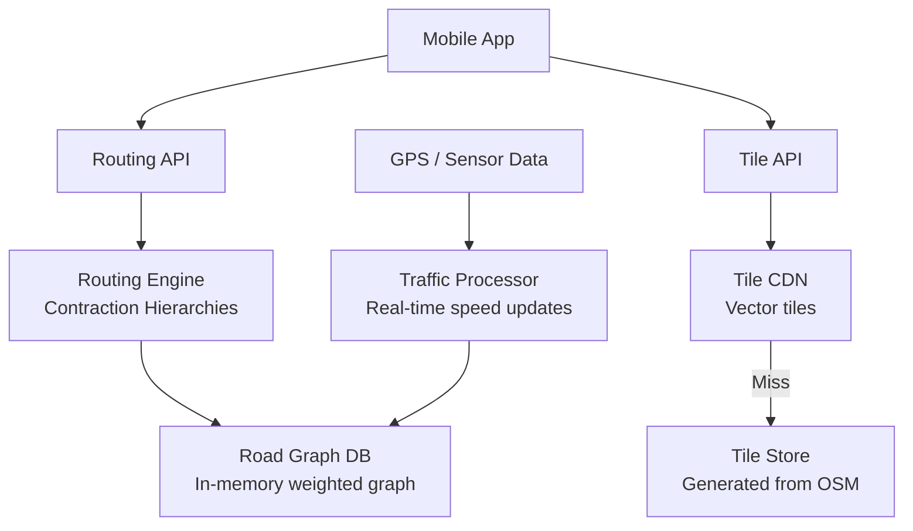
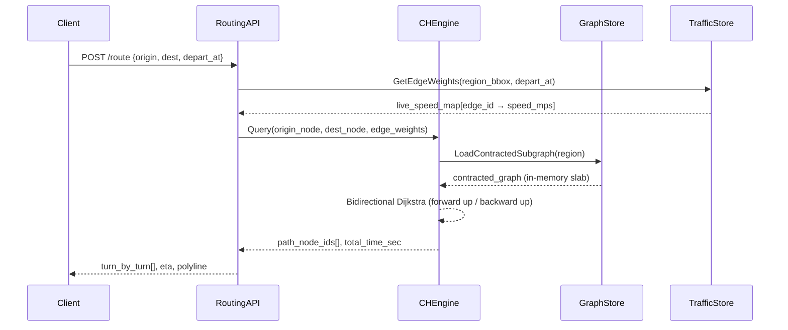
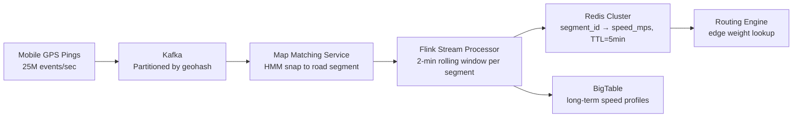

# Design Google Maps — Navigation at Scale

**Difficulty**: 🔴 Advanced
**Reading Time**: Coming Soon
**Interview Frequency**: High

---

> 🚧 **Full article coming soon.** This stub gives you the essentials to start thinking about this problem.

---

## The Core Problem

Computing shortest routes across 100 million road segments with real-time traffic in under 500ms — naive Dijkstra on a full road graph would take minutes. Hierarchical routing algorithms pre-compute "important" roads (highways, arterials) so routing can skip low-level roads, achieving sub-second performance on global-scale graphs.

## Functional Requirements

- Navigate between two locations with turn-by-turn directions
- Account for real-time traffic conditions
- Support walking, driving, cycling, transit modes
- Show map tiles at multiple zoom levels
- Estimated arrival time (ETA) with confidence interval

## Non-Functional Requirements

| Requirement | Target |
|-------------|--------|
| Route computation latency | p99 < 500ms for driving routes |
| Map tile delivery | < 100ms from CDN |
| Traffic freshness | Road speeds updated every 2 minutes |
| Scale | 1B users, 25M route requests/day |

## Back-of-Envelope Estimates

- **Route requests**: 25M/day ÷ 86,400 = ~290 routing computations/sec
- **Road graph size**: 100M road segments × 100 bytes = ~10GB — fits in RAM on a large machine
- **Map tiles**: World map at 21 zoom levels → ~4.3 trillion tiles (99% ocean/empty; store only ~100B tiles)

## Key Design Decisions

1. **Contraction Hierarchies for Fast Routing** — pre-process road graph: add "shortcut" edges for frequent highway paths; during query, expand search from both source and destination simultaneously (bidirectional Dijkstra) only on high-importance nodes; reduces search space from 100M to ~1,000 nodes.
2. **Time-Dependent Edge Weights** — edge weight (travel time) varies by time of day and real-time traffic; incorporate historical speed profiles (Mon 8am on I-405 = 15mph) + live sensor/GPS data; re-weight edges every 2 minutes from anonymized user GPS.
3. **Vector Tiles for Map Rendering** — encode map geometry (roads, buildings) as vector data per tile; client renders at native resolution; tiles smaller than raster images; zoom and pan without re-requesting tiles; cache aggressively at CDN and client.

## High-Level Architecture



## Top Interview Questions for This Problem

| Question | Tests |
|----------|-------|
| Why doesn't Google Maps use plain Dijkstra on the full road graph? | Algorithm scalability, graph size |
| How does Google collect real-time traffic data? | Crowdsourced GPS, privacy implications |
| How would you re-route a user who takes a wrong turn? | Incremental re-routing, cost of replanning |

## Related Concepts

- [Yelp nearby search for point-of-interest lookup on maps](./yelp-nearby)
- [Uber Backend for real-time driver routing on the same map data](../04-reservation-scheduling/uber-backend)

---

*Full deep-dive with multiple approaches, trade-off tables, and pseudocode below.*

---

## Component Deep Dive 1: Routing Engine — Contraction Hierarchies

The routing engine is the most latency-critical component in the entire system. A naive Dijkstra run on a 100 million node road graph takes 5–30 seconds — far beyond the 500ms p99 target. The solution is **Contraction Hierarchies (CH)**, a two-phase algorithm that pre-processes the graph offline and then answers online queries in milliseconds.

**Phase 1 — Preprocessing (offline, runs nightly):**

Every node in the road graph is assigned an "importance" rank. Importance is computed by simulating removal of a node and counting how many shortest paths need new shortcut edges to maintain correctness. Motorways and major arterials rank highest; residential cul-de-sacs rank lowest. Nodes are iteratively contracted from least to most important. When a node is contracted, shortcut edges are added between its neighbors if the shortest path between them passes through that node. After contraction, the graph has ~2–3x more edges but queries only need to visit the top 0.01% of nodes (roughly 10,000 nodes out of 100 million).

**Phase 2 — Online Query (bidirectional Dijkstra on hierarchy):**

At query time, a bidirectional search runs simultaneously from source and destination. The forward search only traverses edges going up the importance hierarchy; the backward search only traverses edges going down. The two frontiers meet somewhere in the middle at a high-importance node (usually a motorway junction). This reduces the effective search space from 100 million nodes to roughly 1,000 nodes, yielding query times of 1–10ms on a single core.

**Time-dependent CH (TDCH):**

Traffic makes edge weights non-constant. Each road segment stores a speed profile array — 288 slots (one per 5 minutes over 24 hours) — encoding historical speeds by day-of-week and time-of-day. Real-time GPS deltas are blended in with exponential decay (recent observations weighted 3x more than 1-hour-old data). TDCH re-runs preprocessing every 4 hours for structural changes (road closures, construction) and applies live edge-weight patches without full recomputation.



| Approach | Query Latency | Preprocessing Time | Memory | Trade-off |
|----------|--------------|-------------------|--------|-----------|
| Plain Dijkstra | 5–30s | None | 10GB | Correct, too slow for p99 target |
| A* with heuristic | 500ms–2s | None | 10GB | Better than Dijkstra but still 10x too slow for complex routes |
| Contraction Hierarchies | 1–50ms | 4–8h (global) | 25GB (with shortcuts) | Fastest queries; preprocessing must re-run on topology changes |
| RAPTOR (transit) | 20–200ms | 1–2h | 5GB | Optimal for public transit; not applicable to driving |

---

## Component Deep Dive 2: Real-Time Traffic Ingestion Pipeline

Traffic data is not collected from roadside sensors alone — the majority comes from anonymized GPS pings from users who have opted into location sharing. Google Maps processes roughly **25 million active navigation sessions** at peak, generating ~1 GPS ping per second per session = **25 million GPS events/sec**. This stream cannot be stored raw and must be aggregated into per-segment speed estimates within 2 minutes.

**Ingestion flow:**

GPS pings arrive via a gRPC stream from mobile clients. Each ping carries `{user_token_hash, lat, lng, speed_mps, heading_deg, accuracy_m, timestamp_ms}`. The user token is one-way hashed on-device — no PII reaches the backend. A map-matching service snaps each GPS point to the most likely road segment using Hidden Markov Model (HMM) inference. The matched result is `{segment_id, observed_speed_mps, confidence}`.

A distributed stream processor (Apache Kafka + Flink) partitions events by `segment_id` and maintains a rolling 2-minute window. For each segment it computes a weighted median speed, discarding outliers (e.g., stopped GPS points during a tunnel). The median is written to a Redis cluster keyed by `segment_id` with a 5-minute TTL.

**At 10x load (250M events/sec):**

Kafka partitioning becomes the bottleneck. The fix is geographic sharding — each Kafka topic partition is assigned a geohash cell (precision 5 ≈ 4.9km × 4.9km cells), capping partition throughput at ~2.5M events/sec. Flink scales horizontally across partitions. Redis write throughput limits at ~500k writes/sec per node; at 10x load, Redis Cluster with 50 shards handles ~25M writes/sec total.



| Approach | Latency to Update | Storage | Staleness Risk |
|----------|------------------|---------|----------------|
| GPS crowdsourcing (current) | 2 min | ~50GB Redis (active segments) | Low if user density high; high on rural roads |
| Road sensor networks | 5–15 min | Negligible | Moderate; fixed install locations |
| Commercial data feeds (TomTom, HERE) | 5 min | External API cost | Low accuracy; expensive per-call |

---

## Component Deep Dive 3: Tile Serving and Vector Tile Generation

Map tiles are pre-rendered slices of the world at 21 discrete zoom levels. At zoom 0, the entire world fits in a single 256×256 tile. At zoom 21, a single tile covers roughly 0.3m × 0.3m — individual buildings are visible. The total tile count across all zoom levels is ~4.3 trillion, but 99% of Earth is ocean or uninhabited; the meaningfully unique tile set is ~100 billion tiles.

**Vector vs. Raster tiles:**

Raster tiles are PNG/JPEG images pre-rendered server-side. They are large (10–100KB each) and fixed-resolution — zooming in makes them blurry. Google Maps switched to vector tiles around 2013. Vector tiles encode geometry as binary Protocol Buffer data (roads as polylines, buildings as polygons, labels as point + text). File size is 5–20KB per tile. The client GPU renders the geometry at native display resolution. This enables smooth zoom animations (fractional zoom levels) and reduces total tile bytes transferred by ~80%.

**Tile generation pipeline:**

Raw geodata (OpenStreetMap contributions + proprietary surveys + satellite imagery analysis) is processed by a Geo Data Processing pipeline that simplifies geometry (Douglas-Peucker algorithm), assigns style layers, and encodes into Mapbox Vector Tile (MVT) format. Tiles are generated in parallel using a global job queue — rendering all 100B relevant tiles takes ~3 days on a 10,000-core cluster. Changed tiles (due to new road data or business updates) are re-rendered incrementally within minutes using a change-detection diff feed.

**Caching strategy:**

Static tiles (zoom 0–12, rarely changes) are cached at CDN edge nodes globally with 30-day TTL and ~98% hit rate. Dynamic tiles (zoom 13–21, updated when road data changes) carry 1-hour CDN TTL. The CDN miss path fetches from a regional tile object store (Google Cloud Storage equivalent) — cold cache misses add 20–50ms. The client app pre-fetches tiles for the predicted 5km navigation corridor to eliminate mid-route cache misses.

---

## Data Model

```sql
-- Road graph stored as adjacency list in a columnar store (BigTable equivalent)
-- Row key: segment_id (uint64, geohash-ordered for locality)

CREATE TABLE road_segments (
    segment_id        BIGINT PRIMARY KEY,       -- geohash-encoded 64-bit ID
    from_node_id      BIGINT NOT NULL,
    to_node_id        BIGINT NOT NULL,
    length_meters     FLOAT NOT NULL,
    road_class        SMALLINT NOT NULL,        -- 0=motorway, 1=trunk, 2=primary … 7=path
    speed_limit_mps   FLOAT,                    -- NULL if unknown
    oneway            BOOLEAN DEFAULT FALSE,
    toll              BOOLEAN DEFAULT FALSE,
    geom              GEOMETRY(LINESTRING, 4326),
    ch_rank           INT,                      -- contraction hierarchy importance rank
    ch_level          SMALLINT,                 -- hierarchy level (0=local, 5=motorway)
    INDEX idx_from_node (from_node_id),
    INDEX idx_to_node   (to_node_id),
    INDEX idx_ch_rank   (ch_rank)               -- used during CH query phase
);

-- Shortcut edges added during CH preprocessing
CREATE TABLE ch_shortcuts (
    shortcut_id       BIGINT PRIMARY KEY,
    from_node_id      BIGINT NOT NULL,
    to_node_id        BIGINT NOT NULL,
    via_node_id       BIGINT NOT NULL,          -- contracted node this shortcut bypasses
    weight_seconds    FLOAT NOT NULL,           -- free-flow travel time
    INDEX idx_from    (from_node_id),
    INDEX idx_to      (to_node_id)
);

-- Time-dependent speed profiles (historical, per segment, per 5-min slot)
CREATE TABLE speed_profiles (
    segment_id        BIGINT NOT NULL,
    day_of_week       TINYINT NOT NULL,         -- 0=Mon, 6=Sun
    slot_index        SMALLINT NOT NULL,        -- 0..287 (288 slots × 5min = 24h)
    speed_mps         FLOAT NOT NULL,
    sample_count      INT NOT NULL,             -- number of GPS pings in this slot
    PRIMARY KEY (segment_id, day_of_week, slot_index)
);

-- Live traffic (Redis, not SQL — shown as table for clarity)
-- Key:   "traffic:{segment_id}"
-- Value: { speed_mps: float, confidence: float, updated_at: epoch_ms }
-- TTL:   300 seconds (5 min)

-- Map tiles stored in object storage (GCS/S3-equivalent)
-- Key pattern: "tiles/{z}/{x}/{y}.mvt"
-- Metadata table for invalidation tracking:
CREATE TABLE tile_metadata (
    tile_key          VARCHAR(40) PRIMARY KEY,  -- "z/x/y"
    zoom_level        TINYINT NOT NULL,
    last_generated_at TIMESTAMP NOT NULL,
    data_version      INT NOT NULL,             -- increment triggers CDN invalidation
    size_bytes        INT NOT NULL,
    INDEX idx_zoom_version (zoom_level, data_version)
);

-- Navigation sessions (written on session start, updated on reroute)
CREATE TABLE nav_sessions (
    session_id        UUID PRIMARY KEY,
    user_id_hash      CHAR(64) NOT NULL,        -- SHA-256 of user_id, one-way
    origin_lat        DOUBLE NOT NULL,
    origin_lng        DOUBLE NOT NULL,
    dest_lat          DOUBLE NOT NULL,
    dest_lng          DOUBLE NOT NULL,
    mode              ENUM('driving','walking','cycling','transit') NOT NULL,
    route_polyline    TEXT,                     -- encoded polyline
    eta_seconds       INT,
    reroute_count     SMALLINT DEFAULT 0,
    started_at        TIMESTAMP NOT NULL,
    completed_at      TIMESTAMP,
    INDEX idx_user_hash (user_id_hash),
    INDEX idx_started   (started_at)
);
```

---

## Scale Bottlenecks

| Traffic Level | Component That Breaks | Symptoms | Mitigation |
|---------------|----------------------|----------|------------|
| 10x baseline (2,900 route req/sec) | Routing Engine — single-region | p99 latency creeps to 800ms; CPU at 90% | Horizontal sharding by geographic region; 10 regional routing clusters, each holding a subgraph |
| 10x baseline (250M GPS events/sec) | Kafka ingest brokers | Consumer lag grows; traffic data goes stale (>10 min) | Increase Kafka partitions from 100 → 1,000; add geo-sharding to prevent hot partitions in dense cities |
| 100x baseline (29,000 route req/sec) | CH preprocessing pipeline | Nightly CH rebuild takes >24h; shortcuts become stale | Incremental CH updates for local topology changes; full rebuild only for structural changes (new highways) |
| 100x baseline (tile requests) | CDN origin — tile store | Tile store read IOPS saturated; CDN miss latency >500ms | Increase CDN PoP count from 50 → 200; pre-warm tiles along predicted navigation corridors |
| 1,000x baseline (290,000 route req/sec) | Map-matching service (HMM snapping) | CPU-bound HMM inference cannot keep up; GPS lag increases | Pre-compute road graph spatial index (R-tree) per region; serve map matching from in-memory index; scale to 1,000 stateless matching pods |
| 1,000x baseline (storage) | Speed profiles table (BigTable) | Hot row contention on dense urban segment_ids; read amplification | Shard speed profiles by geohash cell prefix; cache top 10M urban segment profiles in regional Redis |

---

## How Uber Built This (Routing and ETA at Scale)

Uber operates one of the largest real-time routing systems outside of Google Maps, handling **15 million trips per day** across 70+ countries with sub-200ms ETA requirements. Their engineering blog documents several non-obvious architectural decisions.

**H3 Geospatial Indexing:**

Uber built [H3](https://www.uber.com/blog/h3/), a hexagonal hierarchical geospatial indexing system, to partition the world into uniform hexagonal cells at 16 resolution levels. Hexagonal grids have constant neighbor-distance (unlike rectangular grids where diagonal neighbors are 1.41x farther) — this property makes distance calculations and supply-demand balancing more accurate. Resolution 9 cells (~0.1 km² each) are used for driver-supply tracking; resolution 7 (~5 km²) for surge pricing zones.

**OSRM for Open-Source Routing:**

Uber runs [OSRM](https://project-osrm.org/) (Open Source Routing Machine), which also uses Contraction Hierarchies. Their global road graph is partitioned into ~3,000 geographic cells. Each routing query is answered by a cell-local OSRM instance in <50ms. Cross-cell routes stitch together cell boundary paths using a higher-level graph. At peak, Uber serves **4 million route requests/minute** (67,000 req/sec) across their fleet.

**ETA Model — Not Just Routing:**

A non-obvious decision: ETA is not simply `route_distance / average_speed`. Uber trained a gradient boosted tree model ([published in 2022](https://www.uber.com/blog/deepeta-how-uber-predicts-arrival-times/)) that takes routing output as features and also incorporates: historical trip durations for that specific origin-destination corridor, day-of-week and time-of-day seasonality, weather data, and local event calendars (concerts, sports). Their DeepETA neural network reduced mean absolute percentage error (MAPE) by 26% vs. pure routing-based ETA, with 99th percentile error dropping from ±18 minutes to ±7 minutes on 30-minute trips.

**Specific numbers from Uber engineering blog:**
- Road graph: 50 million road segments ingested from HERE Maps + OpenStreetMap
- Traffic ingestion: 5 billion GPS pings processed per day
- H3 index covers 2.3 billion cells at resolution 15 (finest granularity)
- OSRM routing cluster: 3,200 pods, each handling ~2,100 req/sec
- ETA p50 error: 1.2 minutes on 15-minute trips; p99 error: 6.8 minutes

---

## Interview Angle

**What the interviewer is testing:** Whether you can reason about graph algorithm scalability — specifically, why O(V+E) Dijkstra is unusable at 100M nodes and how pre-computation shifts work from query time to preprocessing time. They are also testing whether you understand the difference between static and dynamic data (tile serving vs. real-time traffic are completely different problems with different SLAs).

**Common mistakes candidates make:**

1. **Proposing A* as the solution for scale.** A* with a good heuristic is 2–10x faster than Dijkstra but still operates on the full graph — at 100M nodes it still takes 1–5 seconds. The correct answer requires hierarchical pre-computation (CH, ALT, or similar). A* is used for small local graph subsets, not global routing.

2. **Forgetting that traffic makes edge weights time-dependent.** Candidates who design a static weighted graph miss the core operational challenge: edge weights change every 2 minutes across the entire globe. This invalidates cached routes, requires partial CH rebuild on topology changes, and forces the ETA model to be probabilistic rather than deterministic.

3. **Conflating tile serving with routing.** Tiles are static pre-generated artifacts served from CDN with >98% cache hit rate and zero computation at request time. Routing is a real-time compute problem. Treating them as the same kind of problem (e.g., "just cache routes") misses that routes are personalized (origin + destination + departure time = unique), while tiles are shared by all users viewing the same area.

**The insight that separates good from great answers:** Great candidates mention that re-routing on wrong turns is not a full re-computation from scratch — it uses incremental CH queries starting from the nearest valid road node. Because the contracted graph is already in memory, a re-route query takes 5–20ms. The remaining portion of the original CH hierarchy is reused, and only the local path from the current position to the first shared node changes. This is why navigation reroutes feel instant — it is genuinely fast, not a UX trick.

---

## Key Numbers to Remember

| Metric | Value | Context |
|--------|-------|---------|
| Road graph size (global) | 100M nodes, ~200M edges | Raw graph before CH preprocessing |
| CH shortcut overhead | 2–3x more edges after preprocessing | ~400–600M total edges including shortcuts |
| CH preprocessing time | 4–8 hours (global, parallel) | Nightly batch on 1,000-core cluster |
| CH query latency | 1–50ms | Bidirectional Dijkstra on contracted graph |
| GPS ingestion rate (Google) | 25M events/sec at peak | From active navigation sessions |
| Traffic update frequency | Every 2 minutes | Per road segment speed estimate |
| Total map tiles (relevant) | ~100B tiles | Out of 4.3T theoretical max at zoom 21 |
| CDN hit rate (zoom 0–12) | ~98% | Static tiles, 30-day TTL |
| Vector tile size | 5–20KB | vs. 30–100KB for equivalent raster PNG |
| ETA p99 error (Uber DeepETA) | ±7 minutes on 30-min trips | After ML model, vs. ±18 min pure routing |
| Uber routing throughput | 67,000 req/sec peak | Across 3,200 OSRM pods |
| Route re-computation on wrong turn | 5–20ms | Incremental CH from current node |

---

## 📚 Resources & References

| Resource | Type | What You'll Learn |
|----------|------|------------------|
| [System Design Interview Vol 2 — Alex Xu](https://www.amazon.com/System-Design-Interview-Insiders-Guide/dp/1736049119) | 📚 Book | Chapter on designing a proximity service and maps system |
| [ByteByteGo — Design Google Maps](https://www.youtube.com/@ByteByteGo) | 📺 YouTube | Search "Google Maps design" — routing algorithms, tile rendering, real-time traffic |
| [Google Maps Engineering: How ETA Works](https://cloud.google.com/blog/products/maps-platform/how-google-maps-eta-works) | 📖 Blog | Machine learning for ETA prediction with real-time traffic signals |
| [Uber Engineering: H3 Geospatial Indexing](https://www.uber.com/blog/h3/) | 📖 Blog | Hexagonal hierarchical geospatial indexing for proximity and area queries |
| [OpenStreetMap Architecture](https://wiki.openstreetmap.org/wiki/Component_overview) | 📚 Docs | Open-source maps architecture — data ingestion, tile rendering, API |
| [Uber DeepETA: How Uber Predicts Arrival Times](https://www.uber.com/blog/deepeta-how-uber-predicts-arrival-times/) | 📖 Blog | ML model that reduced ETA MAPE by 26% over pure routing |
| [Contraction Hierarchies — Wikipedia](https://en.wikipedia.org/wiki/Contraction_hierarchies) | 📚 Docs | Original CH algorithm explanation with pseudocode |
| [OSRM — Open Source Routing Machine](https://project-osrm.org/) | 📚 Docs | Production-grade CH-based routing engine used by Uber and others |
