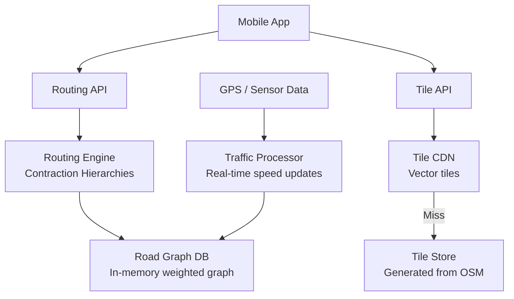

# Design Google Maps — Navigation at Scale

**Difficulty**: 🔴 Advanced
**Reading Time**: Coming Soon
**Interview Frequency**: High

---

> 🚧 **Full article coming soon.** This stub gives you the essentials to start thinking about this problem.

---

## The Core Problem

Computing shortest routes across 100 million road segments with real-time traffic in under 500ms — naive Dijkstra on a full road graph would take minutes. Hierarchical routing algorithms pre-compute "important" roads (highways, arterials) so routing can skip low-level roads, achieving sub-second performance on global-scale graphs.

## Functional Requirements

- Navigate between two locations with turn-by-turn directions
- Account for real-time traffic conditions
- Support walking, driving, cycling, transit modes
- Show map tiles at multiple zoom levels
- Estimated arrival time (ETA) with confidence interval

## Non-Functional Requirements

| Requirement | Target |
|-------------|--------|
| Route computation latency | p99 < 500ms for driving routes |
| Map tile delivery | < 100ms from CDN |
| Traffic freshness | Road speeds updated every 2 minutes |
| Scale | 1B users, 25M route requests/day |

## Back-of-Envelope Estimates

- **Route requests**: 25M/day ÷ 86,400 = ~290 routing computations/sec
- **Road graph size**: 100M road segments × 100 bytes = ~10GB — fits in RAM on a large machine
- **Map tiles**: World map at 21 zoom levels → ~4.3 trillion tiles (99% ocean/empty; store only ~100B tiles)

## Key Design Decisions

1. **Contraction Hierarchies for Fast Routing** — pre-process road graph: add "shortcut" edges for frequent highway paths; during query, expand search from both source and destination simultaneously (bidirectional Dijkstra) only on high-importance nodes; reduces search space from 100M to ~1,000 nodes.
2. **Time-Dependent Edge Weights** — edge weight (travel time) varies by time of day and real-time traffic; incorporate historical speed profiles (Mon 8am on I-405 = 15mph) + live sensor/GPS data; re-weight edges every 2 minutes from anonymized user GPS.
3. **Vector Tiles for Map Rendering** — encode map geometry (roads, buildings) as vector data per tile; client renders at native resolution; tiles smaller than raster images; zoom and pan without re-requesting tiles; cache aggressively at CDN and client.

## High-Level Architecture

## Top Interview Questions for This Problem

| Question | Tests |
|----------|-------|
| Why doesn't Google Maps use plain Dijkstra on the full road graph? | Algorithm scalability, graph size |
| How does Google collect real-time traffic data? | Crowdsourced GPS, privacy implications |
| How would you re-route a user who takes a wrong turn? | Incremental re-routing, cost of replanning |

## Related Concepts

- [Yelp nearby search for point-of-interest lookup on maps](./yelp-nearby)
- [Uber Backend for real-time driver routing on the same map data](../04-reservation-scheduling/uber-backend)

---

*📚 Full deep-dive with multiple approaches, trade-off tables, and pseudocode coming soon.*

## 📚 Resources & References

| Resource | Type | What You'll Learn |
|----------|------|------------------|
| [System Design Interview Vol 2 — Alex Xu](https://www.amazon.com/System-Design-Interview-Insiders-Guide/dp/1736049119) | 📚 Book | Chapter on designing a proximity service and maps system |
| [ByteByteGo — Design Google Maps](https://www.youtube.com/@ByteByteGo) | 📺 YouTube | Search "Google Maps design" — routing algorithms, tile rendering, real-time traffic |
| [Google Maps Engineering: How ETA Works](https://cloud.google.com/blog/products/maps-platform/how-google-maps-eta-works) | 📖 Blog | Machine learning for ETA prediction with real-time traffic signals |
| [Uber Engineering: H3 Geospatial Indexing](https://www.uber.com/blog/h3/) | 📖 Blog | Hexagonal hierarchical geospatial indexing for proximity and area queries |
| [OpenStreetMap Architecture](https://wiki.openstreetmap.org/wiki/Component_overview) | 📚 Docs | Open-source maps architecture — data ingestion, tile rendering, API |
