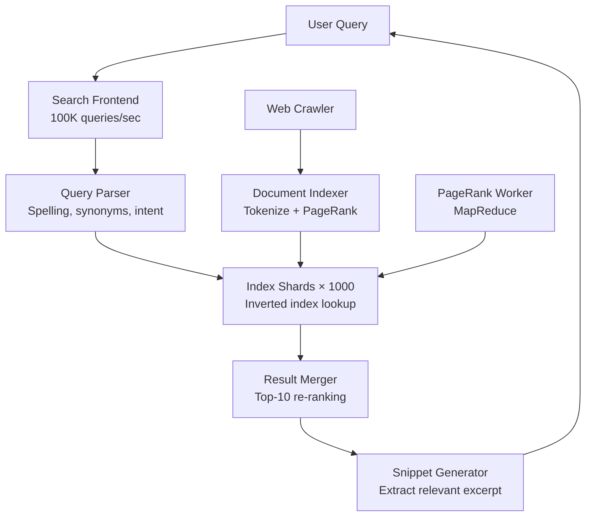
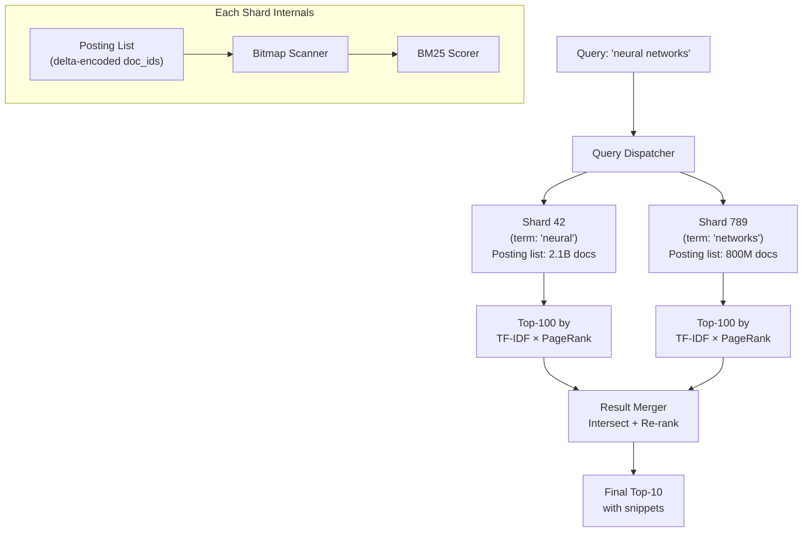
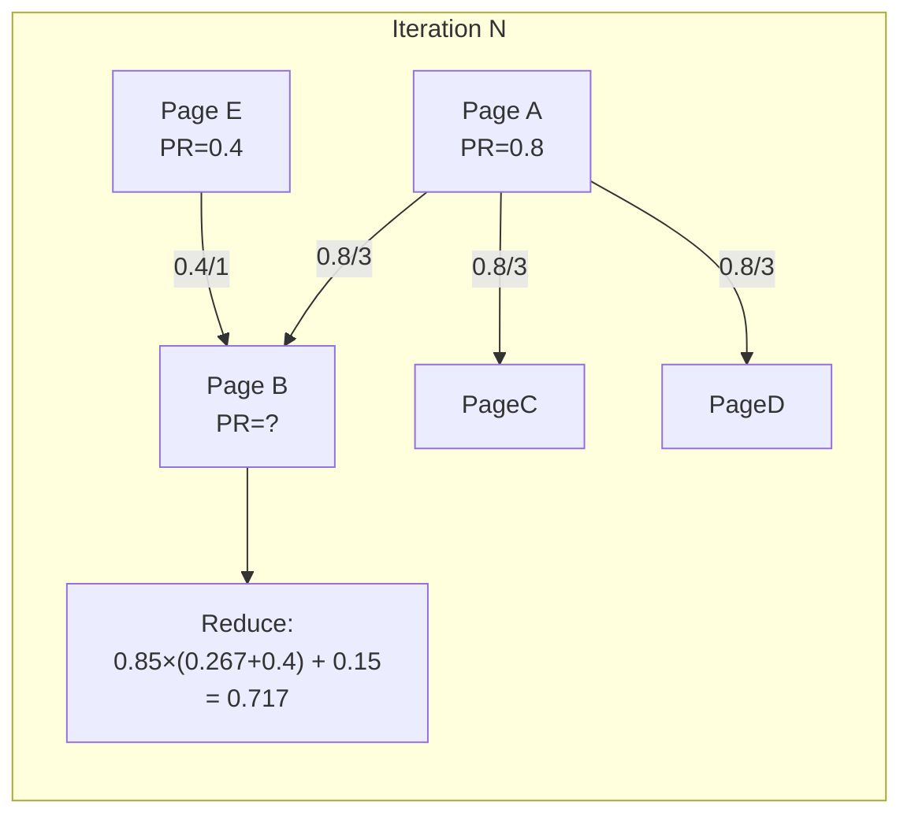
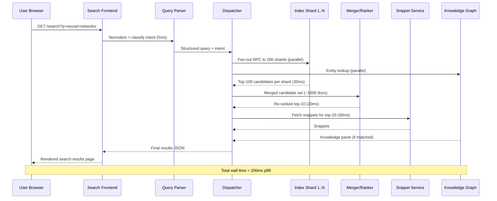
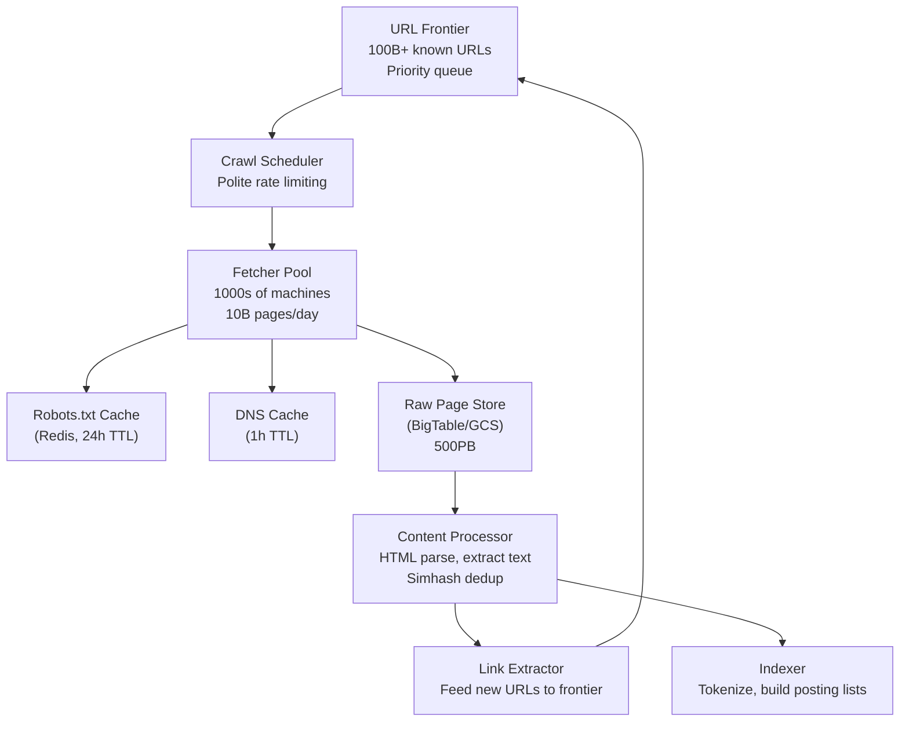

# Design Google Search — Web-Scale Indexing

**Difficulty**: 🔴 Advanced
**Reading Time**: 25 min
**Interview Frequency**: High

---

## The Core Problem

Indexing 50 billion web pages and returning relevant results in under 200 milliseconds requires a search system at a scale no other application approaches. The fundamental insight — from Brin and Page's 1998 paper — is that link structure (PageRank) is a better quality signal than document content alone, enabling Google to rank relevance rather than just keyword frequency.

## Functional Requirements

- Crawl and index the entire public web (50B+ pages)
- Return top-10 most relevant results for any query in < 200ms
- Support advanced queries: exact phrase, site:, filetype:, date range
- Index updates: new pages searchable within hours of discovery
- Image, video, news, and vertical search

## Non-Functional Requirements

| Requirement | Target |
|-------------|--------|
| Query latency | p99 < 200ms including ranking |
| Index freshness | New pages indexed within 24 hours |
| Availability | 99.999% (5 min/year) |
| Scale | 8.5B searches/day, 50B indexed pages |

## Back-of-Envelope Estimates

- **Query rate**: 8.5B queries/day ÷ 86,400 = ~100,000 queries/sec
- **Index size**: 50B pages × 10KB avg compressed = ~500PB raw; inverted index ~50PB (10x compression)
- **PageRank computation**: 50B nodes × 10 links avg = 500B edges; requires 100s of MapReduce rounds

## Key Design Decisions

1. **Inverted Index Partitioned by Term** — split inverted index across 1,000+ shards by term hash; query "cats AND dogs" fans out to both term shards, retrieves posting lists, intersects; each shard returns its top-100 candidates; master re-ranks and returns top-10.
2. **PageRank as Quality Prior** — PageRank (probability of random walker reaching a page) provides a query-independent quality signal; computed via iterative MapReduce over 50B link edges; combined with query-dependent TF-IDF and 200+ other signals in learned ranking model.
3. **Three-Tier Index Architecture** — instant index (last 24 hours, small, fully fresh), caffeine index (last few weeks, medium), main index (all 50B pages, huge, weeks-old); most queries hit all three; fresh content served from instant tier first.

## High-Level Architecture



## Top Interview Questions for This Problem

| Question | Tests |
|----------|-------|
| How does PageRank work and why does it produce better results than TF-IDF alone? | Graph algorithms, quality signals |
| How do you update the index in real-time without taking search offline? | Hot swapping index shards, versioning |
| How would you prevent SEO spam from gaming your ranking algorithm? | Adversarial ML, spam detection |

## Related Concepts

- [Web crawler for the crawling pipeline](../01-data-processing/web-crawler)
- [Twitter search for real-time indexing comparison](./twitter-search)

---

## Component Deep Dive 1: Inverted Index — The Core Data Structure

The inverted index is the most critical architectural component in any search engine. A forward index maps `document_id → [list of terms]`, which is natural to build but useless for search. The inverted index flips this to `term → [list of (document_id, positions, frequency)]` — given a query term, instantly find every document containing it.

**Why naive approaches fail at scale:** A single-machine inverted index for 50B documents containing on average 500 unique terms per page produces a posting list of up to 50B entries per common term (words like "the" appear in almost every document). At 8 bytes per entry (doc_id + frequency), that is 400GB of data for a single term. A single server cannot hold, let alone serve, this at 100,000 queries/sec with p99 < 200ms.

**How Google's index works internally:** The index is split into two dimensions simultaneously:

1. **Term-partitioned (horizontal) sharding**: The term vocabulary is hashed across ~1,000 index shards. All posting lists for terms hashing to shard 42 live on shard 42's servers. A query for "neural networks" fans out to two term shards, each returns its top-100 matching doc_ids ranked by TF-IDF × PageRank, the merger intersects and re-ranks to top-10.

2. **Document-partitioned sharding (replica sets)**: Each shard is replicated 3x for read throughput and fault tolerance. With 100,000 queries/sec and each query hitting ~200 shards on average, the index layer sees 20 million shard-level requests/sec. Replication multiplies read capacity linearly.

**Posting list compression:** Raw posting lists store doc_ids as sorted integers. Delta encoding compresses consecutive sorted integers dramatically — instead of storing [1001, 1005, 1010, 1020], store [1001, 4, 5, 10] (deltas). Variable-length encoding (VByte) compresses small deltas to 1 byte. Result: 5–10x compression ratio over raw integer arrays.



**Implementation trade-offs:**

| Approach | Latency | Throughput | Trade-off |
|----------|---------|------------|-----------|
| Term-partitioned index | Low (parallel term lookup) | Very high (shards scale independently) | All shards must respond; tail latency amplification |
| Document-partitioned index | Higher (each shard scores all terms) | High | Simpler fault isolation; one shard outage limits result quality, not query completion |
| Hybrid (Google's actual approach) | Lowest | Highest | Most complex to operate; requires both term sharding and doc replication |

---

## Component Deep Dive 2: PageRank — Iterative Graph Ranking at 500B Edges

PageRank assigns a probability score to each web page representing the likelihood that a random walker following links at random would land on that page. A page with many high-quality inbound links scores higher than one with few or low-quality links.

**The algorithm in one equation:**

```
PR(A) = (1 - d) + d × Σ [ PR(T_i) / C(T_i) ]
```

Where `d = 0.85` (damping factor), `T_i` are pages linking to A, and `C(T_i)` is the outbound link count of page `T_i`. The `(1 - d)` term models a random user who occasionally types a URL directly rather than following links.

**Why naive computation fails:** With 50B pages and 500B edges, a single-server iterative computation would require loading the full link graph into memory (500B × 8 bytes = 4TB for edge list alone) and running 50–100 iterations until convergence. Each iteration takes O(edges) time. On a single machine this is weeks of compute.

**Google's MapReduce approach:** PageRank is computed as a series of MapReduce jobs, each representing one iteration:
- **Map phase**: For each page P with score PR(P) and C outbound links, emit `(linked_page, PR(P)/C)` for each outbound link.
- **Reduce phase**: For each page, sum all incoming contributions × damping factor + (1-d).
- Repeat 50–100 times until delta < 0.001.

**At 10x load:** 500B edges becomes 5T edges (as the web grows). Google transitions to Pregel — a bulk synchronous parallel (BSP) framework purpose-built for graph algorithms that keeps the graph in distributed memory across machines rather than re-reading from disk each iteration. Pregel reduces PageRank iteration time from hours to minutes for trillion-edge graphs.

**Freshness vs. accuracy trade-off:** Full PageRank recomputation takes days. For newly discovered pages, Google assigns a preliminary PageRank score based on the quality of the referring page (the page that linked to it). Full rank propagation happens in the background.



---

## Component Deep Dive 3: Three-Tier Index and Index Freshness

Google's index is not a monolith. Three tiers serve different freshness/scale trade-offs:

**Tier 1 — Instant Index (Caffeine real-time layer):** Pages discovered and crawled in the last 0–24 hours. Small enough to fit in a fast, hot index (~100M pages). New URLs submitted via Search Console or discovered by real-time crawlers land here within minutes. This tier answers queries about breaking news, live events, newly published blog posts.

**Tier 2 — Recent Index:** Pages from the last few weeks, hundreds of billions of documents. Updated incrementally as new crawl data arrives. Served from a warm cluster that can absorb delta updates without full rebuild.

**Tier 3 — Main Index:** All 50B+ indexed pages, weeks or months old. Rebuilt periodically via full batch pipeline (Caffeine pipeline, formerly known as the Big Table crawl pipeline). This tier has the highest recall for rare queries.

**Query fan-out across tiers:** A user query hits all three tiers in parallel. Results are merged and de-duplicated by URL. Tier 1 results are promoted if their freshness signal is relevant (e.g., query contains "today", "latest", a news topic). This fan-out adds roughly 10ms to query latency but ensures freshness for trending topics.

**Hot swap without downtime:** Each shard version is assigned a monotonically increasing version ID. New index shards are built offline, tested on shadow traffic (replayed production queries), and activated atomically — the query router updates its shard map from version N to N+1 with a single config push. Rollback is instantaneous by reverting the config.

---

## Data Model

### Inverted Index Posting List Schema (per shard, stored in columnar format)

```sql
-- Term dictionary (one row per unique term)
CREATE TABLE term_dictionary (
    term_id       BIGINT PRIMARY KEY,          -- hash of normalized term
    term_text     VARCHAR(128),               -- original term string
    doc_frequency BIGINT,                     -- number of documents containing term
    idf_score     FLOAT,                      -- precomputed IDF = log(N / doc_freq)
    shard_id      SMALLINT                    -- which index shard owns this term
);

-- Posting list (one row per (term, document) pair)
-- In practice stored as packed binary arrays, not row-oriented SQL
CREATE TABLE posting_list (
    term_id       BIGINT,
    doc_id        BIGINT,                     -- 48-bit doc fingerprint (Simhash)
    tf_score      FLOAT,                      -- term frequency in this doc
    pagerank      FLOAT,                      -- precomputed PageRank score
    position_list BYTES,                      -- delta-encoded list of term positions
    doc_length    SMALLINT,                   -- total tokens in document (for BM25)
    index_tier    TINYINT,                    -- 1=instant, 2=recent, 3=main
    PRIMARY KEY (term_id, doc_id)
);

-- Document store (metadata, separate from posting list)
CREATE TABLE document_metadata (
    doc_id        BIGINT PRIMARY KEY,
    url           VARCHAR(2048),
    url_fingerprint BIGINT,                   -- Simhash for near-duplicate detection
    title         VARCHAR(512),
    language      CHAR(5),                    -- BCP-47 language code
    crawl_time    TIMESTAMP,
    pagerank      FLOAT,
    page_quality  FLOAT,                      -- quality score 0-1 (spam, ads, etc.)
    snippet_cache BYTES,                      -- precomputed snippet fragments
    safe_search   TINYINT                     -- adult content flag
);

-- Link graph (used for PageRank computation)
CREATE TABLE link_graph (
    source_doc_id BIGINT,
    target_doc_id BIGINT,
    anchor_text   VARCHAR(256),              -- anchor text (strong ranking signal)
    PRIMARY KEY (source_doc_id, target_doc_id),
    INDEX idx_target (target_doc_id)         -- needed for inbound link lookup
);
```

### Query Log Schema (for learning-to-rank training data)

```sql
CREATE TABLE query_log (
    query_id      BIGINT PRIMARY KEY,
    query_text    VARCHAR(1024),
    normalized    VARCHAR(1024),             -- lowercased, spell-corrected
    user_location CHAR(8),                   -- lat/lng geohash
    timestamp     TIMESTAMP,
    results_shown JSON,                      -- [{ doc_id, rank, score }]
    clicks        JSON                       -- [{ doc_id, dwell_time_ms }]
);
```

---

## Scale Bottlenecks

| Traffic Level | Component That Breaks | Symptoms | Mitigation |
|---------------|----------------------|----------|------------|
| 10x baseline (1M queries/sec) | Index shard fan-out | Tail latency spikes as straggler shards delay merged response; p99 jumps from 200ms to 800ms | Hedged requests: send to replica B if shard A does not respond in 50ms; use speculative execution |
| 10x baseline | Query parser / spell-check | Synonym expansion and spell correction are CPU-heavy; parser becomes bottleneck at 1M q/s | Pre-cache top-1M query normalizations in Redis; async spell-check for long-tail queries |
| 100x baseline (10M queries/sec) | Network fan-out bandwidth | Each query fans out to 1,000 shards; at 10M q/s that is 10B shard-level RPCs/sec, saturating datacenter fabric | Reduce shard count per query via query-type routing (navigational queries skip most shards); move to two-phase retrieval |
| 100x baseline | Snippet generation | Snippet generation requires fetching stored page content for top-10 results; 10M q/s × 10 fetches = 100M storage reads/sec | Precompute and cache snippet fragments keyed by (doc_id, common_query_terms) |
| 1000x baseline (100M queries/sec) | Global load balancer | Single-region LB becomes bottleneck; 100M q/s exceeds single datacenter capacity | Geo-distributed query routing; each continent serves its own index replica; DNS-based traffic steering |
| 1000x baseline | PageRank freshness | At 10× web size (500B pages), full PageRank recomputation takes 10+ days | Incremental PageRank update using only changed portions of link graph; Pregel/Giraph for in-memory graph computation |

---

## How Bing Built This

Microsoft Bing is the second-largest web search engine globally, indexing approximately 10–15 billion pages and serving roughly 1 billion queries per day (about 12,000 queries/sec). Bing's architecture is the most publicly documented near-Google-scale search system.

**Technology choices:**
- Bing uses a distributed inverted index called **BING Index** split across thousands of commodity servers running Windows Server, not Linux — a deliberate choice to leverage Azure's Windows-optimized networking stack.
- Documents are stored in **Cosmos** (Microsoft's internal distributed storage system, predecessor to Azure Data Lake), with each document chunked into 64MB blocks.
- Ranking uses **LambdaMART**, a gradient-boosted tree model trained on click-through data, with 1,000+ ranking features including query-document term overlap, PageRank equivalent (WebGraph score), and user engagement signals.

**Specific numbers:**
- Bing's web graph contains approximately 1 trillion known URLs, of which 10–15B are indexed.
- The crawl infrastructure processes 10 billion pages/day at peak — most are recrawls to check for updates.
- p99 query latency target is 300ms end-to-end (slightly more relaxed than Google's 200ms target).
- Bing's ranker runs 1,000+ features per candidate document; the candidate set per query is 200–500 documents after initial retrieval.

**Non-obvious architectural decision:** Bing separates "retrieval" from "ranking" into different machine classes with different hardware profiles. Retrieval servers are I/O optimized (many SSDs, moderate CPU) to scan posting lists fast. Ranking servers are CPU-optimized (high-core-count Intel Xeon with AVX-512 for SIMD scoring) to run LambdaMART inference at 10,000 q/s per machine. This hardware specialization reduces cost by ~40% compared to running both workloads on homogeneous hardware.

**Reference**: Microsoft Research paper "Bing: The Retrieval System Behind Microsoft's Search Engine" (SIGIR 2013); Bing engineering blog posts on Azure AI Search architecture (2023).

---

## Interview Angle

**What the interviewer is testing:** Whether you understand the gap between "search works by looking up keywords" and the actual architectural complexity of serving 100,000 queries/sec with sub-200ms latency across 50B documents — specifically the fan-out problem, tail latency management, and the dual requirements of freshness and scale.

**Common mistakes candidates make:**

1. **Designing a single-machine index**: Saying "store the inverted index in Elasticsearch" without addressing that a single Elasticsearch cluster tops out at ~billions of documents before query latency degrades. At Google scale you need 1,000+ shards and a custom two-tier retrieval system — Elasticsearch's fan-out coordination overhead alone would exceed 200ms.

2. **Ignoring tail latency in fan-out**: A query fans out to 1,000 shards. If each shard has p99 latency of 10ms, the probability that at least one shard takes >10ms is `1 - (0.99)^1000 ≈ 0.9999` — i.e., virtually guaranteed. Candidates who do not mention hedged requests, timeout budgets, or speculative execution miss the most important operational challenge.

3. **Treating PageRank as a static offline score**: Interviewers expect you to address freshness — how does a newly discovered page (with no inbound links yet) get a starting rank? How do spam link farms game the system? Not addressing the adversarial nature of web search or the incremental update problem signals shallow understanding.

**The insight that separates good from great answers:** Great candidates distinguish between two shard partitioning strategies — term-partitioned vs. document-partitioned — explain the tail-latency trade-off of each, and then describe Google's actual hybrid: term-partitioned index replicated in document-partitioned groups, where any single shard failure reduces result quality (you miss some documents) rather than blocking query completion entirely. This graceful degradation insight is what production search engineers actually debate.

---

## Key Numbers to Remember

| Metric | Value | Context |
|--------|-------|---------|
| Query rate | 100,000 queries/sec | Google global average; peaks at ~150K q/s |
| Index size | 50B pages | ~500PB raw content; ~50PB in inverted index |
| Query latency SLA | p99 < 200ms | End-to-end including snippet generation |
| Index shard count | ~1,000+ shards | Each shard holds posting lists for a subset of the vocabulary |
| Posting list fan-out | ~200 shards per query | Average query touches 200 term shards out of 1,000 |
| PageRank convergence | 50–100 iterations | Over 500B link edges; each iteration is a MapReduce job |
| Index freshness | < 24 hours for new pages | Via instant index tier; main index rebuilt over weeks |
| Snippet cache hit rate | ~80% | Top queries are cached; long-tail requires live extraction |
| Crawl rate | 10B pages/day | Mostly recrawls; net new pages ~100–200M/day |
| Ranking features | 200+ signals | TF-IDF, PageRank, click-through rate, freshness, language, location |

---

## Query Processing Pipeline — End to End

Understanding the full lifecycle of a single query from keypress to rendered results is essential for interviews. The pipeline has seven stages, each with its own latency budget:

### Stage 1: Query Normalization (< 5ms)

Raw user input is lowercased, unicode-normalized, and tokenized. Spell correction runs against a dictionary built from billions of past queries — if "pythn tutorial" has been corrected to "python tutorial" 50 million times, that mapping is cached. Synonym expansion runs in parallel: "car" expands to include "automobile", "vehicle" in certain contexts. Stop words ("the", "a", "of") are removed for most queries but kept for exact-phrase searches.

### Stage 2: Intent Classification (< 10ms)

A lightweight ML classifier assigns an intent category to the query:
- **Navigational**: user wants a specific website ("gmail login" → direct to gmail.com)
- **Informational**: user wants to learn ("how does RNA work")
- **Transactional**: user wants to do something ("buy iphone 15")
- **Local**: user wants a nearby place ("coffee shop near me")

Intent category determines which vertical indexes to query (web, maps, shopping, images) and how to weight freshness vs. authority in ranking.

### Stage 3: Index Fan-out (< 30ms budget)

The query dispatcher sends parallel RPCs to all relevant term shards. Each shard independently:
1. Looks up the term's posting list from its in-memory index (SSD-backed, hot data in DRAM)
2. Scores each candidate document using BM25: `BM25(t,d) = IDF(t) × TF(t,d) × (k+1) / (TF(t,d) + k × (1 - b + b × dl/avgdl))`
3. Multiplies BM25 by the precomputed PageRank score stored alongside each posting entry
4. Returns its local top-100 candidates to the merger

The dispatcher uses a 50ms hard timeout. Shards that do not respond are skipped — the merger proceeds with partial results rather than blocking on stragglers.

### Stage 4: Result Merging and Re-ranking (< 20ms)

The merger receives top-100 lists from each responding shard, deduplicates by URL fingerprint (Simhash), and runs a learned re-ranking model (historically LambdaRank, now a deep neural network) over the merged candidate set of up to 1,000 documents. The re-ranker applies signals unavailable at shard level: cross-document diversity, user personalization features, query-specific freshness boost, SafeSearch filtering.

### Stage 5: Snippet Generation (< 30ms)

For each of the top-10 results, the snippet service fetches the stored document representation from a distributed document store (BigTable in Google's architecture) and extracts the most relevant 2–3 sentence excerpt. Relevance is determined by proximity of query terms in the document text and sentence quality heuristics. Snippets for top-10,000 most common queries are precomputed and cached; cache hit rate is ~80%.

### Stage 6: Knowledge Graph Lookup (< 20ms, parallel)

If the query matches an entity in Google's Knowledge Graph (a graph of 500B+ facts about people, places, organizations, and concepts), a structured "knowledge panel" is assembled in parallel with the main results. This runs concurrently with stages 3–5 and merges into the final response.

### Stage 7: Response Assembly (< 5ms)

Results, snippets, knowledge panel, ads (from a separate auction system), and "People Also Ask" suggestions are assembled into the final JSON/HTML response and streamed to the frontend.



---

## Ranking Model: From TF-IDF to Neural Ranking

Google's ranking has evolved through three generations. Understanding this evolution shows interviewers you know how production ML systems mature.

**Generation 1 — TF-IDF + PageRank (1998–2010):**

`Score(q, d) = PageRank(d) × Σ_terms [ TF(t,d) × IDF(t) ]`

Simple, fast, interpretable. Weakness: susceptible to keyword stuffing (repeat a term 100 times to inflate TF) and link spam (buy 10,000 inbound links to boost PageRank).

**Generation 2 — Pairwise Learning-to-Rank (2010–2018):**

RankNet and LambdaMART train on (query, doc_A, doc_B, label: which doc is more relevant) pairs derived from click-through logs. With billions of training examples, the model learns 200+ features:
- Query-document overlap features (BM25, phrase match, anchor text match)
- Document quality features (PageRank, domain authority, page load speed)
- User engagement features (historical click rate, dwell time for this URL on this query)
- Freshness features (age of page, crawl freshness relative to query intent)

**Generation 3 — Neural/BERT Ranking (2019–present):**

BERT-based models (Google calls theirs MUM — Multitask Unified Model) understand semantic similarity, not just lexical overlap. "Best programming language for data science" matches Python articles even if those articles never say "best" or "data science" explicitly. The cost: BERT inference takes ~100ms on CPU; Google runs it on custom TPUs at 10ms per query, applied only to re-ranking the top-100 candidates (not the full 50B index).

| Generation | Latency | Quality | Manipulation resistance |
|------------|---------|---------|------------------------|
| TF-IDF + PageRank | < 5ms | Good for exact queries | Low (keyword stuffing works) |
| LambdaMART (200+ features) | 20ms | Very good | Medium (gaming is harder) |
| BERT/MUM neural re-ranker | 10ms on TPU | Excellent (semantic) | High (semantic understanding) |

---

## Spam Detection and Adversarial Robustness

Search ranking is an adversarial problem. The SEO industry spends billions of dollars annually trying to game Google's algorithm. Every ranking signal becomes a target.

**Link spam:** Historically, buying inbound links boosted PageRank. Google's Penguin algorithm (2012) detects unnatural link patterns — links from unrelated domains, links created in bulk, reciprocal link rings. Detection uses graph anomaly scoring: legitimate pages acquire links slowly over time from topically relevant domains; spam pages acquire 10,000 links overnight from hosting farms.

**Content spam (keyword stuffing):** Detected by content quality classifiers trained to identify thin, low-quality, or auto-generated content. Features include: text-to-HTML ratio, sentence repetition rate, presence of author identity, outbound link quality.

**Cloaking:** Serving different content to Googlebot vs. users is a manual penalty. Google detects this by crawling URLs with both Googlebot user-agent and generic user-agents and comparing rendered content.

**Click fraud:** Artificially inflating click-through rate for a URL signals that it should rank higher. Counter-measures: clicks from the same IP cluster within a short time window are discounted; clicks without subsequent return-to-search (indicating the result was useful) are weighted higher than immediate bounces.

**The fundamental defense:** Ranking signal diversification. Any single signal can be gamed. The more signals the ranker uses (200+) and the more signals require genuine user trust (dwell time, return visits, social shares), the harder it is to game the entire signal set simultaneously. This is why neural ranking trained on behavioral signals is inherently more spam-resistant than rule-based TF-IDF.

---

## Crawling Infrastructure

The crawl pipeline feeds the entire search system. Without fresh, broad crawl coverage, index quality degrades within days.

**Crawl frontier management:** The frontier is the queue of URLs to crawl next. At Google scale, the frontier contains 100+ billion known URLs. Priority assignment determines which URLs are recrawled and how often:
- High-priority: major news sites, Wikipedia, frequently-updated domains (recrawled every few hours)
- Medium-priority: established sites with weekly updates (recrawled every few days)
- Low-priority: static pages with no inbound links (recrawled monthly or less)

**Robots.txt compliance:** Every crawl request checks the target domain's `robots.txt` file (cached for 24 hours) to respect crawl disallow rules. Googlebot also respects `Crawl-delay` directives to avoid overloading small servers.

**Duplicate detection:** The web contains enormous amounts of duplicate and near-duplicate content (mirrors, syndicated articles, pagination). Simhash fingerprinting computes a 64-bit fingerprint of each document's token shingles. Documents with Hamming distance < 3 are considered near-duplicates; only the canonical URL is indexed.

**Distributed crawl architecture:**
- Thousands of crawler machines, each managing thousands of parallel HTTP connections
- DNS resolution cached aggressively (1-hour TTL) to avoid DNS lookup overhead on every request
- Polite crawling: at most 1 request per second per domain to avoid overwhelming servers
- Each datacenter's crawlers handle a geographic slice of the domain namespace



---

## Personalization and Localization

Raw relevance ranking produces the same results for every user. Personalization layers adjust results based on user context without compromising privacy (post-2019 Google has reduced personalization significantly due to filter bubble concerns and regulatory pressure).

**Location-based ranking:** Queries with local intent ("restaurants", "weather", "pharmacy") are ranked using the user's approximate location (derived from IP geolocation or GPS if consented). A search for "coffee shop" in San Francisco returns SF results, not generic web pages about coffee.

**Language and region:** The index is partitioned by language. Queries in French hit French-language index shards first. `Accept-Language` header and the domain TLD (`google.fr` vs. `google.com`) influence language selection.

**Search history personalization (when opted in):** If a user has previously searched for "Python Django tutorial" and then searches for "documentation", the system infers they likely mean Django documentation, not general documentation. This is implemented via a short-term session context vector derived from the last 5–10 queries.

**Safe Search:** A document-level adult content classifier (trained on 100M+ labeled examples) assigns each page a safe-search score. Users with Safe Search enabled see only pages scoring below the threshold; moderate filtering applies to image search specifically.

---

## Infrastructure and Hardware Choices

Search infrastructure decisions are inseparable from the algorithms — the right data structure on the wrong hardware is still slow.

**DRAM vs. SSD for posting lists:** The most-accessed posting lists (high-frequency terms like "python", "tutorial", "review") fit in DRAM on the shard machines — Google reportedly keeps the hot 20% of the index in memory, which handles 80% of query volume (Pareto principle applied to search). The cold 80% of the index (rare terms, long-tail queries) lives on NVMe SSDs with ~100μs random read latency. A query for "aqueduct maintenance Tucson Arizona 2024" hits cold storage; a query for "python tutorial" hits DRAM.

**Custom hardware — TPUs for neural ranking:** BERT-based re-ranking requires matrix multiplications on 768-dimensional embedding vectors. Running this on commodity CPUs at 10,000 q/s would require 50,000 CPU cores just for the ranking stage. Google's TPU v4 runs transformer inference at ~10x the throughput-per-dollar of GPU, and ~100x the throughput-per-dollar of CPU for this workload. TPUs are only used for the re-ranking stage (top-100 → top-10); the initial retrieval stage still runs on CPU-based shard machines.

**Datacenter topology for latency:** Google operates 35+ datacenters globally. Each datacenter maintains a full replica of the index (50PB per datacenter). User queries are routed to the nearest datacenter via Anycast DNS, keeping network RTT below 20ms for 90% of global users. Index replication from primary to all replicas takes 1–6 hours for main index updates; instant-tier updates replicate within seconds via streaming pipeline (Google Cloud Pub/Sub internally).

**Compression ratios in practice:**

| Data type | Raw size | Compressed size | Technique |
|-----------|----------|-----------------|-----------|
| Posting list doc_ids | 8 bytes/entry | 1–2 bytes/entry | Delta encoding + VByte |
| Position lists | 4 bytes/position | 0.5–1 byte/position | Delta encoding |
| Document text | 10KB/page | 2–3KB/page | Zstd compression |
| Snippet cache | 500 bytes/snippet | 200 bytes/snippet | LZ4 (fast decompress) |
| Full index | 500PB | 50PB | Combined techniques |

---

## Failure Modes and Operational Runbooks

### Scenario 1: Index Shard Outage

**Symptom**: 1–5% of queries return fewer than 10 results; affected queries cluster around specific term prefixes.

**Root cause**: One of the 1,000 index shards is down. All queries containing terms assigned to that shard return incomplete results.

**Mitigation**:
1. Traffic is automatically shifted to replica shards (each shard has 3 replicas in different racks/zones)
2. Alerting fires when a shard reports zero successful responses for 30 seconds
3. If all three replicas of a shard are down (extremely rare), results for affected queries are served from a slightly stale snapshot kept on the query frontend for exactly this scenario
4. Paging the on-call engineer happens only if auto-recovery fails after 5 minutes

**Graceful degradation**: Returning 8 good results is better than timing out. The system never waits indefinitely for a failed shard — it uses the partial results it has at the 50ms deadline.

### Scenario 2: Ranking Model Regression

**Symptom**: NDCG (Normalized Discounted Cumulative Gain) drops 2% on A/B test metrics; user satisfaction scores decline; "pogo-sticking" rate (users clicking result, immediately returning, clicking another) increases.

**Root cause**: A bad ranking model update was pushed to production. Neural ranking models are retrained daily on new click data — a bad training batch (e.g., data poisoned by coordinated click fraud) can degrade model quality.

**Mitigation**:
1. All ranking model updates go through shadow scoring — new model runs in parallel with production model on 1% of traffic for 24 hours before full rollout
2. A/B testing infrastructure measures 50+ quality metrics; automated rollback triggers if NDCG drops > 1% on the holdout set
3. The previous model checkpoint is always retained and can be restored with a single config push

### Scenario 3: Crawler Storm

**Symptom**: Target domains report excessive traffic from Googlebot; domain operators file abuse complaints; crawl budget exhaustion alerts fire.

**Root cause**: A bug in the crawl scheduler causes certain high-link-density domains to be re-added to the frontier at excessive rates, creating a positive feedback loop.

**Mitigation**:
1. Per-domain rate limiting: maximum 1 request/second/domain, configurable per domain size
2. Crawl budget caps: each domain gets a daily crawl budget (number of pages) based on domain authority; budget is tracked in a distributed counter
3. Robots.txt `Crawl-delay` is respected; domains can also request reduced crawl via Search Console
4. Circuit breaker: if Googlebot generates 5xx responses from a domain at > 50% rate, crawling for that domain pauses for 1 hour

---

## Comparing Search Engine Architectures

| Dimension | Google Search | Elasticsearch | Solr | Typesense |
|-----------|--------------|---------------|------|-----------|
| Index scale | 50B+ pages | ~1B docs practical max | ~500M docs | ~100M docs |
| Latency at scale | p99 < 200ms | p99 50–500ms | p99 100–500ms | p99 < 50ms (small) |
| Ranking sophistication | 200+ signals + BERT | BM25 + custom scripts | BM25 + custom | BM25 + typo-tolerance |
| Freshness | Minutes (instant tier) | Near real-time (1s) | Near real-time | Near real-time |
| Horizontal sharding | Term + document hybrid | Document-partitioned | Document-partitioned | Document-partitioned |
| Deployment | Custom, Google DCs | Self-hosted or Elastic Cloud | Self-hosted or SolrCloud | Self-hosted or Typesense Cloud |
| Use case | Web search | Enterprise search, log analytics | Enterprise search | App search, autocomplete |

**When NOT to design a Google-scale search system in an interview:** If the problem is an e-commerce product search with 10M SKUs, you should propose Elasticsearch or OpenSearch — not custom sharding across 1,000 term-partitioned shards. Google-scale architecture is appropriate only when the document count exceeds 1B and query rate exceeds 10,000 q/s. Always right-size your design to the actual requirements.

---

## Step-by-Step Interview Framework

Use this structure to pace a 45-minute Google Search design session:

**Minutes 0–5: Clarify scope**
- "Are we designing the full pipeline — crawl, index, and query — or just the query serving layer?"
- "What's the document corpus size? 50B is full web, 1M is an internal enterprise search."
- "What's the target latency — 200ms like Google, or 500ms like an internal tool?"
- "Is real-time freshness required, or is daily batch acceptable?"

Establish: you are designing the query serving path for a web-scale corpus with real-time freshness requirements.

**Minutes 5–15: High-level design**
Draw the four major subsystems on the whiteboard:
1. Crawl pipeline (Crawler → Parser → Document Store)
2. Index build pipeline (Tokenizer → Inverted Index → PageRank worker)
3. Query serving (Frontend → Dispatcher → Index Shards → Merger → Snippet service)
4. Ranking (BM25 initial score → LambdaMART/BERT re-ranker)

State your three-tier index strategy (instant / recent / main) immediately — this signals you know the freshness vs. scale trade-off.

**Minutes 15–30: Deep dive on inverted index**
Walk through: term-partitioned sharding, posting list compression (delta + VByte), fan-out mechanics, and the tail latency problem. Present the hedged requests solution explicitly. Show the trade-off table between term-partitioned and document-partitioned approaches.

**Minutes 30–40: PageRank and ranking**
Explain the PageRank formula, why MapReduce is required, convergence in 50–100 iterations, and the freshness bootstrapping problem for new pages. Briefly cover the evolution from TF-IDF to LambdaMART to BERT, mentioning TPU hardware for neural inference.

**Minutes 40–45: Scale and failure modes**
Address: what breaks at 10x load (tail latency in fan-out), at 100x (network bandwidth), and the graceful degradation principle (partial results on shard failure are better than a timeout).

Close with the non-obvious insight: **the partition strategy determines your failure mode**. Term-partitioned means shard failures degrade result completeness gracefully. Document-partitioned means shard failures block entire query classes. Google's hybrid gives both linear scalability and graceful degradation — but at the cost of operational complexity.

---

*Full article — last updated 2026-06-01.*

## 📚 Resources & References

| Resource | Type | What You'll Learn |
|----------|------|------------------|
| [System Design Interview Vol 2 — Alex Xu](https://www.amazon.com/System-Design-Interview-Insiders-Guide/dp/1736049119) | 📚 Book | Chapter on designing a search engine |
| [ByteByteGo — How Google Search Works](https://www.youtube.com/@ByteByteGo) | 📺 YouTube | Search "Google search design" — crawling, indexing, ranking pipeline |
| [Google: The Anatomy of a Large-Scale Web Search Engine](https://research.google/pubs/pub334/) | 📖 Blog | Original Google architecture paper by Brin & Page |
| [Google BigTable: Storing the Web](https://research.google/pubs/pub27898/) | 📖 Blog | How BigTable stores and indexes crawled web content |
| [Elasticsearch Architecture](https://www.elastic.co/guide/en/elasticsearch/reference/current/scalability.html) | 📚 Docs | Inverted index, sharding, and relevance scoring at scale |
