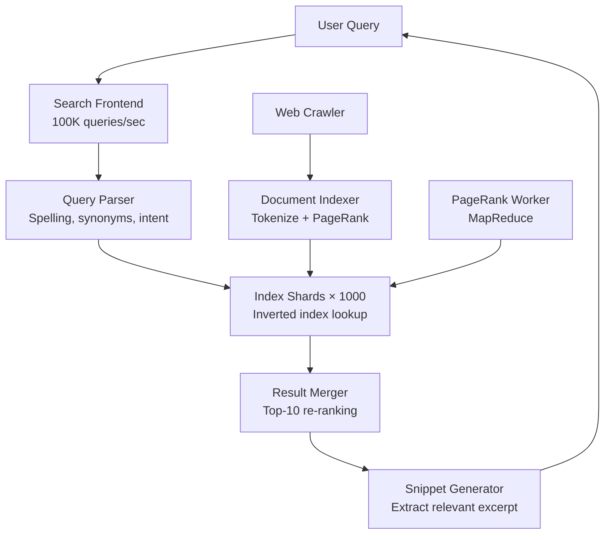

# Design Google Search — Web-Scale Indexing

**Difficulty**: 🔴 Advanced
**Reading Time**: Coming Soon
**Interview Frequency**: High

---

> 🚧 **Full article coming soon.** This stub gives you the essentials to start thinking about this problem.

---

## The Core Problem

Indexing 50 billion web pages and returning relevant results in under 200 milliseconds requires a search system at a scale no other application approaches. The fundamental insight — from Brin and Page's 1998 paper — is that link structure (PageRank) is a better quality signal than document content alone, enabling Google to rank relevance rather than just keyword frequency.

## Functional Requirements

- Crawl and index the entire public web (50B+ pages)
- Return top-10 most relevant results for any query in < 200ms
- Support advanced queries: exact phrase, site:, filetype:, date range
- Index updates: new pages searchable within hours of discovery
- Image, video, news, and vertical search

## Non-Functional Requirements

| Requirement | Target |
|-------------|--------|
| Query latency | p99 < 200ms including ranking |
| Index freshness | New pages indexed within 24 hours |
| Availability | 99.999% (5 min/year) |
| Scale | 8.5B searches/day, 50B indexed pages |

## Back-of-Envelope Estimates

- **Query rate**: 8.5B queries/day ÷ 86,400 = ~100,000 queries/sec
- **Index size**: 50B pages × 10KB avg compressed = ~500PB raw; inverted index ~50PB (10x compression)
- **PageRank computation**: 50B nodes × 10 links avg = 500B edges; requires 100s of MapReduce rounds

## Key Design Decisions

1. **Inverted Index Partitioned by Term** — split inverted index across 1,000+ shards by term hash; query "cats AND dogs" fans out to both term shards, retrieves posting lists, intersects; each shard returns its top-100 candidates; master re-ranks and returns top-10.
2. **PageRank as Quality Prior** — PageRank (probability of random walker reaching a page) provides a query-independent quality signal; computed via iterative MapReduce over 50B link edges; combined with query-dependent TF-IDF and 200+ other signals in learned ranking model.
3. **Three-Tier Index Architecture** — instant index (last 24 hours, small, fully fresh), caffeine index (last few weeks, medium), main index (all 50B pages, huge, weeks-old); most queries hit all three; fresh content served from instant tier first.

## High-Level Architecture

## Top Interview Questions for This Problem

| Question | Tests |
|----------|-------|
| How does PageRank work and why does it produce better results than TF-IDF alone? | Graph algorithms, quality signals |
| How do you update the index in real-time without taking search offline? | Hot swapping index shards, versioning |
| How would you prevent SEO spam from gaming your ranking algorithm? | Adversarial ML, spam detection |

## Related Concepts

- [Web crawler for the crawling pipeline](../01-data-processing/web-crawler)
- [Twitter search for real-time indexing comparison](./twitter-search)

---

*📚 Full deep-dive with multiple approaches, trade-off tables, and pseudocode coming soon.*

## 📚 Resources & References

| Resource | Type | What You'll Learn |
|----------|------|------------------|
| [System Design Interview Vol 2 — Alex Xu](https://www.amazon.com/System-Design-Interview-Insiders-Guide/dp/1736049119) | 📚 Book | Chapter on designing a search engine |
| [ByteByteGo — How Google Search Works](https://www.youtube.com/@ByteByteGo) | 📺 YouTube | Search "Google search design" — crawling, indexing, ranking pipeline |
| [Google: The Anatomy of a Large-Scale Web Search Engine](https://research.google/pubs/pub334/) | 📖 Blog | Original Google architecture paper by Brin & Page |
| [Google BigTable: Storing the Web](https://research.google/pubs/pub27898/) | 📖 Blog | How BigTable stores and indexes crawled web content |
| [Elasticsearch Architecture](https://www.elastic.co/guide/en/elasticsearch/reference/current/scalability.html) | 📚 Docs | Inverted index, sharding, and relevance scoring at scale |
