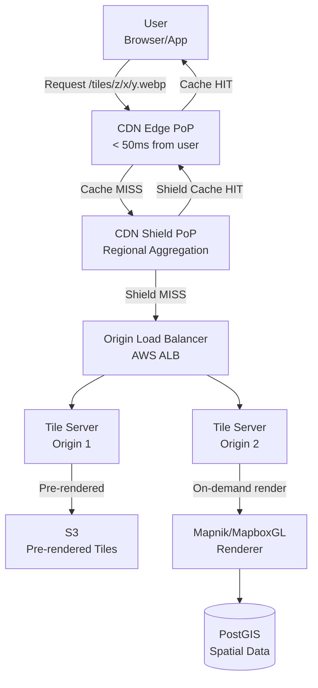
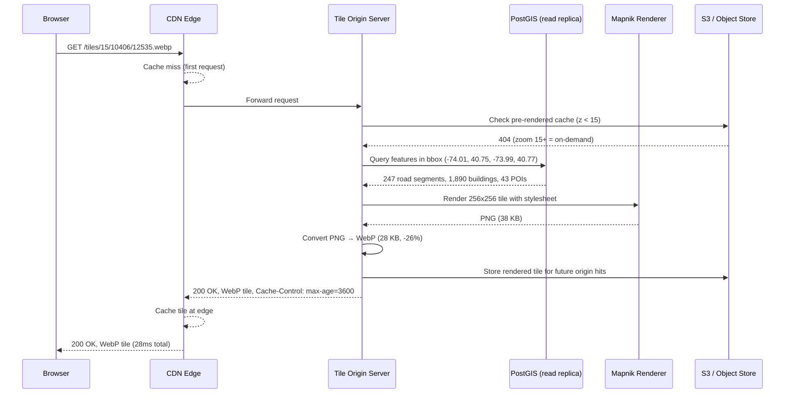

# Design a Geospatial Map Tile Server

**Difficulty**: 🟡 Intermediate
**Reading Time**: ~25 minutes
**The Core Problem**: How do you serve high-resolution map tiles to 100M users at sub-200ms load times globally — with a tile pyramid spanning 22 zoom levels and delta updates when geography changes?

---

## Table of Contents

1. [Requirements](#1-requirements)
2. [Capacity Estimation](#2-capacity-estimation)
3. [High-Level Architecture](#3-high-level-architecture)
4. [Tile Pyramid System](#4-tile-pyramid-system)
5. [Tile Generation Pipeline](#5-tile-generation-pipeline)
6. [CDN Caching Strategy](#6-cdn-caching-strategy)
7. [Delta Updates](#7-delta-updates)
8. [Raster vs Vector Tiles](#8-raster-vs-vector-tiles)
9. [Key Design Decisions](#9-key-design-decisions)
10. [Interview Questions](#10-interview-questions)
11. [Key Takeaways](#11-key-takeaways)
12. [References](#12-references)

---

## 1. Requirements

### Functional
- Serve map tiles for any location on Earth at zoom levels 0–22
- Support raster (PNG/WebP images) and vector tiles
- Tiles updated when underlying map data changes (roads, buildings)
- Global delivery with < 200ms tile load time

### Non-Functional
- **Scale**: 100M daily active users, 10 tile requests per map view = 1B tile requests/day
- **Storage**: Pre-rendered tiles for zoom 0–14 (most of the world)
- **CDN hit rate**: > 99% for zoom levels 0–16 (static; rarely changes)
- **Freshness**: High-zoom tiles (17–22, building level) updated within 24 hours of data change

---

## 2. Capacity Estimation

| Metric | Estimate |
|--------|----------|
| Tile requests/day | 1B |
| Tile requests/sec (peak) | 1B / 86400 × 3× = **34,700 RPS** |
| Tile size (PNG, Z0–Z14) | avg 15 KB |
| CDN bandwidth/day | 1B × 15KB × (1 - 0.99 cache hit) = **150 GB from origin** |
| Total pre-rendered tiles | Sum(4^z) for z=0..14 = 357M tiles × 15KB = **5.3 TB** |
| Zoom 15–22 tiles (on-demand) | 357M × 4^8 = ~92 billion possible, but only ~1% have data = **~900M tiles** |
| OSM data size | ~100 GB (OpenStreetMap planet.osm file) |

---

## 3. High-Level Architecture

```mermaid
graph TD
    UserApp[Map App\nBrowser / Mobile] -->|GET /tiles/{z}/{x}/{y}.webp| CDN[CDN\nCloudFront / Fastly]
    CDN -->|Cache miss| TileServer[Tile Server\nOrigin]
    TileServer -->|Zoom 0-14| PrerenCache[Pre-rendered Cache\nS3]
    TileServer -->|Zoom 15-22| Renderer[On-Demand Renderer\nMapnik / Mapbox GL]
    Renderer --> VectorData[(Vector Data Store\nPostGIS)]
    DataPipeline[Data Pipeline\nOSM + updates] --> VectorData
    DataPipeline --> TileGen[Tile Generator\nBatch re-render]
    TileGen --> PrerenCache
    CDN --> UserApp
```

---

## 4. Tile Pyramid System

### Tile Coordinate System (XYZ / TMS)
```
Each tile identified by: {zoom_level}/{x}/{y}
  z=0: 1 tile covers entire Earth (256×256 px)
  z=1: 4 tiles (2×2 grid)
  z=2: 16 tiles (4×4 grid)
  ...
  z=N: 4^N tiles

Total tiles per zoom:
  z=0:   1 tile
  z=10:  1M tiles
  z=14:  268M tiles
  z=18:  68B tiles (impossible to pre-render all)

Tile URL: https://tiles.example.com/{z}/{x}/{y}.webp
  z=15, x=10406, y=12535 → area around NYC midtown at street level
```

### Zoom Level Use Cases
| Zoom | Resolution | Use Case |
|------|-----------|---------|
| 0–3 | Continent | World overview |
| 4–7 | Country/State | Regional maps |
| 8–12 | City | City-level navigation |
| 13–16 | Neighborhood | Street-level view |
| 17–22 | Building | Building/address detail |

```
Pre-render strategy:
  z=0–14 (357M tiles): Pre-render ALL, store in S3, cache in CDN
    These tiles change rarely (geography, major roads)
    Cost: 357M × 15KB = 5.3 TB storage

  z=15–22: On-demand render + cache in CDN
    Too many tiles to pre-render (68B at z=18)
    Render only when requested, cache aggressively
```

---

## 5. Tile Generation Pipeline

### Raster Tile Generation (Mapnik)
```
Input: Vector data (PostGIS database with OSM data)
Process:
  1. Load map stylesheet (MapCSS / CartoCSS): defines colors, line widths, labels
  2. Query PostGIS for features in tile bounding box
  3. Render to 256×256 PNG/WebP image

Rendering pipeline:
  Raw OSM data (100 GB) → import-osm → PostGIS (spatial DB)
  PostGIS → Mapnik renderer → PNG tiles → WebP compression → S3

Batch re-render for zoom 0–14:
  Parallelized: 100 renderer workers × 3,570 tiles/worker = 357M tiles
  Time: 357M tiles / (100 workers × 100 tiles/sec) = 9.9 hours
  Triggered: when major map data changes (new road, border change)

Rendering performance:
  z=0–10: fast (few features per tile): 200ms/tile
  z=15–18: slow (many buildings): 2–5s/tile → cache is critical
```

### PostGIS Spatial Queries
```
Tile renderer queries PostGIS for features in bounding box:
  ST_MakeEnvelope(min_lon, min_lat, max_lon, max_lat, 4326)

Spatial indexes critical:
  CREATE INDEX ON roads USING GIST (geom);
  CREATE INDEX ON buildings USING GIST (geom);

Query: "Get all roads in tile z=15, x=10406, y=12535"
  SELECT ST_AsGeoJSON(geom), name, road_type
  FROM roads
  WHERE geom && ST_MakeEnvelope(-74.01, 40.75, -73.99, 40.77, 4326);

Index lookup: O(log N) via GiST → ~5ms for tile
```

---

## 6. CDN Caching Strategy

### Cache Keys
```
Tile URL is a perfect cache key: /tiles/15/10406/12535.webp
  - Deterministic: same tile always returns same image (until map data changes)
  - High reuse: popular areas (NYC, London) requested millions of times/day
  - Cache-Control: public, max-age=86400 (1 day for z0-14)

Cache-Control by zoom:
  z=0–10 (rarely changes): max-age=604800 (1 week)
  z=11–16 (occasional changes): max-age=86400 (1 day)
  z=17–22 (frequent changes): max-age=3600 (1 hour)
```

### CDN Architecture
```
CDN PoP placement:
  Need < 200ms → CDN PoP within 1000km of user
  Major providers: Cloudfront (600+ PoPs), Fastly (80+ PoPs), Akamai (4000+ PoPs)

Cache behavior:
  Popular tiles (z=10–14, major cities): 99%+ hit rate (millions of requests/day)
  Long-tail tiles (rural areas): low hit rate, served from origin

  CDN serves 99% of traffic; origin handles 1% (10M tile renders/day)

Tile purge on update:
  When map data changes → purge affected tiles from CDN
  CDN API: POST /v1/purge { urls: ["/tiles/15/10406/*"] }
  Partial purge by z/x prefix: invalidate entire sub-region
```

---

## 7. Delta Updates

### Map Data Change Workflow
```
OSM data update cadence:
  Minor (road renamed, new POI): hourly diff files available from OSM
  Major (new road, border change): weekly full planet reprocessing

Incremental update pipeline:
  1. Download OSM diff file (osmChange XML): ~50 MB/day for planet
  2. Apply to PostGIS: osm2pgsql --append
  3. Identify affected tiles:
     - Compute bounding box of changed geometries
     - List tile IDs at zoom 14–22 within bounding box
  4. Re-render only affected tiles (not full planet)
  5. Upload new tiles to S3 (overwrites old)
  6. Purge affected tiles from CDN

Efficient tile invalidation:
  Changed geometry → bounding box → affected tile IDs (at each zoom level)
  Z=14: 1 bbox → ~100 tile IDs
  Z=18: 1 bbox → ~25,600 tile IDs

Tool: tirex (tile rendering queue system, used by OpenStreetMap)
```

---

## 8. Raster vs Vector Tiles

| Feature | Raster Tiles (PNG/WebP) | Vector Tiles (MVT) |
|---------|------------------------|-------------------|
| Rendering | Server-side, pre-rendered | Client-side (GPU) |
| Tile size | 15–50 KB | 5–20 KB |
| Styling | Fixed in tile | Dynamic in client |
| Rotation | Pixelated | Crisp at any angle |
| Retina (2×) | Double storage | Same tile, CSS scale |
| Storage | 5.3 TB (z0–14) | 1–2 TB (smaller) |
| Client CPU | Minimal | Higher (WebGL rendering) |

```
Vector tile format: Mapbox Vector Tile (MVT / PBF)
  Protobuf-encoded geometry + attributes
  Client (Mapbox GL JS) renders using WebGL
  Advantage: single tile set works for any style (dark mode, satellite, custom)

Raster still used for:
  Satellite imagery (inherently raster)
  Complex styles too expensive to render on client
  Older devices without WebGL support
```

---

## 9. Key Design Decisions

| Decision | Option A | Option B | Choice & Reason |
|----------|----------|----------|-----------------|
| Tile type | Raster (PNG) | Vector (MVT) | **Vector** for general maps (smaller, stylable, retina-ready); raster for satellite imagery |
| Pre-render scope | All zoom levels | Only z=0–14 | **z=0–14 only** — z=18 has 68B possible tiles, 99% empty; on-demand render + CDN cache for high zoom |
| CDN provider | Single CDN | Multi-CDN | **Multi-CDN** — map tile latency is user-facing; failover to secondary CDN if primary has issues |
| Update strategy | Full re-render | Delta (affected tiles only) | **Delta** — full planet re-render takes 10 hours; delta updates affected tiles in < 30 minutes |
| Image format | PNG | WebP | **WebP** — 25–30% smaller than PNG at same quality; supported by all modern browsers |

---

## 10. Interview Questions

| Question | Key Answer |
|----------|-----------|
| How do you handle a tile that spans multiple data regions? | Tile renderer queries by bounding box; spatial index handles cross-region features natively |
| How do you prevent hot-spot tiles (Times Square at z=18) from overloading origin? | CDN caches after first render; even at 10k requests/sec, only 1 origin request (first miss) |
| How do you serve satellite imagery? | Different pipeline: raw satellite images → geo-referenced → tiled at each zoom level; raster only (no vector) |
| How do you generate retina (2×) tiles? | Vector tiles: single tile, CSS scales up; raster: render at 512×512 for @2x URL suffix |
| What's the storage cost for the full tile pyramid? | z=0–14: 5.3 TB; z=15–18 (cached hot tiles): ~500 GB; total: ~6 TB (manageable on S3) |

---

## 11. Key Takeaways

- **Tile pyramid** (XYZ scheme) is the universal map tile standard — each zoom doubles linear resolution (4× tiles)
- **Pre-render only z=0–14** (357M tiles, 5.3 TB) — rendering all zoom levels is physically impossible; on-demand + CDN cache for high zoom
- **CDN cache hit rate > 99%** is achievable for popular areas — the same Times Square tile is requested millions of times daily
- **WebP over PNG** for raster tiles — 25–30% smaller, cutting CDN egress proportionally at 1B requests/day
- **Delta updates** (re-render only changed tiles) are critical — full planet re-render takes 10 hours; delta keeps map fresh in < 30 minutes

---

---

## Component Deep Dive 1: CDN Tile Cache Architecture

The CDN layer is the single most critical component in a map tile server. Without it, your origin infrastructure would need to handle 34,700 RPS just for average load — an astronomically expensive and latency-sensitive problem. With a properly tuned CDN, your origin sees roughly 350 RPS (the 1% cache miss traffic), and a globally distributed edge network absorbs all user-facing latency.

### How It Works Internally

A CDN PoP (Point of Presence) is essentially a distributed reverse proxy with a large local SSD cache. When a user in London requests `/tiles/14/8187/5453.webp`, Fastly's London PoP checks its local cache. On a hit, the tile is returned from local SSD in 2–5ms RTT. On a miss, the PoP opens a persistent TCP connection to your origin (or a regional cache tier), fetches the tile, caches it locally, and serves it.

Map tiles are uniquely suited for CDN caching because:
1. **URL is the cache key**: `/tiles/{z}/{x}/{y}.webp` is deterministic — same tile at same zoom always returns same bytes (until map data changes).
2. **Extremely high reuse**: NYC Times Square at z=15 might be requested 10 million times per day from a single CDN PoP.
3. **Large but bounded working set**: The "hot" tiles (major cities, zoom 10–16) fit within 50–200 GB of CDN edge storage.

### Why Naive Approaches Fail at Scale

A naive approach of pointing all users to a single origin server with no CDN fails for three reasons:

- **Latency**: A server in us-east-1 adds 150–200ms of network RTT alone for users in Asia, before any compute time.
- **Throughput**: 34,700 RPS of tile requests at 15 KB each = 520 MB/s sustained egress from a single origin. A single server can't handle this; scaling requires dozens of origin replicas with no benefit from geographic caching.
- **Hot tiles thundering**: Without CDN, a viral event (e.g., earthquake news showing a specific location) causes thousands of concurrent requests for the same 5 tiles to hit origin simultaneously — a thundering herd that overwhelms rendering workers.

### CDN Tier Architecture



The two-tier CDN model (Edge → Shield → Origin) is key. The Shield PoP acts as a regional aggregation point. Even if 100 edge PoPs in Europe all have cache misses for the same tile simultaneously (after a CDN purge), only ONE request reaches origin — the shield PoP serializes them. This reduces origin load by 50–100x compared to a flat CDN topology.

### CDN Implementation Trade-offs

| Approach | Latency (cache hit) | Cache Hit Rate | Operational Complexity |
|----------|--------------------|-----------------|-----------------------|
| Single CDN (CloudFront) | 5–15ms | 95–99% | Low — one vendor, one API |
| Multi-CDN (CloudFront + Fastly) | 3–10ms (best PoP wins) | 97–99.5% | High — dual configs, different purge APIs |
| CDN + Regional Origin Cache (Redis) | 8–20ms (shield hit) | 99–99.9% | Medium — shield adds hop but reduces origin load |

For a production map service, Multi-CDN is preferred for reliability: if Fastly has an outage (it happened in June 2021, taking down GitHub, Shopify, and others), CloudFront serves as automatic fallback via DNS failover.

---

## Component Deep Dive 2: PostGIS Spatial Data Store and Tile Rendering

PostGIS is the spatial data backbone that transforms raw OpenStreetMap geography into rendered tile pixels. At high zoom levels (z=15–22), the rendering path is synchronous: user requests a tile → origin queries PostGIS → Mapnik renders the result. Understanding the internals here is critical for both correctness and latency.

### How PostGIS Works for Tile Rendering

PostGIS extends PostgreSQL with geometry types (`POINT`, `LINESTRING`, `POLYGON`, `MULTIPOLYGON`) and spatial functions. The critical operation for tile rendering is a **bounding box intersection query**:

```sql
-- Get all roads visible in tile z=15, x=10406, y=12535
SELECT
    name,
    highway,                      -- road type: motorway, primary, residential
    ST_AsText(geom) AS geometry,
    ST_SimplifyPreserveTopology(geom, 0.0001) AS simplified_geom
FROM roads
WHERE geom && ST_MakeEnvelope(-74.011, 40.748, -73.989, 40.762, 4326)
  AND highway NOT IN ('footway', 'path')  -- filter low-zoom irrelevant features
ORDER BY z_order DESC;                     -- painter's algorithm: draw major roads last
```

The `&&` operator uses the GiST spatial index (an R-tree variant) to find candidates in O(log N) time. For 50M road segments in OSM, this index lookup takes 3–8ms. The subsequent geometry clipping (cutting features to tile boundary) takes another 2–5ms. Total PostGIS query time: 5–15ms per tile.

### Scale Behavior at 10x Load

At 1x load (350 origin RPS), PostGIS handles tile queries comfortably with 16 CPU cores. At 10x (3,500 origin RPS), you hit two limits:

1. **Connection pool exhaustion**: PostgreSQL has a default max of 100 connections. At 3,500 RPS with 15ms query time, you need 3,500 × 0.015 = 52 concurrent connections minimum — but connection overhead and variability push this to 200+. Use **PgBouncer** as a connection pooler in transaction mode.
2. **I/O saturation**: GiST index pages are frequently accessed but too large to fit fully in RAM. At 10x load, you need to move PostGIS to NVMe SSDs (vs. network-attached storage) and increase `shared_buffers` to 25% of RAM (32 GB on a 128 GB instance).

### Tile Rendering Pipeline Sequence



| Approach | Origin Latency | Storage | Freshness |
|----------|---------------|---------|-----------|
| Pre-render all zoom levels | 1–5ms (S3 read) | 100+ TB | Stale until batch re-render (10+ hrs) |
| On-demand + no cache | 200–500ms per request | Minimal | Always fresh |
| On-demand + S3 + CDN cache (current design) | 200ms first request, 5ms cached | 6 TB hot tiles | 1–24 hrs depending on zoom |

---

## Component Deep Dive 3: Delta Update Pipeline

The delta update system is what separates a static map from a live one. OpenStreetMap receives ~4 million edits per day from contributors worldwide. The challenge is propagating those changes to rendered tiles without triggering a full planet re-render (which takes 10+ hours for all zoom levels).

### How Delta Updates Work

OSM publishes incremental change files called **OsmChange** (`.osc.gz`) on a minutely, hourly, and daily basis. Each file contains `<create>`, `<modify>`, and `<delete>` elements for nodes (points), ways (lines/polygons), and relations (complex geometries).

The update pipeline processes these diffs:

1. **Ingest diff**: Download the latest `.osc.gz` file from `planet.openstreetmap.org/replication/hour/`.
2. **Apply to PostGIS**: Run `osm2pgsql --append --slim` which applies the OsmChange diff to the PostGIS tables. For an hourly diff (~50 MB), this takes 2–5 minutes on a 16-core machine.
3. **Compute affected tiles**: For each modified geometry, compute its bounding box, then enumerate the tile IDs at each zoom level that intersect it. A road segment edit in Manhattan might affect 3 tiles at z=14 and 50 tiles at z=18.
4. **Queue re-renders**: Push affected tile IDs to a render queue (Redis list or Kafka topic). Render workers consume from the queue, re-render each tile, upload to S3, and purge from CDN.
5. **CDN purge**: Issue `POST /v1/purge` calls to the CDN API with the affected tile URLs. Most CDN providers support wildcard purges by path prefix.

### Affected Tile Computation

The number of tiles to re-render grows quadratically with zoom level. For a 1 km² changed area:

| Zoom Level | Tiles Affected | Render Time (100 tiles/sec) |
|------------|---------------|----------------------------|
| z=14 | ~16 tiles | 0.16 seconds |
| z=16 | ~256 tiles | 2.56 seconds |
| z=18 | ~4,096 tiles | 41 seconds |
| z=20 | ~65,536 tiles | 10.9 minutes |

This is why most providers cap pre-rendering at z=14 and use CDN expiry (TTL) for z=15–22 rather than active purging. Active purging at z=18+ is too expensive for frequent edits.

---

## Data Model

The core data model for a geospatial tile server has three layers: the raw OSM data in PostGIS, the tile metadata store, and the CDN/S3 object naming convention.

### PostGIS Tables (after osm2pgsql import)

```sql
-- Roads and streets (LineString geometry)
CREATE TABLE planet_osm_line (
    osm_id      BIGINT PRIMARY KEY,          -- OSM way ID (negative = relation)
    name        TEXT,                         -- "Broadway", "5th Avenue"
    highway     TEXT,                         -- motorway | primary | secondary | residential | footway
    ref         TEXT,                         -- route ref: "I-95", "US-1"
    oneway      TEXT,                         -- yes | no | -1 (reverse)
    lanes       INTEGER,
    maxspeed    TEXT,                         -- "50 mph", "80 km/h"
    surface     TEXT,                         -- asphalt | concrete | unpaved
    z_order     INTEGER,                      -- render order (motorways on top)
    way         GEOMETRY(LineString, 900913)  -- Web Mercator (EPSG:900913)
);
CREATE INDEX planet_osm_line_way_idx ON planet_osm_line USING GIST (way);
CREATE INDEX planet_osm_line_highway_idx ON planet_osm_line (highway);

-- Buildings and areas (Polygon geometry)
CREATE TABLE planet_osm_polygon (
    osm_id      BIGINT PRIMARY KEY,
    name        TEXT,
    building    TEXT,                          -- yes | house | apartments | commercial
    amenity     TEXT,                          -- school | hospital | restaurant | park
    landuse     TEXT,                          -- residential | commercial | forest | water
    leisure     TEXT,                          -- park | playground | golf_course
    "natural"   TEXT,                          -- wood | water | beach | cliff
    height      TEXT,                          -- "45m", "150 ft" (for 3D rendering)
    "addr:housenumber" TEXT,                   -- "350"
    "addr:street"      TEXT,                   -- "5th Avenue"
    way         GEOMETRY(Polygon, 900913)
);
CREATE INDEX planet_osm_polygon_way_idx ON planet_osm_polygon USING GIST (way);
CREATE INDEX planet_osm_polygon_building_idx ON planet_osm_polygon (building)
    WHERE building IS NOT NULL;

-- Points of interest (Point geometry)
CREATE TABLE planet_osm_point (
    osm_id      BIGINT PRIMARY KEY,
    name        TEXT,
    amenity     TEXT,                          -- cafe | hospital | atm | bus_stop
    shop        TEXT,                          -- supermarket | clothes | electronics
    tourism     TEXT,                          -- hotel | museum | viewpoint
    "natural"   TEXT,                          -- peak | spring | cave_entrance
    ele         TEXT,                          -- elevation in meters (for peaks)
    way         GEOMETRY(Point, 900913)
);
CREATE INDEX planet_osm_point_way_idx ON planet_osm_point USING GIST (way);

-- Tile metadata (tracks render state and S3 location)
CREATE TABLE tile_metadata (
    z           SMALLINT NOT NULL,             -- zoom level 0–22
    x           INTEGER NOT NULL,              -- tile X coordinate
    y           INTEGER NOT NULL,              -- tile Y coordinate
    format      CHAR(4) NOT NULL DEFAULT 'webp', -- webp | png | mvt
    s3_key      TEXT NOT NULL,                 -- "tiles/15/10406/12535.webp"
    rendered_at TIMESTAMPTZ NOT NULL,          -- last render timestamp
    data_version BIGINT NOT NULL,              -- OSM sequence number at render time
    file_size_bytes INTEGER,
    etag        CHAR(32),                      -- MD5 hash for CDN validation
    PRIMARY KEY (z, x, y, format)
);
CREATE INDEX tile_metadata_rendered_at_idx ON tile_metadata (rendered_at);

-- Render queue (pending/in-progress tile renders)
CREATE TABLE render_queue (
    id          BIGSERIAL PRIMARY KEY,
    z           SMALLINT NOT NULL,
    x           INTEGER NOT NULL,
    y           INTEGER NOT NULL,
    priority    SMALLINT DEFAULT 5,            -- 1=high (user-requested), 10=low (batch)
    enqueued_at TIMESTAMPTZ DEFAULT now(),
    started_at  TIMESTAMPTZ,
    worker_id   TEXT,                          -- which renderer is processing this
    status      TEXT DEFAULT 'pending'         -- pending | processing | done | failed
);
CREATE INDEX render_queue_status_priority_idx ON render_queue (status, priority, enqueued_at)
    WHERE status = 'pending';
```

### S3 Object Key Convention

```
s3://map-tiles-bucket/
  tiles/
    {z}/
      {x}/
        {y}.webp      -- raster WebP tile
        {y}.png       -- raster PNG fallback
        {y}.mvt       -- vector tile (Mapbox Vector Tile)
  metadata/
    tile-index.json   -- bloom filter of pre-rendered tiles (to avoid S3 404s)
  stylesheets/
    v3/
      streets.json    -- MapboxGL stylesheet
      satellite.json
```

---

## Scale Bottlenecks

| Traffic Level | Component That Breaks | Symptoms | Mitigation |
|---------------|----------------------|----------|------------|
| 10x baseline (347k RPS total, 3.5k origin RPS) | PostGIS connection pool | "remaining connection slots reserved" errors; tile render latency spikes from 15ms to 500ms | Add PgBouncer (connection pooler); increase `max_connections` to 500; switch to read replicas for tile queries |
| 10x baseline | CDN origin shield | Shield PoP CPU saturated; cache stampede on popular tiles after purge | Add request coalescing at shield (Varnish `waitinglist`); increase shield instance size; use stale-while-revalidate |
| 100x baseline (3.47M RPS total, 35k origin RPS) | S3 request rate limits | S3 throttling at 5,500 GET/sec per prefix; HTTP 503 SlowDown errors | Shard S3 key prefix by hash: `tiles/ab/15/10406/12535.webp`; or switch to GCS/Azure Blob (higher per-prefix limits) |
| 100x baseline | Mapnik renderer workers | Render queue depth grows unboundedly; high-zoom tiles show stale or blank | Horizontal scale renderer fleet (auto-scale on queue depth); prioritize user-requested tiles over batch pre-renders |
| 1000x baseline (34.7M RPS total) | CDN egress cost | CDN bill exceeds $500k/month at $0.01/GB × 150TB/day | Negotiate custom CDN pricing (bulk deals); implement aggressive browser caching (Service Workers caching tiles client-side); use P2P tile sharing for popular events |
| 1000x baseline | PostGIS write throughput (diff ingestion) | osm2pgsql append takes 30+ min; map is perpetually stale | Partition OSM data by geographic region (shards per continent); parallel diff ingestion per shard |

---

## How Google Maps Built This

Google Maps serves approximately **250 million unique users per month** and handles peaks of **25 million tile requests per minute** (417k RPS). Their tile serving architecture evolved over 20 years and is one of the most sophisticated geospatial systems ever built.

### Key Technology Choices

Google does not use OpenStreetMap or PostGIS. Their geospatial data pipeline is entirely proprietary, built on:

- **Spanner**: For globally consistent geospatial feature storage (roads, POIs, businesses). Spanner provides external consistency with global replication — critical when a new road opens in Tokyo and needs to be visible to users in Tokyo within minutes, not hours.
- **Colossus (GFS successor)**: For storing the rendered tile pyramid. Pre-rendered tiles for zoom 0–14 are stored in Colossus and served through Google's global CDN (which is the same infrastructure as YouTube video delivery).
- **Bigtable**: For tile metadata and the rendering job queue. Bigtable's single-row read latency of <10ms is used for cache lookups (checking whether a tile has been rendered for a given data version).

### Non-Obvious Architectural Decisions

**Tile versioning by data epoch**: Google versions their map data in "epochs" — a snapshot of all geospatial features at a specific point in time. Each tile render is tagged with an epoch number. When users open Maps, the client first fetches the current epoch number, then all tile requests include that epoch. This means CDN caches never need purging — old epoch tiles stay cached forever, and new epoch tiles have new URLs. Cache hit rate is 99.9%+ because URL-based versioning eliminates stampedes.

**Differential serving**: At high zoom levels, Google sends only the *diff* between the tile the client already has (tracked via a local IndexedDB cache of tile hashes) and the current tile. For a street with a renamed coffee shop, instead of resending a 20 KB tile, the client receives a 200-byte protobuf patch. This reduced mobile data usage by ~40% according to their 2015 blog post.

**Predictive prefetching**: Google's Maps client predicts which tiles the user will likely pan to (based on scroll direction and velocity) and prefetches them 500ms ahead. This makes map panning feel instantaneous — tiles are already in the browser's memory before the viewport reaches them. The prefetch accuracy is ~73% according to their engineering blog.

**Numbers**: At peak, Google's tile serving infrastructure processes 25 million requests/minute. Their pre-rendered tile storage for all zoom levels globally exceeds 1 petabyte. The differential serving system reduced CDN egress by approximately 35 petabytes/month.

Source: Google Maps Platform engineering blog (2015, 2019), Google I/O 2019 talk "Building Google Maps at Scale".

---

## Interview Angle

**What the interviewer is testing:** Your ability to reason about the intersection of geographic data structures (tile pyramids, spatial indexes), caching theory (cache key design, CDN purge strategies), and storage cost trade-offs (why you can't pre-render all 68 billion z=18 tiles).

**Common mistakes candidates make:**

1. **Proposing to pre-render all zoom levels**: Candidates often say "just render everything in advance." This ignores that z=18 alone has 68 billion possible tiles globally. At 15 KB each, that's 1 exabyte of storage — physically and economically infeasible. The answer is always: pre-render only z=0–14, on-demand render + aggressive CDN caching for z=15–22.

2. **Ignoring cache invalidation complexity**: Many candidates design the update pipeline as "update PostGIS, re-render." They don't address how to tell the CDN that specific tiles are stale. CDN purge by URL is an API call that must enumerate affected tile IDs — at z=18, a single block-level road edit invalidates 4,000+ tile URLs. Not mentioning CDN purge strategy shows a gap in production thinking.

3. **Treating tile requests as uniform**: Candidates often design a single rendering path for all zoom levels. In reality, z=0–10 tiles are tiny (< 5 KB, minimal features) and render in 10ms, while z=18 tiles have thousands of buildings and take 2–5 seconds to render. The architecture must differentiate: batch pre-render for low zoom, on-demand with render cache for high zoom, and strict latency budgets per path.

**The insight that separates good from great answers:** Understanding that the tile URL is a perfect immutable cache key when combined with data epoch versioning. If you version tiles by data epoch (`/tiles/v42/15/10406/12535.webp`), CDN cache entries never need invalidation — old epoch tiles remain cached, new epoch tiles have new URLs. This eliminates the thundering herd problem during map data updates and achieves 99.9%+ CDN cache efficiency. It's a content-addressable storage pattern applied to geographic data.

---

## Key Numbers to Remember

| Metric | Value | Context |
|--------|-------|---------|
| Total pre-rendered tiles (z=0–14) | 357 million tiles | Sum of 4^z for z=0 to 14 |
| Storage for pre-rendered tiles | 5.3 TB | 357M × 15 KB avg per tile |
| Possible tiles at z=18 | 68 billion | Physically impossible to pre-render |
| CDN cache hit rate target | > 99% | Popular areas (cities) achieve 99.9%+ |
| Origin RPS with 99% CDN hit rate | ~350 RPS | From 34,700 total RPS at 100M DAU |
| PostGIS spatial query latency | 5–15ms | With GiST index on geometry column |
| Mapnik render time (high zoom) | 2–5 seconds | z=17–22 with dense building data |
| WebP savings vs PNG | 25–30% smaller | Critical at 1B requests/day |
| OSM full planet file size | ~100 GB | Raw PBF format before PostGIS import |
| Delta update cadence | 1 hour (hourly diffs) | OSM publishes minutely/hourly/daily diffs |
| Affected tiles per 1 km² edit at z=18 | ~4,096 tiles | Quadratic growth per zoom level |
| Google Maps peak tile load | 25M requests/minute | ~417k RPS at peak |

---

## 📚 Resources & References

| Resource | Type | What You'll Learn |
|----------|------|------------------|
| [Mapbox Tile Architecture](https://docs.mapbox.com/help/getting-started/how-web-apps-work/) | 📖 Blog | Vector tile format, styling, and serving architecture |
| [ByteByteGo — Google Maps Design](https://www.youtube.com/@ByteByteGo) | 📺 YouTube | Tile pyramid, CDN strategy, and geospatial system design |
| [OpenStreetMap Tile Server Wiki](https://wiki.openstreetmap.org/wiki/Tile_servers) | 📚 Book | Open-source tile server infrastructure and toolchain |
| [Mapnik Documentation](https://mapnik.org/documentation/) | 📚 Book | Raster map rendering engine used by OSM and many providers |
