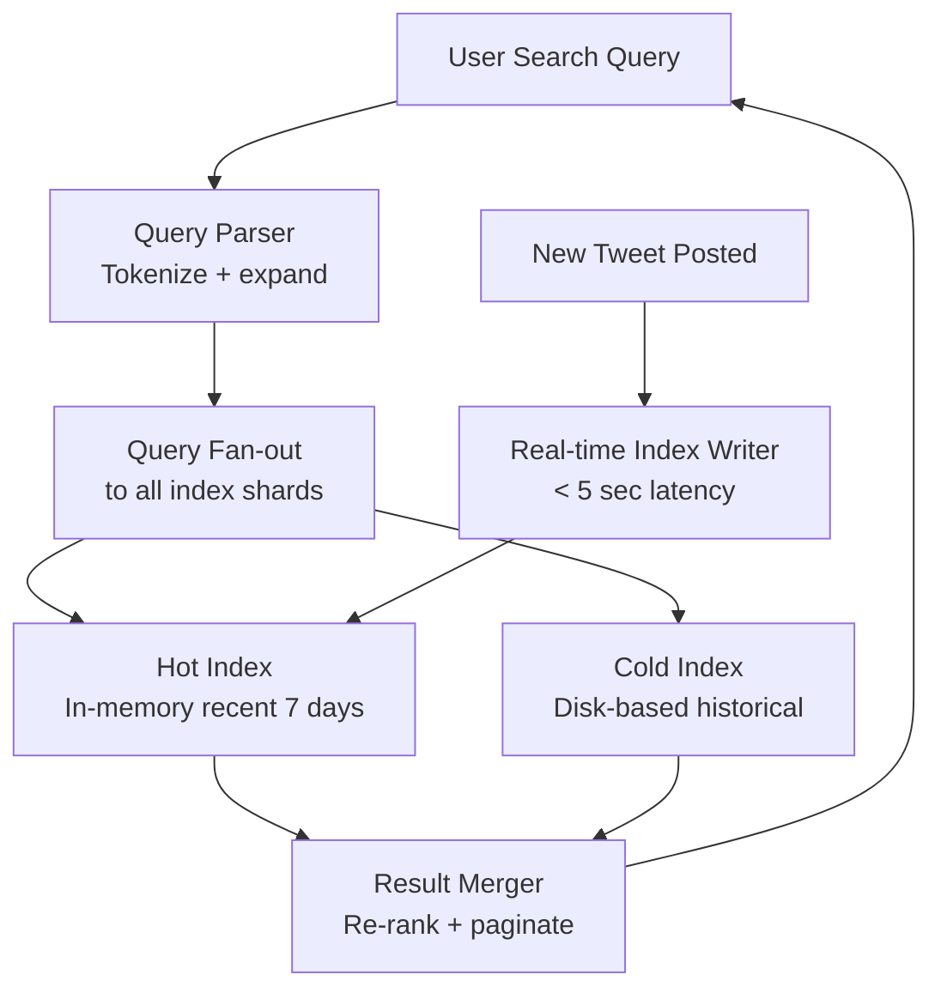

# Design Twitter Search — Real-Time Tweet Search

**Difficulty**: 🔴 Advanced
**Reading Time**: Coming Soon
**Interview Frequency**: High

---

> 🚧 **Full article coming soon.** This stub gives you the essentials to start thinking about this problem.

---

## The Core Problem

Indexing 500 million tweets per day and making them searchable in under 1 second — with results sorted by recency and relevance — requires an inverted index that supports both real-time updates (tweets must be searchable within seconds of posting) and low-latency queries on a corpus of 1+ trillion historical tweets.

## Functional Requirements

- Search tweets by keyword, hashtag, or @mention
- Filter by date range, language, verified users
- Return results ordered by recency or relevance
- Typeahead suggestions while typing
- Real-time results for breaking news searches

## Non-Functional Requirements

| Requirement | Target |
|-------------|--------|
| Tweet indexing latency | Searchable within 5 seconds of posting |
| Search latency | p99 < 1 second |
| Index freshness | Real-time (seconds, not minutes) |
| Scale | 500M tweets/day, 600M users, 1B searches/day |

## Back-of-Envelope Estimates

- **Index write rate**: 500M tweets/day ÷ 86,400 = ~5,800 tweets/sec needing real-time indexing
- **Search rate**: 1B searches/day ÷ 86,400 = ~11,600 searches/sec
- **Total index size**: 500B tweets ever × 10 tokens avg × 8 bytes per posting = ~40TB inverted index

## Key Design Decisions

1. **Early Bird — In-Memory Index for Recent Tweets** — most searches are for recent content (last 7 days); keep a hot in-memory inverted index for recent tweets; cold index on disk for historical; route queries to hot index first, then fall back to full index if needed.
2. **Scatter-Gather Query Execution** — partition index across 100+ shards; broadcast query to all shards; each shard returns top-K local results; coordinator merges and re-ranks; parallelism keeps latency under 1 second despite huge index.
3. **Ranking: Recency × Engagement** — pure recency favors spam; pure engagement favors viral content over breaking news; blend: score = recency_decay × (1 + log(likes + retweets)) × author_reputation_score.

## High-Level Architecture

## Top Interview Questions for This Problem

| Question | Tests |
|----------|-------|
| How do you index 5,800 new tweets per second with under 5-second searchability? | Real-time indexing, write path |
| How do you handle a search for a breaking news keyword that suddenly gets 1M queries/sec? | Cache query results, circuit breaker |
| How would you rank results that are all from the last 60 seconds? | Sub-second ranking signals |

## Related Concepts

- [Google Search for full web-scale indexing comparison](./google-search)
- [Top-K analysis for trending hashtag detection](../01-data-processing/top-k-analysis)

---

*📚 Full deep-dive with multiple approaches, trade-off tables, and pseudocode coming soon.*

## 📚 Resources & References

| Resource | Type | What You'll Learn |
|----------|------|------------------|
| [ByteByteGo — Design Twitter Search](https://www.youtube.com/@ByteByteGo) | 📺 YouTube | Search "Twitter search design" — real-time indexing, relevance, and scale |
| [Twitter Engineering: Earlybird Real-Time Search](https://blog.twitter.com/engineering/en_us/a/2011/the-engineering-behind-twitter-s-new-search-experience) | 📖 Blog | How Twitter built Earlybird for real-time tweet search at 400M tweets/day |
| [Twitter Engineering: Search Infrastructure](https://blog.twitter.com/engineering/en_us/topics/infrastructure/2016/the-infrastructure-behind-twitter-scale) | 📖 Blog | Twitter's search stack evolution over 10+ years |
| [Apache Lucene Architecture](https://lucene.apache.org/core/documentation.html) | 📚 Docs | The search engine library powering Elasticsearch and Solr |
| [Bleve: Full-Text Search in Go](https://blevesearch.com/docs/Getting-Started/) | 📚 Docs | Understanding inverted indexes and BM25 ranking |
