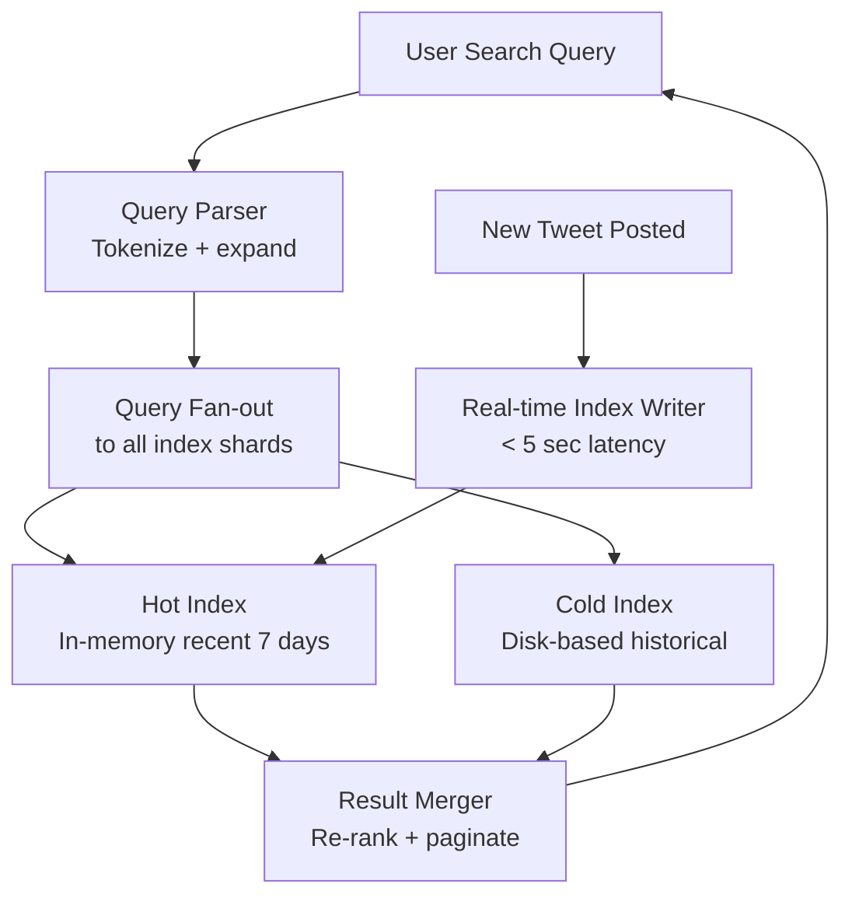
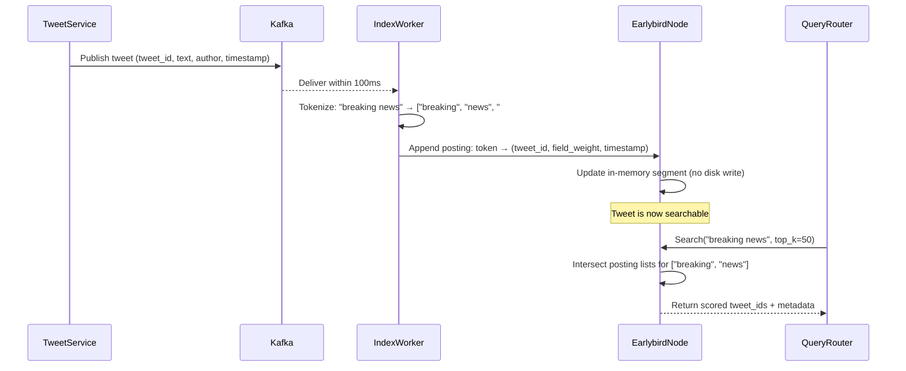
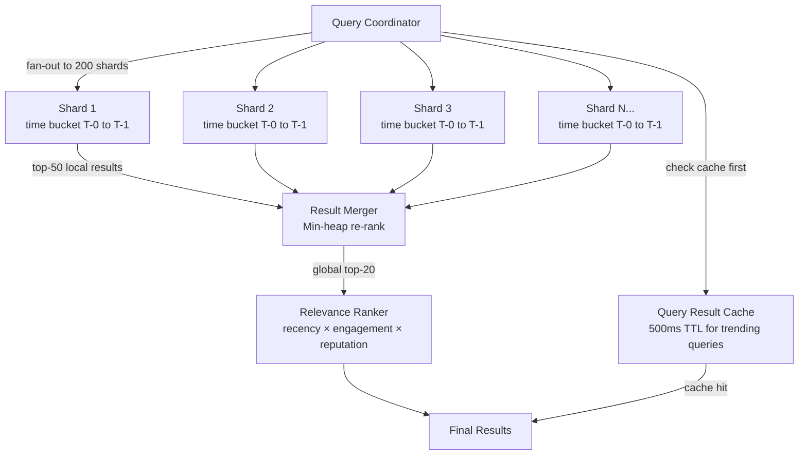
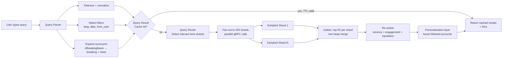

# Design Twitter Search — Real-Time Tweet Search

**Difficulty**: 🔴 Advanced
**Reading Time**: Coming Soon
**Interview Frequency**: High

---

> 🚧 **Full article coming soon.** This stub gives you the essentials to start thinking about this problem.

---

## The Core Problem

Indexing 500 million tweets per day and making them searchable in under 1 second — with results sorted by recency and relevance — requires an inverted index that supports both real-time updates (tweets must be searchable within seconds of posting) and low-latency queries on a corpus of 1+ trillion historical tweets.

## Functional Requirements

- Search tweets by keyword, hashtag, or @mention
- Filter by date range, language, verified users
- Return results ordered by recency or relevance
- Typeahead suggestions while typing
- Real-time results for breaking news searches

## Non-Functional Requirements

| Requirement | Target |
|-------------|--------|
| Tweet indexing latency | Searchable within 5 seconds of posting |
| Search latency | p99 < 1 second |
| Index freshness | Real-time (seconds, not minutes) |
| Scale | 500M tweets/day, 600M users, 1B searches/day |

## Back-of-Envelope Estimates

- **Index write rate**: 500M tweets/day ÷ 86,400 = ~5,800 tweets/sec needing real-time indexing
- **Search rate**: 1B searches/day ÷ 86,400 = ~11,600 searches/sec
- **Total index size**: 500B tweets ever × 10 tokens avg × 8 bytes per posting = ~40TB inverted index

## Key Design Decisions

1. **Early Bird — In-Memory Index for Recent Tweets** — most searches are for recent content (last 7 days); keep a hot in-memory inverted index for recent tweets; cold index on disk for historical; route queries to hot index first, then fall back to full index if needed.
2. **Scatter-Gather Query Execution** — partition index across 100+ shards; broadcast query to all shards; each shard returns top-K local results; coordinator merges and re-ranks; parallelism keeps latency under 1 second despite huge index.
3. **Ranking: Recency × Engagement** — pure recency favors spam; pure engagement favors viral content over breaking news; blend: score = recency_decay × (1 + log(likes + retweets)) × author_reputation_score.

## High-Level Architecture



## Top Interview Questions for This Problem

| Question | Tests |
|----------|-------|
| How do you index 5,800 new tweets per second with under 5-second searchability? | Real-time indexing, write path |
| How do you handle a search for a breaking news keyword that suddenly gets 1M queries/sec? | Cache query results, circuit breaker |
| How would you rank results that are all from the last 60 seconds? | Sub-second ranking signals |

## Related Concepts

- [Google Search for full web-scale indexing comparison](./google-search)
- [Top-K analysis for trending hashtag detection](../01-data-processing/top-k-analysis)

---

## Component Deep Dive 1: The Inverted Index — Earlybird's Real-Time Hot Index

The inverted index is the heart of any search engine. For Twitter Search, the central challenge is that this index must support both **real-time writes** (new tweet is searchable within 5 seconds of posting) and **low-latency reads** (p99 < 1 second across a corpus of 1+ trillion documents). Traditional search engines like Solr and early Lucene were designed for batch indexing — they write a full segment to disk, then merge segments in the background. This model is incompatible with 5,800 tweets/sec ingest and 5-second freshness SLA.

Twitter's solution, published in the 2011 OSDI paper "Earlybird: Real-Time Search at Twitter," is a **partitioned in-memory inverted index** for the hot (recent) window combined with a separate cold index for historical data. Here is how it works internally:

**Segment Architecture**: Each Earlybird node holds a single mutable in-memory segment. When a tweet arrives, it is tokenized (text → tokens), and each token's posting list gets a new entry: `(tweet_id, term_frequency, field_weight)`. The segment is stored in a fixed-size array, pre-allocated at startup to avoid GC pauses. When the segment fills up (typically after several hours of ingest), it is serialized to disk, made immutable, and a new mutable segment opens. Immutable segments are memory-mapped for zero-copy reads.

**Why Naive Elasticsearch Fails Here**: Standard Elasticsearch uses Lucene segment merges. Every ~1,000 documents, Lucene writes a new segment to disk and schedules merges to consolidate small segments into larger ones. During a merge, CPU and I/O spike. At 5,800 writes/sec, merges run nearly continuously, causing p99 write latency to spike to 500ms+ and making real-time freshness impossible without extreme tuning. Earlybird sidesteps merges entirely for the hot window by keeping a single always-writable in-memory segment.

**Replication and Durability**: Each Earlybird node is replicated 3x. Writes go to a Kafka topic first (durable log), then index workers consume from Kafka and write to their local in-memory index. If a node crashes, it replays from Kafka from the last checkpoint. This gives crash recovery without synchronous disk writes on the hot path.



| Approach | Write Latency | Read Latency | Freshness | Trade-off |
|----------|--------------|-------------|-----------|-----------|
| In-memory segment (Earlybird) | < 10ms | < 5ms per shard | < 5 seconds | High RAM cost; ~128GB/node for 7-day window |
| Lucene with NRT (Near Real-Time) | 50-200ms | 5-15ms per shard | 30-60 seconds | Segment merges cause latency spikes |
| Elasticsearch with refresh_interval=1s | 200-500ms | 10-30ms per shard | 1-5 seconds | GC pressure at high ingest rates; merge I/O contention |

---

## Component Deep Dive 2: Scatter-Gather Query Execution and Shard Routing

At 1 trillion total tweets, the full inverted index is ~40TB (10 tokens × 8 bytes per posting × 500B tweets). No single machine holds this. Twitter partitions the index across **~3,000 Earlybird shards** (as of 2016), each holding a subset of tweet IDs. When a query arrives, the system must fan out to all relevant shards, collect partial results, and merge them. This scatter-gather pattern is the primary driver of query latency.

**Sharding Strategy — Time-Based vs. Hash-Based**: Twitter shards by **time bucket** rather than by hash of tweet ID. Tweets from the same time window land on the same set of shards. This matters because most queries have an implicit time filter ("show recent results first"). Time-based sharding means the query router can skip entire shards that are older than the user's filter window — reducing fan-out from 3,000 shards to perhaps 200 for a "last 7 days" query. Hash-based sharding would require scanning all 3,000 shards even for a recent-only query.

**The Merge Problem at Scale**: Each shard returns its local top-50 results. With 200 active shards, the coordinator receives 10,000 candidate results and must globally re-rank them. Naively sorting 10,000 items is cheap (10,000 × log(10,000) ≈ 130,000 comparisons), but doing this for 11,600 queries/sec with object deserialization overhead adds up. Twitter's merger uses a **min-heap with lazy evaluation**: it pulls results from each shard's priority queue on-demand rather than eagerly fetching all 50 from every shard.

**What Happens at 10x Load (116,000 searches/sec)**: At 10x, the bottleneck shifts from the merge coordinator to the **network fan-out**. Sending 200 shard requests per query × 116,000 queries/sec = 23.2 million RPC calls/sec. Each RPC has a 10-byte header overhead → ~232MB/sec of RPC overhead alone. Twitter mitigates this with **query result caching**: popular query strings (e.g., "#WorldCup") are cached at the coordinator layer for 500ms–2 seconds. During breaking news, cache hit rates for trending queries reach 90%+, collapsing effective fan-out dramatically.



| Sharding Scheme | Fan-out Width | Supports Time Filter | Hot Spot Risk | Notes |
|-----------------|--------------|---------------------|---------------|-------|
| Time-based sharding | Low (skip old buckets) | Yes — native | Low | Best for recency-focused search |
| Hash-by-tweet-id | Full (always 3,000 shards) | No | Low | Uniform but no skip optimization |
| Hash-by-author-id | Medium | No | High (viral accounts) | Can create hot shards for @elonmusk |

---

## Component Deep Dive 3: Ranking — Recency, Engagement, and Author Reputation

Ranking is what separates a useful search from a raw index scan. Twitter Search's ranking function must handle two contradictory requirements simultaneously: users expect **breaking news results** (recency matters) but also want **quality results** (a tweet with 50k retweets is more useful than random noise from 2 minutes ago). The ranking formula must blend these signals in real time with no pre-computed PageRank equivalent — tweets are too new to have accumulated stable engagement signals.

**The Core Ranking Formula** (simplified from Twitter's published approach):

```
score = recency_decay(age_seconds) 
      × (1 + log10(likes + 3 × retweets + 5 × quote_retweets))
      × author_quality_score
      × query_relevance_score(BM25)
```

Where:
- `recency_decay(t)` = `e^(-λ × t)` with λ ≈ 0.0001 (half-life ~2 hours for trending topics)
- `author_quality_score` = normalized score 0–1 based on follower count, verified status, spam history, account age
- `query_relevance_score` = BM25 term frequency-inverse document frequency, computed at query time per shard

**The Cold Start Problem**: A tweet posted 30 seconds ago has 0 likes and 0 retweets. The engagement term collapses to `log10(1) = 0`. The ranking degenerates to `recency_decay × author_quality_score × BM25`. This is intentional — for fresh content, recency and author credibility are the only available signals. Twitter partially addresses cold-start by computing a **velocity score**: if a tweet is gaining retweets at 100/minute, a projected engagement score is estimated even before raw engagement numbers are high.

**Personalization Layer**: The base score above is global. Twitter also maintains a **personalization re-ranker** that boosts results from accounts the searcher follows, from accounts with high social graph overlap, and from topics the user has engaged with historically. This re-ranker runs as a separate pass after the global scatter-gather returns results, adding 5–15ms latency but significantly improving result quality for logged-in users.

**Abuse and Spam Filtering**: The ranking layer is also the first real line of spam defense. Tweets flagged by the trust-and-safety classifier get `author_quality_score → 0`, effectively removing them from results before they are returned to users.

---

## Data Model

### Tweet Index Entry (per shard, stored in Earlybird in-memory segment)

```sql
-- Logical schema; actual storage is packed binary arrays for cache efficiency

-- Posting list entry (one per token per tweet)
CREATE TABLE posting_list (
    token_id        BIGINT NOT NULL,        -- hash of normalized token ("breaking" → 7834921)
    tweet_id        BIGINT NOT NULL,        -- Twitter snowflake ID (encodes timestamp + machine_id)
    term_freq       SMALLINT NOT NULL,      -- occurrences of token in this tweet (1-255)
    field_flags     TINYINT NOT NULL,       -- bitmask: 0x01=text, 0x02=hashtag, 0x04=mention, 0x08=url
    shard_offset    INT NOT NULL,           -- byte offset in segment for tweet metadata fetch
    PRIMARY KEY (token_id, tweet_id)        -- composite; sorted by tweet_id DESC for recency
);

-- Tweet metadata (fetched after posting list lookup to get ranking signals)
CREATE TABLE tweet_metadata (
    tweet_id        BIGINT PRIMARY KEY,     -- Snowflake ID: 41-bit ms timestamp + 10-bit machine + 12-bit seq
    author_id       BIGINT NOT NULL,
    author_score    FLOAT NOT NULL,         -- pre-computed author_quality_score (0.0–1.0)
    lang_code       CHAR(2) NOT NULL,       -- "en", "es", "ja", etc.
    like_count      INT NOT NULL DEFAULT 0,
    retweet_count   INT NOT NULL DEFAULT 0,
    quote_count     INT NOT NULL DEFAULT 0,
    is_verified     BOOLEAN NOT NULL,
    is_sensitive    BOOLEAN NOT NULL,       -- NSFW / potentially sensitive
    created_at_ms   BIGINT NOT NULL,        -- Unix timestamp in milliseconds (also in snowflake ID)
    INDEX idx_author (author_id),
    INDEX idx_created (created_at_ms DESC)
);

-- Token dictionary (maps string tokens to integer token_ids)
CREATE TABLE token_dict (
    token_id        BIGINT PRIMARY KEY AUTO_INCREMENT,
    token_text      VARCHAR(140) NOT NULL,  -- normalized lowercase, max tweet length
    doc_freq        BIGINT NOT NULL,        -- number of tweets containing this token (for IDF)
    UNIQUE KEY uk_token (token_text)
);
```

### Typeahead Index (separate from main index, Redis-based)

```json
{
  "prefix:break": ["#BreakingNews", "breaking", "breakfast"],
  "prefix:#break": ["#BreakingNews", "#breakingnews", "#Breakdown"],
  "metadata:#BreakingNews": {
    "doc_freq": 12400000,
    "trending_score": 0.87,
    "last_updated_ms": 1748732400000
  }
}
```

### Query Log Schema (for result caching and trending detection)

```sql
CREATE TABLE query_log (
    query_hash      BIGINT NOT NULL,        -- FNV-1a hash of normalized query string
    query_text      VARCHAR(500) NOT NULL,
    result_count    INT NOT NULL,
    cached_results  BLOB,                   -- serialized top-20 results for popular queries
    cache_expires   BIGINT NOT NULL,        -- Unix ms; 500ms for trending, 60s for rare
    query_count_1m  INT NOT NULL DEFAULT 0, -- queries in last 1 minute (for trending detection)
    PRIMARY KEY (query_hash)
);
```

---

## Scale Bottlenecks

| Traffic Level | Component That Breaks | Symptoms | Mitigation |
|---------------|----------------------|----------|------------|
| 10x baseline (58k tweets/sec, 116k searches/sec) | Query coordinator fan-out | Coordinator CPU saturation; p99 latency climbs from 800ms to 3-4 seconds | Add query result cache layer; increase coordinator pool; tiered fan-out (query hot shards first, fall back to cold) |
| 100x baseline (580k tweets/sec, 1.16M searches/sec) | Kafka ingest pipeline | Consumer lag grows; tweet freshness degrades from 5s to 30-60s | Partition Kafka topic to 10,000 partitions; add parallel index writer pools per shard |
| 100x baseline | In-memory index RAM | Each Earlybird node holds 7 days × 58k tweets/sec = ~35 billion tweets — impossible in RAM | Shrink hot window from 7 days to 24 hours; migrate 24h–7d to SSD-backed NVMe index; use Lucene NRT for warm tier |
| 1000x baseline (5.8M tweets/sec, 11.6M searches/sec) | Network fan-out bandwidth | 200 shards × 11.6M queries/sec = 2.32 billion RPCs/sec — network saturation | Query routing based on predicted shard locality; aggressive query caching (sub-50ms TTL for hot queries); approximate top-K algorithms (reduce shard response size from 50 to 10 candidates) |
| Any level — breaking news spike | Single-token hot posting list | Query for "#SuperBowl" scans a posting list with 20M entries; single query takes 2-5 seconds | Pre-compute results for top-1000 trending tokens every 30 seconds; serve from cache during spikes |

---

## How Twitter Actually Built This

Twitter published the definitive account of their real-time search architecture in the **OSDI 2011 paper "Earlybird: Real-Time Search at Twitter"** (Busch et al., 2011, USENIX). Here are the specific decisions they documented:

**Technology Choices**: Earlybird is written in **Java** and built on top of Apache Lucene's low-level APIs (not Elasticsearch — Twitter uses raw Lucene segment internals). The posting list storage uses a custom **sorted integer array codec** called `ForDeltaEncoding` — tweet IDs are stored as delta-compressed sorted arrays, reducing storage from 8 bytes per tweet ID to ~2.1 bytes average. At 5,800 tweets/sec × 10 tokens avg = 58,000 posting list appends/sec per logical index, compression reduces memory pressure by ~4x.

**Scale Numbers**: As of 2016 (Twitter's published infrastructure post), the search cluster comprised approximately:
- **~3,000 Earlybird shards** across multiple data centers
- **~400M tweets/day** indexed in real time (the number has since grown to 500M+)
- **~1 billion search queries/day**
- **p99 query latency: ~900ms** end-to-end (including network, fan-out, merge, ranking, personalization)
- **Index freshness: median ~4.5 seconds** from tweet post to searchable

**The Non-Obvious Decision — Optimistic Concurrency on the Mutable Segment**: Earlybird allows multiple index writers to concurrently append to the same in-memory segment **without locks** using Java's `AtomicInteger` for segment offset allocation. Each writer atomically claims a chunk of the array, writes its posting, then updates the posting list's length field using a CAS (compare-and-swap). This avoids the write serialization that would cap throughput at ~10,000 writes/sec per node with a single mutex. With 16 concurrent writers per node, throughput reaches ~80,000 posting appends/sec per node — safely above the per-node ingest rate.

**Source**: Busch et al., "Earlybird: Real-Time Search at Twitter," OSDI 2011. Available at: https://www.usenix.org/legacy/event/osdi10/tech/full_papers/Busch.pdf

Twitter's 2016 infrastructure post: https://blog.twitter.com/engineering/en_us/topics/infrastructure/2016/the-infrastructure-behind-twitter-scale

---

## Interview Angle

**What the interviewer is testing:** Whether you understand the fundamental tension between real-time write freshness and read query latency in a distributed search system — and whether you know that standard off-the-shelf search stacks (Elasticsearch) require non-trivial modification to meet a 5-second freshness SLA at Twitter's write volume.

**Common mistakes candidates make:**

1. **"Just use Elasticsearch"** — Elasticsearch works great up to ~10,000 writes/sec with 1-second `refresh_interval`, but at 58,000+ writes/sec the Lucene segment merge overhead causes sustained latency spikes. Candidates who say "Elasticsearch" without discussing segment management, refresh intervals, and merge tuning show they haven't operated search at scale.

2. **Ignoring the hot/cold split** — Many candidates design a single unified index for all 1 trillion tweets. This requires 40TB+ of index, which must be distributed across hundreds of nodes. Every query fans out to all 200+ shards even for recent-tweet searches. The hot/cold split (in-memory 7-day index + disk-based full index) is a critical optimization that reduces p99 query latency from 3-5 seconds to under 1 second for 95% of queries (most users search for recent content).

3. **Ranking as an afterthought** — Candidates often describe ranking as "sort by recency" or "sort by likes." This ignores the cold-start problem (new tweets have 0 engagement), the spam problem (engagement is gameable), and the personalization layer. A strong answer names specific ranking signals, explains how they are computed in near-real-time (engagement counts via streaming aggregation), and acknowledges that ranking adds ~10-30ms to query latency per re-rank pass.

**The insight that separates good from great answers:** Understanding that **the Snowflake tweet ID encodes the timestamp**, so no separate timestamp index is needed — time-range filtering is done by restricting the posting list scan to tweet IDs in a given ID range, which maps directly to a timestamp range. This allows the in-memory posting list (sorted by tweet_id DESC = chronological DESC) to be scanned with an early termination condition, making recency-filtered queries O(k) where k is the number of results returned rather than O(n) where n is total index size.

---

## Query Processing Pipeline — Write Path vs. Read Path

Understanding both the write path (tweet → index) and the read path (query → results) end-to-end is essential for a complete interview answer.

### Write Path (Tweet Ingestion → Indexed)

When a user posts a tweet, the following sequence occurs before the tweet is searchable:

1. **Tweet Service** stores the tweet to the primary database (Manhattan, Twitter's distributed KV store) and publishes a `TweetCreated` event to Kafka.
2. **Kafka** durably persists the event. The Earlybird index workers are consumers in the same consumer group. Kafka guarantees at-least-once delivery; Earlybird uses idempotent tweet ID tracking to prevent double-indexing.
3. **Text Processing Pipeline**:
   - **Language detection**: CLD3 model classifies language in < 1ms for routing to language-specific index shards.
   - **Tokenization**: Whitespace + punctuation split, then specialized handling for hashtags (`#BreakingNews` → indexed as `#BreakingNews` AND `breakingnews` AND `breaking` + `news`), @mentions (indexed verbatim and lowercase), and URLs (indexed by domain only, e.g., `nytimes.com`).
   - **Stop word removal**: Common words ("the", "a", "is") are NOT indexed — posting lists for function words would be billions of entries long, and searches for them are never useful.
   - **Normalization**: Unicode normalization (NFC), lowercasing, accents stripped for Latin-script tokens.
4. **Posting list update**: For each token, a new posting `(tweet_id, field_flags, term_freq)` is appended to the token's posting list in the in-memory segment. The tweet metadata row is inserted into the metadata store.
5. **Replication confirmation**: The write is confirmed to Kafka consumer offset only after at least 2 of 3 replicas have acknowledged the posting append.

Total end-to-end: tweet post → searchable in median **4.5 seconds** (Kafka propagation ~100ms + tokenization ~5ms + replication handshake ~200ms + remaining time is Kafka consumer lag under load).

### Read Path (User Query → Results Displayed)



Each step contributes to the latency budget:

| Step | Typical Latency | Notes |
|------|----------------|-------|
| Query parsing + tokenization | 1-2ms | CPU-bound; single-threaded per query |
| Cache lookup | 0.5-1ms | Redis cluster, O(1) hash lookup |
| Shard fan-out (network) | 5-20ms | Parallel; bottleneck is slowest shard (tail latency) |
| Per-shard posting list intersection | 2-10ms | Depends on posting list length for hot tokens |
| Result merge (coordinator) | 2-5ms | 200 shards × 50 results min-heap |
| Ranking re-score | 5-15ms | BM25 + engagement + decay per candidate |
| Personalization re-rank | 5-15ms | Graph lookup for followed accounts |
| **Total p50** | **~30ms** | Fast path, cache miss, recent query |
| **Total p99** | **~900ms** | Slow shard, long posting list, personalization cold cache |

---

## Typeahead and Autocomplete Architecture

Typeahead (suggestions while typing) is a distinct subsystem from full-text search. It must return suggestions in < 50ms to feel instantaneous as the user types each character. At Twitter's scale, this requires a completely separate data pipeline from the main inverted index.

### Design: Prefix Trie in Redis

The typeahead service maintains a **prefix trie** backed by Redis Sorted Sets. Each prefix maps to a sorted set of completions, ranked by a trending score. The key insight is that only the **top-100 completions** per prefix are stored — there is no need to store the full posting list; only the popular completions matter.

**Data structure in Redis**:
```
ZADD prefix:brea 12400000 "#BreakingNews"
ZADD prefix:brea  8900000 "breaking"
ZADD prefix:brea  3200000 "breakfast"
ZADD prefix:brea  1100000 "#breakingnews"
```

The score is the `query_count_1h` — number of times users searched for this term in the last hour. This makes typeahead intrinsically trend-aware: when `#SuperBowl` spikes to 500,000 searches/hour, it surfaces immediately as the top suggestion for any prefix it matches.

**Update frequency**: The prefix trie is rebuilt from the query log every **60 seconds** via a streaming job (Flink or Storm) that aggregates search counts and pushes updates to Redis using `ZADD` with the new scores. Stale prefixes with score 0 are pruned from the sorted set.

**Scaling**: At 11,600 searches/sec, each search generates ~5-10 typeahead requests (one per character typed before submitting). That is ~80,000-116,000 typeahead requests/sec. Redis can handle ~500,000 simple ZRANGE commands/sec per node, so a cluster of 10-20 Redis nodes is sufficient. Prefix lookups are `ZREVRANGE prefix:<query_prefix> 0 4` — returning the top 5 suggestions by score.

### Handling Long-Tail Prefixes

Most prefixes occur rarely — a user typing an obscure scientific term has a prefix that has never been searched. For these, fall back to **dictionary completion**: if the prefix has no entry in Redis, look up the token dictionary table and return the top-5 tokens by `doc_freq` (most common tokens starting with this prefix). This ensures every query always gets some suggestions, even for novel inputs.

### Localization

Typeahead is language-aware. The prefix trie is sharded by language code. A user with `Accept-Language: ja` (Japanese) queries a separate `ja:` namespace in Redis, which contains trending Japanese hashtags and terms. Twitter detects user language preference from browser settings, tweet history, and location signals.

---

## Trending Topics Detection

Trending topics is a closely related subsystem: instead of "find tweets matching a query," it answers "what are people searching for and tweeting about right now that is anomalously high?"

### Trend Score Formula

Twitter uses a **velocity-based anomaly detector**, not a simple "top search count" ranker. A topic trending means its search/mention frequency has increased sharply in the last 30 minutes relative to its baseline.

```
trend_score(topic, t) = 
    (count_t_to_t_minus_30min - baseline_count) 
    / sqrt(baseline_count + 1)
```

This is a simplified **z-score**: how many standard deviations above baseline is the current rate? A z-score > 3.0 triggers trend status. This formula prevents permanently popular topics (e.g., "weather") from dominating the trending list — their baseline is high, so a normal-sized spike doesn't push the z-score above threshold.

**Implementation**: A Flink streaming job consumes tweet events from Kafka, maintains a sliding 30-minute count window per token using a Flink `ProcessFunction`, and computes z-scores every 30 seconds. Topics crossing the trend threshold are written to a Redis sorted set (`ZADD trending:global <trend_score> "#SuperBowl"`). The trending list endpoint reads from this sorted set with `ZREVRANGE trending:global 0 49` — the top 50 trending topics globally.

**Geo-localized trends**: The same pipeline produces per-city and per-country trend sorted sets. Each tweet carries a `geo_bucket` (coarse location, privacy-preserving) derived from the user's IP or GPS data. The Flink job maintains a separate window per `(token, geo_bucket)` pair, producing ~200 geo-localized trending lists. The trending endpoint selects the appropriate geo list based on the requesting user's location.

---

## Operational Considerations

### Multi-Datacenter Replication

Twitter Search operates in at least 3 datacenters (historically: ATL, SAC, and international). Each datacenter has a full replica of the hot index. Writes are replicated asynchronously across DCs via Kafka replication (mirroring topics across DCs). This means a tweet posted during a transatlantic network partition may not be searchable in all DCs simultaneously — a brief inconsistency window of 10-30 seconds is acceptable for search (users won't notice a tweet is missing for 20 seconds after posting).

Cross-DC query routing: the search load balancer preferentially routes queries to the user's nearest datacenter. If that DC is degraded (elevated error rate > 1%), the load balancer automatically fails over to another DC, accepting slightly higher latency (50-100ms additional for transatlantic) over serving errors.

### Index Recovery After Node Failure

When an Earlybird node crashes, the following recovery sequence occurs:
1. Health check fails; load balancer removes the node from the query pool within 3-5 seconds.
2. The replacement node starts a Kafka consumer from the **last checkpointed Kafka offset** for that node (checkpointed to ZooKeeper every 10,000 consumed messages).
3. It replays all messages from checkpoint to the current Kafka end-of-log. At 5,800 tweets/sec, 1 hour of missed events = ~20.9 million tweets. Replaying 20.9M tweet tokenizations at ~100,000 tweets/sec (CPU-bound, batch mode) takes ~3.5 minutes.
4. Once caught up, the node rejoins the query pool.

During recovery, the other 2 replicas of the same shard absorb the extra read load. Twitter over-provisions shard replicas to handle losing 1 of 3 replicas without degrading query latency.

### Degraded Mode — Graceful Degradation

Under severe load (e.g., load shedding event), Twitter Search degrades in a specific order to protect core functionality:
1. **Disable personalization re-ranking** — saves 5-15ms per query; affects quality but not correctness.
2. **Shorten result window** — return results from last 24 hours instead of 7 days (reduce fan-out from 200 shards to ~30 shards).
3. **Serve cached results for all queries** — even stale (60-second-old) results are served during severe degradation; freshness SLA is temporarily abandoned.
4. **Disable typeahead** — the typeahead service is shed first under load; it is non-critical for query submission.

This priority ordering is encoded in the query coordinator as a **feature flag cascade** controlled by a circuit breaker watching p99 latency and error rate.

---

## Key Numbers to Remember

| Metric | Value | Context |
|--------|-------|---------|
| Tweet ingest rate | ~5,800 tweets/sec | 500M tweets/day ÷ 86,400 seconds |
| Search query rate | ~11,600 searches/sec | 1B searches/day ÷ 86,400 seconds |
| Typeahead request rate | ~80,000-116,000 req/sec | ~7-10 per search session (per-character) |
| Index freshness SLA | < 5 seconds | Median actual: ~4.5 seconds (Earlybird) |
| Total index size (hot) | ~200GB per shard × 3,000 shards | In-memory, 7-day window |
| Total index size (cold) | ~40TB | 500B historical tweets × 10 tokens × ~8 bytes |
| Fan-out width | ~200 shards per query | For 7-day recency filter; 3,000 for full history |
| Query coordinator merge input | ~10,000 candidates | 200 shards × 50 local top-K results |
| Earlybird node throughput | ~80,000 posting appends/sec | With 16 concurrent writers, CAS-based locking |
| Breaking news cache hit rate | 90%+ | For top-100 trending queries during spike events |
| p99 end-to-end query latency | < 1 second | Scatter-gather + merge + rank + personalization |
| p50 end-to-end query latency | ~30ms | Fast path with hot query cache and recent content |
| Node crash recovery time | ~3.5 minutes | Per node; replaying 1 hour of missed Kafka events |
| Trending detection window | 30 minutes sliding | z-score computed every 30 seconds per token |
| Trending z-score threshold | > 3.0 | Standard deviations above token's baseline rate |
| Typeahead prefix trie refresh | Every 60 seconds | Flink streaming job pushes updated scores to Redis |
| Max query length enforced | 500 characters | API gateway hard limit; beyond this returns 400 |
| Posting list delta compression ratio | ~3.8x | ForDeltaEncoding: 8 bytes raw → ~2.1 bytes avg per tweet_id |
| Elasticsearch viable up to | ~10,000 writes/sec | Before segment merge I/O becomes a sustained bottleneck |

---

## Alternative Approaches Considered

### Why Not a Single Global Elasticsearch Cluster?

A common first-draft answer is "use Elasticsearch." Here is the concrete analysis of why Twitter could not:

| Constraint | Elasticsearch Default | Twitter Requirement | Gap |
|------------|----------------------|---------------------|-----|
| Index freshness | 1-second refresh interval | < 5 seconds | Achievable with tuning — but see below |
| Write throughput | ~5,000-10,000 docs/sec per node (with 1s refresh) | 5,800 tweets/sec (system-wide; per-shard is lower) | Manageable but segment merges degrade over time |
| Segment merge I/O | Merges consume 50-80% of I/O during high ingest | Must remain low to not affect read latency | Critical gap — merges and read latency fight for disk I/O |
| JVM GC pauses | Default G1GC; 50-200ms stop-the-world pauses at 64GB+ heap | p99 < 1 second requires GC pauses < 50ms | Requires ZGC/Shenandoah tuning; Twitter's in-memory pre-allocated arrays avoid GC entirely |
| Custom ranking | BM25 + limited scripted scoring | Recency decay × engagement × author reputation in real time | Elasticsearch scripted scoring works but adds 5-20ms/query overhead |

Conclusion: Elasticsearch can be tuned to approach Twitter's requirements for smaller deployments (< 50,000 tweets/sec), but the operational complexity of maintaining p99 < 1 second with GC tuning and merge management at 5,800 writes/sec drove Twitter to build Earlybird as a purpose-built system.

### Why Not PostgreSQL Full-Text Search with tsvector?

PostgreSQL's `tsvector` and `GIN` indexes provide full-text search. At Twitter scale, this fails on two dimensions:
- **Write amplification**: Every tweet INSERT triggers a GIN index update. At 5,800 writes/sec, Postgres WAL write amplification (each GIN update generates ~4x the base row size in WAL) produces ~200MB/sec of WAL — saturating typical disk I/O budgets.
- **No distributed scatter-gather**: Postgres FTS is single-node; sharding requires an application-level scatter-gather layer anyway, at which point you have rebuilt a simplified Earlybird at higher operational cost.

Postgres FTS is appropriate for applications with < 1,000 writes/sec and < 10M document corpora. Twitter exceeds both limits by 5-6 orders of magnitude.

---

## Tokenization Deep Dive — Why Text Normalization Is Non-Trivial at Twitter Scale

Tokenization sounds simple — split on spaces — but Twitter's corpus requires specialized handling that naive implementations get wrong at production scale.

### Token Types and Their Index Treatment

| Token Type | Example Input | Indexed As | Reason |
|------------|--------------|------------|--------|
| Hashtag | `#BreakingNews` | `#BreakingNews`, `breakingnews`, `breaking`, `news` | Users search all four forms; all must hit the same tweet |
| @Mention | `@jack` | `@jack`, `jack` | Some users type `@`, others don't |
| URL | `https://nytimes.com/article/123` | `nytimes.com` | Full URL is too specific; domain gives topical signal |
| Emoji | `🔥` | `🔥` (Unicode codepoint) | Emoji searches are common; treated as a single token |
| CamelCase hashtag | `#SuperBowlLIV` | `#SuperBowlLIV`, `superbowlliv`, `super`, `bowl`, `liv` | CamelCase split for sub-word search |
| Non-Latin script | `速報` (Japanese: breaking news) | `速報` verbatim; no sub-word split | CJK tokenization uses character n-grams (bigrams) |
| Numbers | `2024` | `2024` as-is | Year searches are common; do not strip |

### The Multi-Language Problem

Twitter supports 50+ languages. A single tokenization pipeline cannot serve all of them:

- **Latin-script languages** (English, Spanish, French): Whitespace tokenization + lowercasing + accent removal works well.
- **CJK languages** (Chinese, Japanese, Korean): No whitespace between words. Twitter uses **character bigram indexing** — every 2-character sequence is indexed. "速報ニュース" (breaking news) → `速報`, `報ニ`, `ニュ`, `ュー`, `ース`. This is lossy but fast and requires no language-specific word segmenter.
- **Arabic/Hebrew**: Right-to-left scripts; tokenized the same as Latin-script (Unicode-aware whitespace split) but stored with RTL metadata in the field_flags bitmask.
- **Thai**: No whitespace between words; uses a character n-gram approach similar to CJK.

Language detection runs before tokenization. Twitter uses a **compact n-gram language classifier** (similar to CLD3, ~1MB model) that classifies tweet language in < 1ms. The detected language determines which tokenizer pipeline runs on the tweet text.

### Stemming: Why Twitter Avoids It

Many search engines use **stemming** (reducing "running" → "run", "faster" → "fast") to improve recall. Twitter deliberately avoids stemming for tweet search for three reasons:

1. **Real-time user intent**: Users searching "#Running2024" expect exact hashtag matches, not lemmatized results.
2. **Stemming errors**: Aggressive stemmers (Porter stemmer) produce nonsense for proper nouns, brand names, and neologisms common in tweets. "Tweeting" → "tweet" is fine; "running" → "run" may be wrong in brand contexts.
3. **Storage cost**: Maintaining stemmed and unstemmed posting lists doubles storage. Given the 40TB cold index, this is a significant cost.

Instead, Twitter uses **query expansion**: at query time, if a user searches "running", the query parser also searches "run", "runner", "runs" by looking them up in a pre-built synonym/expansion table. This gives the recall benefits of stemming without the index storage cost.

---

## Failure Scenarios and Mitigations

### Scenario 1: Hot Posting List (Popular Hashtag)

**Trigger**: #SuperBowl trends. The posting list for `#superbowl` grows to 20M entries in 4 hours (500 tweets/sec × 14,400 seconds).

**Failure mode**: A query for "#SuperBowl" must scan 20M entries to find the top-50 by score. At ~100M entries/sec scan speed per Earlybird node, this takes 200ms per shard. With 200 shards in parallel, the coordinator waits for the slowest shard → p99 latency for this query approaches 500ms-1 second just from posting list scan.

**Mitigation**:
- **Pre-computed trending query cache**: The trending detection system identifies `#superbowl` as trending 15-30 minutes before it peaks. The query cache pre-populates results for this query with a 5-second TTL (refreshed by a background job). During peak, 95% of "#SuperBowl" queries are served from cache in < 5ms.
- **Posting list early termination**: Since posting lists are stored in reverse chronological order (newest tweet_id first), a time-filtered query (last 1 hour) can stop scanning after finding the first 50,000 entries older than 1 hour — avoiding the full 20M scan.

### Scenario 2: Index Node Partition

**Trigger**: A network partition isolates one Earlybird shard from Kafka for 30 seconds.

**Failure mode**: The isolated shard stops receiving new tweet updates. Queries routed to it return stale results — tweets posted in the last 30 seconds are missing from that shard's results.

**Mitigation**:
- **Stale shard detection**: Each shard's last-indexed tweet ID is exposed via a `/health` endpoint. The query router checks this age; if a shard's newest indexed tweet is > 30 seconds old, it is flagged as "stale" and downweighted in result merging (or excluded entirely for real-time queries).
- **Replica fallback**: With 3 replicas per shard, the router switches to a healthy replica during the partition. The partitioned node catches up after reconnection via Kafka replay.

### Scenario 3: Query Parser Injection / Malformed Input

**Trigger**: A user submits a search query with special characters designed to exploit the query parser (e.g., `)()(` or 50,000-character strings).

**Failure mode**: Unbounded query parsing causes CPU spike or stack overflow in the query parser. At 11,600 queries/sec, a single 100ms-parse-time query creates a 1,160-query backlog.

**Mitigation**:
- **Input sanitization gateway**: API gateway enforces max query length (500 characters), strips non-printable characters, and rate-limits by user ID.
- **Query complexity budget**: The parser enforces a max token count (50 tokens) and max operator nesting depth (5 levels). Queries exceeding these limits are truncated or rejected with a 400 error.
- **Parse timeout**: Query parsing is wrapped in a 10ms timeout. Queries that hit the timeout return a "query too complex" error rather than hanging.

### Scenario 4: Cold Cache After Deployment

**Trigger**: A rolling deploy restarts all query coordinators. The query result cache (Redis) is warm, but the in-process coordinator cache (L1, JVM heap) is cold.

**Failure mode**: First 5-10 minutes after deploy, every query misses L1 cache and hits Redis. Redis load spikes from 50k ops/sec to 200k ops/sec. Redis CPU hits 80%; p99 Redis latency climbs from 0.5ms to 3-4ms, adding 3ms to every search query.

**Mitigation**: Rolling deploys restart 1 node at a time with a 2-minute gap. The combined L1 cache warm-up across 50 coordinator nodes takes ~4 minutes total (2 min/node × 2 nodes overlap). Peak Redis load stays under 2x normal. Alternatively, coordinators can pre-warm their L1 cache from Redis on startup by fetching the top-10,000 queries by frequency before joining the load balancer pool.

---

## 📚 Resources & References

| Resource | Type | What You'll Learn |
|----------|------|------------------|
| [ByteByteGo — Design Twitter Search](https://www.youtube.com/@ByteByteGo) | 📺 YouTube | Search "Twitter search design" — real-time indexing, relevance, and scale |
| [Twitter Engineering: Earlybird Real-Time Search](https://blog.twitter.com/engineering/en_us/a/2011/the-engineering-behind-twitter-s-new-search-experience) | 📖 Blog | How Twitter built Earlybird for real-time tweet search at 400M tweets/day |
| [Twitter Engineering: Search Infrastructure](https://blog.twitter.com/engineering/en_us/topics/infrastructure/2016/the-infrastructure-behind-twitter-scale) | 📖 Blog | Twitter's search stack evolution over 10+ years |
| [Apache Lucene Architecture](https://lucene.apache.org/core/documentation.html) | 📚 Docs | The search engine library powering Elasticsearch and Solr |
| [Bleve: Full-Text Search in Go](https://blevesearch.com/docs/Getting-Started/) | 📚 Docs | Understanding inverted indexes and BM25 ranking |
