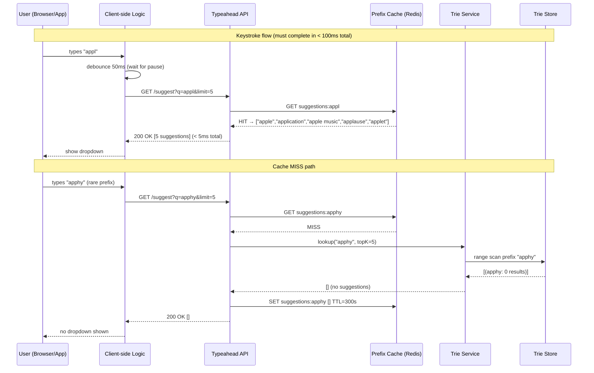
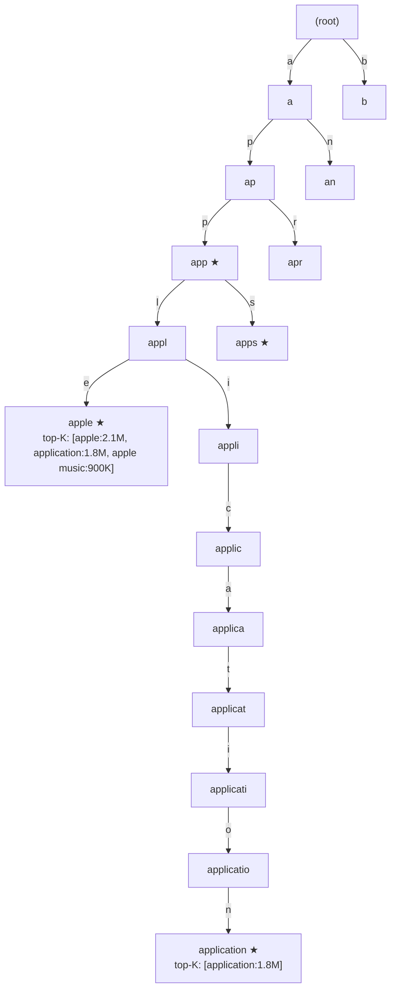
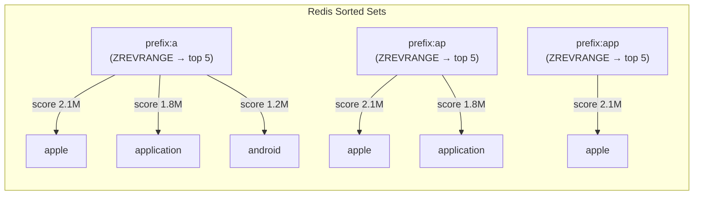
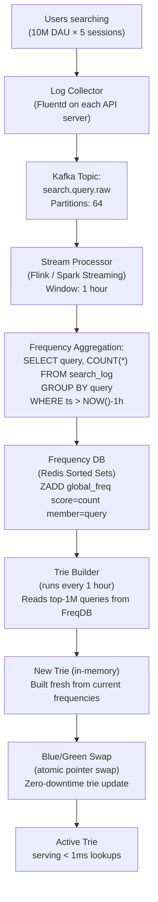
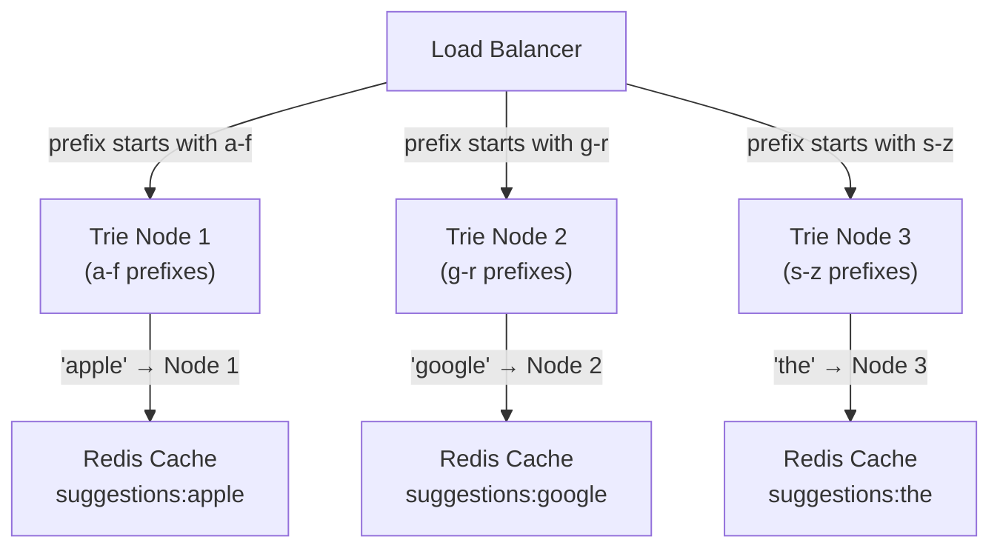
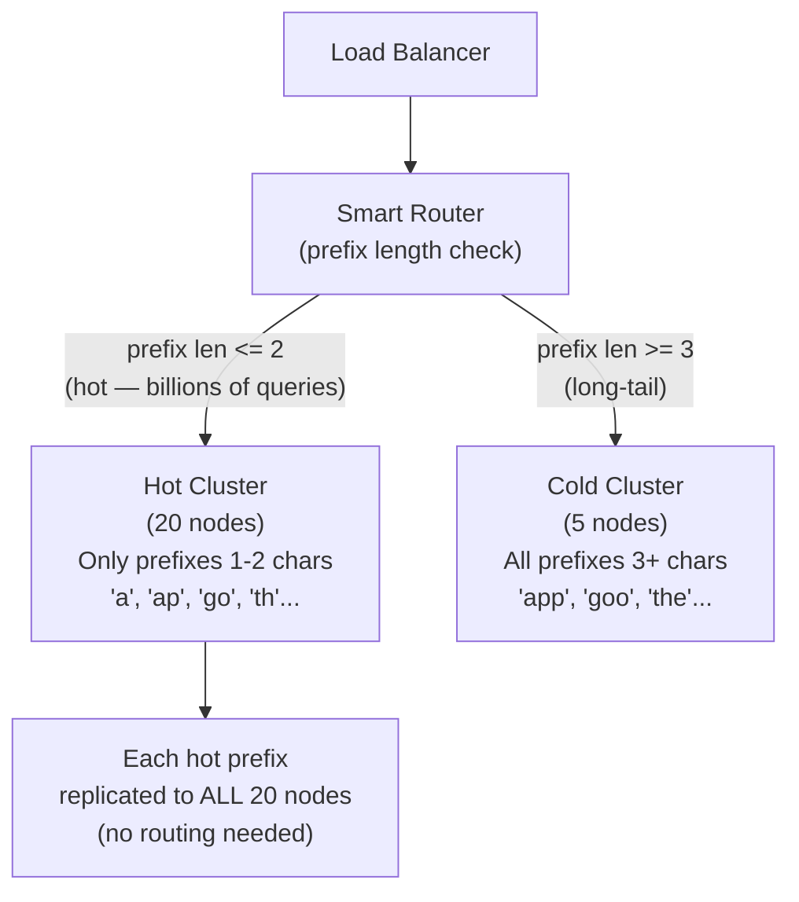
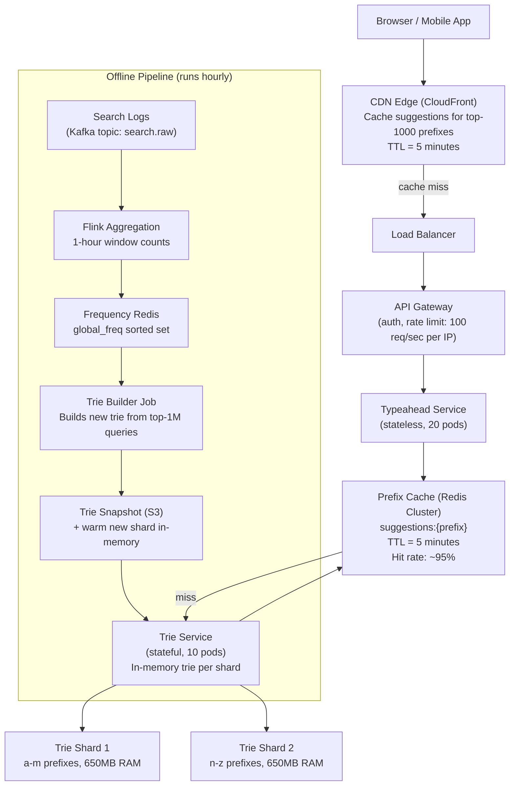
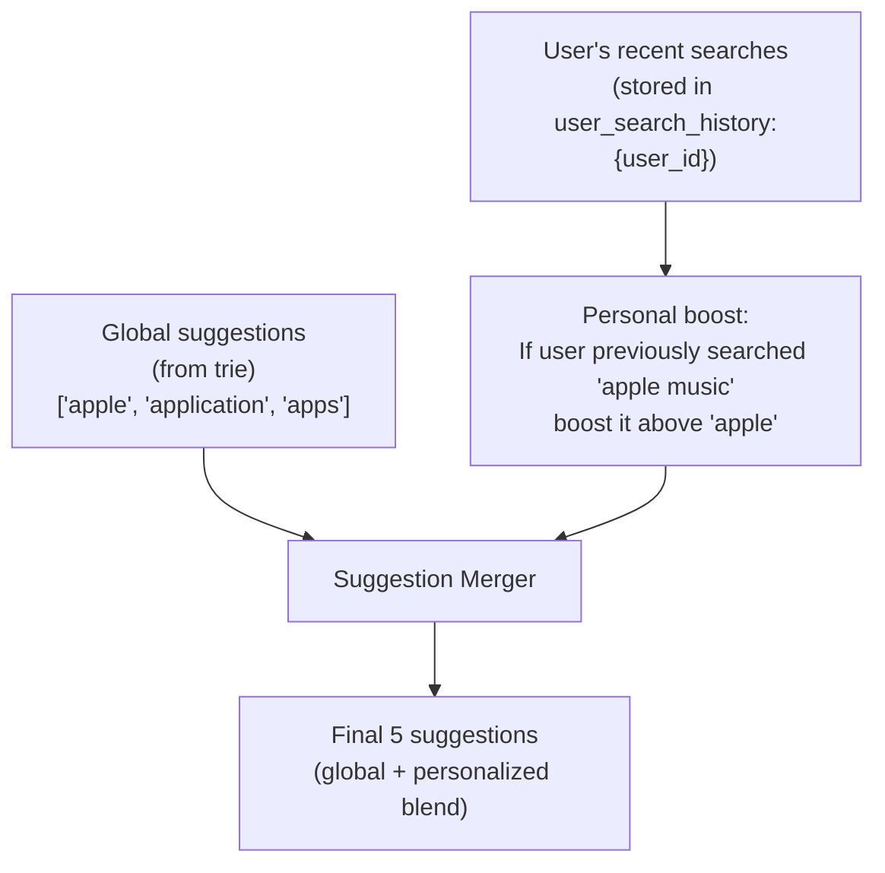

# Design Typeahead Suggestion — Real-Time Autocomplete at Scale

**Difficulty**: 🟡 Intermediate → 🔴 Advanced
**Reading Time**: ~35 minutes
**Interview Frequency**: Very High — appears in ~80% of search-track interviews; commonly asked at Google, Amazon, and Meta
**The Core Problem**: Return the top 5 search suggestions in under 100ms for every keystroke — as 10M users type simultaneously.

---

## Table of Contents

1. [The Mental Model — What Is Typeahead?](#1-the-mental-model)
2. [Requirements with Numbers](#2-requirements-with-numbers)
3. [Capacity Estimation](#3-capacity-estimation)
4. [Deep Dive 1 — Data Structure: Trie vs Inverted Index vs Hash](#4-deep-dive-1--data-structures)
5. [Deep Dive 2 — Data Aggregation Pipeline](#5-deep-dive-2--data-aggregation-pipeline)
6. [Deep Dive 3 — Distributed Trie & Partitioning](#6-deep-dive-3--distributed-trie--partitioning)
7. [Full System Architecture](#7-full-system-architecture)
8. [Caching Strategy](#8-caching-strategy)
9. [Personalization Layer](#9-personalization-layer)
10. [Problems at Scale](#10-problems-at-scale)
11. [Interview Questions Mapped](#11-interview-questions-mapped)
12. [Key Takeaways](#12-key-takeaways)
13. [Related Concepts](#13-related-concepts)

---

## 1. The Mental Model

Typeahead (autocomplete) is deceptively simple from a user perspective: you type "appl" and see "apple", "application", "apple music". Under the hood, it's a distributed systems problem at every layer.



**Two key design insights**:
1. **The cache hit rate matters enormously** — only ~10,000 distinct prefixes cover 90% of all typed queries (Zipf distribution). Cache these aggressively.
2. **Debouncing on the client** reduces server load by 5-10x. Without debouncing, every keystroke fires a request; with 50ms debouncing, only "pauses" fire (most rapid typing is swallowed).

---

## 2. Requirements with Numbers

### Functional Requirements

| Feature | Description |
|---------|-------------|
| Prefix suggestions | Given prefix "foo", return top-5 matching queries by frequency |
| Ranking | Results ranked by search frequency (not alphabetically) |
| Real-time updates | New trending queries appear in suggestions within 1 hour |
| Personalization | (Optional) Boost suggestions from user's own search history |
| Multi-language | Support Unicode prefixes; CJK characters (Chinese, Japanese, Korean) |
| Typo tolerance | "gogle" → suggest "google" (fuzzy matching, optional) |

### Non-Functional Requirements

| Metric | Target | Rationale |
|--------|--------|-----------|
| Suggestion latency | **< 100ms** p99 | UX research: > 100ms feels sluggish |
| Throughput | **10M queries/sec** (peak) | 10M DAU × avg 1 query/sec during active search |
| Availability | 99.99% | Autocomplete missing = degraded UX, not outage |
| Freshness | New queries in suggestions **within 1 hour** | Trending topics (news events) must appear quickly |
| Accuracy | Top-5 must match the global top-5 for that prefix | Not user-perceivable if rank 3 and 4 are swapped |
| Result count | Top-5 suggestions per prefix | More than 5 is UX noise |

---

## 3. Capacity Estimation

### Query Volume

```
Daily Active Users:      10M
Avg search sessions/day: 5 per user
Avg keystrokes/session:  20 (typing a query char by char)
Total keystrokes/day:    10M × 5 × 20 = 1B keystrokes/day

With 50ms client debounce:
  Debounce reduces requests by ~70% (rapid typing swallowed)
  Effective API requests/day: 1B × 0.30 = 300M requests/day
  Per second (avg): 300M ÷ 86,400 = 3,470 req/sec
  Peak (3x): ~10,400 req/sec
```

### Storage Estimate (Trie)

```
English vocabulary: ~600,000 words
Avg word length: 7 characters
Trie nodes: ~600,000 × 7 / 2 (shared prefixes) = ~2.1M nodes

Per trie node:
  Character (1 byte) + children pointers (26 × 8 bytes = 208 bytes) + top-K list (5 × 20 bytes = 100 bytes)
  = ~310 bytes per node

Total memory for English trie:
  2.1M nodes × 310 bytes = ~651MB (fits in a single Redis node)

For 5 languages (estimated):
  651MB × 5 = 3.26GB (3-4 Redis nodes sufficient)
```

### Response Payload

```
Per suggestion: query string (avg 20 chars) + rank score (8 bytes) = ~28 bytes
5 suggestions: 5 × 28 bytes = 140 bytes
With HTTP overhead: ~500 bytes per response

Bandwidth at 10K req/sec:
  10,000 × 500 bytes = 5MB/sec → trivial for API layer
```

---

## 4. Deep Dive 1 — Data Structures

Three viable data structures exist for prefix lookup. Each has fundamentally different performance characteristics.

### Approach A: Trie (Prefix Tree)

A trie is a tree where each edge represents one character. Every prefix maps to a path from the root.



**Lookup algorithm**:
```
function lookupTopK(prefix, k=5):
    node = trieRoot
    for char in prefix:
        if char not in node.children:
            return []  // prefix not found
        node = node.children[char]

    // node now points to the prefix's terminal node
    return node.topK  // pre-computed at trie build time

Time complexity: O(L) where L = prefix length (usually 3-10)
                 Then O(1) to return pre-stored topK list
```

**Pre-computing topK at each node** (done during trie build, not at query time):
```
function buildTrieWithTopK(query_frequency_list):
    for (query, frequency) in sorted(query_frequency_list, by=frequency desc):
        node = trieRoot
        for char in query:
            if char not in node.children:
                node.children[char] = new TrieNode()
            node = node.children[char]
            // At each ancestor node, update the topK list
            node.topK = mergeTopK(node.topK, (query, frequency), k=5)

    // After build, every prefix node has topK pre-populated
```

**Trade-offs**:

| Dimension | Trie |
|-----------|------|
| Lookup speed | O(L) — extremely fast |
| Update speed | O(L × K) per new query — slow for real-time updates |
| Memory | ~650MB for English vocabulary — manageable |
| Typo tolerance | ❌ None — "gogle" finds no node |
| Multi-language | Character set varies; CJK tries are much larger |

### Approach B: Redis Sorted Sets (Per-Prefix Hash)

For every prefix, store a Redis sorted set: `ZADD prefix:appl 2100000 "apple"`.



**Lookup**: `ZREVRANGE prefix:appl 0 4` → O(log N) where N = candidates for prefix

**Storage estimate**:
```
Unique prefixes: for avg 7-char queries, each generates 7 prefix keys
600,000 queries × 7 prefixes = 4.2M Redis keys
Each key: 5 members × (20 bytes + 8 byte score) = 140 bytes + key overhead (~50 bytes)
Total: 4.2M × 190 bytes = ~800MB
```

**Trade-offs**:

| Dimension | Redis Sorted Sets |
|-----------|-----------------|
| Lookup speed | O(log N) — fast, but N can be large for short prefixes |
| Update speed | O(log N) per update — real-time updates trivial |
| Memory | ~800MB — similar to trie |
| Typo tolerance | ❌ None |
| Horizontal scaling | ✅ Redis Cluster natively distributes keys |

### Approach C: Elasticsearch (Inverted Index with Completion Suggester)

Elasticsearch has a built-in completion suggester that uses an FST (finite state transducer) — similar to a trie but more memory-efficient.

```
PUT /suggestions/_mapping
{
  "mappings": {
    "properties": {
      "query": {
        "type": "completion",
        "analyzer": "simple"
      },
      "weight": { "type": "integer" }
    }
  }
}

GET /suggestions/_search
{
  "suggest": {
    "query-suggest": {
      "prefix": "appl",
      "completion": { "field": "query", "size": 5 }
    }
  }
}
```

**Trade-offs**:

| Dimension | Elasticsearch |
|-----------|-------------|
| Lookup speed | O(L) — FST traversal, similar to trie |
| Update speed | Near real-time (1s refresh interval) |
| Memory | Higher overhead than raw trie (~2-3x) |
| Typo tolerance | ✅ Built-in fuzzy matching (`fuzziness: AUTO`) |
| Operational complexity | High — cluster management, JVM tuning |

### Comparison Table

| Approach | Read Latency | Write (update) | Typo Tolerance | Ops Complexity | Best For |
|----------|-------------|----------------|----------------|----------------|----------|
| **Trie (in-memory)** | **< 1ms** | Slow (rebuild) | ❌ None | Low | Read-heavy; < 1% update rate |
| Redis Sorted Sets | 1-5ms | Real-time | ❌ None | Low | Frequent updates; simpler ops |
| **Elasticsearch** | 5-20ms | Near real-time | **✅ Yes** | High | Typo correction; full search |

**Recommendation**: Use an **in-memory Trie** as the primary structure for P99 < 100ms latency, backed by Redis Sorted Sets for real-time frequency updates, with hourly trie rebuilds from the Redis state. Use Elasticsearch only if typo tolerance is a hard requirement.

---

## 5. Deep Dive 2 — Data Aggregation Pipeline

The trie is only as good as the data that feeds it. The aggregation pipeline turns raw search logs into ranked query frequencies.

### The Data Flow



### Aggregation Pseudocode

```
// Flink streaming job (runs continuously)
function processSearchStream():
    stream = kafka.consume("search.query.raw")

    // Tumbling 1-hour window aggregation
    stream
        .filter(event => event.query.length >= 2)  // ignore single chars
        .map(event => normalize(event.query))       // lowercase, trim
        .keyBy(query => query)
        .timeWindow(Duration.ofHours(1))
        .aggregate(CountAggregator)
        .sink(RedisFrequencySink)

// RedisFrequencySink: on each window close
function flushWindowToRedis(query, count):
    redis.zadd(
        key = "global_freq",
        score = count,
        member = query
    )
    // Also increment rolling 7-day counter for stability
    redis.zincrby("freq_7day", count, query)
```

### Freshness vs Stability Trade-off

| Approach | Freshness | Stability | Risk |
|----------|-----------|-----------|------|
| Real-time counts (1-min window) | < 1 minute | ❌ Noisy — "earthquake LA" spikes for 5 min | Flash trending pollution |
| Hourly window | 1 hour | ✅ Smooth | Breaking news takes 1h to appear |
| 7-day rolling average | Days | Very stable | Trending queries never promoted fast |
| **Hybrid: hourly + 7-day blend** | **< 1 hour** | **✅ Smooth** | **Best of both** |

**Formula used by Google (estimated)**:
```
score(query) = 0.3 × hourly_count + 0.7 × seven_day_count
```

This ensures trending terms (high hourly, low 7-day) bubble up quickly without volatile single-hour spikes dominating.

### Trie Rebuild Strategy

```
Every 1 hour:
  1. Fetch top 1M queries by score from Redis ZREVRANGE global_freq 0 999999
  2. Build new trie in memory (takes ~30 seconds for 1M queries)
  3. Validate: spot-check top 10 prefixes against expected results
  4. Atomic swap: update shared pointer oldTrie → newTrie
  5. GC old trie (or return to object pool)

Blue/Green at service level:
  - Trie service maintains 2 instances: active + standby
  - Standby builds new trie while active serves
  - Load balancer health check gates cutover
  - Rollback: swap back in < 1 second if validation fails
```

---

## 6. Deep Dive 3 — Distributed Trie & Partitioning

A single trie for all English prefixes fits in ~650MB RAM. But at 10M QPS, one machine can't handle the query load. We need to shard.

### Partitioning Strategy A: By Alphabet Range



**Problem**: Alphabet range splits are uneven. "t" has far more queries than "x". Node 3 handles "the" (highest frequency English prefix) alone.

### Partitioning Strategy B: By Frequency (Hot/Cold Split)



**Why hot/cold split works**:
- Prefixes of length 1-2 (e.g., "a", "th") represent ~0.01% of distinct prefixes but ~30% of query volume
- Replicate these across all nodes → any node can answer without routing
- Prefixes of length 3+ have long-tail distribution → normal hash partitioning works

### Partitioning Strategy C: Consistent Hashing (General Purpose)

```
shard_id = consistent_hash(prefix) % NUM_SHARDS

Lookup:
  query: "appl"
  hash("appl") = 7823451
  shard = 7823451 % 20 = 11
  → route to trie shard 11

Add new shard (scale out):
  Consistent hashing moves only K/n keys on average
  K = total prefixes = 4.2M
  n = new shard count = 21
  Keys moved: 4.2M / 21 = 200K prefixes remapped (not full rebalance)
```

**Comparison Table**:

| Strategy | Load Balance | Hot Prefix Safe | Scale Out | Routing Complexity |
|----------|-------------|-----------------|-----------|-------------------|
| Alphabet range | ❌ Uneven | ❌ "the" overloads | Hard (ranges overlap) | Simple |
| Hot/Cold split | ✅ Designed for skew | ✅ Yes | Medium | Medium |
| **Consistent hashing** | **✅ Even** | **❌ Needs replication** | **✅ Easy** | **Low** |

**Best approach**: Consistent hashing for general sharding, **plus** full replication of the top 1,000 most common 1-2 character prefixes to every node to handle the hot prefix problem.

---

## 7. Full System Architecture



**Request path latency budget**:
```
CDN hit:          < 5ms   (edge cache)
Redis hit:        < 5ms   (prefix cache, ~95% of traffic)
Trie lookup:      < 10ms  (in-memory O(L) lookup)
Redis write:      < 2ms   (cache the result for next time)
API overhead:     < 5ms   (parsing, auth token check)
Network (mobile): ~20ms   (CDN edge is < 50ms from user)

P99 total:        < 40ms  (well within 100ms target)
```

---

## 8. Caching Strategy

### Three-Layer Cache

```
Layer 1 — CDN (CloudFront):
  Cache key: /suggest?q={prefix}&limit=5
  TTL: 5 minutes
  Hit rate: ~60% (top popular prefixes)
  Cost: $0.02/GB — essentially free for this response size

Layer 2 — Redis prefix cache:
  Cache key: suggestions:{prefix}
  TTL: 5 minutes
  Hit rate: ~95% (after CDN miss, Redis handles rest)
  Size: 4.2M keys × 500 bytes = 2.1GB — fits in 3 Redis nodes

Layer 3 — Trie (in-memory):
  Always HIT (trie has all valid prefixes)
  Miss only for prefixes with 0 results (rare new query patterns)
```

### Cache Invalidation

```
When trie is rebuilt (hourly):
  Option A: Flush all Redis prefix cache keys on rebuild
    Pro: Perfectly fresh after rebuild
    Con: Cache stampede — 4.2M simultaneous cache misses after flush

  Option B (recommended): Don't flush — let TTL expire naturally
    New trie becomes active
    Old Redis cache serves stale-but-close results for up to 5 minutes
    After 5 min TTL, new trie lookups populate fresh cache entries
    No stampede; max staleness = 5 min (acceptable for suggestions)
```

---

## 9. Personalization Layer

Once the base global typeahead works, personalization boosts results from the user's own history.



**Pseudocode**:
```
function getPersonalizedSuggestions(prefix, user_id, limit=5):
    global_results = getGlobalSuggestions(prefix, limit=10)

    user_history = redis.lrange("user_search_history:" + user_id, 0, 49)
    personal_matches = [q for q in user_history if q.startswith(prefix)]

    // Boost personal matches to top of list
    boosted = []
    seen = set()
    for match in personal_matches[:limit]:
        boosted.append(match)
        seen.add(match)

    for suggestion in global_results:
        if suggestion not in seen and len(boosted) < limit:
            boosted.append(suggestion)

    return boosted[:limit]
```

**Privacy consideration**: User search history is stored only in that user's session/profile cache (not in the global aggregation). Personal history never influences other users' suggestions.

---

## 10. Problems at Scale

### Problem 1: Hot Prefix Causing Single Node Overload

**Scenario**: "the" is typed ~3M times per hour — by far the most common 3-character prefix. In a naive hash-partitioned trie, all "the" queries land on shard 7. Shard 7 gets 30% of all traffic while other shards are idle.

**Root cause**: Zipf distribution of prefix frequencies. Top-0.1% of prefixes generate 30% of queries. Hash partitioning doesn't account for frequency.

**Fix (Read Replica Replication)**:
```
Hot prefix detection (runs every 5 min):
  top_hot = redis.zrevrange("prefix_query_count", 0, 999)  // top 1000 by QPS

  for prefix in top_hot:
      // Replicate trie node data for this prefix to ALL trie service instances
      for each trie_node in ALL_NODES:
          trie_node.cache(prefix, lookupResult(prefix))

Query routing for hot prefixes:
  if prefix in hot_prefix_set:
      route to ANY shard (all have it)  // random load distribution
  else:
      route to consistent_hash(prefix) % NUM_SHARDS
```

Result: Top 1,000 prefixes are served by all nodes simultaneously. A 10-node cluster handles 10x the QPS for these prefixes.

---

### Problem 2: Trie Rebuild Taking Hours While Serving Stale Suggestions

**Scenario**: The query corpus grows to 10M unique queries. The hourly trie rebuild job takes 45 minutes to process 10M entries and build the trie. During rebuild, the active trie is 2 hours stale.

**Root cause**: Single-threaded trie builder can't process 10M entries in < 5 minutes.

**Fix (Parallel Trie Build with Sharded Builder)**:
```
Sharded build approach:
  1. Partition query list by first character: a-f → worker 1, g-m → worker 2, n-z → worker 3
  2. Each worker builds its sub-trie independently in parallel
  3. Workers run on separate machines (each handles ~3M queries)
  4. Build time: 45 min → 45/3 = 15 min with 3 workers

Delta updates (avoid full rebuild):
  Track changed queries since last build:
    changed = queries where count changed > 20% in last hour

  Only rebuild affected trie paths:
    for query in changed:
        trie.update(query, new_count)  // O(L) per query

  Full rebuild: only weekly or when delta > 10% of corpus
```

With delta updates, 99% of hourly "rebuilds" only touch ~5K changed queries (taking < 1 second).

---

### Problem 3: Typo Handling — "gogle" Should Suggest "google"

**Scenario**: User types "gogle" (missing 'o'). Exact trie lookup returns 0 results. User sees an empty dropdown and concludes search is broken.

**Root cause**: Trie only supports exact prefix matching. Edit distance (Levenshtein) lookups require traversing exponentially more trie paths.

**Fix: Phonetic Normalization + Fuzzy Matching Tier**:

```
Approach A: Phonetic normalization (fast, limited)
  Convert query to Soundex/Metaphone: "gogle" → G400, "google" → G240
  Index by phonetic code → exact match on phonetic key
  Fast but misses many typos

Approach B: BK-Tree (Burkhard-Keller tree) for fuzzy matching
  Organize queries by edit distance in a BK-tree
  Query "gogle": find all strings with edit_distance(q, "gogle") <= 1
  → "gogle" → finds "google" (1 deletion), "ogle" (1 deletion), etc.
  Cost: O(n^0.4) average — much faster than O(n) linear scan

Approach C: Elasticsearch fuzzy completion (production-ready)
  GET /suggest?q=gogle&fuzziness=1
  Elasticsearch FST handles edit distance <= 1 natively
  Cost: +50% latency vs exact match

Production recommendation:
  Primary path: exact trie (< 5ms) — handles 95% of queries
  Fallback path: if trie returns 0 results:
    try fuzziness=1 via Elasticsearch (< 50ms)
    cache the fuzzy result for the typo prefix (TTL=1h)
```

---

## 11. Interview Questions Mapped

| Question | What It Tests | Level |
|----------|---------------|-------|
| "Design a typeahead suggestion system" | Full system design: trie, caching, distributed scaling | Mid (L5) |
| "How do you handle the 'hot prefix' problem?" | Replication strategy, load balancing, monitoring | Senior (L6) |
| "How do you keep suggestions fresh when trending topics emerge?" | Aggregation pipeline, latency vs freshness tradeoff | Mid (L5) |
| "What data structure would you use — trie, hash map, or sorted set?" | Data structure tradeoffs for specific workloads | Mid (L5) |
| "How do you rebuild the trie without downtime?" | Blue-green deploy, in-memory swap, zero-downtime ops | Senior (L6) |
| "How do you add typo tolerance?" | BK-tree, fuzzy matching, Elasticsearch completions | Senior (L6) |
| "How do you add personalization without compromising privacy?" | Separate personal history from global aggregation | Staff (L7) |
| "How would you shard the trie across 50 machines?" | Consistent hashing, hot/cold split, data locality | Senior (L6) |

---

## 12. Key Takeaways

- **A trie delivers O(L) prefix lookup where L is the query length (typically 3-8 chars)** — with pre-computed topK lists at each node, the actual query is O(1) after traversal; 650MB RAM is enough for the English vocabulary.
- **95% of typeahead traffic hits the Redis prefix cache, never touching the trie** — the cache key `suggestions:{prefix}` with a 5-minute TTL reduces trie QPS from 10M/sec to ~500K/sec; CDN handles another 60% before Redis.
- **Hourly trie rebuilds with delta updates: full rebuild takes 30 sec for 1M queries; delta updates (5K changed queries) take < 1 second** — blue-green swap ensures zero downtime during transition.
- **Top 1,000 prefixes ("the", "a", "go") generate 30% of all queries** — replicate these to all trie nodes to prevent hot-node overload; consistent hashing handles the remaining 99.9% of the key space.
- **Debouncing on the client reduces API load by 5-10x** — a 50ms debounce swallows rapid keystrokes and fires only when the user pauses; without debouncing, "google" typed at 100ms/key would fire 6 requests instead of 1.

---

## 13. Related Concepts

- [Design Twitter Search](./twitter-search) — Full-text tweet search shares the inverted index and aggregation pipeline concepts
- [Design Google Search](./google-search) — Typeahead is just the autocomplete layer; full search involves crawling, indexing, and ranking
- [Rate Limiter](../05-infrastructure/rate-limiter) — The typeahead API needs IP-based rate limiting to prevent prefix enumeration attacks (scrapers trying every 2-char prefix)
- [Design Yelp / Nearby](./yelp-nearby) — Location-aware typeahead adds geo-prefix ranking on top of frequency ranking

## 📚 Resources & References

| Resource | Type | What You'll Learn |
|----------|------|------------------|
| [System Design Interview — Alex Xu](https://www.amazon.com/System-Design-Interview-insiders-Second/dp/B08CMF2CQF) | 📚 Book | Chapter on designing a typeahead suggestion system |
| [ByteByteGo — Design Typeahead Suggestion](https://www.youtube.com/@ByteByteGo) | 📺 YouTube | Search "typeahead design" — trie data structure, caching, and offline processing |
| [Google Search Autocomplete Engineering](https://research.google/pubs/pub34162/) | 📖 Blog | How Google's autocomplete handles 3.5 billion queries/day with < 100ms latency |
| [Redis Sorted Sets for Leaderboard and Autocomplete](https://redis.io/docs/data-types/sorted-sets/) | 📚 Docs | Using Redis ZADD/ZRANGEBYLEX for real-time typeahead prefix matching |
| [Facebook Search: Aggregated Typeahead](https://engineering.fb.com/2010/05/17/web/the-life-of-a-typeahead-query/) | 📖 Blog | How Facebook's typeahead aggregates results from multiple sources |
