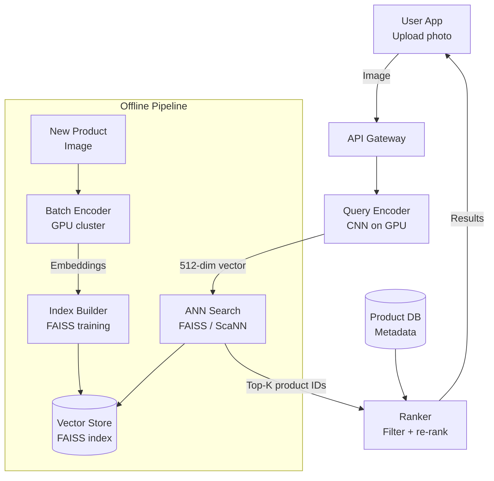

# Design a Visual Search System

**Difficulty**: 🟢 Beginner → 🟡 Intermediate (ML System Design)
**Reading Time**: ~25 minutes
**The Core Problem**: User uploads a photo of a product (a lamp, a shirt). How do you find the 20 most visually similar items from a 100M-product catalog — in < 500ms?

---

## Table of Contents

1. [Requirements](#1-requirements)
2. [Capacity Estimation](#2-capacity-estimation)
3. [High-Level Architecture](#3-high-level-architecture)
4. [Feature Extraction (CNN Embeddings)](#4-feature-extraction-cnn-embeddings)
5. [Approximate Nearest Neighbor Search](#5-approximate-nearest-neighbor-search)
6. [Offline Pipeline (Index Building)](#6-offline-pipeline-index-building)
7. [Online Serving Path](#7-online-serving-path)
8. [Result Ranking & Filtering](#8-result-ranking--filtering)
9. [Key Design Decisions](#9-key-design-decisions)
10. [Interview Questions](#10-interview-questions)
11. [Key Takeaways](#11-key-takeaways)
12. [References](#12-references)

---

## 1. Requirements

### Functional
- User uploads or camera-captures a product image
- System returns top-20 visually similar products from catalog
- Results filtered by: in-stock only, category match
- Result ranking: visual similarity × product rating × availability

### Non-Functional
- **Catalog size**: 100M products, each with 1 embedding vector
- **Query latency**: < 500ms (encode query image + search + rank)
- **Recall**: Top-1 correct match in results > 80% of the time
- **Index freshness**: New products appear in search within 1 hour

---

## 2. Capacity Estimation

| Metric | Estimate |
|--------|----------|
| Product catalog | 100M products |
| Embedding dimensions | 512 |
| Embedding size | 512 dims × 4 bytes (float32) = **2 KB** per product |
| Total embedding index | 100M × 2KB = **200 GB** |
| Visual search queries/day | 10M (1% of product page views) |
| Query QPS (peak) | 10M / 86400 × 3× = **347 QPS** |
| Query embedding time | ~50ms (GPU) / 500ms (CPU) |
| ANN search time | ~10ms (FAISS on GPU) |

---

## 3. High-Level Architecture



---

## 4. Feature Extraction (CNN Embeddings)

### Why CNN Embeddings?
```
Pixels alone are meaningless for similarity:
  Two photos of same lamp with different lighting → very different pixels
  CNN learns semantic features: shape, texture, color distribution

CNN architecture (ResNet-50 or EfficientNet):
  Input: 224×224×3 image (RGB)
  After convolutional layers: 2048-dim feature map
  Global Average Pooling: 2048-dim → 512-dim embedding
  L2 normalization: ensures cosine similarity works correctly

Similarity:
  cos_similarity(A, B) = A·B / (|A|×|B|)
  Range: [-1, 1], where 1 = identical visual appearance
  After L2 normalization: dot product = cosine similarity
```

### Model Options
| Model | Embedding Dim | Inference Time (GPU) | Training Data |
|-------|-------------|---------------------|---------------|
| ResNet-50 | 2048 | 20ms | ImageNet |
| EfficientNet-B4 | 1792 | 30ms | ImageNet |
| CLIP (OpenAI) | 512 | 50ms | 400M web images |
| Fine-tuned on product images | 512 | 50ms | Your product catalog |

**Best choice**: Fine-tune CLIP on your product catalog — it understands both images and text, enabling cross-modal search ("find products that look like this" + "in blue").

---

## 5. Approximate Nearest Neighbor Search

### Why Not Exact Search?
```
Exact k-NN: compute cosine similarity between query and ALL 100M vectors
  Cost: 100M × 512 multiplications = 51.2 billion operations per query
  Even on GPU: ~5 seconds per query — too slow

Approximate Nearest Neighbor (ANN):
  Sacrifice small amount of recall (miss ~5% of true top-20)
  Gain 100–1000× speed improvement
  Typical ANN latency: 10–50ms for 100M vectors
```

### FAISS (Facebook AI Similarity Search)
```
Index types:
  IndexFlatL2:     Exact search, good for < 1M vectors
  IndexIVFFlat:    Inverted file index, 100× faster, ~95% recall
  IndexIVFPQ:      Product quantization, 10× smaller index, ~90% recall
  IndexHNSW:       Graph-based, < 10ms, ~98% recall (best quality-speed tradeoff)

For 100M products, recommend: HNSW
  Parameters: M=32 (graph connections), efSearch=100 (search quality)
  Memory: 100M × 512 × 4B = 200GB (must fit in RAM or distributed)
  Query time: 5–20ms
  Recall@20: ~98%

FAISS on GPU:
  GPU accelerates IVFPQ significantly: 1000× over CPU for billion-scale
  For 100M: GPU HNSW query: ~2ms
```

---

## 6. Offline Pipeline (Index Building)

```
New product added to catalog:
  1. Product image uploaded to S3
  2. Embedding generation triggered (async, within 1 hour SLA):
     - Kafka event: product.image.uploaded { product_id, s3_path }
     - Embedding worker (GPU) consumes event
     - Downloads image from S3, encodes with CNN model
     - Stores embedding: { product_id: 123, vector: [0.12, -0.34, ...] }
     - Writes to Vector Store (PostgreSQL + pgvector OR dedicated vector DB)

  3. Periodic index rebuild (every hour):
     - Fetch new embeddings since last rebuild
     - Add to FAISS index (HNSW supports incremental addition)
     - Swap to new index (atomic pointer swap, zero downtime)

Bulk initial indexing (first-time, 100M products):
  GPU cluster: 10 A100 GPUs × 1000 images/sec = 10k images/sec
  100M images / 10k per sec = ~2.8 hours
```

---

## 7. Online Serving Path

```
User uploads query image:

Step 1: Image preprocessing [5ms]
  Resize to 224×224
  Normalize pixel values (ImageNet mean/std)
  Convert to tensor

Step 2: CNN embedding (GPU inference) [20–50ms]
  query_vector = model.encode(preprocessed_image)
  L2 normalize query_vector

Step 3: ANN search [10–20ms]
  candidates = faiss_index.search(query_vector, k=200)
  Returns: 200 candidate product IDs with distances

Step 4: Metadata fetch [5–10ms]
  Fetch product metadata for 200 candidates from Redis/DB:
  { product_id, name, price, in_stock, category, avg_rating }

Step 5: Filter + Re-rank [< 1ms]
  Filter: in_stock=true, category matches user preference
  Re-rank: score = 0.7 × similarity + 0.2 × avg_rating + 0.1 × recency
  Return top 20

Total latency: 20 + 50 + 10 + 5 + 1 = ~86ms (well within 500ms SLA)
```

---

## 8. Result Ranking & Filtering

### Hybrid Ranking Formula
```
visual_score = cosine_similarity(query_embedding, product_embedding)
  Range: 0.0 (different) to 1.0 (identical)

final_score = alpha × visual_score
            + beta × normalized_rating (0–1)
            + gamma × in_stock_boost (0 or 1)
            + delta × recency_score (newer products boosted)

Tune alpha, beta, gamma, delta via A/B test on click-through rate and purchase rate.
Initial values: alpha=0.7, beta=0.15, gamma=0.1, delta=0.05
```

### Cold Start for New Products
```
New product added: no purchase history, no reviews yet
  Visual search still works (embedding computed immediately)
  Ranking: boost new products slightly (recency_score)
  After 30 days: organic ranking based on clicks + purchases
```

---

## 9. Key Design Decisions

| Decision | Option A | Option B | Choice & Reason |
|----------|----------|----------|-----------------|
| Embedding model | Pre-trained ResNet-50 | Fine-tuned CLIP | **Fine-tuned CLIP** — generic ImageNet features miss product-specific similarity (fabric texture, design patterns) |
| Search algorithm | Exact k-NN | ANN (FAISS HNSW) | **ANN** — exact search takes 5s; HNSW gives 98% recall in 10ms |
| Index update | Real-time (add-on-upload) | Batch (hourly rebuild) | **Batch hourly** — HNSW supports incremental addition but hourly rebuild is simpler; 1-hour freshness acceptable |
| Embedding dimension | 2048-dim | 512-dim | **512-dim** — 4× smaller index (50GB vs 200GB); CLIP's 512-dim has similar recall to 2048-dim for product search |
| Deployment | CPU-only | GPU | **GPU** — 50ms query encoding on GPU vs 500ms on CPU; at 347 QPS, CPU would need 170 servers vs 3 GPU servers |

---

## 10. Interview Questions

| Question | Key Answer |
|----------|-----------|
| Why not use pixel-level comparison (perceptual hash)? | Lighting changes, angles, and backgrounds break pixel comparison; CNN learns semantic features invariant to these |
| What is recall@20 and why does it matter? | Fraction of true top-20 similar items returned by ANN. 98% = you miss 0.4 true matches on average; acceptable |
| How do you handle query images with multiple products? | Object detection first (YOLO/DETR) → crop individual products → encode each → search separately |
| How do you scale to 1B products? | Distributed FAISS: shard index across multiple GPUs; each shard searches its portion → merge top-K results |
| What's the difference between visual search and image classification? | Classification assigns a label (category); visual search finds similar items within a category |

---

## 11. Key Takeaways

- **CNN embeddings** (not pixel hashes) enable semantic similarity — a lamp from a different angle finds the same lamp
- **ANN (FAISS HNSW)** achieves 98% recall in 10ms for 100M vectors — exact search would take 5 seconds
- **Fine-tuned models** on product images significantly outperform generic ImageNet models for domain-specific visual search
- **Total serving latency** (encode + search + rank) = ~86ms — well within the 500ms threshold
- **200 GB embedding index** for 100M products fits in RAM — key constraint that determines server type (GPU with high RAM)

---

## 📚 Resources & References

| Resource | Type | What You'll Learn |
|----------|------|------------------|
| [Pinterest Visual Embeddings at Scale](https://medium.com/pinterest-engineering/unifying-visual-embeddings-for-visual-search-at-pinterest-74ea7ea103f0) | 📖 Blog | Production visual search architecture at Pinterest |
| [FAISS — Facebook AI Similarity Search](https://engineering.fb.com/2017/03/29/data-infrastructure/faiss-a-library-for-efficient-similarity-search/) | 📖 Blog | ANN index design and FAISS internals |
| [ByteByteGo — ML System Design](https://www.youtube.com/@ByteByteGo) | 📺 YouTube | ML serving infrastructure and vector search overview |
| [CLIP — Contrastive Language-Image Pre-training](https://openai.com/research/clip) | 📖 Blog | Multi-modal embedding model for product search |
