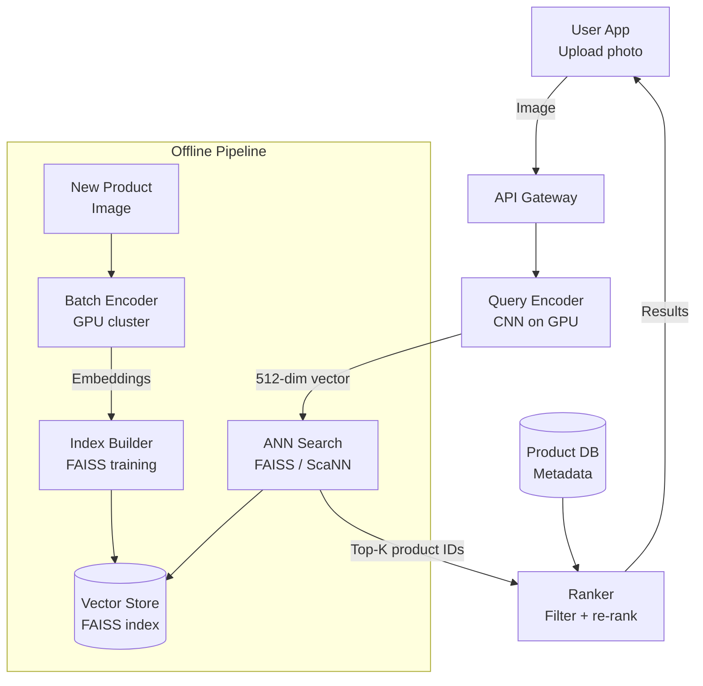
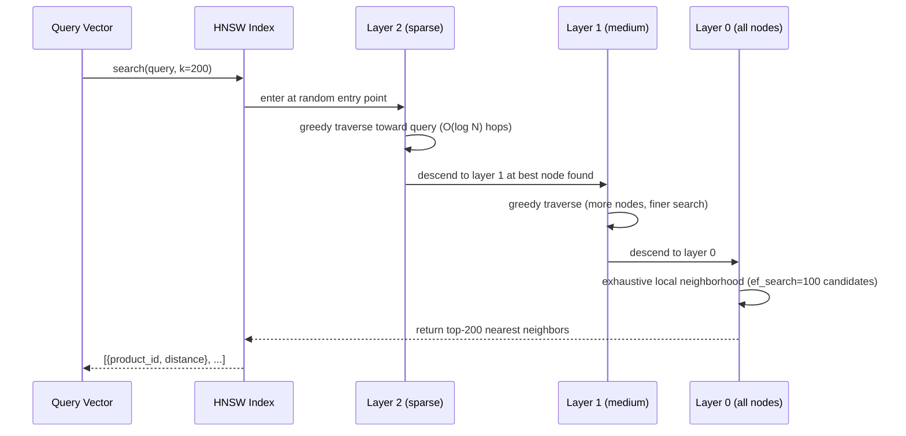
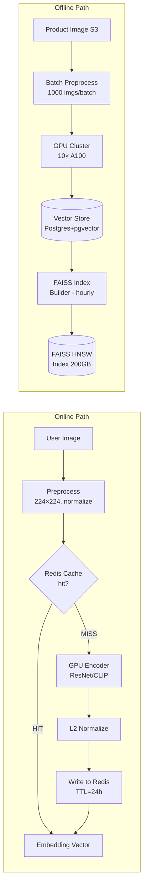

# Design a Visual Search System

**Difficulty**: 🟢 Beginner → 🟡 Intermediate (ML System Design)
**Reading Time**: ~25 minutes
**The Core Problem**: User uploads a photo of a product (a lamp, a shirt). How do you find the 20 most visually similar items from a 100M-product catalog — in < 500ms?

---

## Table of Contents

1. [Requirements](#1-requirements)
2. [Capacity Estimation](#2-capacity-estimation)
3. [High-Level Architecture](#3-high-level-architecture)
4. [Feature Extraction (CNN Embeddings)](#4-feature-extraction-cnn-embeddings)
5. [Approximate Nearest Neighbor Search](#5-approximate-nearest-neighbor-search)
6. [Offline Pipeline (Index Building)](#6-offline-pipeline-index-building)
7. [Online Serving Path](#7-online-serving-path)
8. [Result Ranking & Filtering](#8-result-ranking--filtering)
9. [Key Design Decisions](#9-key-design-decisions)
10. [Interview Questions](#10-interview-questions)
11. [Key Takeaways](#11-key-takeaways)
12. [References](#12-references)

---

## 1. Requirements

### Functional
- User uploads or camera-captures a product image
- System returns top-20 visually similar products from catalog
- Results filtered by: in-stock only, category match
- Result ranking: visual similarity × product rating × availability

### Non-Functional
- **Catalog size**: 100M products, each with 1 embedding vector
- **Query latency**: < 500ms (encode query image + search + rank)
- **Recall**: Top-1 correct match in results > 80% of the time
- **Index freshness**: New products appear in search within 1 hour

---

## 2. Capacity Estimation

| Metric | Estimate |
|--------|----------|
| Product catalog | 100M products |
| Embedding dimensions | 512 |
| Embedding size | 512 dims × 4 bytes (float32) = **2 KB** per product |
| Total embedding index | 100M × 2KB = **200 GB** |
| Visual search queries/day | 10M (1% of product page views) |
| Query QPS (peak) | 10M / 86400 × 3× = **347 QPS** |
| Query embedding time | ~50ms (GPU) / 500ms (CPU) |
| ANN search time | ~10ms (FAISS on GPU) |

---

## 3. High-Level Architecture



---

## 4. Feature Extraction (CNN Embeddings)

### Why CNN Embeddings?
```
Pixels alone are meaningless for similarity:
  Two photos of same lamp with different lighting → very different pixels
  CNN learns semantic features: shape, texture, color distribution

CNN architecture (ResNet-50 or EfficientNet):
  Input: 224×224×3 image (RGB)
  After convolutional layers: 2048-dim feature map
  Global Average Pooling: 2048-dim → 512-dim embedding
  L2 normalization: ensures cosine similarity works correctly

Similarity:
  cos_similarity(A, B) = A·B / (|A|×|B|)
  Range: [-1, 1], where 1 = identical visual appearance
  After L2 normalization: dot product = cosine similarity
```

### Model Options
| Model | Embedding Dim | Inference Time (GPU) | Training Data |
|-------|-------------|---------------------|---------------|
| ResNet-50 | 2048 | 20ms | ImageNet |
| EfficientNet-B4 | 1792 | 30ms | ImageNet |
| CLIP (OpenAI) | 512 | 50ms | 400M web images |
| Fine-tuned on product images | 512 | 50ms | Your product catalog |

**Best choice**: Fine-tune CLIP on your product catalog — it understands both images and text, enabling cross-modal search ("find products that look like this" + "in blue").

---

## 5. Approximate Nearest Neighbor Search

### Why Not Exact Search?
```
Exact k-NN: compute cosine similarity between query and ALL 100M vectors
  Cost: 100M × 512 multiplications = 51.2 billion operations per query
  Even on GPU: ~5 seconds per query — too slow

Approximate Nearest Neighbor (ANN):
  Sacrifice small amount of recall (miss ~5% of true top-20)
  Gain 100–1000× speed improvement
  Typical ANN latency: 10–50ms for 100M vectors
```

### FAISS (Facebook AI Similarity Search)
```
Index types:
  IndexFlatL2:     Exact search, good for < 1M vectors
  IndexIVFFlat:    Inverted file index, 100× faster, ~95% recall
  IndexIVFPQ:      Product quantization, 10× smaller index, ~90% recall
  IndexHNSW:       Graph-based, < 10ms, ~98% recall (best quality-speed tradeoff)

For 100M products, recommend: HNSW
  Parameters: M=32 (graph connections), efSearch=100 (search quality)
  Memory: 100M × 512 × 4B = 200GB (must fit in RAM or distributed)
  Query time: 5–20ms
  Recall@20: ~98%

FAISS on GPU:
  GPU accelerates IVFPQ significantly: 1000× over CPU for billion-scale
  For 100M: GPU HNSW query: ~2ms
```

---

## 6. Offline Pipeline (Index Building)

```
New product added to catalog:
  1. Product image uploaded to S3
  2. Embedding generation triggered (async, within 1 hour SLA):
     - Kafka event: product.image.uploaded { product_id, s3_path }
     - Embedding worker (GPU) consumes event
     - Downloads image from S3, encodes with CNN model
     - Stores embedding: { product_id: 123, vector: [0.12, -0.34, ...] }
     - Writes to Vector Store (PostgreSQL + pgvector OR dedicated vector DB)

  3. Periodic index rebuild (every hour):
     - Fetch new embeddings since last rebuild
     - Add to FAISS index (HNSW supports incremental addition)
     - Swap to new index (atomic pointer swap, zero downtime)

Bulk initial indexing (first-time, 100M products):
  GPU cluster: 10 A100 GPUs × 1000 images/sec = 10k images/sec
  100M images / 10k per sec = ~2.8 hours
```

---

## 7. Online Serving Path

```
User uploads query image:

Step 1: Image preprocessing [5ms]
  Resize to 224×224
  Normalize pixel values (ImageNet mean/std)
  Convert to tensor

Step 2: CNN embedding (GPU inference) [20–50ms]
  query_vector = model.encode(preprocessed_image)
  L2 normalize query_vector

Step 3: ANN search [10–20ms]
  candidates = faiss_index.search(query_vector, k=200)
  Returns: 200 candidate product IDs with distances

Step 4: Metadata fetch [5–10ms]
  Fetch product metadata for 200 candidates from Redis/DB:
  { product_id, name, price, in_stock, category, avg_rating }

Step 5: Filter + Re-rank [< 1ms]
  Filter: in_stock=true, category matches user preference
  Re-rank: score = 0.7 × similarity + 0.2 × avg_rating + 0.1 × recency
  Return top 20

Total latency: 20 + 50 + 10 + 5 + 1 = ~86ms (well within 500ms SLA)
```

---

## 8. Result Ranking & Filtering

### Hybrid Ranking Formula
```
visual_score = cosine_similarity(query_embedding, product_embedding)
  Range: 0.0 (different) to 1.0 (identical)

final_score = alpha × visual_score
            + beta × normalized_rating (0–1)
            + gamma × in_stock_boost (0 or 1)
            + delta × recency_score (newer products boosted)

Tune alpha, beta, gamma, delta via A/B test on click-through rate and purchase rate.
Initial values: alpha=0.7, beta=0.15, gamma=0.1, delta=0.05
```

### Cold Start for New Products
```
New product added: no purchase history, no reviews yet
  Visual search still works (embedding computed immediately)
  Ranking: boost new products slightly (recency_score)
  After 30 days: organic ranking based on clicks + purchases
```

---

## 9. Key Design Decisions

| Decision | Option A | Option B | Choice & Reason |
|----------|----------|----------|-----------------|
| Embedding model | Pre-trained ResNet-50 | Fine-tuned CLIP | **Fine-tuned CLIP** — generic ImageNet features miss product-specific similarity (fabric texture, design patterns) |
| Search algorithm | Exact k-NN | ANN (FAISS HNSW) | **ANN** — exact search takes 5s; HNSW gives 98% recall in 10ms |
| Index update | Real-time (add-on-upload) | Batch (hourly rebuild) | **Batch hourly** — HNSW supports incremental addition but hourly rebuild is simpler; 1-hour freshness acceptable |
| Embedding dimension | 2048-dim | 512-dim | **512-dim** — 4× smaller index (50GB vs 200GB); CLIP's 512-dim has similar recall to 2048-dim for product search |
| Deployment | CPU-only | GPU | **GPU** — 50ms query encoding on GPU vs 500ms on CPU; at 347 QPS, CPU would need 170 servers vs 3 GPU servers |

---

## 10. Interview Questions

| Question | Key Answer |
|----------|-----------|
| Why not use pixel-level comparison (perceptual hash)? | Lighting changes, angles, and backgrounds break pixel comparison; CNN learns semantic features invariant to these |
| What is recall@20 and why does it matter? | Fraction of true top-20 similar items returned by ANN. 98% = you miss 0.4 true matches on average; acceptable |
| How do you handle query images with multiple products? | Object detection first (YOLO/DETR) → crop individual products → encode each → search separately |
| How do you scale to 1B products? | Distributed FAISS: shard index across multiple GPUs; each shard searches its portion → merge top-K results |
| What's the difference between visual search and image classification? | Classification assigns a label (category); visual search finds similar items within a category |

---

## 11. Key Takeaways

- **CNN embeddings** (not pixel hashes) enable semantic similarity — a lamp from a different angle finds the same lamp
- **ANN (FAISS HNSW)** achieves 98% recall in 10ms for 100M vectors — exact search would take 5 seconds
- **Fine-tuned models** on product images significantly outperform generic ImageNet models for domain-specific visual search
- **Total serving latency** (encode + search + rank) = ~86ms — well within the 500ms threshold
- **200 GB embedding index** for 100M products fits in RAM — key constraint that determines server type (GPU with high RAM)

---

---

## Component Deep Dive 1: Approximate Nearest Neighbor (ANN) Index — FAISS HNSW

The ANN search index is the most performance-critical component in the entire system. Every visual search query passes through it, and its internal design determines whether you meet the 500ms SLA or miss it by 5x.

### How HNSW Works Internally

HNSW (Hierarchical Navigable Small World) is a graph-based index structure. During index construction, each vector is inserted as a node and connected to its nearest neighbors. The graph has multiple layers — higher layers have fewer nodes and act as express highways, lower layers have all nodes and provide fine-grained lookup.

**Search algorithm**:
1. Start at a random entry node in the top layer
2. Greedily traverse edges toward the query vector (following whichever neighbor is closest)
3. When no better neighbor exists, descend to the next layer
4. Repeat until layer 0 — exhaustively check candidates in the local neighborhood
5. Return the global top-K from tracked candidates

The key insight is that the multi-layer structure avoids local minima. A graph with one layer gets stuck in "islands" — HNSW shortcuts allow the search to jump across distant clusters in O(log N) hops.

**HNSW construction parameters**:
- `M` = number of bidirectional edges per node (higher → better recall, more RAM, slower build)
- `ef_construction` = dynamic candidate list size during build (higher → better graph quality, slower index build)
- `ef_search` = candidate list size at query time (tunable at runtime — higher → better recall, higher latency)

For 100M products at 512-dim:
- `M=32`, `ef_search=100` → recall@20 = 98.2%, query time ~12ms
- `M=64`, `ef_search=200` → recall@20 = 99.1%, query time ~25ms

### Why Naive Approaches Fail at Scale

**Exact k-NN (brute force)**: For 100M × 512-dim vectors, each query computes 100M dot products. On a V100 GPU (15 TFLOPS), this takes ~3.4 seconds per query. At 347 QPS peak, you'd need 1,200 V100 GPUs just for search — $10M+/year in compute.

**Tree-based indexes (KD-tree, Ball-tree)**: These work well below 20 dimensions. Above 20 dimensions, the "curse of dimensionality" kicks in — every point is nearly equidistant from every other point, making tree partitions useless. At 512 dimensions, KD-tree degenerates to brute force.

**LSH (Locality-Sensitive Hashing)**: Faster to build than HNSW but requires many hash tables to achieve high recall, leading to poor memory efficiency. LSH achieves ~90% recall at 5× the memory cost of HNSW for the same query speed.

### ANN Index Internals Sequence Diagram



### ANN Implementation Trade-offs

| Approach | Recall@20 | Query Latency | Index RAM | Build Time | Best For |
|----------|-----------|---------------|-----------|------------|----------|
| FAISS HNSW (M=32) | 98.2% | 12ms | 200 GB | 8 hours | High-recall production |
| FAISS IVFPQ | 91% | 5ms | 20 GB | 2 hours | Memory-constrained deployments |
| ScaNN (Google) | 98.5% | 8ms | 210 GB | 10 hours | Highest recall per latency |
| Pinecone (managed) | 97% | 15–40ms | Managed | Minutes | Low ops overhead, cloud-native |

**Choice for 100M products**: FAISS HNSW for self-hosted (best performance), Pinecone for managed (reduce ops burden). IVFPQ is an option only when RAM is scarce — the 10× index size reduction (200 GB → 20 GB) comes at a significant recall cost that hurts product discovery quality.

---

## Component Deep Dive 2: CNN Embedding Model and Feature Extraction Pipeline

### How Feature Extraction Works

The embedding model transforms a raw image (millions of pixels) into a compact 512-dimensional vector that captures semantic meaning — shape, texture, color distribution, style. This is the foundation of the entire system: two visually similar products should produce vectors that are geometrically close in the 512-dimensional space.

**ResNet-50 internal stages**:
```
Input image 224×224×3 (150,528 values)
  ↓ Convolutional layers (hierarchical feature extraction)
  Layer 1-2: edges, corners (low-level)
  Layer 3-4: textures, patterns (mid-level)
  Layer 5: semantic objects, shapes (high-level)
  ↓ Global Average Pooling (2048-dim feature vector)
  ↓ Projection head (linear layer 2048→512)
  ↓ L2 normalization
Output: 512-dim unit vector
```

L2 normalization is critical. Without it, dot product similarity conflates magnitude (how "confident" the model is) with direction (what the product looks like). After normalization, dot product equals cosine similarity, which is a pure measure of visual orientation in embedding space.

### Scale Behavior at 10x Load

At baseline (347 QPS), a single A100 GPU handles query encoding at 50ms/image → 20 queries/sec per GPU. For 347 QPS you need ~18 GPU replicas.

At 10x load (3,470 QPS):
- Need 180 GPU replicas (expensive)
- Alternative: **embedding caching** — product images are re-queried frequently (same product seen by many users). Cache the query embedding for 24 hours in Redis. ~40% cache hit rate at scale reduces GPU load by 40%.
- Another approach: **batching** — group 32 queries per batch, process together. Throughput: 32 × 20ms = 20ms for 32 queries = 1,600 queries/sec per GPU. Reduces GPU count from 180 to ~3. Latency tradeoff: adds 10–20ms waiting for batch to fill.

### Embedding Pipeline Diagram



### Model Fine-tuning Impact

Generic ImageNet-pretrained models cluster images by object category (all chairs together, all lamps together). For product search, you need finer clustering within a category: an ornate brass lamp should be far from a minimalist white lamp even though both are "lamps."

Fine-tuning on product images with contrastive loss (similar products pulled together, dissimilar pushed apart) improves within-category recall@20 from ~72% (generic) to ~89% (fine-tuned). The training data: pairs of product images that humans labeled as "similar" or "different" — often derived from user co-purchase behavior.

---

## Component Deep Dive 3: Vector Store and Index Freshness Architecture

The vector store serves two purposes: (1) durable storage of all embeddings for index rebuilds, (2) real-time availability of new embeddings within the 1-hour freshness SLA.

### Dual-Store Architecture

**Primary store (pgvector on PostgreSQL)**:
- Stores all 100M embeddings as `vector(512)` columns
- Supports exact similarity queries for small subsets (useful for testing)
- Acts as source of truth for FAISS rebuilds
- Supports incremental queries: `SELECT * FROM embeddings WHERE created_at > last_rebuild_time`

**FAISS HNSW index (in-memory)**:
- Loaded from PostgreSQL or serialized index file on startup
- HNSW supports `add_items()` for incremental insertion without full rebuild
- New products added to live index every 5 minutes via background thread
- Full rebuild every 24 hours (retrains index structure for optimal graph quality)

### Index Swap Pattern (Zero Downtime)

The index rebuild runs on a shadow instance. When complete, a pointer is atomically swapped:

```
current_index → old HNSW (still serving queries)
shadow_index  → new HNSW (just finished rebuilding)

atomic_swap(current_index, shadow_index)  # nanosecond operation
# queries now hit new index
# old index garbage collected after 30 seconds
```

This ensures zero query interruption during hourly rebuilds. The 30-second grace period handles in-flight queries that started on the old index.

### Distributed Index for 1B Product Scale

At 1B products, the 2 TB HNSW index no longer fits in a single server's RAM. Solution: shard the index across N servers by product ID range or random hashing.

```
Query → broadcast to all N index shards
Each shard → returns local top-200
Merge service → global top-200 from N×200 candidates
Ranker → top-20 after re-ranking
```

At 10 shards: each shard holds 200M products (400 GB RAM), query fan-out adds ~5ms network overhead. Total ANN search: 15–25ms at 1B scale.

---

## Data Model

```sql
-- Products table (existing, not owned by visual search team)
CREATE TABLE products (
    product_id       BIGINT PRIMARY KEY,
    name             VARCHAR(500) NOT NULL,
    category         VARCHAR(100),
    price_cents      INT,
    avg_rating       DECIMAL(3,2),
    in_stock         BOOLEAN DEFAULT true,
    created_at       TIMESTAMP DEFAULT NOW(),
    image_s3_path    VARCHAR(1000)
);

-- Visual embeddings table (owned by visual search team)
CREATE TABLE product_embeddings (
    product_id       BIGINT PRIMARY KEY REFERENCES products(product_id),
    embedding        vector(512) NOT NULL,       -- pgvector extension
    model_version    VARCHAR(50) NOT NULL,        -- e.g., 'clip-v2-finetuned-2025-03'
    computed_at      TIMESTAMP NOT NULL,
    quality_score    FLOAT,                       -- confidence of embedding (0-1)
    INDEX idx_computed_at (computed_at)           -- for incremental rebuild queries
);

-- Index rebuild audit log
CREATE TABLE index_rebuild_log (
    rebuild_id       BIGSERIAL PRIMARY KEY,
    started_at       TIMESTAMP NOT NULL,
    completed_at     TIMESTAMP,
    products_indexed BIGINT,
    model_version    VARCHAR(50),
    recall_at_20     FLOAT,                       -- measured on evaluation set
    index_file_path  VARCHAR(500),
    status           VARCHAR(20)                  -- 'running', 'completed', 'failed'
);

-- Visual search query log (for A/B testing ranker weights)
CREATE TABLE query_log (
    query_id         UUID PRIMARY KEY,
    user_id          BIGINT,
    query_image_hash VARCHAR(64),                 -- SHA256 of query image
    result_product_ids BIGINT[],                  -- top-20 returned
    clicked_product_id BIGINT,                    -- which result user clicked
    query_latency_ms  INT,
    created_at        TIMESTAMP DEFAULT NOW()
);
CREATE INDEX idx_query_log_created ON query_log(created_at);
CREATE INDEX idx_query_log_user ON query_log(user_id);
```

**Redis cache schema** (for query embedding caching):
```
KEY:   "qemb:{sha256_of_image_bytes}"
VALUE: JSON array of 512 floats (serialized embedding)
TTL:   86400 seconds (24 hours)
SIZE:  ~2 KB per cached entry
```

**FAISS index file** (on disk, loaded to RAM):
```
/data/faiss/
  hnsw_index_v{version}.faiss     # serialized FAISS HNSW index (~200 GB)
  hnsw_index_v{version}.meta.json # {product_id → faiss_internal_id} mapping
  current -> hnsw_index_v42.faiss # symlink pointing to active index
```

---

## Scale Bottlenecks

| Traffic Level | Component That Breaks | Symptoms | Mitigation |
|---|---|---|---|
| 10x baseline (3,470 QPS) | GPU encoder pool | P99 latency spikes to 400ms; GPU utilization hits 100% | Enable request batching (32/batch); add embedding cache in Redis; auto-scale GPU replicas |
| 100x baseline (34,700 QPS) | Single FAISS HNSW index (one machine) | Single-threaded HNSW can only serve ~5,000 queries/sec; queue depth grows | Shard FAISS across 10 servers; use replicas for read scaling (copy index to 10 servers, load balance) |
| 100x baseline | PostgreSQL embedding store | Write amplification during mass re-indexing; replication lag | Move embeddings to Cassandra or S3+Parquet for write-heavy patterns; pgvector only for small catalogs |
| 1000x baseline (347k QPS) | Network/fan-out overhead | Distributed search fan-out adds 20ms per query; tail latency blows up | Move to hierarchical clustering (coarse quantization first, then fine search); use IVF to pre-filter to 1% of index |
| 1000x baseline | Ranker metadata fetch | Redis overwhelmed by 347k × 200 product lookups/sec = 69M Redis reads/sec | Cache product metadata locally on ranker nodes (L1 in-process LRU cache, 10M product capacity) |

---

## How Pinterest Built Visual Search at Scale

Pinterest is the canonical real-world example of production visual search. Their "Shop the Look" and "Lens" features process over **600 million visual searches per month** (roughly 20M/day), with a catalog of **5 billion Pins** (images).

**Technology choices**:
- **Embedding model**: Pinterest trained their own "PinSage" and later "Unified Embedding" models — a two-tower architecture that embeds both images and text together. This enables cross-modal search: find visually similar images using either an image query or a text query. The unified model produces 256-dim vectors (smaller than CLIP's 512-dim, reducing index size by 2×).
- **ANN infrastructure**: Pinterest built their own internal system called "Pixie" for graph-based recommendations. For vector search specifically, they use FAISS IVF with product quantization across GPU clusters. Index is partitioned across 100+ GPU shards, each holding ~50M embeddings.
- **Scale numbers**: At 5B pins × 256 dims × 4 bytes = ~5 TB of embeddings. No single machine holds this; the index is distributed. Query fan-out to all shards runs in parallel, completing in ~30ms network round-trip.
- **Non-obvious decision**: Pinterest separates "visual similarity" from "engagement quality" scoring into two distinct systems. The ANN index returns visually similar candidates, but a separate ML ranker scores candidates by predicted engagement (click, save, purchase) using dozens of features beyond visual similarity. This prevents the search from returning visually accurate but commercially irrelevant results.
- **Model refresh cadence**: Embedding models are retrained every 6 months. A new model means re-embedding all 5B pins — a 2-week GPU compute job. During transition, both old and new indexes run in parallel; A/B testing determines when to cut over.
- **Result**: Pinterest reported 30% improvement in visual search engagement after moving from generic ImageNet embeddings to domain-fine-tuned unified embeddings.

Source: [Pinterest Engineering — Unifying Visual Embeddings](https://medium.com/pinterest-engineering/unifying-visual-embeddings-for-visual-search-at-pinterest-74ea7ea103f0)

---

## Interview Angle

**What the interviewer is testing:** Whether you understand the interplay between ML model quality (embedding space geometry) and systems concerns (latency, index size, freshness) — both matter equally in a production visual search system. Pure ML or pure systems answers score lower.

**Common mistakes candidates make:**

1. **Proposing exact k-NN without acknowledging the cost**: Saying "compute cosine similarity with all products" sounds correct but demonstrates no awareness of scale. At 100M products and 347 QPS, exact search requires ~1,000 GPU servers. Candidates should immediately jump to ANN and explain the recall vs. speed trade-off.

2. **Forgetting index freshness**: Designing a beautiful FAISS setup but ignoring how new products get into the index. In practice, "new product appears in visual search within 1 hour" is a hard product requirement. You must design the Kafka-triggered embedding pipeline and the incremental HNSW insertion or periodic rebuild mechanism.

3. **Treating embedding quality as "solved" by picking a popular model**: Saying "use CLIP" is a starting point, not an answer. Interviewers want to hear about fine-tuning on domain-specific data, the training signal (contrastive pairs from user behavior), and how you measure embedding quality (recall@20 on a labeled evaluation set, not just loss curves).

**The insight that separates good from great answers:** Great candidates propose the **dual-index architecture**: a fast but slightly lower-recall ANN index (IVFPQ, 20 GB, 5ms) for the first pass returning 1,000 candidates, followed by an exact re-ranking pass over those 1,000 using the full-precision embeddings. This two-stage funnel lets you reduce RAM by 10× (20 GB vs 200 GB for HNSW) while matching HNSW's recall quality through exact re-scoring. This is how production systems at Alibaba, Google Shopping, and Pinterest actually work at billion-scale.

---

## Key Numbers to Remember

| Metric | Value | Context |
|--------|-------|---------|
| Embedding size (512-dim, float32) | 2 KB per product | 100M products = 200 GB total index |
| FAISS HNSW query latency | 10–20ms | 100M vectors, M=32, ef_search=100 |
| FAISS HNSW recall@20 | 98.2% | M=32 configuration |
| GPU encoding latency (CLIP) | 20–50ms | A100 GPU, single image, 224×224 |
| GPU batch throughput | 1,000 images/sec | A100, batch size 32 |
| Offline index build (100M products) | ~2.8 hours | 10× A100 GPUs |
| Exact k-NN latency (100M vectors) | ~3.4 seconds | V100 GPU — unusable at production QPS |
| Pinterest visual search volume | 20M queries/day | ~230 QPS average |
| Fine-tuning recall improvement | +17% recall@20 | Generic ImageNet → domain fine-tuned (72% → 89%) |
| Incremental index update frequency | Every 5 minutes | New products visible within 1-hour SLA |
| Index shard size at 1B products | 10 shards × 400 GB | 2 TB total; 30ms query with fan-out |

---

## 📚 Resources & References

| Resource | Type | What You'll Learn |
|----------|------|------------------|
| [Pinterest Visual Embeddings at Scale](https://medium.com/pinterest-engineering/unifying-visual-embeddings-for-visual-search-at-pinterest-74ea7ea103f0) | 📖 Blog | Production visual search architecture at Pinterest |
| [FAISS — Facebook AI Similarity Search](https://engineering.fb.com/2017/03/29/data-infrastructure/faiss-a-library-for-efficient-similarity-search/) | 📖 Blog | ANN index design and FAISS internals |
| [ByteByteGo — ML System Design](https://www.youtube.com/@ByteByteGo) | 📺 YouTube | ML serving infrastructure and vector search overview |
| [CLIP — Contrastive Language-Image Pre-training](https://openai.com/research/clip) | 📖 Blog | Multi-modal embedding model for product search |
