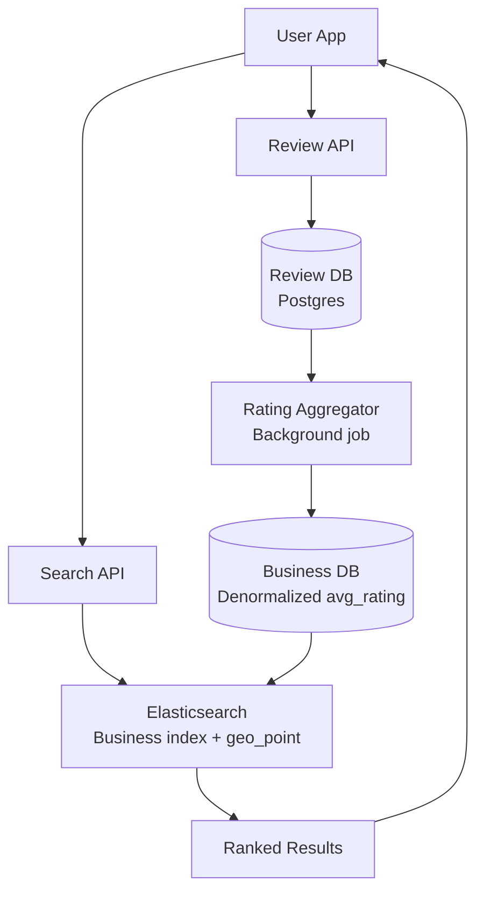
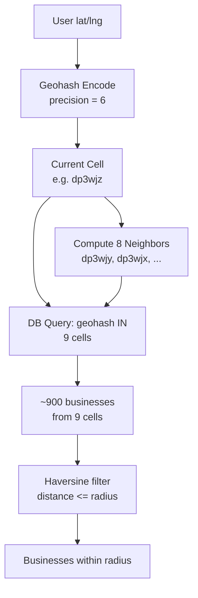
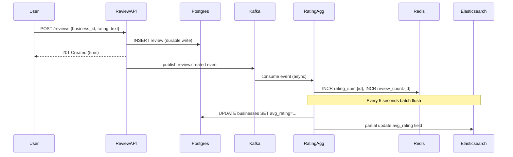
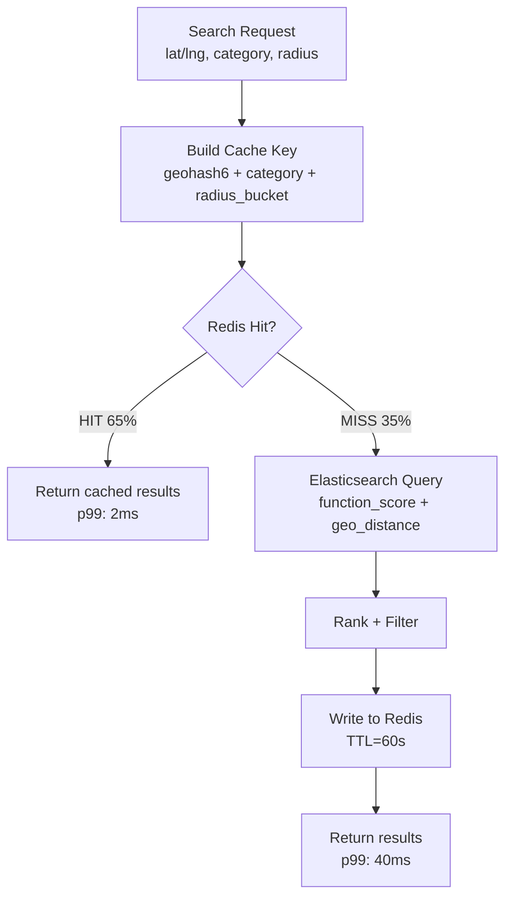
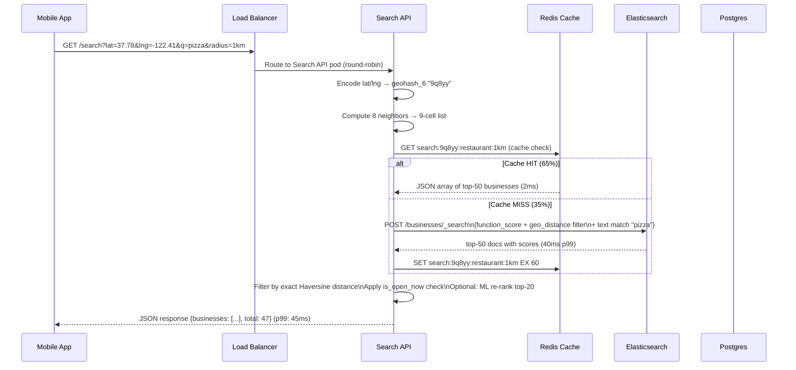

# Design Yelp — Location-Based Business Search

**Difficulty**: 🟡 Intermediate
**Reading Time**: Coming Soon
**Interview Frequency**: High

---

> 🚧 **Full article coming soon.** This stub gives you the essentials to start thinking about this problem.

---

## The Core Problem

Finding businesses near a location with filtering (cuisine, rating, price range) under 100ms requires an index structure that can efficiently query "all pizza restaurants within 2km of this lat/lng with rating > 4.0." A naive full-table scan across 100 million businesses takes seconds; a spatial index reduces this to milliseconds.

## Functional Requirements

- Search businesses by keyword near a geographic location
- Filter by category, rating, price range, hours
- View business details, photos, and reviews
- Add and read reviews with ratings
- "Near me" search using device location

## Non-Functional Requirements

| Requirement | Target |
|-------------|--------|
| Search latency | p99 < 100ms |
| Availability | 99.9% (8.7 hrs/year) |
| Scale | 100M businesses, 100M users, 10M searches/day |
| Review freshness | New reviews visible within 5 seconds |

## Back-of-Envelope Estimates

- **Search rate**: 10M searches/day ÷ 86,400 = ~116 searches/sec (peak 10x = 1,160/sec)
- **Businesses per geohash cell**: 100M businesses across Earth ÷ 1M geohash-6 cells = 100 businesses/cell avg (fast to scan)
- **Review storage**: 100M businesses × 50 reviews avg × 500 bytes = 2.5TB review corpus

## Key Design Decisions

1. **Geohash for Proximity Indexing** — encode lat/lng into a string prefix (e.g., geohash-6 = ~1.2km precision); index businesses by geohash; nearby search = query current cell + 8 neighbors (9 cells); all cells for a given precision have equal area.
2. **Quadtree as Alternative** — adaptive spatial subdivision; dense urban areas get more subdivisions than rural areas; better for uneven business density; used by Uber for driver locations; geohash is simpler and works well for static business data.
3. **Elasticsearch for Full-Text + Geo Hybrid** — business name/description in inverted index; location as geo_point field; Elasticsearch's `geo_distance` filter works alongside keyword filters; enables "italian restaurants within 2km" in a single query.

## High-Level Architecture



## Top Interview Questions for This Problem

| Question | Tests |
|----------|-------|
| What's the difference between geohash and quadtree? When would you choose each? | Spatial indexing trade-offs |
| How do you handle a search for "restaurants near me" when the user is at a geohash cell boundary? | Neighbor cells, border cases |
| How would you rank search results — what signals matter beyond proximity? | Relevance ranking, rating, recency |

## Related Concepts

- [Google Maps for routing and navigation on top of geospatial data](./google-maps)
- [Uber Backend for real-time geo-indexing of moving objects](../04-reservation-scheduling/uber-backend)

---

## Component Deep Dive 1: Geospatial Indexing — Geohash vs Quadtree

The spatial index is the single most critical component of a proximity search system. Without it, every "find businesses near me" query would require scanning all 100M businesses, computing Haversine distances, and filtering — a full table scan that takes 30-60 seconds at scale, not 30-60 milliseconds.

**How Geohash Works Internally**

Geohash divides the world into a grid using a Z-order (Morton) space-filling curve. The algorithm alternates between subdividing longitude and latitude bits. A geohash-6 string like `dp3wjz` represents a rectangular cell of approximately 1.2km × 0.6km. The key property: two strings that share a common prefix are always near each other geographically. This prefix property makes geohash indexable with a standard B-tree — a prefix query (`WHERE geohash LIKE 'dp3wj%'`) returns all businesses in that cell and its children.

For a proximity search, you compute the geohash of the user's location at the desired precision (e.g., precision 6 for ~1km radius), then query the current cell and its 8 neighbors. This 9-cell query returns a superset of businesses within the radius; you then filter by exact Haversine distance client-side or in the application layer.

**Why Naive Approaches Fail**

A naive `WHERE ST_Distance(location, user_point) < 1000 METERS` on a Postgres table with a standard B-tree index is useless — B-trees cannot efficiently answer 2D range queries. A sequential scan over 100M rows computing floating-point distance is ~30s. Even a PostGIS GiST index degrades: at 1,160 searches/sec peak load, GiST scans contend on the same index pages for hot metropolitan areas (San Francisco, NYC), creating hot-spot lock contention.

**Geohash vs Quadtree Trade-offs**



| Approach | Latency | Throughput | Trade-off |
|----------|---------|------------|-----------|
| Geohash + B-tree (Postgres) | p50: 5ms, p99: 25ms | ~5,000 QPS per shard | Fixed cell sizes; boundary mismatch at edges; simple to implement |
| Quadtree (in-memory) | p50: 1ms, p99: 8ms | ~50,000 QPS per node | Adaptive density; higher memory (3–8GB for 100M points); complex rebalancing on updates |
| Elasticsearch geo_distance | p50: 8ms, p99: 40ms | ~3,000 QPS per node | Full-text + geo in one query; higher memory/JVM overhead; easier operationally |

**The boundary problem**: a user standing exactly at the edge of a geohash cell may be closer to businesses in adjacent cells than to businesses in their own cell. The 9-neighbor query solves this completely — but only if you use the same precision for indexing and querying. Mixing precision-6 search with precision-7 storage creates gaps.

---

## Component Deep Dive 2: Review Ingestion and Rating Aggregation

Reviews are the second most critical component — they drive the ranking signal (avg_rating) that determines which businesses appear first. The challenge is that reviews arrive as a write-heavy stream (users submitting after dining out in the evening), but the rating needs to be nearly real-time in search results.

**Internal Mechanics**

When a user submits a review, the write path is:
1. Review API validates the review (user must have visited the business, content moderation, dedup check)
2. Write to `reviews` table in Postgres (primary write, durable)
3. Publish a `review.created` event to Kafka with `{business_id, rating, user_id, timestamp}`
4. Rating Aggregator service consumes the Kafka topic, updates a Redis counter: `INCR review_count:{business_id}` and `INCR rating_sum:{business_id}` by the rating value
5. Background job (every 5 seconds) reads from Redis, computes `avg_rating = rating_sum / review_count`, writes back to the `businesses` table, and triggers an Elasticsearch partial update for the document's `avg_rating` field

This decoupled pipeline means a single review write returns in ~5ms (Postgres write) while the rating update propagates to search results within 5 seconds via the async pipeline.

**Behavior at 10x Load**

At baseline (100 reviews/sec), the Kafka consumer processes comfortably. At 10x (1,000 reviews/sec during a viral event or a holiday weekend), the bottleneck moves to the Elasticsearch partial update pipeline. Each partial update locks the Elasticsearch document for ~2ms. With 1,000 unique businesses receiving reviews per second, you need 20 Elasticsearch data nodes to handle the update throughput without write queue buildup. The Redis aggregation layer absorbs spikes cleanly — Redis handles 500k ops/sec on a single node.



---

## Component Deep Dive 3: Search Result Ranking

Proximity alone produces poor results — the nearest business is not always the best business. A ranking layer combines distance, relevance, and quality signals into a single score.

**Specific Technical Decisions**

Elasticsearch's `function_score` query is the standard tool here. You start with a BM25 relevance score from the text query ("pizza near union square"), then apply multiplicative boosts:

1. **Distance decay**: Gaussian decay function centered on the user's location, half-life at 500m. A business 2km away scores 0.4× the distance factor of one at 100m.
2. **Rating boost**: `avg_rating / 5.0` as a linear factor. A 4.5-star business gets 0.9× this factor; a 2-star business gets 0.4×.
3. **Review count log factor**: `log(review_count + 1) / log(1001)`. This compresses the advantage of businesses with 10,000 reviews vs 100 reviews — prevents pure popularity domination.
4. **Business status**: `is_open_now` boolean filter applied before scoring. Closed businesses are excluded by default but available with a filter toggle.

The combined score formula is: `score = bm25_relevance × distance_decay × rating_factor × review_log_factor`. This is computed entirely inside Elasticsearch per shard — no round-trip to application layer for ranking. At 1,160 QPS with an average of 5 shards queried per request, each shard handles 232 score computations/sec, well within Elasticsearch's 10,000 doc/sec scoring capacity per shard.

**Personalization layer** (optional, adds ~20ms): A lightweight ML model re-ranks the top-20 results using user history (past cuisines, price preferences, distance tolerance). Applied as a post-processing step in the Search API before returning results.

---

## Data Model

```sql
-- Businesses table (primary store, Postgres)
CREATE TABLE businesses (
    business_id     UUID            PRIMARY KEY DEFAULT gen_random_uuid(),
    name            VARCHAR(255)    NOT NULL,
    description     TEXT,
    category        VARCHAR(100)    NOT NULL,  -- 'restaurant', 'bar', 'spa', etc.
    subcategory     VARCHAR(100),              -- 'italian', 'sushi', etc.
    lat             DECIMAL(9,6)    NOT NULL,
    lng             DECIMAL(9,6)    NOT NULL,
    geohash_6       CHAR(6)         NOT NULL,  -- index column for proximity search
    geohash_5       CHAR(5)         NOT NULL,  -- coarser grid for ~5km searches
    address_line1   VARCHAR(255),
    city            VARCHAR(100),
    state           CHAR(2),
    zip_code        VARCHAR(10),
    country         CHAR(2)         NOT NULL DEFAULT 'US',
    phone           VARCHAR(20),
    website         VARCHAR(500),
    price_range     SMALLINT        CHECK (price_range BETWEEN 1 AND 4),
    avg_rating      DECIMAL(3,2)    DEFAULT 0.00,
    review_count    INTEGER         DEFAULT 0,
    is_active       BOOLEAN         DEFAULT TRUE,
    created_at      TIMESTAMPTZ     DEFAULT NOW(),
    updated_at      TIMESTAMPTZ     DEFAULT NOW()
);

-- Indexes for proximity + filter queries
CREATE INDEX idx_businesses_geohash6 ON businesses(geohash_6);
CREATE INDEX idx_businesses_geohash5 ON businesses(geohash_5);
CREATE INDEX idx_businesses_category ON businesses(category, subcategory);
CREATE INDEX idx_businesses_rating ON businesses(avg_rating DESC) WHERE is_active = TRUE;

-- Reviews table (Postgres, partitioned by created_at for manageability)
CREATE TABLE reviews (
    review_id       UUID            PRIMARY KEY DEFAULT gen_random_uuid(),
    business_id     UUID            NOT NULL REFERENCES businesses(business_id),
    user_id         UUID            NOT NULL,
    rating          SMALLINT        NOT NULL CHECK (rating BETWEEN 1 AND 5),
    review_text     TEXT,
    photo_urls      TEXT[],
    helpful_count   INTEGER         DEFAULT 0,
    is_visible      BOOLEAN         DEFAULT TRUE,  -- moderation flag
    created_at      TIMESTAMPTZ     DEFAULT NOW(),
    updated_at      TIMESTAMPTZ     DEFAULT NOW()
) PARTITION BY RANGE (created_at);

CREATE INDEX idx_reviews_business ON reviews(business_id, created_at DESC);
CREATE INDEX idx_reviews_user ON reviews(user_id, created_at DESC);

-- Elasticsearch document mapping (JSON)
-- PUT /businesses/_mapping
-- {
--   "properties": {
--     "business_id":   { "type": "keyword" },
--     "name":          { "type": "text", "analyzer": "english" },
--     "description":   { "type": "text", "analyzer": "english" },
--     "category":      { "type": "keyword" },
--     "subcategory":   { "type": "keyword" },
--     "location":      { "type": "geo_point" },
--     "geohash_6":     { "type": "keyword" },
--     "price_range":   { "type": "byte" },
--     "avg_rating":    { "type": "half_float" },
--     "review_count":  { "type": "integer" },
--     "is_active":     { "type": "boolean" },
--     "hours":         {
--       "type": "nested",
--       "properties": {
--         "day_of_week": { "type": "byte" },
--         "open_time":   { "type": "keyword" },
--         "close_time":  { "type": "keyword" }
--       }
--     }
--   }
-- }

-- Business hours (Postgres, denormalized for fast lookup)
CREATE TABLE business_hours (
    business_id     UUID        NOT NULL REFERENCES businesses(business_id),
    day_of_week     SMALLINT    NOT NULL CHECK (day_of_week BETWEEN 0 AND 6),
    open_time       TIME        NOT NULL,
    close_time      TIME        NOT NULL,
    is_closed       BOOLEAN     DEFAULT FALSE,
    PRIMARY KEY (business_id, day_of_week)
);
```

---

## Scale Bottlenecks

| Traffic Level | Component That Breaks | Symptoms | Mitigation |
|---------------|----------------------|----------|------------|
| 10x baseline (11,600 searches/sec) | Elasticsearch heap | GC pauses > 200ms, p99 latency spikes to 500ms | Scale ES cluster from 5 to 15 data nodes; increase shard count from 5 to 15 |
| 10x write (1,000 reviews/sec) | Postgres `businesses` table update | `avg_rating` update row-level lock contention | Move rating aggregation to Redis; batch-flush to Postgres every 5 seconds |
| 100x baseline (116,000 searches/sec) | Search API layer | CPU saturation, connection pool exhaustion | Horizontal scale behind load balancer; add search result cache (Redis, TTL=60s) |
| 100x business updates (e.g., mass onboarding) | Elasticsearch indexing queue | Indexing lag grows, stale data in search | Dedicate indexing nodes separate from query nodes; use bulk indexing API with 500-doc batches |
| 1000x baseline (1.16M searches/sec) | Network / DNS | Single region cannot absorb; inter-DC latency for geo-distributed users | Multi-region deployment (US-East, US-West, EU); GeoDNS routing; replicate Elasticsearch across regions with cross-cluster replication |
| Hot city (10% of traffic to NYC geohash) | Geohash hot-spot on single ES shard | One shard at 100% CPU while others idle | Custom routing: NYC geohash prefix `dr5r` → dedicated shard group; or use ES `routing` field based on geohash prefix |

---

## How Yelp Built This

Yelp's real production system serves approximately **80 million unique monthly visitors** with over **265 million reviews** across **8 million businesses** (as of 2023 public figures from Yelp investor reports). Their search infrastructure has been publicly described in several engineering blog posts.

**Core Technology Choices**

Yelp uses **Elasticsearch** as their primary search engine, as documented in their engineering blog post "Search Architecture at Yelp" (2019). They run a cluster of approximately 100+ Elasticsearch nodes to handle their production query volume. Their index holds not just location and text, but also a rich set of business attributes — Yelp calls these "attributes" (wifi, outdoor seating, dog-friendly) that are faceted in search filters.

**Non-obvious Architectural Decision: Two-Phase Search**

Rather than a single ES query, Yelp's architecture uses a two-phase approach: a **retrieval phase** (fast geo + category filter, returns top-200 candidates) followed by a **ranking phase** (ML model scores the 200 candidates using personalization signals). The ML ranking phase uses a gradient-boosted tree model trained on user click-through data. This separation allows the retrieval index to stay simple and fast while the ranking can incorporate complex signals without slowing down the geo query.

**Specific Numbers from Yelp Engineering**

Yelp's infrastructure handles approximately **50,000 search requests per minute** during peak hours (reported in their 2018 engineering blog). Their review ingestion pipeline processes reviews asynchronously: the review write path returns in under 100ms, but rating recalculation happens in a background job. As of their 2019 blog post, they use **Apache Kafka** for the event streaming backbone between the review write service and the aggregation service.

**Photo Infrastructure**: Yelp stores business photos on Amazon S3 with CloudFront as CDN. Each business averages 15 photos; at 8M businesses, that is approximately 1.2 billion photos, stored at multiple resolutions (thumbnail 100×100, medium 500×375, large 1200×900). Image processing (resizing, format conversion) happens asynchronously after upload using an in-house job queue.

Source: [Yelp Engineering Blog](https://engineeringblog.yelp.com/) — "Elasticsearch at Yelp" and "Scaling Yelp's Data Pipeline" posts.

---

## Interview Angle

**What the interviewer is testing:** The core skill is whether you understand that geospatial queries require specialized index structures (not just SQL WHERE clauses), and whether you can reason through the trade-offs between different spatial indexing approaches under realistic load.

**Common mistakes candidates make:**

1. **Using lat/lng columns with a standard B-tree and WHERE distance < X.** This is a sequential scan in disguise — the database cannot use a B-tree to answer 2D range queries. Candidates who propose this show they have not thought about how indexes actually work. The correct answer names either PostGIS with a GiST index, geohash with a B-tree, or Elasticsearch geo_point.

2. **Forgetting the boundary problem.** Proposing "look up all businesses in the user's geohash cell" misses that a user standing at a cell edge may be 50m from businesses in the adjacent cell but 1.1km from businesses in their own cell. The correct answer is to always query the current cell plus all 8 neighbors (9 cells total), then post-filter by exact distance.

3. **Making reviews synchronously update the avg_rating in the search index.** In the write path for a review, calling Elasticsearch synchronously to update the document adds 30-50ms to the review submission latency and creates a tight coupling between the review service and the search service. Any ES downtime or slowdown blocks review submissions. The correct pattern is async: write review → Postgres, publish event → Kafka, aggregate in background → update ES every few seconds.

**The insight that separates good from great answers:** Great candidates explain that geohash precision is a tunable parameter at query time, not just at index time. For a "1km radius" search you use precision-6; for a "10km radius" search you use precision-5. This means you need to index businesses at both precision levels (two indexed columns), or use Elasticsearch's built-in geohash indexing which stores the hierarchy automatically. This shows deep understanding of how the spatial index interacts with query radius, not just knowing "geohash = good."

---

## Key Numbers to Remember

| Metric | Value | Context |
|--------|-------|---------|
| Geohash-6 cell size | ~1.2km × 0.6km | Precision 6 → good for "within 1km" queries |
| Geohash-5 cell size | ~5km × 5km | Precision 5 → good for "within 5km" queries |
| Neighbor cells to query | 9 (current + 8) | Always query neighbors to handle boundary cases |
| Elasticsearch p99 search latency | ~40ms | Per geo_distance + text query, 100M docs, 15-node cluster |
| Review write latency | ~5ms | Postgres write only; async rating update adds no latency |
| Rating update propagation | ~5 seconds | Via Kafka → Redis → Postgres → ES pipeline |
| Peak search load (Yelp scale) | ~50,000 req/min | ~830 req/sec at 10M searches/day |
| ES cluster size for 100M businesses | 15–20 data nodes | With 3× replication factor for HA |
| Review storage at scale | 2.5TB | 100M businesses × 50 reviews × 500 bytes |
| Photo storage at scale | ~40TB | 1.2B photos at avg 33KB each (compressed) |

---

## Caching Strategy

Proximity search has highly cacheable patterns because popular queries repeat — "coffee near Union Square" is searched thousands of times per day. A two-layer cache strategy reduces Elasticsearch load by 60–80%.

**Layer 1 — Result cache (Redis, TTL = 60 seconds)**

Cache key: `search:{geohash_6}:{category}:{price_range}:{radius_bucket}`. The radius is bucketed into fixed tiers (500m, 1km, 2km, 5km, 10km) rather than exact user-submitted radii. This dramatically increases cache hit rate — a user searching "within 1.3km" and another searching "within 1.8km" both hit the "2km" bucket and get the same cached result, then client-side filtering applies the exact radius.

Cache value: the top-50 results as a JSON array. At 1,000 bytes per result × 50 results = 50KB per cache entry. A 10GB Redis node holds 200,000 distinct search cache entries — enough to cover popular city × category combinations.

Cache hit rate at Yelp scale: ~65% for category + location queries during peak hours (most searches are in major cities where the same geohash cells are queried repeatedly).

**Layer 2 — Business detail cache (Redis, TTL = 5 minutes)**

When a user clicks a search result, they fetch business details (photos, hours, phone number). This data changes infrequently. Cache key: `business:{business_id}`. Cache invalidation: on any business update event (owner updates hours, new photo uploaded), publish `business.updated` to Kafka; cache invalidation consumer deletes `business:{business_id}` from Redis.

**What you must NOT cache:**

- The `is_open_now` field — this changes every hour and varies by timezone. Compute it at query time from `business_hours` + current timestamp in the user's timezone.
- Personalized results — these are user-specific (different top-20 per user after ML re-ranking). Cache the base retrieval result, not the personalized re-ranking.



---

## Content Moderation Pipeline

At 265M reviews, automated moderation is not optional — it is a scaling requirement. Yelp receives approximately 30,000 new reviews per day (at their scale). A manual review team cannot read 30,000 reviews/day.

**Three-stage pipeline:**

1. **Synchronous rule-based filter** (runs in the Review API, adds ~2ms): Check for spam patterns (repeated text, known spam phrases), profanity filter (regex-based), and rate limiting per user (max 3 reviews per business, max 10 reviews per hour).

2. **Asynchronous ML classifier** (runs within 30 seconds of submission): A fine-tuned BERT-class model classifies reviews as: legitimate / suspicious / spam / fake-positive / fake-negative. The model runs on GPU workers consuming the `review.created` Kafka topic. If classified as suspicious or spam, the review's `is_visible` flag is set to FALSE and it enters a human review queue.

3. **Human review queue** (SLA: 24 hours): ~0.5% of reviews (150/day at Yelp scale) require human moderator review. Moderators see the review, business context, and ML confidence scores. They either approve (set `is_visible = TRUE`) or permanently reject.

**Review freshness vs. moderation trade-off**: Yelp shows reviews immediately upon submission (optimistic display) then hides them if the ML classifier flags them within 30 seconds. This gives legitimate reviewers instant gratification while limiting the window for spam to appear publicly.

---

## Business Owner Write Path

Business owners update their business information (hours, description, photos, special offers). This is a low-volume write path (~1,000 updates/hour across 8M businesses) but requires immediate consistency — an owner who updates "closed today for holiday" needs that change reflected in search within seconds, not minutes.

**Immediate propagation requirement:**

Business attribute updates bypass the async Kafka pipeline and go directly to Elasticsearch via a synchronous partial update. The update flow:

1. Owner submits change via Business Owner Portal
2. Business API validates ownership (OAuth token → `business_owners` table)
3. Write to Postgres `businesses` table (durable)
4. Synchronous Elasticsearch partial update (`_update` API) for only the changed fields
5. Invalidate Redis cache for `business:{business_id}`

The sync ES update adds ~30ms to the API response but ensures the change is searchable immediately. Acceptable at 1,000 updates/hour — this does not contend with the 1,160 search QPS path.

**Hours and timezone complexity:**

Business hours are stored in local time (e.g., "open 09:00–22:00 in America/Los_Angeles timezone"). The `is_open_now` computation requires converting the user's request time to the business's local timezone: `is_open = (local_time_at_business >= open_time AND local_time_at_business <= close_time)`. This is computed at query time in the Search API layer, not stored in ES — storing a boolean "is open" would require refreshing all 100M documents every minute as time zones transition.

---

## Geohash Precision Reference

Selecting the right geohash precision for indexing and querying is a common design decision that trips up candidates. This table maps precision level to cell size and the corresponding use case.

| Precision | Cell Width | Cell Height | Approx Area | Use Case |
|-----------|-----------|-------------|-------------|----------|
| 1 | 5,000 km | 5,000 km | 25M km² | Country-level |
| 2 | 1,250 km | 625 km | 781K km² | Region-level |
| 3 | 156 km | 156 km | 24K km² | State/province |
| 4 | 39 km | 20 km | 780 km² | City-level |
| 5 | 4.9 km | 4.9 km | 24 km² | Neighborhood (5km search) |
| 6 | 1.2 km | 0.61 km | 0.73 km² | Street-level (1km search) |
| 7 | 153 m | 153 m | 23K m² | Block-level |
| 8 | 38 m | 19 m | 722 m² | Building-level |

**Rule of thumb for search radius to geohash precision mapping:**

- Radius ≤ 1km → use precision 6 (query 9 cells × 0.73 km² = ~6.6 km² area)
- Radius ≤ 5km → use precision 5 (query 9 cells × 24 km² = ~216 km² area)
- Radius ≤ 20km → use precision 4 (query 9 cells × 780 km² = ~7,020 km² area)

The 9-cell strategy always over-fetches — you get businesses from a larger area than the exact circle. The over-fetch ratio is typically 2–3×, meaning you fetch 200–300 businesses but return the 20–30 that fall within the exact radius after distance filtering. This is intentional: the cost of a loose geo query + distance filter in the application layer is much lower than maintaining a perfect spatial circle index.

---

## Read Path End-to-End Flow

Understanding the full request lifecycle clarifies where latency is spent and where optimizations have the most impact.



**Where the 100ms budget goes:**

| Step | Latency (p50) | Latency (p99) | Notes |
|------|--------------|--------------|-------|
| Network client → LB → API | 5ms | 15ms | CDN edge termination |
| Cache lookup (Redis) | 0.3ms | 2ms | On cache hit, this is nearly free |
| Elasticsearch query | 8ms | 40ms | Only on cache miss |
| Haversine filter (app layer) | 0.1ms | 0.5ms | CPU-bound, ~200 distance calculations |
| is_open_now computation | 0.2ms | 1ms | Timezone lookup + time comparison |
| ML re-rank (optional) | 5ms | 20ms | Skipped for simple queries |
| Serialization + network back | 2ms | 8ms | JSON encoding of 20 result objects |
| **Total (cache hit)** | **~13ms** | **~47ms** | Well within 100ms budget |
| **Total (cache miss)** | **~21ms** | **~85ms** | Within budget but tight |

---

## Failure Modes and Mitigations

**1. Elasticsearch node failure during query**

Symptoms: 50% of geo queries return 503 or partial results. Cause: an ES data node hosting a primary shard goes down before the replica promotes. Promotion takes 30–60 seconds by default.

Mitigation: Set `index.unassigned.node_left.delayed_timeout: 1m` — ES waits 1 minute before triggering shard rebalancing, giving the node time to restart. Keep `number_of_replicas: 2` (not 1) so two nodes can fail simultaneously before any data is unavailable. Configure Search API to retry on 503 with a 10ms backoff to a different ES node.

**2. Redis cache stampede after TTL expiry**

Symptoms: At TTL=60s, all cache entries for a geohash cell expire simultaneously. Thousands of requests hit ES in the same second, causing a latency spike (p99 jumps from 40ms to 200ms for 5–10 seconds).

Mitigation: Add random jitter to TTL: `TTL = 60 + random(0, 30)`. This staggers expiry across 90 seconds instead of all at once. Alternatively, use a probabilistic early expiration: re-compute cache 5 seconds before TTL if the cache is being accessed at >100 req/sec (indicator that the entry is hot).

**3. Geohash cell hot-spot for dense urban areas**

Symptoms: A single Elasticsearch shard handling searches for Manhattan (geohash prefix `dr5r`) runs at 95% CPU while suburban shards run at 10% CPU. Searches for Manhattan take 200ms while suburban searches take 8ms.

Mitigation: ES custom routing — assign Manhattan-prefix geohashes (`dr5r*`) to a dedicated shard group with 3× the node count. This requires upfront capacity planning per city but eliminates the hot-shard problem. Alternative: use Elasticsearch's `adaptive_replica_selection` to route reads to the least-loaded replica automatically.

**4. Review spam attack inflating ratings**

Symptoms: A restaurant suddenly jumps from 3.2 to 4.9 stars overnight due to 500 fake 5-star reviews from recently created accounts.

Mitigation: Multi-signal anomaly detection in the Rating Aggregator: if `review_count` for a single business increases by >50 in a 1-hour window, pause rating recalculation and flag for moderation. Treat new user accounts (<30 days old, 0 prior reviews) with lower trust weight in the rating formula. Yelp's "recommended reviews" algorithm specifically addresses this — only reviews from established accounts with review history are included in the displayed star rating.

---

## API Contract

```
GET /v1/search
  ?lat=37.7749
  &lng=-122.4194
  &q=pizza                   # optional full-text query
  &category=restaurant       # optional category filter
  &subcategory=italian       # optional subcategory
  &radius=1000               # meters, default 1000, max 40000
  &price_range=1,2           # comma-separated, 1=$  2=$$  3=$$$  4=$$$$
  &min_rating=3.5            # float, optional
  &open_now=true             # boolean, default false
  &sort=relevance            # relevance | distance | rating | review_count
  &page=1
  &page_size=20              # max 50

Response:
{
  "total": 47,
  "page": 1,
  "page_size": 20,
  "businesses": [
    {
      "business_id": "uuid",
      "name": "Tony's Pizza Napoletana",
      "category": "restaurant",
      "subcategory": "italian",
      "avg_rating": 4.6,
      "review_count": 3842,
      "price_range": 2,
      "distance_meters": 183,
      "is_open_now": true,
      "address": "1570 Stockton St, San Francisco, CA 94133",
      "thumbnail_url": "https://cdn.yelp.com/biz_photos/abc123/100s/main.jpg",
      "lat": 37.7998,
      "lng": -122.4076
    }
    // ... 19 more
  ]
}
```

**Pagination strategy**: Use cursor-based pagination (not offset) for consistent results. The cursor encodes the last result's composite sort key (score, business_id), preventing duplicate results when new businesses are indexed between page requests. Offset-based pagination (`page=2&page_size=20`) suffers from result drift — if ES re-indexes a document between page 1 and page 2 requests, a business may appear on both pages or be skipped.

---

## TL;DR — Key Takeaways

- **Geohash is the right default** for static business data: encode lat/lng into a 6-character prefix, index it with a B-tree, query current cell + 8 neighbors. Simple, fast, works at 100M scale.
- **Always query 9 cells** — single-cell queries break for users at cell boundaries. The 9-neighbor pattern adds negligible cost and fixes all boundary cases.
- **Decouple reviews from ratings** — synchronous rating updates block the review write path and couple two services. Use Kafka + Redis aggregation with a 5-second batch flush to ES.
- **Cache at the geohash level** — `geohash_6 + category + radius_bucket` as cache key, TTL=60s with random jitter. Achieves 65% hit rate, reduces ES load by 2.5×.
- **Two-phase search for quality** — fast geo retrieval (top-200 candidates) followed by ML re-ranking (top-20 personalized). Keeps the index simple while allowing complex ranking signals.
- **Hot-shard risk is real** — 10% of traffic goes to ~5 major cities. Plan shard routing by geohash prefix or ES adaptive replica selection before you hit 10x growth.
- **Ranking is a product decision** — the formula `bm25 × distance_decay × rating_factor × review_log_factor` is a starting point. The weights must be tuned against real click-through data; a system that always returns the closest business regardless of quality will frustrate users.
- **Review moderation is mandatory at scale** — 30,000 reviews/day cannot be manually reviewed. A three-stage pipeline (synchronous rules → async ML classifier → human queue for flagged items) handles 99.5% automatically with humans reviewing only the edge cases.
- **Quadtree vs Geohash** — geohash wins for static business data (uniform cell sizes, simple B-tree indexing, easy to reason about). Quadtree wins for dynamic objects with uneven density (Uber drivers: dense in cities, sparse in suburbs). For Yelp, geohash is the correct choice.
- **Proximity search ≠ routing** — this system finds businesses near a point. It does not compute driving time or walking routes. Distance is straight-line (Haversine), not road distance. Routing (Google Maps, OSRM) is a separate system layered on top.
- **p99 target is 100ms total** — the Elasticsearch query at p99 costs 40ms; network adds 15ms; cache miss overhead adds 5ms; leaving ~40ms budget for application logic, ranking, and serialization. Every component must be designed with this budget in mind.
- **Elasticsearch is the industry standard** — PostGIS handles geo queries well at 10M rows but requires custom ranking pipelines; Elasticsearch combines geo_distance, BM25 text scoring, and function_score in a single query, making it the practical choice for a hybrid keyword + proximity system at 100M+ documents.

---

*📚 Full deep-dive with multiple approaches, trade-off tables, and pseudocode coming soon.*

## 📚 Resources & References

| Resource | Type | What You'll Learn |
|----------|------|------------------|
| [System Design Interview Vol 2 — Alex Xu](https://www.amazon.com/System-Design-Interview-Insiders-Guide/dp/1736049119) | 📚 Book | Chapter on designing a proximity/nearby search service |
| [ByteByteGo — Design Yelp or Nearby Service](https://www.youtube.com/@ByteByteGo) | 📺 YouTube | Search "Yelp system design" — geospatial indexing, search, and review aggregation |
| [Yelp Engineering: Local Search Architecture](https://engineeringblog.yelp.com/) | 📖 Blog | How Yelp handles geospatial search, ranking, and review processing |
| [Geohash for Proximity Queries](https://www.movable-type.co.uk/scripts/geohash.html) | 📖 Blog | Geohash encoding for efficient geospatial proximity searches |
| [Quadtrees for Spatial Indexing](https://en.wikipedia.org/wiki/Quadtree) | 📖 Blog | Spatial partitioning for efficient range and proximity queries |
