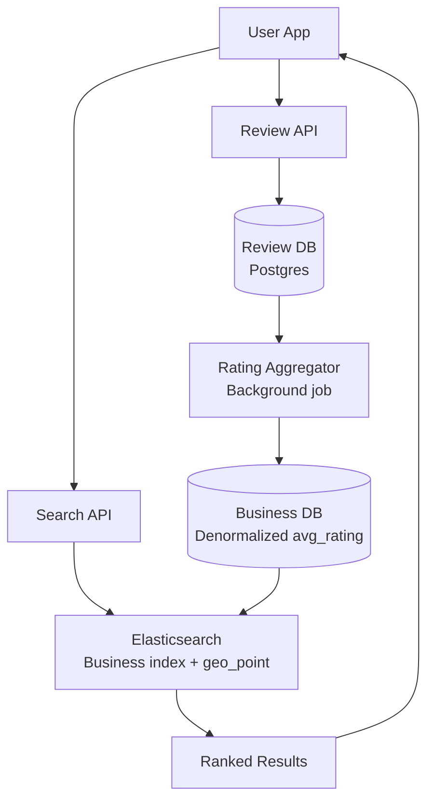

# Design Yelp — Location-Based Business Search

**Difficulty**: 🟡 Intermediate
**Reading Time**: Coming Soon
**Interview Frequency**: High

---

> 🚧 **Full article coming soon.** This stub gives you the essentials to start thinking about this problem.

---

## The Core Problem

Finding businesses near a location with filtering (cuisine, rating, price range) under 100ms requires an index structure that can efficiently query "all pizza restaurants within 2km of this lat/lng with rating > 4.0." A naive full-table scan across 100 million businesses takes seconds; a spatial index reduces this to milliseconds.

## Functional Requirements

- Search businesses by keyword near a geographic location
- Filter by category, rating, price range, hours
- View business details, photos, and reviews
- Add and read reviews with ratings
- "Near me" search using device location

## Non-Functional Requirements

| Requirement | Target |
|-------------|--------|
| Search latency | p99 < 100ms |
| Availability | 99.9% (8.7 hrs/year) |
| Scale | 100M businesses, 100M users, 10M searches/day |
| Review freshness | New reviews visible within 5 seconds |

## Back-of-Envelope Estimates

- **Search rate**: 10M searches/day ÷ 86,400 = ~116 searches/sec (peak 10x = 1,160/sec)
- **Businesses per geohash cell**: 100M businesses across Earth ÷ 1M geohash-6 cells = 100 businesses/cell avg (fast to scan)
- **Review storage**: 100M businesses × 50 reviews avg × 500 bytes = 2.5TB review corpus

## Key Design Decisions

1. **Geohash for Proximity Indexing** — encode lat/lng into a string prefix (e.g., geohash-6 = ~1.2km precision); index businesses by geohash; nearby search = query current cell + 8 neighbors (9 cells); all cells for a given precision have equal area.
2. **Quadtree as Alternative** — adaptive spatial subdivision; dense urban areas get more subdivisions than rural areas; better for uneven business density; used by Uber for driver locations; geohash is simpler and works well for static business data.
3. **Elasticsearch for Full-Text + Geo Hybrid** — business name/description in inverted index; location as geo_point field; Elasticsearch's `geo_distance` filter works alongside keyword filters; enables "italian restaurants within 2km" in a single query.

## High-Level Architecture

## Top Interview Questions for This Problem

| Question | Tests |
|----------|-------|
| What's the difference between geohash and quadtree? When would you choose each? | Spatial indexing trade-offs |
| How do you handle a search for "restaurants near me" when the user is at a geohash cell boundary? | Neighbor cells, border cases |
| How would you rank search results — what signals matter beyond proximity? | Relevance ranking, rating, recency |

## Related Concepts

- [Google Maps for routing and navigation on top of geospatial data](./google-maps)
- [Uber Backend for real-time geo-indexing of moving objects](../04-reservation-scheduling/uber-backend)

---

*📚 Full deep-dive with multiple approaches, trade-off tables, and pseudocode coming soon.*
