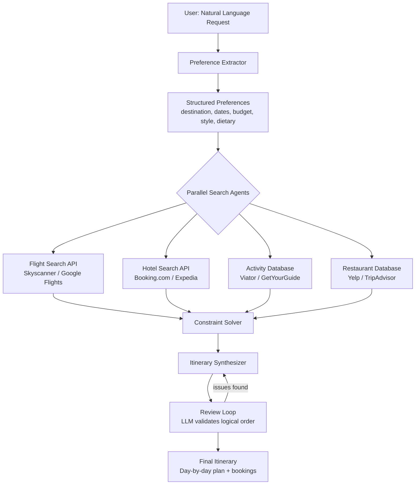
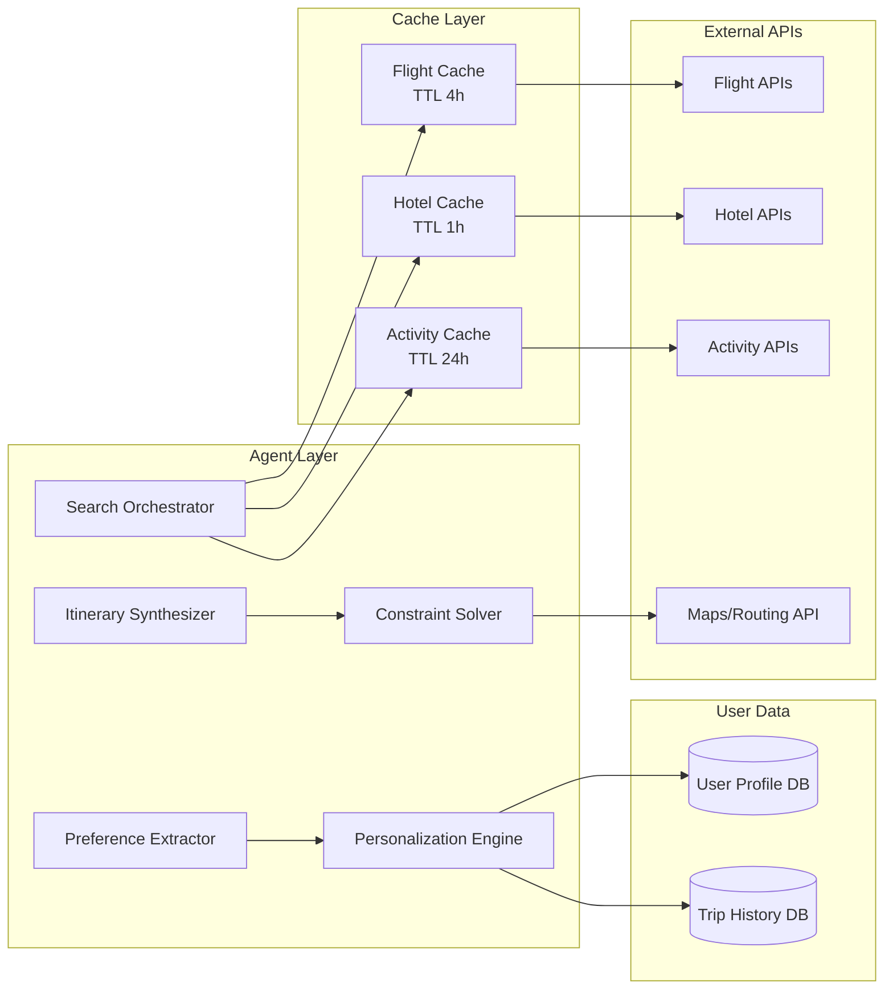
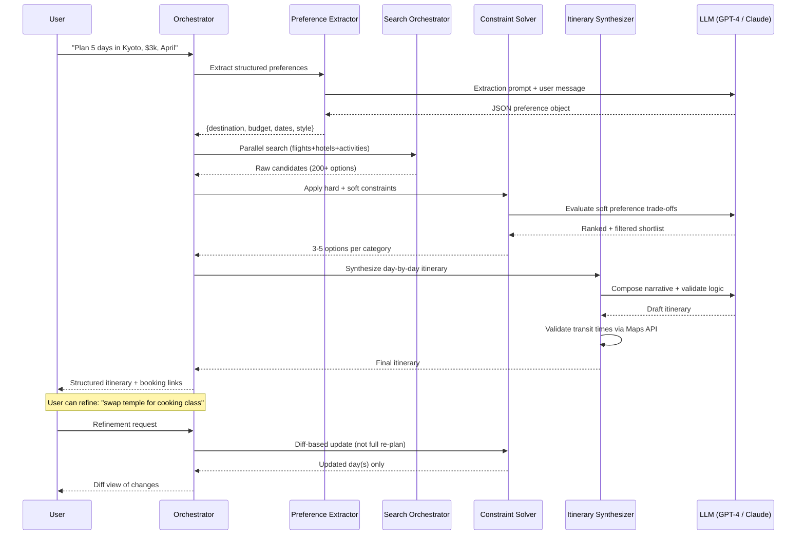
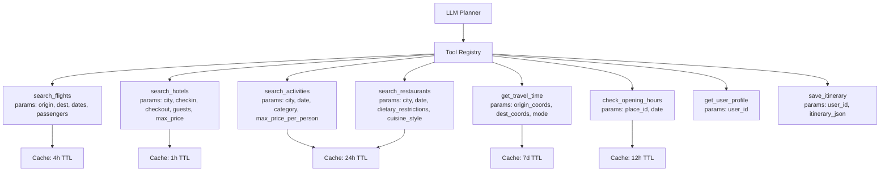

# Design an AI Travel Planning Agent — Multi-Source Search with Constraint Satisfaction

**Difficulty**: 🟢 Easy → 🟡 Intermediate
**Reading Time**: 20 minutes
**Interview Frequency**: Medium — good entry-level AI agent system design question

> **The hardest part of travel planning is not finding options — every API can return 100 hotels. The hard part is satisfying all constraints simultaneously: budget + timing + proximity + personal preferences — and explaining the trade-offs to the user.**

---

## Table of Contents

| Section | What You'll Learn |
|---------|-------------------|
| [Mental Model](#mental-model) | Preference extraction through itinerary delivery |
| [Requirements](#requirements) | Functional + non-functional targets |
| [Architecture](#architecture) | Multi-source search with parallel API calls |
| [Deep Dive: Preference Extraction](#deep-dive-preference-extraction) | Structured extraction from natural language |
| [Deep Dive: Constraint Solver](#deep-dive-constraint-solver) | Budget + timing + proximity optimization |
| [Deep Dive: Personalization](#deep-dive-personalization) | Learning from past trip history |
| [Failure Modes](#failure-modes) | API limits, stale pricing, impossible itineraries |
| [Interview Q&A](#interview-qa) | How to answer common questions |

---

## Mental Model

The user says: "Plan a 5-day trip to Kyoto for 2 people in April, budget $3,000, we love temples and good food, avoid tourist traps." The agent extracts structured preferences, searches flights + hotels + activities in parallel, runs constraint satisfaction to filter to the budget, and synthesizes a day-by-day itinerary with explanations.



---

## Requirements

### Functional Requirements

1. Accept natural language trip requests with preferences (destination, dates, budget, style)
2. Search flights, hotels, activities, and restaurants from multiple APIs
3. Apply hard constraints (budget, dates, dietary restrictions) and soft preferences (luxury vs budget, adventure vs relaxation)
4. Generate day-by-day itinerary with logical geographic routing (minimize backtracking)
5. Support iterative refinement ("swap the temple tour for a cooking class")
6. Learn from past trips to improve future recommendations
7. Provide booking links or direct booking integration

### Non-Functional Requirements

| Requirement | Target |
|-------------|--------|
| Initial response with options | < 10s P95 |
| Full itinerary generation | < 30s P95 |
| API call budget per request | < 50 external API calls |
| Price freshness | Within 24h for flights, 1h for hotels (peak season) |
| Booking link validity | Verify links within 1h of presenting to user |
| Concurrent users | 1,000 simultaneous planning sessions |

### Capacity Estimation

- 1,000 concurrent sessions × avg 30s active = 33 requests/second
- Per request: 5-10 API calls in parallel (flights, hotels, activities) = 165-330 external calls/second
- Rate limit concern: Skyscanner API limits at 100 calls/min → need caching layer

---

## Architecture



---

## Deep Dive: Preference Extraction

### Structured Extraction from Natural Language

The LLM extracts a typed preference object from free text. This structure drives all downstream decisions:

```
Input: "5 days in Kyoto in April for 2, $3k budget, love temples and food,
        allergic to shellfish, prefer boutique hotels not chains"

Extracted preferences:
{
  destination: { city: "Kyoto", country: "Japan" },
  dates: { flexible: true, month: "April", duration_days: 5 },
  travelers: { adults: 2, children: 0 },
  budget: {
    total_usd: 3000,
    breakdown: { flights: 1200, accommodation: 1200, activities: 400, food: 200 }
  },
  style: ["cultural", "food-focused"],
  avoid: ["tourist traps", "chain hotels"],
  dietary: ["no shellfish"],
  accommodation_preference: "boutique",
  pace: "moderate"    // inferred from "temples + food" vs "adventure sports"
}
```

**Edge case handling**:
- No budget specified → ask clarifying question before searching
- Ambiguous destination ("Paris" — Texas or France?) → ask
- Impossible date range (2-night trip across 3 days) → flag and ask
- Child mentioned implicitly ("family of 4, kids ages 6 and 9") → extract child ages for age-appropriate activity filtering

---

## Deep Dive: Constraint Solver

### Hard vs Soft Constraints

| Constraint Type | Examples | Behavior if violated |
|----------------|---------|---------------------|
| Hard | Budget exceeded, shellfish in restaurant | Exclude option entirely |
| Hard | Travel during closed dates (national holidays) | Exclude + notify user |
| Soft | Prefer boutique over chains | Penalize chains (lower ranking score) |
| Soft | Avoid tourist traps | Penalize high-tourist venues unless user highly rates them |
| Soft | Proximity (activities clustered by area) | Penalize options requiring long backtracking |

### Budget Allocation Algorithm

```
1. Total budget: $3,000 for 2 people
2. Mandatory costs first: cheapest viable flights within ±3 days of preferred dates
   → Flights found: $1,150 (round trip for 2)
3. Remaining: $1,850
4. Accommodation: 5 nights × target $180/night boutique = $900
   → Check availability in price range, adjust if needed
5. Remaining: $950
6. Activities + food: distribute $190/day
   → Activities: $100/day avg, food: $90/day avg
7. If total exceeds budget: trim soft preferences first
   (boutique → 3-star hotel, reduce paid activities)
8. If still over budget: notify user with trade-off options
```

### Geographic Routing Optimization

Activities are clustered by geographic proximity to minimize transit time:

```
Day 1: Northwest Kyoto (Arashiyama, Tenryu-ji, Bamboo Grove) — all within 1km
Day 2: Central Kyoto (Nijo Castle, Nishiki Market, Pontocho) — all within 2km
Day 3: Eastern Kyoto (Fushimi Inari, Kiyomizudera, Gion) — all within 3km
```

Using Google Maps Distance Matrix API to validate travel times between consecutive activities. Flag any day with > 2 hours total transit as "busy day" and offer to split or drop an activity.

---

## Deep Dive: Personalization

### User Profile Schema

```
User Profile:
{
  user_id: "usr-123",
  preferences_explicit: {
    dietary: ["vegetarian"],
    accommodation: "boutique",
    travel_style: ["cultural", "food"]
  },
  preferences_inferred: {
    preferred_airlines: ["ANA", "JAL"],    // from past bookings
    avg_spend_per_day: 180,                // from past trip costs
    activity_rating_history: {
      "temple_visit": 4.8,
      "cooking_class": 4.5,
      "group_tour": 2.1    // user consistently rates group tours low
    }
  },
  past_trips: [
    { destination: "Tokyo", year: 2023, rating: 5 },
    { destination: "Osaka", year: 2022, rating: 4 }
  ],
  blocked_vendors: ["Club Med"]    // from explicit feedback
}
```

### Preference Learning

After each trip, prompt user: "How was your experience? Rate each activity 1-5."

The ratings feed back into the profile:
- Consistently low-rated category → deprioritize in future recommendations
- Consistently high-rated style → increase weight for similar options
- Blocked vendor → never suggest again

Cold start for new users: use destination-level popularity scores (most-booked itineraries for Kyoto in April by similar demographics) with gradual personalization as history accumulates.

---

## Failure Modes

### 1. API Rate Limits from Booking Sites
**Scenario**: Skyscanner limits at 100 calls/min; during peak demand (January sale) 500 users search flights simultaneously
**Impact**: 80% of flight searches return stale cached data or timeout
**Mitigation**:
- Aggressive caching: flight prices for popular routes cached 4 hours, off-peak 24 hours
- Request batching: group city-pair searches and fetch all departure dates at once
- Fallback sources: if Skyscanner rate-limited, try Google Flights API, then Kayak API
- Queue + notify: if all sources exhausted, queue search and email user when results ready (< 5 min)

### 2. Outdated Pricing from Cache
**Scenario**: Hotel price from 4-hour-old cache is $180/night; actual current price is $350 (peak season surge)
**Impact**: User receives itinerary within budget, but actual booking costs 2× more
**Mitigation**:
- Price staleness warning: show "Prices last updated X hours ago" with each result
- Re-verify prices before presenting final itinerary (live call for shortlisted 3 hotels)
- Budget buffer: add 15% contingency to budget display ("We've reserved a 15% buffer for price changes")
- Alert on large variance: if re-verified price differs > 20% from cached, re-run constraint solver

### 3. Itinerary with Physically Impossible Travel Times
**Scenario**: Day 3 includes 9am temple in Arashiyama and 9:30am tea ceremony 8km away
**Impact**: User follows itinerary, misses half the activities, bad experience
**Mitigation**:
- Validate all consecutive activity pairs via Maps API: check transit time vs gap between end/start times
- Minimum buffer between activities: 30 minutes for walking-distance, 60 minutes otherwise
- If gap < minimum buffer: LLM re-orders activities or drops one with explanation
- Show travel time estimates in itinerary: "9:00am Temple (ends ~10:30am) → 20 min walk → 11:00am Tea Ceremony"

### 4. Restaurant Closed on Selected Day
**Scenario**: Recommended restaurant has a reservation for Tuesday but it's closed Tuesdays
**Impact**: User arrives to find it closed
**Mitigation**:
- Check opening hours from Google Places API for each selected restaurant
- Flag restaurants with limited hours in the UI: "Closed Mondays — we scheduled this on Tuesday"
- Re-verify opening hours 24 hours before trip date, send push notification if any changes

---

## Interview Q&A

### "How would you handle a user who changes their mind mid-planning ('actually, add a day trip to Nara')?"

> "I'd treat this as a diff operation on the existing itinerary rather than a full re-plan. First, validate the addition is feasible (Nara from Kyoto = 45 min by express train — yes). Then identify which day to insert it on: look at the lightest day by activity count and transit. Re-run the constraint solver just for that day to re-balance budget and timing. Update only the modified days in the itinerary, not the full plan. Show the user a diff view: 'Day 3 updated: removed X, added Nara. Budget impact: +$45.' This interactive approach is much faster than full re-generation and less disorienting for the user."

### "How do you handle conflicting constraints — user wants luxury hotels AND a $2,000 total budget for 7 days in Tokyo?"

> "I make the conflict explicit rather than silently degrading. After extraction, the constraint solver detects: 7 nights × $300/night luxury minimum = $2,100, which already exceeds total budget before flights or food. I return a constraint conflict explanation: 'With a $2,000 budget for 7 days in Tokyo, luxury accommodation would consume the full budget with nothing left for flights, food, or activities. Which matters more: (1) stay in a luxury hotel for 3 nights, (2) stay in 3-star hotels all 7 nights, or (3) reduce trip length to 4 days with luxury hotels?' Presenting concrete options rather than vague trade-offs gets faster resolution."

---

## Key Takeaways

| Number | What It Means |
|--------|--------------|
| **< 10s** | Initial options response time — use parallel API calls, not sequential |
| **50 external calls max** | Per planning request — aggressive caching prevents rate-limit hits |
| **15% budget buffer** | Price staleness contingency — prevent under-budget-then-over-budget shock |
| **30-60 min gap** | Minimum buffer between activities — prevents impossible itineraries |
| **3 fallback sources** | For each API category — any single source can go down |
| **Explicit conflict resolution** | Don't silently degrade; show trade-offs and let user choose |

---

## Agent Architecture

The travel planning agent operates as a multi-turn, tool-using LLM loop. Each user request triggers a structured agent cycle: plan tools to call, execute them in parallel where possible, evaluate results, decide whether to call more tools or synthesize the final answer.



The key design choice is keeping the LLM out of tool-execution hot paths. The LLM is only invoked for: (1) preference extraction, (2) soft constraint ranking, (3) narrative synthesis, and (4) validation of logical order. Raw API calls — flight search, hotel availability, Maps routing — are all executed by deterministic tool code, not the LLM. This keeps latency predictable and costs controllable.

---

## Tool/Function Registry

The agent has access to a registry of callable tools. Each tool is defined with a JSON Schema that the LLM uses to decide whether and how to call it.



**Tool selection logic**: The orchestrator determines which tools to call based on the preference object — it does not ask the LLM to pick tools for every step. The LLM is only asked to reason about ambiguous cases (e.g., "user said 'a few activities' — interpret as 2 or 3 per day?").

**Error handling when tools fail**:

| Failure Type | Detection | Fallback Strategy |
|-------------|-----------|-------------------|
| API timeout (>5s) | Deadline exceeded | Return cached data with staleness warning |
| Rate limit (429) | HTTP status | Try secondary provider, then queue |
| No results found | Empty response | Broaden constraints (expand date range ±2 days) |
| Price changed >20% | Re-verify on shortlist | Re-run constraint solver with updated prices |
| Restaurant closed | Opening hours mismatch | Auto-swap with nearest alternative, notify user |

**Tool call budget per session**: maximum 50 external API calls. Counter tracked at orchestrator level. If budget exhausted before itinerary is complete, the orchestrator switches to cache-only mode with clear staleness warnings.

---

## Prompt Engineering

### System Prompt Structure

The system prompt follows a strict instruction hierarchy. Outer layers constrain inner layers — user instructions cannot override safety or tool-use rules.

```
SYSTEM PROMPT (condensed example):

You are a travel planning assistant. Your job is to help users create 
day-by-day itineraries that satisfy their budget and preferences.

## Role and Boundaries
- You plan travel itineraries only. Decline unrelated requests politely.
- Never invent prices, opening hours, or availability. Use tool outputs only.
- If a constraint conflict is detected, surface it explicitly — do not silently degrade.

## Tool Usage Rules
- Always call get_user_profile before making recommendations.
- Call search_flights and search_hotels in parallel, not sequentially.
- After building a shortlist, always re-verify prices via live API call before 
  presenting final itinerary.
- Never present an itinerary where consecutive activities have < 30 min gap 
  without flagging it as "tight schedule."

## Output Format
- Return itinerary as structured JSON first, then render as markdown for display.
- Always include: activity name, start time, end time, cost estimate, booking link.
- Include a daily cost subtotal and running total against budget.

## Context Management
- If conversation exceeds 8 turns, summarize previous turns as a compact 
  preference snapshot and continue from there.
- User's stated preferences override inferred preferences when they conflict.
```

### Context Management Strategy

LLM context fills up quickly in multi-turn planning sessions. The agent uses a **rolling summary pattern**:
- Turns 1-4: full conversation history in context
- After turn 4: compress prior turns into a "preference snapshot" (< 200 tokens) that captures what was decided, what was rejected, and current itinerary state
- The snapshot is prepended to each new turn instead of full history
- This keeps token cost bounded at ~$0.02-0.05 per session regardless of length

---

## Failure Modes

### Hallucination

**When it happens**: The LLM generates plausible-sounding but fabricated information — a restaurant that doesn't exist, a flight time that's wrong, a temple described as "15 minutes from Kyoto Station" when it's 45 minutes.

**Detection strategies**:
1. **Grounding check**: Any factual claim (price, location, hours) must be sourced from a tool call result. Claims without a source are flagged.
2. **Consistency validation**: Cross-check generated transit times against Maps API output. If LLM says "5 min walk" but Maps API says 25 min, override the LLM.
3. **Entity validation**: Validate restaurant/hotel names against the IDs returned by search tools. If a name appears in narrative but not in search results, it's fabricated.

**Mitigation**: Enforce a "citations required" policy — the itinerary synthesizer must reference a tool call result ID for every specific fact. Any fact without a citation is replaced with "details TBC" and triggers a live tool call.

### Loop Detection

**When it happens**: The agent gets stuck in a refinement loop — "re-plan day 3" → constraint solver finds no valid options → asks LLM to relax constraints → LLM tightens them again → repeat.

**Detection**: Count refinement iterations per day. If a single day has been re-planned > 3 times in one session, the orchestrator breaks the loop.

**Resolution**:
1. Surface the conflict explicitly to the user: "We've tried 4 approaches for Day 3 and can't satisfy both proximity and budget. Which matters more?"
2. Offer a pre-computed fallback itinerary that sacrifices one constraint
3. Log the constraint pattern for offline analysis to improve future constraint solver rules

### Cost Control: Token Budget Management

| Stage | Token Usage | Cost Estimate |
|-------|------------|---------------|
| Preference extraction | ~500 input + 200 output | $0.002 |
| Soft constraint ranking (per category) | ~800 input + 300 output | $0.004 |
| Itinerary synthesis | ~2,000 input + 1,000 output | $0.012 |
| Validation pass | ~1,500 input + 200 output | $0.007 |
| **Total per session (GPT-4o pricing)** | **~6,000 tokens** | **~$0.025** |

**Hard token limits**: each LLM call has a max_tokens cap. If the context approaches the cap, the orchestrator compresses the candidate list (50 options → top 10 by score) before passing to the LLM.

**Early termination**: If the user hasn't interacted for > 60 seconds during multi-turn planning, the session is paused and state saved. Resuming uses the saved state rather than restarting — saving ~$0.015 per interrupted session.

---

## Production Considerations

### Latency Budget

Each planning session involves multiple LLM calls and external API calls. The latency budget must be carefully partitioned:

| Step | P50 | P95 | Notes |
|------|-----|-----|-------|
| Preference extraction (LLM) | 800ms | 1.5s | Single LLM call, low token count |
| Parallel API search (flights+hotels+activities) | 2.5s | 6s | Network-bound, run in parallel |
| Constraint solving + LLM ranking | 1.2s | 3s | LLM call with candidate list |
| Itinerary synthesis (LLM) | 1.5s | 4s | Largest LLM call, most output tokens |
| Maps API validation | 400ms | 1s | Batch call for all day-pairs |
| **Total E2E** | **~6s** | **~16s** | Well within 30s P95 target |

If any step exceeds its budget, the orchestrator has a **progressive disclosure** fallback: return partial results ("Here are your flight options while we finalize hotels...") rather than holding the full response until everything is ready.

### Cost Per Query

At GPT-4o pricing (~$0.005/1k input tokens, $0.015/1k output tokens):
- Typical session: $0.02-$0.05 per planning session
- Complex session (many refinements): up to $0.15
- At 10,000 sessions/day: $200-$500/day in LLM API costs
- Cache hit rate of 60% on API calls reduces external API costs by ~$150/day

### SLA Targets and Fallback to Non-AI Path

| SLA Tier | Response Time | AI Path | Fallback |
|----------|--------------|---------|----------|
| Initial acknowledgment | < 1s | Always AI | — |
| First results shown | < 10s | Parallel search | Show cached results if search slow |
| Full itinerary | < 30s | Full AI pipeline | Pre-generated template itinerary |
| If LLM unavailable | — | Circuit breaker triggers | Rule-based itinerary builder |

The **non-AI fallback** is a rules-based itinerary generator that uses popularity rankings and pre-defined day templates. It produces lower quality but always responds within 5 seconds. Users see a banner: "Using quick planner mode — AI planning temporarily unavailable."

---

## How Google Built Google Trips (and AI Overviews for Travel)

Google's travel AI effort provides one of the best-documented real examples of a multi-source, constraint-satisfying travel planning system at scale.

**Scale**: Google Flights processes over 5 billion flight price queries per day across its infrastructure. Google Hotels indexes 1.8 million properties with real-time price sync. Google Maps provides routing for 1 billion+ users monthly.

**Key architectural decision — Knowledge Graph anchoring**: Google does not rely on the LLM to know what exists. Instead, every entity (hotel, activity, restaurant) is first resolved against the Google Knowledge Graph, which has authoritative data (coordinates, hours, ratings, categories) for 1.5 billion places. The LLM operates over entity IDs, not free-text names. This eliminates hallucination about place facts entirely.

**Non-obvious choice — Semantic caching over exact-match caching**: When two users ask for "budget hotels in Kyoto near Gion" and "cheap accommodation Kyoto walking distance Gion," Google's system treats these as the same query via semantic embedding similarity, not string matching. This increases effective cache hit rate from ~20% (exact match) to ~65% (semantic match), reducing live API calls by 3×.

**Specific numbers from Google I/O 2024 Travel AI announcement**:
- AI Overviews for travel queries cover 200+ countries
- Sub-2 second response for itinerary suggestions
- 40% of travel searches now engage with AI-generated suggestions before clicking any result

**Source**: Google I/O 2024 keynote, Google Travel Blog (blog.google/products/travel/ai-travel-planning/), and Google Research publications on entity-grounded generation.

---

## Interview Angle

**What the interviewer is testing**: Whether you understand the boundary between AI-handled ambiguity (preference extraction, soft trade-offs, narrative synthesis) and deterministic-handled facts (prices, hours, routing). Strong candidates keep the LLM in the reasoning layer, not the data layer.

**Common mistakes candidates make**:

1. **Using the LLM to call tools sequentially instead of in parallel.** "First search flights, then search hotels..." — this adds 2-3s latency per step and puts you at 15-20s easily. The orchestrator should fire all independent searches simultaneously.

2. **Not accounting for price staleness.** Candidates design a caching layer but forget to re-verify shortlisted prices before presenting the final itinerary. The user books based on cached $180/night and finds $340 at checkout — this is a trust-destroying bug.

3. **Trusting the LLM for geographic facts.** "The LLM knows the transit time between Arashiyama and Fushimi Inari." No it doesn't — not reliably. Every transit time in the itinerary must come from a Maps API call, not LLM inference.

**The insight that separates good from great answers**: The best candidates propose a **constraint conflict escalation path** — instead of silently degrading (swap luxury hotel for budget without telling user), they surface the trade-off explicitly and let the user choose. This is the actual user experience differentiator. Any system can find hotels; only a good one tells you "luxury + $2k budget + 7 days in Tokyo is geometrically impossible — here are your three options."

---

## Key Numbers to Remember

| Metric | Value | Context |
|--------|-------|---------|
| Initial response SLA | < 10s P95 | Use parallel API calls, not sequential |
| Full itinerary SLA | < 30s P95 | With progressive disclosure fallback at 10s |
| External API call budget | 50 calls per session | Prevents rate-limit hits; enforced at orchestrator |
| Cache TTL — flights | 4 hours | Price changes more slowly for non-peak routes |
| Cache TTL — hotels | 1 hour | Peak-season surge pricing can change hourly |
| Cache TTL — activities | 24 hours | Activity availability rarely changes intraday |
| Semantic cache hit rate | ~65% | vs ~20% for exact-match caching (Google's approach) |
| Budget buffer | 15% contingency | Absorbs price staleness between search and booking |
| Min activity gap | 30 min walking / 60 min transit | Prevents physically impossible itineraries |
| LLM cost per session | $0.02-$0.15 | GPT-4o pricing; complex refinement sessions cost more |
| Concurrent sessions | 1,000 | At 33 req/s sustained; 165-330 external calls/s |
| Google Flights queries | 5 billion/day | Scale context for the production version of this problem |

---

## 📚 Resources & References

| Resource | Type | What You'll Learn |
|----------|------|------------------|
| [Booking.com AI Recommendations Architecture](https://booking.ai/what-does-it-take-to-build-a-large-scale-recommender-system-d6b08eb9b80e) | 📖 Blog | How Booking.com handles constraint satisfaction at 1.5M+ properties |
| [TripAdvisor Engineering: AI for Travel Planning](https://www.tripadvisor.com/engineering/) | 📖 Blog | Real-world multi-source search and ranking for travel |
| [AI Explained — Planning Agents](https://www.youtube.com/@AIExplained-official) | 📺 YouTube | How LLM planning agents handle constraint satisfaction |
| [Sam Witteveen — Building Travel Agents with LangChain](https://www.youtube.com/@samwitteveenai) | 📺 YouTube | Code walkthrough of multi-tool travel planning agent |
| [Lilian Weng — Planning with LLM Agents](https://lilianweng.github.io/posts/2023-06-23-agent/) | 📖 Blog | Task planning and decomposition strategies for AI agents |
| [Google Travel AI Blog](https://blog.google/products/travel/ai-travel-planning/) | 📚 Docs | How Google integrates AI into travel search and planning |
