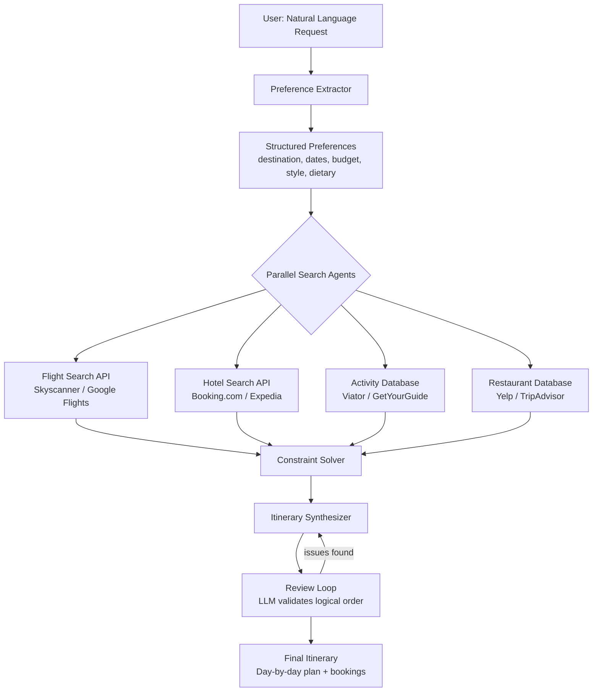
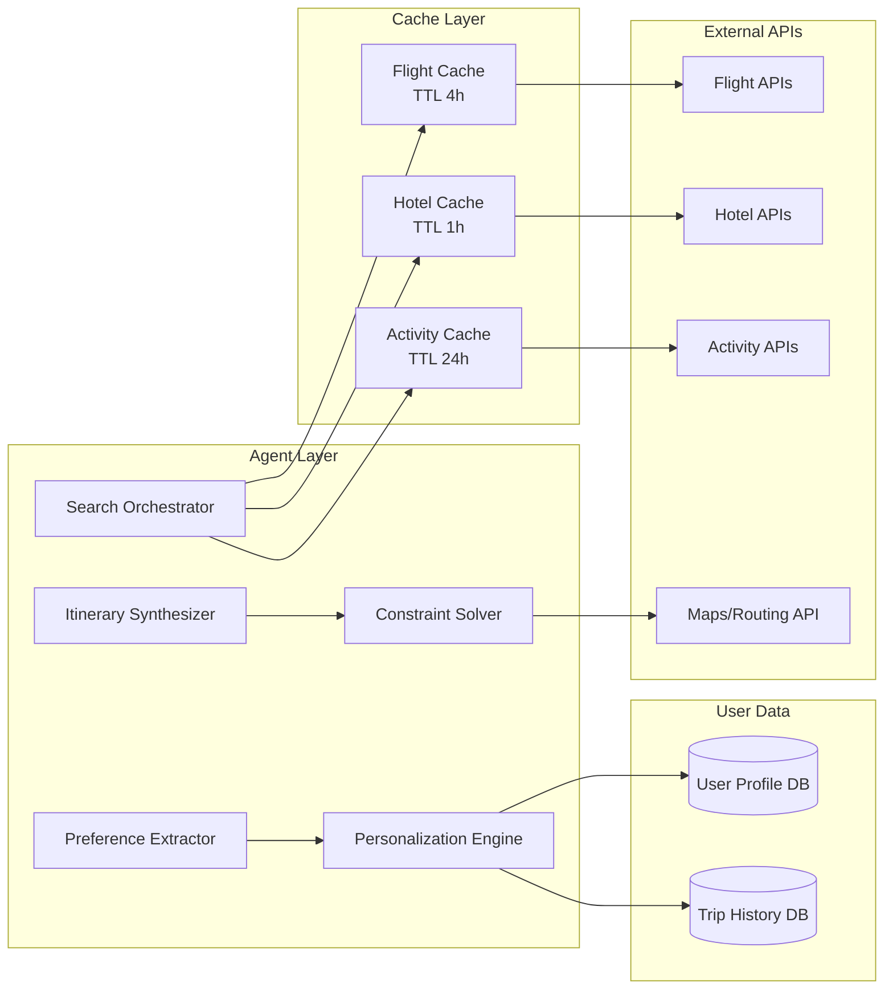

# Design an AI Travel Planning Agent — Multi-Source Search with Constraint Satisfaction

**Difficulty**: 🟢 Easy → 🟡 Intermediate
**Reading Time**: 20 minutes
**Interview Frequency**: Medium — good entry-level AI agent system design question

> **The hardest part of travel planning is not finding options — every API can return 100 hotels. The hard part is satisfying all constraints simultaneously: budget + timing + proximity + personal preferences — and explaining the trade-offs to the user.**

---

## Table of Contents

| Section | What You'll Learn |
|---------|-------------------|
| [Mental Model](#mental-model) | Preference extraction through itinerary delivery |
| [Requirements](#requirements) | Functional + non-functional targets |
| [Architecture](#architecture) | Multi-source search with parallel API calls |
| [Deep Dive: Preference Extraction](#deep-dive-preference-extraction) | Structured extraction from natural language |
| [Deep Dive: Constraint Solver](#deep-dive-constraint-solver) | Budget + timing + proximity optimization |
| [Deep Dive: Personalization](#deep-dive-personalization) | Learning from past trip history |
| [Failure Modes](#failure-modes) | API limits, stale pricing, impossible itineraries |
| [Interview Q&A](#interview-qa) | How to answer common questions |

---

## Mental Model

The user says: "Plan a 5-day trip to Kyoto for 2 people in April, budget $3,000, we love temples and good food, avoid tourist traps." The agent extracts structured preferences, searches flights + hotels + activities in parallel, runs constraint satisfaction to filter to the budget, and synthesizes a day-by-day itinerary with explanations.



---

## Requirements

### Functional Requirements

1. Accept natural language trip requests with preferences (destination, dates, budget, style)
2. Search flights, hotels, activities, and restaurants from multiple APIs
3. Apply hard constraints (budget, dates, dietary restrictions) and soft preferences (luxury vs budget, adventure vs relaxation)
4. Generate day-by-day itinerary with logical geographic routing (minimize backtracking)
5. Support iterative refinement ("swap the temple tour for a cooking class")
6. Learn from past trips to improve future recommendations
7. Provide booking links or direct booking integration

### Non-Functional Requirements

| Requirement | Target |
|-------------|--------|
| Initial response with options | < 10s P95 |
| Full itinerary generation | < 30s P95 |
| API call budget per request | < 50 external API calls |
| Price freshness | Within 24h for flights, 1h for hotels (peak season) |
| Booking link validity | Verify links within 1h of presenting to user |
| Concurrent users | 1,000 simultaneous planning sessions |

### Capacity Estimation

- 1,000 concurrent sessions × avg 30s active = 33 requests/second
- Per request: 5-10 API calls in parallel (flights, hotels, activities) = 165-330 external calls/second
- Rate limit concern: Skyscanner API limits at 100 calls/min → need caching layer

---

## Architecture



---

## Deep Dive: Preference Extraction

### Structured Extraction from Natural Language

The LLM extracts a typed preference object from free text. This structure drives all downstream decisions:

```
Input: "5 days in Kyoto in April for 2, $3k budget, love temples and food,
        allergic to shellfish, prefer boutique hotels not chains"

Extracted preferences:
{
  destination: { city: "Kyoto", country: "Japan" },
  dates: { flexible: true, month: "April", duration_days: 5 },
  travelers: { adults: 2, children: 0 },
  budget: {
    total_usd: 3000,
    breakdown: { flights: 1200, accommodation: 1200, activities: 400, food: 200 }
  },
  style: ["cultural", "food-focused"],
  avoid: ["tourist traps", "chain hotels"],
  dietary: ["no shellfish"],
  accommodation_preference: "boutique",
  pace: "moderate"    // inferred from "temples + food" vs "adventure sports"
}
```

**Edge case handling**:
- No budget specified → ask clarifying question before searching
- Ambiguous destination ("Paris" — Texas or France?) → ask
- Impossible date range (2-night trip across 3 days) → flag and ask
- Child mentioned implicitly ("family of 4, kids ages 6 and 9") → extract child ages for age-appropriate activity filtering

---

## Deep Dive: Constraint Solver

### Hard vs Soft Constraints

| Constraint Type | Examples | Behavior if violated |
|----------------|---------|---------------------|
| Hard | Budget exceeded, shellfish in restaurant | Exclude option entirely |
| Hard | Travel during closed dates (national holidays) | Exclude + notify user |
| Soft | Prefer boutique over chains | Penalize chains (lower ranking score) |
| Soft | Avoid tourist traps | Penalize high-tourist venues unless user highly rates them |
| Soft | Proximity (activities clustered by area) | Penalize options requiring long backtracking |

### Budget Allocation Algorithm

```
1. Total budget: $3,000 for 2 people
2. Mandatory costs first: cheapest viable flights within ±3 days of preferred dates
   → Flights found: $1,150 (round trip for 2)
3. Remaining: $1,850
4. Accommodation: 5 nights × target $180/night boutique = $900
   → Check availability in price range, adjust if needed
5. Remaining: $950
6. Activities + food: distribute $190/day
   → Activities: $100/day avg, food: $90/day avg
7. If total exceeds budget: trim soft preferences first
   (boutique → 3-star hotel, reduce paid activities)
8. If still over budget: notify user with trade-off options
```

### Geographic Routing Optimization

Activities are clustered by geographic proximity to minimize transit time:

```
Day 1: Northwest Kyoto (Arashiyama, Tenryu-ji, Bamboo Grove) — all within 1km
Day 2: Central Kyoto (Nijo Castle, Nishiki Market, Pontocho) — all within 2km
Day 3: Eastern Kyoto (Fushimi Inari, Kiyomizudera, Gion) — all within 3km
```

Using Google Maps Distance Matrix API to validate travel times between consecutive activities. Flag any day with > 2 hours total transit as "busy day" and offer to split or drop an activity.

---

## Deep Dive: Personalization

### User Profile Schema

```
User Profile:
{
  user_id: "usr-123",
  preferences_explicit: {
    dietary: ["vegetarian"],
    accommodation: "boutique",
    travel_style: ["cultural", "food"]
  },
  preferences_inferred: {
    preferred_airlines: ["ANA", "JAL"],    // from past bookings
    avg_spend_per_day: 180,                // from past trip costs
    activity_rating_history: {
      "temple_visit": 4.8,
      "cooking_class": 4.5,
      "group_tour": 2.1    // user consistently rates group tours low
    }
  },
  past_trips: [
    { destination: "Tokyo", year: 2023, rating: 5 },
    { destination: "Osaka", year: 2022, rating: 4 }
  ],
  blocked_vendors: ["Club Med"]    // from explicit feedback
}
```

### Preference Learning

After each trip, prompt user: "How was your experience? Rate each activity 1-5."

The ratings feed back into the profile:
- Consistently low-rated category → deprioritize in future recommendations
- Consistently high-rated style → increase weight for similar options
- Blocked vendor → never suggest again

Cold start for new users: use destination-level popularity scores (most-booked itineraries for Kyoto in April by similar demographics) with gradual personalization as history accumulates.

---

## Failure Modes

### 1. API Rate Limits from Booking Sites
**Scenario**: Skyscanner limits at 100 calls/min; during peak demand (January sale) 500 users search flights simultaneously
**Impact**: 80% of flight searches return stale cached data or timeout
**Mitigation**:
- Aggressive caching: flight prices for popular routes cached 4 hours, off-peak 24 hours
- Request batching: group city-pair searches and fetch all departure dates at once
- Fallback sources: if Skyscanner rate-limited, try Google Flights API, then Kayak API
- Queue + notify: if all sources exhausted, queue search and email user when results ready (< 5 min)

### 2. Outdated Pricing from Cache
**Scenario**: Hotel price from 4-hour-old cache is $180/night; actual current price is $350 (peak season surge)
**Impact**: User receives itinerary within budget, but actual booking costs 2× more
**Mitigation**:
- Price staleness warning: show "Prices last updated X hours ago" with each result
- Re-verify prices before presenting final itinerary (live call for shortlisted 3 hotels)
- Budget buffer: add 15% contingency to budget display ("We've reserved a 15% buffer for price changes")
- Alert on large variance: if re-verified price differs > 20% from cached, re-run constraint solver

### 3. Itinerary with Physically Impossible Travel Times
**Scenario**: Day 3 includes 9am temple in Arashiyama and 9:30am tea ceremony 8km away
**Impact**: User follows itinerary, misses half the activities, bad experience
**Mitigation**:
- Validate all consecutive activity pairs via Maps API: check transit time vs gap between end/start times
- Minimum buffer between activities: 30 minutes for walking-distance, 60 minutes otherwise
- If gap < minimum buffer: LLM re-orders activities or drops one with explanation
- Show travel time estimates in itinerary: "9:00am Temple (ends ~10:30am) → 20 min walk → 11:00am Tea Ceremony"

### 4. Restaurant Closed on Selected Day
**Scenario**: Recommended restaurant has a reservation for Tuesday but it's closed Tuesdays
**Impact**: User arrives to find it closed
**Mitigation**:
- Check opening hours from Google Places API for each selected restaurant
- Flag restaurants with limited hours in the UI: "Closed Mondays — we scheduled this on Tuesday"
- Re-verify opening hours 24 hours before trip date, send push notification if any changes

---

## Interview Q&A

### "How would you handle a user who changes their mind mid-planning ('actually, add a day trip to Nara')?"

> "I'd treat this as a diff operation on the existing itinerary rather than a full re-plan. First, validate the addition is feasible (Nara from Kyoto = 45 min by express train — yes). Then identify which day to insert it on: look at the lightest day by activity count and transit. Re-run the constraint solver just for that day to re-balance budget and timing. Update only the modified days in the itinerary, not the full plan. Show the user a diff view: 'Day 3 updated: removed X, added Nara. Budget impact: +$45.' This interactive approach is much faster than full re-generation and less disorienting for the user."

### "How do you handle conflicting constraints — user wants luxury hotels AND a $2,000 total budget for 7 days in Tokyo?"

> "I make the conflict explicit rather than silently degrading. After extraction, the constraint solver detects: 7 nights × $300/night luxury minimum = $2,100, which already exceeds total budget before flights or food. I return a constraint conflict explanation: 'With a $2,000 budget for 7 days in Tokyo, luxury accommodation would consume the full budget with nothing left for flights, food, or activities. Which matters more: (1) stay in a luxury hotel for 3 nights, (2) stay in 3-star hotels all 7 nights, or (3) reduce trip length to 4 days with luxury hotels?' Presenting concrete options rather than vague trade-offs gets faster resolution."

---

## Key Takeaways

| Number | What It Means |
|--------|--------------|
| **< 10s** | Initial options response time — use parallel API calls, not sequential |
| **50 external calls max** | Per planning request — aggressive caching prevents rate-limit hits |
| **15% budget buffer** | Price staleness contingency — prevent under-budget-then-over-budget shock |
| **30-60 min gap** | Minimum buffer between activities — prevents impossible itineraries |
| **3 fallback sources** | For each API category — any single source can go down |
| **Explicit conflict resolution** | Don't silently degrade; show trade-offs and let user choose |

---

## 📚 Resources & References

| Resource | Type | What You'll Learn |
|----------|------|------------------|
| [Booking.com AI Recommendations Architecture](https://booking.ai/what-does-it-take-to-build-a-large-scale-recommender-system-d6b08eb9b80e) | 📖 Blog | How Booking.com handles constraint satisfaction at 1.5M+ properties |
| [TripAdvisor Engineering: AI for Travel Planning](https://www.tripadvisor.com/engineering/) | 📖 Blog | Real-world multi-source search and ranking for travel |
| [AI Explained — Planning Agents](https://www.youtube.com/@AIExplained-official) | 📺 YouTube | How LLM planning agents handle constraint satisfaction |
| [Sam Witteveen — Building Travel Agents with LangChain](https://www.youtube.com/@samwitteveenai) | 📺 YouTube | Code walkthrough of multi-tool travel planning agent |
| [Lilian Weng — Planning with LLM Agents](https://lilianweng.github.io/posts/2023-06-23-agent/) | 📖 Blog | Task planning and decomposition strategies for AI agents |
| [Google Travel AI Blog](https://blog.google/products/travel/ai-travel-planning/) | 📚 Docs | How Google integrates AI into travel search and planning |
