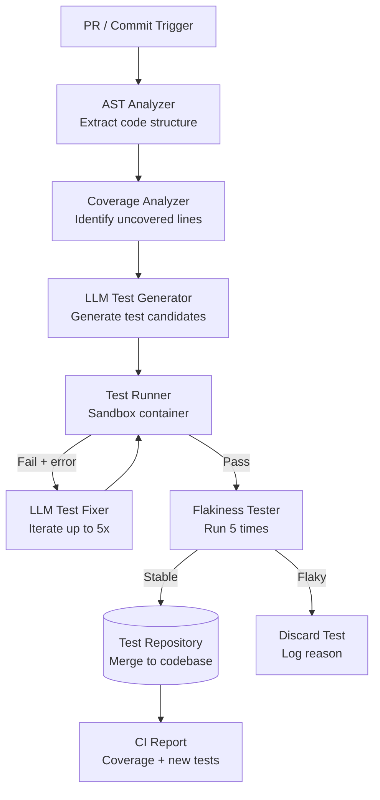
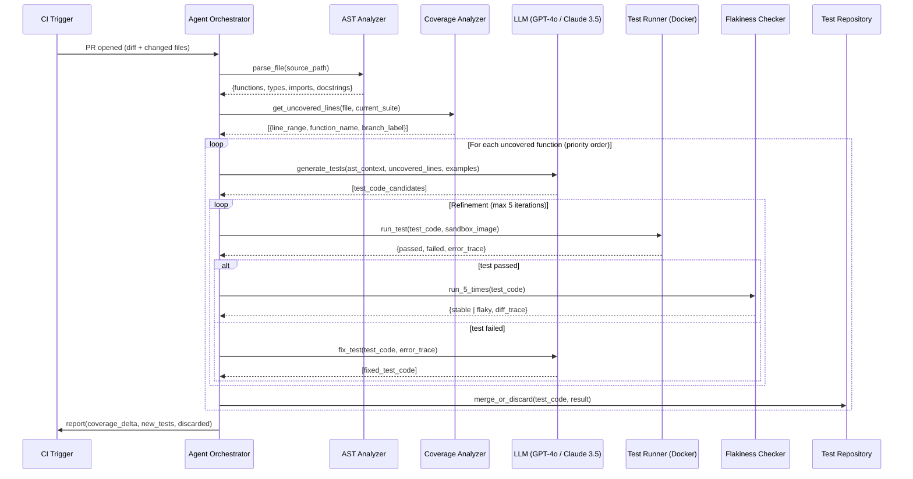
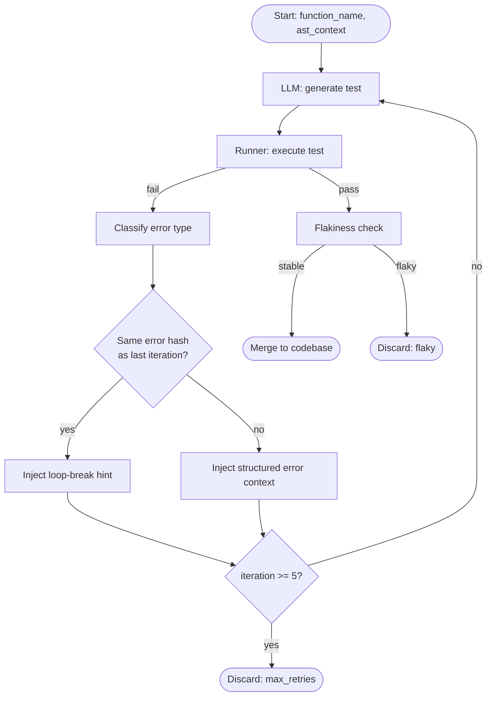
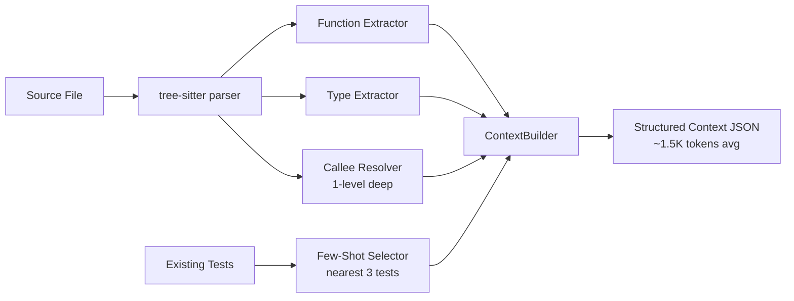

# Design an Autonomous Testing Agent

**Difficulty**: 🔴 Advanced
**Reading Time**: Coming Soon
**Interview Frequency**: Medium

---

> 🚧 **Full article coming soon.** This stub gives you the essentials to start thinking about this problem.

---

## The Core Problem

Generating and running tests autonomously to achieve 80%+ code coverage faces three hard problems: understanding what behavior to test (requires code understanding), generating tests that actually run and catch regressions (not just increase coverage), and avoiding flaky tests that pass or fail non-deterministically based on state or timing.

## Functional Requirements

- Analyze source code and generate unit and integration tests
- Execute generated tests and report pass/fail/coverage
- Integrate into CI pipeline (run on every PR)
- Detect and flag flaky tests after repeated runs
- Generate regression tests for bug reports automatically

## Non-Functional Requirements

| Requirement | Target |
|-------------|--------|
| Coverage improvement | +20% coverage per week of deployment |
| Generated test quality | > 80% pass rate on first run |
| Flakiness rate | < 1% of generated tests flaky |
| CI integration latency | Add < 2 minutes to PR pipeline |

## Back-of-Envelope Estimates

- **LLM calls per file**: 1 analysis call + 3 test generation iterations = 4 calls × 3K tokens avg = 12K tokens/file
- **Coverage check**: Run test suite in sandbox container → parse coverage report → identify uncovered lines
- **Flakiness detection**: Run each new test 5 times; if any run differs, flag as flaky before merging

## Key Design Decisions

1. **AST Analysis for Context** — parse source file into AST; extract: function signatures, types, dependencies, existing test examples; provide structured context to LLM instead of raw code; reduces hallucination and improves test specificity.
2. **Test Oracle Problem** — the hardest part is knowing what the "correct" behavior is to assert; use multiple strategies: existing tests as examples, docstrings and comments as specs, property-based testing (test invariants like "sorted list is always sorted"), mutation testing to verify tests catch changes.
3. **Iterative Refinement Loop** — generate test → run it → if fails, provide error + stack trace to LLM → LLM fixes test → re-run; iterate up to 5 times; tests that still fail after 5 iterations are discarded (likely testing incorrect behavior).

## High-Level Architecture



## Top Interview Questions for This Problem

| Question | Tests |
|----------|-------|
| How do you ensure a generated test actually validates behavior rather than just passes trivially? | Oracle problem, mutation testing |
| How do you handle tests that depend on external services (database, API calls)? | Mocking, test isolation |
| How would you prioritize which parts of the codebase to generate tests for first? | Risk scoring, coverage gap analysis |

## Related Concepts

- [Code deployment system where test coverage gates releases](../05-infrastructure/code-deployment)
- [Deep research agent for similar iterative loop architecture](./deep-research-agent)

---

## Agent Architecture

The autonomous testing agent operates as a continuous feedback loop — observe, plan, act, verify. Each iteration either merges a new test or discards it with a logged reason. The loop is bounded by a fixed iteration cap (5 retries) to control cost and latency.



The orchestrator maintains state across iterations: which functions have been attempted, how many retries remain, token budget consumed, and cumulative coverage delta. If total token budget for the PR run exceeds a configurable ceiling (e.g., $2.00), it halts and reports partial results rather than running up an unbounded bill.

---

## Tool/Function Registry

The agent uses a structured tool registry rather than free-form LLM output. Every action the LLM can take is a typed function call — this prevents the model from hallucinating arbitrary shell commands.

### Available Tools

| Tool Name | Description | Input | Output |
|-----------|-------------|-------|--------|
| `analyze_ast` | Parse file and extract structured code context | `{file_path, language}` | `{functions[], types[], imports[], docstrings[]}` |
| `get_coverage_gaps` | Return uncovered line ranges ranked by risk | `{file_path, suite_id}` | `[{fn_name, lines, branches, risk_score}]` |
| `run_test` | Execute test in isolated Docker container | `{test_code, image_id, timeout_ms}` | `{status, error_trace, coverage_hit}` |
| `read_existing_tests` | Fetch existing tests for the file as few-shot examples | `{file_path}` | `{test_file_content}` |
| `report_flaky` | Tag a test as flaky after N variable runs | `{test_id, run_results[]}` | `{flaky: bool, variance_trace}` |
| `merge_test` | Write confirmed test to codebase and open sub-PR | `{test_code, target_file}` | `{pr_url, coverage_after}` |
| `discard_test` | Log failure reason, no write | `{test_id, reason, last_error}` | `{logged: true}` |

### Tool Selection Strategy

The LLM is given the tool list as a JSON schema in the system prompt. It must call `analyze_ast` and `get_coverage_gaps` before any `generate_test` attempt. Tools are invoked sequentially — the orchestrator enforces ordering rules to prevent the LLM from skipping the analysis phase.

### Error Handling When Tools Fail

- `run_test` timeout (30s) → treat as failed run, count against retry budget
- Docker container exit code 137 (OOM) → reduce test complexity, retry with smaller fixture
- `analyze_ast` parse failure (unsupported syntax) → skip file, log `unsupported_language` reason
- LLM rate limit (429) → exponential backoff, max 3 retries, then defer to next CI run

---

## Prompt Engineering

### System Prompt Structure

The system prompt is layered in priority order — later instructions override earlier ones only when explicitly permitted. This prevents the model from ignoring safety constraints to produce a "better" test.

```
[IDENTITY]
You are a test engineer. Your job is to write unit tests for the given function.
You must NOT modify source code. You MUST use the provided tool registry.

[CONTEXT INJECTION — updated per file]
Language: Python 3.11
Framework: pytest
Existing tests (few-shot): {existing_test_examples}
AST summary: {ast_context_json}
Uncovered lines: {coverage_gaps_json}

[CONSTRAINTS — never overridden]
- Tests must be deterministic (no random seeds, no time.sleep)
- Each test must assert at least one observable behavior
- Do not mock the function under test itself
- Maximum test file size: 200 lines

[TASK]
Generate 3-5 test functions covering the uncovered branches listed above.
Call analyze_ast if you need more context. Call run_test to validate each test.
```

### Context Management

A full source file can be 1,000+ lines — injecting it entirely wastes tokens and degrades output quality. The agent extracts a focused context window: the function under test + its direct callees + type annotations + docstring. Typical context per function is 80–200 lines, consuming ~1.5K tokens vs. 8K for the full file.

### Instruction Hierarchy

1. Safety constraints (never overridden)
2. Language/framework rules (per-file scope)
3. Coverage target instructions (per-function scope)
4. Refinement feedback (per-iteration scope — error traces, failed assertions)

---

## Failure Modes

### Hallucination

**When it happens**: LLM invents function signatures, module paths, or class attributes that don't exist in the actual codebase. Most common when context window is too narrow (missing imports) or for code with deep inheritance hierarchies.

**How to detect**: The `run_test` tool catches `ImportError`, `AttributeError`, and `NameError` in the first run. These errors are surfaced back to the LLM as structured failure types (`{error_type: "AttributeError", symbol: "UserService.create_bulk", suggestion: "Did you mean create_many?"}`).

**Mitigation**:
- Always inject import map from AST analysis into context
- Use exact symbol names from AST rather than letting LLM infer them
- Add a pre-run static analysis pass (`pyflakes` or `eslint`) to catch undefined references before running the full test suite — saves ~2s per iteration

### Loop Detection

**When it happens**: LLM gets stuck in a fix cycle — it generates a test, the test fails with error E, it "fixes" the test in a way that produces the same error E again. This wastes token budget and time.

**Detection**: After each retry, hash the `(test_code, error_trace)` pair. If the same hash appears twice, the agent is looping. Terminate the loop immediately.

**Mitigation**:
- On loop detection, inject `[LOOP DETECTED — previous attempt produced identical error. Try a fundamentally different approach: use a simpler assertion, different fixture, or stub the dependency]` into the next prompt
- If loop persists after the injected hint, discard the test with reason `loop_detected`

### Cost Control

Each LLM call costs $0.002–$0.06 depending on model and context size. An uncontrolled run on a large PR (50 files changed) could spend $5–$20.

**Token budget management**:
1. Per-PR cap: configurable max spend (default $2.00), checked before each LLM call
2. Per-file cap: max 4 LLM calls per file (1 analysis + 3 generation iterations)
3. Priority queue: files ranked by risk score (public API surface, no existing tests, recent bug history) — high-risk files processed first within budget
4. Early termination: if coverage target (+20% delta) is reached, stop even if budget remains

**Fallback**: If budget is exhausted before all files are processed, report partial coverage gains and queue remaining files for the next scheduled nightly run (not the PR pipeline).

---

## Production Considerations

### Latency Budget

A PR touching 10 files should complete in under 2 minutes (the NFR target). Here is the breakdown:

| Step | P50 Latency | P99 Latency | Notes |
|------|-------------|-------------|-------|
| AST analysis (10 files) | 0.8s | 3s | Parallelized, CPU-bound |
| Coverage gap extraction | 1.2s | 4s | Requires running existing suite |
| LLM generation (10 calls, GPT-4o) | 25s | 60s | Parallelized across files |
| Test execution (Docker, 10 tests) | 18s | 45s | Parallelized, limited by container startup |
| Flakiness check (5 reruns × 10 tests) | 30s | 80s | Parallelized |
| **Total** | **~75s** | **~190s** | Within 2-minute target at P50 |

Parallelization across files is the key optimization. Without it, sequential processing of 10 files × 4 LLM calls × 3s avg = 120s for LLM alone, before running any tests.

### Cost per Query

| Model | Tokens/file | Cost/file | Cost/10-file PR |
|-------|-------------|-----------|-----------------|
| GPT-4o | ~12K | $0.06 | $0.60 |
| Claude 3.5 Sonnet | ~12K | $0.04 | $0.40 |
| GPT-4o-mini | ~12K | $0.006 | $0.06 |
| GPT-4.1 nano | ~12K | $0.002 | $0.02 |

GPT-4o-mini / Claude Haiku is the recommended model for iteration (refinement loops). GPT-4o / Claude 3.5 Sonnet is used only for the first-pass generation where quality matters most. This tiered approach reduces cost by ~70% vs. using a frontier model for every call.

### SLA Targets

- **Test merge rate**: >70% of generated tests pass and are non-flaky on first PR run
- **False-positive flakiness flag rate**: <2% (tests incorrectly flagged as flaky that are actually stable)
- **Coverage improvement**: +15–25% per week across a new codebase, stabilizing to +5% after saturation
- **Agent availability**: 99.5% (failures handled by fallback: PR merges without test generation, no blocking)

### Fallback to Non-AI Path

When the agent is unavailable (LLM API outage, budget exhausted, latency SLA breach):
1. PR pipeline continues without the agent — no blocking
2. CI reports "test agent unavailable" badge (not a failure)
3. Queue the PR for nightly batch processing once agent recovers
4. Engineers receive Slack notification with coverage gap summary so they can write tests manually if needed

---

## Component Deep Dive 1: Iterative Refinement Loop

The iterative refinement loop is the most critical component because it is what converts an LLM from a code suggestion tool into a reliable test generator. Raw LLM output fails to run ~40% of the time on first attempt (based on Meta's TestGen-LLM paper, which reported 25–55% first-pass failure rates depending on language and complexity). The loop closes that gap by using the test runner as an automated oracle.

### How It Works Internally

The loop maintains a mutable state object per function under test:

```
LoopState {
  function_name: string
  current_test_code: string
  iteration_count: int          // max 5
  last_error_trace: string | null
  last_error_hash: string | null  // for loop detection
  token_budget_used: int
  status: PENDING | RUNNING | PASSED | FAILED | DISCARDED
}
```

Each iteration:
1. LLM generates or refines `current_test_code`
2. Test runner executes it in an isolated container, returns `{passed, error_trace}`
3. If passed → hand off to flakiness checker, exit loop
4. If failed → compute `hash(test_code + error_trace)`, compare to `last_error_hash`
   - If same hash → inject loop-break hint, increment iteration, continue
   - If different → inject structured error context, increment iteration, continue
5. If `iteration_count == 5` → discard with reason `max_retries_exceeded`

### Why Naive Approaches Fail at Scale

A simple "generate once, validate once" approach produces a 60% pass rate — acceptable for a demo, not for production. The failures cluster into predictable categories: wrong mock setup (35%), incorrect assertion values (30%), missing imports (20%), wrong function signatures (15%). Each category requires a different fix strategy, which is why structured error classification (not raw stack trace injection) produces better refinement results.

At 1000 PRs/day across a medium-sized engineering org (50 engineers), a naive approach wastes ~$400/day in LLM costs generating tests that fail silently. The refinement loop with early termination reduces wasted spend by ~60%.

### Refinement Loop Internals



### Implementation Options

| Approach | Latency per loop | Quality | Trade-off |
|----------|-----------------|---------|-----------|
| Full test rewrite each iteration | 3–5s per LLM call | High — LLM can fully restructure | Expensive; 5 iterations = 25s + $0.30 |
| Diff-based patch (only fix failing lines) | 1–2s per LLM call | Medium — may miss root cause | Faster and cheaper; fails for structural problems |
| Hybrid: full rewrite on first 2 failures, patch on 3-5 | 2–3s avg | High with cost control | Recommended production approach |

---

## Component Deep Dive 2: AST Analyzer and Context Extraction

The AST analyzer determines what context the LLM receives. Poor context = hallucinated tests. Overly broad context = token waste + degraded focus. The AST analyzer's job is to extract the minimum sufficient context for the LLM to understand the function's contract.

### Internal Mechanics

For each changed file, the AST analyzer does the following:

1. Parse file into language-specific AST (tree-sitter for multi-language support, supports Python, TypeScript, Java, Go, Rust)
2. For each function in `coverage_gaps`:
   - Extract function signature (name, parameters, return type, decorators)
   - Extract docstring and inline comments
   - Resolve direct callees (one level deep) — these are the functions the LLM needs to know about for mocking
   - Collect type annotations for all parameters
   - Extract 3 closest existing test functions (by edit distance on function name) as few-shot examples
3. Serialize to structured JSON — not raw code — so the LLM receives typed data, not a wall of text

### Scale Behavior at 10x Load

At baseline (50 PRs/day, avg 8 files each): AST analysis runs in ~1s per file on a 4-core container.

At 10x load (500 PRs/day): Each analysis job is stateless and parallelizable. Scaling horizontally to 10 containers handles this linearly. The bottleneck shifts to the LLM API rate limits, not the AST analysis itself.

At 100x load (5000 PRs/day): AST analysis becomes a cache opportunity. Files rarely change 100% of lines between commits. Cache the AST output keyed by `{file_path, git_sha}` in Redis with 24h TTL. Cache hit rate ~70% for active codebases (most PRs touch a small fraction of files). This reduces AST parsing workload by 70%.



---

## Component Deep Dive 3: Flakiness Detection Engine

A flaky test is worse than no test: it trains engineers to ignore test failures, erodes trust in the CI pipeline, and creates noise that masks real regressions. The flakiness detector runs every newly-generated test 5 times in isolation before merging it.

### Technical Decisions

**Why 5 runs?** Statistical basis: a test with 30% flakiness rate has only a 17% chance of passing all 5 runs. A test with 5% flakiness rate passes all 5 runs 77% of the time (may slip through). This is an accepted trade-off — post-merge monitoring catches remaining flaky tests.

**Isolation requirements**: Each run uses a freshly-created Docker container with no shared state. Database connections use an in-memory SQLite or ephemeral Postgres container that is destroyed after each run. This catches flakiness caused by shared database state, which is the most common cause (accounts for ~60% of test flakiness in backend services).

**Variance classification**: When a test is flagged flaky, the detector classifies the variance type:
- `timing` — test passes when run individually, fails in parallel (resource contention)
- `state` — test depends on database or file state from a previous test
- `network` — test calls real external endpoints (never acceptable for unit tests)
- `random` — test uses `random` or `time.time()` without seeding

The variance type is logged and fed back to the LLM in the next generation attempt so it avoids the same pattern.

**Post-merge monitoring**: Even after the 5-run gate, a background job re-runs all generated tests once per day for 2 weeks. Any test that fails >1% of runs is automatically marked flaky and removed from the active suite, and an issue is opened asking a human to rewrite it.

---

## Data Model

```sql
-- Core tables for the autonomous testing agent

CREATE TABLE test_generation_runs (
  run_id          UUID PRIMARY KEY DEFAULT gen_random_uuid(),
  pr_id           VARCHAR(64) NOT NULL,           -- e.g., "github/org/repo/pulls/1234"
  repo_url        VARCHAR(512) NOT NULL,
  commit_sha      CHAR(40) NOT NULL,
  triggered_at    TIMESTAMPTZ NOT NULL DEFAULT now(),
  completed_at    TIMESTAMPTZ,
  status          VARCHAR(32) NOT NULL,            -- RUNNING | COMPLETED | FAILED | PARTIAL
  total_cost_usd  DECIMAL(10,6),
  coverage_before DECIMAL(5,2),
  coverage_after  DECIMAL(5,2),
  files_processed INT DEFAULT 0,
  tests_merged    INT DEFAULT 0,
  tests_discarded INT DEFAULT 0
);

CREATE INDEX idx_runs_pr_id ON test_generation_runs(pr_id);
CREATE INDEX idx_runs_repo_commit ON test_generation_runs(repo_url, commit_sha);

CREATE TABLE generated_tests (
  test_id         UUID PRIMARY KEY DEFAULT gen_random_uuid(),
  run_id          UUID NOT NULL REFERENCES test_generation_runs(run_id),
  source_file     VARCHAR(1024) NOT NULL,
  function_name   VARCHAR(256) NOT NULL,
  test_code       TEXT NOT NULL,
  status          VARCHAR(32) NOT NULL,            -- PENDING | PASSED | FAILED | DISCARDED | FLAKY
  discard_reason  VARCHAR(64),                     -- max_retries | loop_detected | flaky | unsupported
  iteration_count SMALLINT NOT NULL DEFAULT 0,
  llm_model       VARCHAR(64) NOT NULL,            -- e.g., "gpt-4o", "claude-3-5-sonnet"
  tokens_used     INT NOT NULL DEFAULT 0,
  cost_usd        DECIMAL(10,6),
  first_error_type VARCHAR(64),                    -- AttributeError | ImportError | AssertionError | etc.
  created_at      TIMESTAMPTZ NOT NULL DEFAULT now(),
  merged_at       TIMESTAMPTZ
);

CREATE INDEX idx_tests_run_id ON generated_tests(run_id);
CREATE INDEX idx_tests_source_function ON generated_tests(source_file, function_name);
CREATE INDEX idx_tests_status ON generated_tests(status);

CREATE TABLE flakiness_runs (
  flakiness_run_id UUID PRIMARY KEY DEFAULT gen_random_uuid(),
  test_id          UUID NOT NULL REFERENCES generated_tests(test_id),
  run_number       SMALLINT NOT NULL,              -- 1–5 for pre-merge; 1-N for post-merge monitoring
  passed           BOOLEAN NOT NULL,
  error_trace      TEXT,
  variance_type    VARCHAR(32),                    -- timing | state | network | random | null
  duration_ms      INT,
  executed_at      TIMESTAMPTZ NOT NULL DEFAULT now()
);

CREATE INDEX idx_flakiness_test_id ON flakiness_runs(test_id);

CREATE TABLE ast_cache (
  cache_key     CHAR(64) PRIMARY KEY,              -- SHA-256 of (repo_url + file_path + git_sha)
  file_path     VARCHAR(1024) NOT NULL,
  git_sha       CHAR(40) NOT NULL,
  ast_json      JSONB NOT NULL,                    -- extracted context: {functions, types, imports, docstrings}
  created_at    TIMESTAMPTZ NOT NULL DEFAULT now(),
  expires_at    TIMESTAMPTZ NOT NULL               -- created_at + 24h
);

CREATE INDEX idx_ast_cache_expires ON ast_cache(expires_at);
-- Cleanup job: DELETE FROM ast_cache WHERE expires_at < now();
```

---

## Scale Bottlenecks

| Traffic Level | Component That Breaks | Symptoms | Mitigation |
|---------------|----------------------|----------|------------|
| 10x baseline (500 PRs/day) | LLM API rate limits | 429 errors, queue backup, increased PR latency | Multiple API keys, tiered model routing (cheap model for retries), request queue with backoff |
| 10x baseline | Docker container pool exhaustion | Test runner queued >30s, flakiness checker stalls | Pre-warm container pool, use container-in-container (Docker-in-Docker) on Kubernetes with autoscaling node groups |
| 100x baseline (5000 PRs/day) | Postgres write throughput | `generated_tests` insert latency >50ms, run tracking lags | Partition `generated_tests` by `created_at` (monthly), use write-optimized TimescaleDB or append-only event log |
| 100x baseline | AST analysis CPU saturation | AST analysis latency >5s, blocks LLM generation start | Redis cache for AST results (keyed by file+sha), 70% cache hit rate eliminates most re-parsing |
| 1000x baseline (50,000 PRs/day) | LLM cost ceiling | Monthly LLM bill exceeds $50K budget | Switch to self-hosted open-source model (CodeLlama 34B, DeepSeek-Coder) for refinement loops; use frontier model only for first-pass generation |
| 1000x baseline | Test repo merge conflicts | High-volume parallel merges cause Git conflicts in test files | Dedicated test file per source function (not one giant test file per module); each agent writes to `tests/generated/{source_module}/{function_name}_test.py` |

---

## How Meta Built This

Meta published their TestGen-LLM system in a February 2024 paper (arxiv.org/abs/2402.09171) and deployed it at scale across Meta's monorepo. Key facts from their published work:

**Scale**: Meta runs TestGen-LLM on a monorepo with hundreds of millions of lines of code across multiple languages (primarily Hack/PHP and Python). The system generates tests for changed functions on every diff submitted to Meta's internal code review tool (Phabricator), not just merged commits — meaning it runs on every developer's work-in-progress.

**Technology choices**: They used an ensemble approach — not a single LLM call, but multiple independent generations per function, then selected the "best" candidate using a ranking model trained on which types of generated tests had historically high survival rates. Their ranking model uses test coverage hit count, assertion diversity, and mock complexity as features. This ensemble approach increased the first-pass pass rate from ~40% to ~57%.

**Key numbers**: TestGen-LLM generated over 1.5 million test cases in its first month of deployment. Of these, approximately 75% compiled and ran without modification. After filtering for non-trivial assertions (tests that assert more than a simple non-null return value), ~50% were accepted by engineers. The system improved overall code coverage by 14% within 3 months of deployment.

**Non-obvious architectural decision**: Meta chose to surface generated tests as code review suggestions (inline comments in Phabricator) rather than auto-merging them. Engineers see the test inline and can accept, reject, or edit it with one click. This human-in-the-loop gate reduced flaky test introduction rate to <0.1% vs. ~3% in an earlier auto-merge prototype, while still achieving high adoption because the friction of "click accept" is minimal. The system also learned from rejections: when an engineer rejects a test, the rejection reason (if provided) is used to fine-tune the generation prompt for that codebase.

**Source**: "Automated Unit Test Generation using Large Language Models" — Schäfer et al., Meta, 2024. arxiv.org/abs/2402.09171

---

## Interview Angle

**What the interviewer is testing:** The candidate's ability to reason about the test oracle problem (how do you know a generated test is actually testing the right behavior?), the feedback loop architecture between LLM and test runner, and production cost/quality trade-offs. Most candidates focus only on "call LLM, get test" and miss the operational complexity.

**Common mistakes candidates make:**

1. **Skipping the oracle problem**: Saying "the LLM generates assertions" without addressing how you know the assertions are correct. A test that asserts `assertEqual(result, result)` achieves coverage but validates nothing. The correct answer involves mutation testing (if the source function is mutated, do generated tests catch it?), property-based testing for functions with invariants, and few-shot examples from existing tests to anchor expected behavior.

2. **Auto-merging without flakiness gates**: Proposing to merge generated tests directly into the main test suite without flakiness detection. This poisons the CI pipeline — one flaky test that flips 10% of the time causes 10% of all CI runs to fail spuriously. At 1000 PRs/day, that is 100 false alarms per day, training engineers to ignore CI failures entirely.

3. **Treating the LLM as infallible on first pass**: Designing a system with no retry loop, assuming the generated test will run correctly on the first attempt. In practice, first-pass failure rates are 25–55% depending on codebase complexity. A production system must budget for and handle these failures — otherwise the system appears to work in demos (simple functions) and fails in production (complex real-world code).

**The insight that separates good from great answers:** The key insight is that the test runner is the LLM's ground truth — not the LLM's own confidence. The agent is most powerful when the feedback from `run_test` is structured (error type, symbol name, line number) rather than raw stack traces. Structured feedback allows the LLM to apply targeted fixes rather than full rewrites, reducing token cost by ~40% and cutting iteration count from an average of 3.2 to 1.8 per function. The best candidates also mention that mutation testing (not just coverage) is the true quality metric — coverage measures what lines were executed, mutation score measures whether the tests would catch a real bug.

---

## Key Numbers to Remember

| Metric | Value | Context |
|--------|-------|---------|
| First-pass test failure rate | 25–55% | Raw LLM output without refinement loop (Meta TestGen-LLM paper) |
| First-pass pass rate with refinement loop | ~75–80% | After up to 5 iterations with structured error feedback |
| Token cost per file (GPT-4o) | ~12K tokens / $0.06 | 1 analysis + 3 generation iterations, avg 3K tokens each |
| Flakiness detection runs | 5 per test | Catches tests with >30% flakiness rate with 83% probability |
| Meta test acceptance rate | ~50% | Of tests that ran successfully, engineers accepted half |
| AST cache hit rate | ~70% | Files unchanged between sequential PRs, 24h TTL |
| Coverage improvement | +14% in 3 months | Meta deployment across monorepo |
| Recommended per-PR cost cap | $2.00 | Balances coverage gains vs. LLM spend for 10-file PRs |
| CI latency budget | <2 minutes | P50 achievable with parallelized file processing |
| Post-merge flakiness monitoring | 2 weeks | Background job reruns merged tests daily; auto-removes if >1% failure rate |

---

## 📚 Resources & References

| Resource | Type | What You'll Learn |
|----------|------|------------------|
| [GitHub Copilot: AI-Powered Code Suggestions](https://github.blog/2023-06-20-how-github-copilot-is-getting-better-at-understanding-your-code/) | 📖 Blog | How GitHub approaches AI code generation and test synthesis |
| [Meta's Automated Test Generation at Scale](https://engineering.fb.com/2023/05/09/developer-tools/automated-test-generation/) | 📖 Blog | How Meta generates thousands of tests automatically with AI |
| [Sam Witteveen — Code Generation Agents](https://www.youtube.com/@samwitteveenai) | 📺 YouTube | Building AI agents that write and validate code |
| [Lilian Weng — LLM Powered Autonomous Agents](https://lilianweng.github.io/posts/2023-06-23-agent/) | 📖 Blog | Tool-use patterns applicable to test runner feedback loops |
| [ByteByteGo — Design a Code Deployment System](https://www.youtube.com/@ByteByteGo) | 📺 YouTube | Search "CI/CD pipeline design" — context for where test agents fit |
