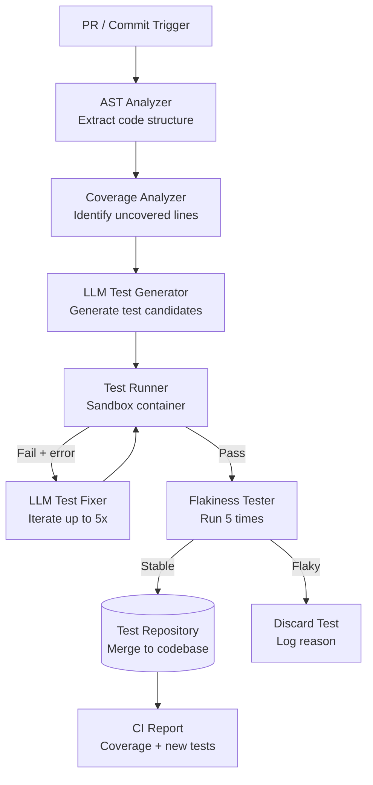

# Design an Autonomous Testing Agent

**Difficulty**: 🔴 Advanced
**Reading Time**: Coming Soon
**Interview Frequency**: Medium

---

> 🚧 **Full article coming soon.** This stub gives you the essentials to start thinking about this problem.

---

## The Core Problem

Generating and running tests autonomously to achieve 80%+ code coverage faces three hard problems: understanding what behavior to test (requires code understanding), generating tests that actually run and catch regressions (not just increase coverage), and avoiding flaky tests that pass or fail non-deterministically based on state or timing.

## Functional Requirements

- Analyze source code and generate unit and integration tests
- Execute generated tests and report pass/fail/coverage
- Integrate into CI pipeline (run on every PR)
- Detect and flag flaky tests after repeated runs
- Generate regression tests for bug reports automatically

## Non-Functional Requirements

| Requirement | Target |
|-------------|--------|
| Coverage improvement | +20% coverage per week of deployment |
| Generated test quality | > 80% pass rate on first run |
| Flakiness rate | < 1% of generated tests flaky |
| CI integration latency | Add < 2 minutes to PR pipeline |

## Back-of-Envelope Estimates

- **LLM calls per file**: 1 analysis call + 3 test generation iterations = 4 calls × 3K tokens avg = 12K tokens/file
- **Coverage check**: Run test suite in sandbox container → parse coverage report → identify uncovered lines
- **Flakiness detection**: Run each new test 5 times; if any run differs, flag as flaky before merging

## Key Design Decisions

1. **AST Analysis for Context** — parse source file into AST; extract: function signatures, types, dependencies, existing test examples; provide structured context to LLM instead of raw code; reduces hallucination and improves test specificity.
2. **Test Oracle Problem** — the hardest part is knowing what the "correct" behavior is to assert; use multiple strategies: existing tests as examples, docstrings and comments as specs, property-based testing (test invariants like "sorted list is always sorted"), mutation testing to verify tests catch changes.
3. **Iterative Refinement Loop** — generate test → run it → if fails, provide error + stack trace to LLM → LLM fixes test → re-run; iterate up to 5 times; tests that still fail after 5 iterations are discarded (likely testing incorrect behavior).

## High-Level Architecture

## Top Interview Questions for This Problem

| Question | Tests |
|----------|-------|
| How do you ensure a generated test actually validates behavior rather than just passes trivially? | Oracle problem, mutation testing |
| How do you handle tests that depend on external services (database, API calls)? | Mocking, test isolation |
| How would you prioritize which parts of the codebase to generate tests for first? | Risk scoring, coverage gap analysis |

## Related Concepts

- [Code deployment system where test coverage gates releases](../05-infrastructure/code-deployment)
- [Deep research agent for similar iterative loop architecture](./deep-research-agent)

---

*📚 Full deep-dive with multiple approaches, trade-off tables, and pseudocode coming soon.*

## 📚 Resources & References

| Resource | Type | What You'll Learn |
|----------|------|------------------|
| [GitHub Copilot: AI-Powered Code Suggestions](https://github.blog/2023-06-20-how-github-copilot-is-getting-better-at-understanding-your-code/) | 📖 Blog | How GitHub approaches AI code generation and test synthesis |
| [Meta's Automated Test Generation at Scale](https://engineering.fb.com/2023/05/09/developer-tools/automated-test-generation/) | 📖 Blog | How Meta generates thousands of tests automatically with AI |
| [Sam Witteveen — Code Generation Agents](https://www.youtube.com/@samwitteveenai) | 📺 YouTube | Building AI agents that write and validate code |
| [Lilian Weng — LLM Powered Autonomous Agents](https://lilianweng.github.io/posts/2023-06-23-agent/) | 📖 Blog | Tool-use patterns applicable to test runner feedback loops |
| [ByteByteGo — Design a Code Deployment System](https://www.youtube.com/@ByteByteGo) | 📺 YouTube | Search "CI/CD pipeline design" — context for where test agents fit |
